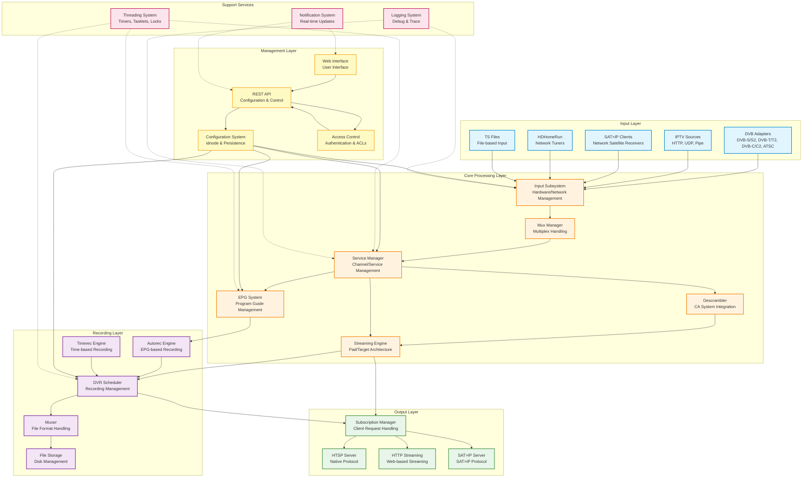

[← Back to Table of Contents](00-TOC.md)

## 2. High-Level Architecture

### 2.1 System Overview

Tvheadend is designed as a modular, multi-threaded streaming server that sits between TV input sources and client applications. At its core, it implements a sophisticated streaming pipeline that receives broadcast streams from various sources, processes and optionally descrambles them, and distributes the content to multiple clients simultaneously while also supporting recording to disk.

The architecture follows several key patterns:
- **Layered design**: Clear separation between input acquisition, core processing, and output distribution
- **Plugin-based inputs**: Extensible input system supporting multiple hardware and network sources
- **Streaming pad/target pattern**: Flexible data flow mechanism allowing multiple consumers of the same stream
- **Event-driven processing**: Asynchronous event handling with timer-based and message-based coordination
- **Configuration as code**: All configuration objects inherit from a common base (idnode) enabling automatic API generation and persistence

The system is built around a central event loop with multiple specialized threads handling different aspects of operation (input processing, timer management, logging, HTTP serving, etc.). Synchronization is primarily managed through a global lock with additional per-subsystem locks for performance-critical paths.

### 2.2 Architecture Diagram

The following diagram illustrates the major subsystems and their relationships:



**Key Data Flows:**

1. **Live Streaming Path**: Input → Mux → Service → Descrambler → Streaming Engine → Subscription → Output Protocol → Client
2. **Recording Path**: Input → Service → Streaming Engine → DVR Scheduler → Muxer → Storage
3. **EPG Path**: Input (OTA) / External Grabber → EPG System → Channels → Web UI / API
4. **Configuration Path**: Web UI → API → Configuration System → Subsystems

### 2.3 Core Design Principles

Tvheadend's architecture is built on several fundamental design principles that guide its implementation:

#### 2.3.1 Modular Architecture

The system is divided into loosely coupled subsystems, each with well-defined responsibilities:
- **Input subsystem**: Handles all aspects of receiving streams from various sources
- **Service management**: Manages the lifecycle and state of TV services/channels
- **Streaming engine**: Provides the data distribution mechanism
- **DVR subsystem**: Handles all recording-related functionality
- **EPG subsystem**: Manages program guide data
- **API/HTTP server**: Provides external interfaces for control and streaming

This modularity allows:
- Independent development and testing of subsystems
- Easier debugging and maintenance
- Flexibility to add new features without affecting existing code
- Clear boundaries for code ownership and review

#### 2.3.2 Plugin-Based Input System

The input subsystem uses an object-oriented approach (implemented in C) with a class hierarchy:

```
tvh_hardware (base class)
  ├─ linuxdvb_adapter (DVB hardware)
  ├─ iptv_network (IPTV sources)
  ├─ satip_client (SAT>IP clients)
  └─ tvhdhomerun_device (HDHomeRun)
```

Each input type implements a common interface, allowing the core system to work with any input source without knowing its specific implementation. New input types can be added by:
1. Implementing the required interface methods
2. Registering the input type with the input subsystem
3. Providing configuration UI elements

This design enables support for diverse hardware and network sources while maintaining a consistent internal API.

#### 2.3.3 Streaming Pad/Target Pattern

The streaming architecture uses a publisher-subscriber pattern implemented through "pads" and "targets":

**Streaming Pad** (`streaming_pad_t`):
- Acts as a data source (publisher)
- Maintains a list of connected targets (subscribers)
- Delivers streaming messages to all connected targets
- Each service has exactly one streaming pad

**Streaming Target** (`streaming_target_t`):
- Acts as a data consumer (subscriber)
- Implements a callback function to receive messages
- Can filter which message types it receives
- Examples: client subscriptions, DVR recordings, stream analyzers

**Benefits:**
- **One-to-many distribution**: A single service can stream to multiple clients simultaneously
- **Flexible data flow**: New consumers can be added without modifying the source
- **Decoupling**: Sources don't need to know about consumer implementation details
- **Message filtering**: Consumers only receive relevant messages

**Example flow:**
```
Service Pad → [Target: Subscription 1 → HTSP Client]
           → [Target: Subscription 2 → HTTP Client]
           → [Target: DVR Recording → File]
           → [Target: Stream Analyzer → Statistics]
```

#### 2.3.4 Configuration Persistence Approach

Tvheadend uses a sophisticated configuration system based on the `idnode` (ID Node) pattern:

**idnode System:**
- All configuration objects inherit from `idnode_t` base class
- Each object has a unique UUID for identification
- Properties are described through metadata (type, validation, UI hints)
- Automatic serialization to/from JSON
- Change tracking and notification
- Automatic API endpoint generation

**Benefits:**
- **Consistency**: All configuration objects behave the same way
- **Automatic UI generation**: Web interface automatically adapts to object properties
- **Type safety**: Property metadata enables validation
- **Persistence**: Objects automatically save/load from disk
- **API generation**: REST API endpoints created automatically
- **Change notifications**: UI updates in real-time when configuration changes

**Storage:**
- Configuration stored in JSON files under the configuration directory (typically `/home/hts/.hts/tvheadend/`)
- Hierarchical directory structure mirrors object relationships
- Atomic writes with backup mechanism
- Migration support for version upgrades

**Example:**
```
~/.hts/tvheadend/
  ├─ input/
  │   ├─ linuxdvb/
  │   │   └─ adapters/
  │   │       └─ <uuid>/
  │   │           └─ config
  │   └─ iptv/
  │       └─ networks/
  │           └─ <uuid>/
  │               └─ config
  ├─ channel/
  │   └─ config/
  │       └─ <uuid>
  └─ dvr/
      └─ config/
          └─ <uuid>
```

This approach ensures that configuration is:
- **Persistent**: Survives restarts and upgrades
- **Portable**: Can be backed up and restored easily
- **Versionable**: Can be tracked in version control
- **Inspectable**: Human-readable JSON format

#### 2.3.5 Event-Driven Processing

Rather than polling, Tvheadend uses event-driven mechanisms:

**Timer Systems:**
- **mtimer** (monotonic timer): For relative timing, unaffected by system clock changes
- **gtimer** (global timer): For absolute timing, synchronized with wall clock

**Tasklet System:**
- Deferred execution queue for non-urgent tasks
- Prevents blocking critical paths
- Allows batching of operations

**Message Passing:**
- Streaming messages flow through pad/target connections
- Notification system for configuration changes
- Asynchronous I/O for network operations

This event-driven approach:
- Reduces CPU usage (no busy-waiting)
- Improves responsiveness
- Simplifies concurrent programming
- Scales better with multiple streams

### 2.4 Major Subsystems

The following table summarizes the major subsystems and their primary responsibilities:

| Subsystem | Primary Responsibilities | Key Components |
|-----------|-------------------------|----------------|
| **Input** | Hardware detection, network source management, stream acquisition | `tvh_hardware`, `tvh_input`, DVB/IPTV/SAT>IP implementations |
| **Mux Management** | Multiplex handling, service discovery, scanning | `mpegts_mux`, `mpegts_network` |
| **Service Management** | Service lifecycle, state management, reference counting | `service_t`, service operations |
| **Streaming Engine** | Data distribution, pad/target management, message delivery | `streaming_pad_t`, `streaming_target_t`, `streaming_message_t` |
| **Subscription** | Client request handling, service selection, priority management | `th_subscription_t`, service instance selection |
| **Descrambler** | CA system integration, ECM/EMM handling, decryption | `th_descrambler`, `caclient`, `tvhcsa` |
| **DVR** | Recording scheduling, file management, autorec/timerec | `dvr_entry`, `dvr_autorec`, `dvr_timerec`, `dvr_config` |
| **EPG** | Program guide data collection, storage, matching | `epg_broadcast`, `epg_episode`, EPG grabbers |
| **HTTP/API** | Web interface, REST API, authentication, access control | HTTP server, API handlers, `idnode` system |
| **HTSP** | Native protocol server, client connections, streaming | HTSP server, message handlers |
| **Configuration** | Persistence, settings management, migration | `idnode_t`, settings API, JSON storage |
| **Threading** | Timers, tasklets, synchronization primitives | `mtimer`, `gtimer`, `tasklet`, locks |

Each subsystem is documented in detail in subsequent sections of this document.

---

[← Previous](01-Introduction.md) | [Table of Contents](00-TOC.md) | [Next →](03-System-Initialization.md)