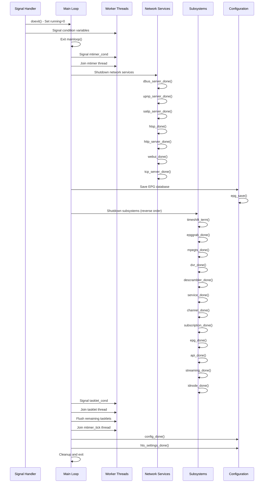

[← Back to Table of Contents](00-TOC.md)

## 3. System Initialization and Main Loop

This section describes how Tvheadend starts up, initializes its subsystems, and enters its main event processing loop. Understanding the initialization sequence is crucial for debugging startup issues, adding new subsystems, or modifying the startup behavior.

### 3.1 Entry Point and Command-Line Processing

#### 3.1.1 Main Function Location

The entry point for Tvheadend is the `main()` function located in **`src/main.c`**. This file contains approximately 1,500 lines of code handling:
- Command-line argument parsing
- Privilege management (user/group switching)
- Daemonization
- Subsystem initialization
- Main event loop
- Graceful shutdown

#### 3.1.2 Command-Line Option Categories

Tvheadend supports a comprehensive set of command-line options organized into several categories:

**Generic Options:**
- `-h, --help`: Display help message and exit
- `-v, --version`: Show version information and exit
- `--subsystems`: List all debug subsystems

**Service Configuration:**
- `-c, --config <path>`: Specify alternate configuration directory (default: `~/.hts/tvheadend`)
- `-B, --nobackup`: Don't backup configuration tree at upgrade
- `-f, --fork`: Fork and run as daemon
- `-u, --user <username>`: Run as specified user
- `-g, --group <groupname>`: Run as specified group
- `-p, --pid <path>`: Alternate PID file path (default: `/run/tvheadend.pid`)
- `-C, --firstrun`: Create admin account with no password on first run (use with caution!)
- `-U, --dbus`: Enable DBus integration
- `-e, --dbus_session`: Use DBus session bus instead of system bus
- `-a, --adapters <list>`: Only use specified DVB adapters (comma-separated, -1 = none)

**Server Connectivity:**
- `-6, --ipv6`: Listen on IPv6
- `-b, --bindaddr <addr>`: Specify bind address for HTTP/HTSP servers
- `--http_port <port>`: HTTP server port (default: 9981)
- `--http_root <path>`: HTTP webroot path for URL prefix
- `--htsp_port <port>`: HTSP server port (default: 9982)
- `--htsp_port2 <port>`: Additional HTSP server port
- `--useragent <string>`: User-Agent header for HTTP client
- `--xspf`: Use XSPF playlist format instead of M3U
- `--satip_bindaddr <addr>`: Bind address for SAT>IP server
- `--satip_rtsp <port>`: SAT>IP RTSP port (-1 = disable, 0 = from config, 554 = standard)
- `--nosatipcli`: Disable SAT>IP client
- `--satip_xml <url>`: URL with SAT>IP server XML location

**Debug Options:**
- `-d, --stderr`: Enable debug output to stderr
- `-n, --nostderr`: Disable debug output to stderr
- `-s, --syslog`: Enable debug output to syslog
- `-S, --nosyslog`: Disable all syslog output
- `-l, --logfile <path>`: Enable debug output to file
- `--debug <subsystems>`: Enable debug for specific subsystems (comma-separated)
- `--trace <subsystems>`: Enable trace logging for specific subsystems
- `--fileline`: Add file and line numbers to debug output
- `--threadid`: Add thread ID to debug output
- `--libav`: More verbose libav/FFmpeg logging
- `--uidebug`: Enable web UI debug mode (non-minified JavaScript)
- `-A, --abort`: Immediately abort (for testing)
- `-D, --dump`: Enable coredumps for daemon
- `--noacl`: Disable all access control checks (dangerous!)
- `--nobat`: Disable DVB bouquets parsing
- `-j, --join <service>`: Subscribe to a service permanently (for testing)

**Testing Options:**
- `--tsfile_tuners <count>`: Number of tsfile tuners
- `--tsfile <path>`: tsfile input (mux file)
- `--tprofile`: Gather timing statistics for performance profiling
- `--thrdebug <level>`: Thread debugging level

#### 3.1.3 Command-Line Processing Implementation

The command-line processing uses a table-driven approach with the `cmdline_opt_t` structure:

```c
typedef struct {
  const char  sopt;      // Short option character (e.g., 'h')
  const char *lopt;      // Long option string (e.g., "help")
  const char *desc;      // Description for help text
  enum {
    OPT_STR,            // String parameter
    OPT_INT,            // Integer parameter
    OPT_BOOL,           // Boolean flag
    OPT_STR_LIST,       // List of strings
  }          type;
  void       *param;    // Pointer to variable to store value
} cmdline_opt_t;
```

The parser supports both short (`-h`) and long (`--help`) option formats. Options are processed sequentially, and the parser validates that required parameters are provided.

#### 3.1.4 Configuration Path Resolution

The configuration directory is determined in the following order:

1. **Command-line override**: If `-c, --config` is specified, use that path
2. **Environment variable**: Check `TVHEADEND_CONFIG` environment variable
3. **User-specific default**: `~/.hts/tvheadend/` (where `~` is the home directory of the user Tvheadend runs as)
4. **System-wide default**: `/etc/tvheadend/` (if user-specific doesn't exist)

**Important considerations:**
- If running with `--fork` without specifying `--user` or `--config`, the configuration path may be unexpected (typically root's home directory)
- The configuration directory is created if it doesn't exist
- Permissions are set based on the user/group Tvheadend runs as
- The path is resolved early in initialization, before privilege dropping

**Configuration directory structure:**
```
~/.hts/tvheadend/
├── accesscontrol/          # Access control entries
├── bouquet/                # Bouquet definitions
├── channel/                # Channel configurations
│   ├── config/             # Channel settings
│   └── tag/                # Channel tags
├── dvr/                    # DVR configurations
│   ├── config/             # DVR profiles
│   ├── log/                # DVR entries (recordings)
│   └── autorec/            # Automatic recording rules
├── epggrab/                # EPG grabber configurations
├── epgdb.v3                # EPG database
├── input/                  # Input source configurations
│   ├── linuxdvb/           # DVB adapters
│   ├── iptv/               # IPTV networks
│   └── satip/              # SAT>IP clients
├── profile/                # Streaming profiles
└── passwd                  # User accounts
```

### 3.2 Initialization Sequence

The initialization process follows a carefully ordered sequence to ensure dependencies are satisfied. The sequence can be divided into several phases:

#### 3.2.1 Initialization Sequence Diagram

```mermaid
sequenceDiagram
    participant Main as main()
    participant Locks as Mutex/Cond Init
    participant PreFork as Pre-Fork Phase
    participant PrivDrop as Privilege Drop
    participant Threads as Thread Creation
    participant Subsystems as Subsystem Init
    participant Network as Network Services
    participant Loop as Main Loop

    Main->>Locks: Initialize global mutexes
    Note over Locks: global_lock, mtimer_lock,<br/>gtimer_lock, tasklet_lock,<br/>fork_lock, atomic_lock

    Main->>PreFork: Pre-fork initialization
    PreFork->>PreFork: Parse command line
    PreFork->>PreFork: Setup logging
    PreFork->>PreFork: uuid_init()
    PreFork->>PreFork: idnode_boot()
    PreFork->>PreFork: config_boot()
    PreFork->>PreFork: Bind TCP ports
    Note over PreFork: HTTP, HTSP, SAT>IP<br/>(requires root for ports < 1024)

    Main->>PrivDrop: Drop privileges
    PrivDrop->>PrivDrop: setgid() if needed
    PrivDrop->>PrivDrop: setuid() if needed
    PrivDrop->>PrivDrop: Fork to background (if -f)
    PrivDrop->>PrivDrop: Write PID file
    PrivDrop->>PrivDrop: Set umask(0)

    Main->>Threads: Start core threads
    Threads->>Threads: tvhlog thread
    Threads->>Threads: mtimer_tick thread
    Threads->>Threads: mtimer thread
    Threads->>Threads: tasklet thread

    Main->>Subsystems: Initialize subsystems (with global_lock)
    Subsystems->>Subsystems: Signal handling (trap_init)
    Subsystems->>Subsystems: SSL library init
    Subsystems->>Subsystems: notify_init()
    Subsystems->>Subsystems: spawn_init()
    Subsystems->>Subsystems: idnode_init()
    Subsystems->>Subsystems: config_init()
    Subsystems->>Subsystems: streaming_init()
    Subsystems->>Subsystems: tvh_hardware_init()
    Subsystems->>Subsystems: api_init()
    Subsystems->>Subsystems: libav_init()
    Subsystems->>Subsystems: codec_init()
    Subsystems->>Subsystems: profile_init()
    Subsystems->>Subsystems: service_init()
    Subsystems->>Subsystems: descrambler_init()
    Subsystems->>Subsystems: mpegts_init() - Input drivers
    Subsystems->>Subsystems: channel_init()
    Subsystems->>Subsystems: subscription_init()
    Subsystems->>Subsystems: dvr_config_init()
    Subsystems->>Subsystems: access_init()
    Subsystems->>Subsystems: epggrab_init()
    Subsystems->>Subsystems: epg_init()
    Subsystems->>Subsystems: dvr_init()

    Main->>Network: Register network services
    Network->>Network: tcp_server_init()
    Network->>Network: webui_init()
    Network->>Network: http_server_register()
    Network->>Network: satip_server_register()
    Network->>Network: htsp_register()
    Network->>Network: avahi_init() - mDNS
    Network->>Network: bonjour_init() - Bonjour

    Main->>Loop: Release global_lock
    Main->>Loop: Signal mtimer thread ready
    Main->>Loop: Enter mainloop()
    Note over Loop: Process gtimers until shutdown
```

#### 3.2.2 Detailed Initialization Phases

**Phase 1: Pre-Fork Initialization (Before Privilege Drop)**

This phase runs with elevated privileges (typically as root) to perform operations that require special permissions:

1. **Global Mutex Initialization**:
   ```c
   tvh_mutex_init(&fork_lock, NULL);
   tvh_mutex_init(&global_lock, NULL);
   tvh_mutex_init(&mtimer_lock, NULL);
   tvh_mutex_init(&gtimer_lock, NULL);
   tvh_mutex_init(&tasklet_lock, NULL);
   tvh_mutex_init(&atomic_lock, NULL);
   ```

2. **UUID System**: `uuid_init()` - Initialize UUID generation for configuration objects

3. **idnode Boot**: `idnode_boot()` - Bootstrap the idnode class system

4. **Configuration Boot**: `config_boot(opt_config, gid, uid, opt_user_agent)` - Determine configuration path and prepare for loading

5. **TCP Server Pre-Init**: `tcp_server_preinit(opt_ipv6)` - Initialize TCP server infrastructure

6. **Port Binding** (requires root for ports < 1024):
   - `http_server_init(opt_bindaddr)` - Bind HTTP port (default 9981)
   - `htsp_init(opt_bindaddr)` - Bind HTSP port (default 9982)
   - `satip_server_init(opt_satip_bindaddr, opt_satip_rtsp)` - Bind SAT>IP RTSP port (default 554)

**Phase 2: Privilege Dropping and Daemonization**

After binding privileged ports, Tvheadend drops privileges for security:

1. **Group Change**: `setgid(gid)` - Change to specified group (default: "video")
2. **Supplementary Groups**: `setgroups()` - Set supplementary group memberships
3. **User Change**: `setuid(uid)` - Change to specified user (default: "hts" or "daemon")
4. **Fork to Background**: If `--fork` specified:
   - Call `daemon(0, 0)` to detach from terminal
   - Write PID to file (default: `/run/tvheadend.pid`)
   - Set working directory
   - Enable coredumps if `--dump` specified
5. **Set umask**: `umask(0)` - Allow full permissions for created files

**Phase 3: Thread Creation**

Core threads are started before subsystem initialization:

1. **Logging Thread**: `tvhlog_start()` - Asynchronous logging thread
2. **Monotonic Timer Tick Thread**: `mtimer_tick_thread()` - Updates monotonic clock every 100ms
3. **Monotonic Timer Thread**: `mtimer_thread()` - Processes monotonic timers
4. **Tasklet Thread**: `tasklet_thread()` - Processes deferred tasks

**Phase 4: Core Subsystem Initialization (with global_lock held)**

The main thread acquires `global_lock` and initializes subsystems in dependency order:

1. **Clock Initialization**: Set initial `__mdispatch_clock` and `__gdispatch_clock`
2. **Signal Handling**: `trap_init(argv[0])` - Setup signal handlers for SIGTERM, SIGINT, etc.
3. **SSL Library**: Initialize OpenSSL (if version < 1.1.0)
4. **Random Seed**: Seed OpenSSL RAND with thread ID, time, and UUID
5. **Notification System**: `notify_init()` - Real-time notification infrastructure
6. **Spawn System**: `spawn_init()` - Process spawning for external programs
7. **idnode System**: `idnode_init()` - Complete idnode initialization
8. **Configuration System**: `config_init(opt_nobackup)` - Load configuration from disk
9. **Memory Info**: Register memory tracking classes
10. **Streaming Engine**: `streaming_init()` - Initialize streaming pad/target system
11. **Hardware Detection**: `tvh_hardware_init()` - Detect available hardware
12. **DBus**: `dbus_server_init()` - Initialize DBus integration (optional)
13. **Internationalization**: `intlconv_init()` - Character encoding conversion
14. **API System**: `api_init()` - REST API infrastructure
15. **Filesystem Monitor**: `fsmonitor_init()` - Monitor configuration file changes
16. **LibAV**: `libav_init()` - Initialize FFmpeg/libav
17. **Time System**: `tvhtime_init()` - Time zone and time handling
18. **Codec Support**: `codec_init()` - Initialize codec support
19. **Profile System**: `profile_init()` - Streaming and transcoding profiles
20. **Image Cache**: `imagecache_init()` - Channel icon and EPG image caching
21. **HTTP Client**: `http_client_init()` - HTTP client for external requests
22. **ES Filters**: `esfilter_init()` - Elementary stream filtering
23. **Bouquets**: `bouquet_init()` - Channel bouquet support
24. **Rating Labels**: `ratinglabel_init()` - Content rating system
25. **Service Management**: `service_init()` - Core service infrastructure
26. **Descrambler**: `descrambler_init()` - CA system support
27. **DVB Support**: `dvb_init()` - DVB-specific initialization
28. **MPEG-TS Inputs**: `mpegts_init()` - Initialize all input drivers (DVB, IPTV, SAT>IP, HDHomeRun, TSFile)
29. **Channel Management**: `channel_init()` - Load channels from configuration
30. **Bouquet Resolution**: `bouquet_service_resolve()` - Link bouquets to services
31. **Subscription System**: `subscription_init()` - Client subscription management
32. **DVR Configuration**: `dvr_config_init()` - DVR profiles and settings
33. **Access Control**: `access_init(opt_firstrun, opt_noacl)` - User authentication and ACLs
34. **Timeshift**: `timeshift_init()` - Timeshift buffer management (optional)

**Phase 5: Network Service Registration**

After subsystems are initialized, network services are registered:

1. **TCP Server**: `tcp_server_init()` - Start accepting connections
2. **Web UI**: `webui_init(opt_xspf)` - Register web interface handlers
3. **UPnP**: `upnp_server_init(opt_bindaddr)` - UPnP/DLNA server (optional)
4. **Service Mapper**: `service_mapper_init()` - Automatic service-to-channel mapping
5. **EPG Grabber**: `epggrab_init()` - EPG data collection
6. **EPG System**: `epg_init()` - Load EPG database
7. **DVR System**: `dvr_init()` - Load DVR entries and start scheduler
8. **DBus Start**: `dbus_server_start()` - Start DBus service
9. **HTTP Registration**: `http_server_register()` - Register HTTP endpoints
10. **SAT>IP Registration**: `satip_server_register()` - Register SAT>IP server
11. **HTSP Registration**: `htsp_register()` - Register HTSP server
12. **Avahi**: `avahi_init()` - mDNS service advertisement (Linux)
13. **Bonjour**: `bonjour_init()` - Bonjour service advertisement (macOS)
14. **EPG Cleanup**: `epg_updated()` - Clean up EPG references
15. **Watchdog**: `watchdog_init()` - System watchdog (optional)

**Phase 6: Main Loop Entry**

1. Release `global_lock`
2. Setup signal handling for SIGTERM and SIGINT
3. Log startup message with version, PID, UID, GID, working directory, and config path
4. Signal `mtimer` thread that main loop is ready
5. Enter `mainloop()` function

#### 3.2.3 Initialization Dependencies

The initialization order is critical due to dependencies between subsystems:

```
uuid_init → idnode_boot → config_boot
                ↓
         config_init → All configuration-dependent subsystems
                ↓
         streaming_init → service_init → channel_init
                ↓
         mpegts_init (inputs) → Hardware detection
                ↓
         subscription_init → Client handling
                ↓
         dvr_init → Recording system
                ↓
         epg_init → Program guide
```

**Key dependency rules:**
- Configuration system must be initialized before any subsystem that loads configuration
- Streaming engine must be initialized before services
- Services must be initialized before channels
- Input drivers must be initialized before channels can be mapped
- API system must be initialized before web UI
- All subsystems must be initialized before network services are registered

### 3.3 Main Event Loop

Once initialization is complete, Tvheadend enters its main event loop, which processes time-based events and handles shutdown signals.

#### 3.3.1 The mainloop() Function

The `mainloop()` function (in `src/main.c`) is the heart of Tvheadend's event processing. It runs in the main thread and processes **gtimers** (global/wall-clock timers):

```c
static void mainloop(void)
{
  gtimer_t *gti;
  gti_callback_t *cb;
  time_t now;
  struct timespec ts;
  const char *id;

  while (tvheadend_is_running()) {
    // Update wall-clock time
    now = gdispatch_clock_update();
    ts.tv_sec  = now + 3600;  // Default: wake up in 1 hour
    ts.tv_nsec = 0;

    // Process all expired gtimers
    while (1) {
      tvh_mutex_lock(&gtimer_lock);
      gti = LIST_FIRST(&gtimers);
      
      // Check if timer has expired
      if (gti == NULL || gti->gti_expire > now) {
        if (gti)
          ts.tv_sec = gti->gti_expire;  // Wake up when next timer expires
        tvh_mutex_unlock(&gtimer_lock);
        break;
      }

      // Remove timer from list and prepare to execute
      cb = gti->gti_callback;
      LIST_REMOVE(gti, gti_link);
      gti->gti_callback = NULL;
      gtimer_running = gti;
      tvh_mutex_unlock(&gtimer_lock);

      // Execute timer callback with global_lock held
      tvh_mutex_lock(&global_lock);
      if (gtimer_running == gti) {
        tprofile_start(&gtimer_profile, id);
        cb(gti->gti_opaque);  // Call the timer callback
        tprofile_finish(&gtimer_profile);
      }
      tvh_mutex_unlock(&global_lock);
    }

    // Wait for next timer or signal
    tvh_mutex_lock(&gtimer_lock);
    tvh_cond_timedwait_ts(&gtimer_cond, &gtimer_lock, &ts);
    tvh_mutex_unlock(&gtimer_lock);
  }
}
```

**Key characteristics:**
- Runs in the main thread
- Processes gtimers (wall-clock based timers)
- Timer callbacks execute with `global_lock` held
- Sleeps until next timer expires or signal received
- Exits when `tvheadend_running` becomes 0

#### 3.3.2 gtimer Processing

**gtimer** (global timer) is used for time-of-day based events:

**Use cases:**
- EPG data refresh at specific times
- DVR recording start/stop at scheduled times
- Configuration auto-save at regular intervals
- Periodic cleanup tasks
- Time-based autorec evaluation

**Timer lifecycle:**
1. **Arm**: `gtimer_arm_absn(timer, callback, opaque, when)` - Schedule timer for absolute time
2. **Arm Relative**: `gtimer_arm_rel(timer, callback, opaque, delta)` - Schedule timer for relative time
3. **Execute**: Callback invoked with `global_lock` held when timer expires
4. **Disarm**: `gtimer_disarm(timer)` - Cancel timer before expiration

**Important notes:**
- gtimers are affected by system clock changes (NTP adjustments, DST, manual changes)
- Timer callbacks must be short and non-blocking
- Callbacks execute with `global_lock` held - be careful of deadlocks
- Timers are automatically removed from the list when they fire
- A timer can re-arm itself from within its callback

#### 3.3.3 Signal Handling

Tvheadend handles several signals for graceful shutdown and control:

**Handled Signals:**

1. **SIGTERM** - Graceful shutdown request
   - Handler: `doexit()`
   - Behavior: Sets `tvheadend_running = 0`, signals condition variables, initiates shutdown

2. **SIGINT** - Interrupt (Ctrl+C)
   - Handler: `doexit()`
   - Behavior: Same as SIGTERM

3. **SIGPIPE** - Broken pipe
   - Handler: `handle_sigpipe()`
   - Behavior: Ignored (prevents crash on client disconnect)

4. **SIGILL** - Illegal instruction
   - Handler: `handle_sigill()`
   - Behavior: Logs warning (can occur during SSL CPU capability detection)

**Signal handling implementation:**

```c
static void doexit(int x)
{
  // If called from non-main thread, signal main thread
  if (pthread_self() != main_tid)
    tvh_thread_kill(main_tid, SIGTERM);
  
  // Wake up timer threads
  tvh_cond_signal(&gtimer_cond, 0);
  tvh_cond_signal(&mtimer_cond, 0);
  
  // Set running flag to 0
  atomic_set(&tvheadend_running, 0);
  
  // Re-install handler for repeated signals
  tvh_signal(x, doexit);
}
```

**Signal flow:**
1. Signal received by kernel
2. Handler function called
3. `tvheadend_running` set to 0
4. Condition variables signaled to wake sleeping threads
5. Main loop checks `tvheadend_is_running()` and exits
6. Shutdown sequence begins

### 3.4 Shutdown Sequence

When Tvheadend receives a shutdown signal (SIGTERM or SIGINT), it performs a graceful shutdown:

#### 3.4.1 Shutdown Flow



#### 3.4.2 Shutdown Phases

**Phase 1: Signal Reception**
- `doexit()` handler sets `tvheadend_running = 0`
- Condition variables signaled to wake sleeping threads
- Main loop exits

**Phase 2: Timer Thread Shutdown**
- Signal `mtimer_cond` to wake mtimer thread
- Join mtimer thread (wait for it to exit)

**Phase 3: Network Service Shutdown**
- Stop accepting new connections
- Close existing client connections
- Shutdown servers in order:
  - DBus server
  - UPnP server
  - SAT>IP server
  - HTSP server
  - HTTP server
  - Web UI
  - Filesystem monitor
  - HTTP client
  - TCP server

**Phase 4: Save Critical Data**
- Save EPG database to disk (`epg_save()`)
- Ensure all configuration changes are persisted

**Phase 5: Subsystem Shutdown (Reverse Initialization Order)**
- Timeshift termination
- EPG grabber shutdown
- Input drivers shutdown (MPEG-TS, DVB, IPTV, SAT>IP)
- DVR system shutdown (stop recordings, close files)
- Descrambler shutdown (disconnect from CA servers)
- Service mapper shutdown
- Service management shutdown
- Channel management shutdown
- Bouquet shutdown
- Rating labels shutdown
- Subscription system shutdown
- Access control shutdown
- EPG system shutdown
- Avahi/Bonjour shutdown
- Image cache shutdown
- Language codes cleanup
- API system shutdown

**Phase 6: Worker Thread Shutdown**
- Signal `tasklet_cond` to wake tasklet thread
- Join tasklet thread
- Flush any remaining tasklets
- Join mtimer_tick thread

**Phase 7: Core Cleanup**
- DVB cleanup
- ES filter cleanup
- Profile system cleanup
- Codec cleanup
- LibAV cleanup
- Internationalization cleanup
- URL parser cleanup
- Streaming engine cleanup
- idnode system cleanup
- Notification system cleanup
- Spawn system cleanup

**Phase 8: Final Cleanup**
- Timing profile cleanup
- Logging shutdown (`tvhlog_end()`)
- Configuration system cleanup
- Settings system cleanup
- Thread system cleanup
- Remove PID file
- OpenSSL cleanup (if version < 1.1.0)
- DBus shutdown
- Exit process

#### 3.4.3 Graceful Shutdown Guarantees

Tvheadend's shutdown sequence ensures:

1. **No new connections accepted**: Network services stop listening immediately
2. **Existing clients notified**: Active clients receive disconnect notifications
3. **Recordings completed**: In-progress recordings are finalized (if possible)
4. **EPG data saved**: Program guide data is persisted to disk
5. **Configuration saved**: All configuration changes are written
6. **Resources released**: File handles, sockets, and memory are freed
7. **Clean exit**: Process exits with status code 0

**Shutdown timeout considerations:**
- No hard timeout is enforced
- Long-running operations (large EPG save, active recordings) may delay shutdown
- Forceful termination (SIGKILL) will result in data loss
- For immediate shutdown, send SIGKILL (not recommended)

**Best practices:**
- Use SIGTERM for graceful shutdown
- Allow sufficient time for shutdown to complete
- Monitor logs for shutdown progress
- Check for "Exiting HTS Tvheadend" log message

---

[← Previous](02-High-Level-Architecture.md) | [Table of Contents](00-TOC.md) | [Next →](04-Threading-Model.md)