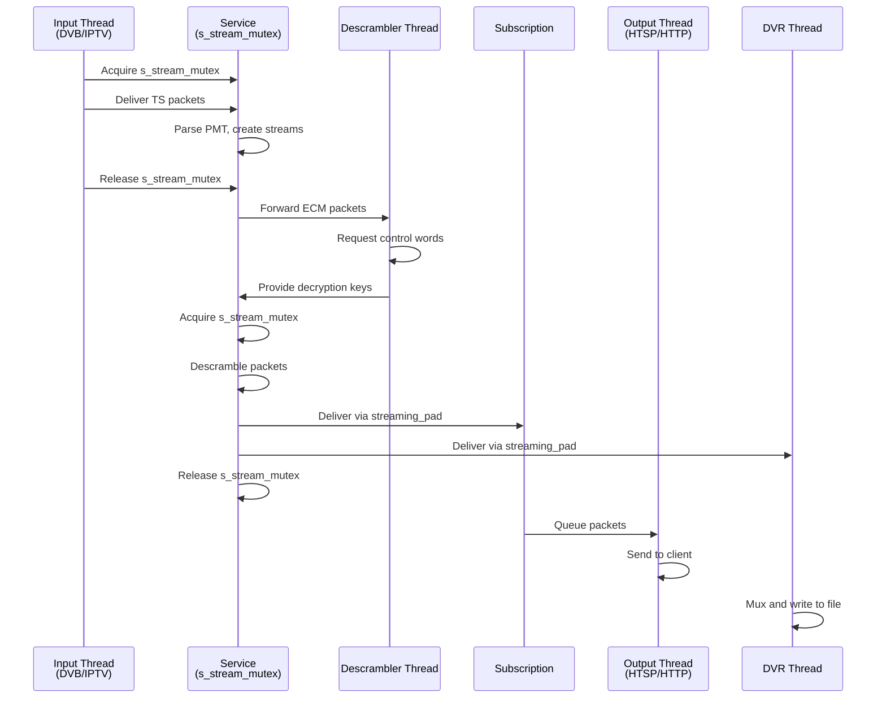
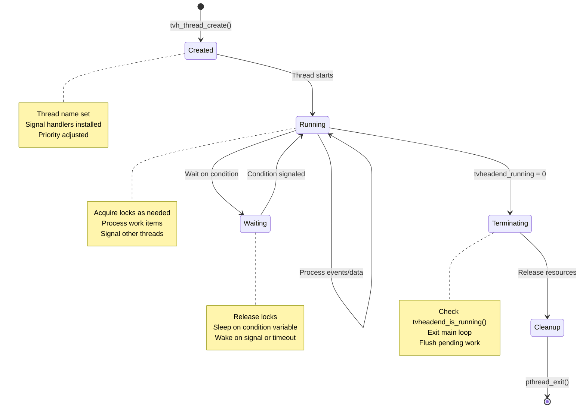

[← Back to Table of Contents](00-TOC.md)

## 4. Threading Model

Understanding Tvheadend's threading model is critical for working with the codebase. The system uses multiple specialized threads for different tasks, with careful synchronization to prevent race conditions and deadlocks. This section documents all threads, synchronization primitives, timer systems, and locking rules.

### 4.1 Thread Inventory

Tvheadend uses a multi-threaded architecture with several specialized threads, each serving a specific purpose. Understanding the role of each thread is essential for debugging concurrency issues and adding new features.

#### 4.1.1 Core Threads

**Main Thread** (`main_tid`)
- **Purpose**: Primary event loop processing wall-clock based timers (gtimers)
- **Created**: At process startup (the initial process thread)
- **Priority**: Normal (inherits from parent process)
- **Key Responsibilities**:
  - Process gtimer (global timer) callbacks
  - Handle shutdown signals (SIGTERM, SIGINT)
  - Coordinate system shutdown
  - Update wall-clock time (`__gdispatch_clock`)
- **Execution Model**: Event-driven loop waiting on condition variable
- **Termination**: Exits when `tvheadend_running` becomes 0
- **Source**: `src/main.c` - `mainloop()` function

**Monotonic Timer Thread** (`mtimer_tid`)
- **Purpose**: Process monotonic clock-based timers (mtimers)
- **Created**: During initialization via `tvh_thread_create()`
- **Thread Name**: `tvh:mtimer`
- **Priority**: Normal
- **Key Responsibilities**:
  - Process mtimer (monotonic timer) callbacks
  - Update monotonic clock periodically
  - Trigger periodic maintenance tasks (comet flush, profile logging)
  - Maintain `__mdispatch_clock` (monotonic dispatch clock)
- **Execution Model**: Event-driven loop with timed waits
- **Termination**: Exits when `tvheadend_running` becomes 0
- **Source**: `src/main.c` - `mtimer_thread()` function
- **Notes**: Waits for main loop to be ready before processing timers

**Monotonic Timer Tick Thread** (`mtimer_tick_tid`)
- **Purpose**: High-frequency clock updates for monotonic time
- **Created**: During initialization via `tvh_thread_create()`
- **Thread Name**: `tvh:mtimer_tick`
- **Priority**: Normal
- **Key Responsibilities**:
  - Update `__mdispatch_clock` every 100ms
  - Provide fast monotonic clock access without system calls
- **Execution Model**: Tight loop with 100ms sleep intervals
- **Termination**: Exits when `tvheadend_running` becomes 0
- **Source**: `src/main.c` - `mtimer_tick_thread()` function
- **Notes**: Reduces overhead of frequent `getmonoclock()` calls

**Tasklet Thread** (`tasklet_tid`)
- **Purpose**: Execute deferred tasks asynchronously
- **Created**: During initialization via `tvh_thread_create()`
- **Thread Name**: `tvh:tasklet`
- **Priority**: Low (reniced to +20, lowest priority)
- **Key Responsibilities**:
  - Process tasklet queue (deferred work items)
  - Execute non-urgent background tasks
  - Prevent blocking of critical paths
- **Execution Model**: Queue-based processing with condition variable
- **Termination**: Exits when `tvheadend_running` becomes 0, flushes remaining tasklets
- **Source**: `src/main.c` - `tasklet_thread()` function
- **Notes**: Callbacks execute without `global_lock` held

**Logging Thread** (`tvhlog_tid`)
- **Purpose**: Asynchronous log message processing
- **Created**: Early in initialization via `tvhlog_start()`
- **Thread Name**: `tvh:tvhlog`
- **Priority**: Normal
- **Key Responsibilities**:
  - Write log messages to stderr, syslog, and log files
  - Prevent logging from blocking main execution paths
  - Buffer log messages during high-load periods
- **Execution Model**: Queue-based processing
- **Termination**: Stopped via `tvhlog_end()` during shutdown
- **Source**: `src/tvhlog.c`
- **Notes**: Critical for non-blocking logging in performance-sensitive code

#### 4.1.2 Input-Specific Threads

**DVB Adapter Threads**
- **Purpose**: Poll DVB hardware for events and data
- **Created**: One per active DVB adapter
- **Thread Name**: `tvh:linuxdvb-<adapter>`
- **Priority**: Normal
- **Key Responsibilities**:
  - Poll DVB device file descriptors
  - Read transport stream packets
  - Monitor signal status and events
  - Handle frontend tuning
- **Execution Model**: Blocking I/O with poll/select
- **Source**: `src/input/mpegts/linuxdvb/`
- **Notes**: Number of threads depends on hardware configuration

**IPTV Input Threads**
- **Purpose**: Receive IPTV streams over network
- **Created**: One per active IPTV mux
- **Thread Name**: `tvh:iptv-<source>`
- **Priority**: Normal
- **Key Responsibilities**:
  - Receive UDP/HTTP streams
  - Parse and buffer incoming data
  - Handle network errors and reconnection
- **Execution Model**: Blocking network I/O
- **Source**: `src/input/mpegts/iptv/`
- **Notes**: Dynamically created/destroyed based on subscriptions

**SAT>IP Client Threads**
- **Purpose**: Communicate with SAT>IP servers
- **Created**: Per active SAT>IP session
- **Thread Name**: `tvh:satip-<client>`
- **Priority**: Normal
- **Key Responsibilities**:
  - RTSP session management
  - RTP packet reception
  - Keep-alive and error handling
- **Execution Model**: Network I/O with timeouts
- **Source**: `src/input/mpegts/satip/`

**HDHomeRun Threads**
- **Purpose**: Interface with HDHomeRun network tuners
- **Created**: Per active HDHomeRun device
- **Thread Name**: `tvh:hdhomerun-<device>`
- **Priority**: Normal
- **Key Responsibilities**:
  - Device discovery and communication
  - Stream reception
  - Tuner control
- **Execution Model**: Network I/O
- **Source**: `src/input/mpegts/tvhdhomerun/`

#### 4.1.3 Network Service Threads

**HTTP Server Threads**
- **Purpose**: Handle HTTP client connections
- **Created**: One per active HTTP connection
- **Thread Name**: `tvh:http-<client>`
- **Priority**: Normal
- **Key Responsibilities**:
  - Process HTTP requests
  - Serve web UI files
  - Handle API calls
  - Stream media to HTTP clients
- **Execution Model**: Request/response processing
- **Source**: `src/http.c`
- **Notes**: Thread pool may be used depending on configuration

**HTSP Server Threads**
- **Purpose**: Handle HTSP (Home TV Streaming Protocol) client connections
- **Created**: One per active HTSP connection
- **Thread Name**: `tvh:htsp-<client>`
- **Priority**: Normal
- **Key Responsibilities**:
  - Process HTSP protocol messages
  - Manage client subscriptions
  - Stream media to HTSP clients
  - Handle authentication
- **Execution Model**: Message-based protocol processing
- **Source**: `src/htsp_server.c`
- **Notes**: Long-lived connections, one thread per client

**SAT>IP Server Threads**
- **Purpose**: Serve streams via SAT>IP protocol
- **Created**: Per active SAT>IP client session
- **Thread Name**: `tvh:satip-srv-<client>`
- **Priority**: Normal
- **Key Responsibilities**:
  - RTSP server functionality
  - RTP stream transmission
  - Session management
- **Execution Model**: Network I/O
- **Source**: `src/satip/server.c`

#### 4.1.4 Subsystem-Specific Threads

**DVR Recording Threads**
- **Purpose**: Write recorded streams to disk
- **Created**: One per active recording
- **Thread Name**: `tvh:dvr-<entry>`
- **Priority**: Normal
- **Key Responsibilities**:
  - Mux and write transport stream data
  - Execute pre/post-processing scripts
  - Monitor disk space
  - Handle recording errors
- **Execution Model**: Stream processing with file I/O
- **Source**: `src/dvr/`
- **Notes**: May spawn additional threads for transcoding

**EPG Grabber Threads**
- **Purpose**: Fetch EPG data from external sources
- **Created**: Per active EPG grabber module
- **Thread Name**: `tvh:epggrab-<module>`
- **Priority**: Low
- **Key Responsibilities**:
  - Download XMLTV data
  - Parse EPG information
  - Update EPG database
- **Execution Model**: Periodic fetching with long intervals
- **Source**: `src/epggrab/`

**Transcoding Threads** (Optional)
- **Purpose**: Transcode streams on-the-fly
- **Created**: Per active transcoding session
- **Thread Name**: `tvh:transcode-<profile>`
- **Priority**: Normal to high (configurable)
- **Key Responsibilities**:
  - Decode input streams
  - Encode to target format
  - Buffer and synchronize A/V
- **Execution Model**: Pipeline processing
- **Source**: `src/transcoding/`
- **Notes**: Only present if transcoding is enabled and configured

**Timeshift Threads** (Optional)
- **Purpose**: Manage timeshift buffers
- **Created**: Per active timeshift session
- **Thread Name**: `tvh:timeshift-<subscription>`
- **Priority**: Normal
- **Key Responsibilities**:
  - Buffer live streams to disk
  - Handle seek operations
  - Manage buffer size and cleanup
- **Execution Model**: Stream buffering with file I/O
- **Source**: `src/timeshift/`
- **Notes**: Only present if timeshift is enabled

#### 4.1.5 Thread Watchdog (Debug Mode)

**Thread Watchdog** (`thrwatch_tid`)
- **Purpose**: Detect deadlocks and lock contention
- **Created**: Only when `ENABLE_TRACE` is defined and debug level > 0
- **Thread Name**: `tvh:thrwatch`
- **Priority**: Normal
- **Key Responsibilities**:
  - Monitor mutex hold times
  - Detect potential deadlocks
  - Log lock contention warnings
  - Generate deadlock reports
- **Execution Model**: Periodic scanning (1 second intervals)
- **Termination**: Stopped during shutdown
- **Source**: `src/tvh_thread.c` - `tvh_thread_watch_thread()`
- **Notes**: Development/debugging feature, not present in production builds

#### 4.1.6 Thread Summary Table

| Thread Type | Count | Priority | Holds global_lock | Notes |
|-------------|-------|----------|-------------------|-------|
| Main | 1 | Normal | Yes (during gtimer callbacks) | Primary event loop |
| mtimer | 1 | Normal | Yes (during mtimer callbacks) | Monotonic timer processing |
| mtimer_tick | 1 | Normal | No | Fast clock updates |
| tasklet | 1 | Low (+20) | No | Deferred task execution |
| tvhlog | 1 | Normal | No | Asynchronous logging |
| DVB adapter | 0-N | Normal | Varies | Per hardware adapter |
| IPTV input | 0-N | Normal | Varies | Per active stream |
| SAT>IP client | 0-N | Normal | Varies | Per SAT>IP session |
| HDHomeRun | 0-N | Normal | Varies | Per device |
| HTTP server | 0-N | Normal | Yes (for API calls) | Per client connection |
| HTSP server | 0-N | Normal | Yes (for operations) | Per client connection |
| SAT>IP server | 0-N | Normal | Varies | Per client session |
| DVR recording | 0-N | Normal | Varies | Per active recording |
| EPG grabber | 0-N | Low | Yes (for updates) | Per grabber module |
| Transcoding | 0-N | Normal-High | No | Per transcoding session |
| Timeshift | 0-N | Normal | Varies | Per timeshift session |
| Thread watchdog | 0-1 | Normal | No | Debug builds only |

**Notes on thread counts:**
- **Fixed threads** (main, mtimer, mtimer_tick, tasklet, tvhlog): Always present
- **Input threads**: Created based on hardware detection and configuration
- **Network service threads**: Created per client connection
- **Subsystem threads**: Created on-demand based on active operations
- **Total thread count**: Typically 5-50 threads depending on configuration and active clients

#### 4.1.7 Thread Priorities and Scheduling

Tvheadend uses Linux thread priorities to ensure responsive operation:

**Priority Levels:**
- **Low Priority (+20)**: Tasklet thread, EPG grabbers - non-urgent background work
- **Normal Priority (0)**: Most threads - default scheduling
- **High Priority (negative values)**: Transcoding threads (optional) - real-time processing

**Priority Setting:**
- Implemented via `tvh_thread_renice()` function
- Uses `setpriority(PRIO_PROCESS, tid, value)` on Linux
- Range: -19 (highest) to +20 (lowest)
- Requires appropriate privileges for negative values

**Scheduling Considerations:**
- Most threads use default SCHED_OTHER policy
- Real-time scheduling (SCHED_FIFO, SCHED_RR) not used by default
- Thread priorities help prevent background tasks from impacting streaming performance
- I/O-bound threads (network, disk) naturally yield CPU to compute-bound threads


### 4.2 Threading Architecture

The following diagram illustrates the major threads in Tvheadend and their interactions through shared data structures and synchronization primitives.

```mermaid
graph TB
    subgraph "Core Threads"
        MAIN[Main Thread<br/>gtimer processing]
        MTIMER[mtimer Thread<br/>Monotonic timers]
        MTICK[mtimer_tick Thread<br/>Clock updates]
        TASKLET[tasklet Thread<br/>Deferred tasks]
        TVHLOG[tvhlog Thread<br/>Async logging]
    end
    
    subgraph "Input Threads"
        DVB[DVB Adapter Threads<br/>Hardware polling]
        IPTV[IPTV Input Threads<br/>Network streams]
        SATIP_IN[SAT>IP Client Threads<br/>RTSP/RTP]
        HDHOMERUN[HDHomeRun Threads<br/>Network tuners]
    end
    
    subgraph "Network Service Threads"
        HTTP[HTTP Server Threads<br/>Web UI & API]
        HTSP[HTSP Server Threads<br/>Native protocol]
        SATIP_SRV[SAT>IP Server Threads<br/>Streaming server]
    end
    
    subgraph "Subsystem Threads"
        DVR[DVR Recording Threads<br/>File writing]
        EPG[EPG Grabber Threads<br/>Data collection]
        TRANSCODE[Transcoding Threads<br/>Format conversion]
        TIMESHIFT[Timeshift Threads<br/>Buffer management]
    end
    
    subgraph "Shared Resources (Protected by Locks)"
        GLOBAL[(global_lock<br/>Main data structures)]
        GTIMERS[(gtimer_lock<br/>Global timers)]
        MTIMERS[(mtimer_lock<br/>Monotonic timers)]
        TASKLETS[(tasklet_lock<br/>Task queue)]
        STREAM[(s_stream_mutex<br/>Per-service streaming)]
    end
    
    subgraph "Condition Variables"
        GTIMER_COND[gtimer_cond<br/>Wake main thread]
        MTIMER_COND[mtimer_cond<br/>Wake mtimer thread]
        TASKLET_COND[tasklet_cond<br/>Wake tasklet thread]
    end
    
    %% Main thread interactions
    MAIN -->|Acquires| GLOBAL
    MAIN -->|Waits on| GTIMER_COND
    MAIN -->|Processes| GTIMERS
    
    %% mtimer thread interactions
    MTIMER -->|Acquires| GLOBAL
    MTIMER -->|Waits on| MTIMER_COND
    MTIMER -->|Processes| MTIMERS
    
    %% mtimer_tick interactions
    MTICK -->|Updates| MTIMERS
    
    %% Tasklet thread interactions
    TASKLET -->|Acquires| TASKLETS
    TASKLET -->|Waits on| TASKLET_COND
    TASKLET -->|No global_lock| GLOBAL
    
    %% Logging thread
    TVHLOG -->|No locks| GLOBAL
    
    %% Input threads
    DVB -->|Acquires| GLOBAL
    DVB -->|Acquires| STREAM
    IPTV -->|Acquires| GLOBAL
    IPTV -->|Acquires| STREAM
    SATIP_IN -->|Acquires| GLOBAL
    SATIP_IN -->|Acquires| STREAM
    HDHOMERUN -->|Acquires| GLOBAL
    HDHOMERUN -->|Acquires| STREAM
    
    %% Network service threads
    HTTP -->|Acquires| GLOBAL
    HTSP -->|Acquires| GLOBAL
    HTSP -->|Acquires| STREAM
    SATIP_SRV -->|Acquires| GLOBAL
    SATIP_SRV -->|Acquires| STREAM
    
    %% Subsystem threads
    DVR -->|Acquires| GLOBAL
    DVR -->|Acquires| STREAM
    EPG -->|Acquires| GLOBAL
    TRANSCODE -->|Acquires| STREAM
    TIMESHIFT -->|Acquires| GLOBAL
    TIMESHIFT -->|Acquires| STREAM
    
    %% Timer arming (any thread can arm timers)
    DVB -.->|Arms| GTIMERS
    DVB -.->|Arms| MTIMERS
    DVB -.->|Arms| TASKLETS
    IPTV -.->|Arms| GTIMERS
    IPTV -.->|Arms| MTIMERS
    HTTP -.->|Arms| TASKLETS
    HTSP -.->|Arms| TASKLETS
    DVR -.->|Arms| GTIMERS
    EPG -.->|Arms| GTIMERS
    
    %% Condition signaling
    DVB -.->|Signals| GTIMER_COND
    DVB -.->|Signals| MTIMER_COND
    DVB -.->|Signals| TASKLET_COND
    HTTP -.->|Signals| TASKLET_COND
    
    classDef coreThread fill:#e1f5ff,stroke:#0288d1,stroke-width:2px
    classDef inputThread fill:#fff3e0,stroke:#f57c00,stroke-width:2px
    classDef networkThread fill:#e8f5e9,stroke:#388e3c,stroke-width:2px
    classDef subsysThread fill:#f3e5f5,stroke:#7b1fa2,stroke-width:2px
    classDef lockStyle fill:#ffebee,stroke:#c62828,stroke-width:2px
    classDef condStyle fill:#fff9c4,stroke:#f9a825,stroke-width:2px
    
    class MAIN,MTIMER,MTICK,TASKLET,TVHLOG coreThread
    class DVB,IPTV,SATIP_IN,HDHOMERUN inputThread
    class HTTP,HTSP,SATIP_SRV networkThread
    class DVR,EPG,TRANSCODE,TIMESHIFT subsysThread
    class GLOBAL,GTIMERS,MTIMERS,TASKLETS,STREAM lockStyle
    class GTIMER_COND,MTIMER_COND,TASKLET_COND condStyle
```



#### 4.2.1 Thread Interaction Patterns

**Timer-Based Coordination:**
- Any thread can arm gtimers or mtimers by acquiring the respective timer lock
- Timer callbacks execute in the main thread (gtimers) or mtimer thread (mtimers)
- Timer callbacks always execute with `global_lock` held
- Threads signal condition variables to wake timer threads when new timers are armed

**Message Passing:**
- Threads communicate through shared data structures protected by locks
- Streaming data flows through `streaming_pad_t` → `streaming_target_t` connections
- Each service has a `s_stream_mutex` protecting its streaming state
- Configuration changes propagate through the notification system

**Deferred Execution:**
- Threads can arm tasklets to defer work to the tasklet thread
- Tasklet callbacks execute without `global_lock` held
- Useful for avoiding lock inversion and reducing lock hold times
- Tasklet thread runs at low priority to avoid impacting real-time operations

**Lock Acquisition Patterns:**
- Most threads acquire `global_lock` for accessing shared data structures
- Input and streaming threads also acquire `s_stream_mutex` per service
- Lock ordering must be respected: `global_lock` before `s_stream_mutex`
- Timer locks (`gtimer_lock`, `mtimer_lock`) are independent and can be acquired anytime

**Condition Variable Usage:**
- `gtimer_cond`: Wakes main thread when gtimers are armed or modified
- `mtimer_cond`: Wakes mtimer thread when mtimers are armed or modified
- `tasklet_cond`: Wakes tasklet thread when tasklets are armed
- Condition variables are signaled after modifying the associated data structure

#### 4.2.2 Data Flow Through Threads



**Key observations:**
1. Input threads read data and deliver to services
2. Service processing happens under `s_stream_mutex`
3. Descrambling may occur in separate threads or inline
4. Streaming pad delivers to multiple targets simultaneously
5. Output threads handle client-specific formatting and transmission
6. DVR threads write to disk independently

#### 4.2.3 Thread Lifecycle



**Thread Creation:**
- Threads created via `tvh_thread_create()` wrapper
- Thread name set for debugging (visible in `ps`, `top`, debuggers)
- Stack size set to 2MB (default)
- Signal handlers installed (SIGTERM, SIGQUIT)

**Thread Execution:**
- Most threads run event loops checking `tvheadend_is_running()`
- Threads wait on condition variables when idle
- Woken by signals, timeouts, or shutdown

**Thread Termination:**
- Shutdown initiated by setting `tvheadend_running = 0`
- All condition variables signaled to wake sleeping threads
- Threads exit their main loops and perform cleanup
- Main thread joins worker threads during shutdown


### 4.3 Synchronization Primitives

Tvheadend uses several synchronization primitives to coordinate access to shared data structures and prevent race conditions. Understanding these primitives and their usage patterns is essential for writing correct concurrent code.

#### 4.3.1 Mutex Types

Tvheadend wraps POSIX pthread mutexes in a custom `tvh_mutex_t` type that provides additional debugging capabilities when compiled with `ENABLE_TRACE`.

**tvh_mutex_t Structure:**
```c
typedef struct tvh_mutex {
  pthread_mutex_t mutex;        // Underlying POSIX mutex
#if ENABLE_TRACE
  uint32_t magic1;              // Magic number for validation
  long tid;                     // Thread ID of current holder
  const char *filename;         // Source file where locked
  int lineno;                   // Line number where locked
  int64_t tstamp;               // Timestamp when locked
  LIST_HEAD(, tvh_mutex_waiter) waiters;  // Threads waiting for lock
  TAILQ_ENTRY(tvh_mutex) link;  // Link in global mutex list
  uint32_t magic2;              // Magic number for validation
#endif
} tvh_mutex_t;
```

**Mutex Operations:**
- `tvh_mutex_init(mutex, attr)` - Initialize mutex
- `tvh_mutex_lock(mutex)` - Acquire mutex (blocking)
- `tvh_mutex_trylock(mutex)` - Try to acquire mutex (non-blocking)
- `tvh_mutex_unlock(mutex)` - Release mutex
- `tvh_mutex_timedlock(mutex, usec)` - Acquire with timeout
- `tvh_mutex_destroy(mutex)` - Destroy mutex

**Debug Features (ENABLE_TRACE):**
- Tracks which thread holds each mutex
- Records source file and line number of lock acquisition
- Maintains list of threads waiting for each mutex
- Detects deadlocks by monitoring lock hold times
- Generates deadlock reports with full lock state

#### 4.3.2 Global Mutexes

**global_lock**
- **Type**: `tvh_mutex_t`
- **Scope**: Global
- **Purpose**: Protects most shared data structures in Tvheadend
- **Declaration**: `src/main.c`
- **Protected Resources**:
  - Service list and service state
  - Channel list and channel configuration
  - Subscription list
  - Input source configuration
  - DVR entries and configuration
  - EPG database
  - Configuration objects (idnodes)
  - Timer lists (gtimers, mtimers)
- **Usage Pattern**:
  ```c
  tvh_mutex_lock(&global_lock);
  // Access shared data structures
  tvh_mutex_unlock(&global_lock);
  ```
- **Critical Rules**:
  - MUST be acquired before `s_stream_mutex`
  - NEVER acquire while holding `s_stream_mutex` (causes deadlock)
  - Timer callbacks execute with `global_lock` already held
  - Keep critical sections short to avoid blocking other threads
- **Notes**: This is the most frequently acquired lock in the system

**mtimer_lock**
- **Type**: `tvh_mutex_t`
- **Scope**: Global
- **Purpose**: Protects the monotonic timer list
- **Declaration**: `src/main.c`
- **Protected Resources**:
  - `mtimers` list (LIST_HEAD)
  - `mtimer_running` pointer
  - Individual `mtimer_t` structures during arm/disarm
- **Usage Pattern**:
  ```c
  tvh_mutex_lock(&mtimer_lock);
  // Arm, disarm, or process mtimers
  tvh_mutex_unlock(&mtimer_lock);
  ```
- **Critical Rules**:
  - Can be acquired independently of `global_lock`
  - Must be held when arming or disarming mtimers
  - Released during timer callback execution
  - Must signal `mtimer_cond` after arming first timer
- **Notes**: Separate from `global_lock` to allow timer operations without blocking main data access

**gtimer_lock**
- **Type**: `tvh_mutex_t`
- **Scope**: Global
- **Purpose**: Protects the global (wall-clock) timer list
- **Declaration**: `src/main.c`
- **Protected Resources**:
  - `gtimers` list (LIST_HEAD)
  - `gtimer_running` pointer
  - Individual `gtimer_t` structures during arm/disarm
- **Usage Pattern**:
  ```c
  tvh_mutex_lock(&gtimer_lock);
  // Arm, disarm, or process gtimers
  tvh_mutex_unlock(&gtimer_lock);
  ```
- **Critical Rules**:
  - Can be acquired independently of `global_lock`
  - Must be held when arming or disarming gtimers
  - Released during timer callback execution
  - Must signal `gtimer_cond` after arming first timer
- **Notes**: Similar to `mtimer_lock` but for wall-clock based timers

**tasklet_lock**
- **Type**: `tvh_mutex_t`
- **Scope**: Global
- **Purpose**: Protects the tasklet queue
- **Declaration**: `src/main.c`
- **Protected Resources**:
  - `tasklets` queue (TAILQ_HEAD)
  - Individual `tasklet_t` structures during arm/disarm
- **Usage Pattern**:
  ```c
  tvh_mutex_lock(&tasklet_lock);
  // Arm, disarm, or process tasklets
  tvh_mutex_unlock(&tasklet_lock);
  ```
- **Critical Rules**:
  - Can be acquired independently of `global_lock`
  - Must be held when arming or disarming tasklets
  - Tasklet callbacks execute WITHOUT `global_lock` held
  - Must signal `tasklet_cond` after arming first tasklet
- **Notes**: Tasklet thread acquires this lock, not `global_lock`

**fork_lock**
- **Type**: `tvh_mutex_t`
- **Scope**: Global
- **Purpose**: Protects fork operations
- **Declaration**: `src/main.c`
- **Protected Resources**:
  - Process forking operations
  - File descriptor management during fork
- **Usage Pattern**: Rarely used directly by application code
- **Notes**: Primarily for internal use during process spawning

**atomic_lock**
- **Type**: `tvh_mutex_t`
- **Scope**: Global
- **Purpose**: Provides atomic operations on platforms without native atomic support
- **Declaration**: `src/main.c`
- **Protected Resources**:
  - Atomic integer operations (when native atomics unavailable)
- **Usage Pattern**: Used internally by atomic operation wrappers
- **Notes**: Not typically used directly by application code

#### 4.3.3 Per-Service Mutex

**s_stream_mutex**
- **Type**: `tvh_mutex_t`
- **Scope**: Per-service (member of `service_t` structure)
- **Purpose**: Protects streaming state for a specific service
- **Declaration**: `src/service.h` - member of `struct service`
- **Protected Resources**:
  - Service streaming status (`s_streaming_status`)
  - Elementary stream list (`s_components`)
  - Streaming pad state (`s_streaming_pad`)
  - Descrambler list (`s_descramblers`)
  - Packet delivery to streaming targets
- **Usage Pattern**:
  ```c
  tvh_mutex_lock(&global_lock);
  service_t *s = find_service(...);
  tvh_mutex_unlock(&global_lock);
  
  tvh_mutex_lock(&s->s_stream_mutex);
  // Access service streaming state
  tvh_mutex_unlock(&s->s_stream_mutex);
  ```
- **Critical Rules**:
  - MUST acquire `global_lock` first, then `s_stream_mutex`
  - NEVER acquire `global_lock` while holding `s_stream_mutex`
  - Must be held when delivering packets to streaming targets
  - Must be held when modifying elementary stream list
  - Can be held for longer periods than `global_lock` (streaming operations)
- **Notes**: Allows streaming operations to proceed without blocking global data access

#### 4.3.4 Condition Variables

Tvheadend uses condition variables for thread coordination and event notification.

**tvh_cond_t Structure:**
```c
typedef struct {
  pthread_cond_t cond;  // Underlying POSIX condition variable
} tvh_cond_t;
```

**Condition Variable Operations:**
- `tvh_cond_init(cond, monotonic)` - Initialize condition variable
  - `monotonic = 1`: Use monotonic clock (unaffected by time changes)
  - `monotonic = 0`: Use wall-clock (affected by time changes)
- `tvh_cond_signal(cond, broadcast)` - Signal condition variable
  - `broadcast = 0`: Wake one waiting thread
  - `broadcast = 1`: Wake all waiting threads
- `tvh_cond_wait(cond, mutex)` - Wait on condition variable (indefinite)
- `tvh_cond_timedwait(cond, mutex, monoclock)` - Wait with absolute timeout
- `tvh_cond_timedwait_ts(cond, mutex, timespec)` - Wait with timespec timeout
- `tvh_cond_destroy(cond)` - Destroy condition variable

**Global Condition Variables:**

**gtimer_cond**
- **Type**: `tvh_cond_t`
- **Associated Mutex**: `gtimer_lock`
- **Purpose**: Wake main thread when gtimers are armed or system is shutting down
- **Usage**:
  ```c
  // Arming a gtimer signals the condition
  tvh_mutex_lock(&gtimer_lock);
  // ... arm timer ...
  if (LIST_FIRST(&gtimers) == gti)
    tvh_cond_signal(&gtimer_cond, 0);
  tvh_mutex_unlock(&gtimer_lock);
  
  // Main thread waits on condition
  tvh_mutex_lock(&gtimer_lock);
  tvh_cond_timedwait_ts(&gtimer_cond, &gtimer_lock, &ts);
  tvh_mutex_unlock(&gtimer_lock);
  ```
- **Clock Type**: Wall-clock (monotonic = 0)

**mtimer_cond**
- **Type**: `tvh_cond_t`
- **Associated Mutex**: `mtimer_lock`
- **Purpose**: Wake mtimer thread when mtimers are armed or system is shutting down
- **Usage**: Similar to `gtimer_cond` but for monotonic timers
- **Clock Type**: Monotonic (monotonic = 1)

**tasklet_cond**
- **Type**: `tvh_cond_t`
- **Associated Mutex**: `tasklet_lock`
- **Purpose**: Wake tasklet thread when tasklets are armed
- **Usage**:
  ```c
  // Arming a tasklet signals the condition
  tvh_mutex_lock(&tasklet_lock);
  // ... arm tasklet ...
  if (TAILQ_FIRST(&tasklets) == tsk)
    tvh_cond_signal(&tasklet_cond, 0);
  tvh_mutex_unlock(&tasklet_lock);
  
  // Tasklet thread waits on condition
  tvh_mutex_lock(&tasklet_lock);
  tvh_cond_wait(&tasklet_cond, &tasklet_lock);
  tvh_mutex_unlock(&tasklet_lock);
  ```
- **Clock Type**: Monotonic (monotonic = 1)

#### 4.3.5 Lock Assertion

Tvheadend provides a lock assertion macro for debugging:

**lock_assert(lock)**
- **Purpose**: Assert that a lock is currently held by the calling thread
- **Usage**:
  ```c
  void some_function(service_t *s)
  {
    lock_assert(&global_lock);  // Verify global_lock is held
    // ... code that requires global_lock ...
  }
  ```
- **Behavior**:
  - In debug builds: Checks if lock is held, aborts if not
  - In release builds: May be compiled out for performance
- **Notes**: Useful for documenting and enforcing locking requirements

#### 4.3.6 Synchronization Best Practices

**Mutex Usage:**
1. Always acquire locks in the same order to prevent deadlocks
2. Keep critical sections as short as possible
3. Never call blocking functions while holding locks
4. Use `lock_assert()` to document locking requirements
5. Release locks before calling callbacks that might acquire locks

**Condition Variable Usage:**
1. Always check the condition in a loop (spurious wakeups)
2. Hold the associated mutex when checking the condition
3. Signal condition variables after modifying the protected state
4. Use broadcast sparingly (wakes all threads, can cause thundering herd)

**Deadlock Prevention:**
1. Establish a global lock ordering and follow it consistently
2. Never acquire `global_lock` while holding `s_stream_mutex`
3. Use timeouts for lock acquisition in complex scenarios
4. Consider using tasklets to defer work and avoid lock inversion

**Performance Considerations:**
1. Separate locks for independent subsystems (e.g., timer locks)
2. Per-object locks for fine-grained concurrency (e.g., `s_stream_mutex`)
3. Lock-free algorithms for high-frequency operations (atomic operations)
4. Defer expensive operations to tasklet thread


### 4.4 Locking Hierarchy and Rules

Proper lock ordering is critical to prevent deadlocks in Tvheadend. This section documents the locking hierarchy, rules for lock acquisition, and common patterns for correct concurrent programming.

#### 4.4.1 Lock Ordering Hierarchy

Locks must be acquired in the following order to prevent deadlocks:

```
Level 1: global_lock
         ↓
Level 2: s_stream_mutex (per-service)
         ↓
Level 3: (other subsystem-specific locks)

Independent: mtimer_lock, gtimer_lock, tasklet_lock, fork_lock, atomic_lock
```

**Hierarchy Rules:**
1. **global_lock → s_stream_mutex**: Always acquire `global_lock` before `s_stream_mutex`
2. **Never reverse**: NEVER acquire `global_lock` while holding `s_stream_mutex`
3. **Independent locks**: Timer locks and tasklet_lock can be acquired in any order relative to global_lock
4. **Same-level locks**: Never acquire multiple `s_stream_mutex` locks simultaneously

#### 4.4.2 Correct Locking Patterns

**Pattern 1: Access Service with Streaming Operations**

✅ **CORRECT:**
```c
// Acquire global_lock first to find service
tvh_mutex_lock(&global_lock);
service_t *s = find_service_by_id(uuid);
if (s == NULL) {
  tvh_mutex_unlock(&global_lock);
  return;
}
service_ref(s);  // Increment reference count
tvh_mutex_unlock(&global_lock);

// Now acquire s_stream_mutex for streaming operations
tvh_mutex_lock(&s->s_stream_mutex);
// ... perform streaming operations ...
tvh_mutex_unlock(&s->s_stream_mutex);

// Release service reference
tvh_mutex_lock(&global_lock);
service_unref(s);
tvh_mutex_unlock(&global_lock);
```

❌ **INCORRECT (Deadlock Risk):**
```c
// WRONG: Acquiring global_lock while holding s_stream_mutex
tvh_mutex_lock(&s->s_stream_mutex);
// ... streaming operations ...

tvh_mutex_lock(&global_lock);  // DEADLOCK RISK!
// ... access global data ...
tvh_mutex_unlock(&global_lock);

tvh_mutex_unlock(&s->s_stream_mutex);
```

**Pattern 2: Arming Timers**

✅ **CORRECT:**
```c
// Timer locks are independent - can be acquired anytime
tvh_mutex_lock(&mtimer_lock);
mtimer_arm_abs(&timer, callback, opaque, when);
tvh_mutex_unlock(&mtimer_lock);

// Or with global_lock held
tvh_mutex_lock(&global_lock);
// ... access global data ...
mtimer_arm_abs(&timer, callback, opaque, when);  // Safe
tvh_mutex_unlock(&global_lock);
```

**Pattern 3: Disarming Timers**

✅ **CORRECT:**
```c
// Timer disarm requires global_lock
tvh_mutex_lock(&global_lock);
mtimer_disarm(&timer);  // Internally acquires mtimer_lock
gtimer_disarm(&timer);  // Internally acquires gtimer_lock
tvh_mutex_unlock(&global_lock);
```

**Pattern 4: Using Tasklets to Avoid Lock Inversion**

✅ **CORRECT:**
```c
// In a function holding s_stream_mutex that needs global_lock
tvh_mutex_lock(&s->s_stream_mutex);
// ... streaming operations ...

// Need to update global state - use tasklet instead
tasklet_arm(&my_tasklet, update_global_state, opaque);

tvh_mutex_unlock(&s->s_stream_mutex);

// Tasklet callback executes later without any locks held
void update_global_state(void *opaque, int disarmed)
{
  if (disarmed) return;
  
  tvh_mutex_lock(&global_lock);
  // ... update global state ...
  tvh_mutex_unlock(&global_lock);
}
```

**Pattern 5: Service Reference Counting**

✅ **CORRECT:**
```c
// Always hold global_lock when manipulating service references
tvh_mutex_lock(&global_lock);
service_t *s = find_service(...);
if (s) {
  service_ref(s);  // Increment refcount
}
tvh_mutex_unlock(&global_lock);

// Use service (can release global_lock)
if (s) {
  // ... use service ...
  
  // Release reference
  tvh_mutex_lock(&global_lock);
  service_unref(s);  // Decrement refcount, may destroy service
  tvh_mutex_unlock(&global_lock);
}
```

❌ **INCORRECT:**
```c
// WRONG: Accessing service without global_lock
service_t *s = find_service(...);  // No lock held - RACE CONDITION!

// WRONG: Manipulating refcount without global_lock
service_ref(s);  // No lock held - RACE CONDITION!
```

#### 4.4.3 Deadlock Prevention Rules

**Rule 1: Consistent Lock Ordering**
- Always acquire locks in the same order across all code paths
- Document the required lock order in function comments
- Use `lock_assert()` to verify lock preconditions

**Rule 2: Never Reverse the Hierarchy**
- NEVER acquire `global_lock` while holding `s_stream_mutex`
- If you need both locks, acquire `global_lock` first
- If you already hold `s_stream_mutex`, use tasklets to defer work requiring `global_lock`

**Rule 3: Avoid Holding Multiple Service Locks**
- Never acquire `s_stream_mutex` for multiple services simultaneously
- If you need to coordinate multiple services, use `global_lock` only
- Process services sequentially, not concurrently

**Rule 4: Release Locks Before Callbacks**
- Release locks before calling user-provided callbacks
- Callbacks may attempt to acquire locks, causing deadlock
- Exception: Timer callbacks are documented to execute with `global_lock` held

**Rule 5: Use Timeouts for Complex Scenarios**
- Use `tvh_mutex_timedlock()` when lock ordering is uncertain
- Handle timeout by retrying or using alternative approach
- Log timeout events for debugging

**Rule 6: Keep Critical Sections Short**
- Minimize time spent holding locks
- Perform expensive operations outside critical sections
- Use tasklets for deferred processing

#### 4.4.4 Common Pitfalls and Solutions

**Pitfall 1: Lock Inversion**

❌ **Problem:**
```c
// Thread A
tvh_mutex_lock(&global_lock);
tvh_mutex_lock(&s->s_stream_mutex);  // OK
tvh_mutex_unlock(&s->s_stream_mutex);
tvh_mutex_unlock(&global_lock);

// Thread B (different code path)
tvh_mutex_lock(&s->s_stream_mutex);
tvh_mutex_lock(&global_lock);  // DEADLOCK!
```

✅ **Solution:**
```c
// Thread B - use tasklet to defer work
tvh_mutex_lock(&s->s_stream_mutex);
// ... streaming work ...
tasklet_arm(&tasklet, deferred_work, opaque);
tvh_mutex_unlock(&s->s_stream_mutex);

// Tasklet callback
void deferred_work(void *opaque, int disarmed)
{
  tvh_mutex_lock(&global_lock);
  // ... global work ...
  tvh_mutex_unlock(&global_lock);
}
```

**Pitfall 2: Accessing Service After Destruction**

❌ **Problem:**
```c
tvh_mutex_lock(&global_lock);
service_t *s = find_service(...);
tvh_mutex_unlock(&global_lock);

// Service might be destroyed here by another thread!

tvh_mutex_lock(&s->s_stream_mutex);  // USE-AFTER-FREE!
```

✅ **Solution:**
```c
tvh_mutex_lock(&global_lock);
service_t *s = find_service(...);
if (s) {
  service_ref(s);  // Prevent destruction
}
tvh_mutex_unlock(&global_lock);

if (s) {
  tvh_mutex_lock(&s->s_stream_mutex);
  // ... safe to use service ...
  tvh_mutex_unlock(&s->s_stream_mutex);
  
  tvh_mutex_lock(&global_lock);
  service_unref(s);
  tvh_mutex_unlock(&global_lock);
}
```

**Pitfall 3: Forgetting to Check Service Status**

❌ **Problem:**
```c
service_t *s = /* stored pointer */;

tvh_mutex_lock(&global_lock);
// Forgot to check s->s_status!
service_ref(s);  // Might be ZOMBIE
tvh_mutex_unlock(&global_lock);
```

✅ **Solution:**
```c
service_t *s = /* stored pointer */;

tvh_mutex_lock(&global_lock);
if (s->s_status == SERVICE_ZOMBIE) {
  // Service is being destroyed, don't use it
  tvh_mutex_unlock(&global_lock);
  return;
}
service_ref(s);
tvh_mutex_unlock(&global_lock);
```

**Pitfall 4: Blocking Operations Under Lock**

❌ **Problem:**
```c
tvh_mutex_lock(&global_lock);
// ... access data ...
sleep(1);  // BLOCKS ALL OTHER THREADS!
// ... more work ...
tvh_mutex_unlock(&global_lock);
```

✅ **Solution:**
```c
tvh_mutex_lock(&global_lock);
// ... access data ...
tvh_mutex_unlock(&global_lock);

sleep(1);  // Block without holding lock

tvh_mutex_lock(&global_lock);
// ... more work ...
tvh_mutex_unlock(&global_lock);
```

#### 4.4.5 Lock Debugging

**Compile-Time Debugging:**
- Build with `ENABLE_TRACE` to enable lock tracking
- Tracks lock holder, waiters, and hold times
- Detects deadlocks automatically

**Runtime Debugging:**
- Set `TVHEADEND_THREAD_WATCH_LIMIT` environment variable
- Watchdog thread monitors lock hold times
- Generates deadlock reports in `mutex-deadlock.txt`

**Debug Output:**
```bash
# Enable thread debugging
tvheadend --thrdebug 1

# Set deadlock detection timeout (seconds)
export TVHEADEND_THREAD_WATCH_LIMIT=15
```

**Interpreting Deadlock Reports:**
```
REASON: deadlock (src/service.c:123)
mutex 0x12345678 locked in: src/service.c:100 (thread 12345)
mutex 0x12345678   waiting in: src/streaming.c:200 (thread 12346)
mutex 0x87654321 other in: src/streaming.c:150 (thread 12346)
mutex 0x87654321   waiting in: src/service.c:110 (thread 12345)
```

This shows:
- Thread 12345 holds mutex A, waiting for mutex B
- Thread 12346 holds mutex B, waiting for mutex A
- Classic deadlock scenario

#### 4.4.6 Locking Guidelines Summary

**DO:**
- ✅ Acquire `global_lock` before `s_stream_mutex`
- ✅ Use `service_ref()` / `service_unref()` to prevent use-after-free
- ✅ Check `s_status` for `SERVICE_ZOMBIE` before using service
- ✅ Use `lock_assert()` to document locking requirements
- ✅ Keep critical sections short
- ✅ Use tasklets to defer work and avoid lock inversion
- ✅ Release locks before calling callbacks (except timer callbacks)

**DON'T:**
- ❌ Never acquire `global_lock` while holding `s_stream_mutex`
- ❌ Never access services without holding `global_lock` or a reference
- ❌ Never hold multiple `s_stream_mutex` locks simultaneously
- ❌ Never call blocking functions while holding locks
- ❌ Never assume lock ordering in callback functions
- ❌ Never ignore `SERVICE_ZOMBIE` status

**When in Doubt:**
- Use tasklets to defer work
- Acquire `global_lock` only, avoid `s_stream_mutex` if possible
- Add `lock_assert()` to verify assumptions
- Test with `ENABLE_TRACE` and thread debugging enabled


### 4.5 Timer Systems

Tvheadend implements two distinct timer systems for scheduling time-based events: **mtimers** (monotonic timers) and **gtimers** (global/wall-clock timers). Understanding when to use each timer type is important for correct behavior.

#### 4.5.1 Monotonic Timer System (mtimer)

**Purpose:**
Monotonic timers are based on a monotonic clock that advances steadily and is not affected by system time changes (NTP adjustments, DST transitions, manual clock changes). Use mtimers for relative timing and timeouts.

**mtimer_t Structure:**
```c
typedef struct mtimer {
  LIST_ENTRY(mtimer) mti_link;     // Link in timer list
  mti_callback_t *mti_callback;    // Callback function
  void *mti_opaque;                // Opaque data for callback
  int64_t mti_expire;              // Expiration time (monotonic clock)
#if ENABLE_TRACE
  uint32_t mti_magic1;             // Magic number for validation
  const char *mti_id;              // Timer ID for debugging
#endif
} mtimer_t;
```

**Callback Signature:**
```c
typedef void (mti_callback_t)(void *opaque);
```

**mtimer Operations:**

**Arming Timers:**
```c
// Arm timer for absolute monotonic time
void mtimer_arm_abs(mtimer_t *mti, mti_callback_t *callback, 
                    void *opaque, int64_t when);

// Arm timer for relative time (delta from now)
void mtimer_arm_rel(mtimer_t *mti, mti_callback_t *callback,
                    void *opaque, int64_t delta);

// Example: Arm timer for 5 seconds from now
mtimer_arm_rel(&my_timer, my_callback, my_data, sec2mono(5));
```

**Disarming Timers:**
```c
// Disarm timer (must hold global_lock)
void mtimer_disarm(mtimer_t *mti);

// Example
tvh_mutex_lock(&global_lock);
mtimer_disarm(&my_timer);
tvh_mutex_unlock(&global_lock);
```

**Time Conversion Macros:**
```c
sec2mono(seconds)    // Convert seconds to monotonic clock units
ms2mono(milliseconds) // Convert milliseconds to monotonic clock units
us2mono(microseconds) // Convert microseconds to monotonic clock units

mono2sec(mono)       // Convert monotonic clock units to seconds
mono2ms(mono)        // Convert monotonic clock units to milliseconds
```

**Getting Current Monotonic Time:**
```c
int64_t now = mclk();  // Fast cached monotonic clock
int64_t now = getmonoclock();  // Precise monotonic clock (system call)
```

**Use Cases:**
- Timeouts (e.g., "wait 30 seconds for data")
- Periodic tasks (e.g., "check every 10 seconds")
- Grace periods (e.g., "give service 5 seconds to start")
- Rate limiting (e.g., "no more than once per second")
- Retry delays (e.g., "retry after 1 minute")

**Example:**
```c
static mtimer_t timeout_timer;

void start_operation(void)
{
  tvh_mutex_lock(&global_lock);
  // Start operation
  // Set 30-second timeout
  mtimer_arm_rel(&timeout_timer, timeout_callback, NULL, sec2mono(30));
  tvh_mutex_unlock(&global_lock);
}

void timeout_callback(void *opaque)
{
  // Called with global_lock held
  tvhlog(LOG_WARNING, "Operation timed out");
  // Handle timeout
}

void operation_complete(void)
{
  tvh_mutex_lock(&global_lock);
  // Cancel timeout
  mtimer_disarm(&timeout_timer);
  tvh_mutex_unlock(&global_lock);
}
```

#### 4.5.2 Global Timer System (gtimer)

**Purpose:**
Global timers are based on wall-clock time (time of day). They are affected by system time changes. Use gtimers for absolute time-of-day events.

**gtimer_t Structure:**
```c
typedef struct gtimer {
  LIST_ENTRY(gtimer) gti_link;     // Link in timer list
  gti_callback_t *gti_callback;    // Callback function
  void *gti_opaque;                // Opaque data for callback
  time_t gti_expire;               // Expiration time (Unix timestamp)
#if ENABLE_TRACE
  uint32_t gti_magic1;             // Magic number for validation
  const char *gti_id;              // Timer ID for debugging
#endif
} gtimer_t;
```

**Callback Signature:**
```c
typedef void (gti_callback_t)(void *opaque);
```

**gtimer Operations:**

**Arming Timers:**
```c
// Arm timer for absolute wall-clock time
void gtimer_arm_absn(gtimer_t *gti, gti_callback_t *callback,
                     void *opaque, time_t when);

// Arm timer for relative time (delta from now)
void gtimer_arm_rel(gtimer_t *gti, gti_callback_t *callback,
                    void *opaque, time_t delta);

// Example: Arm timer for specific time
time_t target_time = time(NULL) + 3600;  // 1 hour from now
gtimer_arm_absn(&my_timer, my_callback, my_data, target_time);

// Example: Arm timer for relative time
gtimer_arm_rel(&my_timer, my_callback, my_data, 300);  // 5 minutes
```

**Disarming Timers:**
```c
// Disarm timer (must hold global_lock)
void gtimer_disarm(gtimer_t *gti);

// Example
tvh_mutex_lock(&global_lock);
gtimer_disarm(&my_timer);
tvh_mutex_unlock(&global_lock);
```

**Getting Current Wall-Clock Time:**
```c
time_t now = gclk();  // Fast cached wall-clock time
time_t now = time(NULL);  // Precise wall-clock time (system call)
```

**Use Cases:**
- Scheduled recordings (e.g., "record at 8:00 PM")
- EPG updates (e.g., "fetch EPG at 3:00 AM daily")
- Time-based autorec evaluation (e.g., "check for new episodes at midnight")
- Configuration auto-save (e.g., "save config every hour")
- Periodic cleanup (e.g., "clean old EPG data at 4:00 AM")

**Example:**
```c
static gtimer_t daily_task_timer;

void schedule_daily_task(void)
{
  struct tm tm;
  time_t now = time(NULL);
  time_t target;
  
  // Schedule for 3:00 AM tomorrow
  localtime_r(&now, &tm);
  tm.tm_hour = 3;
  tm.tm_min = 0;
  tm.tm_sec = 0;
  target = mktime(&tm);
  
  if (target <= now)
    target += 86400;  // Add one day
  
  tvh_mutex_lock(&global_lock);
  gtimer_arm_absn(&daily_task_timer, daily_task_callback, NULL, target);
  tvh_mutex_unlock(&global_lock);
}

void daily_task_callback(void *opaque)
{
  // Called with global_lock held
  tvhlog(LOG_INFO, "Running daily task");
  // Perform task
  
  // Reschedule for tomorrow
  schedule_daily_task();
}
```

#### 4.5.3 Timer Processing

**mtimer Processing (mtimer_thread):**
1. Wait on `mtimer_cond` with timeout set to next timer expiration
2. Wake up when signaled or timeout expires
3. Update monotonic clock (`mdispatch_clock_update()`)
4. Check for expired timers
5. For each expired timer:
   - Remove from timer list
   - Acquire `global_lock`
   - Call timer callback with `global_lock` held
   - Release `global_lock`
6. Repeat

**gtimer Processing (main thread / mainloop):**
1. Wait on `gtimer_cond` with timeout set to next timer expiration
2. Wake up when signaled or timeout expires
3. Update wall-clock time (`gdispatch_clock_update()`)
4. Check for expired timers
5. For each expired timer:
   - Remove from timer list
   - Acquire `global_lock`
   - Call timer callback with `global_lock` held
   - Release `global_lock`
6. Repeat

**Periodic Updates:**
The mtimer thread also performs periodic maintenance every second:
- Update wall-clock time (synchronize with monotonic clock)
- Flush idle comet mailboxes
- Log timing profile statistics

#### 4.5.4 Timer Thread Safety

**Arming Timers:**
- Can be called from any thread
- Internally acquires `mtimer_lock` or `gtimer_lock`
- Can be called with or without `global_lock` held
- Signals condition variable to wake timer thread

**Disarming Timers:**
- MUST be called with `global_lock` held
- Internally acquires `mtimer_lock` or `gtimer_lock`
- Safe to call even if timer is not armed
- Safe to call from timer callback (timer disarms itself)

**Timer Callbacks:**
- Always execute with `global_lock` held
- Execute in timer thread context (mtimer thread or main thread)
- Must be short and non-blocking
- Can arm/disarm other timers
- Can arm/disarm self (for periodic timers)
- Should not acquire `s_stream_mutex` (lock ordering)

**Re-arming from Callback:**
```c
void periodic_callback(void *opaque)
{
  // Called with global_lock held
  
  // Perform periodic task
  do_periodic_work();
  
  // Re-arm for next period (5 seconds)
  mtimer_arm_rel(&periodic_timer, periodic_callback, opaque, sec2mono(5));
}
```

#### 4.5.5 Timer Callback Constraints

**DO in Timer Callbacks:**
- ✅ Access global data structures (global_lock is held)
- ✅ Arm/disarm other timers
- ✅ Arm tasklets for deferred work
- ✅ Update service state
- ✅ Log messages
- ✅ Quick computations

**DON'T in Timer Callbacks:**
- ❌ Block or sleep
- ❌ Perform I/O operations
- ❌ Acquire `s_stream_mutex` (lock ordering violation)
- ❌ Call functions that might block
- ❌ Perform expensive computations
- ❌ Call callbacks that might acquire locks

**Deferring Work:**
If a timer callback needs to perform expensive or blocking work, use a tasklet:

```c
void timer_callback(void *opaque)
{
  // Called with global_lock held
  
  // Quick check
  if (!should_do_work())
    return;
  
  // Defer expensive work to tasklet
  tasklet_arm(&work_tasklet, do_expensive_work, opaque);
}

void do_expensive_work(void *opaque, int disarmed)
{
  // Called without global_lock held
  // Can perform blocking operations
  
  if (disarmed) return;
  
  // Expensive work here
  perform_io();
  complex_computation();
  
  // Acquire global_lock if needed
  tvh_mutex_lock(&global_lock);
  update_global_state();
  tvh_mutex_unlock(&global_lock);
}
```

#### 4.5.6 Choosing Between mtimer and gtimer

**Use mtimer when:**
- Implementing timeouts
- Measuring elapsed time
- Implementing rate limiting
- Scheduling relative to "now"
- Need immunity to clock changes

**Use gtimer when:**
- Scheduling at specific time of day
- Implementing daily/weekly tasks
- Coordinating with external time-based events
- DVR recording start/stop times
- EPG update schedules

**Clock Change Behavior:**

**mtimer (Monotonic):**
- Unaffected by NTP adjustments
- Unaffected by DST transitions
- Unaffected by manual clock changes
- Always advances steadily forward
- Best for measuring intervals

**gtimer (Wall-Clock):**
- Affected by NTP adjustments (may fire early/late)
- Affected by DST transitions (may fire twice or skip)
- Affected by manual clock changes
- May jump forward or backward
- Best for time-of-day events

**Example Scenario:**
```c
// Recording scheduled for 8:00 PM - use gtimer
struct tm tm = { .tm_hour = 20, .tm_min = 0, .tm_sec = 0 };
time_t record_time = mktime(&tm);
gtimer_arm_absn(&record_timer, start_recording, NULL, record_time);

// Timeout for tuner lock (30 seconds) - use mtimer
mtimer_arm_rel(&lock_timer, lock_timeout, NULL, sec2mono(30));

// Periodic EPG refresh (every 6 hours) - use mtimer
mtimer_arm_rel(&epg_timer, refresh_epg, NULL, sec2mono(6 * 3600));

// Daily cleanup at 4:00 AM - use gtimer
struct tm cleanup_tm = { .tm_hour = 4, .tm_min = 0, .tm_sec = 0 };
time_t cleanup_time = mktime(&cleanup_tm);
gtimer_arm_absn(&cleanup_timer, daily_cleanup, NULL, cleanup_time);
```

#### 4.5.7 Timer Best Practices

**Initialization:**
- Timers don't need explicit initialization
- Zero-initialized timers are safe to arm
- Can be embedded in other structures

**Cleanup:**
- Always disarm timers before freeing containing structure
- Disarm in destructor functions
- Check if timer is armed before disarming (safe but not required)

**Error Handling:**
- Timer callbacks should handle errors gracefully
- Log errors but don't abort
- Consider re-arming timer for retry

**Performance:**
- Timer callbacks are performance-critical
- Keep callbacks short (< 1ms)
- Use tasklets for expensive work
- Avoid memory allocation in callbacks

**Debugging:**
- Use `ENABLE_GTIMER_CHECK` for timer ID tracking
- Timer IDs appear in profiling output
- Helps identify slow timer callbacks


### 4.6 Tasklet System

The tasklet system provides a mechanism for deferred execution of non-urgent tasks. Tasklets execute asynchronously in a dedicated low-priority thread, allowing expensive or blocking operations to be performed without holding critical locks or blocking time-sensitive code paths.

#### 4.6.1 Tasklet Purpose and Design

**Purpose:**
- Defer expensive operations to avoid blocking critical paths
- Execute work without holding `global_lock`
- Prevent lock inversion scenarios
- Batch multiple operations for efficiency
- Isolate blocking I/O from real-time threads

**Design Principles:**
- Single dedicated thread processes all tasklets
- FIFO queue ensures fair ordering
- Low priority (nice +20) prevents impact on streaming
- Callbacks execute without locks held
- Tasklets can be dynamically allocated or embedded in structures

#### 4.6.2 Tasklet Structure

**tasklet_t Structure:**
```c
typedef struct tasklet {
  TAILQ_ENTRY(tasklet) tsk_link;   // Link in tasklet queue
  tsk_callback_t *tsk_callback;    // Callback function
  void *tsk_opaque;                // Opaque data for callback
  void (*tsk_free)(void *);        // Optional free function
} tasklet_t;
```

**Callback Signature:**
```c
typedef void (tsk_callback_t)(void *opaque, int disarmed);
```

**Callback Parameters:**
- `opaque`: User-provided data pointer
- `disarmed`: 
  - `0`: Normal execution
  - `1`: Tasklet was disarmed before execution (cleanup mode)

#### 4.6.3 Tasklet Operations

**Arming Tasklets (Static Allocation):**
```c
static tasklet_t my_tasklet;

void arm_my_tasklet(void)
{
  tasklet_arm(&my_tasklet, my_callback, my_data);
}

void my_callback(void *opaque, int disarmed)
{
  if (disarmed) return;  // Tasklet was cancelled
  
  // Perform work without locks held
  do_expensive_work(opaque);
}
```

**Arming Tasklets (Dynamic Allocation):**
```c
void arm_dynamic_tasklet(void)
{
  tasklet_t *tsk = tasklet_arm_alloc(my_callback, my_data);
  if (tsk == NULL) {
    // Allocation failed
    return;
  }
  // Tasklet will be automatically freed after execution
}
```

**Disarming Tasklets:**
```c
void cancel_tasklet(void)
{
  tasklet_disarm(&my_tasklet);
  // Callback will be called with disarmed=1
  // If tasklet was dynamically allocated, it will be freed
}
```

**Re-arming Tasklets:**
```c
// Safe to re-arm an already-armed tasklet
tasklet_arm(&my_tasklet, my_callback, my_data);
// If already armed, it will be removed and re-added to queue
```

#### 4.6.4 Tasklet Thread Model

**Thread Characteristics:**
- **Thread Name**: `tvh:tasklet`
- **Priority**: Low (nice +20)
- **Execution**: Sequential FIFO processing
- **Locks**: Does NOT hold `global_lock` during callback execution
- **Blocking**: Can perform blocking operations

**Processing Loop:**
```c
while (tvheadend_is_running()) {
  tvh_mutex_lock(&tasklet_lock);
  
  // Wait for tasklet or shutdown
  while ((tsk = TAILQ_FIRST(&tasklets)) == NULL) {
    tvh_cond_wait(&tasklet_cond, &tasklet_lock);
    if (!tvheadend_is_running()) break;
  }
  
  if (tsk) {
    // Remove from queue
    TAILQ_REMOVE(&tasklets, tsk, tsk_link);
    callback = tsk->tsk_callback;
    opaque = tsk->tsk_opaque;
    tsk->tsk_callback = NULL;
    
    // Free if dynamically allocated
    if (tsk->tsk_free) {
      tsk->tsk_free(tsk);
    }
    
    tvh_mutex_unlock(&tasklet_lock);
    
    // Execute callback WITHOUT locks held
    if (callback) {
      callback(opaque, 0);
    }
    
    tvh_mutex_lock(&tasklet_lock);
  }
  
  tvh_mutex_unlock(&tasklet_lock);
}
```

**Key Points:**
- Tasklets execute sequentially (one at a time)
- No locks held during callback execution
- Callbacks can acquire any locks they need
- Low priority prevents impact on real-time operations

#### 4.6.5 Use Cases

**Use Case 1: Avoiding Lock Inversion**

When holding `s_stream_mutex` and needing to access global state:

```c
void streaming_function(service_t *s)
{
  tvh_mutex_lock(&s->s_stream_mutex);
  
  // Streaming work...
  
  // Need to update global state, but can't acquire global_lock
  // (would violate lock ordering)
  tasklet_arm(&update_tasklet, update_global_state, s);
  
  tvh_mutex_unlock(&s->s_stream_mutex);
}

void update_global_state(void *opaque, int disarmed)
{
  if (disarmed) return;
  
  service_t *s = opaque;
  
  // Now we can safely acquire global_lock
  tvh_mutex_lock(&global_lock);
  // Update global state
  tvh_mutex_unlock(&global_lock);
}
```

**Use Case 2: Deferring Expensive Operations**

When a timer callback needs to perform expensive work:

```c
void timer_callback(void *opaque)
{
  // Called with global_lock held - must be quick
  
  if (should_do_expensive_work()) {
    // Defer to tasklet
    tasklet_arm(&work_tasklet, do_expensive_work, opaque);
  }
}

void do_expensive_work(void *opaque, int disarmed)
{
  if (disarmed) return;
  
  // Can take as long as needed
  parse_large_file();
  complex_computation();
  network_request();
}
```

**Use Case 3: Batching Operations**

Collecting multiple events and processing them together:

```c
static tasklet_t batch_tasklet;
static int batch_pending = 0;

void event_occurred(void)
{
  tvh_mutex_lock(&global_lock);
  
  batch_pending++;
  
  // Arm tasklet if not already armed
  tasklet_arm(&batch_tasklet, process_batch, NULL);
  
  tvh_mutex_unlock(&global_lock);
}

void process_batch(void *opaque, int disarmed)
{
  if (disarmed) return;
  
  tvh_mutex_lock(&global_lock);
  int count = batch_pending;
  batch_pending = 0;
  tvh_mutex_unlock(&global_lock);
  
  // Process all pending events at once
  process_events(count);
}
```

**Use Case 4: Cleanup Operations**

Deferring resource cleanup to avoid blocking:

```c
void service_destroy(service_t *s)
{
  tvh_mutex_lock(&global_lock);
  
  // Quick cleanup
  LIST_REMOVE(s, s_link);
  
  // Defer expensive cleanup to tasklet
  tasklet_arm_alloc(cleanup_service, s);
  
  tvh_mutex_unlock(&global_lock);
}

void cleanup_service(void *opaque, int disarmed)
{
  if (disarmed) return;
  
  service_t *s = opaque;
  
  // Expensive cleanup without holding locks
  close_files(s);
  free_buffers(s);
  free(s);
}
```

#### 4.6.6 Tasklet Thread Safety

**Arming Tasklets:**
- Can be called from any thread
- Internally acquires `tasklet_lock`
- Can be called with or without `global_lock` held
- Signals `tasklet_cond` to wake tasklet thread
- Safe to re-arm already-armed tasklet

**Disarming Tasklets:**
- Can be called from any thread
- Internally acquires `tasklet_lock`
- Callback invoked immediately with `disarmed=1`
- Safe to call even if tasklet is not armed
- Dynamically allocated tasklets are freed

**Tasklet Callbacks:**
- Execute WITHOUT `global_lock` held
- Execute in tasklet thread context
- Can acquire any locks (no restrictions)
- Can perform blocking operations
- Can arm other tasklets
- Can arm timers
- Should check `disarmed` parameter

#### 4.6.7 Memory Management

**Static Tasklets:**
```c
// Embedded in structure or static variable
static tasklet_t my_tasklet;

void use_tasklet(void)
{
  tasklet_arm(&my_tasklet, callback, data);
  // Tasklet structure remains valid
}

void cleanup(void)
{
  tasklet_disarm(&my_tasklet);
  // Safe to free containing structure after disarm
}
```

**Dynamic Tasklets:**
```c
// Allocated on demand
void use_dynamic_tasklet(void)
{
  tasklet_t *tsk = tasklet_arm_alloc(callback, data);
  // Tasklet will be automatically freed after execution
  // No need to keep pointer
}

// Callback
void callback(void *opaque, int disarmed)
{
  if (disarmed) {
    // Cleanup if needed
    return;
  }
  
  // Do work
  // Tasklet will be freed automatically after return
}
```

**Custom Free Function:**
```c
typedef struct {
  tasklet_t tasklet;
  char *data;
} my_tasklet_t;

void use_custom_tasklet(void)
{
  my_tasklet_t *mt = malloc(sizeof(*mt));
  mt->data = strdup("data");
  mt->tasklet.tsk_free = my_free;
  
  tasklet_arm(&mt->tasklet, callback, mt);
}

void my_free(void *ptr)
{
  my_tasklet_t *mt = ptr;
  free(mt->data);
  free(mt);
}
```

#### 4.6.8 Tasklet Best Practices

**DO:**
- ✅ Use tasklets to defer expensive operations
- ✅ Use tasklets to avoid lock inversion
- ✅ Use tasklets for blocking I/O
- ✅ Check `disarmed` parameter in callbacks
- ✅ Use dynamic allocation for one-shot tasklets
- ✅ Use static allocation for recurring tasklets
- ✅ Acquire locks as needed in callbacks

**DON'T:**
- ❌ Don't assume tasklet executes immediately
- ❌ Don't rely on execution order of multiple tasklets
- ❌ Don't use tasklets for time-critical operations
- ❌ Don't forget to check `disarmed` parameter
- ❌ Don't access freed memory in callbacks
- ❌ Don't assume callback executes at all (may be disarmed)

**Performance Considerations:**
- Tasklets execute at low priority
- May be delayed if system is busy
- Not suitable for real-time requirements
- Good for background work
- Reduces lock contention

**Error Handling:**
```c
void tasklet_callback(void *opaque, int disarmed)
{
  if (disarmed) {
    // Cleanup mode - free resources
    cleanup_resources(opaque);
    return;
  }
  
  // Normal execution
  if (do_work(opaque) < 0) {
    // Handle error
    tvhlog(LOG_ERR, "Tasklet work failed");
    // Don't re-arm on error
    return;
  }
  
  // Success - maybe re-arm for next iteration
  if (more_work_needed()) {
    tasklet_arm(&my_tasklet, tasklet_callback, opaque);
  }
}
```

#### 4.6.9 Tasklet vs Timer Comparison

| Feature | Tasklet | Timer |
|---------|---------|-------|
| **Execution Context** | Tasklet thread | Timer thread (main/mtimer) |
| **Locks Held** | None | `global_lock` |
| **Priority** | Low (+20) | Normal |
| **Blocking Allowed** | Yes | No |
| **Timing** | ASAP (queued) | Scheduled time |
| **Use Case** | Deferred work | Time-based events |
| **Lock Restrictions** | None | Can't acquire `s_stream_mutex` |

**When to Use:**
- **Tasklet**: Defer work, avoid lock inversion, blocking operations
- **Timer**: Schedule at specific time, periodic tasks, timeouts

**Example Combining Both:**
```c
// Timer schedules work
void timer_callback(void *opaque)
{
  // Called with global_lock held
  
  // Quick check
  if (!work_needed())
    return;
  
  // Defer actual work to tasklet
  tasklet_arm(&work_tasklet, do_work, opaque);
  
  // Re-arm timer for next check
  mtimer_arm_rel(&check_timer, timer_callback, opaque, sec2mono(60));
}

// Tasklet does the work
void do_work(void *opaque, int disarmed)
{
  if (disarmed) return;
  
  // Can block, no locks held
  perform_expensive_operation();
}
```

#### 4.6.10 Shutdown Behavior

During shutdown, the tasklet system ensures clean termination:

1. `tvheadend_running` set to 0
2. `tasklet_cond` signaled to wake tasklet thread
3. Tasklet thread processes remaining tasklets
4. Tasklet thread exits
5. Main thread joins tasklet thread
6. Any remaining tasklets are flushed with `disarmed=1`

**Handling Shutdown in Callbacks:**
```c
void tasklet_callback(void *opaque, int disarmed)
{
  if (disarmed) {
    // Shutdown or cancelled - cleanup only
    free_resources(opaque);
    return;
  }
  
  // Check if still running
  if (!tvheadend_is_running()) {
    // System shutting down - abort work
    return;
  }
  
  // Normal work
  do_work(opaque);
}
```

---

**Summary:**
The tasklet system is a powerful tool for managing deferred execution in Tvheadend. By executing work in a separate low-priority thread without holding locks, tasklets enable complex operations without blocking critical paths or causing lock inversion. Understanding when and how to use tasklets is essential for writing efficient, deadlock-free code.

---

[← Previous](03-System-Initialization.md) | [Table of Contents](00-TOC.md) | [Next →](05-Input-Subsystem.md)