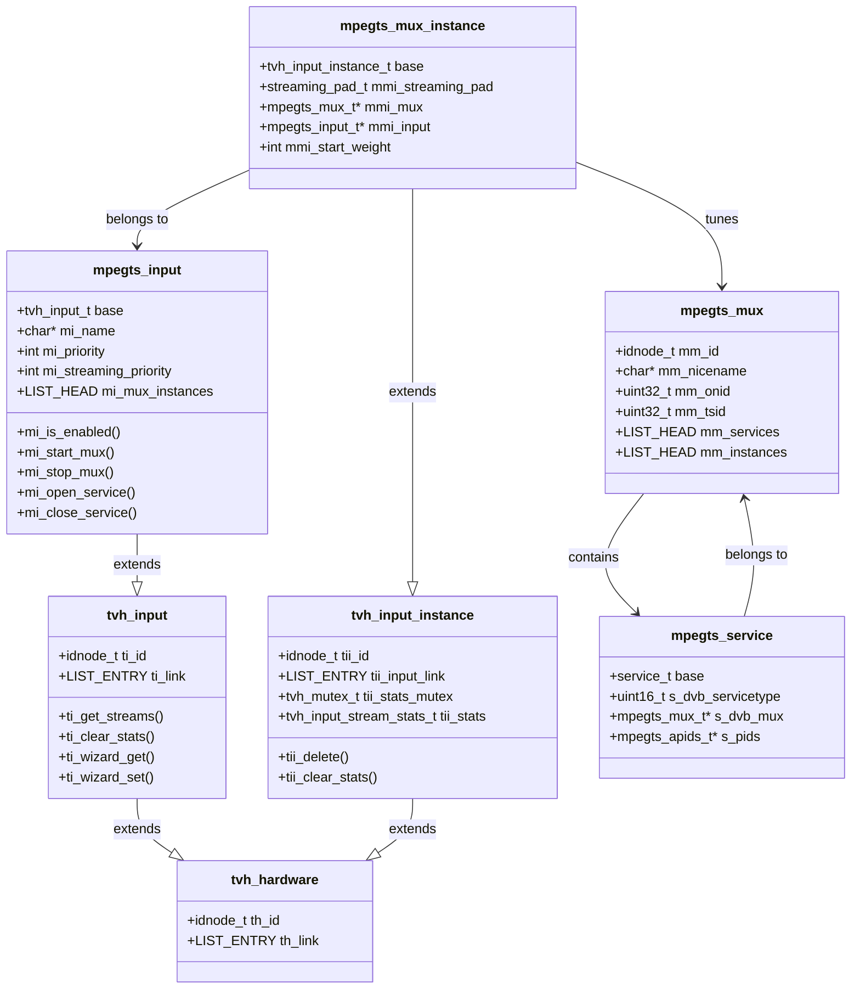
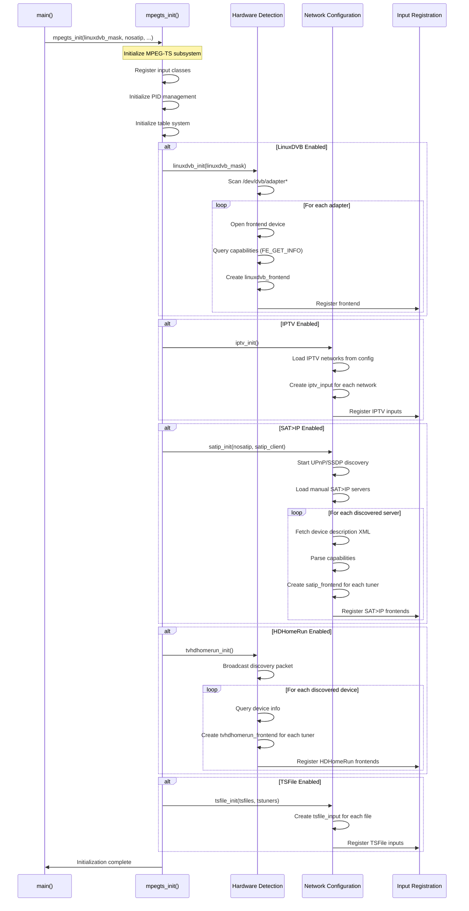
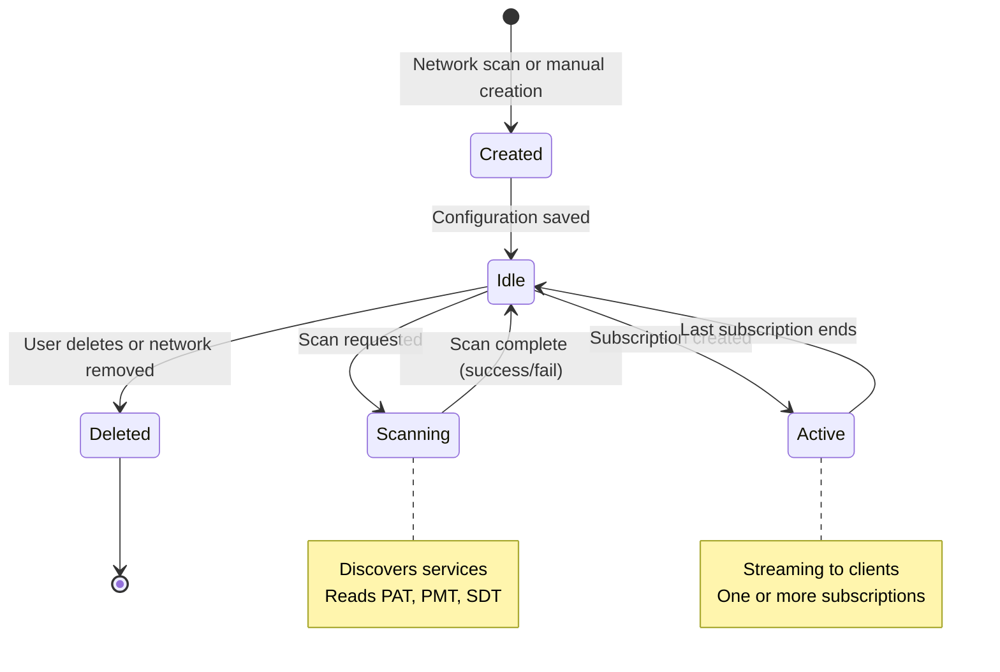
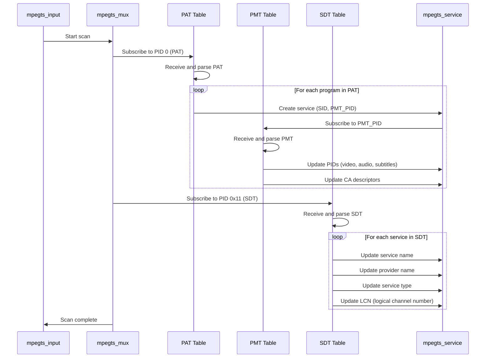
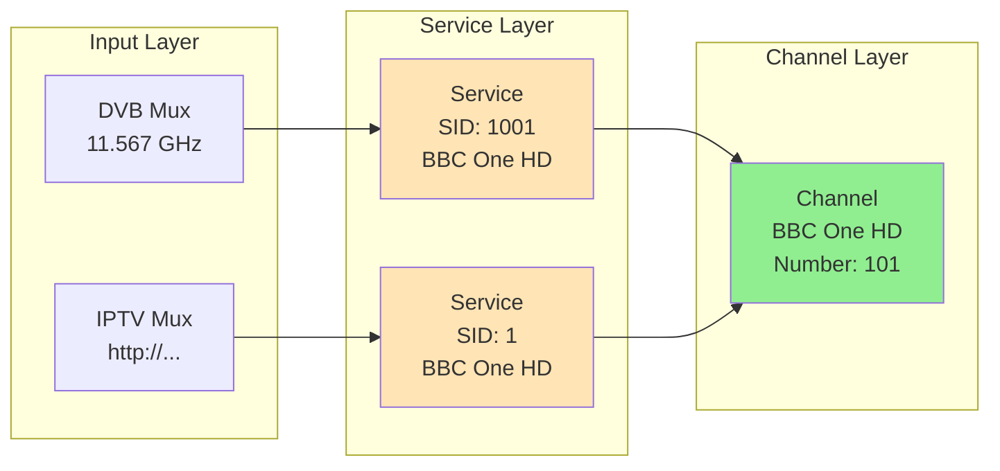
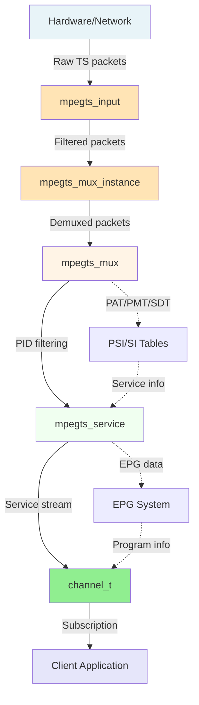

[← Back to Table of Contents](00-TOC.md)

## 5. Input Subsystem

The Input Subsystem is responsible for acquiring television and radio streams from various hardware and network sources. It provides a unified abstraction layer that allows the rest of Tvheadend to work with diverse input types (DVB adapters, IPTV streams, SAT>IP servers, HDHomeRun devices) through a consistent interface. This section documents the class hierarchy, supported input types, discovery mechanisms, and the relationship between inputs, muxes, and services.

### 5.1 Input Class Hierarchy

The input subsystem uses an object-oriented design (implemented in C) with a three-level class hierarchy that separates hardware representation, logical inputs, and active tuning instances.

#### 5.1.1 Class Structure Overview



#### 5.1.2 tvh_hardware Base Class

**Location**: `src/input.h`, `src/input.c`

The `tvh_hardware` structure is the root base class for all hardware-related objects in the input subsystem. It provides minimal functionality - primarily serving as an anchor for the idnode system and global hardware list.

**Structure Definition**:
```c
struct tvh_hardware {
  idnode_t                     th_id;      // Configuration node
  LIST_ENTRY(tvh_hardware)     th_link;    // Link in global hardware list
};
```

**Key Characteristics**:
- **Minimal interface**: Provides only basic idnode functionality
- **Global list**: All hardware objects are linked in `tvh_hardware` list
- **Configuration persistence**: Inherits from `idnode_t` for automatic save/load
- **No virtual methods**: Subclasses define their own behavior

**Purpose**:
- Serves as a common base for hardware detection and enumeration
- Enables uniform configuration management across all hardware types
- Provides a single point for hardware lifecycle management

**Global List**:
```c
extern tvh_hardware_list_t tvh_hardware;  // Global list of all hardware
#define TVH_HARDWARE_FOREACH(x) LIST_FOREACH(x, &tvh_hardware, th_link)
```

#### 5.1.3 tvh_input Class

**Location**: `src/input.h`, `src/input.c`

The `tvh_input` structure represents a logical input source - a tuner, network interface, or other mechanism capable of receiving broadcast streams. This is the primary abstraction that the rest of Tvheadend interacts with.

**Structure Definition**:
```c
struct tvh_input {
  idnode_t ti_id;                    // Configuration node
  LIST_ENTRY(tvh_input) ti_link;     // Link in global input list

  // Virtual methods
  void (*ti_get_streams) (tvh_input_t *, tvh_input_stream_list_t*);
  void (*ti_clear_stats) (tvh_input_t *);
  struct htsmsg *(*ti_wizard_get) (tvh_input_t *, const char *);
  void (*ti_wizard_set)  (tvh_input_t *, struct htsmsg *, const char *);
};
```

**Virtual Methods**:

1. **`ti_get_streams()`** - Retrieve active stream information
   - Returns list of currently active streams with statistics
   - Used by web UI to display input status
   - Each stream includes signal quality, PID list, subscription count

2. **`ti_clear_stats()`** - Reset statistics counters
   - Clears BER, UNC, continuity error counters
   - Called when user requests statistics reset
   - Does not affect actual tuning or streaming

3. **`ti_wizard_get()`** - Get wizard configuration data
   - Returns configuration options for setup wizard
   - Language-specific strings for UI
   - Used during initial configuration

4. **`ti_wizard_set()`** - Apply wizard configuration
   - Processes user selections from setup wizard
   - Creates networks, muxes, and initial configuration
   - Triggers initial scan if requested

**Relationship to Hardware**:
- Extends `tvh_hardware` conceptually (not via C inheritance)
- One hardware device may have multiple logical inputs (e.g., DVB adapter with multiple tuners)
- Each input can tune to one mux at a time

**Global List**:
```c
extern tvh_input_list_t tvh_inputs;  // Global list of all inputs
#define TVH_INPUT_FOREACH(x) LIST_FOREACH(x, &tvh_inputs, ti_link)
```

#### 5.1.4 tvh_input_instance Class

**Location**: `src/input.h`, `src/input.c`

The `tvh_input_instance` structure represents an active tuning instance - the connection between an input and a specific mux that is currently being tuned or streamed.

**Structure Definition**:
```c
struct tvh_input_instance {
  idnode_t tii_id;                           // Configuration node
  LIST_ENTRY(tvh_input_instance) tii_input_link;  // Link in input's instance list

  tvh_mutex_t              tii_stats_mutex;  // Protects statistics
  tvh_input_stream_stats_t tii_stats;        // Stream statistics

  // Virtual methods
  void (*tii_delete) (tvh_input_instance_t *tii);
  void (*tii_clear_stats) (tvh_input_instance_t *tii);
};
```

**Key Characteristics**:
- **One instance per active mux**: When an input tunes to a mux, an instance is created
- **Statistics tracking**: Maintains real-time signal quality and error counters
- **Thread-safe statistics**: Protected by `tii_stats_mutex` for concurrent access
- **Lifecycle management**: Created on tune, destroyed on stop

**Statistics Structure** (`tvh_input_stream_stats_t`):
```c
struct tvh_input_stream_stats {
  int signal;           // Signal strength (0-65535 or dBm * 10000)
  int snr;              // Signal-to-noise ratio (0-65535 or dB * 10000)
  int ber;              // Bit error rate (driver-specific)
  int unc;              // Uncorrected blocks
  int bps;              // Bandwidth in bits per second
  int cc;               // Continuity counter errors
  int te;               // Transport errors
  
  signal_status_scale_t signal_scale;  // SCALE_RELATIVE or SCALE_DECIBEL
  signal_status_scale_t snr_scale;     // SCALE_RELATIVE or SCALE_DECIBEL
  
  int ec_bit;           // Error bit count
  int tc_bit;           // Total bit count
  int ec_block;         // Error block count
  int tc_block;         // Total block count
};
```

**Statistics Interpretation**:
- **Signal/SNR scales**: Can be relative (0-100%) or absolute (dBm/dB)
- **BER calculation**: If `tc_bit > 0`, BER = `ec_bit / tc_bit`, else use driver-specific `ber` value
- **PER calculation**: Packet Error Rate = `ec_block / tc_block`
- **Atomic updates**: Statistics are updated atomically to prevent race conditions

#### 5.1.5 mpegts_input Class

**Location**: `src/input/mpegts.h`

The `mpegts_input` structure extends `tvh_input` with MPEG-TS specific functionality. This is the primary input class used by all MPEG-TS based inputs (DVB, IPTV, SAT>IP, HDHomeRun, TSFile).

**Structure Definition** (key fields):
```c
struct mpegts_input {
  tvh_input_t;  // Inherits from tvh_input

  int mi_enabled;                    // Input enabled flag
  int mi_instance;                   // Instance number
  char *mi_name;                     // Display name
  int mi_priority;                   // Tuning priority
  int mi_streaming_priority;         // Streaming priority
  int mi_ota_epg;                    // OTA EPG enabled
  int mi_initscan;                   // Initial scan enabled
  int mi_idlescan;                   // Idle scan enabled
  uint32_t mi_free_weight;           // Free weight for scheduling

  LIST_ENTRY(mpegts_input) mi_global_link;  // Global input list
  mpegts_network_link_list_t mi_networks;   // Associated networks
  LIST_HEAD(,tvh_input_instance) mi_mux_instances;  // Active instances

  // Input processing threads and queues
  pthread_t mi_input_tid;            // Input thread
  tvh_mutex_t mi_input_lock;         // Input queue lock
  tvh_cond_t mi_input_cond;          // Input queue condition
  TAILQ_HEAD(,mpegts_packet) mi_input_queue;  // Packet queue
  uint64_t mi_input_queue_size;      // Queue size in bytes

  // Table processing
  pthread_t mi_table_tid;            // Table processing thread
  tvh_cond_t mi_table_cond;          // Table queue condition
  mpegts_table_feed_queue_t mi_table_queue;  // Table data queue

  // Active muxes
  LIST_HEAD(,mpegts_mux_instance) mi_mux_active;  // Currently active muxes

  // Virtual methods (in addition to tvh_input methods)
  int  (*mi_is_enabled)     (mpegts_input_t*, mpegts_mux_t *mm, int flags, int weight);
  void (*mi_enabled_updated)(mpegts_input_t*);
  void (*mi_display_name)   (mpegts_input_t*, char *buf, size_t len);
  int  (*mi_get_weight)     (mpegts_input_t*, mpegts_mux_t *mm, int flags, int weight);
  int  (*mi_get_priority)   (mpegts_input_t*, mpegts_mux_t *mm, int flags);
  int  (*mi_get_grace)      (mpegts_input_t*, mpegts_mux_t *mm);
  int  (*mi_warm_mux)       (mpegts_input_t*,mpegts_mux_instance_t*);
  int  (*mi_start_mux)      (mpegts_input_t*,mpegts_mux_instance_t*, int weight);
  void (*mi_stop_mux)       (mpegts_input_t*,mpegts_mux_instance_t*);
  void (*mi_open_service)   (mpegts_input_t*,mpegts_service_t*, int flags, int first, int weight);
  void (*mi_close_service)  (mpegts_input_t*,mpegts_service_t*);
  void (*mi_update_pids)    (mpegts_input_t*,mpegts_mux_t*);
  void (*mi_create_mux_instance) (mpegts_input_t*,mpegts_mux_t*);
  void (*mi_started_mux)    (mpegts_input_t*,mpegts_mux_instance_t*);
  void (*mi_stopping_mux)   (mpegts_input_t*,mpegts_mux_instance_t*);
  void (*mi_stopped_mux)    (mpegts_input_t*,mpegts_mux_instance_t*);
  int  (*mi_has_subscription) (mpegts_input_t*, mpegts_mux_t *mm);
  void (*mi_error)          (mpegts_input_t*, mpegts_mux_t *, int tss_flags);
  void (*mi_empty_status)   (mpegts_input_t*, tvh_input_stream_t *);
  idnode_set_t *(*mi_network_list) (mpegts_input_t*);
};
```

**Key Virtual Methods**:

1. **`mi_is_enabled()`** - Check if input can tune to mux
   - Returns MI_IS_ENABLED_OK, MI_IS_ENABLED_NEVER, or MI_IS_ENABLED_RETRY
   - Checks hardware availability, network compatibility, resource limits
   - Called during subscription service selection

2. **`mi_start_mux()`** - Start tuning to a mux
   - Tunes hardware to specified frequency/parameters
   - Creates input processing threads if needed
   - Returns 0 on success, negative on error

3. **`mi_stop_mux()`** - Stop tuning a mux
   - Stops hardware tuning
   - Cleans up resources
   - Called when last subscription ends

4. **`mi_open_service()`** - Open a service for streaming
   - Configures PID filtering for the service
   - Updates hardware filters if supported
   - Called when subscription starts

5. **`mi_close_service()`** - Close a service
   - Removes PID filters
   - Updates hardware configuration
   - Called when subscription ends

**Threading Model**:
- **Input thread** (`mi_input_tid`): Receives packets from hardware/network, queues for processing
- **Table thread** (`mi_table_tid`): Processes PSI/SI tables (PAT, PMT, SDT, etc.)
- **Main thread**: Processes timers, handles mux start/stop with `global_lock` held

#### 5.1.6 mpegts_mux_instance Class

**Location**: `src/input/mpegts.h`

The `mpegts_mux_instance` structure extends `tvh_input_instance` with MPEG-TS specific functionality. It represents an active connection between an `mpegts_input` and an `mpegts_mux`.

**Structure Definition**:
```c
struct mpegts_mux_instance {
  tvh_input_instance_t;  // Inherits from tvh_input_instance

  LIST_ENTRY(mpegts_mux_instance) mmi_mux_link;     // Link in mux's instance list
  LIST_ENTRY(mpegts_mux_instance) mmi_active_link;  // Link in input's active list

  streaming_pad_t mmi_streaming_pad;  // Output pad for streaming data
  
  mpegts_mux_t   *mmi_mux;            // The mux being tuned
  mpegts_input_t *mmi_input;          // The input doing the tuning

  int             mmi_start_weight;   // Weight when started
  int             mmi_tune_failed;    // Tuning failure flag
};
```

**Key Characteristics**:
- **Streaming pad**: Each instance has a `streaming_pad_t` that delivers packets to subscriptions
- **Bidirectional links**: Linked to both the mux and the input for efficient lookup
- **Weight tracking**: Records the subscription weight that triggered the tuning
- **Failure tracking**: Tracks tuning failures for error handling and retry logic

**Lifecycle**:
1. **Creation**: `mpegts_mux_instance_create()` called when input needs to tune to mux
2. **Activation**: `mi_start_mux()` called to begin tuning
3. **Streaming**: Packets flow through `mmi_streaming_pad` to subscriptions
4. **Deactivation**: `mi_stop_mux()` called when no more subscriptions
5. **Destruction**: Instance deleted and resources freed


#### 5.1.7 Relationship to mpegts_mux and mpegts_service

The input class hierarchy is tightly integrated with muxes and services:

**mpegts_mux → mpegts_mux_instance → mpegts_input**:
- A `mpegts_mux` represents a logical multiplex (frequency, modulation parameters)
- When a subscription requires the mux, an `mpegts_mux_instance` is created
- The instance connects to an available `mpegts_input` that can tune to the mux
- Multiple inputs may have instances for the same mux (redundancy, load balancing)

**mpegts_service → mpegts_mux → mpegts_input**:
- A `mpegts_service` belongs to exactly one `mpegts_mux`
- Services are discovered by scanning the mux (reading PAT/PMT tables)
- When a service is subscribed, the input opens PID filters for that service
- Multiple services can be streamed from the same mux simultaneously

**Data Flow**:
```
Hardware/Network → mpegts_input (input thread)
                → mpegts_mux_instance (streaming pad)
                → mpegts_service (service filtering)
                → Subscription (client delivery)
```

### 5.2 Supported Input Types

Tvheadend supports multiple input types, each implemented as a subclass of `mpegts_input`. This section documents the major input implementations, their capabilities, and implementation details.

#### 5.2.1 LinuxDVB Input

**Location**: `src/input/mpegts/linuxdvb/`

The LinuxDVB input provides native support for DVB hardware using the Linux DVB API (Video4Linux2). This is the most mature and feature-complete input type, supporting all major DVB standards.

**Supported Standards**:
- **DVB-S/S2** (Satellite): Single and multi-satellite configurations with DiSEqC support
- **DVB-T/T2** (Terrestrial): Standard and high-definition terrestrial broadcasts
- **DVB-C/C2** (Cable): Cable television systems
- **ATSC** (North American): ATSC 1.0 digital television
- **ISDB-T** (Japanese/Brazilian): Integrated Services Digital Broadcasting

**Key Features**:
- **Hardware detection**: Automatic detection of DVB adapters at startup via `/dev/dvb/adapter*`
- **Frontend capabilities**: Queries hardware capabilities (supported delivery systems, frequency ranges)
- **DiSEqC support**: Full DiSEqC 1.0/1.1/1.2 support for satellite dish control
- **LNB configuration**: Configurable LNB types, local oscillator frequencies, polarization
- **Signal monitoring**: Real-time signal strength, SNR, BER, UNC from hardware
- **Hardware PID filtering**: Efficient filtering using hardware demux (when supported)
- **Multiple tuners**: Support for adapters with multiple independent tuners

**Class Hierarchy**:
```
mpegts_input
  └─ linuxdvb_frontend (represents one tuner)
      ├─ linuxdvb_frontend_dvbs (satellite-specific)
      ├─ linuxdvb_frontend_dvbt (terrestrial-specific)
      └─ linuxdvb_frontend_dvbc (cable-specific)
```

**Hardware Detection**:
```c
// Scans /dev/dvb/adapter* directories
// For each adapter:
//   - Opens frontend device (/dev/dvb/adapterN/frontendM)
//   - Queries capabilities (FE_GET_INFO ioctl)
//   - Creates linuxdvb_frontend object
//   - Registers with input subsystem
```

**Tuning Process**:
1. **Frontend setup**: Configure LNB, DiSEqC, polarization (satellite only)
2. **Tune command**: Issue `FE_SET_FRONTEND` ioctl with frequency/modulation parameters
3. **Lock wait**: Poll `FE_READ_STATUS` until `FE_HAS_LOCK` bit is set
4. **Stream start**: Open demux device, set PID filters, start reading packets
5. **Monitoring**: Periodically read signal statistics via `FE_READ_SIGNAL_STRENGTH`, `FE_READ_SNR`, etc.

**PID Filtering**:
- **Hardware demux**: Uses `/dev/dvb/adapterN/demuxM` device for PID filtering
- **Filter setup**: `DMX_SET_PES_FILTER` ioctl for each PID
- **Full mux mode**: `DMX_SET_BUFFER_SIZE` + read from `/dev/dvb/adapterN/dvrM` for all PIDs
- **Automatic switching**: Switches between filtered and full mux mode based on subscription needs

**Configuration**:
- **Adapter selection**: Command-line option `-a, --adapters` to limit which adapters to use
- **Per-adapter settings**: Network assignment, priority, enabled/disabled state
- **Frontend parameters**: Delivery system, frequency, symbol rate, modulation, FEC, etc.
- **LNB configuration**: LNB type, LOF frequencies, switch configuration

**Limitations**:
- **Linux-specific**: Requires Linux kernel with DVB support
- **Driver quality**: Performance depends on hardware driver quality
- **Hardware quirks**: Some adapters require workarounds for bugs
- **Resource limits**: Limited number of simultaneous PID filters on some hardware

#### 5.2.2 IPTV Input

**Location**: `src/input/mpegts/iptv/`

The IPTV input enables Tvheadend to receive streams over IP networks using various protocols. This is the most flexible input type, supporting both live streams and file-based inputs.

**Supported Protocols**:
- **HTTP/HTTPS**: Standard HTTP streaming (including HLS with m3u8 playlists)
- **UDP**: Raw UDP multicast or unicast streams
- **RTP**: Real-time Transport Protocol
- **RTSP**: Real-Time Streaming Protocol
- **Pipe**: External program output (e.g., `ffmpeg`, `streamlink`)
- **File**: Local MPEG-TS files

**Key Features**:
- **M3U playlist import**: Bulk import of channels from M3U/M3U8 playlists
- **Automatic mux creation**: Creates muxes automatically from playlist entries
- **EPG integration**: Supports XMLTV EPG for IPTV channels
- **Flexible URL patterns**: Supports complex URL patterns with variables
- **Authentication**: HTTP basic auth, custom headers
- **Pipe commands**: Execute external programs to generate streams
- **Scan on demand**: Scans mux when first subscribed (no initial scan required)

**Class Structure**:
```
mpegts_input
  └─ iptv_input (one per IPTV network)
      └─ iptv_mux (one per stream URL)
```

**Network Configuration**:
- **IPTV Network**: Logical grouping of IPTV sources
- **Automatic mux creation**: Muxes created from M3U import or manual entry
- **URL templates**: Support for dynamic URLs with channel-specific parameters
- **Max streams**: Configurable limit on simultaneous streams per network

**Stream Acquisition**:
1. **URL resolution**: Resolve URL template with channel-specific parameters
2. **Connection**: Establish HTTP/UDP/RTSP connection
3. **Data reception**: Receive MPEG-TS packets
4. **Buffering**: Buffer packets to smooth network jitter
5. **Delivery**: Feed packets to input processing queue

**HTTP Streaming**:
- **User-Agent**: Configurable User-Agent header
- **Referer**: Optional Referer header
- **Custom headers**: Support for arbitrary HTTP headers
- **Redirects**: Follows HTTP redirects automatically
- **Keep-alive**: Maintains persistent connections
- **Timeout handling**: Reconnects on timeout or error

**UDP Streaming**:
- **Multicast**: Joins multicast groups automatically
- **Unicast**: Receives unicast UDP streams
- **Port binding**: Binds to specific port if specified in URL
- **Buffer size**: Configurable receive buffer size

**Pipe Streaming**:
- **Command execution**: Spawns external program (e.g., `ffmpeg -i <url> -c copy -f mpegts pipe:1`)
- **Stdout capture**: Reads MPEG-TS from program's stdout
- **Error handling**: Monitors stderr for errors
- **Automatic restart**: Restarts program on failure

**M3U Playlist Format**:
```
#EXTM3U
#EXTINF:-1 tvg-id="channel1" tvg-name="Channel 1" tvg-logo="http://example.com/logo.png",Channel 1
http://example.com/stream1.ts
#EXTINF:-1 tvg-id="channel2" tvg-name="Channel 2",Channel 2
udp://@239.0.0.1:1234
```

**Configuration**:
- **Network settings**: Max streams, scan on demand, priority
- **Mux settings**: URL, service name, icon URL
- **Service mapping**: Automatic or manual channel mapping
- **EPG source**: XMLTV socket or file

**Advantages**:
- **No hardware required**: Works on any system with network connectivity
- **Flexible sources**: Supports many protocols and stream types
- **Easy setup**: Simple URL-based configuration
- **Scalable**: Can handle many streams limited only by network bandwidth

**Limitations**:
- **Network dependent**: Quality depends on network reliability
- **No signal stats**: Cannot provide hardware signal quality metrics
- **Stream quality**: Dependent on source quality and encoding
- **Latency**: Higher latency than hardware inputs

#### 5.2.3 SAT>IP Client Input

**Location**: `src/input/mpegts/satip/`

The SAT>IP client input allows Tvheadend to receive streams from SAT>IP servers - network-attached satellite receivers that stream DVB-S/S2 signals over IP.

**SAT>IP Protocol**:
- **Discovery**: UPnP/SSDP discovery of SAT>IP servers on local network
- **RTSP control**: Uses RTSP for session management and tuning
- **RTP streaming**: Receives MPEG-TS over RTP/UDP
- **Standard compliance**: Implements SAT>IP specification v1.2+

**Key Features**:
- **Automatic discovery**: Discovers SAT>IP servers via UPnP
- **Manual configuration**: Can manually add servers by IP address
- **Multi-tuner support**: Supports servers with multiple tuners
- **Frontend emulation**: Appears as virtual DVB adapters to Tvheadend
- **Signal statistics**: Retrieves signal quality from server
- **DiSEqC support**: Passes DiSEqC commands to server
- **Position tracking**: Tracks satellite dish position

**Class Structure**:
```
mpegts_input
  └─ satip_frontend (represents one SAT>IP tuner)
      └─ satip_satconf (satellite configuration)
```

**Discovery Process**:
1. **SSDP search**: Sends M-SEARCH multicast to discover SAT>IP servers
2. **Device description**: Fetches XML device description from server
3. **Capability parsing**: Parses supported delivery systems and tuner count
4. **Frontend creation**: Creates virtual frontend for each tuner
5. **Registration**: Registers frontends with input subsystem

**Tuning Process**:
1. **RTSP SETUP**: Establishes RTSP session with server
   ```
   SETUP rtsp://server:554/?src=1&freq=11.567&pol=h&msys=dvbs2&mtype=8psk&sr=22000 RTSP/1.0
   ```
2. **RTSP PLAY**: Starts streaming
   ```
   PLAY rtsp://server:554/stream=1 RTSP/1.0
   ```
3. **RTP reception**: Receives RTP packets on specified UDP port
4. **Keep-alive**: Sends periodic RTSP OPTIONS to maintain session
5. **RTSP TEARDOWN**: Closes session when done

**Configuration**:
- **Server discovery**: Automatic or manual server addition
- **Frontend mapping**: Maps SAT>IP tuners to virtual frontends
- **Network assignment**: Associates frontends with networks
- **Priority**: Tuning priority relative to other inputs
- **Full mux mode**: Option to receive full transponder

**Advantages**:
- **Network-based**: No need for local DVB hardware
- **Flexible placement**: Server can be located anywhere on network
- **Shared access**: Multiple Tvheadend instances can use same server
- **Simplified wiring**: Single network cable instead of coax runs

**Limitations**:
- **Network bandwidth**: Requires ~20-50 Mbps per stream
- **Latency**: Higher latency than local hardware
- **Server dependency**: Relies on SAT>IP server availability and quality
- **Limited control**: Some features depend on server implementation

#### 5.2.4 HDHomeRun Input

**Location**: `src/input/mpegts/tvhdhomerun/`

The HDHomeRun input provides support for SiliconDust HDHomeRun network tuners - popular devices for receiving ATSC, DVB-T, and DVB-C broadcasts over Ethernet.

**Supported Models**:
- **HDHR3-US/EU**: ATSC/DVB-T dual tuner
- **HDHR4-2US/2DT**: ATSC/DVB-T dual tuner (newer generation)
- **HDHR5-4US/4DT**: ATSC 1.0/3.0 quad tuner
- **HDHomeRun PRIME**: CableCARD triple tuner
- **HDHomeRun CONNECT**: Various models with 2-4 tuners

**Key Features**:
- **Automatic discovery**: Discovers HDHomeRun devices via broadcast protocol
- **Multi-tuner support**: Supports devices with multiple tuners
- **Channel mapping**: Uses HDHomeRun's channel map
- **Signal statistics**: Retrieves signal quality from device
- **Firmware updates**: Can trigger firmware updates
- **CableCARD support**: Supports encrypted cable channels (PRIME model)

**Class Structure**:
```
mpegts_input
  └─ tvhdhomerun_frontend (represents one HDHomeRun tuner)
```

**Discovery Process**:
1. **Broadcast discovery**: Sends UDP broadcast to discover devices
2. **Device query**: Queries device for model, tuner count, firmware version
3. **Tuner enumeration**: Creates frontend for each tuner
4. **Channel scan**: Optionally scans for available channels
5. **Registration**: Registers frontends with input subsystem

**Tuning Process**:
1. **Tuner lock**: Locks tuner for exclusive use
2. **Channel set**: Sets channel/frequency via HTTP API
3. **Stream start**: Opens RTP stream from device
4. **Data reception**: Receives MPEG-TS over RTP/UDP
5. **Tuner release**: Releases tuner when done

**HTTP API Communication**:
```
GET http://device-ip/tuner0/channel?channel=auto:123
GET http://device-ip/tuner0/streaminfo
GET http://device-ip/tuner0/status
```

**Configuration**:
- **Device discovery**: Automatic or manual IP address
- **Tuner selection**: Enable/disable individual tuners
- **Network assignment**: Associate tuners with networks
- **Priority**: Tuning priority
- **Channel map**: Select appropriate channel map for region

**Advantages**:
- **Easy setup**: Plug-and-play network tuners
- **Good performance**: Low latency, reliable streaming
- **Multiple tuners**: 2-4 tuners in single device
- **Cross-platform**: Works on any system with network connectivity
- **Active development**: Regular firmware updates from SiliconDust

**Limitations**:
- **Proprietary**: Closed-source firmware and protocol
- **Limited standards**: Primarily ATSC and DVB-T/C (no DVB-S)
- **Regional**: Different models for different regions
- **Cost**: More expensive than USB DVB adapters

#### 5.2.5 TSFile Input (Testing)

**Location**: `src/input/mpegts/tsfile/`

The TSFile input is a special input type designed for testing and development. It reads MPEG-TS data from files and simulates a live input source.

**Purpose**:
- **Testing**: Test Tvheadend without hardware or network sources
- **Development**: Develop and debug features with known input data
- **Playback**: Play back recorded transport streams
- **Simulation**: Simulate specific scenarios (errors, edge cases)

**Key Features**:
- **File-based**: Reads from local MPEG-TS files
- **Configurable tuners**: Simulates multiple tuners
- **Looping**: Can loop files for continuous playback
- **Rate control**: Can play at real-time rate or faster
- **PCR-based timing**: Uses PCR timestamps for accurate timing

**Configuration**:
- **File path**: Path to MPEG-TS file
- **Tuner count**: Number of virtual tuners to create (command-line: `--tsfile_tuners`)
- **Loop mode**: Whether to loop file playback
- **Rate**: Playback rate multiplier

**Usage Example**:
```bash
tvheadend --tsfile /path/to/stream.ts --tsfile_tuners 2
```

**Limitations**:
- **Not for production**: Intended for testing only
- **No real-time**: Cannot receive live broadcasts
- **Limited features**: No signal statistics, no scanning
- **File dependency**: Requires pre-recorded MPEG-TS files

#### 5.2.6 Input Type Comparison

| Feature | LinuxDVB | IPTV | SAT>IP | HDHomeRun | TSFile |
|---------|----------|------|--------|-----------|--------|
| **Hardware Required** | Yes (DVB adapter) | No | No | No | No |
| **Network Required** | No | Yes | Yes | Yes | No |
| **Standards** | DVB-S/T/C, ATSC, ISDB-T | Any | DVB-S/T/C | ATSC, DVB-T/C | Any |
| **Signal Stats** | Yes (hardware) | No | Yes (from server) | Yes (from device) | No |
| **PID Filtering** | Hardware | Software | Server | Device | Software |
| **Multi-tuner** | Yes | N/A | Yes | Yes | Yes (simulated) |
| **Setup Complexity** | Medium | Low | Low | Low | Very Low |
| **Latency** | Lowest | Medium-High | Medium | Low | N/A |
| **Cost** | Low-Medium | Free (software) | Medium | Medium-High | Free |
| **Reliability** | High | Variable | Medium | High | N/A |
| **Use Case** | Local DVB reception | Internet streams | Network DVB | Network ATSC/DVB | Testing |


### 5.3 Input Discovery and Initialization

The input subsystem initializes during Tvheadend startup, discovering available hardware and configuring network inputs. This section describes the discovery mechanisms, initialization sequence, and registration process for each input type.

#### 5.3.1 Initialization Sequence

Input subsystem initialization occurs during the main initialization phase (see Section 3.2) with `global_lock` held. The sequence is:



**Initialization Function**:
```c
void mpegts_init(int linuxdvb_mask, int nosatip, str_list_t *satip_client,
                 str_list_t *tsfiles, int tstuners)
{
  // Register idnode classes
  idclass_register(&mpegts_input_class);
  idclass_register(&mpegts_network_class);
  idclass_register(&mpegts_mux_class);
  idclass_register(&mpegts_service_class);
  
  // Initialize subsystems
  mpegts_pid_init();
  mpegts_table_init();
  
  // Initialize input drivers (order matters for priority)
#if ENABLE_LINUXDVB
  if (linuxdvb_mask >= 0)
    linuxdvb_init(linuxdvb_mask);
#endif
  
#if ENABLE_IPTV
  iptv_init();
#endif
  
#if ENABLE_SATIP_CLIENT
  if (!nosatip)
    satip_client_init(satip_client);
#endif
  
#if ENABLE_HDHOMERUN_CLIENT
  tvhdhomerun_init();
#endif
  
#if ENABLE_TSFILE
  if (tsfiles)
    tsfile_init(tsfiles, tstuners);
#endif
}
```

#### 5.3.2 Hardware Detection (LinuxDVB)

LinuxDVB hardware detection scans the `/dev/dvb/` directory structure to find available DVB adapters and frontends.

**Detection Process**:

1. **Directory Scanning**:
   ```c
   // Scan /dev/dvb/adapter0, /dev/dvb/adapter1, ...
   for (adapter = 0; adapter < 16; adapter++) {
     if (linuxdvb_mask >= 0 && !(linuxdvb_mask & (1 << adapter)))
       continue;  // Skip if not in mask
     
     snprintf(path, sizeof(path), "/dev/dvb/adapter%d", adapter);
     if (access(path, R_OK))
       continue;  // Adapter doesn't exist
     
     // Scan frontends in this adapter
     linuxdvb_adapter_scan(adapter);
   }
   ```

2. **Frontend Enumeration**:
   ```c
   // For each adapter, scan frontend0, frontend1, ...
   for (frontend = 0; frontend < 8; frontend++) {
     snprintf(path, sizeof(path), "/dev/dvb/adapter%d/frontend%d", 
              adapter, frontend);
     
     fd = open(path, O_RDWR | O_NONBLOCK);
     if (fd < 0)
       break;  // No more frontends
     
     // Query frontend capabilities
     if (ioctl(fd, FE_GET_INFO, &fe_info) == 0) {
       linuxdvb_frontend_create(adapter, frontend, &fe_info);
     }
     close(fd);
   }
   ```

3. **Capability Parsing**:
   ```c
   struct dvb_frontend_info {
     char name[128];                    // Frontend name
     enum fe_type type;                 // FE_QPSK, FE_QAM, FE_OFDM, FE_ATSC
     uint32_t frequency_min;            // Minimum frequency (Hz)
     uint32_t frequency_max;            // Maximum frequency (Hz)
     uint32_t symbol_rate_min;          // Minimum symbol rate
     uint32_t symbol_rate_max;          // Maximum symbol rate
     enum fe_caps caps;                 // Capability flags
   };
   
   // Modern API: Query supported delivery systems
   struct dtv_property props[] = {
     { .cmd = DTV_ENUM_DELSYS }
   };
   ioctl(fd, FE_GET_PROPERTY, &props);
   // Returns list: DVB-S, DVB-S2, DVB-T, DVB-T2, etc.
   ```

4. **Frontend Creation**:
   ```c
   linuxdvb_frontend_t *lfe = calloc(1, sizeof(linuxdvb_frontend_t));
   lfe->lfe_adapter = adapter;
   lfe->lfe_number = frontend;
   lfe->lfe_type = determine_type(&fe_info);  // DVB-S, DVB-T, DVB-C, ATSC
   lfe->lfe_name = strdup(fe_info.name);
   
   // Register with input subsystem
   mpegts_input_create0(&lfe->mi_input, ...);
   ```

**Adapter Masking**:
- Command-line option: `-a, --adapters <mask>`
- Mask format: Comma-separated list or bitmask
- Examples:
  - `-a 0,1,2` - Use adapters 0, 1, and 2
  - `-a -1` - Disable all DVB adapters
  - No option - Use all detected adapters

**Configuration Loading**:
After detection, Tvheadend loads saved configuration for each adapter:
```
~/.hts/tvheadend/input/linuxdvb/adapters/<uuid>/config
```

#### 5.3.3 Network Input Configuration (IPTV)

IPTV inputs are not discovered automatically - they are created from configuration or user input.

**Initialization Process**:

1. **Load Networks**:
   ```c
   void iptv_init(void) {
     // Load IPTV networks from configuration
     idnode_load_all("input/iptv/networks", &iptv_network_class);
     
     // Each network creates its own iptv_input
     // Muxes are loaded as part of network configuration
   }
   ```

2. **Network Creation**:
   - User creates IPTV network via web UI
   - Network configuration saved to disk
   - `iptv_input` created for the network
   - Muxes can be added manually or via M3U import

3. **M3U Import**:
   ```c
   // User uploads M3U file or provides URL
   // Parser extracts:
   //   - Channel name (from #EXTINF)
   //   - Stream URL
   //   - EPG ID (tvg-id)
   //   - Channel logo (tvg-logo)
   //   - Channel number (tvg-chno)
   
   // For each entry:
   //   - Create iptv_mux with URL
   //   - Create iptv_service
   //   - Optionally create channel
   ```

4. **Automatic Mux Creation**:
   - IPTV muxes created on-demand when URL is provided
   - No initial scan required
   - Service discovered on first subscription

**Configuration Structure**:
```
~/.hts/tvheadend/input/iptv/
  └─ networks/
      └─ <network-uuid>/
          ├─ config                    # Network settings
          └─ muxes/
              └─ <mux-uuid>/
                  └─ config            # Mux settings (URL, etc.)
```

#### 5.3.4 Network Discovery (SAT>IP)

SAT>IP servers are discovered using UPnP/SSDP (Simple Service Discovery Protocol).

**Discovery Process**:

1. **SSDP Search**:
   ```c
   // Send M-SEARCH multicast to 239.255.255.250:1900
   const char *search_msg = 
     "M-SEARCH * HTTP/1.1\r\n"
     "HOST: 239.255.255.250:1900\r\n"
     "MAN: \"ssdp:discover\"\r\n"
     "MX: 2\r\n"
     "ST: urn:ses-com:device:SatIPServer:1\r\n"
     "\r\n";
   
   // Wait for responses from SAT>IP servers
   ```

2. **Device Description**:
   ```c
   // Server responds with location of device description XML
   // Example response:
   // HTTP/1.1 200 OK
   // LOCATION: http://192.168.1.100:8080/description.xml
   // ST: urn:ses-com:device:SatIPServer:1
   
   // Fetch and parse XML:
   // <device>
   //   <friendlyName>SAT>IP Server</friendlyName>
   //   <manufacturer>Vendor</manufacturer>
   //   <modelName>Model</modelName>
   //   <satip:X_SATIPCAP>DVBS2-2,DVBT2-2</satip:X_SATIPCAP>
   // </device>
   ```

3. **Capability Parsing**:
   ```c
   // Parse X_SATIPCAP string:
   // "DVBS2-2,DVBT2-2" means:
   //   - 2 DVB-S2 tuners
   //   - 2 DVB-T2 tuners
   
   // Create frontend for each tuner
   for (int i = 0; i < dvbs2_count; i++) {
     satip_frontend_create(server, SATIP_DVBS2, i);
   }
   for (int i = 0; i < dvbt2_count; i++) {
     satip_frontend_create(server, SATIP_DVBT2, i);
   }
   ```

4. **Manual Configuration**:
   - User can manually add SAT>IP server by IP address
   - Useful when UPnP discovery doesn't work (firewall, VLAN, etc.)
   - Configuration: `--satip_xml <url>` or via web UI

**Continuous Discovery**:
- Discovery runs periodically to detect new servers
- Servers that disappear are marked offline
- Automatic reconnection when server comes back online

#### 5.3.5 Device Discovery (HDHomeRun)

HDHomeRun devices are discovered using a proprietary UDP broadcast protocol.

**Discovery Process**:

1. **Broadcast Discovery**:
   ```c
   // Send discovery packet to broadcast address
   // UDP port 65001
   struct hdhomerun_discover_packet {
     uint8_t type;        // HDHOMERUN_TYPE_DISCOVER_REQ
     uint16_t length;
     uint32_t device_id;  // 0xFFFFFFFF for broadcast
   };
   
   // Wait for responses from devices
   ```

2. **Device Query**:
   ```c
   // Query device for details via HTTP API
   // GET http://device-ip/discover.json
   // Response:
   // {
   //   "FriendlyName": "HDHomeRun CONNECT",
   //   "ModelNumber": "HDHR4-2US",
   //   "FirmwareVersion": "20200907",
   //   "DeviceID": "12345678",
   //   "TunerCount": 2
   // }
   ```

3. **Tuner Enumeration**:
   ```c
   // Create frontend for each tuner
   for (int i = 0; i < tuner_count; i++) {
     tvhdhomerun_frontend_create(device, i);
   }
   ```

4. **Channel Lineup**:
   ```c
   // Optionally fetch channel lineup
   // GET http://device-ip/lineup.json
   // Returns list of available channels with frequencies
   ```

**Manual Configuration**:
- User can manually add HDHomeRun by IP address
- Useful when broadcast discovery doesn't work
- Configuration via web UI

#### 5.3.6 Input Registration Process

Once an input is created (either through discovery or configuration), it must be registered with the input subsystem.

**Registration Steps**:

1. **Input Creation**:
   ```c
   mpegts_input_t *mi = mpegts_input_create0(
     calloc(1, sizeof(linuxdvb_frontend_t)),
     &linuxdvb_frontend_class,
     uuid,
     conf
   );
   ```

2. **Add to Global List**:
   ```c
   LIST_INSERT_HEAD(&mpegts_input_all, mi, mi_global_link);
   LIST_INSERT_HEAD(&tvh_inputs, (tvh_input_t*)mi, ti_link);
   ```

3. **Network Association**:
   ```c
   // Associate input with networks
   // Either from configuration or user selection
   mpegts_input_add_network(mi, network);
   ```

4. **Create Mux Instances**:
   ```c
   // For each mux in associated networks
   mpegts_mux_t *mm;
   LIST_FOREACH(mm, &network->mn_muxes, mm_network_link) {
     if (mi->mi_create_mux_instance)
       mi->mi_create_mux_instance(mi, mm);
   }
   ```

5. **Start Status Timer**:
   ```c
   // Start periodic status updates
   mtimer_arm_rel(&mi->mi_status_timer, mpegts_input_status_timer, mi, 1000);
   ```

6. **Notify UI**:
   ```c
   notify_reload("input");  // Notify web UI of new input
   ```

#### 5.3.7 Capability Reporting

Each input reports its capabilities to enable proper mux assignment and service selection.

**Capability Types**:

1. **Delivery Systems**:
   - DVB-S, DVB-S2, DVB-T, DVB-T2, DVB-C, DVB-C2, ATSC, ISDB-T
   - Determines which muxes the input can tune to

2. **Frequency Ranges**:
   - Minimum and maximum frequency
   - Used to validate mux parameters

3. **Modulation Support**:
   - Supported modulation types (QPSK, 8PSK, QAM16, QAM64, etc.)
   - FEC rates (1/2, 2/3, 3/4, 5/6, 7/8, etc.)

4. **Hardware Features**:
   - PID filtering capability
   - Number of simultaneous PID filters
   - Full mux mode support
   - Hardware descrambling (CI/CAM)

5. **Tuning Constraints**:
   - Tuning time (how long to wait for lock)
   - Grace period (testing time before declaring service good)
   - Maximum simultaneous services

**Capability Query**:
```c
int mi_is_enabled(mpegts_input_t *mi, mpegts_mux_t *mm, int flags, int weight)
{
  // Check if input can tune to this mux
  
  // 1. Check delivery system compatibility
  if (!delivery_system_match(mi, mm))
    return MI_IS_ENABLED_NEVER;
  
  // 2. Check frequency range
  if (mm->frequency < mi->freq_min || mm->frequency > mi->freq_max)
    return MI_IS_ENABLED_NEVER;
  
  // 3. Check if input is enabled
  if (!mi->mi_enabled)
    return MI_IS_ENABLED_NEVER;
  
  // 4. Check if input is busy
  if (mi->mi_running && weight < current_weight)
    return MI_IS_ENABLED_RETRY;  // Try again later
  
  // 5. Check resource limits
  if (active_subscriptions >= max_subscriptions)
    return MI_IS_ENABLED_RETRY;
  
  return MI_IS_ENABLED_OK;
}
```

**Priority and Weight**:
- **Priority**: Static value assigned to input (higher = preferred)
- **Weight**: Dynamic value based on subscription importance
- **Selection**: Input with highest priority and sufficient weight is chosen
- **Preemption**: Higher weight subscription can preempt lower weight


### 5.4 Mux and Service Relationship

The relationship between inputs, muxes, and services is fundamental to understanding how Tvheadend acquires and delivers television content. This section explains the data structures, discovery process, and mapping mechanisms.

#### 5.4.1 mpegts_mux Structure

**Location**: `src/input/mpegts.h`

The `mpegts_mux` structure represents a logical multiplex - a single broadcast frequency/transponder that carries multiple services (TV channels, radio stations).

**Structure Definition** (key fields):
```c
struct mpegts_mux {
  idnode_t mm_id;                    // Configuration node
  int      mm_refcount;              // Reference count

  // Identification
  LIST_ENTRY(mpegts_mux) mm_network_link;  // Link in network's mux list
  mpegts_network_t      *mm_network;       // Parent network
  char                  *mm_nicename;      // Display name
  uint32_t               mm_onid;          // Original Network ID
  uint32_t               mm_tsid;          // Transport Stream ID
  time_t                 mm_created;       // Creation time

  // Services
  LIST_HEAD(,mpegts_service) mm_services;  // Services in this mux

  // Scanning
  time_t                   mm_scan_first;      // First successful scan
  time_t                   mm_scan_last_seen;  // Last successful scan
  mpegts_mux_scan_result_t mm_scan_result;     // Last scan result
  mpegts_mux_scan_state_t  mm_scan_state;      // Current scan state

  // Physical instances
  LIST_HEAD(, mpegts_mux_instance) mm_instances;  // Input instances
  mpegts_mux_instance_t           *mm_active;     // Currently active instance

  // Data processing
  RB_HEAD(, mpegts_pid)       mm_pids;         // PID tree
  LIST_HEAD(, mpegts_table)   mm_tables;       // Active PSI/SI tables
  
  // Configuration
  int      mm_enabled;               // Enabled flag
  int      mm_epg;                   // EPG collection enabled
  char    *mm_charset;               // Character set for text
};
```

**Key Characteristics**:

1. **Network Membership**:
   - Each mux belongs to exactly one `mpegts_network`
   - Network defines the delivery system and tuning parameters
   - Muxes are linked in network's `mn_muxes` list

2. **Unique Identification**:
   - **ONID** (Original Network ID): Identifies the network operator
   - **TSID** (Transport Stream ID): Identifies the specific transponder
   - **UUID**: Tvheadend's internal unique identifier
   - Combination of ONID+TSID should be unique within a network

3. **Service Container**:
   - Mux contains multiple services (typically 5-15 per mux)
   - Services discovered by scanning PAT (Program Association Table)
   - Each service has a unique SID (Service ID) within the mux

4. **Multiple Instances**:
   - One mux can have multiple `mpegts_mux_instance` objects
   - Each instance represents a potential or active tuning on an input
   - Only one instance is active at a time (`mm_active`)

5. **Reference Counting**:
   - `mm_refcount` tracks active references
   - Prevents deletion while in use
   - Incremented by subscriptions, scans, configuration references

**Mux Lifecycle**:



#### 5.4.2 mpegts_service Structure

**Location**: `src/input/mpegts.h`

The `mpegts_service` structure represents a single service (TV channel or radio station) within a mux. It extends the base `service_t` structure with MPEG-TS specific fields.

**Structure Definition** (key fields):
```c
struct mpegts_service {
  service_t;  // Inherits from base service_t

  // Virtual methods
  int (*s_update_pids)(mpegts_service_t *t, struct mpegts_apids *pids);
  int (*s_link)(mpegts_service_t *master, mpegts_service_t *slave);
  int (*s_unlink)(mpegts_service_t *master, mpegts_service_t *slave);

  // Subscription parameters
  int      s_dvb_subscription_flags;   // Subscription flags
  int      s_dvb_subscription_weight;  // Subscription weight

  // PID management
  mpegts_apids_t *s_pids;              // Active PIDs for this service
  idnode_set_t    s_masters;           // Master services (for linking)
  idnode_set_t    s_slaves;            // Slave services (for linking)
  mpegts_apids_t *s_slaves_pids;       // Combined PIDs from slaves

  // DVB standard fields (EN 300 468)
  uint32_t s_dvb_channel_num;          // Logical channel number
  uint16_t s_dvb_channel_minor;        // Minor channel number (ATSC)
  char    *s_dvb_svcname;              // Service name
  char    *s_dvb_provider;             // Provider name
  uint16_t s_dvb_servicetype;          // Service type (TV, radio, etc.)
  time_t   s_dvb_created;              // Creation time
  time_t   s_dvb_last_seen;            // Last seen in scan

  // EPG control
  int      s_dvb_eit_enable;           // EIT EPG enabled
  uint16_t s_dvb_opentv_id;            // OpenTV channel ID
  uint16_t s_atsc_source_id;           // ATSC source ID

  // Mux relationship
  LIST_ENTRY(mpegts_service) s_dvb_mux_link;  // Link in mux's service list
  mpegts_mux_t              *s_dvb_mux;       // Parent mux
  mpegts_input_t            *s_dvb_active_input;  // Currently active input

  // Streaming
  sbuf_t   s_tsbuf;                    // Transport stream buffer
  int64_t  s_tsbuf_last;               // Last buffer flush time
  int64_t  s_pcr_drift;                // PCR drift compensation

  // Table monitoring
  mpegts_table_t *s_pmt_mon;           // PMT monitor
  mpegts_table_t *s_cat_mon;           // CAT monitor (for CA)
};
```

**Key Characteristics**:

1. **Mux Membership**:
   - Each service belongs to exactly one mux
   - Linked in mux's `mm_services` list
   - Cannot exist without parent mux

2. **Service Identification**:
   - **SID** (Service ID): Unique within mux (stored in base `service_t`)
   - **PMT PID**: PID of Program Map Table for this service
   - **Service name**: Human-readable name from SDT
   - **Provider**: Broadcaster/operator name

3. **Service Types** (from DVB standard):
   - `0x01`: Digital television service
   - `0x02`: Digital radio sound service
   - `0x03`: Teletext service
   - `0x04`: NVOD reference service
   - `0x05`: NVOD time-shifted service
   - `0x11`: MPEG-2 HD digital television service
   - `0x16`: Advanced codec SD digital television
   - `0x19`: Advanced codec HD digital television
   - `0x1F`: HEVC digital television service

4. **PID Management**:
   - `s_pids`: List of PIDs needed for this service (video, audio, subtitles, etc.)
   - PIDs discovered from PMT (Program Map Table)
   - Updated when PMT changes (e.g., audio track added/removed)

5. **Service Linking**:
   - Master/slave relationship for multi-service subscriptions
   - Example: Main service + subtitle service from different mux
   - Slave PIDs merged into master's PID list

#### 5.4.3 Service Discovery Process

Services are discovered by scanning the mux and parsing PSI/SI tables.

**Discovery Sequence**:



**Table Descriptions**:

1. **PAT (Program Association Table)** - PID 0:
   ```c
   // PAT structure (simplified):
   struct pat_entry {
     uint16_t program_number;  // Service ID (SID)
     uint16_t pmt_pid;         // PID of PMT for this service
   };
   
   // Special entries:
   // program_number = 0 → NIT PID (Network Information Table)
   // program_number > 0 → Service
   ```

2. **PMT (Program Map Table)** - Variable PID:
   ```c
   // PMT structure (simplified):
   struct pmt {
     uint16_t program_number;  // Service ID
     uint16_t pcr_pid;         // PID carrying PCR (timing reference)
     
     // Elementary streams
     struct {
       uint8_t  stream_type;   // Video, audio, subtitle, etc.
       uint16_t pid;           // PID for this stream
       // Descriptors (language, codec info, etc.)
     } streams[];
     
     // CA descriptors (for encrypted services)
     struct {
       uint16_t ca_system_id;  // CA system (Nagra, Irdeto, etc.)
       uint16_t ca_pid;        // ECM PID
     } ca_descriptors[];
   };
   ```

3. **SDT (Service Description Table)** - PID 0x11:
   ```c
   // SDT structure (simplified):
   struct sdt_entry {
     uint16_t service_id;      // Service ID (SID)
     uint8_t  running_status;  // Running, not running, etc.
     uint8_t  free_ca_mode;    // 0 = free, 1 = scrambled
     
     // Service descriptor
     struct {
       uint8_t  service_type;  // TV, radio, etc.
       char    *service_name;  // UTF-8 service name
       char    *provider_name; // UTF-8 provider name
     } descriptor;
     
     // Logical channel number descriptor (optional)
     uint16_t lcn;             // Logical channel number
   };
   ```

**Discovery Implementation**:

```c
// 1. PAT callback - creates services
int dvb_pat_callback(mpegts_table_t *mt, const uint8_t *ptr, int len, int tableid)
{
  mpegts_mux_t *mm = mt->mt_mux;
  
  // Parse PAT
  while (len >= 4) {
    uint16_t sid = (ptr[0] << 8) | ptr[1];
    uint16_t pmt_pid = ((ptr[2] & 0x1F) << 8) | ptr[3];
    
    if (sid == 0) {
      // NIT PID - handle separately
    } else {
      // Create or find service
      mpegts_service_t *s = mpegts_service_find(mm, sid, pmt_pid, 1, &save);
      if (s && save)
        idnode_changed(&s->s_id);
    }
    
    ptr += 4;
    len -= 4;
  }
  
  return 0;
}

// 2. PMT callback - updates service PIDs
int dvb_pmt_callback(mpegts_table_t *mt, const uint8_t *ptr, int len, int tableid)
{
  mpegts_service_t *s = (mpegts_service_t*)mt->mt_service;
  
  // Parse PCR PID
  uint16_t pcr_pid = ((ptr[8] & 0x1F) << 8) | ptr[9];
  
  // Parse elementary streams
  mpegts_apids_t pids;
  mpegts_pid_init(&pids);
  
  // Add video PIDs
  // Add audio PIDs
  // Add subtitle PIDs
  // Add teletext PIDs
  
  // Update service PIDs
  if (s->s_update_pids)
    s->s_update_pids(s, &pids);
  
  mpegts_pid_done(&pids);
  return 0;
}

// 3. SDT callback - updates service metadata
int dvb_sdt_callback(mpegts_table_t *mt, const uint8_t *ptr, int len, int tableid)
{
  mpegts_mux_t *mm = mt->mt_mux;
  
  // Parse SDT entries
  while (len > 0) {
    uint16_t sid = (ptr[0] << 8) | ptr[1];
    
    // Find service
    mpegts_service_t *s = mpegts_mux_find_service(mm, sid);
    if (!s) continue;
    
    // Parse service descriptor
    char *name = extract_service_name(ptr, len);
    char *provider = extract_provider_name(ptr, len);
    uint8_t type = extract_service_type(ptr, len);
    
    // Update service
    if (strcmp(s->s_dvb_svcname, name) != 0) {
      free(s->s_dvb_svcname);
      s->s_dvb_svcname = name;
      idnode_changed(&s->s_id);
    }
    
    // ... update other fields ...
  }
  
  return 0;
}
```

#### 5.4.4 Service-to-Channel Mapping

Services (broadcast streams) are mapped to channels (user-facing entities) to provide a consistent interface across different input types.

**Mapping Concepts**:

1. **Service**: Technical entity representing a broadcast stream
   - Tied to specific mux and input type
   - Has technical parameters (PIDs, service type, etc.)
   - May appear/disappear based on scanning

2. **Channel**: User-facing entity representing a TV channel
   - Persistent across rescans and configuration changes
   - Can map to multiple services (redundancy, different sources)
   - Has user-configurable properties (name, number, icon, tags)

**Mapping Relationship**:



**Mapping Process**:

1. **Automatic Mapping** (during scan):
   ```c
   // After service is discovered and named:
   channel_t *ch = channel_find_by_name(s->s_dvb_svcname);
   if (!ch) {
     // Create new channel
     ch = channel_create(NULL, NULL, s->s_dvb_svcname);
   }
   
   // Link service to channel
   service_mapper_link(s, ch);
   ```

2. **Manual Mapping** (via web UI):
   - User can manually map services to channels
   - Useful for correcting automatic mapping errors
   - Allows multiple services to map to one channel (failover)

3. **Service Priority**:
   - When multiple services map to one channel, priority determines which is used
   - Priority based on: input priority, service quality, user preference
   - Automatic failover if primary service unavailable

**Mapping Storage**:
```
~/.hts/tvheadend/channel/config/<channel-uuid>
{
  "name": "BBC One HD",
  "number": 101,
  "icon": "http://...",
  "services": [
    "<dvb-service-uuid>",
    "<iptv-service-uuid>"
  ]
}
```

#### 5.4.5 Data Flow: Input → Mux → Service → Channel

The complete data flow from hardware to user:



**Packet Flow Details**:

1. **Hardware → Input**:
   - DVB: Read from `/dev/dvb/adapterN/dvrM`
   - IPTV: Receive from network socket
   - SAT>IP: Receive RTP packets
   - HDHomeRun: Receive RTP packets

2. **Input → Mux Instance**:
   - Input thread queues packets
   - Packets tagged with mux instance
   - Delivered via `mpegts_input_recv_packets()`

3. **Mux Instance → Mux**:
   - Packets delivered to mux's PID tree
   - PID subscribers notified
   - Tables extracted and parsed

4. **Mux → Service**:
   - Service subscribes to its PIDs
   - Receives only relevant packets
   - Assembles PES packets from TS packets

5. **Service → Channel**:
   - Service streams through streaming pad
   - Channel's subscription receives stream
   - Multiple channels can subscribe to same service

6. **Channel → Client**:
   - Client subscribes to channel
   - Receives streaming messages
   - Delivered via HTSP, HTTP, or other protocol


### 5.5 Input Statistics

Input statistics provide real-time information about signal quality, errors, and stream health. This section documents the statistics structure, collection mechanisms, and interpretation guidelines.

#### 5.5.1 tvh_input_stream_stats Structure

**Location**: `src/input.h`

The `tvh_input_stream_stats_t` structure contains all statistics for an active input stream.

**Structure Definition**:
```c
struct tvh_input_stream_stats {
  // Signal quality
  int signal;                       // Signal strength
  int snr;                          // Signal-to-noise ratio
  signal_status_scale_t signal_scale;  // SCALE_RELATIVE or SCALE_DECIBEL
  signal_status_scale_t snr_scale;     // SCALE_RELATIVE or SCALE_DECIBEL
  
  // Error counters
  int ber;                          // Bit error rate (driver-specific)
  int unc;                          // Uncorrected blocks
  int cc;                           // Continuity counter errors
  int te;                           // Transport errors
  
  // Bandwidth
  int bps;                          // Bits per second
  
  // Advanced error metrics (DVB API v5)
  int ec_bit;                       // Error bit count
  int tc_bit;                       // Total bit count
  int ec_block;                     // Error block count
  int tc_block;                     // Total block count
};
```

**Scale Types**:
```c
typedef enum {
  SIGNAL_STATUS_SCALE_UNKNOWN  = 0,
  SIGNAL_STATUS_SCALE_RELATIVE = 1,  // 0-65535 (0-100%)
  SIGNAL_STATUS_SCALE_DECIBEL  = 2   // Value * 10000 (e.g., -50.25 dBm = -502500)
} signal_status_scale_t;
```

#### 5.5.2 Signal Strength and SNR

**Signal Strength**:
- Measures the power level of the received signal
- Higher values indicate stronger signal
- Interpretation depends on `signal_scale`:

**Relative Scale** (0-65535):
```c
// Convert to percentage:
int percent = (signal * 100) / 65535;

// Typical ranges:
// 0-20%     : Very weak, likely no lock
// 20-40%    : Weak, may have errors
// 40-60%    : Moderate, acceptable
// 60-80%    : Good
// 80-100%   : Excellent
```

**Decibel Scale** (dBm * 10000):
```c
// Convert to dBm:
float dbm = signal / 10000.0;

// Typical ranges (DVB-S):
// < -80 dBm : Very weak
// -80 to -70: Weak
// -70 to -60: Moderate
// -60 to -50: Good
// > -50 dBm : Excellent

// Typical ranges (DVB-T):
// < -85 dBm : Very weak
// -85 to -75: Weak
// -75 to -65: Moderate
// -65 to -55: Good
// > -55 dBm : Excellent
```

**Signal-to-Noise Ratio (SNR)**:
- Measures signal quality relative to noise
- Higher values indicate cleaner signal
- More important than signal strength for determining quality

**Relative Scale** (0-65535):
```c
// Convert to percentage:
int percent = (snr * 100) / 65535;

// Typical ranges:
// 0-20%     : Very noisy, likely errors
// 20-40%    : Noisy, may have errors
// 40-60%    : Acceptable
// 60-80%    : Good
// 80-100%   : Excellent
```

**Decibel Scale** (dB * 10000):
```c
// Convert to dB:
float db = snr / 10000.0;

// Typical ranges (DVB-S2 8PSK):
// < 8 dB    : Insufficient for lock
// 8-10 dB   : Minimum for lock
// 10-12 dB  : Marginal
// 12-15 dB  : Good
// > 15 dB   : Excellent

// Typical ranges (DVB-T 64-QAM):
// < 15 dB   : Insufficient
// 15-18 dB  : Minimum
// 18-22 dB  : Marginal
// 22-28 dB  : Good
// > 28 dB   : Excellent
```

#### 5.5.3 Bit Error Rate (BER)

**Legacy BER** (`ber` field):
- Driver-specific value
- No standard interpretation
- Typically higher values = more errors
- Often not calibrated or meaningful

**Modern BER Calculation** (DVB API v5):
```c
// If tc_bit > 0, calculate BER:
if (stats->tc_bit > 0) {
  double ber = (double)stats->ec_bit / (double)stats->tc_bit;
  
  // Typical ranges:
  // < 1e-9    : Excellent (< 1 error per billion bits)
  // 1e-9 to 1e-6 : Good
  // 1e-6 to 1e-4 : Marginal
  // > 1e-4    : Poor (> 1 error per 10,000 bits)
} else {
  // Fall back to driver-specific ber value
  // Interpretation varies by driver
}
```

**BER Thresholds by Modulation**:
- **QPSK**: Can tolerate BER up to 2e-4 before FEC fails
- **8PSK**: Requires BER < 1e-5 for reliable operation
- **16-QAM**: Requires BER < 1e-6
- **64-QAM**: Requires BER < 1e-7
- **256-QAM**: Requires BER < 1e-8

#### 5.5.4 Uncorrected Blocks (UNC)

**Definition**:
- Count of MPEG-TS packets that could not be corrected by FEC
- Indicates data loss in the stream
- Increments continuously (not reset automatically)

**Interpretation**:
```c
// Monitor UNC over time:
int unc_start = stats->unc;
sleep(10);
int unc_end = stats->unc;
int unc_delta = unc_end - unc_start;

// Typical rates:
// 0 UNC/10s    : Perfect
// 1-10 UNC/10s : Excellent (occasional errors)
// 10-100 UNC/10s : Good (minor errors, likely not noticeable)
// 100-1000 UNC/10s : Marginal (visible artifacts possible)
// > 1000 UNC/10s : Poor (frequent errors, unwatchable)
```

**Impact on Viewing**:
- **0-10 UNC/s**: No visible impact
- **10-100 UNC/s**: Occasional pixelation or audio glitches
- **100-1000 UNC/s**: Frequent artifacts, freezing
- **> 1000 UNC/s**: Severe disruption, unwatchable

#### 5.5.5 Packet Error Rate (PER)

**Calculation** (DVB API v5):
```c
// If tc_block > 0, calculate PER:
if (stats->tc_block > 0) {
  double per = (double)stats->ec_block / (double)stats->tc_block;
  
  // Typical ranges:
  // < 1e-6    : Excellent
  // 1e-6 to 1e-4 : Good
  // 1e-4 to 1e-2 : Marginal
  // > 1e-2    : Poor (> 1% packet errors)
}
```

**Relationship to UNC**:
- PER measures packet errors before FEC correction
- UNC measures packets that FEC could not correct
- Good FEC: High PER, low UNC (errors corrected)
- Poor signal: High PER, high UNC (errors not correctable)

#### 5.5.6 Continuity Counter Errors (CC)

**Definition**:
- MPEG-TS packets have a 4-bit continuity counter
- Counter increments for each packet with same PID
- CC error = counter discontinuity (packet loss)

**Causes**:
- Buffer overflow in hardware or software
- Network packet loss (IPTV, SAT>IP)
- Hardware malfunction
- Insufficient system resources

**Interpretation**:
```c
// Monitor CC errors over time:
int cc_start = stats->cc;
sleep(10);
int cc_end = stats->cc;
int cc_delta = cc_end - cc_start;

// Typical rates:
// 0 CC/10s     : Perfect
// 1-10 CC/10s  : Occasional packet loss
// 10-100 CC/10s : Frequent packet loss
// > 100 CC/10s : Severe packet loss
```

**Impact**:
- Each CC error = 1 lost packet (188 bytes)
- Video: Visible artifacts, freezing
- Audio: Clicks, pops, dropouts
- Subtitles: Missing or corrupted text

#### 5.5.7 Transport Errors (TE)

**Definition**:
- MPEG-TS packets with transport_error_indicator bit set
- Indicates hardware detected an error in the packet
- Packet should be discarded

**Causes**:
- RF interference
- Weak signal
- Hardware malfunction
- Cable/connector issues

**Interpretation**:
```c
// Monitor TE over time:
int te_start = stats->te;
sleep(10);
int te_end = stats->te;
int te_delta = te_end - te_start;

// Typical rates:
// 0 TE/10s     : Perfect
// 1-10 TE/10s  : Minor issues
// 10-100 TE/10s : Significant issues
// > 100 TE/10s : Severe issues
```

**Relationship to UNC**:
- TE detected by hardware (before FEC)
- UNC detected by software (after FEC fails)
- High TE usually leads to high UNC

#### 5.5.8 Bandwidth (BPS)

**Definition**:
- Measured throughput in bits per second
- Includes all MPEG-TS overhead
- Useful for monitoring stream health

**Typical Values**:
- **DVB-S QPSK**: 20-45 Mbps
- **DVB-S2 8PSK**: 30-70 Mbps
- **DVB-T 64-QAM**: 15-30 Mbps
- **DVB-T2 256-QAM**: 30-50 Mbps
- **DVB-C 256-QAM**: 40-60 Mbps
- **ATSC 8-VSB**: ~19 Mbps

**Monitoring**:
```c
// Check if bandwidth is stable:
int bps_samples[10];
for (int i = 0; i < 10; i++) {
  bps_samples[i] = stats->bps;
  sleep(1);
}

// Calculate variance:
int avg = calculate_average(bps_samples, 10);
int variance = calculate_variance(bps_samples, 10, avg);

// Stable stream: variance < 5% of average
// Unstable stream: variance > 10% of average
```

#### 5.5.9 Statistics Collection

**Collection Mechanisms**:

1. **LinuxDVB** (via ioctl):
   ```c
   // Legacy API (DVB API v3):
   uint16_t signal, snr;
   uint32_t ber, unc;
   
   ioctl(fe_fd, FE_READ_SIGNAL_STRENGTH, &signal);
   ioctl(fe_fd, FE_READ_SNR, &snr);
   ioctl(fe_fd, FE_READ_BER, &ber);
   ioctl(fe_fd, FE_READ_UNCORRECTED_BLOCKS, &unc);
   
   // Modern API (DVB API v5):
   struct dtv_property props[] = {
     { .cmd = DTV_STAT_SIGNAL_STRENGTH },
     { .cmd = DTV_STAT_CNR },
     { .cmd = DTV_STAT_PRE_ERROR_BIT_COUNT },
     { .cmd = DTV_STAT_PRE_TOTAL_BIT_COUNT },
     { .cmd = DTV_STAT_ERROR_BLOCK_COUNT },
     { .cmd = DTV_STAT_TOTAL_BLOCK_COUNT }
   };
   ioctl(fe_fd, FE_GET_PROPERTY, &props);
   ```

2. **SAT>IP** (via RTSP):
   ```c
   // Query signal statistics from server:
   // DESCRIBE rtsp://server:554/stream=1 RTSP/1.0
   // Response includes signal level and quality
   ```

3. **HDHomeRun** (via HTTP):
   ```c
   // GET http://device-ip/tuner0/status
   // Response JSON:
   // {
   //   "SignalStrength": 95,
   //   "SignalQuality": 100,
   //   "SymbolQuality": 100,
   //   "NetworkRate": 19392000
   // }
   ```

4. **IPTV** (software measurement):
   ```c
   // No hardware signal stats available
   // Measure:
   //   - Packet arrival rate (bps)
   //   - Packet loss (cc errors)
   //   - Buffer underruns
   ```

**Update Frequency**:
- **Signal/SNR**: Every 1 second
- **BER/UNC**: Every 1 second
- **CC/TE**: Continuous (incremented on error)
- **BPS**: Calculated every 1 second

**Thread Safety**:
```c
// Statistics protected by mutex:
tvh_mutex_lock(&tii->tii_stats_mutex);
stats = tii->tii_stats;  // Copy structure
tvh_mutex_unlock(&tii->tii_stats_mutex);

// Use copied stats (no lock held)
display_stats(&stats);
```

#### 5.5.10 Statistics Reset

**Manual Reset**:
```c
void tvh_input_instance_clear_stats(tvh_input_instance_t *tii)
{
  tvh_input_stream_stats_t *s = &tii->tii_stats;
  
  // Reset error counters (not signal quality):
  atomic_set(&s->ber, 0);
  atomic_set(&s->unc, 0);
  atomic_set(&s->cc, 0);
  atomic_set(&s->te, 0);
  atomic_set(&s->ec_block, 0);
  atomic_set(&s->tc_block, 0);
  
  // Note: signal, snr, bps not reset (current values)
}
```

**Automatic Reset**:
- Statistics reset when input stops
- Statistics reset when new mux tuned
- Error counters may wrap at 2^32 (4,294,967,296)

#### 5.5.11 Statistics Display

**Web UI Display**:
- Real-time updates every 1 second
- Color-coded indicators (green/yellow/red)
- Historical graphs (optional)
- Per-input and per-mux views

**API Access**:
```json
// GET /api/input/stream
{
  "entries": [
    {
      "uuid": "...",
      "input": "DVB-S #0",
      "stream": "11.567H",
      "signal": 45000,
      "signal_scale": 1,
      "snr": 52000,
      "snr_scale": 1,
      "ber": 0,
      "unc": 5,
      "bps": 38000000,
      "cc": 0,
      "te": 0
    }
  ]
}
```

**Logging**:
```c
// Debug logging of statistics:
tvhdebug(LS_MPEGTS, "input %s: signal=%d snr=%d ber=%d unc=%d cc=%d te=%d bps=%d",
         input_name, signal, snr, ber, unc, cc, te, bps);
```

#### 5.5.12 Troubleshooting with Statistics

**Common Issues and Indicators**:

1. **No Lock / No Signal**:
   - Signal: 0 or very low
   - SNR: 0 or very low
   - Check: Antenna, cables, LNB power, frequency

2. **Weak Signal**:
   - Signal: Low but non-zero
   - SNR: Low
   - UNC: High
   - Check: Antenna alignment, cable quality, amplifier

3. **Interference**:
   - Signal: Good
   - SNR: Low
   - UNC: High
   - Check: Nearby transmitters, electrical noise, cable shielding

4. **Buffer Overflow**:
   - Signal/SNR: Good
   - CC: High
   - Check: System load, disk I/O, network bandwidth

5. **Hardware Issues**:
   - TE: High
   - UNC: High
   - Check: DVB adapter, drivers, USB connection

6. **Network Issues** (IPTV/SAT>IP):
   - CC: High
   - BPS: Fluctuating
   - Check: Network congestion, router, firewall

**Diagnostic Commands**:
```bash
# Monitor statistics in real-time:
watch -n 1 'curl -s http://localhost:9981/api/input/stream | jq'

# Check for errors:
grep -i "error\|unc\|cc" /var/log/tvheadend.log

# DVB adapter status:
dvbsnoop -s feinfo -adapter 0 -frontend 0
```

---

[← Previous](04-Threading-Model.md) | [Table of Contents](00-TOC.md) | [Next →](06-Service-Management.md)

