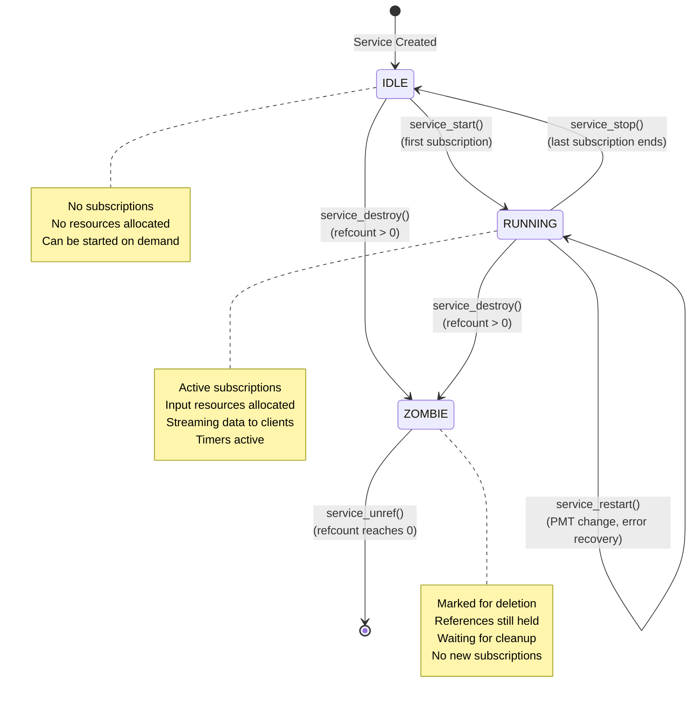

[← Back to Table of Contents](00-TOC.md)

## 6. Service Management

The Service Management subsystem is responsible for managing the lifecycle of TV and radio services (channels) within Tvheadend. A service represents a single broadcast stream - typically a TV channel or radio station - that can be subscribed to and streamed to clients. This section documents the service structure, states, lifecycle, operations, and reference counting mechanisms that are critical to understanding how Tvheadend manages broadcast services.

### 6.1 Service Structure and States

The service subsystem uses a sophisticated state machine to manage service lifecycle, with careful reference counting to prevent use-after-free errors in a multi-threaded environment.

#### 6.1.1 The service_t Structure

**Location**: `src/service.h`, `src/service.c`

The `service_t` structure is the core data structure representing a broadcast service. It inherits from `idnode_t` for configuration management and contains extensive state tracking, streaming infrastructure, and component information.

**Structure Overview**:
```c
typedef struct service {
  idnode_t s_id;                      // Configuration node (UUID, properties)
  
  TAILQ_ENTRY(service) s_all_link;    // Link in global service list
  
  enum {
    SERVICE_IDLE,                     // Not currently streaming
    SERVICE_RUNNING,                  // Actively streaming
    SERVICE_ZOMBIE,                   // Destroyed but references exist
  } s_status;
  
  int s_refcount;                     // Reference count (atomic operations)
  
  enum {
    STYPE_STD,                        // Standard service (single channel)
    STYPE_RAW,                        // Raw mux streaming (entire multiplex)
    STYPE_RAW_REMOVED                 // Raw service marked for removal
  } s_type;
  
  enum {
    S_MPEG_TS,                        // MPEG Transport Stream source
    S_MPEG_PS,                        // MPEG Program Stream source
    S_OTHER,                          // Other source type
  } s_source_type;
  
  enum {
    ST_UNSET = -1,                    // Service type not determined
    ST_NONE = 0,                      // No specific type
    ST_OTHER,                         // Other service type
    ST_SDTV,                          // Standard Definition TV
    ST_HDTV,                          // High Definition TV
    ST_FHDTV,                         // Full HD TV (1080p)
    ST_UHDTV,                         // Ultra HD TV (4K)
    ST_RADIO                          // Radio service
  } s_servicetype;
  
  // Service configuration
  int s_enabled;                      // Service enabled flag
  int s_verified;                     // In PMT and has valid streams
  int s_auto;                         // Auto-enable mode
  int s_prio;                         // Service priority
  int s_type_user;                    // User-specified type override
  int s_pts_shift;                    // PTS shift in milliseconds
  
  // Active service tracking
  LIST_ENTRY(service) s_active_link;  // Link in active services list
  LIST_HEAD(, th_subscription) s_subscriptions;  // Active subscriptions
  
  // Virtual methods (function pointers)
  int (*s_is_enabled)(struct service *t, int flags);
  int (*s_enlist)(struct service *s, struct tvh_input *ti,
                  service_instance_list_t *sil, int flags, int weight);
  int (*s_start_feed)(struct service *s, int instance, int weight, int flags);
  void (*s_refresh_feed)(struct service *t);
  void (*s_stop_feed)(struct service *t);
  htsmsg_t *(*s_config_save)(struct service *t, char *filename, size_t fsize);
  void (*s_setsourceinfo)(struct service *t, struct source_info *si);
  int (*s_grace_period)(struct service *t);
  void (*s_delete)(struct service *t, int delconf);
  void (*s_unref)(struct service *t);
  struct mpegts_apids *(*s_pid_list)(struct service *t);
  int (*s_satip_source)(struct service *t);
  void (*s_memoryinfo)(struct service *t, int64_t *size);
  int (*s_unseen)(struct service *t, const char *type, time_t before);
  
  // Channel information methods
  int64_t     (*s_channel_number) (struct service *);
  const char *(*s_channel_name)   (struct service *);
  const char *(*s_source)         (struct service *);
  const char *(*s_channel_epgid)  (struct service *);
  htsmsg_t   *(*s_channel_tags)   (struct service *);
  const char *(*s_provider_name)  (struct service *);
  const char *(*s_channel_icon)   (struct service *);
  void        (*s_mapped)         (struct service *);
  
  // Display name
  char *s_nicename;                   // User-friendly display name
  int   s_nicename_prefidx;           // Preference index for name selection
  
  // Teletext support
  commercial_advice_t s_tt_commercial_advice;
  time_t s_tt_clock;                  // Network clock from teletext
  
  // Channel mapping
  idnode_list_head_t s_channels;      // Channels this service is mapped to
  
  // Service mapper queue
  int s_sm_onqueue;                   // On service mapper queue flag
  
  // Pending save queue
  int s_ps_onqueue;                   // On pending save queue flag
  TAILQ_ENTRY(service) s_ps_link;     // Link in pending save queue
  
  // Receive timer
  mtimer_t s_receive_timer;           // Timer for checking data reception
  int     s_timeout;                  // Timeout value in seconds
  int     s_grace_delay;              // Grace period delay
  int64_t s_start_time;               // Stream start time
  
  /*********************************************************
   * Streaming section - protected by s_stream_mutex
   * 
   * CRITICAL: Code holding s_stream_mutex must NEVER
   * acquire global_lock while already holding s_stream_mutex.
   * This would cause lock inversion and deadlocks.
   *********************************************************/
  
  tvh_mutex_t s_stream_mutex;         // Mutex for streaming operations
  
  int s_streaming_status;             // Streaming status flags (see below)
  int s_streaming_live;               // Live streaming flag
  int s_running;                      // Service running flag
  int s_pending_restart;              // Restart pending flag
  
  // Descrambling support
  uint16_t s_dvb_forcecaid;           // Forced CA ID
  struct th_descrambler_list s_descramblers;  // List of descramblers
  uint8_t s_scrambled_seen;           // Scrambled packets seen
  uint8_t s_scrambled_pass;           // Pass scrambled packets
  th_descrambler_runtime_t *s_descramble;  // Active descrambler runtime
  void *s_descrambler;                // Last active descrambler
  struct descramble_info *s_descramble_info;  // Descrambler info
  
  // Elementary streams
  elementary_set_t s_components;      // Set of all components (audio/video/subtitle)
  
  // Streaming output
  streaming_pad_t s_streaming_pad;    // Output pad for streaming data
  
  // Logging
  tvhlog_limit_t s_tei_log;           // Transport error indicator log limiter
  
  // Local channel numbers
  LIST_HEAD(,service_lcn) s_lcns;     // LCN per bouquet
  
  // HbbTV support
  htsmsg_t *s_hbbtv;                  // HbbTV application information
  
} service_t;
```

**Key Structure Characteristics**:

1. **Configuration Management**: Inherits from `idnode_t`, enabling automatic persistence, API generation, and property management

2. **State Machine**: Uses `s_status` enum to track service lifecycle (IDLE → RUNNING → ZOMBIE)

3. **Reference Counting**: Uses atomic `s_refcount` to safely manage service lifetime across threads

4. **Type System**: Multiple type enums classify services by streaming type, source type, and content type

5. **Virtual Methods**: Extensive use of function pointers enables polymorphic behavior for different service implementations (MPEG-TS, IPTV, etc.)

6. **Two-Level Locking**: 
   - `global_lock` protects service structure and state
   - `s_stream_mutex` protects streaming-specific fields
   - **Critical rule**: Never acquire `global_lock` while holding `s_stream_mutex`

7. **Streaming Infrastructure**: Contains `streaming_pad_t` for delivering data to multiple subscribers

#### 6.1.2 Service States

Services transition through three primary states during their lifecycle:

**SERVICE_IDLE** - Service Not Streaming
- **Description**: Service exists in configuration but is not actively streaming
- **Characteristics**:
  - No subscriptions active
  - No input resources allocated
  - No streaming threads running
  - Configuration can be modified
  - Service can be started on demand
- **Typical Scenarios**:
  - Service just created from configuration
  - Service stopped after last subscription ended
  - Service disabled by user
  - Service waiting for input availability
- **Resource Usage**: Minimal (only configuration data in memory)

**SERVICE_RUNNING** - Service Actively Streaming
- **Description**: Service is actively receiving data from input and streaming to subscribers
- **Characteristics**:
  - One or more active subscriptions
  - Input resources allocated (tuner, network connection)
  - Streaming threads active
  - Data flowing through streaming pad
  - Statistics being collected
  - Timers active for monitoring
- **Typical Scenarios**:
  - Client watching live TV
  - DVR recording in progress
  - EPG grabber collecting data
  - Service mapper analyzing stream
- **Resource Usage**: High (input resources, buffers, threads, CPU for processing)
- **Transitions**:
  - To IDLE: When last subscription ends
  - To ZOMBIE: When service deleted while subscriptions exist

**SERVICE_ZOMBIE** - Service Destroyed But Referenced
- **Description**: Service has been destroyed but references still exist, preventing immediate deallocation
- **Characteristics**:
  - Service marked for deletion
  - `s_refcount > 0` (references still held)
  - No new subscriptions allowed
  - Existing subscriptions being terminated
  - Configuration removed
  - Waiting for all references to be released
- **Purpose**: Prevents use-after-free errors in multi-threaded code
- **Typical Scenarios**:
  - Service deleted while subscription callback is executing
  - Service removed from mux while streaming
  - Configuration reload removes service
  - Input source disconnected
- **Resource Usage**: Moderate (structure remains in memory until refcount reaches zero)
- **Final Transition**: When `s_refcount` reaches 0, service is actually freed

**Critical Rule for ZOMBIE State**:
```c
// Code holding a service pointer without global_lock MUST check status
service_t *s = /* obtained earlier */;

tvh_mutex_lock(&global_lock);
if (s->s_status == SERVICE_ZOMBIE) {
  // Service was destroyed, drop reference and abort
  service_unref(s);
  tvh_mutex_unlock(&global_lock);
  return;
}
// Safe to use service here
// ... do work ...
tvh_mutex_unlock(&global_lock);
```

#### 6.1.3 Service Types

Services are classified by three different type systems:

**Service Type (s_type)** - Streaming Mode

1. **STYPE_STD** - Standard Service
   - **Description**: Normal single-channel service
   - **Behavior**: Streams only the PIDs associated with this service
   - **Use Case**: Regular TV/radio channel streaming
   - **PID Filtering**: Filters specific PIDs (video, audio, subtitles, teletext)
   - **Bandwidth**: Minimal (typically 2-10 Mbps for TV, <500 Kbps for radio)

2. **STYPE_RAW** - Raw Mux Service
   - **Description**: Streams entire multiplex (all services on the mux)
   - **Behavior**: No PID filtering, passes all packets
   - **Use Case**: 
     - Mux analysis and debugging
     - Feeding to external demuxer
     - Recording entire transponder
   - **PID Filtering**: None (all PIDs passed through)
   - **Bandwidth**: High (full transponder, typically 20-50 Mbps)

3. **STYPE_RAW_REMOVED** - Removed Raw Service
   - **Description**: Raw service marked for removal
   - **Behavior**: Being phased out, no new subscriptions
   - **Use Case**: Cleanup during configuration changes
   - **Transition**: Will be deleted when safe

**Source Type (s_source_type)** - Input Format

1. **S_MPEG_TS** - MPEG Transport Stream
   - **Description**: Standard DVB/ATSC transport stream format
   - **Characteristics**:
     - 188-byte packets with sync byte 0x47
     - Multiple programs multiplexed
     - PSI/SI tables for metadata
   - **Sources**: DVB adapters, IPTV, SAT>IP, HDHomeRun
   - **Optimization**: Can bypass parsing for MPEG-TS output clients

2. **S_MPEG_PS** - MPEG Program Stream
   - **Description**: MPEG-2 Program Stream format
   - **Characteristics**:
     - Variable-length packets
     - Single program
     - Less overhead than TS
   - **Sources**: Rare in modern systems (legacy analog capture)
   - **Processing**: Requires conversion to TS for most outputs

3. **S_OTHER** - Other Source Type
   - **Description**: Non-MPEG source
   - **Characteristics**: Custom or proprietary format
   - **Sources**: Specialized inputs
   - **Processing**: Requires full parsing and remuxing

**Service Type (s_servicetype)** - Content Classification

1. **ST_UNSET** (-1) - Type Not Determined
   - Service type not yet identified
   - Waiting for PMT or stream analysis

2. **ST_NONE** (0) - No Specific Type
   - Generic service without classification

3. **ST_OTHER** - Other Service Type
   - Service doesn't fit standard categories
   - May be data service, interactive service, etc.

4. **ST_SDTV** - Standard Definition TV
   - Video resolution ≤ 576p (PAL) or 480p (NTSC)
   - Typical bitrate: 2-4 Mbps
   - Codec: Usually MPEG-2 or H.264

5. **ST_HDTV** - High Definition TV
   - Video resolution 720p or 1080i
   - Typical bitrate: 4-8 Mbps
   - Codec: Usually H.264

6. **ST_FHDTV** - Full HD TV
   - Video resolution 1080p
   - Typical bitrate: 8-15 Mbps
   - Codec: H.264 or HEVC

7. **ST_UHDTV** - Ultra HD TV
   - Video resolution 2160p (4K) or higher
   - Typical bitrate: 15-50 Mbps
   - Codec: HEVC (H.265) or AV1

8. **ST_RADIO** - Radio Service
   - Audio-only service
   - Typical bitrate: 64-320 Kbps
   - Codec: MPEG Audio, AAC, or AC3

**Type Detection**:
- **Source type**: Determined by input source
- **Service type**: Set by configuration or detected from DVB service type descriptor
- **Content type**: Detected from PMT (video resolution, codec) or DVB service type

#### 6.1.4 Streaming Status Flags

The `s_streaming_status` field uses bit flags to track streaming progress and errors:

**Progress Flags** (indicate successful stages):

```c
#define TSS_INPUT_HARDWARE   0x00000001  // Hardware input active
#define TSS_INPUT_SERVICE    0x00000002  // Service input active
#define TSS_MUX_PACKETS      0x00000004  // Receiving mux packets
#define TSS_PACKETS          0x00000008  // Receiving service packets
#define TSS_NO_ACCESS        0x00000010  // No access to service (not an error)
#define TSS_CA_CHECK         0x00000020  // CA system check in progress
```

**Error Flags** (indicate problems):

```c
#define TSS_GRACEPERIOD      0x00010000  // In grace period (testing service)
#define TSS_NO_DESCRAMBLER   0x00020000  // No descrambler available
#define TSS_TIMEOUT          0x00040000  // Timeout waiting for data
#define TSS_TUNING           0x00080000  // Tuning failure

#define TSS_ERRORS           0xffff0000  // Mask for all error flags
```

**Flag Progression** (normal startup):
1. `TSS_INPUT_HARDWARE` - Input hardware initialized
2. `TSS_INPUT_SERVICE` - Service connected to input
3. `TSS_MUX_PACKETS` - Receiving packets from mux
4. `TSS_PACKETS` - Receiving packets for this service
5. (Optional) `TSS_CA_CHECK` - Checking CA system if encrypted
6. (Optional) `TSS_NO_DESCRAMBLER` - If encrypted but no descrambler

**Error Detection**:
```c
// Check if any error flags are set
if (service_tss_is_error(s->s_streaming_status)) {
  // Handle error condition
  int errcode = tss2errcode(s->s_streaming_status);
  // errcode maps to standard error codes (EACCES, ETIMEDOUT, etc.)
}
```

**Flag Management**:
```c
// Set flags (adds to existing flags)
service_set_streaming_status_flags(s, TSS_INPUT_HARDWARE | TSS_INPUT_SERVICE);

// Reset flags (removes from existing flags)
service_reset_streaming_status_flags(s, TSS_GRACEPERIOD);

// Send status update to subscribers
service_send_streaming_status(s);
```

**Status Text Conversion**:
```c
const char *status_text = service_tss2text(s->s_streaming_status);
// Returns human-readable description like:
// "Waiting for input hardware"
// "No descrambler available"
// "Timeout waiting for packets"
```

These flags enable:
- **Progress tracking**: Monitor service startup stages
- **Error diagnosis**: Identify specific failure points
- **Client notification**: Inform clients of streaming status
- **Automatic recovery**: Trigger retry logic based on error type

### 6.2 Service Lifecycle

The service lifecycle describes how services transition between states in response to subscriptions, configuration changes, and errors. Understanding this lifecycle is essential for debugging streaming issues and implementing new features.

#### 6.2.1 Service Lifecycle State Diagram



#### 6.2.2 State Transition Triggers

**IDLE → RUNNING** (Service Start)

**Trigger**: First subscription requests the service

**Process**:
1. **Subscription Request**: Client or DVR requests service via `subscription_create_from_channel()` or `subscription_create_from_service()`
2. **Service Instance Selection**: System finds suitable input source via `service_find_instance()`
3. **Service Start**: `service_start()` called with instance, weight, and flags
4. **Input Allocation**: Input source allocates resources (tuner, network connection)
5. **Feed Start**: `s_start_feed()` virtual method called to begin streaming
6. **State Change**: `s_status` changes from `SERVICE_IDLE` to `SERVICE_RUNNING`
7. **Timer Arm**: `s_receive_timer` armed to monitor data reception
8. **Streaming Pad Active**: `s_streaming_pad` begins delivering packets

**Conditions**:
- Service must be enabled (`s_enabled == 1`)
- Input source must be available
- No conflicting subscriptions (priority/weight resolution)
- Sufficient resources available

**RUNNING → IDLE** (Service Stop)

**Trigger**: Last subscription ends

**Process**:
1. **Subscription End**: Last subscription removed via `service_remove_subscriber()`
2. **Service Stop**: `service_stop()` called
3. **Feed Stop**: `s_stop_feed()` virtual method called
4. **Input Release**: Input source releases resources
5. **Timer Disarm**: `s_receive_timer` disarmed
6. **State Change**: `s_status` changes from `SERVICE_RUNNING` to `SERVICE_IDLE`
7. **Cleanup**: Streaming buffers flushed, statistics saved

**Conditions**:
- Subscription count reaches zero
- No pending restart
- No forced keep-alive

**RUNNING → RUNNING** (Service Restart)

**Trigger**: PMT change, error recovery, or configuration update

**Process**:
1. **Restart Request**: `service_restart()` called
2. **Pending Flag**: `s_pending_restart` set to 1
3. **Stop Current**: Current streaming stopped
4. **Clear State**: Elementary streams cleared
5. **Restart Feed**: `s_refresh_feed()` called to restart input
6. **Reparse PMT**: PMT re-parsed to detect changes
7. **Rebuild Streams**: Elementary streams rebuilt
8. **Resume Streaming**: Streaming resumes with new configuration

**Conditions**:
- Service still has active subscriptions
- PMT version changed
- Error recovery triggered
- User-initiated restart

**IDLE/RUNNING → ZOMBIE** (Service Destroy with References)

**Trigger**: Service deleted while references exist

**Process**:
1. **Destroy Request**: `service_destroy()` called
2. **Reference Check**: `s_refcount` checked
3. **If refcount > 0**:
   - State changed to `SERVICE_ZOMBIE`
   - Service removed from active lists
   - Configuration deleted
   - Subscriptions terminated
   - Service structure remains in memory
4. **If refcount == 0**:
   - Service immediately freed (no ZOMBIE state)

**Conditions**:
- Service deleted from configuration
- Mux removed or rescanned
- Input source disconnected
- Manual deletion by user

**ZOMBIE → [Freed]** (Final Cleanup)

**Trigger**: Last reference released

**Process**:
1. **Reference Release**: `service_unref()` called, `s_refcount` reaches 0
2. **Final Cleanup**: 
   - Streaming pad destroyed
   - Elementary streams freed
   - Descramblers released
   - Timers destroyed
   - Mutexes destroyed
3. **Memory Free**: Service structure freed via `s_unref()` virtual method

**Conditions**:
- All references released
- All callbacks completed
- All subscriptions ended

#### 6.2.3 Lifecycle Examples

**Example 1: Normal Viewing Session**

```
1. User selects channel in client
   → Subscription created
   → service_start() called
   → IDLE → RUNNING

2. User watches TV for 30 minutes
   → Service remains RUNNING
   → Data flows continuously

3. User stops playback
   → Subscription destroyed
   → service_stop() called
   → RUNNING → IDLE
```

**Example 2: Channel Scan During Viewing**

```
1. Service RUNNING with active subscription
2. Mux rescanned, PMT changes detected
   → service_restart() called
   → RUNNING → RUNNING (restart)
   → Elementary streams rebuilt
   → Streaming continues with new configuration
```

**Example 3: Service Deletion While Streaming**

```
1. Service RUNNING with active subscription
2. User deletes service from configuration
   → service_destroy() called
   → s_refcount = 1 (subscription holds reference)
   → RUNNING → ZOMBIE
   → Subscription terminated
   → service_unref() called
   → s_refcount = 0
   → ZOMBIE → [Freed]
```

**Example 4: Multiple Subscriptions**

```
1. First subscription
   → service_start() called
   → IDLE → RUNNING

2. Second subscription (same service)
   → Service already RUNNING
   → Subscription added to list
   → No state change

3. First subscription ends
   → Service still RUNNING (second subscription active)
   → No state change

4. Second subscription ends
   → service_stop() called
   → RUNNING → IDLE
```

#### 6.2.4 Grace Period and Testing

When a service starts, it enters a **grace period** during which the system tests whether the service is actually working:

**Grace Period Process**:

1. **Service Start**: Service transitions to RUNNING
2. **Grace Flag Set**: `TSS_GRACEPERIOD` flag set in `s_streaming_status`
3. **Timer Armed**: `s_receive_timer` armed for grace period duration (typically 5-10 seconds)
4. **Packet Monitoring**: System monitors for received packets
5. **Timer Expires**:
   - **If packets received**: Grace period cleared, service considered good
   - **If no packets**: Service marked as bad, subscription may failover to alternate source

**Grace Period Duration**:
- Default: Configurable per input type
- DVB: Typically 10 seconds (allows time for tuning and lock)
- IPTV: Typically 5 seconds (network connection faster)
- Can be overridden per service via `s_grace_period()` virtual method

**Purpose**:
- Detect non-functional services early
- Enable automatic failover to working sources
- Prevent clients from waiting indefinitely for broken services
- Improve user experience with multi-source configurations


### 6.3 Service Operations

The service subsystem provides several key operations for managing service lifecycle and state. These operations are implemented as both direct functions and virtual methods to support polymorphic behavior across different service types.

#### 6.3.1 service_start() - Start Service Streaming

**Function Signature**:
```c
int service_start(service_t *t, int instance, int weight, int flags,
                  int timeout, int postpone);
```

**Purpose**: Initiates streaming from a service, allocating input resources and beginning data flow.

**Parameters**:
- `t`: Service to start
- `instance`: Input instance identifier (discriminates between multiple inputs)
- `weight`: Subscription weight (higher values have priority for resource allocation)
- `flags`: Control flags (e.g., `SUBSCRIPTION_STREAMING`, `SUBSCRIPTION_PACKET`)
- `timeout`: Timeout in seconds for service start (0 = use default)
- `postpone`: If non-zero, delay start until input becomes available

**Return Value**:
- `0`: Success, service started
- `< 0`: Error code (errno values)
  - `-EBUSY`: Input busy with higher priority subscription
  - `-ENODEV`: No suitable input available
  - `-EINVAL`: Invalid parameters
  - `-EACCES`: Access denied (CA system, permissions)

**Operation Flow**:

1. **Precondition Checks**:
   ```c
   // Must hold global_lock
   // Service must be enabled
   if (!t->s_enabled) return -EINVAL;
   
   // Service must not be ZOMBIE
   if (t->s_status == SERVICE_ZOMBIE) return -EINVAL;
   ```

2. **State Transition**:
   ```c
   // If already RUNNING, just update weight
   if (t->s_status == SERVICE_RUNNING) {
     // Update subscription weight if higher
     return 0;
   }
   
   // Transition IDLE → RUNNING
   t->s_status = SERVICE_RUNNING;
   ```

3. **Virtual Method Call**:
   ```c
   // Call service-specific start implementation
   int ret = t->s_start_feed(t, instance, weight, flags);
   if (ret < 0) {
     t->s_status = SERVICE_IDLE;
     return ret;
   }
   ```

4. **Timer Setup**:
   ```c
   // Arm receive timer for grace period
   t->s_start_time = getmonoclock();
   mtimer_arm_rel(&t->s_receive_timer, service_receive_timeout, t,
                  sec2mono(timeout ?: t->s_timeout));
   ```

5. **Status Initialization**:
   ```c
   // Clear streaming status flags
   t->s_streaming_status = 0;
   t->s_streaming_live = TSS_LIVE;
   
   // Set initial progress flags
   service_set_streaming_status_flags(t, TSS_INPUT_HARDWARE);
   ```

6. **Subscription Notification**:
   ```c
   // Notify subscriptions that service is starting
   service_send_streaming_status(t);
   ```

**Usage Example**:
```c
service_t *s = /* service pointer */;
int instance = 0;  // First input instance
int weight = 100;  // Normal priority
int flags = SUBSCRIPTION_STREAMING;
int timeout = 10;  // 10 second timeout
int postpone = 0;  // Don't postpone

tvh_mutex_lock(&global_lock);
int ret = service_start(s, instance, weight, flags, timeout, postpone);
if (ret < 0) {
  tvhlog(LOG_ERR, "service", "Failed to start service: %s", strerror(-ret));
}
tvh_mutex_unlock(&global_lock);
```

**Thread Safety**: Must be called with `global_lock` held.

**Side Effects**:
- Allocates input resources (tuner, network connection)
- Creates input processing threads (if not already running)
- Arms timers for monitoring
- Updates service state
- Notifies subscribers

#### 6.3.2 service_stop() - Stop Service Streaming

**Function Signature**:
```c
void service_stop(service_t *t);
```

**Purpose**: Stops streaming from a service, releasing input resources and cleaning up state.

**Parameters**:
- `t`: Service to stop

**Return Value**: None (void)

**Operation Flow**:

1. **Precondition Checks**:
   ```c
   // Must hold global_lock
   // Service must be RUNNING
   if (t->s_status != SERVICE_RUNNING) return;
   ```

2. **Timer Disarm**:
   ```c
   // Disarm receive timer
   mtimer_disarm(&t->s_receive_timer);
   ```

3. **Virtual Method Call**:
   ```c
   // Call service-specific stop implementation
   if (t->s_stop_feed)
     t->s_stop_feed(t);
   ```

4. **State Transition**:
   ```c
   // Transition RUNNING → IDLE
   t->s_status = SERVICE_IDLE;
   t->s_running = 0;
   ```

5. **Status Reset**:
   ```c
   // Clear streaming status
   t->s_streaming_status = 0;
   t->s_streaming_live = 0;
   ```

6. **Cleanup**:
   ```c
   // Release descrambler resources
   if (t->s_descramble) {
     descrambler_runtime_destroy(t->s_descramble);
     t->s_descramble = NULL;
   }
   
   // Clear elementary streams (with s_stream_mutex held)
   tvh_mutex_lock(&t->s_stream_mutex);
   elementary_set_clean(&t->s_components);
   tvh_mutex_unlock(&t->s_stream_mutex);
   ```

7. **Subscription Notification**:
   ```c
   // Send STOP message to all subscriptions
   streaming_message_t *sm = streaming_msg_create_code(SMT_STOP, SM_CODE_OK);
   streaming_pad_deliver(&t->s_streaming_pad, sm);
   ```

**Usage Example**:
```c
service_t *s = /* service pointer */;

tvh_mutex_lock(&global_lock);
service_stop(s);
tvh_mutex_unlock(&global_lock);
```

**Thread Safety**: Must be called with `global_lock` held.

**Side Effects**:
- Releases input resources
- Stops input processing threads (if no other services using same input)
- Disarms timers
- Clears streaming state
- Notifies subscribers with STOP message
- Releases descrambler resources

#### 6.3.3 service_restart() - Restart Service

**Function Signature**:
```c
void service_restart(service_t *t);
```

**Purpose**: Restarts a running service, typically in response to PMT changes or error recovery.

**Parameters**:
- `t`: Service to restart

**Return Value**: None (void)

**Operation Flow**:

1. **Precondition Checks**:
   ```c
   // Must hold global_lock
   // Service must be RUNNING
   if (t->s_status != SERVICE_RUNNING) return;
   
   // Don't restart if already pending
   if (t->s_pending_restart) return;
   ```

2. **Set Pending Flag**:
   ```c
   // Mark restart as pending
   t->s_pending_restart = 1;
   ```

3. **Stop Current Streaming**:
   ```c
   // Stop current feed (but don't change state to IDLE)
   if (t->s_stop_feed)
     t->s_stop_feed(t);
   ```

4. **Clear Elementary Streams**:
   ```c
   // Clear existing streams (with s_stream_mutex held)
   tvh_mutex_lock(&t->s_stream_mutex);
   elementary_set_clean(&t->s_components);
   tvh_mutex_unlock(&t->s_stream_mutex);
   ```

5. **Refresh Feed**:
   ```c
   // Call refresh to restart input
   if (t->s_refresh_feed)
     t->s_refresh_feed(t);
   ```

6. **Clear Pending Flag**:
   ```c
   // Clear pending flag
   t->s_pending_restart = 0;
   ```

7. **Rebuild Streams**:
   ```c
   // PMT will be re-parsed
   // Elementary streams will be rebuilt
   // Streaming will resume automatically
   ```

**Usage Example**:
```c
service_t *s = /* service pointer */;

tvh_mutex_lock(&global_lock);
// PMT version changed, restart service
service_restart(s);
tvh_mutex_unlock(&global_lock);
```

**Thread Safety**: Must be called with `global_lock` held.

**When to Use**:
- PMT version changed (new audio/video streams)
- CA system changed (different encryption)
- Error recovery (timeout, signal loss)
- Configuration update (PID changes)
- User-initiated refresh

**Side Effects**:
- Briefly interrupts streaming
- Clears elementary stream cache
- Re-parses PMT
- May cause brief glitch in playback
- Resets descrambler state

#### 6.3.4 service_refresh_feed() - Refresh Input Feed

**Function Signature**:
```c
void service_refresh_feed(service_t *t);
```

**Purpose**: Refreshes the input feed without fully stopping the service. This is a lighter-weight operation than `service_restart()`.

**Parameters**:
- `t`: Service to refresh

**Return Value**: None (void)

**Operation Flow**:

1. **Virtual Method Call**:
   ```c
   // Call service-specific refresh implementation
   if (t->s_refresh_feed)
     t->s_refresh_feed(t);
   ```

2. **Implementation Varies by Service Type**:
   - **MPEG-TS services**: May re-tune input or reset PID filters
   - **IPTV services**: May reconnect to stream URL
   - **SAT>IP services**: May send RTSP PLAY command again

**Usage Example**:
```c
service_t *s = /* service pointer */;

tvh_mutex_lock(&global_lock);
service_refresh_feed(s);
tvh_mutex_unlock(&global_lock);
```

**Thread Safety**: Must be called with `global_lock` held.

**Difference from service_restart()**:
- `service_refresh_feed()`: Lightweight, doesn't clear streams, minimal interruption
- `service_restart()`: Full restart, clears streams, re-parses PMT, more disruptive

#### 6.3.5 service_set_streaming_status_flags() - Update Status Flags

**Function Signature**:
```c
void service_set_streaming_status_flags(service_t *t, int flag);
void service_reset_streaming_status_flags(service_t *t, int flag);
```

**Purpose**: Updates streaming status flags and notifies subscribers of status changes.

**Parameters**:
- `t`: Service to update
- `flag`: Flag(s) to set or reset

**Return Value**: None (void)

**Operation**:

**Setting Flags**:
```c
// Add flags to current status
service_set_streaming_status_flags(t, TSS_INPUT_HARDWARE | TSS_INPUT_SERVICE);

// Implementation:
void service_set_streaming_status_flags_(service_t *t, int flag) {
  int old = t->s_streaming_status;
  t->s_streaming_status = flag;
  
  // Only notify if flags actually changed
  if (old != flag)
    service_send_streaming_status(t);
}
```

**Resetting Flags**:
```c
// Remove flags from current status
service_reset_streaming_status_flags(t, TSS_GRACEPERIOD);

// Implementation uses inline function:
static inline void
service_reset_streaming_status_flags(service_t *t, int flag)
{
  int n = t->s_streaming_status;
  if ((n & flag) != 0)
    service_set_streaming_status_flags_(t, n & ~flag);
}
```

**Usage Example**:
```c
service_t *s = /* service pointer */;

tvh_mutex_lock(&global_lock);

// Service started, set initial flags
service_set_streaming_status_flags(s, TSS_INPUT_HARDWARE);

// Input connected
service_set_streaming_status_flags(s, TSS_INPUT_SERVICE);

// Receiving packets
service_set_streaming_status_flags(s, TSS_MUX_PACKETS | TSS_PACKETS);

// Grace period expired successfully
service_reset_streaming_status_flags(s, TSS_GRACEPERIOD);

// Error occurred
service_set_streaming_status_flags(s, TSS_TIMEOUT);

tvh_mutex_unlock(&global_lock);
```

**Thread Safety**: Must be called with `global_lock` held.

**Notification**: Automatically sends status update to all subscriptions via `service_send_streaming_status()`.

**Client Impact**: Clients receive `SMT_SERVICE_STATUS` messages and can display appropriate status to users (e.g., "Tuning...", "No signal", "Descrambling...").

#### 6.3.6 Virtual Method Overview

Services use virtual methods (function pointers) to enable polymorphic behavior. Different service types (MPEG-TS, IPTV, etc.) implement these methods differently:

**Core Virtual Methods**:

| Method | Purpose | When Called |
|--------|---------|-------------|
| `s_is_enabled()` | Check if service can be started | Before starting service |
| `s_enlist()` | Enumerate available input instances | During subscription setup |
| `s_start_feed()` | Start input feed | When first subscription starts |
| `s_refresh_feed()` | Refresh input without full restart | On minor errors or updates |
| `s_stop_feed()` | Stop input feed | When last subscription ends |
| `s_config_save()` | Save service configuration | On configuration changes |
| `s_setsourceinfo()` | Update source information | When input source changes |
| `s_grace_period()` | Get grace period duration | At service start |
| `s_delete()` | Delete service | When service removed |
| `s_unref()` | Final cleanup | When refcount reaches 0 |

**Example Implementation** (MPEG-TS service):
```c
static int
mpegts_service_start_feed(service_t *t, int instance, int weight, int flags)
{
  mpegts_service_t *s = (mpegts_service_t*)t;
  mpegts_mux_t *mm = s->s_dvb_mux;
  mpegts_input_t *mi;
  
  // Find input instance
  mi = mpegts_input_find_instance(mm, instance);
  if (!mi) return -ENODEV;
  
  // Start mux on input
  return mi->mi_start_mux(mi, mm, weight);
}
```

This virtual method pattern allows:
- **Polymorphism**: Different service types with different behaviors
- **Extensibility**: New service types can be added without modifying core code
- **Flexibility**: Service-specific optimizations and features
- **Maintainability**: Clear separation of concerns


### 6.4 Service Reference Counting

Reference counting is a critical mechanism in Tvheadend's service management that prevents use-after-free errors in a multi-threaded environment. Understanding reference counting is essential for writing safe code that interacts with services.

#### 6.4.1 Why Reference Counting?

**The Problem**: In a multi-threaded system, a service pointer obtained in one thread may become invalid if another thread deletes the service. Consider this scenario:

```c
// Thread 1: Holds service pointer
service_t *s = /* obtained earlier */;

// Thread 2: Deletes service
service_destroy(s, 1);  // Frees memory

// Thread 1: Tries to use service
s->s_nicename;  // CRASH! Use-after-free
```

**The Solution**: Reference counting ensures that a service is not freed while any code still holds a reference to it:

```c
// Thread 1: Obtains and holds reference
service_t *s = /* obtained earlier */;
service_ref(s);  // Increment refcount

// Thread 2: Tries to delete service
service_destroy(s, 1);  // Service becomes ZOMBIE, not freed

// Thread 1: Uses service safely
s->s_nicename;  // Safe! Service still in memory

// Thread 1: Releases reference
service_unref(s);  // Decrement refcount, now freed
```

#### 6.4.2 service_ref() - Increment Reference Count

**Function Signature**:
```c
void service_ref(service_t *t);
```

**Purpose**: Increments the service reference count, indicating that the caller holds a reference to the service.

**Implementation**:
```c
void service_ref(service_t *t)
{
  atomic_add(&t->s_refcount, 1);
}
```

**When to Call**:
- Before storing a service pointer for later use
- Before passing a service pointer to another thread
- Before releasing `global_lock` while still needing the service
- When creating a subscription to a service
- When adding service to a list or data structure

**Example**:
```c
service_t *s;

tvh_mutex_lock(&global_lock);
s = service_find_by_uuid(uuid);
if (s) {
  service_ref(s);  // Hold reference
}
tvh_mutex_unlock(&global_lock);

if (s) {
  // Can safely use 's' here without global_lock
  // But must check s_status before accessing fields
  
  tvh_mutex_lock(&global_lock);
  if (s->s_status != SERVICE_ZOMBIE) {
    // Safe to access service fields
    const char *name = s->s_nicename;
  }
  service_unref(s);  // Release reference
  tvh_mutex_unlock(&global_lock);
}
```

**Thread Safety**: Uses atomic operations, safe to call from any thread without locks.

**Important**: Calling `service_ref()` does NOT prevent the service from becoming ZOMBIE. It only prevents the memory from being freed.

#### 6.4.3 service_unref() - Decrement Reference Count

**Function Signature**:
```c
void service_unref(service_t *t);
```

**Purpose**: Decrements the service reference count. If the count reaches zero and the service is ZOMBIE, the service is freed.

**Implementation**:
```c
void service_unref(service_t *t)
{
  if (atomic_dec(&t->s_refcount, 1) == 1) {
    // Refcount reached zero
    if (t->s_status == SERVICE_ZOMBIE) {
      // Service was waiting to be freed
      if (t->s_unref)
        t->s_unref(t);  // Virtual method for cleanup
      else
        free(t);  // Default: just free memory
    }
  }
}
```

**When to Call**:
- After finishing with a service pointer obtained via `service_ref()`
- When removing a subscription from a service
- When removing service from a list or data structure
- Always paired with a previous `service_ref()` call

**Example**:
```c
service_t *s = /* obtained with service_ref() */;

// Use service...

tvh_mutex_lock(&global_lock);
service_unref(s);  // Release reference
tvh_mutex_unlock(&global_lock);

// Don't use 's' after this point!
```

**Thread Safety**: Uses atomic operations, safe to call from any thread. However, should typically be called with `global_lock` held to ensure proper cleanup ordering.

**Critical Rule**: Never access a service pointer after calling `service_unref()` on it. The memory may have been freed.

#### 6.4.4 The ZOMBIE State and Reference Counting

The ZOMBIE state exists specifically to handle the case where a service is deleted while references still exist.

**ZOMBIE State Behavior**:

1. **Service Deletion with References**:
   ```c
   void service_destroy(service_t *t, int delconf)
   {
     tvh_mutex_lock(&global_lock);
     
     if (t->s_refcount > 0) {
       // References exist, can't free immediately
       t->s_status = SERVICE_ZOMBIE;
       
       // Remove from active lists
       LIST_REMOVE(t, s_all_link);
       
       // Stop streaming
       if (t->s_status == SERVICE_RUNNING)
         service_stop(t);
       
       // Delete configuration
       if (delconf)
         idnode_delete(&t->s_id);
       
       // Service remains in memory until refcount reaches 0
     } else {
       // No references, can free immediately
       if (t->s_unref)
         t->s_unref(t);
       else
         free(t);
     }
     
     tvh_mutex_unlock(&global_lock);
   }
   ```

2. **Checking for ZOMBIE**:
   ```c
   service_t *s = /* obtained earlier with service_ref() */;
   
   tvh_mutex_lock(&global_lock);
   
   if (s->s_status == SERVICE_ZOMBIE) {
     // Service was deleted, abort operation
     service_unref(s);
     tvh_mutex_unlock(&global_lock);
     return;
   }
   
   // Safe to use service here
   // ...
   
   service_unref(s);
   tvh_mutex_unlock(&global_lock);
   ```

**Why ZOMBIE is Necessary**:
- Prevents use-after-free errors
- Allows graceful cleanup of references
- Enables safe multi-threaded access
- Provides clear indication that service is being deleted

#### 6.4.5 Common Reference Counting Patterns

**Pattern 1: Temporary Reference**

```c
// Obtain service, use it briefly, release it
service_t *s;

tvh_mutex_lock(&global_lock);
s = service_find_by_uuid(uuid);
if (s && s->s_status != SERVICE_ZOMBIE) {
  // Use service directly (global_lock held)
  const char *name = s->s_nicename;
  // No need for service_ref/unref since we hold global_lock
}
tvh_mutex_unlock(&global_lock);
```

**Pattern 2: Long-Term Reference**

```c
// Store service pointer for later use
typedef struct {
  service_t *my_service;
} my_context_t;

void my_init(my_context_t *ctx, const char *uuid)
{
  tvh_mutex_lock(&global_lock);
  ctx->my_service = service_find_by_uuid(uuid);
  if (ctx->my_service)
    service_ref(ctx->my_service);  // Hold reference
  tvh_mutex_unlock(&global_lock);
}

void my_cleanup(my_context_t *ctx)
{
  tvh_mutex_lock(&global_lock);
  if (ctx->my_service) {
    service_unref(ctx->my_service);  // Release reference
    ctx->my_service = NULL;
  }
  tvh_mutex_unlock(&global_lock);
}

void my_use(my_context_t *ctx)
{
  tvh_mutex_lock(&global_lock);
  if (ctx->my_service && ctx->my_service->s_status != SERVICE_ZOMBIE) {
    // Safe to use service
    const char *name = ctx->my_service->s_nicename;
  }
  tvh_mutex_unlock(&global_lock);
}
```

**Pattern 3: Reference Across Lock Release**

```c
service_t *s;

tvh_mutex_lock(&global_lock);
s = service_find_by_uuid(uuid);
if (s) {
  service_ref(s);  // Hold reference before releasing lock
}
tvh_mutex_unlock(&global_lock);

if (s) {
  // Do work without global_lock (e.g., network I/O, file I/O)
  // ...
  
  tvh_mutex_lock(&global_lock);
  if (s->s_status != SERVICE_ZOMBIE) {
    // Safe to access service
    // ...
  }
  service_unref(s);
  tvh_mutex_unlock(&global_lock);
}
```

**Pattern 4: Subscription Reference**

```c
// Subscriptions automatically hold references
typedef struct th_subscription {
  service_t *ths_service;  // Reference held
  // ...
} th_subscription_t;

th_subscription_t *subscription_create(service_t *s)
{
  th_subscription_t *ths = calloc(1, sizeof(*ths));
  
  tvh_mutex_lock(&global_lock);
  ths->ths_service = s;
  service_ref(s);  // Hold reference
  LIST_INSERT_HEAD(&s->s_subscriptions, ths, ths_service_link);
  tvh_mutex_unlock(&global_lock);
  
  return ths;
}

void subscription_destroy(th_subscription_t *ths)
{
  tvh_mutex_lock(&global_lock);
  if (ths->ths_service) {
    LIST_REMOVE(ths, ths_service_link);
    service_unref(ths->ths_service);  // Release reference
    ths->ths_service = NULL;
  }
  tvh_mutex_unlock(&global_lock);
  
  free(ths);
}
```

#### 6.4.6 Reference Counting Rules and Best Practices

**Golden Rules**:

1. **Always pair service_ref() with service_unref()**
   - Every `service_ref()` must have exactly one matching `service_unref()`
   - Unbalanced references cause memory leaks or premature frees

2. **Check for ZOMBIE before accessing fields**
   - After acquiring `global_lock`, always check `s->s_status != SERVICE_ZOMBIE`
   - ZOMBIE services should not be used, only cleaned up

3. **Never access service after service_unref()**
   - The memory may have been freed
   - Set pointer to NULL after unref to catch bugs

4. **Hold global_lock when calling service_unref()**
   - Ensures proper cleanup ordering
   - Prevents race conditions during final free

5. **Don't hold references longer than necessary**
   - Long-held references delay cleanup
   - Can cause resource leaks if forgotten

**Common Mistakes**:

❌ **Mistake 1: Forgetting to check ZOMBIE**
```c
service_t *s = /* obtained with service_ref() */;

tvh_mutex_lock(&global_lock);
// BUG: Not checking for ZOMBIE
const char *name = s->s_nicename;  // May crash if ZOMBIE
service_unref(s);
tvh_mutex_unlock(&global_lock);
```

✅ **Correct**:
```c
service_t *s = /* obtained with service_ref() */;

tvh_mutex_lock(&global_lock);
if (s->s_status != SERVICE_ZOMBIE) {
  const char *name = s->s_nicename;  // Safe
}
service_unref(s);
tvh_mutex_unlock(&global_lock);
```

❌ **Mistake 2: Using service without reference**
```c
service_t *s;

tvh_mutex_lock(&global_lock);
s = service_find_by_uuid(uuid);
tvh_mutex_unlock(&global_lock);

// BUG: Service may be freed by another thread here
const char *name = s->s_nicename;  // May crash
```

✅ **Correct**:
```c
service_t *s;

tvh_mutex_lock(&global_lock);
s = service_find_by_uuid(uuid);
if (s) {
  service_ref(s);  // Hold reference
}
tvh_mutex_unlock(&global_lock);

if (s) {
  tvh_mutex_lock(&global_lock);
  if (s->s_status != SERVICE_ZOMBIE) {
    const char *name = s->s_nicename;  // Safe
  }
  service_unref(s);
  tvh_mutex_unlock(&global_lock);
}
```

❌ **Mistake 3: Forgetting to unref**
```c
void my_function(const char *uuid)
{
  service_t *s;
  
  tvh_mutex_lock(&global_lock);
  s = service_find_by_uuid(uuid);
  if (s) {
    service_ref(s);
  }
  tvh_mutex_unlock(&global_lock);
  
  // BUG: Forgot to call service_unref(s)
  // Memory leak!
}
```

✅ **Correct**:
```c
void my_function(const char *uuid)
{
  service_t *s;
  
  tvh_mutex_lock(&global_lock);
  s = service_find_by_uuid(uuid);
  if (s) {
    service_ref(s);
  }
  tvh_mutex_unlock(&global_lock);
  
  if (s) {
    // Use service...
    
    tvh_mutex_lock(&global_lock);
    service_unref(s);  // Always release
    tvh_mutex_unlock(&global_lock);
  }
}
```

#### 6.4.7 Debugging Reference Count Issues

**Symptoms of Reference Count Bugs**:
- Crashes with "use-after-free" errors
- Memory leaks (services never freed)
- Services stuck in ZOMBIE state
- Segmentation faults in service access

**Debugging Techniques**:

1. **Enable Reference Count Logging** (debug build):
   ```c
   #ifdef DEBUG_REFCOUNT
   #define service_ref(t) do { \
     atomic_add(&(t)->s_refcount, 1); \
     tvhlog(LOG_DEBUG, "service", "REF %s refcount=%d", \
            (t)->s_nicename, (t)->s_refcount); \
   } while(0)
   
   #define service_unref(t) do { \
     tvhlog(LOG_DEBUG, "service", "UNREF %s refcount=%d", \
            (t)->s_nicename, (t)->s_refcount); \
     if (atomic_dec(&(t)->s_refcount, 1) == 1) { \
       /* ... cleanup ... */ \
     } \
   } while(0)
   #endif
   ```

2. **Check for Leaks**:
   ```bash
   # Look for services stuck in ZOMBIE state
   # In web UI: Configuration → Debugging → Services
   # Look for services with status "ZOMBIE" and non-zero refcount
   ```

3. **Use Valgrind**:
   ```bash
   valgrind --leak-check=full --track-origins=yes tvheadend
   # Look for "definitely lost" or "possibly lost" blocks
   # related to service structures
   ```

4. **Add Assertions** (debug build):
   ```c
   void my_function(service_t *s)
   {
     assert(s != NULL);
     assert(s->s_refcount > 0);
     assert(s->s_status != SERVICE_ZOMBIE);
     // ...
   }
   ```

**Prevention**:
- Always use the patterns documented above
- Code review for reference counting correctness
- Use static analysis tools (Coverity, Clang Static Analyzer)
- Write unit tests that create/destroy services repeatedly
- Test with thread sanitizer (TSan) to catch race conditions

---

This completes the Service Management documentation. The key takeaways are:

1. **Services have three states**: IDLE, RUNNING, and ZOMBIE
2. **Reference counting prevents use-after-free**: Always pair `service_ref()` with `service_unref()`
3. **Check for ZOMBIE before accessing**: Service may be deleted while you hold a reference
4. **Virtual methods enable polymorphism**: Different service types implement different behaviors
5. **Two-level locking**: `global_lock` for structure, `s_stream_mutex` for streaming (never invert!)

Understanding these concepts is essential for working with services in Tvheadend, whether implementing new features, debugging issues, or optimizing performance.

---

[← Previous](05-Input-Subsystem.md) | [Table of Contents](00-TOC.md) | [Next →](07-Streaming-Architecture.md)
