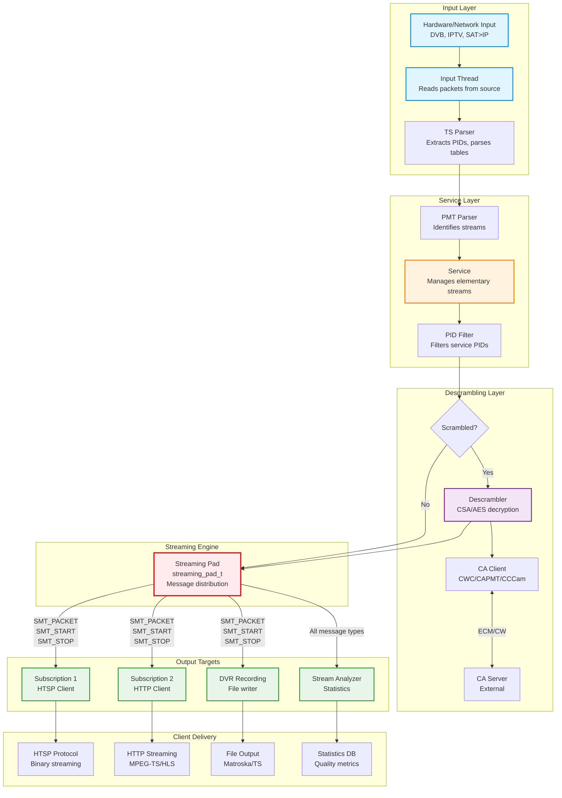

[← Back to Table of Contents](00-TOC.md)

## 7. Streaming Architecture

The Streaming Architecture is the heart of Tvheadend's data distribution system. It implements a flexible publisher-subscriber pattern that enables a single service to deliver data to multiple consumers simultaneously - whether they are client applications, DVR recordings, or stream analyzers. This section documents the streaming pad/target pattern, message types, data flow, and queue management that form the foundation of Tvheadend's streaming capabilities.

### 7.1 Streaming Pad/Target Pattern

The streaming architecture uses a publisher-subscriber pattern implemented through two complementary abstractions: **streaming pads** (publishers) and **streaming targets** (subscribers). This design provides a flexible, decoupled mechanism for distributing streaming data from sources to multiple consumers.

#### 7.1.1 Design Philosophy

The pad/target pattern solves several key challenges in streaming server architecture:

**One-to-Many Distribution**: A single service can stream to multiple clients simultaneously without the source needing to know about individual consumers. The streaming pad maintains a list of connected targets and delivers messages to all of them.

**Decoupling**: Sources (pads) don't need to know about consumer implementation details. Targets can be HTSP clients, HTTP clients, DVR recordings, or stream analyzers - the pad treats them all uniformly.

**Message Filtering**: Targets can specify which message types they're interested in, reducing unnecessary processing and memory usage. For example, a DVR recording might only want packets and start/stop messages, while a stream analyzer might want all message types.

**Dynamic Connections**: Targets can connect and disconnect from pads at runtime without disrupting other consumers or requiring the source to restart.

**Thread Safety**: The pattern provides clear synchronization boundaries, with the pad handling message delivery and targets processing messages in their own context.

#### 7.1.2 streaming_pad_t Structure

**Location**: `src/streaming.h`, `src/streaming.c`

The `streaming_pad_t` structure represents a data source - a publisher that generates streaming messages and delivers them to connected targets.

**Structure Definition**:
```c
struct streaming_pad {
  struct streaming_target_list sp_targets;  // List of connected targets
  int sp_ntargets;                          // Number of connected targets
  int sp_reject_filter;                     // Combined reject filter of all targets
};
```

**Key Fields**:

1. **`sp_targets`** - List of Connected Targets
   - Type: `LIST_HEAD` (BSD-style linked list)
   - Contains all `streaming_target_t` structures connected to this pad
   - Targets are added via `streaming_target_connect()`
   - Targets are removed via `streaming_target_disconnect()`
   - Traversed during message delivery to send to all subscribers

2. **`sp_ntargets`** - Target Count
   - Type: `int`
   - Tracks the number of connected targets
   - Incremented on connect, decremented on disconnect
   - Used for quick checks (e.g., "are there any subscribers?")
   - Optimization: if zero, message delivery can be skipped

3. **`sp_reject_filter`** - Combined Reject Filter
   - Type: `int` (bitmask)
   - Bitwise AND of all connected targets' reject filters
   - Each bit represents a message type (via `SMT_TO_MASK(type)`)
   - If bit is set, NO target wants that message type
   - Optimization: allows quick rejection of unwanted messages before delivery
   - Recalculated whenever targets connect or disconnect

**Initialization**:
```c
void streaming_pad_init(streaming_pad_t *sp)
{
  LIST_INIT(&sp->sp_targets);
  sp->sp_ntargets = 0;
  sp->sp_reject_filter = ~0;  // Initially reject all (no targets)
}
```

**Usage Pattern**:
```c
// Each service has one streaming pad
service_t *service = /* ... */;
streaming_pad_t *pad = &service->s_streaming_pad;

// Initialize during service creation
streaming_pad_init(pad);

// Deliver messages to all connected targets
streaming_message_t *msg = streaming_msg_create_pkt(packet);
streaming_pad_deliver(pad, msg);
```


#### 7.1.3 streaming_target_t Structure

**Location**: `src/streaming.h`, `src/streaming.c`

The `streaming_target_t` structure represents a data consumer - a subscriber that receives streaming messages from a pad.

**Structure Definition**:
```c
typedef struct streaming_target {
  LIST_ENTRY(streaming_target) st_link;  // Link in pad's target list
  streaming_pad_t *st_pad;               // Source pad we're linked to
  streaming_ops_t st_ops;                // Operations (callback function)
  void *st_opaque;                       // Opaque pointer passed to callback
  int st_reject_filter;                  // Message types to reject (bitmask)
} streaming_target_t;
```

**Key Fields**:

1. **`st_link`** - List Linkage
   - Type: `LIST_ENTRY` (BSD-style list node)
   - Links this target into the pad's `sp_targets` list
   - Managed by `streaming_target_connect()` and `streaming_target_disconnect()`

2. **`st_pad`** - Source Pad
   - Type: `streaming_pad_t *`
   - Points to the pad this target is connected to
   - Set during `streaming_target_connect()`
   - Cleared during `streaming_target_disconnect()`
   - Used to identify the source when processing messages

3. **`st_ops`** - Operations Structure
   - Type: `streaming_ops_t`
   - Contains function pointers for target operations
   - Primary operation: `st_cb` - callback function invoked for each message
   - Optional operation: `st_info` - returns debug information about target

4. **`st_opaque`** - Opaque Context Pointer
   - Type: `void *`
   - Arbitrary pointer passed to callback function
   - Typically points to the target's context structure (subscription, DVR entry, etc.)
   - Allows callback to access target-specific state

5. **`st_reject_filter`** - Message Type Filter
   - Type: `int` (bitmask)
   - Each bit represents a message type (via `SMT_TO_MASK(type)`)
   - If bit is set, this target does NOT want that message type
   - Example: `SMT_TO_MASK(SMT_SIGNAL_STATUS)` to reject signal status messages
   - Optimization: prevents unnecessary message cloning and delivery

**streaming_ops_t Structure**:
```c
struct streaming_ops {
  st_callback_t *st_cb;                              // Message callback
  htsmsg_t *(*st_info)(void *opaque, htsmsg_t *list); // Debug info (optional)
};

// Callback function signature
typedef void (st_callback_t)(void *opaque, streaming_message_t *sm);
```

**Initialization**:
```c
void streaming_target_init(streaming_target_t *st, streaming_ops_t *ops,
                           void *opaque, int reject_filter)
{
  st->st_ops = *ops;
  st->st_opaque = opaque;
  st->st_reject_filter = reject_filter;
}
```

**Usage Pattern**:
```c
// Define callback function
static void my_streaming_callback(void *opaque, streaming_message_t *sm)
{
  my_context_t *ctx = opaque;
  
  switch (sm->sm_type) {
    case SMT_PACKET:
      // Handle packet
      break;
    case SMT_START:
      // Handle stream start
      break;
    case SMT_STOP:
      // Handle stream stop
      break;
    // ... handle other message types
  }
  
  streaming_msg_free(sm);  // Always free the message when done
}

// Create and initialize target
streaming_target_t target;
streaming_ops_t ops = {
  .st_cb = my_streaming_callback,
  .st_info = NULL  // Optional
};

streaming_target_init(&target, &ops, my_context, 0);  // 0 = accept all messages

// Connect to pad
streaming_target_connect(&service->s_streaming_pad, &target);

// Later, disconnect
streaming_target_disconnect(&service->s_streaming_pad, &target);
```


#### 7.1.4 Connection Management

The streaming subsystem provides functions to connect and disconnect targets from pads, managing the relationship between publishers and subscribers.

**Connecting a Target to a Pad**:

```c
void streaming_target_connect(streaming_pad_t *sp, streaming_target_t *st)
{
  sp->sp_ntargets++;
  st->st_pad = sp;
  LIST_INSERT_HEAD(&sp->sp_targets, st, st_link);
  sp->sp_reject_filter &= st->st_reject_filter;
}
```

**Operation**:
1. Increments the pad's target count
2. Sets the target's pad pointer to establish bidirectional link
3. Inserts target at the head of the pad's target list
4. Updates the pad's combined reject filter (bitwise AND with new target's filter)

**Thread Safety**: Must be called with `global_lock` held (typically during subscription creation).

**Disconnecting a Target from a Pad**:

```c
void streaming_target_disconnect(streaming_pad_t *sp, streaming_target_t *st)
{
  int filter;
  streaming_target_t *st_iter;

  sp->sp_ntargets--;
  st->st_pad = NULL;
  LIST_REMOVE(st, st_link);

  // Recalculate combined reject filter
  filter = ~0;  // Start with all bits set (reject all)
  LIST_FOREACH(st_iter, &sp->sp_targets, st_link)
    filter &= st_iter->st_reject_filter;
  sp->sp_reject_filter = filter;
}
```

**Operation**:
1. Decrements the pad's target count
2. Clears the target's pad pointer
3. Removes target from the pad's target list
4. Recalculates the pad's combined reject filter by iterating all remaining targets

**Thread Safety**: Must be called with `global_lock` held (typically during subscription destruction).

**Important Notes**:
- Targets must be disconnected before being freed
- Disconnecting during message delivery is safe (delivery uses safe iteration)
- The pad does not own the target - caller is responsible for target lifecycle

#### 7.1.5 Message Delivery Mechanism

The core of the streaming architecture is the message delivery mechanism, which distributes messages from a pad to all connected targets.

**Primary Delivery Function**:

```c
void streaming_pad_deliver(streaming_pad_t *sp, streaming_message_t *sm)
{
  streaming_target_t *st, *next, *run = NULL;

  // Iterate through all targets
  for (st = LIST_FIRST(&sp->sp_targets); st; st = next) {
    next = LIST_NEXT(st, st_link);
    assert(next != st);
    
    // Skip if target rejects this message type
    if (st->st_reject_filter & SMT_TO_MASK(sm->sm_type))
      continue;
    
    // If we have a previous target, deliver a clone to it
    if (run)
      streaming_target_deliver(run, streaming_msg_clone(sm));
    
    // Remember this target for next iteration
    run = st;
  }
  
  // Deliver original message to last target (or free if no targets)
  if (run)
    streaming_target_deliver(run, sm);
  else
    streaming_msg_free(sm);
}
```

**Delivery Algorithm**:

1. **Iterate Targets**: Walk through the pad's target list
2. **Filter Check**: Skip targets that reject this message type
3. **Clone for N-1**: For all but the last target, clone the message
4. **Original for Last**: Deliver the original message to the last target
5. **Free if None**: If no targets accept the message, free it

**Optimization**: The algorithm clones messages N-1 times for N targets, delivering the original to the last target. This avoids an unnecessary clone and free.

**Safe Iteration**: The loop uses `next = LIST_NEXT(st, st_link)` before processing to allow targets to disconnect during their callback.

**Target Delivery**:

```c
static inline void
streaming_target_deliver(streaming_target_t *st, streaming_message_t *sm)
{
  st->st_ops.st_cb(st->st_opaque, sm);
}
```

**Callback Invocation**: Simply invokes the target's callback function with the opaque context and message.

**Callback Responsibilities**:
- Process the message (extract data, update state, etc.)
- **Always** free the message when done via `streaming_msg_free(sm)`
- Must not hold `global_lock` during lengthy operations
- Should handle all message types gracefully (even unexpected ones)

**Service-Specific Delivery**:

```c
void streaming_service_deliver(service_t *t, streaming_message_t *sm)
{
  if (atomic_set(&t->s_pending_restart, 0))
    service_restart_streams(t);
  sm->sm_s = t;
  streaming_pad_deliver(&t->s_streaming_pad, sm);
}
```

**Additional Operations**:
- Checks for pending restart and triggers it if needed
- Sets the message's service pointer for context
- Delegates to standard pad delivery


#### 7.1.6 Message Filtering

Message filtering is a key optimization that prevents unnecessary message cloning and processing for targets that don't need certain message types.

**Filter Mechanism**:

Each message type has a corresponding bit in the reject filter:
```c
#define SMT_TO_MASK(x) (1 << ((unsigned int)x))

// Example: Create filter that rejects signal status messages
int filter = SMT_TO_MASK(SMT_SIGNAL_STATUS);
```

**Common Filter Patterns**:

1. **Accept All Messages** (filter = 0):
   ```c
   int filter = 0;  // No bits set = accept all
   ```

2. **Reject Specific Messages**:
   ```c
   int filter = SMT_TO_MASK(SMT_SIGNAL_STATUS) | 
                SMT_TO_MASK(SMT_DESCRAMBLE_INFO);
   // Rejects signal status and descrambler info
   ```

3. **Accept Only Packets**:
   ```c
   int filter = ~SMT_TO_MASK(SMT_PACKET);
   // All bits set except packet bit
   ```

**Pad-Level Optimization**:

The pad maintains a combined reject filter (`sp_reject_filter`) that is the bitwise AND of all connected targets' filters:

```c
// If all targets reject a message type, the pad's filter will have that bit set
if (sp->sp_reject_filter & SMT_TO_MASK(SMT_SIGNAL_STATUS)) {
  // No target wants signal status messages
  // Can skip generating them entirely
}
```

**Probe Function**:

```c
static inline int
streaming_pad_probe_type(streaming_pad_t *sp, streaming_message_type_t smt)
{
  return (sp->sp_reject_filter & SMT_TO_MASK(smt)) == 0;
}
```

Returns true if at least one target accepts the message type.

**Usage Example**:

```c
// Only generate signal status if someone wants it
if (streaming_pad_probe_type(&service->s_streaming_pad, SMT_SIGNAL_STATUS)) {
  signal_status_t *status = malloc(sizeof(signal_status_t));
  // ... fill in status ...
  streaming_message_t *msg = streaming_msg_create_data(SMT_SIGNAL_STATUS, status);
  streaming_pad_deliver(&service->s_streaming_pad, msg);
}
```

**Benefits**:
- Reduces CPU usage by skipping message generation for unwanted types
- Reduces memory usage by not allocating unnecessary messages
- Reduces cloning overhead during delivery
- Improves cache efficiency by processing only relevant messages

### 7.2 Streaming Architecture Diagram

The following diagram illustrates the pad/target pattern and how multiple targets connect to a single pad:

```mermaid
graph TB
    subgraph "Service (Data Source)"
        SERVICE[Service<br/>s_streaming_pad]
        INPUT[Input Thread<br/>Receives Packets]
        DESCRAMBLER[Descrambler<br/>Decrypts Packets]
    end
    
    subgraph "Streaming Pad"
        PAD[streaming_pad_t<br/>sp_targets list<br/>sp_ntargets=4<br/>sp_reject_filter]
    end
    
    subgraph "Streaming Targets (Consumers)"
        TARGET1[streaming_target_t<br/>HTSP Client<br/>st_reject_filter=0<br/>Accepts all messages]
        TARGET2[streaming_target_t<br/>HTTP Client<br/>st_reject_filter=SIGNAL<br/>Rejects signal status]
        TARGET3[streaming_target_t<br/>DVR Recording<br/>st_reject_filter=SIGNAL|DESCR<br/>Rejects signal & descrambler info]
        TARGET4[streaming_target_t<br/>Stream Analyzer<br/>st_reject_filter=0<br/>Accepts all messages]
    end
    
    subgraph "Target Callbacks"
        CB1[htsp_streaming_input<br/>Sends to HTSP client]
        CB2[http_streaming_input<br/>Sends to HTTP client]
        CB3[dvr_rec_streaming_input<br/>Writes to file]
        CB4[analyzer_callback<br/>Collects statistics]
    end
    
    INPUT --> DESCRAMBLER
    DESCRAMBLER --> SERVICE
    SERVICE --> PAD
    
    PAD -->|streaming_pad_deliver| TARGET1
    PAD -->|streaming_pad_deliver| TARGET2
    PAD -->|streaming_pad_deliver| TARGET3
    PAD -->|streaming_pad_deliver| TARGET4
    
    TARGET1 -->|st_ops.st_cb| CB1
    TARGET2 -->|st_ops.st_cb| CB2
    TARGET3 -->|st_ops.st_cb| CB3
    TARGET4 -->|st_ops.st_cb| CB4
    
    style SERVICE fill:#e1f5ff,stroke:#0288d1,stroke-width:2px
    style PAD fill:#fff3e0,stroke:#f57c00,stroke-width:3px
    style TARGET1 fill:#e8f5e9,stroke:#388e3c,stroke-width:2px
    style TARGET2 fill:#e8f5e9,stroke:#388e3c,stroke-width:2px
    style TARGET3 fill:#e8f5e9,stroke:#388e3c,stroke-width:2px
    style TARGET4 fill:#e8f5e9,stroke:#388e3c,stroke-width:2px
    style CB1 fill:#f3e5f5,stroke:#7b1fa2,stroke-width:2px
    style CB2 fill:#f3e5f5,stroke:#7b1fa2,stroke-width:2px
    style CB3 fill:#f3e5f5,stroke:#7b1fa2,stroke-width:2px
    style CB4 fill:#f3e5f5,stroke:#7b1fa2,stroke-width:2px
```

**Key Observations**:

1. **One-to-Many**: Single service pad delivers to multiple targets simultaneously
2. **Independent Targets**: Each target has its own callback and filter settings
3. **Message Cloning**: Pad clones messages for N-1 targets, delivers original to last
4. **Filtering**: Targets with reject filters don't receive unwanted message types
5. **Decoupling**: Service doesn't know about target implementations

**Message Flow Example**:

```
1. Input thread receives packet from hardware
2. Descrambler decrypts packet (if encrypted)
3. Service creates SMT_PACKET message
4. streaming_pad_deliver() called
5. Pad iterates targets:
   - TARGET1: Accepts packets → Clone message, deliver to HTSP callback
   - TARGET2: Accepts packets → Clone message, deliver to HTTP callback
   - TARGET3: Accepts packets → Clone message, deliver to DVR callback
   - TARGET4: Accepts packets → Deliver original to analyzer callback
6. Each callback processes message independently
7. Each callback frees its message when done
```


### 7.3 Streaming Message Types

Streaming messages are the fundamental units of communication in the streaming architecture. They carry different types of information from sources to targets, enabling coordination, data delivery, and status updates.

#### 7.3.1 streaming_message_t Structure

**Location**: `src/streaming.h`, `src/streaming.c`

**Structure Definition**:
```c
struct streaming_message {
  TAILQ_ENTRY(streaming_message) sm_link;  // Link for queue storage
  streaming_message_type_t sm_type;        // Message type
  service_t *sm_s;                         // Associated service (optional)
#if ENABLE_TIMESHIFT
  int64_t sm_time;                         // Timestamp for timeshift
#endif
  union {
    void *sm_data;                         // Pointer to message data
    int sm_code;                           // Integer code (for status messages)
  };
};
```

**Key Fields**:

1. **`sm_link`** - Queue Linkage
   - Used when message is stored in a queue (e.g., `streaming_queue_t`)
   - Managed by queue functions

2. **`sm_type`** - Message Type
   - Enum value indicating the message type (see below)
   - Determines how to interpret `sm_data` or `sm_code`

3. **`sm_s`** - Service Pointer
   - Points to the service that generated the message
   - Optional, may be NULL for some message types
   - Set by `streaming_service_deliver()`

4. **`sm_time`** - Timeshift Timestamp
   - Only present if `ENABLE_TIMESHIFT` is defined
   - Used for timeshift buffer management
   - Timestamp when message was created

5. **`sm_data` / `sm_code`** - Message Payload
   - Union: either a pointer to data or an integer code
   - Interpretation depends on `sm_type`

#### 7.3.2 Message Type Enumeration

**Location**: `src/streaming.h`

```c
enum streaming_message_type {
  SMT_PACKET,              // Packet with data
  SMT_GRACE,               // Stream grace period
  SMT_START,               // Stream start
  SMT_SERVICE_STATUS,      // Service status notification
  SMT_SIGNAL_STATUS,       // Signal status notification
  SMT_DESCRAMBLE_INFO,     // Descrambler info notification
  SMT_STOP,                // Streaming stop
  SMT_NOSTART,             // Streaming unable to start
  SMT_NOSTART_WARN,        // Streaming unable to start (non-fatal)
  SMT_MPEGTS,              // Raw MPEG-TS data
  SMT_EXIT,                // Internal message to exit receiver
  SMT_SPEED,               // Set stream speed
  SMT_SKIP,                // Skip the stream
  SMT_TIMESHIFT_STATUS,    // Timeshift status
};
```

#### 7.3.3 Message Type Details

**SMT_PACKET** - Data Packet

**Purpose**: Delivers a single media packet (video, audio, subtitle, etc.)

**Data Structure**: `sm_data` points to `th_pkt_t` (packet structure)

**Packet Structure** (`th_pkt_t`):
```c
typedef struct th_pkt {
  int pkt_refcount;              // Reference count
  int64_t pkt_pts;               // Presentation timestamp
  int64_t pkt_dts;               // Decode timestamp
  int64_t pkt_pcr;               // Program clock reference
  int pkt_duration;              // Duration
  
  uint16_t pkt_componentindex;   // Component index (stream ID)
  uint8_t pkt_frametype;         // Frame type (I, P, B)
  uint8_t pkt_commercial;        // Commercial flag
  
  uint8_t pkt_err;               // Error flag
  uint8_t pkt_scrambled;         // Scrambled flag
  
  pktbuf_t *pkt_payload;         // Actual packet data
  pktbuf_t *pkt_header;          // Optional header data
  
  // ... additional fields
} th_pkt_t;
```

**Usage**:
```c
th_pkt_t *pkt = /* create packet */;
streaming_message_t *msg = streaming_msg_create_pkt(pkt);
streaming_pad_deliver(pad, msg);
```

**Memory Management**: Packet uses reference counting. Message creation increments refcount, message free decrements it.

**Frequency**: Highest frequency message type (thousands per second for video)

---

**SMT_START** - Stream Start

**Purpose**: Notifies targets that streaming is starting, provides stream metadata

**Data Structure**: `sm_data` points to `streaming_start_t`

**Stream Start Structure** (`streaming_start_t`):
```c
struct streaming_start {
  int ss_refcount;                          // Reference count
  int ss_num_components;                    // Number of components
  source_info_t ss_si;                      // Source information
  uint16_t ss_pcr_pid;                      // PCR PID
  uint16_t ss_pmt_pid;                      // PMT PID
  uint16_t ss_service_id;                   // Service ID
  streaming_start_component_t ss_components[0];  // Variable-length array
};
```

**Component Structure** (`streaming_start_component_t`):
```c
struct streaming_start_component {
  elementary_info_t;  // Inherits: type, PID, language, etc.
  uint8_t ssc_disabled;         // Component disabled flag
  uint8_t ssc_muxer_disabled;   // Muxer disabled flag
  pktbuf_t *ssc_gh;             // Global headers (codec extradata)
};
```

**Contains**:
- List of all elementary streams (video, audio, subtitles)
- Stream metadata (PIDs, codecs, languages)
- Source information (adapter, network, mux)
- Global headers for codecs (SPS/PPS for H.264, etc.)

**Usage**:
```c
streaming_start_t *ss = /* build stream start */;
streaming_message_t *msg = streaming_msg_create_data(SMT_START, ss);
streaming_pad_deliver(pad, msg);
```

**Memory Management**: Uses reference counting. Targets must not modify the structure.

**Frequency**: Once at stream start, again on PMT changes

---

**SMT_STOP** - Stream Stop

**Purpose**: Notifies targets that streaming is stopping

**Data Structure**: `sm_code` contains stop reason code

**Stop Codes** (selection):
```c
#define SM_CODE_OK                        0   // Normal stop
#define SM_CODE_SOURCE_RECONFIGURED       100 // Source changed
#define SM_CODE_BAD_SOURCE                101 // Source failed
#define SM_CODE_SOURCE_DELETED            102 // Source removed
#define SM_CODE_USER_ACCESS               105 // Access denied
#define SM_CODE_NO_FREE_ADAPTER           200 // No adapter available
#define SM_CODE_TUNING_FAILED             203 // Tuning failed
#define SM_CODE_NO_DESCRAMBLER            400 // No descrambler
```

**Usage**:
```c
streaming_message_t *msg = streaming_msg_create_code(SMT_STOP, SM_CODE_OK);
streaming_pad_deliver(pad, msg);
```

**Target Response**: Targets should clean up resources and prepare for potential restart

**Frequency**: Once at stream end

---

**SMT_GRACE** - Grace Period

**Purpose**: Notifies targets that service is in grace period (testing)

**Data Structure**: `sm_code` contains grace period duration in seconds

**Usage**:
```c
streaming_message_t *msg = streaming_msg_create_code(SMT_GRACE, 10);  // 10 seconds
streaming_pad_deliver(pad, msg);
```

**Target Response**: Targets may display "buffering" or "testing" status to user

**Frequency**: Once at stream start during grace period

---

**SMT_SERVICE_STATUS** - Service Status

**Purpose**: Notifies targets of service streaming status changes

**Data Structure**: `sm_code` contains status flags (TSS_* flags from service.h)

**Status Flags** (see Section 6.1.4):
```c
#define TSS_INPUT_HARDWARE   0x00000001  // Hardware input active
#define TSS_INPUT_SERVICE    0x00000002  // Service input active
#define TSS_MUX_PACKETS      0x00000004  // Receiving mux packets
#define TSS_PACKETS          0x00000008  // Receiving service packets
#define TSS_GRACEPERIOD      0x00010000  // In grace period
#define TSS_NO_DESCRAMBLER   0x00020000  // No descrambler available
#define TSS_TIMEOUT          0x00040000  // Timeout waiting for data
```

**Usage**:
```c
int status = TSS_INPUT_HARDWARE | TSS_INPUT_SERVICE | TSS_MUX_PACKETS;
streaming_message_t *msg = streaming_msg_create_code(SMT_SERVICE_STATUS, status);
streaming_pad_deliver(pad, msg);
```

**Target Response**: Update UI status indicators, log status changes

**Frequency**: On status changes (several times during startup, occasionally during streaming)


---

**SMT_SIGNAL_STATUS** - Signal Status

**Purpose**: Provides frontend signal quality information

**Data Structure**: `sm_data` points to `signal_status_t`

**Signal Status Structure**:
```c
struct signal_status {
  const char *status_text;              // Adapter status text
  int snr;                              // Signal/noise ratio
  signal_status_scale_t snr_scale;      // SNR scale (relative or dB)
  int signal;                           // Signal strength
  signal_status_scale_t signal_scale;   // Signal scale (relative or dB)
  int ber;                              // Bit error rate
  int unc;                              // Uncorrected blocks
  int ec_bit;                           // Error bit count
  int tc_bit;                           // Total bit count
  int ec_block;                         // Error block count
  int tc_block;                         // Total block count
};
```

**Scale Types**:
```c
enum signal_status_scale {
  SIGNAL_STATUS_SCALE_UNKNOWN = 0,
  SIGNAL_STATUS_SCALE_RELATIVE,  // 0-65535 (0% to 100%)
  SIGNAL_STATUS_SCALE_DECIBEL    // dB * 1000
};
```

**Usage**:
```c
signal_status_t *status = malloc(sizeof(signal_status_t));
status->signal = 45000;  // ~68% signal strength
status->signal_scale = SIGNAL_STATUS_SCALE_RELATIVE;
status->snr = 15000;     // 15 dB SNR
status->snr_scale = SIGNAL_STATUS_SCALE_DECIBEL;
// ... fill other fields ...

streaming_message_t *msg = streaming_msg_create_data(SMT_SIGNAL_STATUS, status);
streaming_pad_deliver(pad, msg);
```

**Target Response**: Update signal quality displays, log signal issues

**Frequency**: Periodic (typically every 1-5 seconds)

---

**SMT_DESCRAMBLE_INFO** - Descrambler Information

**Purpose**: Provides information about descrambling status

**Data Structure**: `sm_data` points to `descramble_info_t`

**Descramble Info Structure**:
```c
struct descramble_info {
  uint16_t pid;              // PID being descrambled
  uint16_t caid;             // CA system ID
  uint32_t provid;           // Provider ID
  uint32_t ecmtime;          // ECM response time (ms)
  uint16_t hops;             // Number of hops to CA server
  char cardsystem[128];      // CA system name
  char reader[128];          // Reader name
  char from[128];            // Source (server address)
  char protocol[128];        // Protocol (CWC, CAPMT, etc.)
};
```

**Usage**:
```c
descramble_info_t *info = malloc(sizeof(descramble_info_t));
info->caid = 0x0500;  // Viaccess
info->ecmtime = 250;  // 250ms ECM time
strcpy(info->cardsystem, "Viaccess");
strcpy(info->protocol, "CWC");
// ... fill other fields ...

streaming_message_t *msg = streaming_msg_create_data(SMT_DESCRAMBLE_INFO, info);
streaming_pad_deliver(pad, msg);
```

**Target Response**: Display descrambler status, log CA system info

**Frequency**: On descrambler changes, periodic updates

---

**SMT_NOSTART** / **SMT_NOSTART_WARN** - Start Failure

**Purpose**: Notifies targets that streaming failed to start

**Data Structure**: `sm_code` contains error code (same codes as SMT_STOP)

**Difference**:
- `SMT_NOSTART`: Fatal error, subscription will retry with different source
- `SMT_NOSTART_WARN`: Non-fatal warning, subscription continues

**Usage**:
```c
streaming_message_t *msg = streaming_msg_create_code(SMT_NOSTART, SM_CODE_TUNING_FAILED);
streaming_pad_deliver(pad, msg);
```

**Target Response**: Log error, attempt failover to alternate source

**Frequency**: Once on startup failure

---

**SMT_MPEGTS** - Raw MPEG-TS Data

**Purpose**: Delivers raw MPEG-TS packets (188 bytes each)

**Data Structure**: `sm_data` points to `pktbuf_t` containing raw TS packets

**Usage**:
```c
pktbuf_t *buf = /* buffer with raw TS packets */;
pktbuf_ref_inc(buf);
streaming_message_t *msg = streaming_msg_create_data(SMT_MPEGTS, buf);
streaming_pad_deliver(pad, msg);
```

**Use Cases**:
- Raw mux streaming (STYPE_RAW services)
- Clients that want unprocessed TS data
- Pass-through streaming without parsing

**Memory Management**: Uses reference counting on `pktbuf_t`

**Frequency**: High (multiple packets per message, many messages per second)

---

**SMT_SPEED** - Playback Speed

**Purpose**: Notifies targets of playback speed change

**Data Structure**: `sm_code` contains speed as percentage (100 = normal, 200 = 2x, 50 = 0.5x)

**Usage**:
```c
streaming_message_t *msg = streaming_msg_create_code(SMT_SPEED, 200);  // 2x speed
streaming_pad_deliver(pad, msg);
```

**Target Response**: Adjust playback rate, skip frames if necessary

**Frequency**: On speed changes (timeshift, trick play)

---

**SMT_SKIP** - Stream Skip

**Purpose**: Requests stream seek/skip operation

**Data Structure**: `sm_data` points to `streaming_skip_t`

**Skip Structure**:
```c
struct streaming_skip {
  enum {
    SMT_SKIP_ERROR,      // Error occurred
    SMT_SKIP_REL_TIME,   // Relative time skip
    SMT_SKIP_ABS_TIME,   // Absolute time skip
    SMT_SKIP_REL_SIZE,   // Relative size skip
    SMT_SKIP_ABS_SIZE,   // Absolute size skip
    SMT_SKIP_LIVE        // Skip to live
  } type;
  union {
    off_t size;          // Size for size-based skips
    int64_t time;        // Time for time-based skips
  };
#if ENABLE_TIMESHIFT
  timeshift_status_t timeshift;  // Timeshift status
#endif
};
```

**Usage**:
```c
streaming_skip_t *skip = malloc(sizeof(streaming_skip_t));
skip->type = SMT_SKIP_REL_TIME;
skip->time = 30 * 1000000LL;  // Skip forward 30 seconds (microseconds)

streaming_message_t *msg = streaming_msg_create_data(SMT_SKIP, skip);
streaming_pad_deliver(pad, msg);
```

**Target Response**: Seek to requested position, update playback state

**Frequency**: On user seek operations

---

**SMT_TIMESHIFT_STATUS** - Timeshift Status

**Purpose**: Provides timeshift buffer status information

**Data Structure**: `sm_data` points to `timeshift_status_t`

**Timeshift Status Structure**:
```c
struct timeshift_status {
  int full;              // Buffer full flag
  int64_t shift;         // Current shift amount (microseconds)
  int64_t pts_start;     // Start PTS in buffer
  int64_t pts_end;       // End PTS in buffer
};
```

**Usage**:
```c
timeshift_status_t *status = malloc(sizeof(timeshift_status_t));
status->full = 0;
status->shift = 60 * 1000000LL;  // 60 seconds behind live
status->pts_start = /* ... */;
status->pts_end = /* ... */;

streaming_message_t *msg = streaming_msg_create_data(SMT_TIMESHIFT_STATUS, status);
streaming_pad_deliver(pad, msg);
```

**Target Response**: Update timeshift UI, show buffer status

**Frequency**: Periodic (every few seconds) when timeshift is active

---

**SMT_EXIT** - Exit Receiver

**Purpose**: Internal message to signal receiver thread to exit

**Data Structure**: No data (neither `sm_data` nor `sm_code` used)

**Usage**:
```c
streaming_message_t *msg = streaming_msg_create(SMT_EXIT);
streaming_pad_deliver(pad, msg);
```

**Target Response**: Exit receiver loop, clean up resources

**Frequency**: Once during shutdown


#### 7.3.4 Message Creation and Destruction

**Message Creation Functions**:

```c
// Create empty message
streaming_message_t *streaming_msg_create(streaming_message_type_t type);

// Create message with data pointer
streaming_message_t *streaming_msg_create_data(streaming_message_type_t type, void *data);

// Create message with integer code
streaming_message_t *streaming_msg_create_code(streaming_message_type_t type, int code);

// Create message from packet (convenience function)
streaming_message_t *streaming_msg_create_pkt(th_pkt_t *pkt);
```

**Message Cloning**:

```c
streaming_message_t *streaming_msg_clone(streaming_message_t *src);
```

**Cloning Behavior**:
- Creates a new message structure
- Increments reference counts for shared data (packets, streaming_start, buffers)
- Copies simple data structures (signal_status, descramble_info, etc.)
- Preserves all fields including timestamps

**Message Destruction**:

```c
void streaming_msg_free(streaming_message_t *sm);
```

**Destruction Behavior**:
- Decrements reference counts for shared data
- Frees copied data structures
- Frees the message structure itself
- **Critical**: Every message delivered to a target MUST be freed by that target

**Memory Management Rules**:

1. **Creator Responsibility**: Code that creates a message is responsible for ensuring it gets freed
2. **Delivery Transfer**: `streaming_pad_deliver()` transfers ownership to targets
3. **Target Responsibility**: Each target must free its message after processing
4. **Clone for Multiple**: When delivering to multiple targets, clone for N-1, deliver original to last
5. **Reference Counting**: Shared data (packets, buffers) uses reference counting for safe sharing

**Example Usage Pattern**:

```c
// Create message
th_pkt_t *pkt = /* create packet */;
streaming_message_t *msg = streaming_msg_create_pkt(pkt);

// Deliver to pad (transfers ownership)
streaming_pad_deliver(&service->s_streaming_pad, msg);

// Pad clones for N-1 targets, delivers original to last
// Each target's callback receives a message and must free it:

static void my_callback(void *opaque, streaming_message_t *sm)
{
  // Process message
  if (sm->sm_type == SMT_PACKET) {
    th_pkt_t *pkt = sm->sm_data;
    // ... use packet ...
  }
  
  // MUST free message when done
  streaming_msg_free(sm);
}
```

### 7.4 Data Flow Diagram

The following diagram shows the complete packet flow from input source through to output clients, including all major processing stages:



**Data Flow Stages**:

1. **Input Acquisition** (Input Layer)
   - Hardware/network input receives raw data
   - Input thread reads packets into buffers
   - TS parser extracts PIDs and parses PSI/SI tables

2. **Service Processing** (Service Layer)
   - PMT parser identifies elementary streams
   - Service manages stream lifecycle
   - PID filter selects packets for this service

3. **Descrambling** (Descrambling Layer)
   - Check if packets are scrambled
   - If scrambled, send ECM to CA client
   - CA client communicates with CA server for control words
   - Descrambler decrypts packets using control words
   - If not scrambled, pass through directly

4. **Distribution** (Streaming Engine)
   - Streaming pad receives packets from service
   - Creates streaming messages (SMT_PACKET)
   - Clones messages for multiple targets
   - Delivers to all connected targets

5. **Target Processing** (Output Targets)
   - Each target receives messages via callback
   - Subscription targets send to network clients
   - DVR target writes to file
   - Analyzer target collects statistics

6. **Client Delivery** (Client Delivery)
   - HTSP: Binary protocol streaming
   - HTTP: MPEG-TS or HLS streaming
   - File: Matroska or TS container
   - Statistics: Database storage

**Parallel Paths**:

The diagram shows how a single input stream branches into multiple parallel output paths:
- Live streaming to HTSP client
- Live streaming to HTTP client  
- Recording to disk via DVR
- Statistics collection via analyzer

All paths operate independently and simultaneously, with the streaming pad coordinating message delivery.


### 7.5 Streaming Queues

While the basic streaming pad/target pattern uses direct callback delivery, some targets need asynchronous delivery with buffering. The `streaming_queue_t` structure provides a thread-safe queue mechanism for targets that process messages in a separate thread.

#### 7.5.1 streaming_queue_t Structure

**Location**: `src/streaming.h`, `src/streaming.c`

**Structure Definition**:
```c
struct streaming_queue {
  streaming_target_t sq_st;              // Embedded streaming target
  
  tvh_mutex_t sq_mutex;                  // Protects queue
  tvh_cond_t sq_cond;                    // Signals new messages
  
  size_t sq_maxsize;                     // Max queue size (bytes)
  size_t sq_size;                        // Current queue size (bytes)
  
  struct streaming_message_queue sq_queue;  // Message queue (TAILQ)
};
```

**Key Fields**:

1. **`sq_st`** - Embedded Streaming Target
   - The queue acts as a streaming target
   - Receives messages via callback
   - Callback enqueues messages instead of processing directly

2. **`sq_mutex`** - Queue Mutex
   - Protects queue data structures
   - Must be held when accessing queue or size fields
   - Separate from `global_lock` for performance

3. **`sq_cond`** - Condition Variable
   - Signals waiting threads when new messages arrive
   - Used by consumer thread to wait for messages
   - Signaled by delivery callback

4. **`sq_maxsize`** - Maximum Queue Size
   - Size limit in bytes (not message count)
   - Only counts data payload (packets, buffers)
   - 0 = unlimited (not recommended)
   - Typical values: 1-10 MB

5. **`sq_size`** - Current Queue Size
   - Current size in bytes
   - Updated on enqueue and dequeue
   - Only counts data payload

6. **`sq_queue`** - Message Queue
   - TAILQ (tail queue) of `streaming_message_t`
   - Messages linked via `sm_link` field
   - FIFO ordering (first in, first out)

#### 7.5.2 Queue Initialization and Cleanup

**Initialization**:

```c
void streaming_queue_init(streaming_queue_t *sq, int reject_filter, size_t maxsize)
{
  static streaming_ops_t ops = {
    .st_cb   = streaming_queue_deliver,
    .st_info = streaming_queue_info
  };

  streaming_target_init(&sq->sq_st, &ops, sq, reject_filter);
  
  tvh_mutex_init(&sq->sq_mutex, NULL);
  tvh_cond_init(&sq->sq_cond, 1);
  TAILQ_INIT(&sq->sq_queue);
  
  sq->sq_maxsize = maxsize;
  sq->sq_size = 0;
}
```

**Parameters**:
- `sq`: Queue structure to initialize
- `reject_filter`: Message type filter (same as streaming target)
- `maxsize`: Maximum queue size in bytes (0 = unlimited)

**Cleanup**:

```c
void streaming_queue_deinit(streaming_queue_t *sq)
{
  sq->sq_size = 0;
  streaming_queue_clear(&sq->sq_queue);
  tvh_mutex_destroy(&sq->sq_mutex);
  tvh_cond_destroy(&sq->sq_cond);
}
```

**Clear Queue**:

```c
void streaming_queue_clear(struct streaming_message_queue *q)
{
  streaming_message_t *sm;
  
  while ((sm = TAILQ_FIRST(q)) != NULL) {
    TAILQ_REMOVE(q, sm, sm_link);
    streaming_msg_free(sm);
  }
}
```

Removes and frees all messages in the queue.

#### 7.5.3 Queue Delivery Mechanism

**Delivery Callback**:

```c
static void
streaming_queue_deliver(void *opaque, streaming_message_t *sm)
{
  streaming_queue_t *sq = opaque;
  
  tvh_mutex_lock(&sq->sq_mutex);
  
  // Queue size protection
  if (sq->sq_maxsize && sq->sq_maxsize < sq->sq_size) {
    // Queue full - drop message
    streaming_msg_free(sm);
  } else {
    // Add to queue
    TAILQ_INSERT_TAIL(&sq->sq_queue, sm, sm_link);
    sq->sq_size += streaming_message_data_size(sm);
  }
  
  // Signal waiting thread
  tvh_cond_signal(&sq->sq_cond, 0);
  tvh_mutex_unlock(&sq->sq_mutex);
}
```

**Delivery Flow**:

1. **Lock Queue**: Acquire `sq_mutex` for thread safety
2. **Check Size**: Compare current size against maximum
3. **Drop or Enqueue**:
   - If queue full: Free message (drop)
   - If space available: Add to tail of queue, update size
4. **Signal**: Wake up consumer thread via condition variable
5. **Unlock**: Release mutex

**Size Calculation**:

```c
static size_t
streaming_message_data_size(streaming_message_t *sm)
{
  if (sm->sm_type == SMT_PACKET) {
    th_pkt_t *pkt = sm->sm_data;
    if (pkt && pkt->pkt_payload)
      return pktbuf_len(pkt->pkt_payload);
  } else if (sm->sm_type == SMT_MPEGTS) {
    pktbuf_t *pkt_payload = sm->sm_data;
    if (pkt_payload)
      return pktbuf_len(pkt_payload);
  }
  return 0;
}
```

Only `SMT_PACKET` and `SMT_MPEGTS` messages count toward queue size. Other message types (status, control) are considered negligible.

#### 7.5.4 Queue Overflow Handling

**Overflow Behavior**:

When the queue reaches its maximum size (`sq_maxsize`), new messages are **dropped** (freed without enqueuing). This prevents unbounded memory growth when the consumer can't keep up with the producer.

**Implications**:

1. **Packet Loss**: Dropped packets cause video/audio glitches
2. **No Backpressure**: Producer is not slowed down
3. **Consumer Responsibility**: Consumer must process messages fast enough
4. **Size Tuning**: `sq_maxsize` should be large enough for normal jitter but small enough to prevent excessive memory use

**Typical Scenarios for Overflow**:

- **Slow Network**: Client connection slower than input bitrate
- **Slow Disk**: DVR writing slower than input bitrate
- **CPU Overload**: Consumer thread starved for CPU time
- **Burst Traffic**: Temporary spike in bitrate (e.g., I-frame)

**Mitigation Strategies**:

1. **Larger Queue**: Increase `sq_maxsize` to handle bursts
2. **Faster Consumer**: Optimize consumer processing
3. **Transcoding**: Reduce bitrate to match consumer capability
4. **Monitoring**: Log overflow events for diagnosis

**Example Overflow Detection**:

```c
// In consumer thread
tvh_mutex_lock(&sq->sq_mutex);
if (sq->sq_size > sq->sq_maxsize * 0.9) {
  tvhlog(LOG_WARNING, "queue", "Queue nearly full: %zu/%zu bytes",
         sq->sq_size, sq->sq_maxsize);
}
tvh_mutex_unlock(&sq->sq_mutex);
```

#### 7.5.5 Queue Consumer Pattern

**Typical Consumer Thread**:

```c
static void *
consumer_thread(void *arg)
{
  streaming_queue_t *sq = arg;
  streaming_message_t *sm;
  
  while (running) {
    tvh_mutex_lock(&sq->sq_mutex);
    
    // Wait for messages
    while (TAILQ_EMPTY(&sq->sq_queue) && running) {
      tvh_cond_wait(&sq->sq_cond, &sq->sq_mutex);
    }
    
    // Get first message
    sm = TAILQ_FIRST(&sq->sq_queue);
    if (sm) {
      streaming_queue_remove(sq, sm);
    }
    
    tvh_mutex_unlock(&sq->sq_mutex);
    
    // Process message (outside lock)
    if (sm) {
      process_message(sm);
      streaming_msg_free(sm);
    }
  }
  
  return NULL;
}
```

**Consumer Pattern**:

1. **Lock Queue**: Acquire mutex
2. **Wait for Messages**: Use condition variable to wait if queue empty
3. **Dequeue**: Remove first message from queue
4. **Unlock**: Release mutex before processing
5. **Process**: Handle message outside lock (allows concurrent enqueue)
6. **Free**: Always free message when done

**Queue Remove Function**:

```c
void streaming_queue_remove(streaming_queue_t *sq, streaming_message_t *sm)
{
  sq->sq_size -= streaming_message_data_size(sm);
  TAILQ_REMOVE(&sq->sq_queue, sm, sm_link);
}
```

Updates size and removes from queue. Must be called with `sq_mutex` held.

#### 7.5.6 Queue Threading Model

**Thread Roles**:

1. **Producer Thread(s)**:
   - Input threads, service threads
   - Call `streaming_pad_deliver()`
   - Pad calls queue's delivery callback
   - Callback enqueues message and signals condition variable
   - Returns immediately (non-blocking)

2. **Consumer Thread**:
   - Dedicated thread for processing messages
   - Waits on condition variable when queue empty
   - Dequeues and processes messages
   - Frees messages after processing

**Synchronization**:

- **Queue Mutex** (`sq_mutex`): Protects queue data structures
- **Condition Variable** (`sq_cond`): Signals message availability
- **No Global Lock**: Queue operations don't require `global_lock`

**Performance Characteristics**:

- **Decoupling**: Producer and consumer run independently
- **Buffering**: Queue absorbs temporary rate mismatches
- **Latency**: Adds latency (messages wait in queue)
- **Memory**: Uses memory proportional to queue size
- **Overhead**: Mutex/condition variable overhead per message

**When to Use Queues**:

✅ **Use Queue When**:
- Consumer has its own thread
- Consumer does blocking I/O (network, disk)
- Consumer processing time varies significantly
- Need to decouple producer and consumer rates

❌ **Don't Use Queue When**:
- Consumer is fast and non-blocking
- Consumer already has queueing (e.g., HTSP has its own queue)
- Latency is critical
- Memory is constrained

**Example Use Cases**:

- **DVR Recording**: Queue between service and file writer thread
- **Transcoding**: Queue between decoder and encoder threads
- **Network Streaming**: Queue between service and network sender thread (if no built-in queue)

---

[← Previous](06-Service-Management.md) | [Table of Contents](00-TOC.md) | [Next →](08-Profile-System.md)
