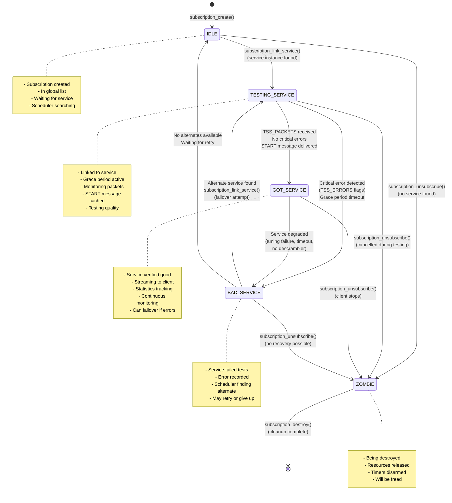

[← Back to Table of Contents](00-TOC.md)

## 10. Subscription System

The Subscription System is the bridge between client applications and broadcast services. It manages client requests to receive streaming data, handles service selection from multiple available sources, implements priority-based resource allocation, and provides automatic failover when services fail. This section documents the subscription structure, lifecycle, creation mechanisms, service instance selection, and the connection between subscriptions and services.

### 10.1 Subscription Structure and States

The subscription subsystem uses a sophisticated state machine to manage the lifecycle of client streaming requests, with careful tracking of service quality and automatic failover to alternate sources when problems occur.

#### 10.1.1 The th_subscription_t Structure

**Location**: `src/subscriptions.h`, `src/subscriptions.c`

The `th_subscription_t` structure represents a client's request to receive streaming data from a service or channel. It contains extensive state tracking, service instance management, statistics collection, and streaming infrastructure.

**Structure Overview**:
```c
typedef struct th_subscription {
  int ths_id;                                    // Unique subscription ID
  
  LIST_ENTRY(th_subscription) ths_global_link;   // Link in global subscription list
  LIST_ENTRY(th_subscription) ths_remove_link;   // Link in removal queue
  
  struct profile_chain *ths_prch;                // Profile chain (transcoding, etc.)
  
  int ths_weight;                                // Subscription weight (priority)
  int ths_state;                                 // Current state (see below)
  int ths_testing_error;                         // Error code during testing
  
  // Timers
  mtimer_t ths_remove_timer;                     // Timer for delayed removal
  mtimer_t ths_ca_check_timer;                   // Timer for CA system check
  
  // Channel association
  LIST_ENTRY(th_subscription) ths_channel_link;  // Link in channel's subscription list
  struct channel *ths_channel;                   // Channel (may be NULL)
  
  // Service association
  LIST_ENTRY(th_subscription) ths_service_link;  // Link in service's subscription list
  struct service *ths_service;                   // Service (may be NULL)
  
  struct tvh_input *ths_source;                  // Preferred input source (NULL = any)
  
  // Display information
  char *ths_title;                               // Display title
  time_t ths_start;                              // Subscription start time
  
  // Statistics
  int ths_total_err;                             // Total errors during subscription
  uint64_t ths_total_bytes_in;                   // Total bytes received
  uint64_t ths_total_bytes_out;                  // Total bytes sent to client
  uint64_t ths_total_bytes_in_prev;              // Previous second's bytes in
  uint64_t ths_total_bytes_out_prev;             // Previous second's bytes out
  int ths_bytes_in_avg;                          // Average bytes in per second
  int ths_bytes_out_avg;                         // Average bytes out per second
  
  // Streaming targets
  streaming_target_t ths_input;                  // Input target (receives from service)
  streaming_target_t *ths_output;                // Output target (sends to client)
  streaming_target_t *ths_parser;                // Parser target (optional)
  
  // Configuration
  int ths_flags;                                 // Subscription flags (see below)
  int ths_timeout;                               // Timeout in seconds
  int ths_ca_timeout;                            // CA system check timeout
  
  // Error tracking
  int64_t ths_last_find;                         // Last service find attempt time
  int ths_last_error;                            // Last error code
  
  streaming_message_t *ths_start_message;        // Cached START message
  
  // Client information
  char *ths_hostname;                            // Client hostname
  char *ths_username;                            // Client username
  char *ths_client;                              // Client application name
  char *ths_dvrfile;                             // DVR file path (for file subscriptions)
  
  // Service instance management
  service_instance_list_t ths_instances;         // List of service candidates
  struct service_instance *ths_current_instance; // Currently active instance
  
  // Postpone support
  int     ths_postpone;                          // Postpone duration in seconds
  int64_t ths_postpone_end;                      // Postpone end time
  
  // MPEG-TS mux chain (optional)
#if ENABLE_MPEGTS
  service_t *ths_raw_service;                    // Raw service for mux subscriptions
  LIST_ENTRY(th_subscription) ths_mux_link;      // Link in mux's subscription list
#endif

} th_subscription_t;
```

**Key Structure Characteristics**:

1. **Unique Identification**: Each subscription has a unique `ths_id` for tracking and logging

2. **State Machine**: Uses `ths_state` to track subscription lifecycle (IDLE → TESTING → GOT_SERVICE or BAD_SERVICE)

3. **Dual Association**: Can be associated with either a channel (user-friendly) or a service (direct)

4. **Service Instance List**: Maintains a list of candidate service instances for failover

5. **Streaming Infrastructure**: Contains input target (receives from service) and output target (sends to client)

6. **Statistics Tracking**: Comprehensive statistics for bandwidth monitoring and error tracking

7. **Client Information**: Tracks client identity for logging, access control, and debugging

8. **Profile Chain**: Optional profile chain for transcoding, filtering, or other processing

#### 10.1.2 Subscription States

Subscriptions transition through several states during their lifecycle, with automatic failover when services fail quality tests.

**State Enumeration**:
```c
typedef enum {
  SUBSCRIPTION_IDLE,              // Created but not yet linked to service
  SUBSCRIPTION_TESTING_SERVICE,   // Testing service quality (grace period)
  SUBSCRIPTION_GOT_SERVICE,       // Service is good, streaming active
  SUBSCRIPTION_BAD_SERVICE,       // Service failed quality test
  SUBSCRIPTION_ZOMBIE             // Being destroyed
} ths_state_t;
```

**SUBSCRIPTION_IDLE** - Initial State

**Description**: Subscription has been created but not yet linked to a service

**Characteristics**:
- Subscription structure allocated and initialized
- Added to global subscription list
- Service instance list empty or being populated
- No streaming data flowing
- Waiting for scheduler to find suitable service

**Typical Scenarios**:
- Subscription just created via `subscription_create()`
- Waiting for input source to become available
- Postpone period active (waiting for tuner wakeup)
- No suitable service instance found yet

**Transitions**:
- To TESTING_SERVICE: When service instance found and linked
- To ZOMBIE: If subscription cancelled before service found

**Duration**: Typically very brief (milliseconds), unless postpone is active or no sources available

---

**SUBSCRIPTION_TESTING_SERVICE** - Grace Period Testing

**Description**: Subscription is linked to a service and testing whether it provides good quality data

**Characteristics**:
- Linked to a service via `subscription_link_service()`
- Receiving streaming messages from service
- Monitoring for packets and errors
- Grace period timer active
- START message cached, not yet delivered to client
- Service status flags being evaluated

**Purpose**: Detect non-functional services early before committing to them

**Quality Tests**:
1. **Packet Reception**: Are packets being received? (TSS_PACKETS flag)
2. **Error Flags**: Are there critical errors? (TSS_ERRORS mask)
3. **CA System**: Is descrambling working? (TSS_CA_CHECK flag)
4. **Timeout**: Is data arriving within timeout period?

**Typical Scenarios**:
- Service just started, waiting for first packets
- Tuner locking to frequency
- Network connection establishing (IPTV)
- Descrambler negotiating with CA server

**Transitions**:
- To GOT_SERVICE: When TSS_PACKETS flag set and no critical errors
- To BAD_SERVICE: When critical error detected (tuning failure, no descrambler, timeout)
- To ZOMBIE: If subscription cancelled during testing

**Duration**: Typically 5-10 seconds (grace period), shorter if packets arrive quickly

**Message Handling During Testing**:
```c
// In subscription_input() callback:
if (state == SUBSCRIPTION_TESTING_SERVICE) {
  if (sm->sm_type == SMT_START) {
    // Cache START message, don't deliver yet
    s->ths_start_message = sm;
    return;
  }
  
  if (sm->sm_type == SMT_SERVICE_STATUS) {
    if (sm->sm_code & TSS_ERRORS) {
      // Service has errors, mark as bad
      s->ths_testing_error = tss2errcode(sm->sm_code);
      s->ths_state = SUBSCRIPTION_BAD_SERVICE;
      return;
    }
    
    if (sm->sm_code & TSS_PACKETS) {
      // Service is good! Deliver cached START message
      streaming_target_deliver(s->ths_output, s->ths_start_message);
      s->ths_start_message = NULL;
      s->ths_state = SUBSCRIPTION_GOT_SERVICE;
    }
  }
}
```

---

**SUBSCRIPTION_GOT_SERVICE** - Active Streaming

**Description**: Service has passed quality tests and is actively streaming to client

**Characteristics**:
- START message delivered to client
- Packets flowing from service to client
- Statistics being collected
- Service marked as running (`s_running = 1`)
- Continuous monitoring for errors
- Automatic failover if service degrades

**Typical Scenarios**:
- Normal viewing/recording session
- Service streaming reliably
- Client receiving and processing data
- Statistics being updated

**Monitoring**:
- Continues to monitor service status flags
- Tracks errors and bandwidth
- Watches for service degradation
- Can transition back to BAD_SERVICE if problems occur

**Transitions**:
- To BAD_SERVICE: If critical error occurs during streaming (tuning failure, timeout, no descrambler)
- To ZOMBIE: When client unsubscribes or subscription cancelled

**Duration**: Indefinite (until client stops or error occurs)

**Error Handling During Streaming**:
```c
// In subscription_input() callback:
if (state == SUBSCRIPTION_GOT_SERVICE) {
  if (sm->sm_type == SMT_SERVICE_STATUS) {
    if (sm->sm_code & (TSS_TUNING|TSS_TIMEOUT|TSS_NO_DESCRAMBLER)) {
      // Service degraded, mark as bad for failover
      s->ths_testing_error = tss2errcode(sm->sm_code);
      s->ths_state = SUBSCRIPTION_BAD_SERVICE;
      // Scheduler will attempt failover to alternate source
    }
  }
  
  // Pass all messages to client
  streaming_target_deliver(s->ths_output, sm);
}
```

---

**SUBSCRIPTION_BAD_SERVICE** - Service Failed

**Description**: Service has failed quality tests or degraded during streaming

**Characteristics**:
- Error code stored in `ths_testing_error`
- Service instance marked with error and timestamp
- Subscription remains in global list
- Scheduler will attempt to find alternate service instance
- Client may receive NOSTART or STOP message

**Purpose**: Enable automatic failover to alternate sources

**Error Tracking**:
- Error code stored in service instance (`si->si_error`)
- Error timestamp recorded (`si->si_error_time`)
- Service instance remains in candidate list but deprioritized
- Scheduler avoids recently failed instances

**Typical Scenarios**:
- Tuning failure (weak signal, wrong frequency)
- Timeout waiting for packets
- No descrambler available for encrypted service
- Network connection lost (IPTV)
- Input source disconnected

**Scheduler Response**:
```c
// In subscription_reschedule():
if (s->ths_state == SUBSCRIPTION_BAD_SERVICE) {
  // Unlink from failed service
  subscription_unlink_service0(s, SM_CODE_BAD_SOURCE, 1);
  
  // Mark instance as failed
  si->si_error = s->ths_testing_error;
  time(&si->si_error_time);
  
  // Try to find alternate instance
  si = subscription_start_instance(s, &error);
  
  if (si) {
    // Found alternate, link and test it
    subscription_link_service(s, si->si_s);
  } else {
    // No alternates available, notify client
    sm = streaming_msg_create_code(SMT_NOSTART, error);
    streaming_target_deliver(s->ths_output, sm);
  }
}
```

**Transitions**:
- To TESTING_SERVICE: When alternate service instance found
- To ZOMBIE: If no alternates available and subscription cancelled
- Remains in BAD_SERVICE: If waiting for retry or postpone period

**Duration**: Brief (milliseconds to seconds) while scheduler finds alternate, or indefinite if no alternates available

---

**SUBSCRIPTION_ZOMBIE** - Being Destroyed

**Description**: Subscription is being destroyed but cleanup not yet complete

**Characteristics**:
- Removed from global subscription list
- Service unlinked
- Timers disarmed
- Resources being released
- Structure will be freed when cleanup complete

**Purpose**: Ensure clean shutdown and resource release

**Typical Scenarios**:
- Client unsubscribed
- Subscription cancelled by system
- Channel or service deleted
- System shutdown

**Cleanup Process**:
```c
// In subscription_unsubscribe():
s->ths_state = SUBSCRIPTION_ZOMBIE;
LIST_REMOVE(s, ths_global_link);

if (s->ths_service)
  service_remove_subscriber(s->ths_service, s, SM_CODE_OK);

service_instance_list_clear(&s->ths_instances);
mtimer_disarm(&s->ths_remove_timer);
mtimer_disarm(&s->ths_ca_check_timer);

if (s->ths_parser)
  parser_destroy(s->ths_parser);

subscription_destroy(s);  // Free structure
```

**Transitions**:
- To [Freed]: When cleanup complete and structure freed

**Duration**: Very brief (milliseconds)

#### 10.1.3 Subscription Flags

The `ths_flags` field uses bit flags to control subscription behavior and specify data format requirements.

**Flag Definitions**:
```c
// Data format flags (mutually exclusive)
#define SUBSCRIPTION_NONE        0x000   // No specific format
#define SUBSCRIPTION_MPEGTS      0x001   // Raw MPEG-TS packets
#define SUBSCRIPTION_PACKET      0x002   // Parsed packets (th_pkt_t)
#define SUBSCRIPTION_TYPE_MASK   0x00f   // Mask for type flags

// Behavior flags
#define SUBSCRIPTION_STREAMING   0x010   // Normal streaming subscription
#define SUBSCRIPTION_RESTART     0x020   // Auto-restart on errors
#define SUBSCRIPTION_CONTACCESS  0x040   // Continue even without CA access
#define SUBSCRIPTION_ONESHOT     0x080   // One-time subscription (no reschedule)
#define SUBSCRIPTION_TABLES      0x100   // Include PSI/SI tables
#define SUBSCRIPTION_MINIMAL     0x200   // Minimal processing
#define SUBSCRIPTION_NODESCR     0x400   // No descrambling
#define SUBSCRIPTION_EMM         0x800   // Include EMM PIDs (for CA)

// Scan-related flags (for mux subscriptions)
#define SUBSCRIPTION_INITSCAN   0x1000   // Initial scan
#define SUBSCRIPTION_IDLESCAN   0x2000   // Idle scan
#define SUBSCRIPTION_USERSCAN   0x4000   // User-initiated scan
#define SUBSCRIPTION_EPG        0x8000   // EPG scan

// Protocol flags
#define SUBSCRIPTION_HTSP      0x10000   // HTSP client
#define SUBSCRIPTION_SWSERVICE 0x20000   // Software service
```

**Data Format Flags** (mutually exclusive):

1. **SUBSCRIPTION_NONE** (0x000)
   - No specific data format requirement
   - Service decides format
   - Typically used for internal subscriptions

2. **SUBSCRIPTION_MPEGTS** (0x001)
   - Receive raw MPEG-TS packets (188 bytes each)
   - No parsing or processing
   - Efficient for pass-through streaming
   - Used by: SAT>IP server, raw file recording

3. **SUBSCRIPTION_PACKET** (0x002)
   - Receive parsed packets (`th_pkt_t` structures)
   - Elementary streams separated (video, audio, subtitles)
   - Timestamps extracted and normalized
   - Used by: HTSP clients, transcoders, most streaming protocols

**Behavior Flags**:

1. **SUBSCRIPTION_STREAMING** (0x010)
   - Normal streaming subscription
   - Continuous data flow
   - Used by most client subscriptions

2. **SUBSCRIPTION_RESTART** (0x020)
   - Automatically restart on errors
   - Don't give up after first failure
   - Keep trying alternate sources
   - Used by: DVR recordings (to ensure completion)

3. **SUBSCRIPTION_CONTACCESS** (0x040)
   - Continue even if CA access denied
   - Allow scrambled packets through
   - Used by: Clients that handle descrambling themselves

4. **SUBSCRIPTION_ONESHOT** (0x080)
   - One-time subscription, no rescheduling
   - If service fails, don't try alternates
   - Automatically unsubscribe on stop
   - Used by: Testing, temporary subscriptions

5. **SUBSCRIPTION_TABLES** (0x100)
   - Include PSI/SI tables in stream
   - PAT, PMT, SDT, EIT, etc.
   - Used by: Clients that need table data, analyzers

6. **SUBSCRIPTION_MINIMAL** (0x200)
   - Minimal processing overhead
   - Skip unnecessary parsing
   - Used by: High-performance scenarios

7. **SUBSCRIPTION_NODESCR** (0x400)
   - Do not descramble encrypted streams
   - Pass scrambled packets through
   - Used by: Clients with own descrambling, testing

8. **SUBSCRIPTION_EMM** (0x800)
   - Include EMM (Entitlement Management Message) PIDs
   - Required for CA card updates
   - Used with SUBSCRIPTION_NODESCR

**Scan Flags** (for mux subscriptions):

1. **SUBSCRIPTION_INITSCAN** (0x1000)
   - Initial scan of mux
   - Discover all services
   - High priority

2. **SUBSCRIPTION_IDLESCAN** (0x2000)
   - Idle scan (low priority)
   - Background service discovery
   - Low priority

3. **SUBSCRIPTION_USERSCAN** (0x4000)
   - User-initiated scan
   - Medium-high priority
   - Interactive feedback

4. **SUBSCRIPTION_EPG** (0x8000)
   - EPG data collection
   - Subscribe to EIT tables
   - Medium priority

**Protocol Flags**:

1. **SUBSCRIPTION_HTSP** (0x10000)
   - HTSP protocol client
   - Enables HTSP-specific optimizations
   - Used by: Kodi, TVHeadend clients

2. **SUBSCRIPTION_SWSERVICE** (0x20000)
   - Software service (not hardware input)
   - Used for virtual services

**Flag Usage Examples**:

```c
// Normal HTSP streaming client
int flags = SUBSCRIPTION_PACKET | SUBSCRIPTION_STREAMING | SUBSCRIPTION_HTSP;

// DVR recording with auto-restart
int flags = SUBSCRIPTION_PACKET | SUBSCRIPTION_STREAMING | SUBSCRIPTION_RESTART;

// Raw mux recording
int flags = SUBSCRIPTION_MPEGTS | SUBSCRIPTION_STREAMING | SUBSCRIPTION_TABLES;

// Initial mux scan
int flags = SUBSCRIPTION_PACKET | SUBSCRIPTION_INITSCAN;

// Pass-through with own descrambling
int flags = SUBSCRIPTION_MPEGTS | SUBSCRIPTION_NODESCR | SUBSCRIPTION_EMM;
```

#### 10.1.4 Subscription Priorities

Subscriptions use a priority system (called "weight") to resolve conflicts when multiple subscriptions compete for limited resources (tuners, bandwidth, etc.). Higher weight values have higher priority.

**Priority Levels**:
```c
// Internal system priorities (low values)
#define SUBSCRIPTION_PRIO_KEEP        1   // Keep input rolling
#define SUBSCRIPTION_PRIO_SCAN_IDLE   2   // Idle scanning
#define SUBSCRIPTION_PRIO_SCAN_SCHED  3   // Scheduled scan
#define SUBSCRIPTION_PRIO_EPG         4   // EPG scanner
#define SUBSCRIPTION_PRIO_SCAN_INIT   5   // Initial scan
#define SUBSCRIPTION_PRIO_SCAN_USER   6   // User defined scan
#define SUBSCRIPTION_PRIO_MAPPER      7   // Channel mapper

// User subscriptions start at 10
#define SUBSCRIPTION_PRIO_MIN        10   // User defined / Normal levels
```

**Priority Ranges**:

1. **System Priorities (1-9)**: Reserved for internal operations
   - Keep-alive subscriptions
   - Background scanning
   - EPG collection
   - Service mapping

2. **User Priorities (10+)**: Normal client subscriptions
   - Live TV viewing: typically 100-150
   - DVR recordings: typically 200-300
   - High-priority recordings: 400+
   - Can go up to INT_MAX

**Priority Resolution**:

When multiple subscriptions compete for the same resource:

1. **Higher weight wins**: Subscription with highest weight gets the resource
2. **Lower weight preempted**: Lower priority subscription may be stopped
3. **Weight comparison**: `subscription_sort()` orders by weight (descending)
4. **Service instance selection**: Higher weight subscriptions get first choice of inputs

**Weight Calculation**:

```c
// Base weight from user/client
int base_weight = 100;  // e.g., from client request

// Profile chain may adjust weight
if (s->ths_prch)
  s->ths_weight = profile_chain_weight(s->ths_prch, base_weight);
else
  s->ths_weight = base_weight;

// Service priority adjustment (in service_instance_add)
int adjusted_prio = prio + 10 + MAX(-10, MIN(10, service->s_prio));
// Service priority can adjust by ±10
```

**Priority Use Cases**:

1. **DVR vs Live TV**:
   ```c
   // DVR recording (high priority)
   subscription_create(..., weight=200, ...);
   
   // Live TV (normal priority)
   subscription_create(..., weight=100, ...);
   
   // Result: DVR gets tuner, live TV may be preempted
   ```

2. **Multiple Recordings**:
   ```c
   // Important show (high priority)
   subscription_create(..., weight=300, ...);
   
   // Regular recording (normal priority)
   subscription_create(..., weight=200, ...);
   
   // Result: Important show gets preference if tuners limited
   ```

3. **Background Scanning**:
   ```c
   // EPG scan (low priority)
   subscription_create(..., weight=SUBSCRIPTION_PRIO_EPG, ...);
   
   // User viewing (normal priority)
   subscription_create(..., weight=100, ...);
   
   // Result: User viewing preempts EPG scan
   ```

**Dynamic Weight Changes**:

```c
// Change subscription weight at runtime
void subscription_set_weight(th_subscription_t *s, unsigned int weight)
{
  s->ths_weight = weight;
  // Triggers reschedule to re-evaluate resource allocation
}
```

**Weight in Service Instance Selection**:

```c
// In service_instance_add():
si->si_weight = weight;  // Track highest weight using this instance

// In service selection:
if (new_weight > si->si_weight) {
  // Higher priority subscription, may preempt current
  // Evaluate if current subscription should be stopped
}
```

**Sorting by Priority**:

```c
static int subscription_sort(th_subscription_t *a, th_subscription_t *b)
{
  return b->ths_weight - a->ths_weight;  // Descending order
}

// Subscriptions are kept sorted in global list
LIST_INSERT_SORTED(&subscriptions, s, ths_global_link, subscription_sort);
```

**Priority Best Practices**:

1. **Use standard ranges**: Keep user subscriptions in 10-1000 range
2. **Reserve high values**: Values > 1000 for critical operations only
3. **Consistent scaling**: Use consistent increments (e.g., 100 per priority level)
4. **Document priorities**: Make priority scheme clear to users
5. **Test conflicts**: Verify behavior when resources exhausted

### 10.2 Subscription Lifecycle

The subscription lifecycle describes how subscriptions transition between states in response to service availability, quality tests, and errors. Understanding this lifecycle is essential for debugging streaming issues and implementing failover logic.

#### 10.2.1 Subscription Lifecycle State Diagram



#### 10.2.2 State Transition Triggers

**IDLE → TESTING_SERVICE** (Service Found and Linked)

**Trigger**: Scheduler finds suitable service instance

**Process**:
1. **Service Selection**: `subscription_start_instance()` finds best service instance
2. **Service Link**: `subscription_link_service()` connects subscription to service
3. **State Change**: `ths_state` changes from IDLE to TESTING_SERVICE
4. **Streaming Setup**: Input target connected to service's streaming pad
5. **Grace Message**: SMT_GRACE message sent to client with grace period duration
6. **Monitoring Begins**: Subscription starts monitoring for packets and errors

**Conditions**:
- Service instance available (input source ready)
- No higher priority subscription blocking
- Service enabled and accessible
- Input source can tune to required mux

**Code Flow**:
```c
// In subscription_reschedule():
si = subscription_start_instance(s, &error);
if (si) {
  subscription_link_service(s, si->si_s);
  subscription_show_info(s);
}
```

---

**TESTING_SERVICE → GOT_SERVICE** (Service Passed Tests)

**Trigger**: Service delivers packets without critical errors

**Process**:
1. **Packet Detection**: Service status includes TSS_PACKETS flag
2. **Error Check**: No critical error flags (TSS_ERRORS) present
3. **START Delivery**: Cached START message delivered to client
4. **State Change**: `ths_state` changes to GOT_SERVICE
5. **Service Running**: Service marked as running (`s_running = 1`)
6. **Status Update**: Service status message delivered to client

**Conditions**:
- TSS_PACKETS flag set in service status
- No TSS_ERRORS flags present
- START message available (received from service)
- Grace period not expired with errors

**Code Flow**:
```c
// In subscription_input() callback:
if (s->ths_state == SUBSCRIPTION_TESTING_SERVICE) {
  if (sm->sm_type == SMT_SERVICE_STATUS && (sm->sm_code & TSS_PACKETS)) {
    if (s->ths_start_message != NULL) {
      // Service is good, deliver START to client
      streaming_target_deliver(s->ths_output, s->ths_start_message);
      s->ths_start_message = NULL;
      s->ths_service->s_running = 1;
    }
    s->ths_state = SUBSCRIPTION_GOT_SERVICE;
  }
}
```

**Client Experience**:
- Receives SMT_GRACE message (buffering indicator)
- Receives SMT_START message (stream metadata)
- Receives SMT_SERVICE_STATUS (status update)
- Begins receiving SMT_PACKET messages (actual data)

---

**TESTING_SERVICE → BAD_SERVICE** (Service Failed Tests)

**Trigger**: Critical error detected during grace period

**Process**:
1. **Error Detection**: Service status includes TSS_ERRORS flags
2. **Error Code**: Error code extracted via `tss2errcode()`
3. **Error Storage**: Error stored in `ths_testing_error`
4. **State Change**: `ths_state` changes to BAD_SERVICE
5. **Scheduler Notification**: Scheduler will attempt failover on next cycle

**Conditions**:
- TSS_ERRORS flags present (tuning failure, timeout, no descrambler)
- Grace period expired without packets
- CA access denied (unless SUBSCRIPTION_CONTACCESS set)
- Input source failed

**Error Codes**:
- `SM_CODE_TUNING_FAILED`: Tuner couldn't lock to frequency
- `SM_CODE_NO_DESCRAMBLER`: Encrypted service, no descrambler available
- `SM_CODE_TIMEOUT`: No packets received within timeout
- `SM_CODE_NO_FREE_ADAPTER`: No input source available
- `SM_CODE_NO_ACCESS`: CA system denied access

**Code Flow**:
```c
// In subscription_input() callback:
if (s->ths_state == SUBSCRIPTION_TESTING_SERVICE) {
  if (sm->sm_type == SMT_SERVICE_STATUS && (sm->sm_code & TSS_ERRORS)) {
    int error = tss2errcode(sm->sm_code);
    if (error != SM_CODE_OK) {
      if (error > s->ths_testing_error)
        s->ths_testing_error = error;
      s->ths_state = SUBSCRIPTION_BAD_SERVICE;
      // Scheduler will handle failover
    }
  }
}
```

---

**GOT_SERVICE → BAD_SERVICE** (Service Degraded)

**Trigger**: Service encounters error during active streaming

**Process**:
1. **Error Detection**: Service status includes critical error flags
2. **Error Storage**: Error code stored in `ths_testing_error`
3. **State Change**: `ths_state` changes to BAD_SERVICE
4. **Scheduler Notification**: Scheduler will attempt failover
5. **Client Notification**: May receive STOP or status update

**Conditions**:
- Tuning failure during streaming
- Timeout (no packets for extended period)
- Descrambler failure
- Input source disconnected

**Typical Scenarios**:
- Weak signal causes tuner to lose lock
- Network connection lost (IPTV)
- CA server disconnected
- Hardware failure

**Code Flow**:
```c
// In subscription_input() callback:
if (s->ths_state == SUBSCRIPTION_GOT_SERVICE) {
  if (sm->sm_type == SMT_SERVICE_STATUS) {
    if (sm->sm_code & (TSS_TUNING|TSS_TIMEOUT|TSS_NO_DESCRAMBLER)) {
      int error = tss2errcode(sm->sm_code);
      if (error > s->ths_testing_error)
        s->ths_testing_error = error;
      s->ths_state = SUBSCRIPTION_BAD_SERVICE;
      // Scheduler will attempt failover
    }
  }
}
```

**Failover Behavior**:
- Subscription remains active
- Scheduler searches for alternate service instance
- If found, transitions to TESTING_SERVICE with new service
- If not found, may send NOSTART or STOP to client

---

**BAD_SERVICE → TESTING_SERVICE** (Failover to Alternate)

**Trigger**: Scheduler finds alternate service instance

**Process**:
1. **Unlink Failed Service**: `subscription_unlink_service0()` disconnects from failed service
2. **Mark Instance Failed**: Service instance marked with error and timestamp
3. **Find Alternate**: `subscription_start_instance()` searches for alternate
4. **Link New Service**: `subscription_link_service()` connects to alternate
5. **State Change**: `ths_state` changes to TESTING_SERVICE
6. **Test Again**: New service enters grace period testing

**Conditions**:
- Alternate service instance available
- Alternate not recently failed
- Alternate has sufficient priority/weight
- Input source available for alternate

**Code Flow**:
```c
// In subscription_reschedule():
if (s->ths_state == SUBSCRIPTION_BAD_SERVICE) {
  tvhwarn(LS_SUBSCRIPTION, "%04X: service instance is bad, reason: %s",
          shortid(s), streaming_code2txt(s->ths_testing_error));
  
  // Unlink from failed service
  si = s->ths_current_instance;
  subscription_unlink_service0(s, SM_CODE_BAD_SOURCE, 1);
  
  // Mark instance as failed
  si->si_error = s->ths_testing_error;
  time(&si->si_error_time);
  
  // Try to find alternate
  si = subscription_start_instance(s, &error);
  
  if (si) {
    // Found alternate, link and test
    subscription_link_service(s, si->si_s);
    subscription_show_info(s);
  } else {
    // No alternates, notify client
    sm = streaming_msg_create_code(SMT_NOSTART, error);
    streaming_target_deliver(s->ths_output, sm);
  }
}
```

**Client Experience**:
- May receive brief interruption
- Receives new SMT_GRACE message
- Receives new SMT_START message (if alternate succeeds)
- Streaming resumes with alternate source

---

**BAD_SERVICE → IDLE** (No Alternates, Waiting)

**Trigger**: No alternate service instances available

**Process**:
1. **Alternate Search**: `subscription_start_instance()` returns NULL
2. **State Remains**: May remain in BAD_SERVICE or transition to IDLE
3. **Retry Logic**: Scheduler will retry periodically
4. **Client Notification**: SMT_NOSTART message sent if appropriate

**Conditions**:
- All service instances failed or unavailable
- No suitable input sources
- All inputs busy with higher priority subscriptions
- Postpone period active

**Retry Behavior**:
- Scheduler retries every 2 seconds (default)
- Avoids spamming logs (only logs every 2 seconds)
- Continues until service found or subscription cancelled

---

**Any State → ZOMBIE** (Subscription Cancelled)

**Trigger**: `subscription_unsubscribe()` called

**Process**:
1. **State Change**: `ths_state` set to SUBSCRIPTION_ZOMBIE
2. **List Removal**: Removed from global subscription list
3. **Service Unlink**: Disconnected from service (if linked)
4. **Instance Cleanup**: Service instance list cleared
5. **Timer Disarm**: All timers disarmed
6. **Resource Release**: Streaming targets, parsers destroyed
7. **Structure Free**: `subscription_destroy()` frees memory

**Conditions**:
- Client unsubscribes
- Subscription timeout
- Channel or service deleted
- System shutdown
- ONESHOT subscription completes

**Code Flow**:
```c
void subscription_unsubscribe(th_subscription_t *s, int flags)
{
  s->ths_state = SUBSCRIPTION_ZOMBIE;
  LIST_REMOVE(s, ths_global_link);
  
  if (s->ths_service)
    service_remove_subscriber(s->ths_service, s, SM_CODE_OK);
  
  service_instance_list_clear(&s->ths_instances);
  mtimer_disarm(&s->ths_remove_timer);
  mtimer_disarm(&s->ths_ca_check_timer);
  
  if (s->ths_parser)
    parser_destroy(s->ths_parser);
  
  subscription_destroy(s);
}
```

#### 10.2.3 Grace Period Testing

The grace period is a critical phase where the subscription tests whether a service is actually working before committing to it. This prevents clients from waiting indefinitely for broken services.

**Grace Period Duration**:
- Default: 5-10 seconds (configurable per input type)
- DVB: Typically 10 seconds (allows time for tuning and lock)
- IPTV: Typically 5 seconds (network connection faster)
- Can be extended via postpone mechanism

**Grace Period Process**:

1. **Service Link**: Subscription linked to service
2. **Grace Message**: SMT_GRACE message sent to client
   ```c
   sm = streaming_msg_create_code(SMT_GRACE, grace_period_seconds);
   streaming_service_deliver(service, sm);
   ```
3. **START Cache**: START message received but cached, not delivered
4. **Packet Monitoring**: Watch for TSS_PACKETS flag in service status
5. **Error Monitoring**: Watch for TSS_ERRORS flags
6. **Timer**: Grace period timer running

**Success Criteria**:
- TSS_PACKETS flag set (packets being received)
- No critical error flags (TSS_ERRORS)
- START message available

**Failure Criteria**:
- TSS_ERRORS flags present
- Grace period expires without packets
- CA access denied
- Tuning failure

**Client Behavior During Grace Period**:
- Display "buffering" or "connecting" indicator
- Wait for START message
- May show grace period countdown
- Prepare for potential failure

**Optimization**:
- If packets arrive quickly, grace period ends early
- No need to wait full duration if service clearly working
- Reduces perceived latency for good services

**Example Timeline**:
```
T+0.0s: Subscription linked to service, SMT_GRACE sent
T+0.5s: Service starts tuning
T+1.0s: Tuner locks to frequency
T+1.5s: First packets received, TSS_PACKETS flag set
T+1.5s: START message delivered to client (grace period ends early)
T+1.6s: Client begins receiving packets
```

**Failure Example**:
```
T+0.0s: Subscription linked to service, SMT_GRACE sent
T+0.5s: Service starts tuning
T+5.0s: Tuning fails, TSS_TUNING flag set
T+5.0s: Subscription marked BAD_SERVICE
T+5.1s: Scheduler searches for alternate
T+5.2s: Alternate found, new grace period begins
```

### 10.3 Subscription Creation and Management

The subscription subsystem provides several functions for creating subscriptions from different sources (channels, services, muxes) and managing their lifecycle. Understanding these functions is essential for implementing client protocols and DVR functionality.

#### 10.3.1 Generic Subscription Creation

**Function**: `subscription_create()`

**Purpose**: Core function for creating subscriptions with custom streaming operations

**Signature**:
```c
th_subscription_t *subscription_create(
  profile_chain_t *prch,        // Profile chain (transcoding, filtering)
  int weight,                   // Subscription priority/weight
  const char *name,             // Display name
  int flags,                    // Subscription flags
  streaming_ops_t *ops,         // Streaming operations (callback)
  const char *hostname,         // Client hostname
  const char *username,         // Client username
  const char *client            // Client application name
);
```

**Parameters**:

1. **`prch`** - Profile Chain
   - Optional (can be NULL)
   - Contains profile for transcoding, filtering, or format conversion
   - Contains streaming target for output
   - If NULL, uses direct pass-through

2. **`weight`** - Priority Weight
   - Integer priority value (higher = more important)
   - User subscriptions typically 10-1000
   - System subscriptions 1-9
   - Can be adjusted by profile chain

3. **`name`** - Display Name
   - Human-readable subscription name
   - Used in logs and status displays
   - Example: "HTSP: user@hostname"

4. **`flags`** - Subscription Flags
   - Combination of SUBSCRIPTION_* flags
   - Controls data format, behavior, scanning
   - See section 8.1.3 for details

5. **`ops`** - Streaming Operations
   - Callback function for receiving streaming messages
   - Optional (can be NULL for direct pass-through)
   - See streaming_ops_t structure

6. **`hostname`** - Client Hostname
   - Optional (can be NULL)
   - Used for logging and access control
   - Example: "192.168.1.100"

7. **`username`** - Client Username
   - Optional (can be NULL)
   - Used for logging and access control
   - Example: "john"

8. **`client`** - Client Application
   - Optional (can be NULL)
   - Identifies client software
   - Example: "Kodi", "VLC", "TVHeadend Android"

**Return Value**:
- Pointer to created subscription
- Never returns NULL (always succeeds)

**Operation**:

1. **Allocation**: Allocates and zeros `th_subscription_t` structure
2. **Initialization**:
   ```c
   s->ths_id = ++tally;  // Unique ID
   s->ths_title = strdup(name);
   s->ths_hostname = hostname ? strdup(hostname) : NULL;
   s->ths_username = username ? strdup(username) : NULL;
   s->ths_client = client ? strdup(client) : NULL;
   s->ths_flags = flags;
   s->ths_weight = weight;
   s->ths_state = SUBSCRIPTION_IDLE;
   time(&s->ths_start);
   ```

3. **Profile Chain Setup**:
   ```c
   s->ths_prch = prch && prch->prch_st ? prch : NULL;
   if (s->ths_prch)
     s->ths_weight = profile_chain_weight(s->ths_prch, weight);
   ```

4. **Streaming Target Setup**:
   ```c
   if (!ops) ops = &subscription_input_direct_ops;
   streaming_target_init(&s->ths_input, ops, s, 0);
   
   if (!st) {
     st = calloc(1, sizeof(streaming_target_t));
     streaming_target_init(st, &subscription_input_null_ops, s, 0);
   }
   s->ths_output = st;
   ```

5. **Configuration from Profile**:
   ```c
   if (pro) {
     s->ths_timeout = pro->pro_timeout;
     if (pro->pro_restart)
       s->ths_flags |= SUBSCRIPTION_RESTART;
     if (pro->pro_contaccess)
       s->ths_flags |= SUBSCRIPTION_CONTACCESS;
     if (pro->pro_swservice)
       s->ths_flags |= SUBSCRIPTION_SWSERVICE;
     s->ths_ca_timeout = ms2mono(MINMAX(pro->pro_ca_timeout, 100, 5000));
   }
   ```

6. **Postpone Setup**:
   ```c
   s->ths_postpone = subscription_postpone;  // Global postpone setting
   s->ths_postpone_end = mclk() + sec2mono(s->ths_postpone);
   ```

7. **List Insertion**:
   ```c
   LIST_INSERT_SORTED(&subscriptions, s, ths_global_link, subscription_sort);
   ```

8. **Scheduler Trigger**:
   ```c
   subscription_delayed_reschedule(0);  // Trigger immediate reschedule
   notify_reload("subscriptions");      // Notify UI
   ```

**Usage Example**:
```c
// Create custom subscription with callback
static void my_callback(void *opaque, streaming_message_t *sm) {
  // Handle streaming messages
  streaming_msg_free(sm);
}

streaming_ops_t ops = {
  .st_cb = my_callback,
  .st_info = NULL
};

th_subscription_t *s = subscription_create(
  NULL,                    // No profile chain
  100,                     // Normal priority
  "My Subscription",       // Name
  SUBSCRIPTION_PACKET,     // Parsed packets
  &ops,                    // Custom callback
  "192.168.1.100",        // Hostname
  "user",                 // Username
  "MyApp"                 // Client name
);
```

#### 10.3.2 Channel-Based Subscription

**Function**: `subscription_create_from_channel()`

**Purpose**: Create subscription from a channel (user-friendly, supports multi-service channels)

**Signature**:
```c
th_subscription_t *subscription_create_from_channel(
  profile_chain_t *prch,        // Profile chain
  tvh_input_t *ti,              // Preferred input source (NULL = any)
  unsigned int weight,          // Priority weight
  const char *name,             // Display name
  int flags,                    // Subscription flags
  const char *hostname,         // Client hostname
  const char *username,         // Client username
  const char *client,           // Client application
  int *error                    // Output: error code if fails
);
```

**Additional Parameters**:

1. **`ti`** - Preferred Input Source
   - Optional (can be NULL)
   - If specified, only use this input source
   - If NULL, use any available input
   - Useful for: multi-tuner setups, testing specific inputs

2. **`error`** - Error Code Output
   - Optional (can be NULL)
   - Receives error code if subscription fails
   - Error codes: SM_CODE_* values
   - Only set for ONESHOT subscriptions that fail immediately

**Key Differences from Generic Creation**:

1. **Channel Association**:
   ```c
   s->ths_channel = prch->prch_id;  // prch->prch_id is channel_t*
   LIST_INSERT_HEAD(&ch->ch_subscriptions, s, ths_channel_link);
   ```

2. **Service Selection**:
   - Subscription doesn't specify service directly
   - Scheduler finds best service for channel
   - Supports channels mapped to multiple services
   - Automatic failover between services

3. **ONESHOT Handling**:
   ```c
   if (flags & SUBSCRIPTION_ONESHOT) {
     si = subscription_start_instance(s, error);
     if (si == NULL) {
       subscription_unsubscribe(s, UNSUBSCRIBE_QUIET | UNSUBSCRIBE_FINAL);
       return NULL;  // Failed immediately
     }
     subscription_link_service(s, si->si_s);
     subscription_show_info(s);
   }
   ```

**Usage Example**:
```c
// Create subscription for channel
channel_t *ch = channel_find_by_name("BBC One");
profile_chain_t *prch = profile_chain_init(ch, NULL, 0);

int error = 0;
th_subscription_t *s = subscription_create_from_channel(
  prch,                    // Profile chain with channel
  NULL,                    // Any input source
  100,                     // Normal priority
  "Live TV",               // Name
  SUBSCRIPTION_PACKET | SUBSCRIPTION_STREAMING,
  "192.168.1.100",        // Hostname
  "user",                 // Username
  "Kodi",                 // Client
  &error                  // Error output
);

if (s == NULL) {
  tvhlog(LOG_ERR, "subscription", "Failed to create subscription: %s",
         streaming_code2txt(error));
}
```

**Advantages**:
- User-friendly (channels have names, services have technical IDs)
- Automatic service selection
- Supports multi-service channels
- Automatic failover between services

**Use Cases**:
- Live TV viewing
- Channel-based DVR recordings
- EPG-driven recordings
- User-initiated subscriptions

#### 10.3.3 Service-Based Subscription

**Function**: `subscription_create_from_service()`

**Purpose**: Create subscription directly from a service (bypasses channel mapping)

**Signature**:
```c
th_subscription_t *subscription_create_from_service(
  profile_chain_t *prch,        // Profile chain (prch->prch_id is service_t*)
  tvh_input_t *ti,              // Preferred input source
  unsigned int weight,          // Priority weight
  const char *name,             // Display name
  int flags,                    // Subscription flags
  const char *hostname,         // Client hostname
  const char *username,         // Client username
  const char *client,           // Client application
  int *error                    // Output: error code
);
```

**Key Differences from Channel-Based**:

1. **Service Association**:
   ```c
   s->ths_service = prch->prch_id;  // prch->prch_id is service_t*
   s->ths_channel = NULL;           // No channel association
   ```

2. **Direct Service**:
   - Subscription specifies exact service
   - No service selection needed
   - No automatic failover (service is fixed)
   - Faster startup (no service search)

3. **Use Cases**:
   - Testing specific services
   - Service analysis
   - Direct service access (API)
   - Internal subscriptions

**Usage Example**:
```c
// Create subscription for specific service
service_t *svc = service_find_by_uuid("service-uuid");
profile_chain_t *prch = profile_chain_init(svc, NULL, 0);

int error = 0;
th_subscription_t *s = subscription_create_from_service(
  prch,                    // Profile chain with service
  NULL,                    // Any input source
  100,                     // Normal priority
  "Service Test",          // Name
  SUBSCRIPTION_PACKET | SUBSCRIPTION_STREAMING,
  "192.168.1.100",        // Hostname
  "admin",                // Username
  "Test Tool",            // Client
  &error                  // Error output
);
```

**Advantages**:
- Direct service access
- No channel mapping required
- Faster (no service selection)
- Precise control

**Disadvantages**:
- No automatic failover
- Requires knowledge of service IDs
- Less user-friendly

#### 10.3.4 Mux-Based Subscription

**Function**: `subscription_create_from_mux()`

**Purpose**: Create subscription for entire mux (all services on a transponder)

**Signature**:
```c
#if ENABLE_MPEGTS
th_subscription_t *subscription_create_from_mux(
  profile_chain_t *prch,        // Profile chain (prch->prch_id is mpegts_mux_t*)
  tvh_input_t *ti,              // Preferred input source
  unsigned int weight,          // Priority weight
  const char *name,             // Display name
  int flags,                    // Subscription flags (typically includes scan flags)
  const char *hostname,         // Client hostname
  const char *username,         // Client username
  const char *client,           // Client application
  int *error                    // Output: error code
);
#endif
```

**Key Differences**:

1. **Raw Service Creation**:
   ```c
   mpegts_mux_t *mm = prch->prch_id;
   mpegts_service_t *s = mpegts_service_create_raw(mm);
   // Creates STYPE_RAW service for entire mux
   ```

2. **Mux Association**:
   ```c
   s->ths_raw_service = service;
   LIST_INSERT_HEAD(&mm->mm_raw_subs, s, ths_mux_link);
   ```

3. **Typical Flags**:
   ```c
   int flags = SUBSCRIPTION_MPEGTS |      // Raw MPEG-TS packets
               SUBSCRIPTION_TABLES |       // Include PSI/SI tables
               SUBSCRIPTION_INITSCAN;      // Initial scan
   ```

**Usage Example**:
```c
// Create mux subscription for scanning
mpegts_mux_t *mux = mpegts_mux_find_by_uuid("mux-uuid");
profile_chain_t *prch = profile_chain_init(mux, NULL, 0);

int error = 0;
th_subscription_t *s = subscription_create_from_mux(
  prch,                    // Profile chain with mux
  NULL,                    // Any input source
  SUBSCRIPTION_PRIO_SCAN_INIT,  // Scan priority
  "Initial Scan",          // Name
  SUBSCRIPTION_MPEGTS | SUBSCRIPTION_INITSCAN,
  NULL,                    // No hostname
  "system",               // System user
  "Scanner",              // Client
  &error                  // Error output
);
```

**Use Cases**:
- Mux scanning (service discovery)
- EPG collection from mux
- Mux analysis
- Recording entire transponder
- Testing/debugging

**Advantages**:
- Access to all services on mux
- Efficient for scanning
- Complete mux data available

**Disadvantages**:
- High bandwidth (entire mux)
- More processing required
- Not suitable for normal viewing

#### 10.3.5 File-Based Subscription

**Function**: `subscription_create_from_file()`

**Purpose**: Create subscription from a file (for playback of recorded streams)

**Signature**:
```c
th_subscription_t *subscription_create_from_file(
  const char *name,             // Display name
  const char *charset,          // Character set for filename
  const char *filename,         // File path
  const char *hostname,         // Client hostname
  const char *username,         // Client username
  const char *client            // Client application
);
```

**Key Differences**:

1. **No Service**: Not linked to any service
2. **File URL**: Stores file:// URL in `ths_dvrfile`
3. **Minimal Flags**: Uses SUBSCRIPTION_NONE
4. **No Scheduling**: Not processed by scheduler

**Usage Example**:
```c
th_subscription_t *s = subscription_create_from_file(
  "Playback",              // Name
  "UTF-8",                 // Charset
  "/recordings/show.ts",   // File path
  "192.168.1.100",        // Hostname
  "user",                 // Username
  "Player"                // Client
);
```

**Use Cases**:
- Playing back recordings
- Streaming files to clients
- Testing with known content

#### 10.3.6 Subscription Management Functions

**Change Weight**:
```c
void subscription_set_weight(th_subscription_t *s, unsigned int weight)
{
  s->ths_weight = weight;
  // Triggers reschedule to re-evaluate resource allocation
}
```

**Set Playback Speed**:
```c
void subscription_set_speed(th_subscription_t *s, int32_t speed)
{
  // speed: 100 = normal, 200 = 2x, 50 = 0.5x
  streaming_message_t *sm = streaming_msg_create_code(SMT_SPEED, speed);
  streaming_target_deliver(s->ths_output, sm);
}
```

**Seek/Skip**:
```c
void subscription_set_skip(th_subscription_t *s, const streaming_skip_t *skip)
{
  streaming_message_t *sm = streaming_msg_create_data(SMT_SKIP, skip);
  streaming_target_deliver(s->ths_output, sm);
}
```

**Stop Subscription**:
```c
void subscription_stop(th_subscription_t *s)
{
  // Graceful stop, allows cleanup
  subscription_unsubscribe(s, 0);
}
```

**Unsubscribe**:
```c
void subscription_unsubscribe(th_subscription_t *s, int flags)
{
  // flags: UNSUBSCRIBE_QUIET (no log), UNSUBSCRIBE_FINAL (immediate destroy)
  // Transitions to ZOMBIE state, releases resources
}
```

**Add Statistics**:
```c
void subscription_add_bytes_in(th_subscription_t *s, size_t in)
{
  atomic_add(&s->ths_total_bytes_in, in);
}

void subscription_add_bytes_out(th_subscription_t *s, size_t out)
{
  atomic_add(&s->ths_total_bytes_out, out);
}
```

#### 10.3.7 Subscription Priority System

The priority system ensures fair resource allocation and allows important subscriptions to preempt less important ones.

**Priority Calculation**:
```c
// Base weight from caller
int base_weight = 100;

// Profile chain may adjust
if (prch)
  weight = profile_chain_weight(prch, base_weight);

// Service priority adjustment (±10)
int adjusted_prio = prio + 10 + MAX(-10, MIN(10, service->s_prio));
```

**Priority Sorting**:
```c
static int subscription_sort(th_subscription_t *a, th_subscription_t *b)
{
  return b->ths_weight - a->ths_weight;  // Descending
}

// Subscriptions kept sorted in global list
LIST_INSERT_SORTED(&subscriptions, s, ths_global_link, subscription_sort);
```

**Resource Allocation**:
- Scheduler processes subscriptions in priority order
- Higher priority subscriptions get first choice of inputs
- Lower priority subscriptions may be preempted
- Equal priority: first-come-first-served

**Example Priority Scheme**:
```c
// System priorities (1-9)
#define PRIO_KEEP_ALIVE    1
#define PRIO_IDLE_SCAN     2
#define PRIO_EPG           4
#define PRIO_INIT_SCAN     5

// User priorities (10+)
#define PRIO_LIVE_TV       100
#define PRIO_DVR_NORMAL    200
#define PRIO_DVR_IMPORTANT 300
#define PRIO_DVR_CRITICAL  400
```

### 10.4 Service Instance Selection

Service instance selection is the process of choosing the best input source to provide a service to a subscription. This involves evaluating multiple candidate sources, considering priority and weight, tracking errors, and implementing failover logic.

#### 10.4.1 The service_instance_t Structure

**Location**: `src/service.h`, `src/service.c`

The `service_instance_t` structure represents a candidate source for providing a service. Each subscription maintains a list of service instances, ordered by priority and suitability.

**Structure Definition**:
```c
typedef struct service_instance {
  TAILQ_ENTRY(service_instance) si_link;  // Link in subscription's instance list
  
  struct service *si_s;                   // Service (reference held)
  
  int si_prio;                            // Priority (higher = better)
  int si_instance;                        // Instance discriminator (input ID)
  int si_error;                           // Error code if failed
  time_t si_error_time;                   // When error occurred
  int si_weight;                          // Highest weight using this instance
  int si_mark;                            // For mark & sweep garbage collection
  
  char si_source[128];                    // Source description (for logging)
  
} service_instance_t;
```

**Key Fields**:

1. **`si_s`** - Service Pointer
   - Points to the service this instance provides
   - Reference counted (service_ref() called)
   - Must be released with service_unref() when instance destroyed

2. **`si_prio`** - Priority
   - Higher values have higher priority
   - Calculated from input priority + service priority
   - Range: typically 0-100
   - Formula: `prio + 10 + MAX(-10, MIN(10, service->s_prio))`

3. **`si_instance`** - Instance Discriminator
   - Identifies which input provides this instance
   - Allows distinguishing between multiple inputs for same service
   - Example: 0 for first DVB adapter, 1 for second, etc.

4. **`si_error`** - Error Code
   - Set when instance fails
   - Error codes: SM_CODE_* values
   - Zero means no error
   - Used to avoid recently failed instances

5. **`si_error_time`** - Error Timestamp
   - When the error occurred
   - Used to implement retry delays
   - Instances with recent errors deprioritized

6. **`si_weight`** - Active Weight
   - Highest subscription weight currently using this instance
   - Used for resource allocation decisions
   - Updated when subscriptions start/stop

7. **`si_mark`** - Mark Flag
   - Used for mark-and-sweep garbage collection
   - Instances not marked during enumeration are removed
   - Prevents stale instances from accumulating

8. **`si_source`** - Source Description
   - Human-readable description of source
   - Example: "DVB-S #0 (adapter0)"
   - Used in logs and status displays

#### 10.4.2 Service Instance List Management

**List Type**:
```c
typedef TAILQ_HEAD(service_instance_list, service_instance) service_instance_list_t;
```

**Adding Instance**:
```c
service_instance_t *service_instance_add(
  service_instance_list_t *sil,  // Instance list
  struct service *s,             // Service
  int instance,                  // Instance discriminator
  const char *source,            // Source description
  int prio,                      // Priority
  int weight                     // Subscription weight
);
```

**Operation**:
1. **Priority Adjustment**:
   ```c
   prio += 10 + MAX(-10, MIN(10, s->s_prio));
   // Service priority can adjust by ±10
   ```

2. **Search for Existing**:
   ```c
   TAILQ_FOREACH(si, sil, si_link) {
     if (si->si_s == s && si->si_instance == instance) {
       // Found existing instance
       if (si->si_weight < weight)
         si->si_weight = weight;  // Update weight
       return si;
     }
   }
   ```

3. **Create New**:
   ```c
   si = calloc(1, sizeof(service_instance_t));
   si->si_s = s;
   service_ref(s);  // Hold reference
   si->si_instance = instance;
   si->si_prio = prio;
   si->si_weight = weight;
   strncpy(si->si_source, source, sizeof(si->si_source) - 1);
   ```

4. **Insert Sorted**:
   ```c
   // Insert in priority order (highest first)
   TAILQ_FOREACH(si2, sil, si_link) {
     if (si_cmp(si, si2) < 0) {
       TAILQ_INSERT_BEFORE(si2, si, si_link);
       return si;
     }
   }
   TAILQ_INSERT_TAIL(sil, si, si_link);
   ```

**Removing Instance**:
```c
void service_instance_destroy(
  service_instance_list_t *sil,
  service_instance_t *si
)
{
  TAILQ_REMOVE(sil, si, si_link);
  service_unref(si->si_s);  // Release reference
  free(si);
}
```

**Clearing List**:
```c
void service_instance_list_clear(service_instance_list_t *sil)
{
  service_instance_t *si;
  while ((si = TAILQ_FIRST(sil)) != NULL)
    service_instance_destroy(sil, si);
}
```

#### 10.4.3 Service Candidate Evaluation

**Function**: `service_find_instance()`

**Purpose**: Find the best service instance for a subscription

**Signature**:
```c
service_instance_t *service_find_instance(
  service_t *s,                  // Service (may be NULL if channel-based)
  channel_t *ch,                 // Channel (may be NULL if service-based)
  tvh_input_t *ti,               // Preferred input (NULL = any)
  profile_chain_t *prch,         // Profile chain
  service_instance_list_t *sil,  // Output: instance list
  int *error,                    // Output: error code
  int weight,                    // Subscription weight
  int flags,                     // Subscription flags
  int timeout,                   // Timeout in seconds
  int postpone                   // Postpone duration in seconds
);
```

**Evaluation Process**:

1. **Mark Phase**: Mark all existing instances
   ```c
   TAILQ_FOREACH(si, sil, si_link)
     si->si_mark = 1;
   ```

2. **Service Enumeration**:
   - If channel specified: enumerate all services mapped to channel
   - If service specified: use that service directly
   - For each service, call `s_enlist()` virtual method

3. **Input Enumeration** (in `s_enlist()`):
   ```c
   // For each input that can provide this service
   LIST_FOREACH(input, &inputs, ti_link) {
     // Check if input is enabled for this service
     if (!input->mi_is_enabled(input, mux, flags, weight))
       continue;
     
     // Get priority and weight
     int prio = input->mi_get_priority(input, mux, flags);
     int inst = input->mi_instance;
     
     // Add to instance list
     si = service_instance_add(sil, service, inst, source, prio, weight);
     si->si_mark = 0;  // Unmark (still valid)
   }
   ```

4. **Sweep Phase**: Remove unmarked instances
   ```c
   TAILQ_FOREACH_SAFE(si, sil, si_link, next) {
     if (si->si_mark) {
       // Instance no longer valid, remove
       service_instance_destroy(sil, si);
     }
   }
   ```

5. **Selection**: Choose best instance
   ```c
   TAILQ_FOREACH(si, sil, si_link) {
     // Skip if error too recent
     if (si->si_error && si->si_error_time + 60 > time(NULL))
       continue;
     
     // Skip if input busy with higher priority
     if (si->si_weight > weight)
       continue;
     
     // This is the best available instance
     return si;
   }
   ```

**Selection Criteria** (in order):

1. **Priority**: Higher `si_prio` preferred
2. **Error History**: Avoid instances with recent errors
3. **Weight**: Avoid instances busy with higher priority subscriptions
4. **Order**: First suitable instance in sorted list

#### 10.4.4 Weight and Priority Handling

**Priority vs Weight**:

- **Priority** (`si_prio`): Inherent quality/preference of input source
  - Based on input configuration
  - Adjusted by service priority
  - Static (doesn't change during subscription)
  - Used for sorting instances

- **Weight** (`si_weight`): Subscription importance
  - Based on subscription type (live TV, DVR, scan)
  - Dynamic (changes as subscriptions start/stop)
  - Used for resource allocation
  - Higher weight can preempt lower weight

**Priority Calculation**:
```c
// Input priority (configured)
int input_prio = input->mi_priority;  // e.g., 10

// Service priority adjustment (±10)
int service_adj = MAX(-10, MIN(10, service->s_prio));

// Final priority
int final_prio = input_prio + 10 + service_adj;
```

**Weight Tracking**:
```c
// When subscription starts
si->si_weight = MAX(si->si_weight, subscription->ths_weight);

// When subscription stops
// Recalculate from remaining subscriptions
si->si_weight = 0;
LIST_FOREACH(sub, &service->s_subscriptions, ths_service_link) {
  if (sub->ths_current_instance == si)
    si->si_weight = MAX(si->si_weight, sub->ths_weight);
}
```

**Resource Conflict Resolution**:

```c
// Can this input be used?
if (si->si_weight > subscription->ths_weight) {
  // Input busy with higher priority subscription
  // Cannot use this instance
  continue;
}

// Input available or lower priority
// May preempt lower priority subscription
return si;
```

**Example Scenario**:

```
Inputs:
  - DVB Adapter 0: priority 20
  - DVB Adapter 1: priority 10
  - IPTV: priority 5

Service: BBC One (service priority 0)

Instance List (sorted by priority):
  1. DVB Adapter 0 → BBC One (prio=30, weight=0)
  2. DVB Adapter 1 → BBC One (prio=20, weight=0)
  3. IPTV → BBC One (prio=15, weight=0)

Subscription 1 (weight=100, live TV):
  - Selects instance 1 (DVB Adapter 0)
  - Instance 1 weight becomes 100

Subscription 2 (weight=150, DVR):
  - Instance 1 busy (weight=100 < 150), can preempt
  - Selects instance 1 (DVB Adapter 0)
  - Subscription 1 may be stopped or moved to instance 2

Subscription 3 (weight=50, EPG scan):
  - Instance 1 busy (weight=150 > 50), cannot use
  - Instance 2 available (weight=0 < 50)
  - Selects instance 2 (DVB Adapter 1)
```

#### 10.4.5 Error Tracking and Failover

**Error Recording**:

When a service instance fails:
```c
// In subscription_reschedule():
if (s->ths_state == SUBSCRIPTION_BAD_SERVICE) {
  si = s->ths_current_instance;
  
  // Record error
  si->si_error = s->ths_testing_error;
  time(&si->si_error_time);
  
  // Unlink from failed service
  subscription_unlink_service0(s, SM_CODE_BAD_SOURCE, 1);
}
```

**Error Avoidance**:

When selecting instance:
```c
TAILQ_FOREACH(si, sil, si_link) {
  // Skip if error too recent (60 second cooldown)
  if (si->si_error && si->si_error_time + 60 > time(NULL)) {
    tvhtrace(LS_SUBSCRIPTION, "Skipping instance with recent error: %s",
             streaming_code2txt(si->si_error));
    continue;
  }
  
  // This instance is available
  return si;
}
```

**Error Codes**:
```c
#define SM_CODE_OK                        0
#define SM_CODE_SOURCE_RECONFIGURED       100
#define SM_CODE_BAD_SOURCE                101
#define SM_CODE_SOURCE_DELETED            102
#define SM_CODE_USER_ACCESS               105
#define SM_CODE_NO_FREE_ADAPTER           200
#define SM_CODE_TUNING_FAILED             203
#define SM_CODE_NO_DESCRAMBLER            400
#define SM_CODE_TIMEOUT                   500
```

**Failover Process**:

1. **Error Detection**: Service fails during TESTING or GOT_SERVICE state
2. **Error Recording**: Instance marked with error code and timestamp
3. **Service Unlink**: Subscription disconnected from failed service
4. **Instance Search**: Scheduler searches for alternate instance
5. **Alternate Selection**: Next best instance selected (skipping failed ones)
6. **Service Link**: Subscription connected to alternate service
7. **Grace Period**: New service tested
8. **Success or Retry**: Either succeeds or repeats failover

**Failover Example**:

```
T+0.0s: Subscription starts with DVB Adapter 0
T+5.0s: DVB Adapter 0 fails (weak signal)
T+5.0s: Instance marked: error=SM_CODE_TUNING_FAILED, time=T+5.0s
T+5.1s: Scheduler searches for alternate
T+5.1s: DVB Adapter 1 selected (next best priority)
T+5.2s: Subscription linked to DVB Adapter 1
T+10.2s: DVB Adapter 1 succeeds, streaming active

T+65.0s: DVB Adapter 0 error cooldown expires
T+65.0s: DVB Adapter 0 available again for future subscriptions
```

**Retry Logic**:

```c
// In subscription_reschedule():
if (si == NULL) {
  // No instance available
  
  if (s->ths_last_error != error ||
      s->ths_last_find + sec2mono(2) >= mclk() ||
      error == SM_CODE_TUNING_FAILED) {
    // Retry silently (avoid log spam)
    tvhtrace(LS_SUBSCRIPTION, "Instance not available, retrying");
    if (s->ths_last_error != error)
      s->ths_last_find = mclk();
    s->ths_last_error = error;
    return;  // Will retry on next reschedule (2 seconds)
  }
  
  // Give up, notify client
  sm = streaming_msg_create_code(SMT_NOSTART, error);
  streaming_target_deliver(s->ths_output, sm);
  subscription_show_none(s);
}
```

**Retry Intervals**:
- Normal retry: 2 seconds
- Error cooldown: 60 seconds
- Postpone period: configurable (0-120 seconds)

**Best Practices**:

1. **Multiple Inputs**: Configure multiple inputs for redundancy
2. **Priority Tuning**: Set priorities to prefer reliable inputs
3. **Error Monitoring**: Monitor logs for recurring errors
4. **Cooldown Tuning**: Adjust error cooldown for your environment
5. **Testing**: Test failover by disconnecting inputs

### 10.5 Subscription-to-Service Connection

The connection between subscriptions and services is the critical link that enables data flow from input sources to clients. This section documents how subscriptions connect to services, the streaming target setup, and the data flow path.

#### 10.5.1 Connection Establishment

**Function**: `subscription_link_service()`

**Purpose**: Connect a subscription to a service and begin streaming

**Process**:

1. **State Transition**:
   ```c
   subsetstate(s, SUBSCRIPTION_TESTING_SERVICE);
   s->ths_service = t;  // Associate with service
   ```

2. **Parser Setup** (if needed):
   ```c
   if ((s->ths_flags & SUBSCRIPTION_TYPE_MASK) == SUBSCRIPTION_PACKET) {
     // Client wants parsed packets, insert parser
     s->ths_output = s->ths_parser = parser_create(s->ths_output, s);
   }
   ```

3. **Service List Insertion**:
   ```c
   LIST_INSERT_HEAD(&t->s_subscriptions, s, ths_service_link);
   ```

4. **Streaming Pad Connection**:
   ```c
   tvh_mutex_lock(&t->s_stream_mutex);
   
   // Build START message if streams available
   if (elementary_set_has_streams(&t->s_components, 1) || t->s_type != STYPE_STD) {
     streaming_msg_free(s->ths_start_message);
     ss = service_build_streaming_start(t);
     s->ths_start_message = streaming_msg_create_data(SMT_START, ss);
   }
   
   // Connect subscription's input target to service's streaming pad
   streaming_target_connect(&t->s_streaming_pad, &s->ths_input);
   
   tvh_mutex_unlock(&t->s_stream_mutex);
   ```

5. **Grace Period Message**:
   ```c
   sm = streaming_msg_create_code(SMT_GRACE, s->ths_postpone + t->s_grace_delay);
   streaming_service_deliver(t, sm);
   ```

6. **Immediate START** (if packets already flowing):
   ```c
   if (s->ths_start_message != NULL && t->s_streaming_status & TSS_PACKETS) {
     subsetstate(s, SUBSCRIPTION_GOT_SERVICE);
     streaming_target_deliver(s->ths_output, s->ths_start_message);
     s->ths_start_message = NULL;
     t->s_running = 1;
     
     sm = streaming_msg_create_code(SMT_SERVICE_STATUS, t->s_streaming_status);
     streaming_target_deliver(s->ths_output, sm);
   }
   ```

**Key Points**:
- Connection happens with `s_stream_mutex` held
- START message cached until service proven good
- Grace period allows testing before committing
- Immediate delivery if service already streaming

#### 10.5.2 Streaming Target Setup

**Subscription Streaming Targets**:

A subscription has two main streaming targets:

1. **Input Target** (`ths_input`):
   - Receives messages from service
   - Implements `subscription_input()` callback
   - Handles state machine logic
   - Monitors service quality
   - Connected to service's streaming pad

2. **Output Target** (`ths_output`):
   - Sends messages to client
   - May be profile chain output
   - May be direct client connection
   - Receives filtered/processed messages

**Optional Parser Target** (`ths_parser`):
- Inserted between input and output if SUBSCRIPTION_PACKET flag set
- Parses MPEG-TS into elementary streams
- Extracts timestamps
- Separates audio/video/subtitle streams

**Target Chain**:

```
Service Streaming Pad
        ↓
Subscription Input Target (ths_input)
        ↓ (subscription_input callback)
[Optional Parser Target (ths_parser)]
        ↓
[Optional Profile Chain (transcoding, filtering)]
        ↓
Subscription Output Target (ths_output)
        ↓
Client (HTSP, HTTP, DVR, etc.)
```

**Input Target Initialization**:
```c
streaming_target_init(&s->ths_input, &subscription_input_ops, s, 0);

static streaming_ops_t subscription_input_ops = {
  .st_cb   = subscription_input,
  .st_info = subscription_input_info
};
```

**Input Callback** (`subscription_input()`):
```c
static void subscription_input(void *opaque, streaming_message_t *sm)
{
  th_subscription_t *s = opaque;
  
  // State machine logic
  if (s->ths_state == SUBSCRIPTION_TESTING_SERVICE) {
    // Testing service quality
    if (sm->sm_type == SMT_START) {
      // Cache START message
      streaming_msg_free(s->ths_start_message);
      s->ths_start_message = sm;
      return;
    }
    
    if (sm->sm_type == SMT_SERVICE_STATUS) {
      if (sm->sm_code & TSS_ERRORS) {
        // Service has errors
        s->ths_testing_error = tss2errcode(sm->sm_code);
        s->ths_state = SUBSCRIPTION_BAD_SERVICE;
        streaming_msg_free(sm);
        return;
      }
      
      if (sm->sm_code & TSS_PACKETS) {
        // Service is good!
        if (s->ths_start_message) {
          streaming_target_deliver(s->ths_output, s->ths_start_message);
          s->ths_start_message = NULL;
          s->ths_service->s_running = 1;
        }
        s->ths_state = SUBSCRIPTION_GOT_SERVICE;
      }
    }
  }
  
  if (s->ths_state != SUBSCRIPTION_GOT_SERVICE) {
    streaming_msg_free(sm);
    return;
  }
  
  // Monitor for errors during streaming
  if (sm->sm_type == SMT_SERVICE_STATUS) {
    if (sm->sm_code & (TSS_TUNING|TSS_TIMEOUT|TSS_NO_DESCRAMBLER)) {
      s->ths_testing_error = tss2errcode(sm->sm_code);
      s->ths_state = SUBSCRIPTION_BAD_SERVICE;
    }
  }
  
  // Pass to output (logs statistics)
  subscription_input_direct(s, sm);
}
```

**Output Target**:
- Provided by profile chain or client
- Receives filtered messages
- Implements client-specific delivery (HTSP, HTTP, file write, etc.)

#### 10.5.3 Data Flow from Service to Subscription

**Complete Data Flow**:

```mermaid
graph TB
    subgraph "Input Source"
        INPUT[Input Thread<br/>DVB/IPTV/SAT>IP]
        DESCRAMBLER[Descrambler<br/>Decrypt if needed]
    end
    
    subgraph "Service"
        SERVICE[Service<br/>service_t]
        SPAD[Streaming Pad<br/>s_streaming_pad]
    end
    
    subgraph "Subscription"
        SINPUT[Input Target<br/>ths_input<br/>subscription_input()]
        PARSER[Parser<br/>ths_parser<br/>Optional]
        PROFILE[Profile Chain<br/>ths_prch<br/>Optional]
        SOUTPUT[Output Target<br/>ths_output]
    end
    
    subgraph "Client"
        HTSP[HTSP Client]
        HTTP[HTTP Client]
        DVR[DVR Recording]
    end
    
    INPUT --> DESCRAMBLER
    DESCRAMBLER --> SERVICE
    SERVICE --> SPAD
    
    SPAD -->|streaming_pad_deliver| SINPUT
    SINPUT -->|State machine<br/>Quality monitoring| PARSER
    PARSER -->|Parse MPEG-TS<br/>Extract streams| PROFILE
    PROFILE -->|Transcode<br/>Filter| SOUTPUT
    
    SOUTPUT --> HTSP
    SOUTPUT --> HTTP
    SOUTPUT --> DVR
    
    style INPUT fill:#e1f5ff,stroke:#0288d1,stroke-width:2px
    style SERVICE fill:#fff3e0,stroke:#f57c00,stroke-width:2px
    style SINPUT fill:#e8f5e9,stroke:#388e3c,stroke-width:2px
    style SOUTPUT fill:#f3e5f5,stroke:#7b1fa2,stroke-width:2px
    style HTSP fill:#fff9c4,stroke:#f9a825,stroke-width:2px
    style HTTP fill:#fff9c4,stroke:#f9a825,stroke-width:2px
    style DVR fill:#fff9c4,stroke:#f9a825,stroke-width:2px
```

**Message Flow Steps**:

1. **Input Reception**:
   - Input thread receives packets from hardware/network
   - Packets queued for processing

2. **Descrambling** (if encrypted):
   - Descrambler decrypts packets
   - Control words obtained from CA server

3. **Service Processing**:
   - Service receives packets from input
   - PMT parsed to identify elementary streams
   - Packets tagged with stream information

4. **Streaming Pad Delivery**:
   - Service creates streaming messages (SMT_PACKET, SMT_START, etc.)
   - `streaming_pad_deliver()` called
   - Messages cloned for each connected subscription

5. **Subscription Input**:
   - `subscription_input()` callback invoked
   - State machine logic applied
   - Quality monitoring performed
   - Messages filtered based on state

6. **Parser** (if SUBSCRIPTION_PACKET):
   - MPEG-TS packets parsed
   - Elementary streams extracted
   - Timestamps normalized
   - `th_pkt_t` structures created

7. **Profile Chain** (if configured):
   - Transcoding applied
   - Format conversion
   - Filtering
   - Bitrate adaptation

8. **Output Delivery**:
   - Messages delivered to output target
   - Client-specific formatting
   - Network transmission or file write

**Message Types in Flow**:

- **SMT_GRACE**: Grace period notification (testing phase)
- **SMT_START**: Stream metadata (codecs, PIDs, languages)
- **SMT_PACKET**: Media packets (video, audio, subtitles)
- **SMT_SERVICE_STATUS**: Service status updates
- **SMT_SIGNAL_STATUS**: Signal quality updates
- **SMT_DESCRAMBLE_INFO**: Descrambler status
- **SMT_STOP**: Stream end notification

**Statistics Collection**:

```c
// In subscription_input_direct():
if (sm->sm_type == SMT_PACKET) {
  th_pkt_t *pkt = sm->sm_data;
  atomic_add(&s->ths_total_err, pkt->pkt_err);
  if (pkt->pkt_payload)
    subscription_add_bytes_in(s, pktbuf_len(pkt->pkt_payload));
} else if (sm->sm_type == SMT_MPEGTS) {
  pktbuf_t *pb = sm->sm_data;
  atomic_add(&s->ths_total_err, pb->pb_err);
  subscription_add_bytes_in(s, pktbuf_len(pb));
}
```

#### 10.5.4 Connection Teardown

**Function**: `subscription_unlink_service()`

**Purpose**: Disconnect subscription from service

**Process**:

1. **Precondition Check**:
   ```c
   if (!s->ths_current_instance) return;  // Not actually linked
   s->ths_current_instance = NULL;
   ```

2. **Streaming Pad Disconnection**:
   ```c
   tvh_mutex_lock(&t->s_stream_mutex);
   streaming_target_disconnect(&t->s_streaming_pad, &s->ths_input);
   tvh_mutex_unlock(&t->s_stream_mutex);
   ```

3. **STOP Message** (if not rescheduling):
   ```c
   if (!resched && t->s_running) {
     sm = streaming_msg_create_code(SMT_STOP, reason);
     streaming_target_deliver(s->ths_output, sm);
     t->s_running = 0;
   }
   ```

4. **Parser Cleanup**:
   ```c
   if (s->ths_parser) {
     s->ths_output = parser_output(s->ths_parser);
     parser_destroy(s->ths_parser);
     s->ths_parser = NULL;
   }
   ```

5. **Service List Removal**:
   ```c
   LIST_REMOVE(s, ths_service_link);
   ```

6. **Service Stop** (if last subscription):
   ```c
   if (resched || LIST_FIRST(&t->s_subscriptions) == NULL)
     service_stop(t);
   ```

**Reasons for Disconnection**:
- `SM_CODE_OK`: Normal stop (client unsubscribed)
- `SM_CODE_BAD_SOURCE`: Service failed, trying alternate
- `SM_CODE_SOURCE_DELETED`: Service removed
- `SM_CODE_USER_ACCESS`: Access denied

#### 10.5.5 Multiple Subscriptions to Same Service

**Scenario**: Multiple clients watching same channel

**Behavior**:
- Service started once
- Multiple subscriptions connected to same streaming pad
- Messages cloned for each subscription
- Service stops when last subscription ends

**Example**:

```
T+0.0s: Subscription 1 starts
        → Service starts
        → Subscription 1 linked

T+5.0s: Subscription 2 starts (same channel)
        → Service already running
        → Subscription 2 linked
        → No service restart

T+10.0s: Subscription 1 stops
         → Service still running (Subscription 2 active)
         → Subscription 1 unlinked

T+15.0s: Subscription 2 stops
         → Service stops (no more subscriptions)
         → Subscription 2 unlinked
```

**Resource Efficiency**:
- Single tuner serves multiple clients
- Single descrambler session
- Reduced bandwidth (for network inputs)
- Lower CPU usage

**Message Cloning**:
```c
// In streaming_pad_deliver():
for (st = LIST_FIRST(&sp->sp_targets); st; st = next) {
  next = LIST_NEXT(st, st_link);
  
  if (run)
    streaming_target_deliver(run, streaming_msg_clone(sm));
  
  run = st;
}

// Deliver original to last target
if (run)
  streaming_target_deliver(run, sm);
```

**Independent Processing**:
- Each subscription has own state machine
- Each subscription can have different profile
- Each subscription tracks own statistics
- Failures isolated (one subscription failing doesn't affect others)

---

## Summary

The Subscription System is a sophisticated component that manages the complex task of connecting clients to broadcast services. Key takeaways:

1. **State Machine**: Subscriptions progress through well-defined states (IDLE → TESTING → GOT_SERVICE or BAD_SERVICE) with automatic failover

2. **Service Instance Selection**: Multiple candidate sources evaluated based on priority, weight, and error history

3. **Quality Testing**: Grace period ensures services are working before committing to them

4. **Automatic Failover**: Failed services automatically trigger search for alternate sources

5. **Priority System**: Weight-based priority ensures important subscriptions get resources

6. **Streaming Architecture**: Clean separation between input monitoring, processing, and output delivery

7. **Resource Efficiency**: Multiple subscriptions can share same service with message cloning

8. **Error Tracking**: Failed instances remembered to avoid repeated failures

Understanding the subscription system is essential for:
- Implementing client protocols (HTSP, HTTP)
- Debugging streaming issues
- Optimizing resource allocation
- Implementing DVR functionality
- Adding new input types

---

[← Previous](09-Muxer-System.md) | [Table of Contents](00-TOC.md) | [Next →](11-Timeshift-Support.md)
