[← Back to Table of Contents](00-TOC.md)

## 11. Timeshift Support

The Timeshift subsystem provides pause, rewind, and fast-forward capabilities for live TV streaming. It acts as a buffering layer between the service and the client, storing streaming data in memory and/or on disk to enable time-shifted playback. This section documents the timeshift architecture, buffer management strategies, seek operations, disk space management, and integration with the subscription system.

### 11.1 Timeshift Architecture

The timeshift system implements a sophisticated buffering mechanism that sits between a service's streaming pad and the client's output target. It captures all streaming messages, stores them in a circular buffer (RAM and/or disk), and allows clients to seek backward and forward within the buffered content.

#### 11.1.1 The timeshift_t Structure

**Location**: `src/timeshift/private.h`, `src/timeshift.c`

The `timeshift_t` structure is the core of the timeshift subsystem, managing the buffer, state, and threading infrastructure.

**Structure Overview**:
```c
typedef struct timeshift {
  // Note: input MUST BE FIRST in struct
  streaming_target_t          input;           ///< Input source (receives from service)
  streaming_target_t          *output;         ///< Output dest (sends to client)

  int                         id;              ///< Reference number
  char                        *path;           ///< Directory containing buffer files
  time_t                      max_time;        ///< Maximum period to shift (seconds)
  int                         ondemand;        ///< On-demand timeshift flag
  int                         packet_mode;     ///< Packet mode vs MPEG-TS mode
  int                         dobuf;           ///< Buffer packets (store) flag
  int64_t                     last_wr_time;    ///< Last write time in us (PTS)
  int64_t                     start_pts;       ///< Start time for packets (PTS offset)
  int64_t                     ref_time;        ///< Start time in us (monoclock)
  int64_t                     buf_time;        ///< Last buffered time in us
  int                         backlog_max;     ///< Maximum component index

  enum {
    TS_EXIT,                                   ///< Exiting
    TS_LIVE,                                   ///< Live streaming (no delay)
    TS_PAUSE,                                  ///< Paused
    TS_PLAY,                                   ///< Playing from buffer
  }                           state;           ///< Play state
  tvh_mutex_t                 state_mutex;     ///< Protect state changes
  uint8_t                     exit;            ///< Exit flag
  uint8_t                     full;            ///< Buffer is full flag

  timeshift_seek_t            seek;            ///< Current seek position
  
  streaming_queue_t           wr_queue;        ///< Writer queue
  pthread_t                   wr_thread;       ///< Writer thread

  pthread_t                   rd_thread;       ///< Reader thread
  th_pipe_t                   rd_pipe;         ///< Message passing to reader

  timeshift_file_list_t       files;           ///< List of buffer files

  int                         ram_segments;    ///< Count of segments in RAM
  int                         file_segments;   ///< Count of segments on disk

  int                         vididx;          ///< Index of video stream
  int                         audidx;          ///< Index of audio stream
  
  uint8_t                     audio_packet_counter; ///< Audio packet counter

  streaming_start_t          *smt_start;       ///< Streaming start info

} timeshift_t;
```

**Key Structure Characteristics**:

1. **Dual Streaming Target**: The `input` field (which must be first) makes the timeshift structure itself a streaming target that can receive messages from a service's streaming pad.

2. **Output Forwarding**: The `output` pointer references the actual client's streaming target, allowing timeshift to forward messages after buffering.

3. **State Machine**: Uses `state` enum to track playback mode (LIVE, PAUSE, PLAY, EXIT).

4. **Dual Threading**: Separate writer and reader threads handle buffering and playback independently.

5. **Hybrid Storage**: Supports both RAM-based (`ram_segments`) and disk-based (`file_segments`) buffering.

6. **Time Tracking**: Multiple time fields track PTS (Presentation Time Stamp), monotonic clock, and buffer duration.

7. **Seek Support**: The `seek` structure maintains current playback position for time-shifted playback.

#### 11.1.2 Timeshift Lifecycle

**Creation**:

```c
streaming_target_t *timeshift_create(streaming_target_t *out, time_t max_time)
{
  timeshift_t *ts = calloc(1, sizeof(timeshift_t));

  /* Initialize structure */
  TAILQ_INIT(&ts->files);
  ts->output     = out;
  ts->max_time   = max_time;
  ts->state      = TS_LIVE;
  ts->ondemand   = timeshift_conf.ondemand;
  ts->dobuf      = ts->ondemand ? 0 : 1;
  ts->packet_mode= 1;
  
  /* Initialize threading */
  tvh_pipe(O_NONBLOCK, &ts->rd_pipe);
  streaming_queue_init(&ts->wr_queue, 0, 0);
  streaming_target_init(&ts->input, &timeshift_input_ops, ts, 0);
  
  /* Start threads */
  tvh_thread_create(&ts->wr_thread, NULL, timeshift_writer, ts, "tshift-wr");
  tvh_thread_create(&ts->rd_thread, NULL, timeshift_reader, ts, "tshift-rd");

  return &ts->input;
}
```

**Operation**:
1. Allocates and initializes timeshift structure
2. Sets up input/output streaming targets
3. Creates writer queue for incoming messages
4. Initializes pipe for reader thread communication
5. Spawns writer and reader threads
6. Returns pointer to input target (for connection to service)

**Destruction**:

```c
void timeshift_destroy(streaming_target_t *pad)
{
  timeshift_t *ts = (timeshift_t*)pad;
  
  /* Signal threads to exit */
  streaming_message_t *sm = streaming_msg_create(SMT_EXIT);
  streaming_target_deliver2(&ts->wr_queue.sq_st, sm);
  timeshift_write_exit(ts->rd_pipe.wr);
  
  /* Wait for threads */
  pthread_join(ts->rd_thread, NULL);
  pthread_join(ts->wr_thread, NULL);
  
  /* Cleanup */
  streaming_queue_deinit(&ts->wr_queue);
  close(ts->rd_pipe.rd);
  close(ts->rd_pipe.wr);
  timeshift_filemgr_flush(ts, NULL);
  
  /* Free resources */
  if (ts->smt_start)
    streaming_start_unref(ts->smt_start);
  free(ts->path);
  free(ts);
}
```

**Operation**:
1. Sends exit messages to both threads
2. Waits for threads to terminate
3. Cleans up queues and pipes
4. Flushes all buffer files
5. Frees allocated memory

#### 11.1.3 Timeshift States

The timeshift system uses a state machine to manage playback modes:

```mermaid
stateDiagram-v2
    [*] --> TS_LIVE : timeshift_create()
    
    TS_LIVE --> TS_PAUSE : Client pauses<br/>(SMT_SPEED with speed=0)
    TS_LIVE --> TS_PLAY : Client seeks backward<br/>(SMT_SKIP with negative offset)
    
    TS_PAUSE --> TS_LIVE : Client resumes to live<br/>(seek to end)
    TS_PAUSE --> TS_PLAY : Client resumes playback<br/>(SMT_SPEED with speed>0)
    
    TS_PLAY --> TS_LIVE : Playback catches up to live<br/>(reached end of buffer)
    TS_PLAY --> TS_PAUSE : Client pauses<br/>(SMT_SPEED with speed=0)
    TS_PLAY --> TS_PLAY : Client seeks<br/>(SMT_SKIP)
    
    TS_LIVE --> TS_EXIT : timeshift_destroy()
    TS_PAUSE --> TS_EXIT : timeshift_destroy()
    TS_PLAY --> TS_EXIT : timeshift_destroy()
    
    TS_EXIT --> [*]
    
    note right of TS_LIVE
        - No buffering delay
        - Messages forwarded immediately
        - Buffer still being written
        - Client sees live stream
    end note
    
    note right of TS_PAUSE
        - Playback stopped
        - Buffer continues to grow
        - No messages sent to client
        - Position maintained
    end note
    
    note right of TS_PLAY
        - Playing from buffer
        - Delayed behind live
        - Can seek within buffer
        - Speed control available
    end note
    
    note right of TS_EXIT
        - Threads terminating
        - Buffers being flushed
        - Resources being freed
    end note
```



**TS_LIVE** - Live Streaming Mode

**Description**: Default state where timeshift passes messages through with minimal delay

**Characteristics**:
- Messages forwarded immediately to client (no playback delay)
- Buffer still being written in background (if `dobuf` is true)
- Client experiences live stream with no time shift
- Seeking backward transitions to TS_PLAY state

**Use Cases**:
- Initial playback before any seek/pause operations
- After catching up to live from time-shifted playback
- On-demand timeshift before first rewind (when `ondemand` is true)

---

**TS_PAUSE** - Paused State

**Description**: Playback is paused, buffer continues to grow

**Characteristics**:
- No messages sent to client
- Writer thread continues buffering incoming data
- Reader thread idle, maintaining current position
- Buffer grows while paused (up to configured limits)

**Use Cases**:
- User pauses live TV
- Temporary interruption
- Building up buffer for later playback

**Transition Triggers**:
- `SMT_SPEED` message with `speed = 0`
- Client pause command

---

**TS_PLAY** - Time-Shifted Playback

**Description**: Playing from buffer at specified speed

**Characteristics**:
- Reading from buffer files
- Playback position behind live
- Supports variable speed (slow motion, fast forward)
- Can seek within buffered range
- Automatically transitions to TS_LIVE when catching up

**Use Cases**:
- Rewinding to watch earlier content
- Fast-forwarding through buffered content
- Slow-motion playback
- Skipping commercials

**Speed Control**:
- `speed = 100`: Normal playback (1x)
- `speed = 200`: Fast forward (2x)
- `speed = 50`: Slow motion (0.5x)
- `speed = 0`: Pause (transitions to TS_PAUSE)

---

**TS_EXIT** - Terminating State

**Description**: Timeshift is being destroyed

**Characteristics**:
- Threads exiting
- Buffers being flushed
- Files being closed and removed
- Resources being freed

**Duration**: Brief (milliseconds to seconds depending on buffer size)

#### 11.1.4 Threading Architecture

The timeshift system uses a multi-threaded architecture to separate buffering (writing) from playback (reading):


**Writer Thread** (`timeshift_writer`):

**Purpose**: Receives streaming messages and writes them to buffer files

**Responsibilities**:
- Dequeues messages from writer queue
- Writes messages to current buffer file (RAM or disk)
- Creates new buffer files when needed
- Indexes I-frames for seeking
- Manages buffer size limits
- Handles buffer overflow

**Message Flow**:
1. Service delivers message to timeshift input callback
2. Input callback enqueues message to writer queue
3. Writer thread dequeues message
4. Writer thread writes message to buffer file
5. Writer thread updates indexes and statistics

**Reader Thread** (`timeshift_reader`):

**Purpose**: Reads from buffer and delivers to client based on playback state

**Responsibilities**:
- Monitors reader pipe for control messages (skip, speed, stop)
- Reads messages from buffer files based on current position
- Implements seek operations
- Controls playback speed
- Delivers messages to client output target
- Handles transition between TS_LIVE, TS_PAUSE, and TS_PLAY states

**Message Flow**:
1. Client sends control message (skip/speed) to reader pipe
2. Reader thread processes control message
3. Reader thread seeks to appropriate position in buffer
4. Reader thread reads messages from buffer file
5. Reader thread delivers messages to client output target

**Thread Synchronization**:

- **Writer Queue**: Thread-safe queue (`streaming_queue_t`) protects writer thread access
- **Reader Pipe**: Non-blocking pipe for control message delivery
- **State Mutex**: `state_mutex` protects state transitions
- **File Reference Counting**: `refcount` field prevents file deletion while being read
- **RAM Lock**: `ram_lock` mutex protects RAM buffer access

#### 11.1.5 Configuration

**Location**: `src/timeshift.h`, `src/timeshift.c`

The timeshift subsystem uses a global configuration structure:

```c
typedef struct timeshift_conf {
  idnode_t  idnode;
  int       enabled;              ///< Timeshift enabled globally
  int       ondemand;             ///< On-demand activation
  char     *path;                 ///< Storage path
  int       unlimited_period;     ///< Unlimited time flag
  uint32_t  max_period;           ///< Maximum period (minutes)
  int       unlimited_size;       ///< Unlimited size flag
  uint64_t  max_size;             ///< Maximum total size (bytes)
  uint64_t  total_size;           ///< Current total size (bytes)
  uint64_t  ram_size;             ///< Maximum RAM size (bytes)
  uint64_t  ram_segment_size;     ///< RAM segment size (bytes)
  uint64_t  total_ram_size;       ///< Current RAM usage (bytes)
  int       ram_only;             ///< RAM-only mode
  int       ram_fit;              ///< Fit to RAM (cut rewind)
  int       teletext;             ///< Include teletext
} timeshift_conf_t;
```

**Configuration Options**:

1. **enabled**: Global enable/disable flag
2. **ondemand**: Only activate timeshift on first rewind/pause (saves resources)
3. **path**: Directory for buffer files (default: `CONF_DIR/timeshift/buffer`)
4. **max_period**: Maximum buffer duration in minutes (default: 60)
5. **unlimited_period**: Allow unlimited buffer duration
6. **max_size**: Maximum combined buffer size in bytes (default: 10GB)
7. **unlimited_size**: Allow unlimited buffer size
8. **ram_size**: Maximum RAM buffer size (default: 0 = disk only)
9. **ram_only**: Keep buffers in RAM only (no disk)
10. **ram_fit**: When RAM full, remove oldest segment instead of stopping
11. **teletext**: Include teletext streams in buffer

**Default Values**:
```c
timeshift_conf.max_period = 60;                      // 60 minutes
timeshift_conf.max_size   = 10000 * (size_t)1048576; // 10 GB
```


### 11.2 Buffer Management

The timeshift buffer management system implements a hybrid storage strategy that uses both RAM and disk to optimize performance while managing resource constraints. It automatically creates, manages, and removes buffer segments based on configured limits and available resources.

#### 11.2.1 Buffer File Structure

**Location**: `src/timeshift/private.h`

Each buffer segment is represented by a `timeshift_file_t` structure:

```c
typedef struct timeshift_file {
  int                           wfd;      ///< Write file descriptor
  int                           rfd;      ///< Read file descriptor
  char                          *path;    ///< Full path to file (NULL for RAM)

  int64_t                       time;     ///< File's coarse timestamp
  size_t                        size;     ///< Current file size
  int64_t                       last;     ///< Latest timestamp in file
  off_t                         woff;     ///< Write offset
  off_t                         roff;     ///< Read offset

  uint8_t                      *ram;      ///< RAM buffer (NULL for disk)
  int64_t                       ram_size; ///< RAM buffer size in bytes

  uint8_t                       bad;      ///< File is broken flag

  int                           refcount; ///< Reader reference count

  timeshift_index_iframe_list_t iframes;  ///< I-frame index
  timeshift_index_data_list_t   sstart;   ///< Stream start messages

  TAILQ_ENTRY(timeshift_file) link;       ///< List entry

  tvh_mutex_t                   ram_lock; ///< Mutex for RAM access
} timeshift_file_t;
```

**Key Fields**:

1. **Dual Storage**: Either `path` (disk file) or `ram` (memory buffer) is set, never both
2. **Dual Descriptors**: Separate `wfd` (write) and `rfd` (read) file descriptors allow concurrent access
3. **Time Indexing**: `time` field groups files into periods (default: 60 seconds)
4. **Size Tracking**: `size` tracks total bytes written, `woff`/`roff` track current positions
5. **Reference Counting**: `refcount` prevents deletion while file is being read
6. **Indexes**: `iframes` list enables seeking, `sstart` list tracks stream metadata changes

#### 11.2.2 RAM vs Disk Buffering

The timeshift system supports three buffering strategies:

**1. Disk-Only Buffering** (default)

**Configuration**:
```c
timeshift_conf.ram_size = 0;
timeshift_conf.ram_only = 0;
```

**Characteristics**:
- All buffer segments stored as files on disk
- Path: `{timeshift_conf.path}/buffer/{ts_id}/tvh-{timestamp}`
- Lower memory usage
- Higher latency for seek operations
- Suitable for long-term buffering

**Advantages**:
- Can buffer hours of content
- Minimal RAM usage
- Survives system memory pressure

**Disadvantages**:
- Disk I/O overhead
- Wear on SSDs
- Slower seek operations

---

**2. Hybrid Buffering** (RAM + Disk)

**Configuration**:
```c
timeshift_conf.ram_size = 512 * 1048576;  // 512 MB
timeshift_conf.ram_only = 0;
```

**Characteristics**:
- Recent segments stored in RAM
- Older segments stored on disk
- Automatic transition from RAM to disk
- Optimal balance of performance and capacity

**Strategy**:
```c
// Writer creates new segment
if (ram_available < ram_size) {
  // Create RAM segment
  tsf->ram = malloc(ram_segment_size);
  ts->ram_segments++;
} else {
  // Create disk segment
  tsf->wfd = open(path, O_WRONLY | O_CREAT, 0600);
  tsf->path = strdup(path);
  ts->file_segments++;
}
```

**Advantages**:
- Fast access to recent content (RAM)
- Extended buffering capacity (disk)
- Automatic resource management

**Disadvantages**:
- More complex management
- RAM segments eventually moved to disk

---

**3. RAM-Only Buffering**

**Configuration**:
```c
timeshift_conf.ram_size = 1024 * 1048576;  // 1 GB
timeshift_conf.ram_only = 1;
```

**Characteristics**:
- All segments stored in RAM
- No disk I/O
- Limited by available RAM
- Fast seek operations

**Advantages**:
- Fastest performance
- No disk wear
- Instant seek operations

**Disadvantages**:
- Limited buffer duration
- Memory pressure on system
- Buffer lost on crash/restart

**RAM Fit Mode**:

When `ram_fit` is enabled with `ram_only`, the system removes the oldest segment when RAM is full instead of stopping buffering:

```c
if (timeshift_conf.ram_fit && ram_full) {
  // Remove oldest RAM segment
  timeshift_file_t *oldest = TAILQ_FIRST(&ts->files);
  if (oldest && !oldest->refcount && oldest->ram) {
    timeshift_filemgr_remove(ts, oldest, 0);
  }
}
```

This creates a sliding window buffer that maintains the most recent content.

#### 11.2.3 Buffer Size Limits

The timeshift system enforces multiple size limits to prevent resource exhaustion:

**Per-Instance Time Limit**:

```c
// Check if buffer duration exceeds max_time
if (!timeshift_conf.unlimited_period && ts->max_time) {
  timeshift_file_t *oldest = TAILQ_FIRST(&ts->files);
  timeshift_file_t *newest = TAILQ_LAST(&ts->files, timeshift_file_list);
  
  time_t duration = (newest->time - oldest->time) * TIMESHIFT_FILE_PERIOD;
  
  if (duration > (ts->max_time + 5)) {  // +5 second grace
    if (!oldest->refcount) {
      timeshift_filemgr_remove(ts, oldest, 0);
    } else {
      ts->full = 1;  // Mark buffer as full
    }
  }
}
```

**Operation**:
- Calculates buffer duration from oldest to newest file
- Removes oldest file when duration exceeds `max_time`
- Marks buffer full if oldest file is still being read

**Default**: 60 minutes per instance

---

**Global Size Limit**:

```c
// Check if total size exceeds max_size
if (!timeshift_conf.unlimited_size &&
    timeshift_total_size >= timeshift_conf.max_size) {
  
  timeshift_file_t *oldest = TAILQ_FIRST(&ts->files);
  
  if (oldest && !oldest->refcount) {
    timeshift_filemgr_remove(ts, oldest, 0);
  } else {
    ts->full = 1;  // Mark buffer as full
  }
}
```

**Operation**:
- Tracks total size across all timeshift instances
- Uses atomic operations for thread-safe updates
- Removes oldest files across all instances when limit reached

**Default**: 10 GB total

---

**RAM Size Limit**:

```c
// Check if RAM usage exceeds ram_size
if (timeshift_conf.ram_size > 0 &&
    timeshift_total_ram_size < timeshift_conf.ram_size) {
  
  // Create RAM segment
  tsf->ram = malloc(ram_segment_size);
  tsf->ram_size = ram_segment_size;
  
} else {
  // Create disk segment or apply ram_fit logic
}
```

**Operation**:
- Tracks total RAM usage across all instances
- Prefers RAM segments when available
- Falls back to disk when RAM limit reached

**Default**: 0 (no RAM buffering)

#### 11.2.4 Buffer Cleanup Mechanisms

The timeshift system uses multiple mechanisms to clean up buffer files:

**1. Automatic Removal on Overflow**

When buffer limits are reached, the oldest file is automatically removed:

```c
void timeshift_filemgr_remove(timeshift_t *ts, timeshift_file_t *tsf, int force)
{
  // Close file descriptors
  if (tsf->wfd >= 0) close(tsf->wfd);
  assert(tsf->rfd < 0);  // Must not be open for reading
  
  // Remove from list
  TAILQ_REMOVE(&ts->files, tsf, link);
  
  // Update counters
  if (tsf->path) {
    ts->file_segments--;
  } else {
    ts->ram_segments--;
  }
  
  // Update global size tracking
  atomic_dec_u64(&timeshift_total_size, tsf->size);
  if (tsf->ram)
    atomic_dec_u64(&timeshift_total_ram_size, tsf->size);
  
  // Queue for background deletion
  timeshift_reaper_remove(tsf);
}
```

**Operation**:
- Closes file descriptors
- Removes from file list
- Updates size counters atomically
- Queues file for background deletion

---

**2. Background Reaper Thread**

A dedicated reaper thread handles file deletion asynchronously:

```c
static void* timeshift_reaper_callback(void *p)
{
  timeshift_file_t *tsf;
  
  while (timeshift_reaper_run) {
    // Get next file to delete
    tsf = TAILQ_FIRST(&timeshift_reaper_list);
    if (!tsf) {
      tvh_cond_wait(&timeshift_reaper_cond, &timeshift_reaper_lock);
      continue;
    }
    TAILQ_REMOVE(&timeshift_reaper_list, tsf, link);
    
    // Delete file
    if (tsf->path) {
      unlink(tsf->path);
      rmdir(dirname(tsf->path));  // Remove directory if empty
    }
    
    // Free indexes
    while ((ti = TAILQ_FIRST(&tsf->iframes))) {
      TAILQ_REMOVE(&tsf->iframes, ti, link);
      free(ti);
    }
    
    // Free memory
    free(tsf->ram);
    free(tsf->path);
    free(tsf);
  }
  
  return NULL;
}
```

**Purpose**:
- Prevents blocking writer thread during file deletion
- Handles slow disk I/O operations
- Cleans up indexes and metadata

---

**3. Flush on Destruction**

When timeshift is destroyed, all files are flushed:

```c
void timeshift_filemgr_flush(timeshift_t *ts, timeshift_file_t *end)
{
  timeshift_file_t *tsf;
  
  while ((tsf = TAILQ_FIRST(&ts->files))) {
    if (tsf == end) break;
    timeshift_filemgr_remove(ts, tsf, 1);
  }
}
```

**Operation**:
- Removes all files from list
- Optionally stops at specified file
- Forces removal even if file has references

---

**4. Reference Counting**

Files use reference counting to prevent deletion while being read:

```c
// Increment reference count
static inline void timeshift_file_get(timeshift_file_t *tsf)
{
  if (tsf)
    tsf->refcount++;
}

// Decrement reference count
static inline void timeshift_file_put(timeshift_file_t *tsf)
{
  if (tsf) {
    assert(tsf->refcount > 0);
    tsf->refcount--;
  }
}
```

**Usage**:
```c
// Reader thread
timeshift_file_t *tsf = timeshift_filemgr_get(ts, time);
timeshift_file_get(tsf);  // Increment refcount

// ... read from file ...

timeshift_file_put(tsf);  // Decrement refcount
```

**Protection**:
- Files with `refcount > 0` cannot be removed
- Prevents use-after-free errors
- Allows concurrent reading while writing

#### 11.2.5 Buffer Overflow Handling

When buffer limits are reached, the timeshift system handles overflow gracefully:

**Full Buffer Flag**:

```c
if (buffer_limit_reached && oldest_file_in_use) {
  ts->full = 1;  // Mark buffer as full
}
```

**Behavior When Full**:

1. **Writer Thread**: Stops creating new buffer files
2. **Existing Files**: Continue to be written until closed
3. **Reader Thread**: Can still read from existing buffer
4. **Client Notification**: No explicit notification (transparent)

**Recovery**:

```c
// When oldest file is no longer in use
if (ts->full && oldest_file->refcount == 0) {
  timeshift_filemgr_remove(ts, oldest_file, 0);
  ts->full = 0;  // Clear full flag
}
```

**Operation**:
- Automatically recovers when space becomes available
- Removes oldest file when no longer being read
- Resumes normal buffering

**Edge Cases**:

1. **All Files In Use**: Buffer remains full until a file is released
2. **Rapid Seeking**: Multiple files may have references, delaying cleanup
3. **Slow Readers**: Long-running reads can block cleanup

**Best Practices**:

- Set `max_size` large enough for typical usage patterns
- Monitor `timeshift_total_size` for capacity planning
- Use `ram_fit` mode for RAM-only configurations
- Consider `unlimited_size` for dedicated timeshift servers


### 11.3 Seek and Skip Operations

The timeshift system provides sophisticated seek and skip capabilities that allow clients to navigate through buffered content. It uses I-frame indexing for efficient seeking and supports variable playback speeds.

#### 11.3.1 Seek Position Structure

**Location**: `src/timeshift/private.h`

The current playback position is tracked using a `timeshift_seek_t` structure:

```c
typedef struct timeshift_seek {
  timeshift_file_t           *file;   ///< Current file being read
  timeshift_index_iframe_t   *frame;  ///< Current I-frame position
} timeshift_seek_t;
```

**Fields**:

1. **file**: Points to the buffer file currently being read
2. **frame**: Points to the I-frame index entry for current position

**Usage**:
```c
// Timeshift maintains seek position
timeshift_t *ts;
ts->seek.file  = current_file;
ts->seek.frame = current_iframe;
```

#### 11.3.2 I-Frame Indexing

To enable efficient seeking, the writer thread indexes all I-frames (and audio frames for audio-only streams):

**Index Structure**:

```c
typedef struct timeshift_index_iframe {
  off_t                               pos;    ///< Position in file (bytes)
  int64_t                             time;   ///< Packet time (microseconds)
  TAILQ_ENTRY(timeshift_index_iframe) link;   ///< List entry
} timeshift_index_iframe_t;
```

**Indexing Logic**:

```c
static void add_frame_to_index(timeshift_t *ts, timeshift_file_t *tsf, 
                               streaming_message_t *sm)
{
  th_pkt_t *pkt = sm->sm_data;

  // Index video I-frames
  if (pkt->pkt_componentindex == ts->vididx && 
      pkt->v.pkt_frametype == PKT_I_FRAME) {
    
    timeshift_index_iframe_t *ti = calloc(1, sizeof(*ti));
    ti->pos  = tsf->size;      // Current file position
    ti->time = sm->sm_time;    // Packet timestamp
    TAILQ_INSERT_TAIL(&tsf->iframes, ti, link);
  }
  
  // Index audio frames for audio-only streams (every 100th frame)
  else if (ts->vididx == -1 && 
           pkt->pkt_componentindex == ts->audidx &&
           ts->audio_packet_counter > 100) {
    
    timeshift_index_iframe_t *ti = calloc(1, sizeof(*ti));
    ti->pos  = tsf->size;
    ti->time = sm->sm_time;
    TAILQ_INSERT_TAIL(&tsf->iframes, ti, link);
    ts->audio_packet_counter = 0;
  }
}
```

**Characteristics**:

1. **Video Streams**: Every I-frame is indexed
2. **Audio-Only Streams**: Every 100th audio frame is indexed
3. **Position Tracking**: Both file offset and timestamp are recorded
4. **Per-File Indexes**: Each buffer file maintains its own index list

**Index Density**:
- Video (25 fps, I-frame every 2 seconds): ~0.5 indexes per second
- Audio-only (48 kHz, 100 frame interval): ~0.48 indexes per second

#### 11.3.3 Seek Implementation

The seek operation finds the appropriate I-frame and positions the reader:

**Seek Function**:

```c
static int _timeshift_skip(timeshift_t *ts, int64_t req_time, int64_t cur_time,
                           timeshift_seek_t *seek, timeshift_seek_t *nseek)
{
  timeshift_index_iframe_t *tsi  = seek->frame;
  timeshift_file_t         *tsf  = seek->file;
  int64_t                   sec  = mono2sec(req_time) / TIMESHIFT_FILE_PERIOD;
  int                       back = (req_time < cur_time) ? 1 : 0;
  int                       end  = 0;

  /* Coarse search - find file containing target time */
  if (!tsi) {
    while (tsf && !end) {
      if (back) {
        // Seeking backward
        if ((tsf->time <= sec) &&
            (tsi = TAILQ_LAST(&tsf->iframes, timeshift_index_iframe_list)))
          break;
        tsf = timeshift_filemgr_prev(tsf, &end, 1);
      } else {
        // Seeking forward
        if ((tsf->time >= sec) &&
            (tsi = TAILQ_FIRST(&tsf->iframes)))
          break;
        tsf = timeshift_filemgr_next(tsf, &end, 0);
      }
    }
  }

  /* Fine search - find I-frame closest to target time */
  if (tsi) {
    if (back) {
      // Seek backward to I-frame before target
      while (tsi && tsi->time > req_time) {
        tsi = TAILQ_PREV(tsi, timeshift_index_iframe_list, link);
        if (!tsi) {
          tsf = timeshift_filemgr_prev(tsf, &end, 1);
          if (tsf)
            tsi = TAILQ_LAST(&tsf->iframes, timeshift_index_iframe_list);
        }
      }
    } else {
      // Seek forward to I-frame after target
      while (tsi && tsi->time < req_time) {
        tsi = TAILQ_NEXT(tsi, link);
        if (!tsi) {
          tsf = timeshift_filemgr_next(tsf, &end, 0);
          if (tsf)
            tsi = TAILQ_FIRST(&tsf->iframes);
        }
      }
    }
  }

  /* Update seek position */
  if (tsi && tsf) {
    nseek->file  = tsf;
    nseek->frame = tsi;
    tsf->roff    = tsi->pos;  // Set read offset to I-frame position
    return 0;
  }

  return -1;  // Seek failed
}
```

**Seek Algorithm**:

1. **Coarse Search**: Find buffer file containing target time
   - Uses file's `time` field (60-second periods)
   - Searches backward or forward through file list
   - Selects first/last I-frame in target file

2. **Fine Search**: Find I-frame closest to target time
   - Iterates through I-frame index
   - Backward seek: finds I-frame before target
   - Forward seek: finds I-frame after target
   - Crosses file boundaries if needed

3. **Position Update**: Sets read offset to I-frame position
   - Updates `seek->file` and `seek->frame`
   - Sets `tsf->roff` to I-frame byte offset
   - Reader thread resumes from this position

**Seek Accuracy**:
- Limited by I-frame spacing (typically 1-2 seconds)
- Backward seeks land before target (safe for video)
- Forward seeks land after target (may skip content)

#### 11.3.4 Skip Operations

Clients can skip forward or backward using `SMT_SKIP` messages:

**Skip Message Structure**:

```c
typedef struct streaming_skip {
  streaming_skip_type_t type;  // SKIP_ABSOLUTE, SKIP_RELATIVE, SKIP_LIVE
  int64_t               time;  // Target time or offset (microseconds)
  int                   size;  // Size in bytes (for MPEG-TS)
} streaming_skip_t;
```

**Skip Types**:

1. **SKIP_ABSOLUTE**: Seek to absolute timestamp
   ```c
   streaming_skip_t skip = {
     .type = SKIP_ABSOLUTE,
     .time = 1234567890  // Absolute time in microseconds
   };
   ```

2. **SKIP_RELATIVE**: Seek relative to current position
   ```c
   streaming_skip_t skip = {
     .type = SKIP_RELATIVE,
     .time = -30000000  // -30 seconds
   };
   ```

3. **SKIP_LIVE**: Jump to live position
   ```c
   streaming_skip_t skip = {
     .type = SKIP_LIVE,
     .time = 0
   };
   ```

**Skip Processing**:

```c
// In timeshift_input callback
if (sm->sm_type == SMT_SKIP) {
  timeshift_write_skip(ts->rd_pipe.wr, sm->sm_data);
  streaming_msg_free(sm);
}

// In reader thread
streaming_skip_t *skip = /* read from pipe */;

switch (skip->type) {
  case SKIP_ABSOLUTE:
    target_time = skip->time;
    break;
    
  case SKIP_RELATIVE:
    target_time = current_time + skip->time;
    break;
    
  case SKIP_LIVE:
    // Jump to end of buffer
    ts->state = TS_LIVE;
    return;
}

// Perform seek
_timeshift_skip(ts, target_time, current_time, &ts->seek, &new_seek);
```

**Common Skip Operations**:

- **Rewind 30 seconds**: `SKIP_RELATIVE` with `time = -30000000`
- **Fast forward 60 seconds**: `SKIP_RELATIVE` with `time = 60000000`
- **Jump to beginning**: `SKIP_ABSOLUTE` with `time = first_time`
- **Return to live**: `SKIP_LIVE`

#### 11.3.5 Speed Control

Playback speed is controlled using `SMT_SPEED` messages:

**Speed Message**:

```c
// Speed is percentage (100 = normal, 200 = 2x, 50 = 0.5x)
int speed = 200;  // 2x fast forward
timeshift_write_speed(ts->rd_pipe.wr, speed);
```

**Speed Processing**:

```c
// In reader thread
int speed = /* read from pipe */;

if (speed == 0) {
  // Pause
  ts->state = TS_PAUSE;
  
} else if (speed == 100) {
  // Normal playback
  playback_delay = packet_duration;
  
} else if (speed > 100) {
  // Fast forward
  playback_delay = packet_duration * 100 / speed;
  
} else if (speed < 100) {
  // Slow motion
  playback_delay = packet_duration * 100 / speed;
}
```

**Supported Speeds**:

- **0**: Pause (transitions to TS_PAUSE state)
- **25**: 0.25x (slow motion)
- **50**: 0.5x (half speed)
- **100**: 1x (normal playback)
- **200**: 2x (fast forward)
- **400**: 4x (fast forward)
- **800**: 8x (fast forward)

**Speed Implementation**:

The reader thread adjusts the delay between packet deliveries:

```c
void *timeshift_reader(void *p)
{
  timeshift_t *ts = p;
  int64_t deliver_time, packet_time, delay;
  int speed = 100;
  
  while (!ts->exit) {
    // Read packet from buffer
    streaming_message_t *sm = read_packet_from_buffer(ts);
    
    // Calculate delivery time based on speed
    packet_time = sm->sm_time;
    delay = (packet_time - last_packet_time) * 100 / speed;
    deliver_time = getmonoclock() + delay;
    
    // Wait until delivery time
    while (getmonoclock() < deliver_time && !ts->exit) {
      usleep(1000);
    }
    
    // Deliver packet to client
    streaming_target_deliver(ts->output, sm);
    
    last_packet_time = packet_time;
  }
}
```

**Speed Characteristics**:

1. **Frame Skipping**: Fast forward may skip non-I-frames
2. **Audio Sync**: Audio may be muted during fast forward
3. **Smooth Slow Motion**: All frames delivered at reduced rate
4. **Pause**: No packets delivered, buffer continues to grow

#### 11.3.6 Live Position Tracking

The timeshift system tracks the "live" position (end of buffer):

**Live Position Calculation**:

```c
static int64_t _timeshift_last_time(timeshift_t *ts)
{
  timeshift_file_t *tsf = timeshift_filemgr_newest(ts);
  int64_t last_time = 0;
  
  if (tsf) {
    last_time = tsf->last;  // Latest timestamp in newest file
    timeshift_file_put(tsf);
  }
  
  return last_time;
}
```

**Catching Up to Live**:

```c
// In reader thread
if (ts->state == TS_PLAY) {
  int64_t current_time = get_current_playback_time(ts);
  int64_t live_time = _timeshift_last_time(ts);
  
  // Check if we've caught up to live
  if (current_time >= live_time - 1000000) {  // Within 1 second
    ts->state = TS_LIVE;
    tvhdebug(LS_TIMESHIFT, "ts %d caught up to live", ts->id);
  }
}
```

**Automatic Transition**:
- When playing from buffer, reader monitors distance to live
- If playback catches up (within 1 second), automatically transitions to TS_LIVE
- Client experiences seamless transition from time-shifted to live

**Live Indicator**:

Clients can query live status:

```c
// Check if currently at live position
int is_live = (ts->state == TS_LIVE);

// Calculate time behind live
int64_t current_time = get_current_playback_time(ts);
int64_t live_time = _timeshift_last_time(ts);
int64_t delay = live_time - current_time;  // Microseconds behind live
```

**Use Cases**:
- Display "LIVE" indicator in UI
- Show time delay (e.g., "30 seconds behind live")
- Enable/disable rewind button based on buffer availability

#### 11.3.7 Seek Limitations

**I-Frame Boundaries**:
- Seeks can only land on I-frames
- Accuracy limited by I-frame spacing (1-2 seconds typical)
- Backward seeks always land before target (safe)
- Forward seeks may overshoot target

**Buffer Boundaries**:
- Cannot seek before oldest buffered content
- Cannot seek beyond live position
- Seeking to removed content fails gracefully

**File Transitions**:
- Seeking across file boundaries requires file switching
- Reader must close old file and open new file
- Brief delay during file transition

**Reference Counting**:
- Files being read cannot be removed
- Seeking to old content may prevent cleanup
- Multiple concurrent seeks can block buffer rotation

**Best Practices**:

1. **Coarse Seeking**: Use I-frame index for fast approximate seeks
2. **Fine Positioning**: Use speed control for precise positioning
3. **Buffer Awareness**: Check buffer range before seeking
4. **Error Handling**: Handle seek failures gracefully (out of range)
5. **UI Feedback**: Show seek position and buffer range to user


### 11.4 Disk Space Management

The timeshift system implements comprehensive disk space management to prevent storage exhaustion while maximizing buffer capacity. It uses global size tracking, automatic cleanup, and configurable limits to balance resource usage across multiple timeshift instances.

#### 11.4.1 Global Size Tracking

The timeshift system maintains global counters for total disk and RAM usage:

**Global Variables**:

```c
// Location: src/timeshift/timeshift_filemgr.c
uint64_t timeshift_total_size;      // Total size (disk + RAM) in bytes
uint64_t timeshift_total_ram_size;  // Total RAM usage in bytes
```

**Atomic Operations**:

All size updates use atomic operations for thread safety:

```c
// Increment total size
atomic_add_u64(&timeshift_total_size, bytes_written);
atomic_add_u64(&timeshift_total_ram_size, bytes_written);  // If RAM

// Decrement total size
atomic_dec_u64(&timeshift_total_size, file_size);
atomic_dec_u64(&timeshift_total_ram_size, file_size);  // If RAM

// Read current value
uint64_t current_size = atomic_pre_add_u64(&timeshift_total_size, 0);
```

**Purpose**:
- Track usage across all timeshift instances
- Enforce global size limits
- Provide statistics for monitoring

**Update Points**:

1. **File Creation**: Size initialized to 0
2. **Data Written**: Size incremented after each write
3. **File Closed**: Final size recorded
4. **File Removed**: Size decremented

#### 11.4.2 Disk Space Monitoring

The timeshift system monitors disk space at multiple levels:

**Per-Write Monitoring**:

```c
// In writer thread, before creating new file
if (!timeshift_conf.unlimited_size &&
    atomic_pre_add_u64(&timeshift_total_size, 0) >= timeshift_conf.max_size) {
  
  // Try to remove oldest file
  timeshift_file_t *oldest = TAILQ_FIRST(&ts->files);
  if (oldest && !oldest->refcount) {
    timeshift_filemgr_remove(ts, oldest, 0);
  } else {
    // Cannot remove, mark buffer as full
    ts->full = 1;
  }
}
```

**Characteristics**:
- Checked before creating each new buffer file
- Compares against configured `max_size` limit
- Attempts automatic cleanup if limit exceeded
- Marks buffer full if cleanup not possible

---

**Per-Instance Monitoring**:

```c
// Check per-instance time limit
if (!timeshift_conf.unlimited_period && ts->max_time) {
  timeshift_file_t *oldest = TAILQ_FIRST(&ts->files);
  timeshift_file_t *newest = TAILQ_LAST(&ts->files, timeshift_file_list);
  
  time_t duration = (newest->time - oldest->time) * TIMESHIFT_FILE_PERIOD;
  
  if (duration > (ts->max_time + 5)) {
    if (!oldest->refcount) {
      timeshift_filemgr_remove(ts, oldest, 0);
    } else {
      ts->full = 1;
    }
  }
}
```

**Characteristics**:
- Enforces per-instance time limits
- Prevents single instance from consuming all space
- Allows multiple instances to coexist

---

**RAM Monitoring**:

```c
// Check RAM availability before creating RAM segment
if (timeshift_conf.ram_size >= 8*1024*1024 &&
    atomic_pre_add_u64(&timeshift_total_ram_size, 0) <
      timeshift_conf.ram_size + (timeshift_conf.ram_segment_size / 2)) {
  
  // Create RAM segment
  tsf->ram = malloc(ram_segment_size);
  
} else {
  // Fall back to disk or apply ram_fit logic
}
```

**Characteristics**:
- Prefers RAM when available
- Falls back to disk when RAM limit reached
- Applies `ram_fit` logic if configured

#### 11.4.3 Automatic Cleanup

The timeshift system automatically removes old buffer files when space is needed:

**Cleanup Triggers**:

1. **Global Size Limit Exceeded**:
   ```c
   if (timeshift_total_size >= timeshift_conf.max_size) {
     remove_oldest_file_across_all_instances();
   }
   ```

2. **Per-Instance Time Limit Exceeded**:
   ```c
   if (buffer_duration > ts->max_time) {
     remove_oldest_file_in_instance(ts);
   }
   ```

3. **RAM Limit Exceeded** (with `ram_fit`):
   ```c
   if (timeshift_total_ram_size >= timeshift_conf.ram_size && 
       timeshift_conf.ram_fit) {
     remove_oldest_ram_segment();
   }
   ```

**Cleanup Algorithm**:

```c
void cleanup_oldest_file(timeshift_t *ts)
{
  timeshift_file_t *oldest = TAILQ_FIRST(&ts->files);
  
  if (!oldest) return;  // No files to remove
  
  // Check if file is in use
  if (oldest->refcount > 0) {
    // File is being read, cannot remove
    ts->full = 1;
    return;
  }
  
  // Remove file
  timeshift_filemgr_remove(ts, oldest, 0);
  ts->full = 0;  // Clear full flag
}
```

**Cleanup Priority**:

1. **Oldest First**: Always removes oldest file first (FIFO)
2. **Reference Check**: Only removes files with `refcount == 0`
3. **Cross-Instance**: Global limit may remove files from any instance
4. **Graceful Degradation**: Marks buffer full if cleanup blocked

**Cleanup Frequency**:
- Checked before creating each new buffer file
- Typically every 60 seconds (one file period)
- More frequent during high bitrate streams

#### 11.4.4 Configuration Options

The timeshift system provides extensive configuration for disk space management:

**Size Limits**:

```c
// Maximum total size (all instances)
timeshift_conf.max_size = 10000 * 1048576;  // 10 GB (default)

// Unlimited size (use all available disk)
timeshift_conf.unlimited_size = 1;
```

**Recommendations**:
- **Small Systems**: 5-10 GB
- **Medium Systems**: 20-50 GB
- **Large Systems**: 100+ GB
- **Dedicated Servers**: Unlimited (with monitoring)

---

**Time Limits**:

```c
// Maximum buffer duration per instance (minutes)
timeshift_conf.max_period = 60;  // 60 minutes (default)

// Unlimited duration
timeshift_conf.unlimited_period = 1;
```

**Recommendations**:
- **Live TV**: 30-60 minutes
- **Sports**: 120-180 minutes
- **Movies**: 180-240 minutes
- **All-Day Recording**: Unlimited (with size limit)

---

**RAM Configuration**:

```c
// Maximum RAM usage (all instances)
timeshift_conf.ram_size = 512 * 1048576;  // 512 MB

// RAM-only mode (no disk)
timeshift_conf.ram_only = 1;

// RAM fit mode (sliding window)
timeshift_conf.ram_fit = 1;
```

**Recommendations**:
- **Low RAM Systems**: 0 (disk only)
- **Medium RAM Systems**: 256-512 MB
- **High RAM Systems**: 1-2 GB
- **RAM-Only Systems**: 2-4 GB with `ram_fit`

---

**Storage Path**:

```c
// Custom storage path
timeshift_conf.path = "/mnt/timeshift";

// Default path (if NULL or empty)
// {CONF_DIR}/timeshift/buffer
```

**Recommendations**:
- Use fast storage (SSD) for best performance
- Use separate partition to prevent system disk exhaustion
- Ensure sufficient free space (2x max_size recommended)
- Consider tmpfs for RAM-only configurations

#### 11.4.5 Disk Space Exhaustion Handling

When disk space is exhausted, the timeshift system handles it gracefully:

**Detection**:

```c
// Write failure due to disk full
ssize_t r = write(tsf->wfd, buf, count);
if (r < 0 && errno == ENOSPC) {
  tvherror(LS_TIMESHIFT, "ts %d disk full", ts->id);
  tsf->bad = 1;  // Mark file as bad
  ts->full = 1;  // Mark buffer as full
}
```

**Response**:

1. **Mark File Bad**: Set `tsf->bad = 1` to prevent further writes
2. **Mark Buffer Full**: Set `ts->full = 1` to stop creating new files
3. **Log Error**: Log disk full condition
4. **Continue Reading**: Existing buffer remains readable

**Recovery**:

```c
// Automatic recovery when space becomes available
if (ts->full) {
  // Try to remove oldest file
  timeshift_file_t *oldest = TAILQ_FIRST(&ts->files);
  if (oldest && !oldest->refcount) {
    timeshift_filemgr_remove(ts, oldest, 0);
    ts->full = 0;  // Clear full flag
  }
}
```

**Client Impact**:

- **Live Streaming**: Continues normally (no buffering)
- **Time-Shifted Playback**: Can still play existing buffer
- **New Seeks**: Limited to existing buffer range
- **Buffer Growth**: Stops until space available

**Prevention Strategies**:

1. **Set Appropriate Limits**: Configure `max_size` below disk capacity
2. **Monitor Disk Usage**: Use system monitoring tools
3. **Separate Partition**: Isolate timeshift storage
4. **Automatic Cleanup**: Enable `unlimited_size = 0`
5. **Alerts**: Monitor `timeshift_total_size` and disk free space

#### 11.4.6 Directory Structure

The timeshift system organizes buffer files in a hierarchical directory structure:

**Directory Layout**:

```
{timeshift_conf.path}/buffer/
├── 0/                          # Timeshift instance 0
│   ├── tvh-1234567890000000   # Buffer file (timestamp)
│   ├── tvh-1234567950000000   # Buffer file
│   └── tvh-1234568010000000   # Buffer file
├── 1/                          # Timeshift instance 1
│   ├── tvh-1234567890000000
│   └── tvh-1234567950000000
└── 2/                          # Timeshift instance 2
    └── tvh-1234567890000000
```

**Directory Creation**:

```c
int timeshift_filemgr_makedirs(int index, char *buf, size_t len)
{
  // Get root directory
  if (timeshift_filemgr_get_root(buf, len))
    return 1;
  
  // Append instance ID
  snprintf(buf+strlen(buf), len-strlen(buf), "/%d", index);
  
  // Create directories recursively
  return makedirs(LS_TIMESHIFT, buf, 0700, 0, -1, -1);
}
```

**File Naming**:

```c
// File name format: tvh-{timestamp}
snprintf(path, sizeof(path), "%s/tvh-%"PRId64, ts->path, start_time);
```

**Characteristics**:
- Each instance has separate directory
- Files named by creation timestamp (microseconds)
- Directories created on-demand
- Directories removed when empty

**Cleanup**:

```c
// Remove file and directory
unlink(tsf->path);
char *dpath = dirname(tsf->path);
rmdir(dpath);  // Removes directory if empty
```

**Benefits**:
- Isolates instances for easier management
- Enables per-instance cleanup
- Simplifies debugging and monitoring
- Allows manual cleanup if needed

#### 11.4.7 Monitoring and Statistics

The timeshift system provides statistics for monitoring:

**Global Statistics**:

```c
// Total size across all instances
uint64_t total_size = atomic_pre_add_u64(&timeshift_total_size, 0);

// Total RAM usage
uint64_t ram_size = atomic_pre_add_u64(&timeshift_total_ram_size, 0);

// Configuration limits
uint64_t max_size = timeshift_conf.max_size;
uint64_t max_ram = timeshift_conf.ram_size;
```

**Per-Instance Statistics**:

```c
// Number of buffer files
int file_count = ts->file_segments + ts->ram_segments;

// Buffer duration
timeshift_file_t *oldest = TAILQ_FIRST(&ts->files);
timeshift_file_t *newest = TAILQ_LAST(&ts->files, timeshift_file_list);
time_t duration = (newest->time - oldest->time) * TIMESHIFT_FILE_PERIOD;

// Buffer full flag
int is_full = ts->full;
```

**Memory Info Integration**:

```c
// Register with memory info subsystem
memoryinfo_t timeshift_memoryinfo = { .my_name = "Timeshift" };
memoryinfo_t timeshift_memoryinfo_ram = { .my_name = "Timeshift RAM buffer" };

memoryinfo_register(&timeshift_memoryinfo);
memoryinfo_register(&timeshift_memoryinfo_ram);
```

**Logging**:

```c
// Debug logging
tvhdebug(LS_TIMESHIFT, "ts %d buffer full", ts->id);
tvhtrace(LS_TIMESHIFT, "ts %d create file %s", ts->id, path);
tvhtrace(LS_TIMESHIFT, "ts %d remove file %s (size %"PRId64")", 
         ts->id, path, (int64_t)size);
```

**Monitoring Best Practices**:

1. **Track Global Size**: Monitor `timeshift_total_size` vs `max_size`
2. **Watch Disk Free**: Ensure sufficient free space on storage partition
3. **Monitor RAM Usage**: Track `timeshift_total_ram_size` vs `ram_size`
4. **Check Full Flags**: Alert when instances marked full
5. **Log Analysis**: Review timeshift logs for errors and warnings


### 11.5 Integration with Subscriptions

The timeshift system integrates seamlessly with the subscription system, acting as a transparent buffering layer between the service and the client. This section documents how timeshift attaches to subscriptions, the data flow through the timeshift layer, and client interaction patterns.

#### 11.5.1 Timeshift Attachment

Timeshift is inserted into the streaming pipeline between the service and the client:

**Without Timeshift**:
```
Service → Subscription → Client
```

**With Timeshift**:
```
Service → Subscription → Timeshift → Client
```

**Attachment Process**:

```c
// In subscription creation code
streaming_target_t *output = &subscription->ths_input;  // Client's input

// Create timeshift layer
if (timeshift_enabled) {
  streaming_target_t *ts_input = timeshift_create(output, max_time);
  output = ts_input;  // Redirect to timeshift input
}

// Connect to service
streaming_target_connect(&service->s_streaming_pad, output);
```

**Result**:
- Service delivers messages to timeshift input
- Timeshift buffers and forwards to subscription
- Subscription delivers to client
- Client unaware of timeshift layer

**Configuration**:

Timeshift can be enabled globally or per-subscription:

```c
// Global enable
if (timeshift_conf.enabled) {
  // Create timeshift for all subscriptions
}

// On-demand enable
if (timeshift_conf.ondemand) {
  // Create timeshift but don't buffer until first rewind
  ts->dobuf = 0;
}

// Per-subscription enable
if (subscription->ths_timeshift_enabled) {
  // Create timeshift for this subscription only
}
```

#### 11.5.2 Data Flow Through Timeshift

The timeshift layer processes all streaming messages flowing from service to client:

**Message Flow Diagram**:


**Message Processing**:

```c
static void timeshift_input(void *opaque, streaming_message_t *sm)
{
  timeshift_t *ts = opaque;
  int type = sm->sm_type;

  if (ts->exit) return;

  /* Control messages - send to reader thread */
  if (type == SMT_SKIP) {
    timeshift_write_skip(ts->rd_pipe.wr, sm->sm_data);
    streaming_msg_free(sm);
    return;
  }
  
  if (type == SMT_SPEED) {
    timeshift_write_speed(ts->rd_pipe.wr, sm->sm_code);
    streaming_msg_free(sm);
    return;
  }

  /* Exit/Stop messages */
  if (type == SMT_EXIT || 
      (type == SMT_STOP && sm->sm_code != SM_CODE_SOURCE_RECONFIGURED)) {
    ts->exit = 1;
  }

  /* Data messages - send to writer thread */
  if (ts->dobuf) {
    // Buffer is active, enqueue for writing
    streaming_target_deliver2(&ts->wr_queue.sq_st, sm);
  } else {
    // On-demand mode, not buffering yet
    streaming_target_deliver(ts->output, sm);
  }

  /* Signal reader thread to exit */
  if (ts->exit) {
    timeshift_write_exit(ts->rd_pipe.wr);
  }
}
```

**Message Categories**:

1. **Control Messages** (SMT_SKIP, SMT_SPEED):
   - Sent directly to reader thread via pipe
   - Not buffered
   - Processed immediately

2. **Data Messages** (SMT_PACKET, SMT_START, etc.):
   - Enqueued to writer thread
   - Buffered to files
   - Forwarded to client (in TS_LIVE) or read from buffer (in TS_PLAY)

3. **Exit Messages** (SMT_EXIT, SMT_STOP):
   - Enqueued to writer thread
   - Signal reader thread to exit
   - Forwarded to client

#### 11.5.3 State Transitions and Client Interaction

The timeshift state machine responds to client control messages:

**Live to Pause**:

```c
// Client sends pause command
streaming_message_t *sm = streaming_msg_create_code(SMT_SPEED, 0);
streaming_target_deliver(&timeshift->input, sm);

// Timeshift processes
if (speed == 0) {
  ts->state = TS_PAUSE;
  // Stop delivering packets to client
  // Continue buffering from service
}
```

**Live to Time-Shifted**:

```c
// Client sends rewind command
streaming_skip_t skip = {
  .type = SKIP_RELATIVE,
  .time = -30000000  // -30 seconds
};
streaming_message_t *sm = streaming_msg_create_data(SMT_SKIP, &skip);
streaming_target_deliver(&timeshift->input, sm);

// Timeshift processes
ts->state = TS_PLAY;
_timeshift_skip(ts, target_time, current_time, &ts->seek, &new_seek);
// Start reading from buffer
// Continue buffering from service
```

**Time-Shifted to Live**:

```c
// Client sends skip to live command
streaming_skip_t skip = {
  .type = SKIP_LIVE,
  .time = 0
};
streaming_message_t *sm = streaming_msg_create_data(SMT_SKIP, &skip);
streaming_target_deliver(&timeshift->input, sm);

// Timeshift processes
ts->state = TS_LIVE;
// Resume forwarding packets immediately
// Continue buffering from service
```

**Automatic Catch-Up**:

```c
// Reader thread detects catch-up
if (ts->state == TS_PLAY) {
  int64_t current_time = get_current_playback_time(ts);
  int64_t live_time = _timeshift_last_time(ts);
  
  if (current_time >= live_time - 1000000) {
    // Within 1 second of live
    ts->state = TS_LIVE;
    tvhdebug(LS_TIMESHIFT, "ts %d caught up to live", ts->id);
  }
}
```

#### 11.5.4 On-Demand Timeshift

On-demand timeshift delays buffer creation until the first rewind/pause:

**Configuration**:

```c
timeshift_conf.ondemand = 1;  // Enable on-demand mode
```

**Initial State**:

```c
// Timeshift created but not buffering
ts->ondemand = 1;
ts->dobuf = 0;  // Don't buffer yet
ts->state = TS_LIVE;
```

**Activation**:

```c
// Client sends first rewind/pause
if (!ts->dobuf && (type == SMT_SKIP || (type == SMT_SPEED && speed == 0))) {
  // Activate buffering
  ts->dobuf = 1;
  tvhdebug(LS_TIMESHIFT, "ts %d on-demand activated", ts->id);
}
```

**Behavior**:

- **Before Activation**: Messages forwarded directly to client (no buffering)
- **After Activation**: Messages buffered and forwarded (normal timeshift)
- **First Rewind**: Limited by buffer accumulated since activation

**Benefits**:
- Saves disk space when timeshift not used
- Reduces I/O overhead
- Allows timeshift to be enabled globally without resource waste

**Limitations**:
- Cannot rewind before activation point
- First rewind may have limited buffer
- Requires client to explicitly request timeshift

#### 11.5.5 Client Interaction Patterns

**Pattern 1: Pause and Resume**

```c
// Client pauses
send_speed(0);  // Pause
// ... user takes break ...
send_speed(100);  // Resume at normal speed
```

**Timeshift Behavior**:
- Transitions to TS_PAUSE
- Stops delivering packets
- Continues buffering from service
- Resumes from paused position

---

**Pattern 2: Rewind and Watch**

```c
// Client rewinds 30 seconds
send_skip(SKIP_RELATIVE, -30000000);
// ... user watches from 30 seconds ago ...
// Automatically catches up to live
```

**Timeshift Behavior**:
- Transitions to TS_PLAY
- Seeks to 30 seconds ago
- Delivers packets from buffer
- Automatically transitions to TS_LIVE when caught up

---

**Pattern 3: Fast Forward Through Commercials**

```c
// Client fast forwards at 4x speed
send_speed(400);
// ... skip commercials ...
send_speed(100);  // Resume normal speed
```

**Timeshift Behavior**:
- Remains in TS_PLAY
- Delivers packets at 4x rate
- May skip non-I-frames
- Resumes normal speed when requested

---

**Pattern 4: Jump to Specific Time**

```c
// Client jumps to specific timestamp
send_skip(SKIP_ABSOLUTE, target_timestamp);
```

**Timeshift Behavior**:
- Seeks to nearest I-frame before target
- Transitions to TS_PLAY if not already
- Delivers packets from that position

---

**Pattern 5: Return to Live**

```c
// Client returns to live
send_skip(SKIP_LIVE, 0);
```

**Timeshift Behavior**:
- Transitions to TS_LIVE
- Resumes forwarding packets immediately
- Discards buffered position

#### 11.5.6 Subscription Lifecycle Integration

Timeshift integrates with the subscription lifecycle:

**Subscription Creation**:

```c
// Create subscription
th_subscription_t *sub = subscription_create(...);

// Create timeshift if enabled
if (timeshift_conf.enabled) {
  streaming_target_t *ts_input = timeshift_create(&sub->ths_input, max_time);
  sub->ths_timeshift = ts_input;
}

// Connect to service
streaming_target_connect(&service->s_streaming_pad, 
                        sub->ths_timeshift ? sub->ths_timeshift : &sub->ths_input);
```

---

**Subscription Destruction**:

```c
// Unsubscribe
subscription_unsubscribe(sub);

// Destroy timeshift
if (sub->ths_timeshift) {
  timeshift_destroy(sub->ths_timeshift);
  sub->ths_timeshift = NULL;
}

// Destroy subscription
subscription_destroy(sub);
```

---

**Service Restart**:

```c
// Service restarts (e.g., PMT change)
streaming_message_t *sm = streaming_msg_create_code(SMT_STOP, 
                                                    SM_CODE_SOURCE_RECONFIGURED);
streaming_target_deliver(&timeshift->input, sm);

// Timeshift handles restart
if (sm->sm_code == SM_CODE_SOURCE_RECONFIGURED) {
  // Don't exit, wait for new START message
  ts->exit = 0;
}
```

---

**Subscription Failover**:

```c
// Subscription switches to alternate service
subscription_unlink_service(sub, SM_CODE_BAD_SOURCE);
subscription_link_service(sub, alternate_service);

// Timeshift receives STOP and new START
// Buffer continues across failover
// Client may experience brief interruption
```

#### 11.5.7 Performance Considerations

**Buffering Overhead**:

- **CPU**: Minimal (message copying, indexing)
- **Memory**: Writer queue + RAM segments
- **Disk I/O**: Write bandwidth = stream bitrate
- **Latency**: ~100ms added in TS_LIVE mode

**Optimization Strategies**:

1. **RAM Buffering**: Use RAM for recent content (fast seeks)
2. **On-Demand**: Enable only when needed (saves resources)
3. **Segment Size**: Larger segments reduce file operations
4. **Index Density**: Balance seek accuracy vs memory usage

**Scalability**:

- **Multiple Instances**: Each subscription can have timeshift
- **Shared Storage**: All instances share disk/RAM limits
- **Resource Limits**: Configure based on concurrent users
- **Monitoring**: Track total size and instance count

**Best Practices**:

1. **Enable Globally**: Use on-demand mode for efficiency
2. **Set Reasonable Limits**: Balance capacity vs resource usage
3. **Use RAM for Recent**: Hybrid mode for best performance
4. **Monitor Usage**: Track size and instance count
5. **Test Failover**: Ensure timeshift survives service restarts

---

[← Previous: Muxer System](09-Muxer-System.md) | [Table of Contents](00-TOC.md) | [Next: DVR Subsystem →](12-DVR-Subsystem.md)

