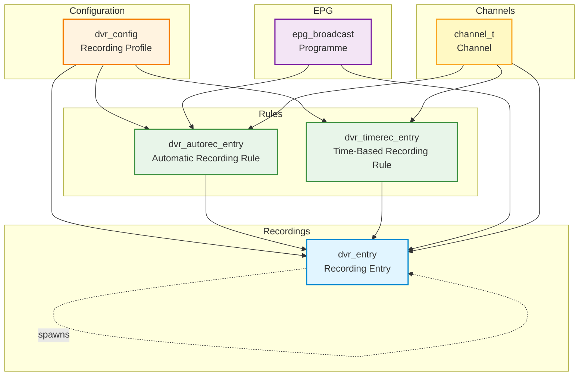
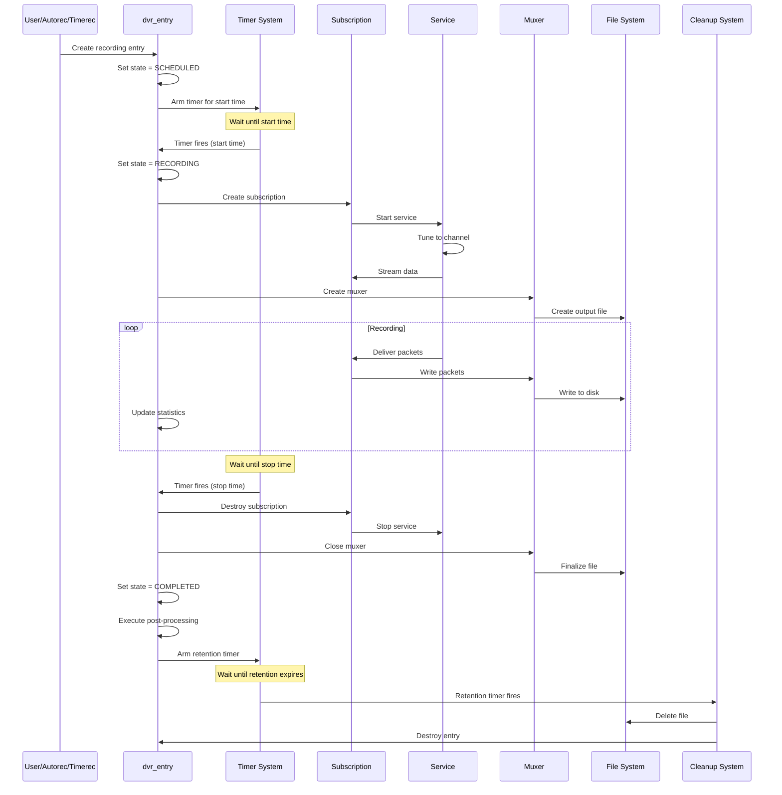
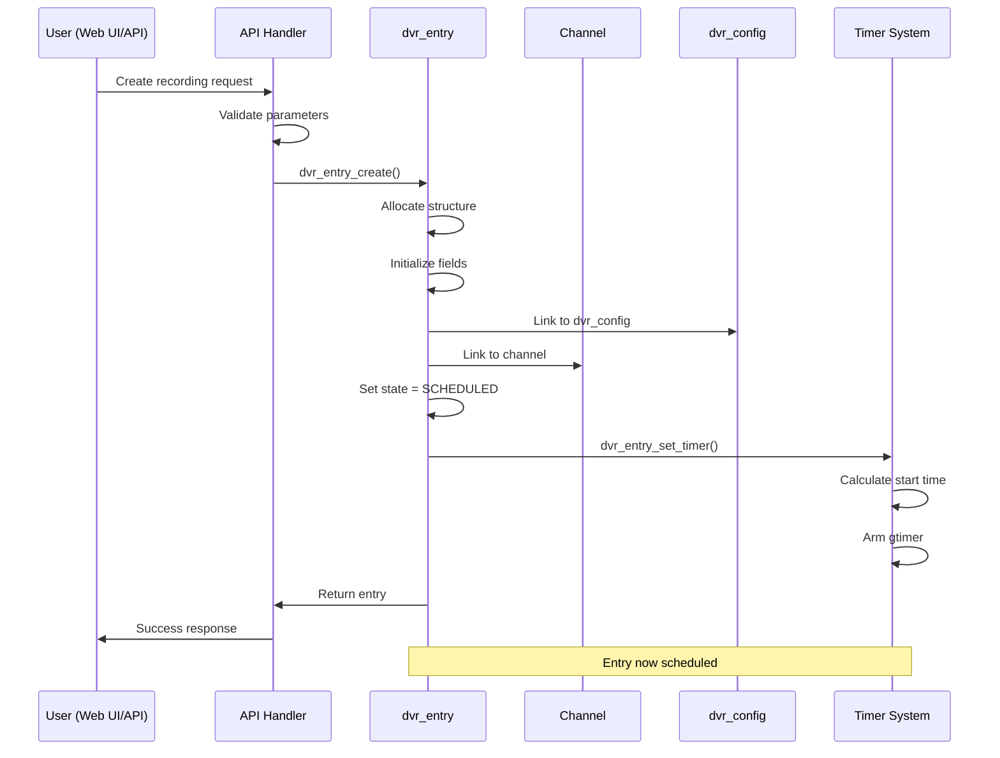
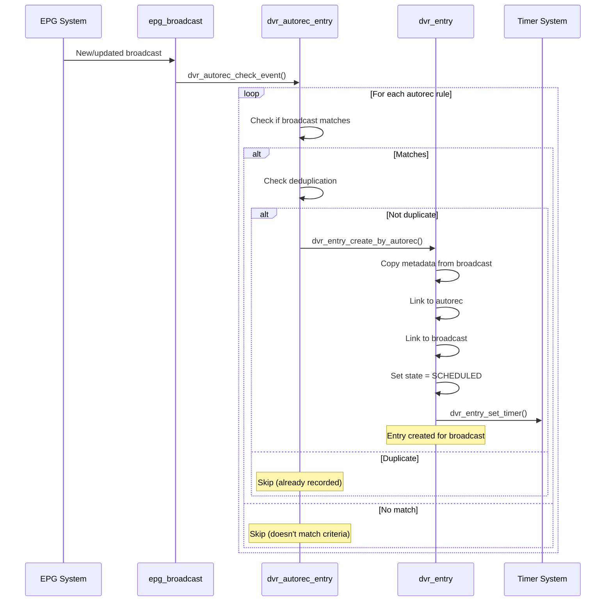
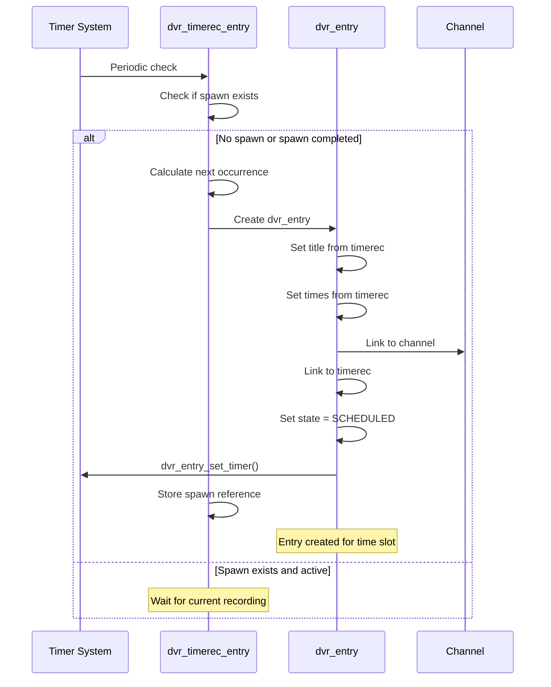
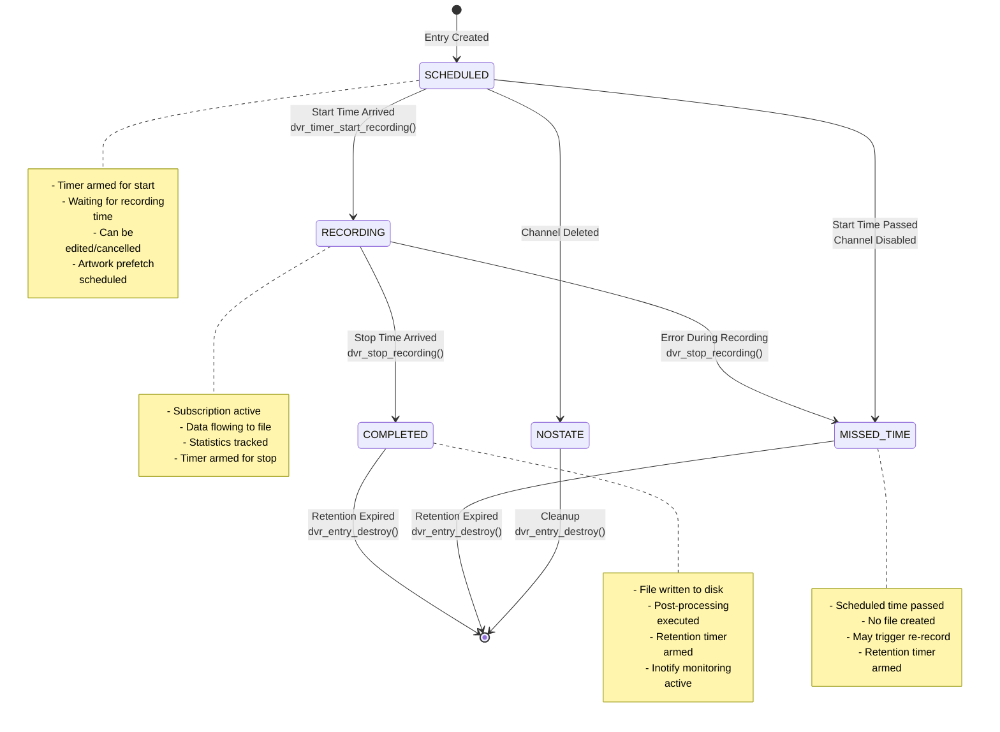

[← Back to Table of Contents](00-TOC.md)

## 12. DVR Subsystem

The DVR (Digital Video Recorder) Subsystem is responsible for managing all recording-related functionality in Tvheadend. It handles scheduled recordings, automatic recording rules based on EPG data, time-based recording rules, file management, and the complete recording lifecycle from scheduling through completion and retention. This section documents the DVR components, recording flow, configuration system, file management, and the relationship between DVR and the subscription system.

### 12.1 DVR Components

The DVR subsystem consists of four primary components that work together to provide comprehensive recording functionality. Each component serves a specific purpose in the recording workflow.

#### 12.1.1 dvr_config Structure

**Location**: `src/dvr/dvr.h`, `src/dvr/dvr_db.c`

The `dvr_config` structure represents a DVR configuration profile - a named set of recording parameters that can be applied to recordings. Multiple profiles allow different recording behaviors for different types of content or users.

**Structure Definition**:
```c
typedef struct dvr_config {
  idnode_t dvr_id;                              // Configuration node
  
  LIST_ENTRY(dvr_config) config_link;           // Link in global config list
  LIST_ENTRY(dvr_config) profile_link;          // Link in profile's config list
  
  // Basic configuration
  int dvr_enabled;                              // Profile enabled flag
  int dvr_valid;                                // Profile validity flag
  char *dvr_config_name;                        // Profile name
  char *dvr_comment;                            // User comment
  profile_t *dvr_profile;                       // Streaming/transcoding profile
  
  // Storage configuration
  char *dvr_storage;                            // Base storage directory
  int dvr_pri;                                  // Recording priority
  int dvr_clone;                                // Clone recordings flag
  int dvr_complex_scheduling;                   // Complex scheduling enabled
  
  // Error handling and retention
  uint32_t dvr_rerecord_errors;                 // Re-record threshold (error count)
  uint32_t dvr_retention_days;                  // Keep recordings for N days
  uint32_t dvr_removal_days;                    // Remove files after N days
  uint32_t dvr_removal_after_playback;          // Remove after playback count
  
  // Autorec limits
  uint32_t dvr_autorec_max_count;               // Max recordings per autorec
  uint32_t dvr_autorec_max_sched_count;         // Max scheduled per autorec
  
  // Character encoding
  char *dvr_charset;                            // Character set for filenames
  char *dvr_charset_id;                         // Character set ID
  
  // External scripts
  char *dvr_preproc;                            // Pre-processing script
  char *dvr_postproc;                           // Post-processing script
  char *dvr_postremove;                         // Post-removal script
  
  // Timing configuration
  uint32_t dvr_warm_time;                       // Warm-up time (seconds)
  uint32_t dvr_extra_time_pre;                  // Extra time before (minutes)
  uint32_t dvr_extra_time_post;                 // Extra time after (minutes)
  uint32_t dvr_update_window;                   // EPG update window (seconds)
  int dvr_running;                              // Use EPG running flag
  
  // Disk space management
  uint32_t dvr_cleanup_threshold_free;          // Min free space (MB)
  uint32_t dvr_cleanup_threshold_used;          // Max used space (%)
  
  // Artwork fetching
  int dvr_fetch_artwork;                        // Fetch artwork flag
  int dvr_fetch_artwork_allow_unknown;          // Allow unknown episodes
  char *dvr_fetch_artwork_options;              // Artwork fetch options
  
  // Muxer configuration
  muxer_config_t dvr_muxcnf;                    // Muxer settings
  
  // Filename formatting
  char *dvr_pathname;                           // Pathname format string
  int dvr_pathname_changed;                     // Pathname changed flag
  int dvr_dir_per_day;                          // Create directory per day
  int dvr_channel_dir;                          // Create channel directory
  int dvr_channel_in_title;                     // Include channel in title
  int dvr_omit_title;                           // Omit title from filename
  int dvr_date_in_title;                        // Include date in title
  int dvr_time_in_title;                        // Include time in title
  int dvr_whitespace_in_title;                  // Allow whitespace in title
  int dvr_title_dir;                            // Create title directory
  int dvr_episode_in_title;                     // Include episode in title
  int dvr_clean_title;                          // Clean title (remove special chars)
  int dvr_tag_files;                            // Tag files with metadata
  int dvr_create_scene_markers;                 // Create scene markers
  int dvr_skip_commercials;                     // Skip commercials flag
  int dvr_subtitle_in_title;                    // Include subtitle in title
  int dvr_windows_compatible_filenames;         // Windows-compatible names
  char *dvr_format_tvmovies_subdir;             // TV movies subdirectory format
  char *dvr_format_tvshows_subdir;              // TV shows subdirectory format
  
  // Entry lists
  struct dvr_entry_list dvr_entries;            // Recordings using this config
  struct dvr_autorec_entry_list dvr_autorec_entries;  // Autorecs using this config
  struct dvr_timerec_entry_list dvr_timerec_entries;  // Timerecs using this config
  
  // Access control
  idnode_list_head_t dvr_accesses;              // Access control entries
  
  // Deduplication
  int dvr_autorec_dedup;                        // Autorec deduplication mode
  
} dvr_config_t;
```

**Key Characteristics**:

1. **Profile-Based Configuration**: Multiple profiles allow different recording behaviors
   - Default profile for general recordings
   - Custom profiles for specific content types (movies, sports, news)
   - Per-user profiles with different storage locations

2. **Storage Management**: Comprehensive storage configuration
   - Base directory path
   - Subdirectory organization (by date, channel, title)
   - Filename formatting with variables
   - Windows compatibility options

3. **Retention Policies**: Flexible retention and removal
   - Retention: How long to keep database entry
   - Removal: When to delete actual files
   - Can differ (e.g., keep entry after file removed)
   - Special values: forever, on removal, until space needed

4. **Timing Control**: Pre/post recording padding
   - Warm-up time: Start tuner early
   - Extra time pre: Record before scheduled start
   - Extra time post: Record after scheduled end
   - Per-channel overrides available

5. **External Processing**: Script integration
   - Pre-processing: Before recording starts
   - Post-processing: After recording completes
   - Post-removal: After file deleted
   - Can be used for transcoding, notifications, cleanup

6. **Muxer Integration**: Container format configuration
   - Muxer type (Matroska, MPEG-TS, MP4, etc.)
   - Codec settings
   - Metadata inclusion
   - Subtitle handling

**Configuration Profiles**:

Tvheadend supports multiple DVR configuration profiles, allowing different recording behaviors:

```c
// Find profile by name
dvr_config_t *cfg = dvr_config_find_by_name("HD Recordings");

// Find default profile
dvr_config_t *cfg = dvr_config_find_by_name_default(NULL);

// Check if profile is default
if (dvr_config_is_default(cfg)) {
  // This is the default profile
}
```

**Common Profile Scenarios**:

1. **Default Profile**: General recordings
   - Standard retention (30 days)
   - Matroska container
   - 5 minutes pre/post padding
   - Standard storage location

2. **Archive Profile**: Long-term storage
   - Forever retention
   - High-quality settings
   - Separate storage location
   - Metadata tagging enabled

3. **Sports Profile**: Live events
   - Extended post-padding (30 minutes)
   - Quick removal (7 days)
   - Skip commercials enabled
   - Scene markers for highlights

4. **News Profile**: Daily recordings
   - Short retention (3 days)
   - Minimal padding
   - Automatic cleanup
   - Compressed format

**Filename Formatting**:

The `dvr_pathname` field supports variable substitution for flexible filename generation:

```
Variables:
  $t - Title
  $s - Subtitle (episode name)
  $e - Episode number
  $c - Channel name
  $d - Date (YYYY-MM-DD)
  $w - Day of week
  $y - Year
  $m - Month
  $n - Month name
  $h - Hour
  $M - Minute
  $u - Unique ID

Example formats:
  "$t/$t - $d.$x"           → "Show Name/Show Name - 2025-11-15.mkv"
  "$c/$t - S$sE$e.$x"       → "HBO/Game of Thrones - S01E01.mkv"
  "$y/$m/$d - $t.$x"        → "2025/11/15 - News.mkv"
```

#### 12.1.2 dvr_entry Structure

**Location**: `src/dvr/dvr.h`, `src/dvr/dvr_db.c`

The `dvr_entry` structure represents a single recording entry - either a scheduled recording, an in-progress recording, or a completed recording. This is the core data structure of the DVR subsystem.

**Structure Definition**:
```c
typedef struct dvr_entry {
  idnode_t de_id;                               // Configuration node
  
  int de_refcnt;                                // Reference count (atomic)
  int de_in_unsubscribe;                        // Unsubscribe in progress flag
  
  // Global linkage
  LIST_ENTRY(dvr_entry) de_global_link;         // Link in global entry list
  
  // Channel association
  channel_t *de_channel;                        // Channel (may be NULL)
  LIST_ENTRY(dvr_entry) de_channel_link;        // Link in channel's entry list
  char *de_channel_name;                        // Channel name (if channel deleted)
  
  // Timers
  gtimer_t de_timer;                            // Main timer (start/stop/expire)
  gtimer_t de_watched_timer;                    // Watched timer
  mtimer_t de_deferred_timer;                   // Deferred operations timer
  
  // Configuration
  dvr_config_t *de_config;                      // DVR configuration profile
  LIST_ENTRY(dvr_entry) de_config_link;         // Link in config's entry list
  
  // Basic properties
  int de_enabled;                               // Entry enabled flag
  time_t de_create;                             // Creation time
  time_t de_watched;                            // Last watched time
  time_t de_start;                              // Scheduled start time
  time_t de_stop;                               // Scheduled stop time
  
  // Timing adjustments
  time_t de_start_extra;                        // Extra time before (override)
  time_t de_stop_extra;                         // Extra time after (override)
  time_t de_segment_stop_extra;                 // Auto extra for segmented prog
  
  // Running time tracking
  time_t de_running_start;                      // Actual start time (EPG running)
  time_t de_running_stop;                       // Actual stop time (EPG running)
  time_t de_running_pause;                      // Pause time
  int de_running_change;                        // Running state changed flag
  
  // Ownership and metadata
  char *de_owner;                               // Owner username
  char *de_creator;                             // Creator (client/autorec)
  char *de_comment;                             // User comment
  char *de_uri;                                 // Programme unique ID (series link)
  char *de_image;                               // Programme image URL
  char *de_fanart_image;                        // Programme fanart URL
  htsmsg_t *de_files;                           // List of recorded files
  char *de_directory;                           // Override directory
  
  // Programme information
  lang_str_t *de_title;                         // Title (multilingual)
  lang_str_t *de_subtitle;                      // Subtitle/episode name
  lang_str_t *de_summary;                       // Short summary
  lang_str_t *de_desc;                          // Full description
  uint32_t de_content_type;                     // Content type code
  uint16_t de_copyright_year;                   // Copyright year
  uint16_t de_dvb_eid;                          // DVB event ID
  uint16_t de_age_rating;                       // Age rating
  
  // Rating labels (saved for historical accuracy)
  char *de_rating_label_saved;                  // Saved rating label
  char *de_rating_icon_saved;                   // Saved rating icon path
  char *de_rating_country_saved;                // Saved rating country
  char *de_rating_authority_saved;              // Saved rating authority
  ratinglabel_t *de_rating_label;               // Live rating label object
  
  // Recording configuration
  int de_pri;                                   // Priority
  int de_dont_reschedule;                       // Don't reschedule flag
  int de_dont_rerecord;                         // Don't re-record flag
  uint32_t de_file_removed;                     // File removed flag
  uint32_t de_retention;                        // Retention override (days)
  uint32_t de_removal;                          // Removal override (days)
  uint32_t de_playcount;                        // Play count
  uint32_t de_playposition;                     // Last play position (seconds)
  
  // EPG linkage
  LIST_ENTRY(dvr_entry) de_bcast_link;          // Link in broadcast's entry list
  epg_broadcast_t *de_bcast;                    // EPG broadcast
  epg_episode_num_t de_epnum;                   // Episode number
  
  // State tracking
  dvr_entry_sched_state_t de_sched_state;       // Scheduling state
  dvr_rs_state_t de_rec_state;                  // Recording state
  
  // Error tracking
  uint32_t de_errors;                           // Error count
  uint32_t de_data_errors;                      // Data error count
  uint32_t de_last_error;                       // Last error code
  
  // Autorec linkage
  LIST_ENTRY(dvr_entry) de_autorec_link;        // Link in autorec's entry list
  struct dvr_autorec_entry *de_autorec;         // Autorec that created this
  
  // Timerec linkage
  struct dvr_timerec_entry *de_timerec;         // Timerec that created this
  
  // Parent/child relationship
  struct dvr_entry *de_parent;                  // Parent entry (for clones)
  struct dvr_entry *de_child;                   // Child entry (for clones)
  
  // Recording thread
  pthread_t de_thread;                          // Recording thread
  int de_thread_shutdown;                       // Shutdown flag
  th_subscription_t *de_s;                      // Subscription
  profile_chain_t *de_chain;                    // Stream processing chain
  
  // Change notification
  int64_t de_last_notify;                       // Last notification time
  tvhlog_limit_t de_update_limit;               // Update rate limiter
  
} dvr_entry_t;
```

**Key Characteristics**:

1. **State Machine**: Tracks recording lifecycle
   - Scheduling state: SCHEDULED, RECORDING, COMPLETED, MISSED_TIME, NOSTATE
   - Recording state: PENDING, RUNNING, COMMERCIAL, ERROR, FINISHED
   - State transitions trigger actions (start recording, stop recording, cleanup)

2. **Reference Counting**: Safe memory management
   - `de_refcnt` tracks references
   - Entry becomes "zombie" when deleted but references exist
   - Prevents use-after-free in multi-threaded environment

3. **EPG Integration**: Links to EPG data
   - `de_bcast` points to EPG broadcast
   - Automatically updates when EPG changes
   - Tracks episode numbers for series
   - Handles programme running state

4. **Flexible Timing**: Multiple time sources
   - Scheduled times (`de_start`, `de_stop`)
   - Extra time adjustments (`de_start_extra`, `de_stop_extra`)
   - Running times from EPG (`de_running_start`, `de_running_stop`)
   - Automatic segment handling for multi-part programmes

5. **File Management**: Tracks recorded files
   - `de_files` contains list of file paths
   - Supports multi-file recordings (segments)
   - Tracks file removal state
   - Monitors file existence via inotify

6. **Metadata Preservation**: Historical accuracy
   - Saves rating labels at recording time
   - Preserves EPG data even if EPG changes
   - Maintains programme information for deleted channels
   - Stores artwork URLs

**Scheduling States**:

```c
typedef enum {
  DVR_SCHEDULED,         // Scheduled for future recording
  DVR_RECORDING,         // Currently recording
  DVR_COMPLETED,         // Recording completed
  DVR_NOSTATE,           // No state (disabled channel, etc.)
  DVR_MISSED_TIME,       // Missed scheduled time
} dvr_entry_sched_state_t;
```

**Recording States** (valid when `de_sched_state == DVR_RECORDING`):

```c
typedef enum {
  DVR_RS_PENDING,                // Waiting for stream
  DVR_RS_WAIT_PROGRAM_START,     // Waiting for programme start
  DVR_RS_RUNNING,                // Recording in progress
  DVR_RS_COMMERCIAL,             // Commercial break
  DVR_RS_ERROR,                  // Error occurred
  DVR_RS_EPG_WAIT,               // Waiting for EPG running flag
  DVR_RS_FINISHED                // Recording finished
} dvr_rs_state_t;
```

**Priority Levels**:

```c
typedef enum {
  DVR_PRIO_IMPORTANT   = 0,      // Highest priority
  DVR_PRIO_HIGH        = 1,
  DVR_PRIO_NORMAL      = 2,      // Default
  DVR_PRIO_LOW         = 3,
  DVR_PRIO_UNIMPORTANT = 4,      // Lowest priority
  DVR_PRIO_NOTSET      = 5,      // Not set (use config default)
  DVR_PRIO_DEFAULT     = 6,      // Use default
} dvr_prio_t;
```

**Entry Operations**:

```c
// Find entry by ID
dvr_entry_t *de = dvr_entry_find_by_id(123);

// Find entry by UUID
dvr_entry_t *de = dvr_entry_find_by_uuid("a1b2c3d4-...");

// Check if entry is editable
if (dvr_entry_is_editable(de)) {
  // Can modify scheduled recording
}

// Check if entry is valid
if (dvr_entry_is_valid(de)) {
  // Entry has references, safe to use
}

// Check if entry is upcoming
if (dvr_entry_is_upcoming(de)) {
  // Entry is scheduled or recording
}

// Check if entry is finished
if (dvr_entry_is_finished(de, DVR_FINISHED_SUCCESS)) {
  // Entry completed successfully
}
```

**Status Reporting**:

```c
// Get human-readable status
const char *status = dvr_entry_status(de);
// Returns: "Scheduled for recording", "Running", "Completed OK", etc.

// Get schedule status for UI
const char *schedstatus = dvr_entry_schedstatus(de);
// Returns: "scheduled", "recording", "completed", "completedError", etc.

// Get state strings
const char *sched_state = dvr_entry_sched_state2str(de->de_sched_state);
const char *rec_state = dvr_entry_rs_state2str(de->de_rec_state);
```


#### 12.1.3 dvr_autorec_entry Structure

**Location**: `src/dvr/dvr.h`, `src/dvr/dvr_db.c`

The `dvr_autorec_entry` structure represents an automatic recording rule that creates recording entries based on EPG data. Autorec rules enable series recording, keyword-based recording, and other automated recording scenarios.

**Structure Definition**:
```c
typedef struct dvr_autorec_entry {
  idnode_t dae_id;                              // Configuration node
  
  TAILQ_ENTRY(dvr_autorec_entry) dae_link;      // Link in global autorec list
  
  // Basic configuration
  char *dae_name;                               // Rule name
  char *dae_directory;                          // Override directory
  dvr_config_t *dae_config;                     // DVR configuration profile
  LIST_ENTRY(dvr_autorec_entry) dae_config_link;  // Link in config's autorec list
  
  int dae_enabled;                              // Rule enabled flag
  int dae_error;                                // Error flag
  char *dae_owner;                              // Owner username
  char *dae_creator;                            // Creator (user/system)
  char *dae_comment;                            // User comment
  
  // Matching criteria
  char *dae_title;                              // Title pattern
  tvh_regex_t dae_title_regex;                  // Compiled regex
  int dae_fulltext;                             // Full-text search flag
  uint32_t dae_content_type;                    // Content type filter
  
  // Category filters
  char *dae_cat1;                               // Category 1 (e.g., "Movie")
  char *dae_cat2;                               // Category 2 (e.g., "Action")
  char *dae_cat3;                               // Category 3 (e.g., "Thriller")
  uint16_t dae_star_rating;                     // Minimum star rating
  
  // Time window
  int dae_start;                                // Start time (minutes from midnight)
  int dae_start_window;                         // Time window (minutes)
  uint32_t dae_weekdays;                        // Weekday mask (bit 0 = Monday)
  
  // Channel filters
  channel_t *dae_channel;                       // Specific channel
  LIST_ENTRY(dvr_autorec_entry) dae_channel_link;  // Link in channel's autorec list
  channel_tag_t *dae_channel_tag;               // Channel tag (group)
  LIST_ENTRY(dvr_autorec_entry) dae_channel_tag_link;  // Link in tag's autorec list
  
  // Recording configuration
  int dae_pri;                                  // Priority
  struct dvr_entry_list dae_spawns;             // Created entries
  
  // Series link
  const char *dae_serieslink_uri;               // Series link URI
  epg_episode_num_t dae_epnum;                  // Episode number filter
  
  // Duration filters
  int dae_minduration;                          // Minimum duration (seconds)
  int dae_maxduration;                          // Maximum duration (seconds)
  
  // Year filters
  int dae_minyear;                              // Minimum year
  int dae_maxyear;                              // Maximum year
  
  // Season filters
  int dae_minseason;                            // Minimum season
  int dae_maxseason;                            // Maximum season
  
  // Retention and removal
  uint32_t dae_retention;                       // Retention override (days)
  uint32_t dae_removal;                         // Removal override (days)
  
  // Broadcast type filter
  uint32_t dae_btype;                           // Broadcast type (new/repeat/all)
  
  // Limits
  uint32_t dae_max_count;                       // Max total recordings
  uint32_t dae_max_sched_count;                 // Max scheduled recordings
  
  // Timing overrides
  time_t dae_start_extra;                       // Extra time before
  time_t dae_stop_extra;                        // Extra time after
  
  // Deduplication mode
  int dae_record;                               // Deduplication mode
  
} dvr_autorec_entry_t;
```

**Key Characteristics**:

1. **Pattern Matching**: Flexible matching criteria
   - Title regex matching
   - Full-text search across title/subtitle/description
   - Content type filtering
   - Category filtering (genre, subgenre)
   - Star rating threshold

2. **Time-Based Filtering**: Control when to record
   - Time window (e.g., 20:00-22:00)
   - Weekday selection (e.g., Monday-Friday only)
   - Duration limits (e.g., 30-120 minutes)

3. **Channel Filtering**: Limit to specific channels
   - Single channel
   - Channel tag (group of channels)
   - All channels (if both NULL)

4. **Series Recording**: Episode tracking
   - Series link URI matching
   - Episode number filtering
   - Season filtering
   - Deduplication to avoid repeats

5. **Deduplication Modes**: Avoid duplicate recordings
   - Record all matches
   - Record unique episodes only
   - Record different episode numbers
   - Record different subtitles
   - Record once per day/week/month
   - Local vs. global deduplication

**Deduplication Modes**:

```c
typedef enum {
  DVR_AUTOREC_RECORD_ALL = 0,                           // Record all matches
  DVR_AUTOREC_RECORD_UNIQUE = 14,                       // Unique episode (EPG/XMLTV)
  DVR_AUTOREC_RECORD_DIFFERENT_EPISODE_NUMBER = 1,      // Different episode number
  DVR_AUTOREC_RECORD_DIFFERENT_SUBTITLE = 2,            // Different subtitle
  DVR_AUTOREC_RECORD_DIFFERENT_DESCRIPTION = 3,         // Different description
  DVR_AUTOREC_RECORD_ONCE_PER_MONTH = 12,               // Once per month
  DVR_AUTOREC_RECORD_ONCE_PER_WEEK = 4,                 // Once per week
  DVR_AUTOREC_RECORD_ONCE_PER_DAY = 5,                  // Once per day
  DVR_AUTOREC_LRECORD_DIFFERENT_EPISODE_NUMBER = 6,     // Local: different episode
  DVR_AUTOREC_LRECORD_DIFFERENT_TITLE = 7,              // Local: different title
  DVR_AUTOREC_LRECORD_DIFFERENT_SUBTITLE = 8,           // Local: different subtitle
  DVR_AUTOREC_LRECORD_DIFFERENT_DESCRIPTION = 9,        // Local: different description
  DVR_AUTOREC_LRECORD_ONCE_PER_MONTH = 13,              // Local: once per month
  DVR_AUTOREC_LRECORD_ONCE_PER_WEEK = 10,               // Local: once per week
  DVR_AUTOREC_LRECORD_ONCE_PER_DAY = 11,                // Local: once per day
  DVR_AUTOREC_RECORD_DVR_PROFILE = 15,                  // Use DVR profile dedup
} dvr_autorec_dedup_t;
```

**Broadcast Type Filter**:

```c
typedef enum {
  DVR_AUTOREC_BTYPE_ALL = 0,                    // All broadcasts
  DVR_AUTOREC_BTYPE_NEW_OR_UNKNOWN = 1,         // New or unknown
  DVR_AUTOREC_BTYPE_REPEAT = 2,                 // Repeats only
  DVR_AUTOREC_BTYPE_NEW = 3,                    // New only
} dvr_autorec_btype_t;
```

**Autorec Operations**:

```c
// Create autorec from EPG broadcast (series link)
dvr_autorec_entry_t *dae = dvr_autorec_add_series_link(
  "Default",           // DVR config name
  broadcast,           // EPG broadcast
  "user",              // Owner
  "Kodi",              // Creator
  "Auto-created"       // Comment
);

// Check if broadcast matches autorec
if (dvr_autorec_cmp(dae, broadcast)) {
  // Broadcast matches this autorec rule
}

// Check EPG broadcast against all autorecs
dvr_autorec_check_event(broadcast);

// Update all autorec timers
dvr_autorec_update();
```

**Matching Logic**:

The autorec matching algorithm evaluates broadcasts against all enabled autorec rules:

1. **Title Match**: Regex or substring match
2. **Channel Match**: Specific channel or tag
3. **Time Window**: Within time range and weekdays
4. **Content Type**: Matches content type filter
5. **Categories**: Matches category filters
6. **Duration**: Within min/max duration
7. **Year**: Within min/max year
8. **Season**: Within min/max season
9. **Star Rating**: Meets minimum rating
10. **Broadcast Type**: Matches new/repeat filter
11. **Deduplication**: Not a duplicate based on dedup mode

If all criteria match, a `dvr_entry` is created for the broadcast.

#### 12.1.4 dvr_timerec_entry Structure

**Location**: `src/dvr/dvr.h`, `src/dvr/dvr_db.c`

The `dvr_timerec_entry` structure represents a time-based recording rule that creates recordings at specific times regardless of EPG data. Timerec rules are useful for recording time slots (e.g., news at 6 PM daily) or when EPG data is unavailable.

**Structure Definition**:
```c
typedef struct dvr_timerec_entry {
  idnode_t dte_id;                              // Configuration node
  
  TAILQ_ENTRY(dvr_timerec_entry) dte_link;      // Link in global timerec list
  
  // Basic configuration
  char *dte_name;                               // Rule name
  char *dte_directory;                          // Override directory
  dvr_config_t *dte_config;                     // DVR configuration profile
  LIST_ENTRY(dvr_timerec_entry) dte_config_link;  // Link in config's timerec list
  
  int dte_enabled;                              // Rule enabled flag
  char *dte_owner;                              // Owner username
  char *dte_creator;                            // Creator (user/system)
  char *dte_comment;                            // User comment
  
  // Recording title
  char *dte_title;                              // Recording title
  
  // Time configuration
  int dte_start;                                // Start time (minutes from midnight)
  int dte_stop;                                 // Stop time (minutes from midnight)
  uint32_t dte_weekdays;                        // Weekday mask (bit 0 = Monday)
  
  // Channel
  channel_t *dte_channel;                       // Channel to record
  LIST_ENTRY(dvr_timerec_entry) dte_channel_link;  // Link in channel's timerec list
  
  // Recording configuration
  int dte_pri;                                  // Priority
  dvr_entry_t *dte_spawn;                       // Created entry
  
  // Retention and removal
  uint32_t dte_retention;                       // Retention override (days)
  uint32_t dte_removal;                         // Removal override (days)
  
} dvr_timerec_entry_t;
```

**Key Characteristics**:

1. **Time-Based**: Records at specific times
   - Start and stop times (minutes from midnight)
   - Weekday selection
   - No EPG dependency

2. **Simple Configuration**: Minimal setup
   - Channel selection
   - Time range
   - Title for recording
   - Weekday pattern

3. **Single Entry**: Creates one entry at a time
   - `dte_spawn` points to current entry
   - New entry created when previous completes
   - Automatic rescheduling

4. **Use Cases**:
   - Recording time slots without EPG
   - News programmes at fixed times
   - Radio shows
   - Backup recording when EPG unreliable

**Timerec Operations**:

```c
// Create timerec entry
dvr_timerec_entry_t *dte = dvr_timerec_create(uuid, conf);

// Check timerec and create entry if needed
dvr_timerec_check(dte);

// Update all timerec timers
dvr_timerec_update();
```

**Scheduling Logic**:

Timerec entries are evaluated periodically:

1. **Check Current Entry**: If `dte_spawn` exists and is completed, clear it
2. **Calculate Next Time**: Find next occurrence based on weekdays and time
3. **Create Entry**: Create `dvr_entry` for next occurrence
4. **Set Timer**: Arm timer for next check

**Weekday Mask**:

```c
// Weekday bits (bit 0 = Monday, bit 6 = Sunday)
#define WEEKDAY_MONDAY    (1 << 0)
#define WEEKDAY_TUESDAY   (1 << 1)
#define WEEKDAY_WEDNESDAY (1 << 2)
#define WEEKDAY_THURSDAY  (1 << 3)
#define WEEKDAY_FRIDAY    (1 << 4)
#define WEEKDAY_SATURDAY  (1 << 5)
#define WEEKDAY_SUNDAY    (1 << 6)

// Example: Monday-Friday
uint32_t weekdays = WEEKDAY_MONDAY | WEEKDAY_TUESDAY | WEEKDAY_WEDNESDAY |
                    WEEKDAY_THURSDAY | WEEKDAY_FRIDAY;

// Example: Weekends only
uint32_t weekdays = WEEKDAY_SATURDAY | WEEKDAY_SUNDAY;

// Example: Every day
uint32_t weekdays = 0x7F;  // All 7 bits set
```

**Comparison with Autorec**:

| Feature | Autorec | Timerec |
|---------|---------|---------|
| **Trigger** | EPG data | Time-based |
| **Matching** | Complex (title, genre, etc.) | Simple (time + channel) |
| **Entries** | Multiple (one per match) | Single (one at a time) |
| **EPG Dependency** | Required | Not required |
| **Use Case** | Series recording, keyword matching | Fixed time slots |
| **Deduplication** | Yes | No |
| **Flexibility** | High | Low |

**Example Scenarios**:

1. **Daily News**:
   ```
   Title: "Evening News"
   Channel: BBC One
   Start: 18:00 (1080 minutes)
   Stop: 18:30 (1110 minutes)
   Weekdays: Monday-Friday
   ```

2. **Weekly Show**:
   ```
   Title: "Sunday Sports"
   Channel: ESPN
   Start: 14:00 (840 minutes)
   Stop: 17:00 (1020 minutes)
   Weekdays: Sunday only
   ```

3. **Radio Programme**:
   ```
   Title: "Morning Show"
   Channel: Radio 1
   Start: 06:00 (360 minutes)
   Stop: 09:00 (540 minutes)
   Weekdays: Every day
   ```

#### 12.1.5 Component Relationships

The four DVR components work together to provide comprehensive recording functionality:



**Relationship Summary**:

1. **dvr_config → dvr_entry**: Configuration profile applied to recordings
2. **dvr_config → dvr_autorec_entry**: Configuration profile for autorec rules
3. **dvr_config → dvr_timerec_entry**: Configuration profile for timerec rules
4. **dvr_autorec_entry → dvr_entry**: Autorec creates entries based on EPG
5. **dvr_timerec_entry → dvr_entry**: Timerec creates entries based on time
6. **epg_broadcast → dvr_entry**: Entry links to EPG programme
7. **epg_broadcast → dvr_autorec_entry**: Autorec matches against broadcasts
8. **channel_t → dvr_entry**: Entry records from channel
9. **channel_t → dvr_autorec_entry**: Autorec filters by channel
10. **channel_t → dvr_timerec_entry**: Timerec records from channel
11. **dvr_entry → dvr_entry**: Parent/child relationship for clones

**Data Flow**:

```
1. User creates autorec rule
   → dvr_autorec_entry created
   → Linked to dvr_config

2. EPG data arrives
   → epg_broadcast created
   → dvr_autorec_check_event() called
   → Autorec rules evaluated

3. Broadcast matches autorec
   → dvr_entry created
   → Linked to autorec, config, channel, broadcast
   → Timer armed for recording start

4. Recording time arrives
   → Subscription created
   → Recording starts
   → Data written to file

5. Recording completes
   → Subscription destroyed
   → Entry state updated
   → Retention timer armed

6. Retention expires
   → File deleted
   → Entry removed from database
```

### 12.2 DVR Recording Flow

The DVR recording flow describes the complete lifecycle of a recording from creation through completion and cleanup. Understanding this flow is essential for debugging recording issues and implementing new DVR features.

#### 12.2.1 Recording Lifecycle Diagram



#### 12.2.2 Entry Creation Flow

**Manual Entry Creation**:



**Autorec Entry Creation**:



**Timerec Entry Creation**:



### 12.3 Recording Lifecycle

The recording lifecycle describes the detailed state transitions and operations that occur during a recording's lifetime.

#### 12.3.1 Lifecycle States and Transitions

**State Transition Diagram**:



#### 12.3.2 Entry Creation

**Creation Methods**:

1. **Manual Creation** (`dvr_entry_create()`):
   - User creates via web UI or API
   - Specifies channel, time, title
   - Optional EPG broadcast link

2. **Autorec Creation** (`dvr_entry_create_by_autorec()`):
   - Triggered by EPG broadcast matching autorec rule
   - Metadata copied from EPG
   - Linked to autorec and broadcast

3. **Timerec Creation** (`dvr_timerec_check()`):
   - Triggered by time-based rule
   - Title from timerec rule
   - No EPG dependency

4. **Clone Creation** (`dvr_entry_clone()`):
   - Duplicate of existing entry
   - Used for re-recording
   - Parent/child relationship

**Creation Process**:

```c
// 1. Allocate and initialize structure
dvr_entry_t *de = calloc(1, sizeof(*de));
idnode_insert(&de->de_id, uuid, &dvr_entry_class, IDNODE_SHORT_UUID);

// 2. Set basic properties
de->de_enabled = 1;
de->de_create = gclk();
de->de_start = start_time;
de->de_stop = stop_time;
de->de_pri = DVR_PRIO_NORMAL;

// 3. Link to configuration
de->de_config = dvr_config_find_by_name_default(config_name);
LIST_INSERT_HEAD(&de->de_config->dvr_entries, de, de_config_link);

// 4. Link to channel
de->de_channel = channel;
LIST_INSERT_HEAD(&channel->ch_dvr_entries, de, de_channel_link);

// 5. Copy metadata (if from EPG)
if (broadcast) {
  de->de_bcast = broadcast;
  de->de_title = lang_str_copy(broadcast->title);
  de->de_subtitle = lang_str_copy(broadcast->subtitle);
  // ... copy other fields
}

// 6. Insert into global list
LIST_INSERT_HEAD(&dvrentries, de, de_global_link);

// 7. Set initial state and timer
dvr_entry_set_state(de, DVR_SCHEDULED, DVR_RS_PENDING, SM_CODE_OK);
dvr_entry_set_timer(de);

// 8. Notify clients
dvr_entry_changed(de);
```

#### 12.3.3 Scheduling Phase

**Timer Management**:

When an entry is in SCHEDULED state, a timer is armed for the recording start time:

```c
void dvr_entry_set_timer(dvr_entry_t *de)
{
  time_t now = gclk();
  time_t start = dvr_entry_get_start_time(de, 1);  // Include warm-up time
  time_t stop = dvr_entry_get_stop_time(de);
  
  if (now >= stop || de->de_dont_reschedule) {
    // Time has passed, mark as missed or completed
    if (htsmsg_is_empty(de->de_files) && !de->de_dont_reschedule)
      dvr_entry_missed_time(de, de->de_last_error);
    else
      dvr_entry_completed(de, de->de_last_error);
  } else if (de->de_channel && de->de_channel->ch_enabled) {
    // Schedule for recording
    dvr_entry_set_state(de, DVR_SCHEDULED, DVR_RS_PENDING, de->de_last_error);
    gtimer_arm_absn(&de->de_timer, dvr_timer_start_recording, de, start);
  } else {
    // Channel disabled, set to NOSTATE
    dvr_entry_nostate(de, de->de_last_error);
  }
}
```

**Start Time Calculation**:

```c
time_t dvr_entry_get_start_time(dvr_entry_t *de, int warm)
{
  int64_t extra_pre = dvr_entry_get_extra_time_pre(de);
  int64_t warm_time = warm ? dvr_entry_warm_time(de) : 0;
  
  if (de->de_start < (extra_pre + warm_time))
    return 0;
  
  return de->de_start - extra_pre - warm_time;
}
```

**Extra Time Sources** (priority order):
1. Entry-specific override (`de_start_extra`, `de_stop_extra`)
2. Channel-specific setting (`ch_dvr_extra_time_pre`, `ch_dvr_extra_time_post`)
3. Configuration default (`dvr_extra_time_pre`, `dvr_extra_time_post`)

**Warm-Up Time**:
- Starts tuner early to ensure lock before recording
- Typically 30-60 seconds
- Configurable per DVR profile
- Not included in recorded file

#### 12.3.4 Recording Start

**Start Sequence**:

```c
static void dvr_timer_start_recording(void *aux)
{
  dvr_entry_t *de = aux;
  
  // 1. Check if still valid
  if (!de->de_enabled || !de->de_channel || !de->de_channel->ch_enabled) {
    dvr_entry_missed_time(de, SM_CODE_SVC_NOT_ENABLED);
    return;
  }
  
  // 2. Check disk space
  if (!dvr_vfs_rec_start_check(de->de_config)) {
    dvr_entry_missed_time(de, SM_CODE_NO_SPACE);
    return;
  }
  
  // 3. Execute pre-processing script
  if (de->de_config->dvr_preproc)
    dvr_spawn_cmd(de, de->de_config->dvr_preproc, NULL, 1);
  
  // 4. Start recording
  dvr_entry_start_recording(de, 0);
}
```

**Recording Thread Creation**:

```c
static void dvr_entry_start_recording(dvr_entry_t *de, int clone)
{
  // 1. Update state
  dvr_entry_set_state(de, DVR_RECORDING, DVR_RS_PENDING, SM_CODE_OK);
  
  // 2. Create recording thread
  de->de_thread_shutdown = 0;
  tvh_thread_create(&de->de_thread, NULL, dvr_thread, de, "dvr");
  
  // 3. Arm stop timer
  time_t stop = dvr_entry_get_stop_time(de);
  gtimer_arm_absn(&de->de_timer, dvr_timer_stop_recording, de, stop);
}
```

**Recording Thread** (`dvr_thread()`):

```c
static void *dvr_thread(void *aux)
{
  dvr_entry_t *de = aux;
  
  // 1. Create subscription
  de->de_s = subscription_create_from_channel(
    de->de_channel,
    dvr_entry_get_weight(de),
    "DVR",
    SUBSCRIPTION_PACKET | SUBSCRIPTION_STREAMING,
    NULL,  // hostname
    de->de_owner,
    "dvr",
    NULL   // profile
  );
  
  if (!de->de_s) {
    dvr_entry_set_state(de, DVR_RECORDING, DVR_RS_ERROR, SM_CODE_NO_FREE_ADAPTER);
    return NULL;
  }
  
  // 2. Create profile chain (muxer, transcoder, etc.)
  de->de_chain = profile_chain_create(
    de->de_config->dvr_profile,
    de,
    &dvr_profile_class
  );
  
  // 3. Connect subscription to profile chain
  streaming_target_connect(&de->de_s->ths_input, &de->de_chain->prch_st);
  
  // 4. Wait for recording to complete
  while (!de->de_thread_shutdown) {
    tvh_cond_wait(&de->de_cond, &global_lock);
  }
  
  // 5. Cleanup
  profile_chain_close(de->de_chain);
  subscription_unsubscribe(de->de_s, UNSUBSCRIBE_FINAL);
  de->de_s = NULL;
  
  return NULL;
}
```

#### 12.3.5 Recording Phase

**Data Flow During Recording**:

```
Channel → Service → Subscription → Profile Chain → Muxer → File

1. Service delivers packets via streaming pad
2. Subscription receives packets via streaming target
3. Profile chain processes packets (optional transcoding)
4. Muxer writes packets to file
5. Statistics updated
```

**Recording States** (within DVR_RECORDING):

1. **DVR_RS_PENDING**: Waiting for stream to start
   - Subscription created
   - Waiting for service to deliver packets
   - Grace period active

2. **DVR_RS_WAIT_PROGRAM_START**: Waiting for programme start
   - EPG running flag not yet set
   - Recording will start when programme begins
   - Used when `dvr_running` enabled

3. **DVR_RS_RUNNING**: Recording in progress
   - Packets flowing to file
   - Statistics being tracked
   - Normal recording state

4. **DVR_RS_COMMERCIAL**: Commercial break
   - Optional state for commercial detection
   - Can skip commercials if configured
   - Returns to RUNNING after break

5. **DVR_RS_ERROR**: Error occurred
   - Subscription failed
   - Service unavailable
   - Disk error
   - Will retry or stop based on error

6. **DVR_RS_EPG_WAIT**: Waiting for EPG running flag
   - Similar to WAIT_PROGRAM_START
   - Monitoring EPG for programme start

7. **DVR_RS_FINISHED**: Recording finished
   - Stop time reached
   - Finalizing file
   - About to transition to COMPLETED

**Error Tracking**:

```c
// Errors tracked during recording
de->de_errors++;              // Total errors (tuning, service, etc.)
de->de_data_errors++;         // Data errors (continuity, transport)
de->de_last_error = error_code;  // Most recent error code

// Error threshold check
uint32_t threshold = dvr_entry_get_rerecord_errors(de);
if (threshold && de->de_data_errors > threshold) {
  // Too many errors, may trigger re-record
}
```

#### 12.3.6 Recording Stop

**Stop Sequence**:

```c
void dvr_stop_recording(dvr_entry_t *de, int stopcode, int saveconf, int clone)
{
  // 1. Signal recording thread to stop
  de->de_thread_shutdown = 1;
  tvh_cond_signal(&de->de_cond, 0);
  
  // 2. Wait for thread to exit
  pthread_join(de->de_thread, NULL);
  
  // 3. Update state
  if (stopcode == SM_CODE_OK && dvr_get_filesize(de, 0) > 0)
    dvr_entry_completed(de, stopcode);
  else
    dvr_entry_missed_time(de, stopcode);
  
  // 4. Execute post-processing
  if (de->de_config->dvr_postproc) {
    const char *filename = dvr_get_filename(de);
    dvr_spawn_cmd(de, de->de_config->dvr_postproc, filename, 0);
  }
  
  // 5. Save configuration
  if (saveconf)
    idnode_changed(&de->de_id);
  
  // 6. Handle cloning if needed
  if (clone && should_clone(de))
    dvr_entry_clone(de);
}
```

**File Finalization**:

```c
// Muxer closes file
muxer_close(muxer);

// Add file to entry's file list
htsmsg_t *files = de->de_files ?: htsmsg_create_list();
htsmsg_t *file = htsmsg_create_map();
htsmsg_add_str(file, "filename", filename);
htsmsg_add_s64(file, "size", filesize);
htsmsg_add_s64(file, "start", start_time);
htsmsg_add_s64(file, "stop", stop_time);
htsmsg_add_msg(files, NULL, file);
de->de_files = files;
```

#### 12.3.7 Completion and Cleanup

**Completion State**:

```c
static int dvr_entry_completed(dvr_entry_t *de, int error_code)
{
  // 1. Set state
  dvr_entry_set_state(de, DVR_COMPLETED, DVR_RS_FINISHED, error_code);
  
  // 2. Add to inotify monitoring
  #if ENABLE_INOTIFY
  dvr_inotify_add(de);
  #endif
  
  // 3. Arm retention timer
  dvr_entry_retention_timer(de);
  
  // 4. Notify autorec
  if (de->de_autorec)
    dvr_autorec_completed(de->de_autorec, error_code);
  
  return 1;
}
```

**Retention Timer**:

```c
static void dvr_entry_retention_timer(dvr_entry_t *de)
{
  time_t stop = de->de_stop;
  uint32_t removal = dvr_entry_get_removal_days(de);
  uint32_t retention = dvr_entry_get_retention_days(de);
  
  // File removal timer
  if (removal > 0 && removal < DVR_REM_SPACE && dvr_get_filesize(de, 0) > 0) {
    stop = de->de_stop + (removal * 86400);
    if (stop > gclk()) {
      gtimer_arm_absn(&de->de_timer, dvr_timer_remove_files, de, stop);
      return;
    }
    dvr_entry_delete(de);  // Delete file now
  }
  
  // Database entry removal timer
  if (retention < DVR_RET_ONREMOVE) {
    stop = de->de_stop + (retention * 86400);
    gtimer_arm_absn(&de->de_timer, dvr_timer_expire, de, stop);
  }
}
```

**File Removal**:

```c
static void dvr_timer_remove_files(void *aux)
{
  dvr_entry_t *de = aux;
  
  // Delete actual file
  if (dvr_get_filename(de))
    dvr_entry_delete(de);
  
  // Check if database entry should also be removed
  if (dvr_entry_delete_retention_expired(de))
    dvr_entry_deferred_destroy(de);
  else
    dvr_entry_retention_timer(de);  // Re-arm for database removal
}
```

**Entry Destruction**:

```c
void dvr_entry_destroy(dvr_entry_t *de, int delconf)
{
  // 1. Disarm timers
  gtimer_disarm(&de->de_timer);
  gtimer_disarm(&de->de_watched_timer);
  mtimer_disarm(&de->de_deferred_timer);
  
  // 2. Remove from lists
  LIST_REMOVE(de, de_global_link);
  if (de->de_channel)
    LIST_REMOVE(de, de_channel_link);
  if (de->de_config)
    LIST_REMOVE(de, de_config_link);
  if (de->de_autorec)
    LIST_REMOVE(de, de_autorec_link);
  if (de->de_bcast)
    LIST_REMOVE(de, de_bcast_link);
  
  // 3. Remove from inotify
  #if ENABLE_INOTIFY
  dvr_inotify_del(de);
  #endif
  
  // 4. Delete configuration
  if (delconf)
    hts_settings_remove("dvr/log/%s", idnode_uuid_as_str(&de->de_id, ubuf));
  
  // 5. Free resources
  lang_str_destroy(de->de_title);
  lang_str_destroy(de->de_subtitle);
  lang_str_destroy(de->de_summary);
  lang_str_destroy(de->de_desc);
  htsmsg_destroy(de->de_files);
  free(de->de_owner);
  free(de->de_creator);
  free(de->de_comment);
  // ... free other fields
  
  // 6. Free structure
  free(de);
}
```


### 12.4 DVR Configuration System

The DVR configuration system provides flexible control over recording behavior through profiles, allowing different settings for different types of content or users.

#### 12.4.1 Configuration Profiles

**Profile Management**:

```c
// Find profile by name
dvr_config_t *cfg = dvr_config_find_by_name("HD Recordings");

// Find default profile
dvr_config_t *cfg = dvr_config_find_by_name_default(NULL);

// Create new profile
dvr_config_t *cfg = dvr_config_create("Sports", uuid, conf);

// Delete profile
dvr_config_delete("Old Profile");

// Check if profile is valid
if (dvr_config_is_valid(cfg)) {
  // Profile is properly configured
}
```

**Profile Hierarchy**:

1. **Default Profile**: Used when no specific profile selected
   - Always exists
   - Cannot be deleted
   - Provides fallback settings

2. **Custom Profiles**: User-defined profiles
   - Named profiles for specific purposes
   - Can override any setting
   - Can be assigned to autorec/timerec rules

3. **Profile Inheritance**: Settings cascade
   - Entry-specific overrides
   - Channel-specific overrides
   - Profile defaults
   - System defaults

#### 12.4.2 Storage Path Configuration

**Base Storage Directory**:

```c
// Set in dvr_config
cfg->dvr_storage = "/mnt/recordings";
```

**Directory Organization Options**:

1. **Flat Structure**: All files in base directory
   ```
   /mnt/recordings/
     ├─ Show Name - 2025-11-15.mkv
     ├─ Movie Title - 2025-11-16.mkv
     └─ News - 2025-11-17.mkv
   ```

2. **Directory Per Day** (`dvr_dir_per_day`):
   ```
   /mnt/recordings/
     ├─ 2025-11-15/
     │   ├─ Show Name.mkv
     │   └─ Movie Title.mkv
     └─ 2025-11-16/
         └─ News.mkv
   ```

3. **Channel Directory** (`dvr_channel_dir`):
   ```
   /mnt/recordings/
     ├─ HBO/
     │   ├─ Show Name - S01E01.mkv
     │   └─ Movie Title.mkv
     └─ BBC One/
         └─ News.mkv
   ```

4. **Title Directory** (`dvr_title_dir`):
   ```
   /mnt/recordings/
     ├─ Show Name/
     │   ├─ S01E01.mkv
     │   ├─ S01E02.mkv
     │   └─ S01E03.mkv
     └─ Movie Title/
         └─ Movie Title.mkv
   ```

5. **TV Shows Subdirectory** (`dvr_format_tvshows_subdir`):
   ```
   /mnt/recordings/
     └─ TV Shows/
         ├─ Show Name/
         │   └─ Season 1/
         │       ├─ S01E01.mkv
         │       └─ S01E02.mkv
         └─ Another Show/
             └─ Season 2/
                 └─ S02E01.mkv
   ```

6. **TV Movies Subdirectory** (`dvr_format_tvmovies_subdir`):
   ```
   /mnt/recordings/
     └─ Movies/
         ├─ Action/
         │   └─ Movie Title.mkv
         └─ Drama/
             └─ Another Movie.mkv
   ```

**Combined Example**:
```
/mnt/recordings/
  ├─ TV Shows/
  │   └─ Game of Thrones/
  │       ├─ Season 1/
  │       │   ├─ Game of Thrones - S01E01 - Winter Is Coming.mkv
  │       │   └─ Game of Thrones - S01E02 - The Kingsroad.mkv
  │       └─ Season 2/
  │           └─ Game of Thrones - S02E01 - The North Remembers.mkv
  ├─ Movies/
  │   ├─ Action/
  │   │   └─ Die Hard - 1988.mkv
  │   └─ Drama/
  │       └─ The Shawshank Redemption - 1994.mkv
  └─ News/
      ├─ 2025-11-15/
      │   └─ Evening News - 2025-11-15 18:00.mkv
      └─ 2025-11-16/
          └─ Evening News - 2025-11-16 18:00.mkv
```

#### 12.4.3 Filename Formatting

**Format String Variables**:

| Variable | Description | Example |
|----------|-------------|---------|
| `$t` | Title | "Game of Thrones" |
| `$s` | Subtitle (episode name) | "Winter Is Coming" |
| `$e` | Episode number | "S01E01" |
| `$c` | Channel name | "HBO" |
| `$d` | Date (YYYY-MM-DD) | "2025-11-15" |
| `$w` | Day of week | "Monday" |
| `$y` | Year | "2025" |
| `$m` | Month (number) | "11" |
| `$n` | Month (name) | "November" |
| `$h` | Hour (24h) | "18" |
| `$M` | Minute | "30" |
| `$u` | Unique ID (UUID) | "a1b2c3d4..." |
| `$x` | File extension | "mkv" |

**Format String Options**:

| Option | Description |
|--------|-------------|
| `dvr_channel_in_title` | Include channel in filename |
| `dvr_date_in_title` | Include date in filename |
| `dvr_time_in_title` | Include time in filename |
| `dvr_episode_in_title` | Include episode number in filename |
| `dvr_subtitle_in_title` | Include subtitle in filename |
| `dvr_omit_title` | Omit title from filename |
| `dvr_clean_title` | Remove special characters |
| `dvr_whitespace_in_title` | Allow spaces (vs underscores) |
| `dvr_windows_compatible_filenames` | Windows-safe filenames |

**Example Format Strings**:

1. **Simple**: `$t.$x`
   - Result: `Game of Thrones.mkv`

2. **With Episode**: `$t - $e.$x`
   - Result: `Game of Thrones - S01E01.mkv`

3. **With Subtitle**: `$t - $e - $s.$x`
   - Result: `Game of Thrones - S01E01 - Winter Is Coming.mkv`

4. **With Date**: `$t - $d.$x`
   - Result: `Game of Thrones - 2025-11-15.mkv`

5. **With Channel**: `$c - $t - $e.$x`
   - Result: `HBO - Game of Thrones - S01E01.mkv`

6. **News Format**: `$t - $d $h:$M.$x`
   - Result: `Evening News - 2025-11-15 18:30.mkv`

**Character Cleaning**:

When `dvr_clean_title` is enabled:
- Remove: `/ \ : * ? " < > |`
- Replace with: `-` or `_`
- Collapse multiple spaces/underscores
- Trim leading/trailing spaces

When `dvr_windows_compatible_filenames` is enabled:
- Additional restrictions for Windows
- Limit filename length
- Avoid reserved names (CON, PRN, AUX, etc.)

#### 12.4.4 Retention Policies

**Retention vs. Removal**:

- **Retention**: How long to keep database entry
- **Removal**: When to delete actual file
- Can differ (e.g., keep entry after file removed for history)

**Retention Values**:

```c
typedef enum {
  DVR_RET_REM_DVRCONFIG = 0,     // Use config default
  DVR_RET_REM_1DAY      = 1,     // 1 day
  DVR_RET_REM_3DAY      = 3,     // 3 days
  DVR_RET_REM_5DAY      = 5,     // 5 days
  DVR_RET_REM_1WEEK     = 7,     // 1 week
  DVR_RET_REM_2WEEK     = 14,    // 2 weeks
  DVR_RET_REM_3WEEK     = 21,    // 3 weeks
  DVR_RET_REM_1MONTH    = 31,    // 1 month
  DVR_RET_REM_2MONTH    = 62,    // 2 months
  DVR_RET_REM_3MONTH    = 92,    // 3 months
  DVR_RET_REM_6MONTH    = 183,   // 6 months
  DVR_RET_REM_1YEAR     = 366,   // 1 year
  DVR_RET_REM_2YEARS    = 731,   // 2 years
  DVR_RET_REM_3YEARS    = 1096,  // 3 years
  DVR_RET_ONREMOVE      = INT32_MAX-1,  // On file removal (retention only)
  DVR_REM_SPACE         = INT32_MAX-1,  // Until space needed (removal only)
  DVR_RET_REM_FOREVER   = INT32_MAX     // Forever
} dvr_retention_removal_t;
```

**Retention Scenarios**:

1. **Standard Retention** (30 days):
   - File deleted after 30 days
   - Database entry deleted after 30 days
   - Most common scenario

2. **Archive** (Forever):
   - File never deleted automatically
   - Database entry never deleted
   - Manual deletion only

3. **Quick Cleanup** (3 days):
   - File deleted after 3 days
   - Database entry deleted after 3 days
   - For temporary recordings

4. **History Preservation** (File: 7 days, Entry: Forever):
   - File deleted after 7 days
   - Database entry kept forever
   - Maintains recording history

5. **Space Management** (Until space needed):
   - File deleted when disk space low
   - Database entry kept until file removed
   - Automatic cleanup based on disk usage

**Retention Priority**:

1. Entry-specific override (`de_retention`, `de_removal`)
2. Autorec/Timerec override (`dae_retention`, `dte_retention`)
3. Configuration default (`dvr_retention_days`, `dvr_removal_days`)

**Disk Space Cleanup**:

```c
// Cleanup thresholds
cfg->dvr_cleanup_threshold_free = 1000;  // Min 1000 MB free
cfg->dvr_cleanup_threshold_used = 90;    // Max 90% used

// Cleanup process
if (disk_space_low()) {
  // Find oldest recordings with DVR_REM_SPACE
  // Delete until thresholds met
  dvr_entry_cleanup(de, required_bytes);
}
```

**Playback-Based Removal**:

```c
// Remove after N playbacks
cfg->dvr_removal_after_playback = 3;

// Track playback count
de->de_playcount++;

// Check for removal
if (de->de_playcount >= cfg->dvr_removal_after_playback) {
  dvr_entry_delete(de);
}
```

### 12.5 File Management

The DVR subsystem includes comprehensive file management capabilities for creating, monitoring, and cleaning up recorded files.

#### 12.5.1 File Creation and Writing

**Muxer Selection**:

The muxer (multiplexer) determines the container format for recorded files:

```c
// Muxer types
typedef enum {
  MC_MATROSKA,      // Matroska (.mkv) - default
  MC_MPEGTS,        // MPEG-TS (.ts)
  MC_MPEGPS,        // MPEG-PS (.mpg)
  MC_PASS,          // Pass-through (no remuxing)
  MC_RAW,           // Raw format
  MC_WEBM,          // WebM (.webm)
  MC_AVMATROSKA,    // Matroska via libav
  MC_AVMP4,         // MP4 via libav
  MC_AVMPEG2TS,     // MPEG-TS via libav
} muxer_container_type_t;
```

**Muxer Configuration**:

```c
// In dvr_config
muxer_config_t dvr_muxcnf = {
  .m_type = MC_MATROSKA,
  .m_cache = 4,              // Cache scheme
  .m_rewrite_pat = 1,        // Rewrite PAT
  .m_rewrite_pmt = 1,        // Rewrite PMT
  .m_rewrite_sdt = 1,        // Rewrite SDT
  .m_rewrite_eit = 1,        // Rewrite EIT
};
```

**File Creation Process**:

```c
// 1. Generate filename
const char *filename = dvr_get_filename(de);

// 2. Create directory structure
mkdir_p(dirname(filename));

// 3. Create muxer
muxer_t *muxer = muxer_create(&de->de_config->dvr_muxcnf);

// 4. Open output file
muxer_open_file(muxer, filename);

// 5. Write stream start
muxer_write_start(muxer, streaming_start);

// 6. Write packets
while (recording) {
  muxer_write_pkt(muxer, packet);
}

// 7. Close file
muxer_close(muxer);
```

**Multi-File Recordings**:

Recordings can span multiple files:
- Segmented recordings (programme split across multiple broadcasts)
- File size limits
- Filesystem limitations

```c
// File list in entry
htsmsg_t *files = de->de_files;
htsmsg_field_t *f;
HTSMSG_FOREACH(f, files) {
  htsmsg_t *file = htsmsg_field_get_map(f);
  const char *filename = htsmsg_get_str(file, "filename");
  int64_t size = htsmsg_get_s64_or_default(file, "size", 0);
  int64_t start = htsmsg_get_s64_or_default(file, "start", 0);
  int64_t stop = htsmsg_get_s64_or_default(file, "stop", 0);
  // Process file
}
```

#### 12.5.2 Disk Space Monitoring

**VFS (Virtual File System) Tracking**:

```c
typedef struct dvr_vfs {
  LIST_ENTRY(dvr_vfs) link;
  tvh_fsid_t fsid;              // Filesystem ID
  uint64_t used_size;           // Used space by DVR
} dvr_vfs_t;
```

**Disk Space Functions**:

```c
// Get disk space information
int dvr_get_disk_space(int64_t *bfree, int64_t *bused, int64_t *btotal);

// Check if recording can start
int dvr_vfs_rec_start_check(dvr_config_t *cfg);

// Update VFS usage
void dvr_vfs_refresh_entry(dvr_entry_t *de);

// Remove entry from VFS tracking
void dvr_vfs_remove_entry(dvr_entry_t *de);
```

**Space Monitoring Process**:

```c
// 1. Check free space before recording
if (!dvr_vfs_rec_start_check(cfg)) {
  dvr_entry_missed_time(de, SM_CODE_NO_SPACE);
  return;
}

// 2. Monitor during recording
if (disk_space_low()) {
  // Trigger cleanup
  dvr_disk_space_cleanup();
}

// 3. Update VFS tracking after recording
dvr_vfs_refresh_entry(de);
```

**Cleanup Strategy**:

When disk space is low:
1. Find recordings with `DVR_REM_SPACE` removal policy
2. Sort by age (oldest first)
3. Delete files until thresholds met
4. Update VFS tracking

```c
int64_t dvr_entry_cleanup(dvr_entry_t *de, int64_t required_bytes)
{
  int64_t freed = 0;
  
  // Delete files
  htsmsg_t *files = de->de_files;
  htsmsg_field_t *f;
  HTSMSG_FOREACH(f, files) {
    htsmsg_t *file = htsmsg_field_get_map(f);
    const char *filename = htsmsg_get_str(file, "filename");
    int64_t size = htsmsg_get_s64_or_default(file, "size", 0);
    
    if (unlink(filename) == 0) {
      freed += size;
      if (freed >= required_bytes)
        break;
    }
  }
  
  return freed;
}
```

#### 12.5.3 Automatic Cleanup

**Cleanup Triggers**:

1. **Retention Timer**: Fires when retention period expires
2. **Disk Space Monitor**: Fires when disk space low
3. **Playback Counter**: Fires after N playbacks
4. **Manual Deletion**: User-initiated cleanup

**Cleanup Process**:

```c
static void dvr_timer_remove_files(void *aux)
{
  dvr_entry_t *de = aux;
  
  // 1. Delete files
  htsmsg_t *files = de->de_files;
  htsmsg_field_t *f;
  HTSMSG_FOREACH(f, files) {
    htsmsg_t *file = htsmsg_field_get_map(f);
    const char *filename = htsmsg_get_str(file, "filename");
    unlink(filename);
  }
  
  // 2. Mark as removed
  de->de_file_removed = 1;
  
  // 3. Execute post-removal script
  if (de->de_config->dvr_postremove)
    dvr_spawn_cmd(de, de->de_config->dvr_postremove, NULL, 0);
  
  // 4. Update VFS tracking
  dvr_vfs_remove_entry(de);
  
  // 5. Check if entry should be removed
  if (dvr_entry_delete_retention_expired(de))
    dvr_entry_deferred_destroy(de);
  else
    dvr_entry_retention_timer(de);  // Re-arm for entry removal
}
```

**Post-Removal Script**:

```bash
#!/bin/bash
# Example post-removal script

# Arguments:
# $1 = Entry UUID
# $2 = Title
# $3 = Channel
# $4 = Start time
# $5 = Stop time

UUID="$1"
TITLE="$2"
CHANNEL="$3"
START="$4"
STOP="$5"

# Log removal
echo "$(date): Removed recording: $TITLE on $CHANNEL" >> /var/log/dvr-cleanup.log

# Send notification
notify-send "Recording Removed" "$TITLE on $CHANNEL"

# Update external database
curl -X POST "http://media-server/api/removed" \
  -d "uuid=$UUID" \
  -d "title=$TITLE"
```

#### 12.5.4 Inotify Monitoring

**Purpose**: Monitor recorded files for external changes (deletion, modification)

**Inotify Integration**:

```c
// Add entry to inotify monitoring
void dvr_inotify_add(dvr_entry_t *de);

// Remove entry from inotify monitoring
void dvr_inotify_del(dvr_entry_t *de);

// Get count of monitored entries
int dvr_inotify_count(void);
```

**Monitored Events**:

- `IN_DELETE`: File deleted externally
- `IN_MOVED_FROM`: File moved away
- `IN_MODIFY`: File modified (size change)

**Event Handling**:

```c
// When file deleted externally
if (event->mask & (IN_DELETE | IN_MOVED_FROM)) {
  de->de_file_removed = 1;
  dvr_entry_changed(de);
  
  // Check if entry should be removed
  if (dvr_entry_delete_retention_expired(de))
    dvr_entry_deferred_destroy(de);
}

// When file modified
if (event->mask & IN_MODIFY) {
  // Update file size
  int64_t size = dvr_get_filesize(de, DVR_FILESIZE_UPDATE);
  dvr_entry_changed(de);
}
```

**File Movement Detection**:

```c
// Detect file moves/renames
int dvr_entry_file_moved(const char *src, const char *dst)
{
  dvr_entry_t *de;
  
  // Find entry with source filename
  LIST_FOREACH(de, &dvrentries, de_global_link) {
    if (strcmp(dvr_get_filename(de), src) == 0) {
      // Update filename in entry
      htsmsg_t *files = de->de_files;
      // ... update filename in file list
      dvr_entry_changed(de);
      return 1;
    }
  }
  
  return 0;
}
```

### 12.6 DVR-Subscription Relationship

The DVR subsystem creates and manages subscriptions to record content from services. Understanding this relationship is crucial for debugging recording issues.

#### 12.6.1 Subscription Creation for Recording

**DVR Subscription Characteristics**:

```c
// Subscription flags for DVR
int flags = SUBSCRIPTION_PACKET |        // Receive parsed packets
            SUBSCRIPTION_STREAMING |     // Normal streaming
            SUBSCRIPTION_RESTART;        // Auto-restart on errors

// Subscription weight (priority)
int weight = dvr_entry_get_weight(de);   // Based on entry priority

// Create subscription
th_subscription_t *s = subscription_create_from_channel(
  de->de_channel,      // Channel to record
  weight,              // Priority
  "DVR",               // Source name
  flags,               // Subscription flags
  NULL,                // Hostname (NULL for local)
  de->de_owner,        // Owner username
  "dvr",               // Client name
  NULL                 // Profile (use default)
);
```

**Weight Calculation**:

```c
static int dvr_entry_get_weight(dvr_entry_t *de)
{
  int weight = 0;
  
  // Base weight from priority
  switch (de->de_pri) {
    case DVR_PRIO_IMPORTANT:   weight = 500; break;
    case DVR_PRIO_HIGH:        weight = 400; break;
    case DVR_PRIO_NORMAL:      weight = 300; break;
    case DVR_PRIO_LOW:         weight = 200; break;
    case DVR_PRIO_UNIMPORTANT: weight = 100; break;
    default:                   weight = 300; break;
  }
  
  // Adjust for recording vs. live viewing
  weight += 100;  // DVR gets priority over live viewing
  
  return weight;
}
```

**Subscription Lifecycle**:

```
1. Recording start time arrives
   → dvr_timer_start_recording() called
   → dvr_entry_start_recording() called
   → Recording thread created

2. Recording thread runs
   → subscription_create_from_channel() called
   → Subscription links to service
   → Service starts streaming

3. Data flows
   → Service → Subscription → Profile Chain → Muxer → File

4. Recording stop time arrives
   → dvr_timer_stop_recording() called
   → dvr_stop_recording() called
   → Recording thread signaled to stop

5. Recording thread cleanup
   → subscription_unsubscribe() called
   → Service stops (if no other subscriptions)
   → Thread exits
```

#### 12.6.2 Streaming Target Setup

**Profile Chain**:

The profile chain processes streaming data before writing to file:

```c
// Create profile chain
profile_chain_t *chain = profile_chain_create(
  de->de_config->dvr_profile,  // Streaming profile
  de,                          // DVR entry (opaque)
  &dvr_profile_class           // Profile class
);

// Chain components (example)
// Service → Subscription → Transcoder → Muxer → File
//                          (optional)
```

**Streaming Target Connection**:

```c
// Connect subscription to profile chain
streaming_target_connect(
  &de->de_s->ths_input,        // Subscription's input target
  &chain->prch_st              // Profile chain's streaming target
);

// Data flow
// Service streaming pad → Subscription input target → Profile chain → Muxer
```

**Muxer as Streaming Target**:

```c
// Muxer implements streaming_target_t
typedef struct muxer {
  streaming_target_t m_streaming_target;  // Base streaming target
  
  // Callback function
  void (*m_write_pkt)(muxer_t *m, th_pkt_t *pkt);
  void (*m_write_meta)(muxer_t *m, struct epg_broadcast *eb);
  
  // File handling
  int m_fd;                    // File descriptor
  char *m_filename;            // Output filename
  
  // ... other fields
} muxer_t;

// Muxer callback
static void muxer_streaming_input(void *opaque, streaming_message_t *sm)
{
  muxer_t *m = opaque;
  
  switch (sm->sm_type) {
    case SMT_START:
      muxer_write_start(m, sm->sm_data);
      break;
    case SMT_PACKET:
      muxer_write_pkt(m, sm->sm_data);
      break;
    case SMT_STOP:
      muxer_close(m);
      break;
    // ... handle other message types
  }
  
  streaming_msg_free(sm);
}
```

#### 12.6.3 Data Flow from Service to File

**Complete Data Path**:

```
1. Input Source (DVB, IPTV, etc.)
   ↓
2. mpegts_input (input processing)
   ↓
3. mpegts_mux_instance (mux handling)
   ↓
4. mpegts_service (service filtering)
   ↓
5. Descrambler (if encrypted)
   ↓
6. Service streaming pad
   ↓
7. Subscription streaming target
   ↓
8. Profile chain (optional transcoding)
   ↓
9. Muxer streaming target
   ↓
10. File system
```

**Packet Processing**:

```c
// 1. Service delivers packet
streaming_message_t *msg = streaming_msg_create_pkt(pkt);
streaming_pad_deliver(&service->s_streaming_pad, msg);

// 2. Subscription receives packet
static void subscription_input(void *opaque, streaming_message_t *sm)
{
  th_subscription_t *s = opaque;
  
  // Update statistics
  s->ths_total_bytes_in += pkt_size(sm->sm_data);
  
  // Deliver to output (profile chain)
  streaming_target_deliver(s->ths_output, sm);
}

// 3. Profile chain processes packet
static void profile_chain_input(void *opaque, streaming_message_t *sm)
{
  profile_chain_t *chain = opaque;
  
  // Optional transcoding
  if (chain->prch_transcoder)
    sm = transcode_packet(chain->prch_transcoder, sm);
  
  // Deliver to muxer
  streaming_target_deliver(&chain->prch_muxer->m_streaming_target, sm);
}

// 4. Muxer writes packet to file
static void muxer_streaming_input(void *opaque, streaming_message_t *sm)
{
  muxer_t *m = opaque;
  
  if (sm->sm_type == SMT_PACKET) {
    th_pkt_t *pkt = sm->sm_data;
    muxer_write_pkt(m, pkt);
  }
  
  streaming_msg_free(sm);
}

// 5. Muxer writes to file
void muxer_write_pkt(muxer_t *m, th_pkt_t *pkt)
{
  // Format packet for container
  uint8_t *data = format_packet(m, pkt);
  size_t size = get_packet_size(m, pkt);
  
  // Write to file
  write(m->m_fd, data, size);
  
  // Update statistics
  m->m_bytes_written += size;
}
```

**Error Handling**:

```c
// Service error
if (service_error) {
  streaming_message_t *msg = streaming_msg_create_code(
    SMT_SERVICE_STATUS,
    TSS_ERRORS | TSS_TUNING
  );
  streaming_pad_deliver(&service->s_streaming_pad, msg);
}

// Subscription receives error
if (sm->sm_type == SMT_SERVICE_STATUS && (sm->sm_code & TSS_ERRORS)) {
  de->de_errors++;
  de->de_last_error = tss2errcode(sm->sm_code);
  dvr_entry_set_state(de, DVR_RECORDING, DVR_RS_ERROR, de->de_last_error);
}

// Muxer error
if (write_error) {
  de->de_last_error = SM_CODE_INVALID_TARGET;
  dvr_stop_recording(de, SM_CODE_INVALID_TARGET, 1, 0);
}
```

**Statistics Tracking**:

```c
// During recording
de->de_data_errors++;        // Continuity errors, transport errors
de->de_errors++;             // Service errors, tuning errors

// After recording
int64_t filesize = dvr_get_filesize(de, 0);
int duration = de->de_stop - de->de_start;
int bitrate = (filesize * 8) / duration;  // bits per second

// Quality assessment
if (de->de_data_errors > DVR_MAX_DATA_ERRORS) {
  // Too many errors, may trigger re-record
}
```

---

[← Previous](11-Timeshift-Support.md) | [Table of Contents](00-TOC.md) | [Next →](13-EPG-Subsystem.md)
