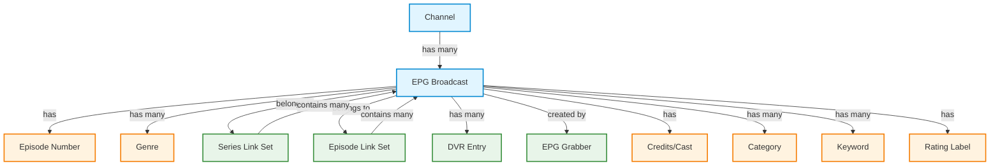
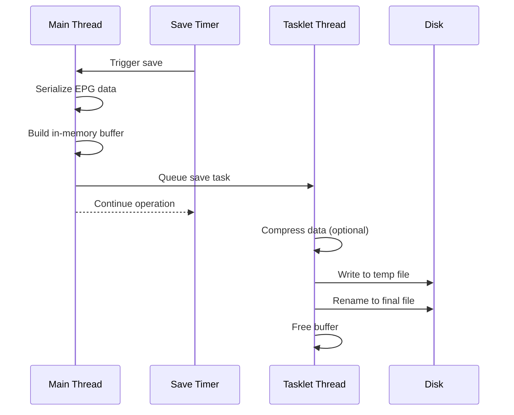
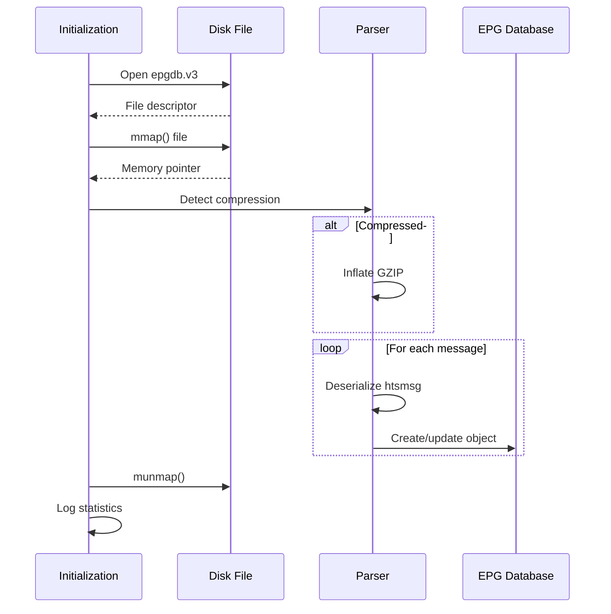
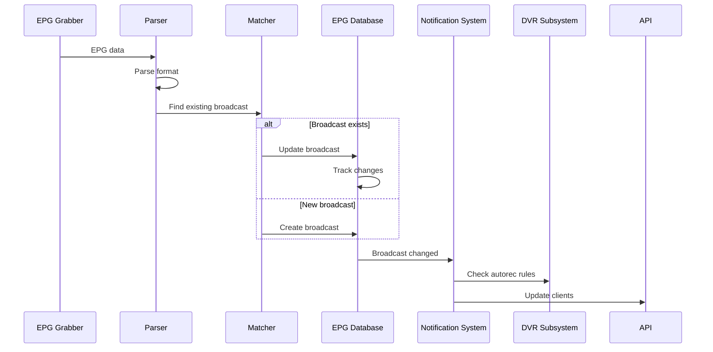
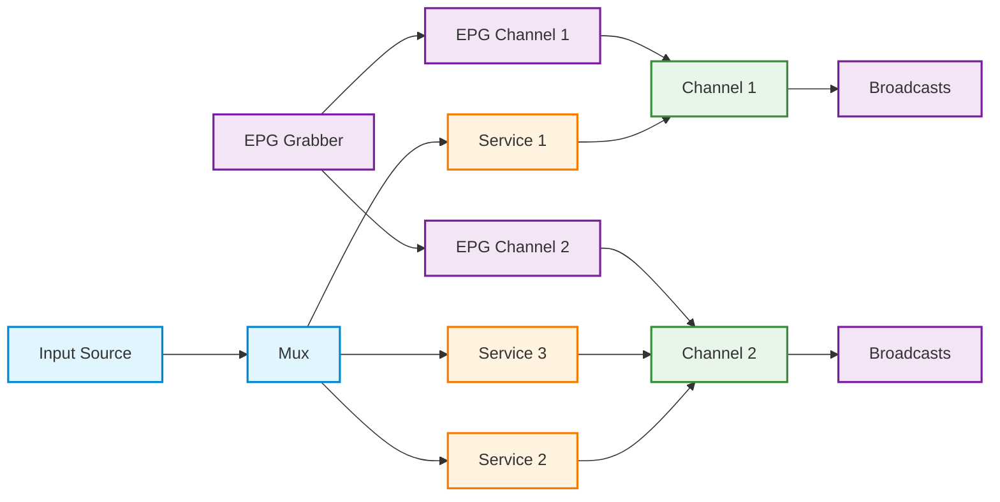
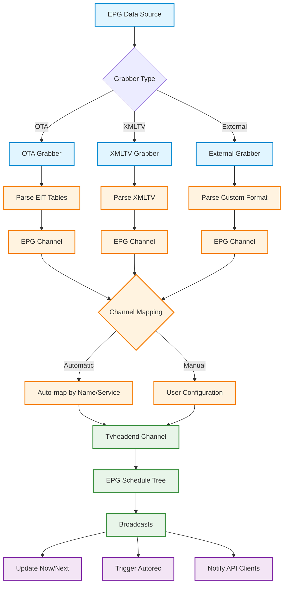

[← Back to Table of Contents](00-TOC.md)

## 13. EPG Subsystem

The EPG (Electronic Program Guide) Subsystem is responsible for collecting, storing, and managing television program schedule information in Tvheadend. It aggregates EPG data from multiple sources (over-the-air broadcasts, external grabbers, and internal modules), maintains an in-memory database with disk persistence, and provides matching algorithms to link EPG data with channels and recordings. This section documents the EPG data model, grabber types, storage mechanisms, update processes, and the relationship between EPG data and channels.

### 13.1 EPG Data Model

The EPG subsystem uses a hierarchical data model to represent program guide information. The model is designed to efficiently store broadcast schedules while supporting rich metadata including episode information, series relationships, and content ratings.

#### 13.1.1 Core Data Structures

**Location**: `src/epg.h`, `src/epg.c`

The EPG data model consists of several interconnected structures that form a hierarchy from individual broadcasts up to series-level information.

##### epg_object Structure (Base Class)

All EPG entities inherit from the `epg_object` base structure, which provides common functionality for reference counting, change tracking, and persistence.

**Structure Definition**:
```c
struct epg_object
{
  RB_ENTRY(epg_object)    id_link;    ///< Global (ID) link
  LIST_ENTRY(epg_object)  un_link;    ///< Global unref'd link
  LIST_ENTRY(epg_object)  up_link;    ///< Global updated link

  epg_object_type_t       type;       ///< Specific object type
  uint32_t                id;         ///< Internal ID
  time_t                  updated;    ///< Last time object was changed

  uint8_t                 _updated;   ///< Flag to indicate updated
  uint8_t                 _created;   ///< Flag to indicate creation
  int                     refcount;   ///< Reference counting

  struct epggrab_module  *grabber;    ///< Originating grabber

  epg_object_ops_t       *ops;        ///< Operations on the object
};
```

**Key Characteristics**:

1. **Reference Counting**: Safe memory management
   - `refcount` tracks active references
   - Objects are deleted when refcount reaches zero
   - Prevents use-after-free in multi-threaded environment

2. **Change Tracking**: Efficient updates
   - `_updated` flag marks modified objects
   - `_created` flag marks new objects
   - `updated` timestamp tracks last modification time
   - Enables incremental saves and notifications

3. **Source Tracking**: Grabber attribution
   - `grabber` points to the module that created/updated the object
   - Allows priority-based conflict resolution
   - Enables per-source statistics

4. **Polymorphism**: Type-specific operations
   - `type` identifies the specific object type
   - `ops` provides virtual function table
   - Enables generic handling of different EPG entities

**Object Types**:
```c
typedef enum epg_object_type
{
  EPG_UNDEF,
  EPG_BROADCAST,
} epg_object_type_t;
```

**Object Operations**:
```c
typedef struct epg_object_ops {
  void (*getref)  ( void *o );        ///< Get a reference
  int  (*putref)  ( void *o );        ///< Release a reference
  void (*destroy) ( void *o );        ///< Delete the object
  void (*update)  ( void *o );        ///< Updated
} epg_object_ops_t;
```

##### epg_broadcast Structure

**Location**: `src/epg.h`, `src/epg.c`

The `epg_broadcast` structure represents a single program broadcast - a specific airing of a program on a channel at a particular time. This is the primary EPG entity that users interact with.

**Structure Definition**:
```c
struct epg_broadcast
{
  epg_object_t;                                ///< Parent object

  struct channel            *channel;          ///< Channel being broadcast on
  RB_ENTRY(epg_broadcast)    sched_link;       ///< Schedule link
  LIST_HEAD(, dvr_entry)     dvr_entries;      ///< Associated DVR entries

  /* Timing */
  uint16_t                   dvb_eid;          ///< DVB Event ID
  time_t                     start;            ///< Start time
  time_t                     stop;             ///< End time

  /* Quality information */
  uint16_t                   lines;            ///< Lines in image (quality)
  uint16_t                   aspect;           ///< Aspect ratio (*100)
  uint8_t                    is_widescreen;    ///< Is widescreen
  uint8_t                    is_hd;            ///< Is HD
  uint8_t                    is_bw;            ///< Is black and white

  /* Accessibility support */
  uint8_t                    is_deafsigned;    ///< In screen signing
  uint8_t                    is_subtitled;     ///< Teletext subtitles
  uint8_t                    is_audio_desc;    ///< Audio description

  /* Content ratings and flags */
  uint8_t                    star_rating;      ///< Star rating (0-10)
  uint8_t                    age_rating;       ///< Age certificate
  ratinglabel_t              *rating_label;    ///< Age certificate label (eg: 'PG')
  uint8_t                    is_new;           ///< New series / file premiere
  uint8_t                    is_repeat;        ///< Repeat screening
  uint8_t                    running;          ///< EPG running flag
  uint8_t                    update_running;   ///< new EPG running flag

  /* Broadcast-level text */
  lang_str_t                *title;            ///< Title
  lang_str_t                *subtitle;         ///< Sub-title
  lang_str_t                *summary;          ///< Summary
  lang_str_t                *description;      ///< Description

  /* Media and classification */
  char                      *image;            ///< Episode image
  epg_genre_list_t           genre;            ///< Episode genre(s)
  epg_episode_num_t          epnum;            ///< Episode numbering

  /* Credits and categories */
  htsmsg_t                  *credits;          ///< Cast/Credits map
  lang_str_t                *credits_cached;   ///< Comma separated cast (cached)
  string_list_t             *category;         ///< Extra categories (XMLTV)
  string_list_t             *keyword;          ///< Extra keywords (XMLTV)
  lang_str_t                *keyword_cached;   ///< Cached CSV version

  /* Series/Episode linking */
  epg_set_t                 *serieslink;       ///< Series Link
  epg_set_t                 *episodelink;      ///< Episode Link

  /* Historical information */
  time_t                     first_aired;      ///< Original airdate
  uint16_t                   copyright_year;   ///< Copyright year

  /* External identifiers */
  char                       *xmltv_eid;       ///< XMLTV unique event identifier
};
```

**Key Characteristics**:

1. **Channel Association**: Links to channel
   - `channel` pointer to the broadcasting channel
   - `sched_link` for efficient time-based lookups
   - Broadcasts are organized in a red-black tree per channel

2. **Timing Information**: Precise scheduling
   - `start` and `stop` times (Unix timestamps)
   - `dvb_eid` for DVB event identification
   - `running` flag indicates current broadcast status

3. **Rich Metadata**: Comprehensive program information
   - Multilingual text fields (`lang_str_t`)
   - Quality indicators (HD, widescreen, aspect ratio)
   - Accessibility features (subtitles, audio description, signing)
   - Content ratings (star rating, age rating, rating labels)

4. **Episode Information**: Series tracking
   - `epnum` contains season/episode/part numbers
   - `serieslink` groups broadcasts of the same series
   - `episodelink` identifies the same episode across channels
   - `first_aired` tracks original broadcast date

5. **DVR Integration**: Recording linkage
   - `dvr_entries` list of associated recordings
   - Enables automatic recording based on EPG
   - Tracks which broadcasts have been recorded

**Running States**:
```c
typedef enum {
  EPG_RUNNING_NOTSET = 0,
  EPG_RUNNING_STOP   = 1,
  EPG_RUNNING_WARM   = 2,
  EPG_RUNNING_NOW    = 3,
  EPG_RUNNING_PAUSE  = 4,
} epg_running_t;
```

**Broadcast Operations**:

```c
// Find broadcast by time
epg_broadcast_t *b = epg_broadcast_find_by_time(
  channel,           // Channel
  grabber,           // EPG grabber module
  start_time,        // Start time
  stop_time,         // Stop time
  1,                 // Create if not found
  &save,             // Save flag
  &changes           // Changes mask
);

// Find broadcast by DVB event ID
epg_broadcast_t *b = epg_broadcast_find_by_eid(channel, dvb_eid);

// Find broadcast by internal ID
epg_broadcast_t *b = epg_broadcast_find_by_id(broadcast_id);

// Find broadcast by XMLTV event ID
epg_broadcast_t *b = epg_broadcast_find_by_xmltv_eid(
  channel, grabber, start_time, stop_time, 1, &save, &changes, xmltv_eid
);

// Navigate schedule
epg_broadcast_t *prev = epg_broadcast_get_prev(b);
epg_broadcast_t *next = epg_broadcast_get_next(b);
```

**Change Tracking**:

The EPG system uses a comprehensive change tracking mechanism to detect modifications:

```c
// Change flags
#define EPG_CHANGED_CREATE         (1ULL<<0)
#define EPG_CHANGED_TITLE          (1ULL<<1)
#define EPG_CHANGED_SUBTITLE       (1ULL<<2)
#define EPG_CHANGED_SUMMARY        (1ULL<<3)
#define EPG_CHANGED_DESCRIPTION    (1ULL<<4)
#define EPG_CHANGED_IMAGE          (1ULL<<5)
#define EPG_CHANGED_CREDITS        (1ULL<<6)
#define EPG_CHANGED_CATEGORY       (1ULL<<7)
#define EPG_CHANGED_KEYWORD        (1ULL<<8)
#define EPG_CHANGED_DVB_EID        (1ULL<<9)
#define EPG_CHANGED_IS_WIDESCREEN  (1ULL<<10)
#define EPG_CHANGED_IS_HD          (1ULL<<11)
#define EPG_CHANGED_LINES          (1ULL<<12)
#define EPG_CHANGED_ASPECT         (1ULL<<13)
#define EPG_CHANGED_DEAFSIGNED     (1ULL<<14)
#define EPG_CHANGED_SUBTITLED      (1ULL<<15)
#define EPG_CHANGED_AUDIO_DESC     (1ULL<<16)
#define EPG_CHANGED_IS_NEW         (1ULL<<17)
#define EPG_CHANGED_IS_REPEAT      (1ULL<<18)
#define EPG_CHANGED_SERIESLINK     (1ULL<<19)
#define EPG_CHANGED_EPISODE        (1ULL<<20)
#define EPG_CHANGED_GENRE          (1ULL<<21)
// ... and more
```

**Mutator Functions**:

All broadcast properties have setter functions that track changes:

```c
// Set title
int changed = epg_broadcast_set_title(b, title_str, &changes);

// Set episode number
int changed = epg_broadcast_set_epnum(b, &epnum, &changes);

// Set genre
int changed = epg_broadcast_set_genre(b, &genre_list, &changes);

// Set running state
int changed = epg_broadcast_set_running(b, EPG_RUNNING_NOW);

// Finalize changes (triggers notifications)
epg_broadcast_change_finish(b, changes, merge_flag);
```

##### epg_episode_num Structure

**Location**: `src/epg.h`

The `epg_episode_num` structure represents episode numbering information, supporting various numbering schemes including season/episode, part numbers, and arbitrary text descriptions.

**Structure Definition**:
```c
typedef struct epg_episode_num
{
  uint16_t s_num; ///< Series/Season number
  uint16_t s_cnt; ///< Series/Season count
  uint16_t e_num; ///< Episode number
  uint16_t e_cnt; ///< Episode count
  uint16_t p_num; ///< Part number
  uint16_t p_cnt; ///< Part count
  char     *text; ///< Arbitrary text description of episode num
} epg_episode_num_t;
```

**Key Characteristics**:

1. **Flexible Numbering**: Supports multiple schemes
   - Season/episode format (S01E05)
   - Absolute episode numbers
   - Multi-part episodes
   - Text-based descriptions

2. **Count Fields**: Total episode information
   - `s_cnt`: Total number of seasons
   - `e_cnt`: Total episodes in season
   - `p_cnt`: Total parts in episode
   - Useful for progress tracking

3. **Text Fallback**: Arbitrary descriptions
   - `text` field for non-standard numbering
   - Examples: "Part 1 of 3", "Episode 5", "Special"

**Episode Number Formatting**:

```c
// Format episode number as string
char buf[64];
size_t len = epg_episode_num_format(
  &epnum,           // Episode number structure
  buf,              // Output buffer
  sizeof(buf),      // Buffer size
  "S",              // Season prefix
  "%02d",           // Season format
  "E",              // Separator
  "%02d",           // Episode format
  " of %d"          // Count format
);
// Result: "S01E05 of 12"

// Compare episode numbers
int cmp = epg_episode_number_cmp(&epnum1, &epnum2);
// Returns: <0 if epnum1 < epnum2, 0 if equal, >0 if epnum1 > epnum2

// Full comparison (including parts)
int cmp = epg_episode_number_cmpfull(&epnum1, &epnum2);
```

##### epg_genre Structure

**Location**: `src/epg.h`, `src/epg.c`

The `epg_genre` structure represents a content genre classification based on the ETSI EN 300 468 DVB standard.

**Structure Definition**:
```c
struct epg_genre
{
  LIST_ENTRY(epg_genre) link;
  uint8_t               code;
};
```

**Key Characteristics**:

1. **DVB Standard**: Based on ETSI EN 300 468
   - 8-bit genre code
   - Upper 4 bits: major category
   - Lower 4 bits: sub-category

2. **Genre Categories**: Standard classifications
   - Movie/Drama (0x1x)
   - News/Current affairs (0x2x)
   - Show/Game show (0x3x)
   - Sports (0x4x)
   - Children's/Youth (0x5x)
   - Music/Ballet/Dance (0x6x)
   - Arts/Culture (0x7x)
   - Social/Political/Economics (0x8x)
   - Education/Science/Factual (0x9x)
   - Leisure hobbies (0xAx)
   - Special characteristics (0xBx)

**Genre Operations**:

```c
// Get EIT genre code
uint8_t code = epg_genre_get_eit(genre);

// Get genre as string
char buf[128];
size_t len = epg_genre_get_str(
  genre,            // Genre structure
  0,                // Major only (0 = include sub-genre)
  1,                // Major prefix (1 = include major category)
  buf,              // Output buffer
  sizeof(buf),      // Buffer size
  "eng"             // Language
);
// Result: "Movie/Drama : Action"

// Add genre to list by EIT code
epg_genre_list_add_by_eit(&genre_list, 0x14); // Sports : Football

// Add genre by string
epg_genre_list_add_by_str(&genre_list, "Action", "eng");

// Check if list contains genre
int contains = epg_genre_list_contains(&genre_list, genre, 0);

// List all available genres
htsmsg_t *genres = epg_genres_list_all(
  0,                // Major only
  1,                // Major prefix
  "eng"             // Language
);
```

##### epg_set Structure (Series/Episode Links)

**Location**: `src/epg.h`, `src/epg.c`

The `epg_set` structure groups related broadcasts together, either as a series (all episodes of a show) or as episode instances (same episode on different channels/times).

**Structure Definition**:
```c
struct epg_set_item {
  LIST_ENTRY(epg_set_item) item_link;
  epg_broadcast_t *broadcast;
};

struct epg_set {
  RB_ENTRY(epg_set) set_link;
  LIST_HEAD(, epg_set_item) broadcasts;
  char uri[0];
};
```

**Key Characteristics**:

1. **URI-Based Identification**: Unique series/episode IDs
   - `uri` is a unique identifier (e.g., "crid://example.com/series/123")
   - Flexible variable-length string (allocated at end of structure)

2. **Broadcast Grouping**: Links related broadcasts
   - `broadcasts` list contains all related broadcasts
   - Series link: all episodes of a series
   - Episode link: same episode on different channels

3. **Global Trees**: Efficient lookups
   - `epg_serieslinks`: Tree of all series links
   - `epg_episodelinks`: Tree of all episode links

**Set Operations**:

```c
// Insert broadcast into series link set
epg_set_t *set = epg_set_broadcast_insert(
  &epg_serieslinks,  // Tree (serieslinks or episodelinks)
  broadcast,         // Broadcast to insert
  "crid://example.com/series/123"  // URI
);

// Find set by URI
epg_set_t *set = epg_set_broadcast_find_by_uri(
  &epg_serieslinks,
  "crid://example.com/series/123"
);

// Remove broadcast from set
epg_set_broadcast_remove(&epg_serieslinks, set, broadcast);

// Check if broadcasts are same episode
if (epg_episode_match(broadcast1, broadcast2)) {
  // Same episode (same episodelink)
}
```

**Use Cases**:

1. **Series Recording**: Record all episodes
   - Autorec rules use series links
   - Find all broadcasts with same series URI
   - Schedule recordings for entire series

2. **Duplicate Detection**: Avoid recording repeats
   - Episode links identify same episode
   - Check if episode already recorded
   - Skip duplicate broadcasts

3. **EPG Navigation**: Browse series
   - List all episodes in a series
   - Find next/previous episode
   - Display series information

#### 13.1.2 Data Model Relationships

The EPG data model forms a hierarchy with clear relationships between entities:



**Relationship Summary**:

| Entity | Relationship | Description |
|--------|--------------|-------------|
| Channel → Broadcast | One-to-Many | Each channel has multiple broadcasts in its schedule |
| Broadcast → Episode Number | One-to-One | Each broadcast has episode numbering information |
| Broadcast → Genre | One-to-Many | Each broadcast can have multiple genre classifications |
| Broadcast → Series Link | Many-to-One | Multiple broadcasts belong to the same series |
| Broadcast → Episode Link | Many-to-One | Same episode can air multiple times/channels |
| Broadcast → DVR Entry | One-to-Many | One broadcast can have multiple recordings (different configs) |
| Broadcast → Grabber | Many-to-One | Each broadcast is created/updated by a grabber module |

### 13.2 EPG Grabber Types

Tvheadend supports multiple types of EPG grabbers to collect program guide data from various sources. The grabber architecture is extensible, allowing different implementations while maintaining a common interface. This section documents the three main grabber types: OTA (Over-The-Air), external, and internal grabbers.

#### 13.2.1 Grabber Architecture

**Location**: `src/epggrab.h`, `src/epggrab.c`

All EPG grabbers inherit from the `epggrab_module` base structure, which provides common functionality for module management, channel mapping, and data queuing.

##### epggrab_module Structure (Base Class)

**Structure Definition**:
```c
struct epggrab_module
{
  idnode_t                     idnode;
  LIST_ENTRY(epggrab_module)   link;      ///< Global list link
  TAILQ_ENTRY(epggrab_module)  qlink;     ///< Queued data link

  enum {
    EPGGRAB_OTA,
    EPGGRAB_INT,
    EPGGRAB_EXT,
  }                            type;      ///< Grabber type
  const char                   *id;       ///< Module identifier
  int                          subsys;    ///< Module log subsystem
  const char                   *saveid;   ///< Module save identifier
  const char                   *name;     ///< Module name (for display)
  int                          enabled;   ///< Whether the module is enabled
  int                          active;    ///< Whether the module is active
  int                          priority;  ///< Priority of the module
  epggrab_channel_tree_t       channels;  ///< Channel list

  TAILQ_HEAD(, epggrab_queued_data) data_queue;

  /* Activate */
  int       (*activate)( void *m, int activate );

  /* Free */
  void      (*done)( void *m );

  /* Process queued data */
  void      (*process_data)( void *m, void *data, uint32_t len );
};
```

**Key Characteristics**:

1. **Module Types**: Three distinct grabber types
   - `EPGGRAB_OTA`: Over-the-air grabbers (DVB EIT, OpenTV, etc.)
   - `EPGGRAB_INT`: Internal grabbers (built-in XMLTV parsers)
   - `EPGGRAB_EXT`: External grabbers (external XMLTV scripts)

2. **Priority System**: Conflict resolution
   - Higher priority grabbers override lower priority
   - Allows mixing multiple sources
   - User-configurable per module

3. **Channel Mapping**: EPG-to-channel association
   - Each module maintains its own channel list
   - Channels mapped to Tvheadend channels
   - Supports automatic and manual mapping

4. **Data Queuing**: Asynchronous processing
   - `data_queue` buffers incoming EPG data
   - Prevents blocking input threads
   - Processed in background

**Module Operations**:

```c
// Find module by ID
epggrab_module_t *mod = epggrab_module_find_by_id("eit");

// Activate/deactivate module
epggrab_activate_module(mod, 1);  // Enable
epggrab_activate_module(mod, 0);  // Disable

// Get module type string
const char *type = epggrab_module_type(mod);
// Returns: "OTA", "Internal", or "External"

// Get module status
const char *status = epggrab_module_get_status(mod);
// Returns: "Idle", "Running", "Queued", etc.

// Queue data for processing
epggrab_queue_data(mod, data1, len1, data2, len2);
```

##### epggrab_channel Structure

**Location**: `src/epggrab.h`, `src/epggrab.c`

The `epggrab_channel` structure represents a channel as known by an EPG grabber, which is then mapped to one or more Tvheadend channels.

**Structure Definition**:
```c
typedef struct epggrab_channel
{
  idnode_t                  idnode;
  TAILQ_ENTRY(epggrab_channel) all_link; ///< Global link
  RB_ENTRY(epggrab_channel) link;     ///< Global tree link
  epggrab_module_t          *mod;     ///< Linked module

  int                       updated;  ///< EPG channel was updated
  int                       enabled;  ///< Enabled/disabled
  char                      *id;      ///< Grabber's ID

  char                      *name;    ///< Channel name
  htsmsg_t                  *names;   ///< List of all channel names
  htsmsg_t                  *newnames;///< List of all channel names (scan)
  char                      *icon;    ///< Channel icon
  char                      *comment; ///< Channel comment (EPG)
  int64_t                   lcn;      ///< Channel number (split)

  time_t                    laststamp;///< Last update timestamp

  int                       only_one; ///< Map to only one channel (auto)
  idnode_list_head_t        channels; ///< Mapped channels

  int                       update_chicon; ///< Update channel icon
  int                       update_chnum;  ///< Update channel number
  int                       update_chname; ///< Update channel name
} epggrab_channel_t;
```

**Key Characteristics**:

1. **Channel Identification**: Grabber-specific IDs
   - `id` is the grabber's channel identifier
   - `name` is the channel name from grabber
   - `names` list tracks all known names

2. **Channel Mapping**: Links to Tvheadend channels
   - `channels` list of mapped Tvheadend channels
   - Supports one-to-many mapping
   - `only_one` flag for automatic mapping

3. **Channel Updates**: Automatic channel management
   - `update_chicon`: Update channel icon from EPG
   - `update_chnum`: Update channel number from EPG
   - `update_chname`: Update channel name from EPG

**Channel Operations**:

```c
// Find EPG channel by ID
epggrab_channel_t *ec = epggrab_channel_find_by_id("bbc-one");

// Set channel name
epggrab_channel_set_name(ec, "BBC One HD");

// Set channel icon
epggrab_channel_set_icon(ec, "http://example.com/icon.png");

// Set channel number
epggrab_channel_set_number(ec, 1, 0);  // Major: 1, Minor: 0

// Link EPG channel to Tvheadend channel
epggrab_channel_link(epg_channel, tvh_channel, origin);

// Check if EPG channel is OTA
if (epggrab_channel_is_ota(ec)) {
  // This is an OTA channel
}
```

#### 13.2.2 OTA Grabbers (Over-The-Air)

**Location**: `src/epggrab.h`, `src/epggrab/module/eit.c`, `src/epggrab/module/opentv.c`

OTA (Over-The-Air) grabbers extract EPG data directly from broadcast streams. These grabbers parse PSI/SI tables embedded in the MPEG-TS stream.

##### epggrab_module_ota Structure

**Structure Definition**:
```c
struct epggrab_module_ota
{
  epggrab_module_t               ;      ///< Parent object

  /* Transponder tuning */
  int  (*start) ( epggrab_ota_map_t *map, struct mpegts_mux *mm );
  int  (*stop)  ( epggrab_ota_map_t *map, struct mpegts_mux *mm );
  void (*handlers) (epggrab_ota_map_t *map, struct mpegts_mux *mm );
  int  (*tune)  ( epggrab_ota_map_t *map, epggrab_ota_mux_t *om,
                  struct mpegts_mux *mm );
  void  *opaque;
};
```

**Key Characteristics**:

1. **Mux-Based Operation**: Per-transponder grabbing
   - Each mux (multiplex) has its own EPG data
   - Grabbers start/stop per mux
   - Requires tuning to mux to receive data

2. **Table Parsing**: PSI/SI table extraction
   - Parses EIT (Event Information Table)
   - Parses SDT (Service Description Table)
   - Parses TDT/TOT (Time and Date Table)
   - Vendor-specific tables (OpenTV, MediaHighway, etc.)

3. **Automatic Discovery**: No configuration needed
   - EPG data discovered automatically when tuning
   - Channel mapping based on service IDs
   - Works with any DVB source

**Supported OTA Grabbers**:

1. **EIT (Event Information Table)** - `src/epggrab/module/eit.c`
   - Standard DVB EPG data
   - Present/Following and Schedule tables
   - Supports EIT p/f (0x4E/0x4F) and EIT schedule (0x50-0x6F)
   - Most common EPG source for DVB

2. **UK Freeview** - `src/epggrab/module/eit.c`
   - Enhanced EIT parsing for UK Freeview
   - Handles Freeview-specific extensions
   - Series link support

3. **UK Freesat** - `src/epggrab/module/eit.c`
   - Enhanced EIT parsing for UK Freesat
   - Handles Freesat-specific extensions
   - Series link support

4. **OpenTV** - `src/epggrab/module/opentv.c`
   - Proprietary EPG format used by Sky
   - Requires specific configuration
   - Supports multiple providers (Sky UK, Sky Italia, etc.)

5. **Viasat** - `src/epggrab/module/viasat.c`
   - Viasat Baltic EPG format
   - Used in Nordic countries

6. **MediaHighway** - `src/epggrab/module/mediahighway.c`
   - Canal+ EPG format
   - Used in France and other regions

##### epggrab_module_ota_scraper Structure

Some OTA grabbers support configurable scraping to extract additional information from EPG text fields.

**Structure Definition**:
```c
struct epggrab_module_ota_scraper
{
  epggrab_module_ota_t             ;      ///< Parent object
  char                   *scrape_config;  ///< Config to use
  int                     scrape_episode; ///< Scrape season/episode from summary
  int                     scrape_title;   ///< Scrape title from title + summary
  int                     scrape_subtitle;///< Scrape subtitle from summary
  int                     scrape_summary; ///< Scrape summary from summary
};
```

**Scraping Features**:

1. **Episode Number Extraction**: Parse from text
   - Patterns: "S01E05", "1x05", "Episode 5"
   - Extracted from title or summary
   - Improves series recording

2. **Title/Subtitle Separation**: Split combined fields
   - Some providers combine title and subtitle
   - Scraper separates them
   - Improves metadata quality

3. **Summary Enhancement**: Extract details
   - Parse cast information
   - Extract year, genre hints
   - Improve search and matching

**OTA Mux Management**:

```c
// Queue mux for EPG scanning
epggrab_ota_queue_mux(mux);

// Find OTA mux structure
epggrab_ota_mux_t *om = epggrab_ota_find_mux(mux);

// Mux states
typedef enum {
  EPGGRAB_OTA_MUX_IDLE,      // Not currently scanning
  EPGGRAB_OTA_MUX_PENDING,   // Queued for scanning
  EPGGRAB_OTA_MUX_ACTIVE     // Currently scanning
} epggrab_ota_mux_state_t;
```

**OTA Grabbing Process**:

1. **Mux Tuning**: Tune to transponder
2. **Table Filtering**: Set up PSI/SI table filters
3. **Data Collection**: Receive and parse tables
4. **EPG Update**: Update in-memory EPG database
5. **Completion**: Mark mux as complete
6. **Scheduling**: Schedule next scan

#### 13.2.3 Internal Grabbers

**Location**: `src/epggrab.h`, `src/epggrab/module/xmltv.c`

Internal grabbers are built-in modules that parse EPG data from external sources. The primary internal grabber is the XMLTV parser.

##### epggrab_module_int Structure

**Structure Definition**:
```c
struct epggrab_module_int
{
  epggrab_module_t             ;          ///< Parent object

  const char                   *path;     ///< Path for the command
  const char                   *args;     ///< Extra arguments

  int                           xmltv_chnum;
  int                           xmltv_scrape_extra; ///< Scrape actors and extra details
  int                           xmltv_scrape_onto_desc; ///< Include scraped actors on description
  int                           xmltv_use_category_not_genre; ///< Use category tags

  const char                   *xmltv_xpath_category_code; ///< XPath for category code
  const char                   *xmltv_xpath_unique_id;     ///< XPath for unique event ID
  const char                   *xmltv_xpath_series_link;   ///< XPath for series link
  const char                   *xmltv_xpath_episode_link;  ///< XPath for episode link
  int                           xmltv_xpath_series_use_standard; ///< Fallback to standard
  int                           xmltv_xpath_episode_use_standard; ///< Fallback to standard

  /* Handle data */
  char*     (*grab)   ( void *mod );
  htsmsg_t* (*trans)  ( void *mod, char *data );
  int       (*parse)  ( void *mod, htsmsg_t *data, epggrab_stats_t *stat );
};
```

**Key Characteristics**:

1. **XMLTV Format**: Standard EPG interchange format
   - XML-based format
   - Widely supported by EPG providers
   - Rich metadata support

2. **Configurable Parsing**: XPath-based extraction
   - Custom XPath expressions for non-standard XMLTV
   - Extract series links, episode links
   - Extract category codes

3. **Data Enrichment**: Additional metadata
   - Scrape cast/crew information
   - Extract detailed descriptions
   - Parse episode numbers from text

**Internal Grabber Process**:

1. **Data Acquisition**: Read XMLTV file or socket
2. **XML Parsing**: Parse XMLTV format
3. **Transformation**: Convert to internal format
4. **Channel Mapping**: Match XMLTV channels to Tvheadend channels
5. **EPG Update**: Update in-memory database
6. **Statistics**: Report created/modified broadcasts

**XMLTV Configuration Options**:

```c
// Channel number handling
xmltv_chnum = 1;  // Use channel numbers from XMLTV

// Scraping options
xmltv_scrape_extra = 1;  // Scrape cast and extra details
xmltv_scrape_onto_desc = 1;  // Append scraped data to description

// Genre handling
xmltv_use_category_not_genre = 0;  // Map categories to DVB genres

// XPath expressions for custom XMLTV
xmltv_xpath_series_link = "//series-link/@href";
xmltv_xpath_episode_link = "//episode-link/@href";
xmltv_xpath_unique_id = "//programme/@id";
```

**Supported Internal Grabbers**:

1. **XMLTV Socket** - `src/epggrab/module/xmltv.c`
   - Receives XMLTV data via socket
   - Used by external XMLTV grabbers
   - Real-time EPG updates

2. **XMLTV File** - `src/epggrab/module/xmltv.c`
   - Reads XMLTV from file
   - Scheduled imports
   - Batch EPG updates

#### 13.2.4 External Grabbers

**Location**: `src/epggrab.h`, `src/epggrab/module/pyepg.c`

External grabbers are external programs or scripts that provide EPG data to Tvheadend. They run as separate processes and communicate via sockets or files.

##### epggrab_module_ext Structure

**Structure Definition**:
```c
struct epggrab_module_ext
{
  epggrab_module_int_t         ;          ///< Parent object

  int                          sock;      ///< Socket descriptor

  pthread_t                    tid;       ///< Thread ID
};
```

**Key Characteristics**:

1. **External Process**: Separate program
   - Runs independently of Tvheadend
   - Can be written in any language
   - Communicates via socket or file

2. **Socket Communication**: Real-time data transfer
   - External grabber connects to Tvheadend socket
   - Sends XMLTV or JSON data
   - Asynchronous processing

3. **Scheduled Execution**: Cron-based scheduling
   - Configured via cron expression
   - Automatic periodic updates
   - Manual trigger support

**Supported External Grabbers**:

1. **PyEPG** - `src/epggrab/module/pyepg.c`
   - Python-based EPG grabber framework
   - Supports multiple providers
   - Extensible plugin system

2. **External XMLTV** - `src/epggrab/module/xmltv.c`
   - Any XMLTV-compatible grabber
   - tv_grab_* scripts
   - Custom scripts

**External Grabber Process**:

1. **Scheduling**: Cron timer triggers execution
2. **Process Launch**: Start external program
3. **Data Reception**: Receive data via socket
4. **Parsing**: Parse XMLTV or JSON format
5. **EPG Update**: Update in-memory database
6. **Cleanup**: Terminate external process

**External Grabber Configuration**:

```c
// Cron expression for scheduling
cron = "0 2 * * *";  // Daily at 2 AM

// Socket path
path = "/usr/bin/tv_grab_uk_rt";

// Arguments
args = "--days 7 --output -";
```

#### 13.2.5 Grabber Priority and Conflict Resolution

When multiple grabbers provide data for the same broadcast, Tvheadend uses a priority system to resolve conflicts.

**Priority Rules**:

1. **Higher Priority Wins**: Grabber with higher priority value overrides lower
2. **Same Priority**: Last update wins
3. **Partial Updates**: Only changed fields are updated
4. **Merge Mode**: Some fields can be merged from multiple sources

**Priority Configuration**:

```c
// Set grabber priority
mod->priority = 10;  // Higher number = higher priority

// Typical priority values:
// OTA grabbers: 1-5
// Internal grabbers: 5-10
// External grabbers: 10-20
```

**Conflict Resolution Example**:

```
Broadcast: "News at 6"
- OTA EIT (priority 1): Title="News", Summary="Local news"
- XMLTV (priority 10): Title="News at 6", Summary="Local and national news", Image="http://..."

Result:
- Title: "News at 6" (from XMLTV, higher priority)
- Summary: "Local and national news" (from XMLTV, higher priority)
- Image: "http://..." (from XMLTV, only source)
```

#### 13.2.6 Grabber Statistics

**Location**: `src/epggrab.h`

Tvheadend tracks statistics for each EPG grabbing operation to monitor performance and data quality.

**Statistics Structure**:
```c
typedef struct epggrab_stats_part
{
  int created;
  int modified;
  int total;
} epggrab_stats_part_t;

typedef struct epggrab_stats
{
  epggrab_stats_part_t channels;
  epggrab_stats_part_t brands;
  epggrab_stats_part_t seasons;
  epggrab_stats_part_t episodes;
  epggrab_stats_part_t broadcasts;
  epggrab_stats_part_t config;
} epggrab_stats_t;
```

**Statistics Tracking**:

- **Created**: New entities added
- **Modified**: Existing entities updated
- **Total**: Total entities processed

**Statistics Usage**:

```c
epggrab_stats_t stats = {0};

// Parse EPG data
parse_epg_data(data, &stats);

// Log statistics
tvhlog(LOG_INFO, "epggrab", 
  "Processed %d broadcasts (%d new, %d modified)",
  stats.broadcasts.total,
  stats.broadcasts.created,
  stats.broadcasts.modified);
```


### 13.3 EPG Storage and Persistence

Tvheadend maintains EPG data in an in-memory database for fast access, with periodic saves to disk for persistence across restarts. The storage system uses a binary format with optional compression, and implements automatic cleanup to manage database size.

#### 13.3.1 In-Memory EPG Database

**Location**: `src/epg.c`, `src/epg.h`

The EPG database is stored entirely in memory for performance, organized using efficient data structures for fast lookups and updates.

##### Database Organization

**Global Data Structures**:

```c
// Per-channel broadcast schedules (red-black trees)
struct channel {
  ...
  epg_broadcast_tree_t ch_epg_schedule;  // Broadcasts sorted by time
  ...
};

// Global series/episode link trees
extern epg_set_tree_t epg_serieslinks;   // All series links
extern epg_set_tree_t epg_episodelinks;  // All episode links

// Global object tracking
extern epg_object_tree_t epg_objects;    // All EPG objects by ID
```

**Memory Organization**:

1. **Per-Channel Schedules**: Red-black trees
   - Each channel has its own broadcast tree
   - Broadcasts sorted by start time
   - O(log n) lookup by time
   - Efficient range queries

2. **Global Object Tree**: ID-based lookup
   - All EPG objects indexed by internal ID
   - Fast lookup by ID
   - Reference counting for safe deletion

3. **Series/Episode Links**: URI-based trees
   - Series links grouped by URI
   - Episode links grouped by URI
   - Fast duplicate detection
   - Efficient series recording

**Memory Management**:

```c
// Memory statistics tracking
static memoryinfo_t epg_memoryinfo_broadcasts = {
  .my_name = "EPG Broadcasts",
  .my_update = epg_memoryinfo_broadcasts_update
};

// Calculate memory usage
static void epg_memoryinfo_broadcasts_update(memoryinfo_t *my)
{
  channel_t *ch;
  epg_broadcast_t *ebc;
  int64_t size = 0, count = 0;

  CHANNEL_FOREACH(ch) {
    if (ch->ch_epg_parent) continue;
    RB_FOREACH(ebc, &ch->ch_epg_schedule, sched_link) {
      size += sizeof(*ebc);
      size += tvh_strlen(ebc->image);
      size += tvh_strlen(ebc->epnum.text);
      size += lang_str_size(ebc->title);
      size += lang_str_size(ebc->subtitle);
      size += lang_str_size(ebc->summary);
      size += lang_str_size(ebc->description);
      count++;
    }
  }
  memoryinfo_update(my, size, count);
}
```

**Typical Memory Usage**:

- **Per Broadcast**: ~500-2000 bytes (depending on metadata)
- **10,000 Broadcasts**: ~5-20 MB
- **100,000 Broadcasts**: ~50-200 MB
- **1,000,000 Broadcasts**: ~500 MB - 2 GB

**Memory Optimization**:

1. **Shared Strings**: Common strings deduplicated
2. **Lazy Loading**: Descriptions loaded on demand
3. **Reference Counting**: Objects deleted when unused
4. **Automatic Cleanup**: Old broadcasts removed periodically

#### 13.3.2 EPG Save/Load Mechanism

**Location**: `src/epgdb.c`

The EPG database is persisted to disk using a binary format based on htsmsg serialization. The save/load mechanism supports versioning, compression, and incremental updates.

##### Database File Format

**File Location**: `~/.hts/tvheadend/epgdb.v3`

**Format Version**: 3 (current)

**File Structure**:

```
[Optional GZIP Header: "\xff\xffGZIP01" + version + original_size]
[Section: "config"]
  [htsmsg: EPG configuration]
[Section: "broadcasts"]
  [htsmsg: Broadcast 1]
  [htsmsg: Broadcast 2]
  ...
  [htsmsg: Broadcast N]
```

**Message Format**: htsmsg_binary2
- Binary serialization of htsmsg structures
- Variable-length encoding
- Efficient storage
- Forward/backward compatible

**Database Versions**:

- **Version 1**: Original format (deprecated)
- **Version 2**: Added episode information (deprecated)
- **Version 3**: Current format with full metadata support

##### Save Process

**Location**: `src/epgdb.c` - `epg_save()`

The save process is asynchronous to avoid blocking the main thread.

**Save Workflow**:



**Save Implementation**:

```c
void epg_save ( void )
{
  sbuf_t *sb = malloc(sizeof(*sb));
  epg_broadcast_t *ebc;
  channel_t *ch;
  epggrab_stats_t stats;

  tvhinfo(LS_EPGDB, "snapshot start");

  // Initialize buffer
  sbuf_init_fixed(sb, EPG_DB_ALLOC_STEP);  // 1 MB initial

  // Write configuration section
  _epg_write_sect(sb, "config");
  _epg_write(sb, epg_config_serialize());

  // Write broadcasts section
  _epg_write_sect(sb, "broadcasts");
  CHANNEL_FOREACH(ch) {
    if (ch->ch_epg_parent) continue;
    RB_FOREACH(ebc, &ch->ch_epg_schedule, sched_link) {
      _epg_write(sb, epg_broadcast_serialize(ebc));
      stats.broadcasts.total++;
    }
  }

  // Queue for asynchronous write
  tasklet_arm_alloc(epg_save_tsk_callback, sb);

  tvhinfo(LS_EPGDB, "queued to save (size %d)", sb->sb_ptr);
  tvhinfo(LS_EPGDB, "  broadcasts %d", stats.broadcasts.total);
}
```

**Asynchronous Write**:

```c
static void epg_save_tsk_callback ( void *p, int dearmed )
{
  sbuf_t *sb = p;
  size_t size = sb->sb_ptr, orig;
  int fd;

  // Create temporary file
  snprintf(tmppath, sizeof(tmppath), "%s.tmp", path);
  fd = tvh_open(tmppath, O_CREAT | O_TRUNC | O_WRONLY, S_IRUSR | S_IWUSR);

  // Write with optional compression
#if ENABLE_ZLIB
  if (config.epg_compress) {
    tvh_gzip_deflate_fd_header(fd, sb->sb_data, size, &orig, 3, "01");
  } else
#endif
    tvh_write(fd, sb->sb_data, orig = size);

  close(fd);

  // Atomic rename
  rename(tmppath, path);

  // Cleanup
  sbuf_free(sb);
  free(sb);
}
```

**Save Triggers**:

1. **Periodic Save**: Configured interval (default: disabled)
   ```c
   // Configuration option
   epggrab_conf.epgdb_periodicsave = 12;  // Hours (0 = disabled)
   
   // Timer setup
   if (epggrab_conf.epgdb_periodicsave)
     gtimer_arm_rel(&epggrab_save_timer, epg_save_callback, NULL,
                    epggrab_conf.epgdb_periodicsave * 3600);
   ```

2. **After Import**: Save after XMLTV import
   ```c
   // Configuration option
   epggrab_conf.epgdb_saveafterimport = 1;  // 1 = enabled
   
   // Triggered after external grabber completes
   if (epggrab_conf.epgdb_saveafterimport)
     epg_save();
   ```

3. **Shutdown**: Save on clean shutdown
   ```c
   // Called during shutdown sequence
   epg_save();
   ```

4. **Manual**: User-triggered save
   ```c
   // Via API or UI
   epg_save();
   ```

##### Load Process

**Location**: `src/epgdb.c` - `epg_init()`

The load process occurs during system initialization, before any EPG grabbers start.

**Load Workflow**:



**Load Implementation**:

```c
void epg_init ( void )
{
  int fd, ver = EPG_DB_VERSION;
  struct stat st;
  uint8_t *mem, *rp, *zlib_mem = NULL;
  epggrab_stats_t stats;

  // Find database file (try versions in descending order)
  while (fd < 0 && ver > 0) {
    fd = hts_settings_open_file(0, "epgdb.v%d", ver);
    if (fd > 0) break;
    ver--;
  }

  // Map file to memory
  fstat(fd, &st);
  rp = mem = mmap(NULL, st.st_size, PROT_READ, MAP_SHARED, fd, 0);

  // Detect and decompress GZIP
#if ENABLE_ZLIB
  if (remain > 12 && memcmp(rp, "\xff\xffGZIP01", 8) == 0) {
    uint32_t orig = (rp[8] << 24) | (rp[9] << 16) | (rp[10] << 8) | rp[11];
    rp = zlib_mem = tvh_gzip_inflate(rp + 12, remain - 12, orig);
    remain = orig;
  }
#endif

  // Parse messages
  memset(&stats, 0, sizeof(stats));
  while ( remain > 4 ) {
    htsmsg_t *m;
    htsmsg_binary2_deserialize(&m, rp, &msglen, NULL);
    
    // Process message
    _epgdb_v3_process(&sect, m, &stats);
    
    htsmsg_destroy(m);
  }

  // Cleanup
  munmap(mem, st.st_size);
  free(zlib_mem);
  close(fd);

  // Log statistics
  tvhinfo(LS_EPGDB, "loaded v%d", ver);
  tvhinfo(LS_EPGDB, "  broadcasts %d", stats.broadcasts.total);
}
```

**Error Recovery**:

The load process includes SIGBUS handling for corrupted files:

```c
// Install SIGBUS handler
struct sigaction act;
act.sa_sigaction = epg_mmap_sigbus;
act.sa_flags = SA_SIGINFO;
sigaction(SIGBUS, &act, &oldact);

// Protected read
if (sigsetjmp(epg_mmap_env, 1)) {
  tvherror(LS_EPGDB, "failed to read from mapped file");
  munmap(mem, st.st_size);
  goto end;
}

// Read data...

// Restore handler
sigaction(SIGBUS, &oldact, NULL);
```

**Load Statistics**:

```c
// Statistics structure
typedef struct epggrab_stats {
  epggrab_stats_part_t channels;
  epggrab_stats_part_t brands;
  epggrab_stats_part_t seasons;
  epggrab_stats_part_t episodes;
  epggrab_stats_part_t broadcasts;
  epggrab_stats_part_t config;
} epggrab_stats_t;

// Example output:
// [INFO] epgdb: loaded v3
// [INFO] epgdb:   config     1
// [INFO] epgdb:   broadcasts 45231
```

#### 13.3.3 Compression and Storage Format

**Location**: `src/epgdb.c`

Tvheadend supports optional GZIP compression to reduce disk space usage.

##### Compression Configuration

**Configuration Option**:
```c
// Enable compression
config.epg_compress = 1;  // 1 = enabled, 0 = disabled
```

**Compression Benefits**:

- **Typical Compression Ratio**: 70-90% reduction
- **Example**: 100 MB uncompressed → 10-30 MB compressed
- **Trade-off**: Slightly slower save/load times

**Compression Format**:

```
Header: "\xff\xffGZIP01" (8 bytes)
Version: "0" or "1" (1 byte)
Original Size: 32-bit big-endian (4 bytes)
Compressed Data: GZIP deflate stream
```

**Compression Implementation**:

```c
// Compress and write
int tvh_gzip_deflate_fd_header(
  int fd,              // File descriptor
  void *data,          // Data to compress
  size_t size,         // Data size
  size_t *orig,        // Original size (output)
  int level,           // Compression level (1-9)
  const char *version  // Version string
);

// Decompress
void *tvh_gzip_inflate(
  void *data,          // Compressed data
  size_t size,         // Compressed size
  size_t orig          // Original size
);
```

**Compression Levels**:

- **Level 1**: Fastest, ~60% compression
- **Level 3**: Balanced (default), ~70% compression
- **Level 9**: Best compression, ~80% compression, slower

##### Storage Format Details

**htsmsg Binary Format**:

Each EPG object is serialized using htsmsg_binary2 format:

```
Message Length: Variable-length integer
Message Type: MAP (0x01)
Fields:
  - Field Name: String
  - Field Type: U8/U16/U32/U64/STR/BIN/MAP/LIST
  - Field Value: Type-specific encoding
```

**Broadcast Serialization Example**:

```c
htsmsg_t *epg_broadcast_serialize ( epg_broadcast_t *b )
{
  htsmsg_t *m = htsmsg_create_map();
  
  // Basic fields
  htsmsg_add_u32(m, "id", b->id);
  htsmsg_add_u32(m, "channel", b->channel->ch_id);
  htsmsg_add_s64(m, "start", b->start);
  htsmsg_add_s64(m, "stop", b->stop);
  
  // Text fields (multilingual)
  if (b->title)
    htsmsg_add_msg(m, "title", lang_str_serialize(b->title));
  if (b->subtitle)
    htsmsg_add_msg(m, "subtitle", lang_str_serialize(b->subtitle));
  
  // Episode number
  if (b->epnum.e_num)
    htsmsg_add_msg(m, "epnum", epg_episode_epnum_serialize(&b->epnum));
  
  // Genre list
  if (!LIST_EMPTY(&b->genre))
    htsmsg_add_msg(m, "genre", epg_genre_list_serialize(&b->genre));
  
  // ... more fields
  
  return m;
}
```

#### 13.3.4 Automatic Cleanup

**Location**: `src/epg.c`

Tvheadend automatically removes old EPG data to prevent unbounded database growth.

##### Cleanup Triggers

1. **Time-Based Cleanup**: Remove old broadcasts
   ```c
   // Remove broadcasts older than threshold
   time_t threshold = time(NULL) - (7 * 24 * 3600);  // 7 days ago
   
   CHANNEL_FOREACH(ch) {
     RB_FOREACH_SAFE(ebc, &ch->ch_epg_schedule, sched_link, next) {
       if (ebc->stop < threshold) {
         epg_broadcast_destroy(ebc);
       }
     }
   }
   ```

2. **DVR-Based Retention**: Keep broadcasts with recordings
   ```c
   // Don't delete broadcasts with DVR entries
   if (!LIST_EMPTY(&ebc->dvr_entries)) {
     continue;  // Keep this broadcast
   }
   ```

3. **Manual Cleanup**: User-triggered cleanup
   ```c
   // Via API
   epg_cleanup();
   ```

##### Cleanup Configuration

**Retention Period**:

The retention period is configurable but typically defaults to keeping:
- **Past broadcasts**: 7 days
- **Future broadcasts**: All (no limit)
- **Broadcasts with recordings**: Forever

**Cleanup Process**:

```c
void epg_cleanup ( void )
{
  channel_t *ch;
  epg_broadcast_t *ebc, *next;
  time_t threshold = time(NULL) - (7 * 24 * 3600);
  int removed = 0;

  tvhinfo(LS_EPG, "cleanup start");

  CHANNEL_FOREACH(ch) {
    if (ch->ch_epg_parent) continue;
    
    RB_FOREACH_SAFE(ebc, &ch->ch_epg_schedule, sched_link, next) {
      // Skip future broadcasts
      if (ebc->stop > time(NULL))
        continue;
      
      // Skip broadcasts with DVR entries
      if (!LIST_EMPTY(&ebc->dvr_entries))
        continue;
      
      // Remove old broadcasts
      if (ebc->stop < threshold) {
        epg_broadcast_destroy(ebc);
        removed++;
      }
    }
  }

  tvhinfo(LS_EPG, "cleanup complete, removed %d broadcasts", removed);
}
```

**Automatic Cleanup Schedule**:

Cleanup runs automatically:
- **Daily**: At 4 AM local time
- **After EPG update**: After large EPG imports
- **On startup**: If database is very old

##### Database Size Management

**Typical Database Sizes**:

| Channels | Days | Broadcasts | Uncompressed | Compressed |
|----------|------|------------|--------------|------------|
| 100      | 7    | 10,000     | 5-10 MB      | 1-3 MB     |
| 200      | 7    | 20,000     | 10-20 MB     | 2-6 MB     |
| 500      | 7    | 50,000     | 25-50 MB     | 5-15 MB    |
| 1000     | 14   | 200,000    | 100-200 MB   | 20-60 MB   |

**Size Optimization Tips**:

1. **Enable Compression**: Reduces size by 70-90%
2. **Reduce Retention**: Keep fewer days of past EPG
3. **Limit Channels**: Only enable EPG for watched channels
4. **Disable Unused Grabbers**: Reduce duplicate data


### 13.4 EPG Update and Matching

The EPG subsystem implements sophisticated update and matching algorithms to handle EPG data from multiple sources, detect duplicate broadcasts, and maintain data consistency. This section documents the update process, fuzzy matching algorithm, episode detection, and duplicate detection mechanisms.

#### 13.4.1 EPG Update Process

**Location**: `src/epg.c`, `src/epggrab.c`

The EPG update process handles incoming EPG data from grabbers, merges it with existing data, and triggers notifications for changes.

##### Update Workflow



##### Broadcast Update Implementation

**Find or Create Broadcast**:

```c
// Find broadcast by time
epg_broadcast_t *epg_broadcast_find_by_time
  ( channel_t *ch, epggrab_module_t *src,
    time_t start, time_t stop, int create, int *save, epg_changes_t *changes )
{
  epg_broadcast_t *ebc;
  
  // Search for existing broadcast in time window
  RB_FOREACH(ebc, &ch->ch_epg_schedule, sched_link) {
    // Check if times overlap
    if (ebc->start < stop && ebc->stop > start) {
      // Found potential match
      if (epg_match_event_fuzzy(ebc, new_broadcast)) {
        return ebc;  // Match found
      }
    }
  }
  
  // Create new broadcast if requested
  if (create) {
    ebc = calloc(1, sizeof(*ebc));
    ebc->channel = ch;
    ebc->start = start;
    ebc->stop = stop;
    ebc->grabber = src;
    RB_INSERT_SORTED(&ch->ch_epg_schedule, ebc, sched_link, _ebc_start_cmp);
    *changes |= EPG_CHANGED_CREATE;
  }
  
  return ebc;
}
```

**Update Broadcast Fields**:

```c
// Update process
epg_changes_t changes = 0;
int save = 0;

// Update title
save |= epg_broadcast_set_title(ebc, new_title, &changes);

// Update episode number
save |= epg_broadcast_set_epnum(ebc, &new_epnum, &changes);

// Update genre
save |= epg_broadcast_set_genre(ebc, &new_genre_list, &changes);

// Finalize changes (clears unset fields)
save |= epg_broadcast_change_finish(ebc, changes, merge_mode);

// Mark object as updated
if (save) {
  ebc->_updated = 1;
  ebc->updated = time(NULL);
}
```

**Change Tracking**:

The `epg_broadcast_change_finish()` function implements a "clear unset fields" policy:

```c
int epg_broadcast_change_finish
  ( epg_broadcast_t *broadcast, epg_changes_t changes, int merge )
{
  int save = 0;
  
  // If merge mode, keep existing fields
  if (merge) return 0;
  
  // Clear fields that weren't updated
  if (!(changes & EPG_CHANGED_TITLE))
    save |= epg_broadcast_set_title(broadcast, NULL, NULL);
  
  if (!(changes & EPG_CHANGED_SUBTITLE))
    save |= epg_broadcast_set_subtitle(broadcast, NULL, NULL);
  
  if (!(changes & EPG_CHANGED_GENRE))
    save |= epg_broadcast_set_genre(broadcast, NULL, NULL);
  
  // ... clear other unset fields
  
  return save;
}
```

**Purpose**: Ensures that when a grabber updates a broadcast, fields not provided by the grabber are cleared. This prevents stale data from remaining when a grabber stops providing certain fields.

##### Update Notification

**Location**: `src/epg.c` - `epg_updated()`

After EPG updates, the system notifies interested parties:

```c
void epg_updated ( void )
{
  epg_object_t *eo;
  
  // Process all updated objects
  while ((eo = LIST_FIRST(&epg_updated_list))) {
    LIST_REMOVE(eo, up_link);
    
    // Call object-specific update handler
    if (eo->ops && eo->ops->update)
      eo->ops->update(eo);
    
    // Clear updated flag
    eo->_updated = 0;
  }
  
  // Notify DVR subsystem (check autorec rules)
  dvr_autorec_check_all();
  
  // Notify API clients (WebSocket/Comet)
  notify_epg_update();
}
```

**Notification Targets**:

1. **DVR Subsystem**: Check autorec rules against new/updated broadcasts
2. **API Clients**: Send real-time updates to web UI
3. **HTSP Clients**: Send EPG update messages
4. **Channel Now/Next**: Update current/next programme cache

#### 13.4.2 Fuzzy Matching Algorithm

**Location**: `src/epg.c` - `epg_match_event_fuzzy()`

The fuzzy matching algorithm determines if two broadcasts represent the same programme, even if they have slightly different metadata.

##### Matching Criteria

**Implementation**:

```c
static int epg_match_event_fuzzy(epg_broadcast_t *a, epg_broadcast_t *b)
{
  time_t t1, t2;
  const char *title1, *title2;
  epg_episode_num_t num1, num2;

  if (a == NULL || b == NULL)
    return 0;

  /* 1. Matching DVB Event ID (strongest match) */
  if (a->dvb_eid) {
    if (b->dvb_eid && a->dvb_eid == b->dvb_eid)
      return 1;  // Definite match
    return 0;    // Different EID = different event
  }

  /* 2. Duration check (+/-20% tolerance) */
  t1 = a->stop - a->start;
  t2 = b->stop - b->start;
  if (labs((long)(t2 - t1)) > (t1 / 5))
    return 0;  // Duration too different

  /* 3. Title check (required) */
  if (!(title1 = epg_broadcast_get_title(a, NULL)))
    return 0;  // No title in A
  if (!(title2 = epg_broadcast_get_title(b, NULL)))
    return 0;  // No title in B

  /* 4. Time window check */
  if ((int64_t)llabs(b->start - a->start) > config.epg_update_window)
    return 0;  // Start times too far apart

  /* 5. Title match (case-insensitive) */
  if (strcasecmp(title1, title2))
    return 0;  // Titles don't match

  /* 6. Episode number check (if available) */
  epg_broadcast_get_epnum(a, &num1);
  epg_broadcast_get_epnum(b, &num2);
  if (epg_episode_number_cmp(&num1, &num2) == 0)
    return 1;  // Episode numbers match

  return 0;  // No match
}
```

**Matching Rules Summary**:

1. **DVB Event ID**: If present, must match exactly
2. **Duration**: Within ±20% of original duration
3. **Title**: Must be present in both broadcasts
4. **Time Window**: Start times within configured window (default: 3600 seconds)
5. **Title Match**: Case-insensitive string comparison
6. **Episode Number**: If present, must match

**Configuration**:

```c
// EPG update window (seconds)
config.epg_update_window = 3600;  // 1 hour (default)

// Typical values:
// - 1800 (30 minutes): Strict matching
// - 3600 (1 hour): Default
// - 7200 (2 hours): Lenient matching
```

##### Now/Next Matching

**Location**: `src/epg.c` - `epg_match_now_next()`

Special matching for current and next programme:

```c
epg_broadcast_t *epg_match_now_next ( channel_t *ch, epg_broadcast_t *ebc )
{
  epg_broadcast_t *ret;

  // Try to match with current programme
  if (epg_match_event_fuzzy(ch->ch_epg_now, ebc))
    ret = ch->ch_epg_now;
  // Try to match with next programme
  else if (epg_match_event_fuzzy(ch->ch_epg_next, ebc))
    ret = ch->ch_epg_next;
  else
    return NULL;  // No match
  
  // Update DVB EID if not set
  if (ret->dvb_eid != ebc->dvb_eid && ret->dvb_eid == 0 && ebc->dvb_eid)
    ret->dvb_eid = ebc->dvb_eid;
  
  return ret;
}
```

**Use Case**: When OTA EIT provides present/following information, match it with schedule data to update DVB event IDs.

#### 13.4.3 Episode Detection

**Location**: `src/epg.c`, `src/epggrab/support/parse.c`

Episode detection extracts season/episode/part numbers from various sources and formats.

##### Episode Number Sources

1. **Structured Data**: Direct episode numbers
   - DVB EIT extended descriptors
   - XMLTV episode-num elements
   - Series link metadata

2. **Text Parsing**: Extract from text fields
   - Title: "Show Name S01E05"
   - Subtitle: "Episode 5: The Title"
   - Summary: "Season 1, Episode 5..."

##### Episode Number Formats

**Supported Formats**:

```c
// XMLTV onscreen format
"S01E05"           → s_num=1, e_num=5
"1x05"             → s_num=1, e_num=5
"1.5"              → s_num=1, e_num=5

// XMLTV xmltv_ns format
"0.4.0/1"          → s_num=1, e_num=5, p_num=1
"0.4."             → s_num=1, e_num=5
".4."              → e_num=5

// Text patterns
"Season 1 Episode 5"     → s_num=1, e_num=5
"Series 1, Episode 5"    → s_num=1, e_num=5
"Episode 5"              → e_num=5
"Part 1 of 3"            → p_num=1, p_cnt=3
```

##### Episode Number Parsing

**Text Pattern Matching**:

```c
// Parse episode number from text
int parse_episode_number(const char *text, epg_episode_num_t *epnum)
{
  // Pattern: S##E##
  if (sscanf(text, "S%huE%hu", &epnum->s_num, &epnum->e_num) == 2)
    return 1;
  
  // Pattern: ##x##
  if (sscanf(text, "%hux%hu", &epnum->s_num, &epnum->e_num) == 2)
    return 1;
  
  // Pattern: Season ## Episode ##
  if (sscanf(text, "Season %hu Episode %hu", &epnum->s_num, &epnum->e_num) == 2)
    return 1;
  
  // Pattern: Episode ##
  if (sscanf(text, "Episode %hu", &epnum->e_num) == 1)
    return 1;
  
  // Pattern: Part ## of ##
  if (sscanf(text, "Part %hu of %hu", &epnum->p_num, &epnum->p_cnt) == 2)
    return 1;
  
  return 0;  // No match
}
```

**Scraping Configuration**:

```c
// OTA scraper settings
epggrab_module_ota_scraper_t *scraper;
scraper->scrape_episode = 1;   // Enable episode scraping
scraper->scrape_title = 1;     // Scrape from title
scraper->scrape_subtitle = 1;  // Scrape from subtitle
scraper->scrape_summary = 1;   // Scrape from summary
```

##### Episode Number Comparison

**Location**: `src/epg.c` - `epg_episode_number_cmp()`

```c
int epg_episode_number_cmp
  ( const epg_episode_num_t *a, const epg_episode_num_t *b )
{
  // Compare season numbers
  if (a->s_num != b->s_num)
    return a->s_num - b->s_num;
  
  // Compare episode numbers
  if (a->e_num != b->e_num)
    return a->e_num - b->e_num;
  
  // Equal
  return 0;
}

// Full comparison (including parts)
int epg_episode_number_cmpfull
  ( const epg_episode_num_t *a, const epg_episode_num_t *b )
{
  int r = epg_episode_number_cmp(a, b);
  if (r) return r;
  
  // Compare part numbers
  if (a->p_num != b->p_num)
    return a->p_num - b->p_num;
  
  return 0;
}
```

#### 13.4.4 Duplicate Detection

**Location**: `src/epg.c`, `src/dvr/dvr_autorec.c`

Duplicate detection prevents recording the same episode multiple times, using various strategies based on available metadata.

##### Duplicate Detection Strategies

**1. Episode Link Matching** (Strongest):

```c
// Check if broadcasts are same episode
static inline int epg_episode_match(epg_broadcast_t *a, epg_broadcast_t *b)
{
  if (a == NULL || b == NULL) return 0;
  if (a->episodelink == NULL || b->episodelink == NULL) return 0;
  return a->episodelink == b->episodelink;
}
```

**Use Case**: When EPG provides episode links (CRID), this is the most reliable method.

**2. Episode Number Matching**:

```c
// Compare episode numbers
int is_duplicate_by_epnum(epg_broadcast_t *a, epg_broadcast_t *b)
{
  epg_episode_num_t num1, num2;
  
  epg_broadcast_get_epnum(a, &num1);
  epg_broadcast_get_epnum(b, &num2);
  
  // Must have episode numbers
  if (num1.e_num == 0 || num2.e_num == 0)
    return 0;
  
  // Compare season and episode
  return epg_episode_number_cmp(&num1, &num2) == 0;
}
```

**Use Case**: When episode numbers are available but episode links are not.

**3. Subtitle Matching**:

```c
// Compare subtitles (episode names)
int is_duplicate_by_subtitle(epg_broadcast_t *a, epg_broadcast_t *b)
{
  const char *sub1 = epg_broadcast_get_subtitle(a, NULL);
  const char *sub2 = epg_broadcast_get_subtitle(b, NULL);
  
  if (!sub1 || !sub2) return 0;
  if (strlen(sub1) < 3 || strlen(sub2) < 3) return 0;  // Too short
  
  return strcasecmp(sub1, sub2) == 0;
}
```

**Use Case**: When episode numbers are not available, but episodes have unique subtitles.

**4. Description Matching**:

```c
// Compare descriptions (fuzzy)
int is_duplicate_by_description(epg_broadcast_t *a, epg_broadcast_t *b)
{
  const char *desc1 = epg_broadcast_get_description(a, NULL);
  const char *desc2 = epg_broadcast_get_description(b, NULL);
  
  if (!desc1 || !desc2) return 0;
  if (strlen(desc1) < 50 || strlen(desc2) < 50) return 0;  // Too short
  
  // Calculate similarity (Levenshtein distance or similar)
  return calculate_similarity(desc1, desc2) > 0.9;  // 90% similar
}
```

**Use Case**: Last resort when other metadata is unavailable.

**5. Time-Based Deduplication**:

```c
// Check if already recorded in time window
int is_duplicate_by_time(epg_broadcast_t *b, int window_days)
{
  dvr_entry_t *de;
  time_t threshold = b->start - (window_days * 24 * 3600);
  
  // Check all DVR entries for this channel
  LIST_FOREACH(de, &b->channel->ch_dvr_entries, de_channel_link) {
    // Skip if too old
    if (de->de_start < threshold)
      continue;
    
    // Check title match
    if (strcmp(de->de_title, epg_broadcast_get_title(b, NULL)) == 0)
      return 1;  // Duplicate
  }
  
  return 0;
}
```

**Use Case**: Prevent recording same programme within a time window (e.g., daily news).

##### Autorec Deduplication Modes

**Location**: `src/dvr/dvr_autorec.c`

Autorec rules support multiple deduplication modes:

```c
typedef enum {
  DVR_AUTOREC_RECORD_ALL = 0,                           // No deduplication
  DVR_AUTOREC_RECORD_UNIQUE = 14,                       // Unique episode (EPG)
  DVR_AUTOREC_RECORD_DIFFERENT_EPISODE_NUMBER = 1,      // Different episode number
  DVR_AUTOREC_RECORD_DIFFERENT_SUBTITLE = 2,            // Different subtitle
  DVR_AUTOREC_RECORD_DIFFERENT_DESCRIPTION = 3,         // Different description
  DVR_AUTOREC_RECORD_ONCE_PER_MONTH = 12,               // Once per month
  DVR_AUTOREC_RECORD_ONCE_PER_WEEK = 4,                 // Once per week
  DVR_AUTOREC_RECORD_ONCE_PER_DAY = 5,                  // Once per day
  DVR_AUTOREC_LRECORD_DIFFERENT_EPISODE_NUMBER = 6,     // Local: different episode
  DVR_AUTOREC_LRECORD_DIFFERENT_TITLE = 7,              // Local: different title
  DVR_AUTOREC_LRECORD_DIFFERENT_SUBTITLE = 8,           // Local: different subtitle
  DVR_AUTOREC_LRECORD_DIFFERENT_DESCRIPTION = 9,        // Local: different description
  DVR_AUTOREC_LRECORD_ONCE_PER_MONTH = 13,              // Local: once per month
  DVR_AUTOREC_LRECORD_ONCE_PER_WEEK = 10,               // Local: once per week
  DVR_AUTOREC_LRECORD_ONCE_PER_DAY = 11,                // Local: once per day
  DVR_AUTOREC_RECORD_DVR_PROFILE = 15,                  // Use DVR profile dedup
} dvr_autorec_dedup_t;
```

**Global vs. Local Deduplication**:

- **Global**: Check all channels for duplicates
- **Local**: Check only the same channel for duplicates

**Deduplication Check**:

```c
int dvr_autorec_is_duplicate(dvr_autorec_entry_t *dae, epg_broadcast_t *b)
{
  dvr_entry_t *de;
  
  switch (dae->dae_record) {
    case DVR_AUTOREC_RECORD_ALL:
      return 0;  // No deduplication
    
    case DVR_AUTOREC_RECORD_UNIQUE:
      // Check episode link
      LIST_FOREACH(de, &dae->dae_spawns, de_autorec_link) {
        if (de->de_bcast && epg_episode_match(de->de_bcast, b))
          return 1;  // Duplicate
      }
      break;
    
    case DVR_AUTOREC_RECORD_DIFFERENT_EPISODE_NUMBER:
      // Check episode number
      LIST_FOREACH(de, &dae->dae_spawns, de_autorec_link) {
        if (is_duplicate_by_epnum(de->de_bcast, b))
          return 1;  // Duplicate
      }
      break;
    
    case DVR_AUTOREC_RECORD_DIFFERENT_SUBTITLE:
      // Check subtitle
      LIST_FOREACH(de, &dae->dae_spawns, de_autorec_link) {
        if (is_duplicate_by_subtitle(de->de_bcast, b))
          return 1;  // Duplicate
      }
      break;
    
    // ... other modes
  }
  
  return 0;  // Not a duplicate
}
```

##### Duplicate Detection Best Practices

**Recommended Strategy**:

1. **Use Episode Links**: Most reliable when available
2. **Fallback to Episode Numbers**: Good for most series
3. **Use Subtitles**: When episode numbers unavailable
4. **Time-Based**: For news, sports, and other non-episodic content

**Configuration Tips**:

- **Series with Good EPG**: Use "Unique episode" mode
- **Series with Poor EPG**: Use "Different subtitle" mode
- **Daily Shows**: Use "Once per day" mode
- **News/Sports**: Use time-based deduplication


### 13.5 EPG-Channel Relationship

The EPG subsystem maintains a complex relationship between EPG data sources, EPG channels, and Tvheadend channels. This section documents how EPG data links to channels, the service-to-channel mapping process, and EPG ID handling.

#### 13.5.1 Channel-EPG Data Linkage

**Location**: `src/epg.c`, `src/channels.c`

Each Tvheadend channel maintains its own EPG schedule, organized as a time-sorted tree of broadcasts.

##### Channel EPG Structure

**Channel Structure** (EPG-related fields):

```c
struct channel {
  ...
  
  /* EPG schedule */
  epg_broadcast_tree_t ch_epg_schedule;  // All broadcasts for this channel
  epg_broadcast_t     *ch_epg_now;       // Current programme
  epg_broadcast_t     *ch_epg_next;      // Next programme
  
  /* EPG parent (for channel groups) */
  struct channel      *ch_epg_parent;    // Parent channel for EPG
  idnode_list_head_t   ch_epg_slaves;    // Slave channels
  
  /* EPG grabber channels */
  idnode_list_head_t   ch_epggrab;       // Linked EPG grabber channels
  
  ...
};
```

**Key Characteristics**:

1. **Per-Channel Schedule**: Each channel has its own broadcast tree
   - Broadcasts sorted by start time
   - Red-black tree for O(log n) lookups
   - Efficient range queries

2. **Now/Next Cache**: Quick access to current programme
   - `ch_epg_now`: Currently airing programme
   - `ch_epg_next`: Next programme
   - Updated automatically when time advances

3. **EPG Parent/Slave**: Channel grouping
   - Multiple channels can share EPG data
   - Slave channels inherit EPG from parent
   - Useful for HD/SD variants of same channel

4. **Grabber Channel Links**: EPG source mapping
   - Links to EPG grabber channels
   - Multiple grabbers can provide data
   - Priority-based conflict resolution

##### EPG Schedule Operations

**Add Broadcast to Channel**:

```c
// Insert broadcast into channel schedule
void channel_add_broadcast(channel_t *ch, epg_broadcast_t *ebc)
{
  // Set channel reference
  ebc->channel = ch;
  
  // Insert into schedule tree (sorted by start time)
  RB_INSERT_SORTED(&ch->ch_epg_schedule, ebc, sched_link, _ebc_start_cmp);
  
  // Update now/next if applicable
  time_t now = time(NULL);
  if (ebc->start <= now && ebc->stop > now)
    ch->ch_epg_now = ebc;
  else if (ebc->start > now && (!ch->ch_epg_next || ebc->start < ch->ch_epg_next->start))
    ch->ch_epg_next = ebc;
}
```

**Query Broadcasts by Time**:

```c
// Find broadcast at specific time
epg_broadcast_t *channel_find_broadcast_at(channel_t *ch, time_t when)
{
  epg_broadcast_t *ebc;
  
  RB_FOREACH(ebc, &ch->ch_epg_schedule, sched_link) {
    if (ebc->start <= when && ebc->stop > when)
      return ebc;  // Found
    if (ebc->start > when)
      break;  // Past the time
  }
  
  return NULL;  // Not found
}

// Get broadcasts in time range
void channel_get_broadcasts_range(
  channel_t *ch, time_t start, time_t stop,
  epg_broadcast_t **results, int *count)
{
  epg_broadcast_t *ebc;
  int n = 0;
  
  RB_FOREACH(ebc, &ch->ch_epg_schedule, sched_link) {
    // Check if broadcast overlaps with range
    if (ebc->start < stop && ebc->stop > start) {
      results[n++] = ebc;
    }
    // Stop if past range
    if (ebc->start >= stop)
      break;
  }
  
  *count = n;
}
```

**Update Now/Next**:

```c
// Update current and next programme
void channel_update_now_next(channel_t *ch)
{
  epg_broadcast_t *ebc;
  time_t now = time(NULL);
  
  ch->ch_epg_now = NULL;
  ch->ch_epg_next = NULL;
  
  RB_FOREACH(ebc, &ch->ch_epg_schedule, sched_link) {
    // Current programme
    if (ebc->start <= now && ebc->stop > now) {
      ch->ch_epg_now = ebc;
    }
    // Next programme
    else if (ebc->start > now) {
      ch->ch_epg_next = ebc;
      break;  // Found next, stop searching
    }
  }
}
```

#### 13.5.2 Service-to-Channel Mapping

**Location**: `src/channels.c`, `src/input/mpegts/mpegts_service.c`

Services (from input sources) are mapped to channels, which then receive EPG data.

##### Service-Channel Relationship



**Mapping Process**:

1. **Service Discovery**: Input source discovers services
2. **Service Creation**: Services created in Tvheadend
3. **Channel Mapping**: Services mapped to channels (manual or automatic)
4. **EPG Channel Mapping**: EPG grabber channels mapped to channels
5. **EPG Data Flow**: EPG data flows to channels via mappings

##### Service-to-Channel Mapping

**Automatic Mapping**:

```c
// Automatic service-to-channel mapping
void service_mapper_process(mpegts_service_t *svc)
{
  channel_t *ch;
  
  // Try to find existing channel by name
  ch = channel_find_by_name(svc->s_nicename, 0);
  
  if (!ch) {
    // Create new channel
    ch = channel_create(NULL, NULL, svc->s_nicename);
  }
  
  // Map service to channel
  service_map_channel(svc, ch, 0);
  
  // Set channel number from service
  if (svc->s_dvb_channel_num)
    channel_set_number(ch, svc->s_dvb_channel_num, 0);
  
  // Set channel icon from service
  if (svc->s_dvb_channel_icon)
    channel_set_icon(ch, svc->s_dvb_channel_icon);
}
```

**Manual Mapping**:

```c
// Manual service-to-channel mapping (via UI/API)
void service_map_to_channel(mpegts_service_t *svc, channel_t *ch)
{
  // Add service to channel's service list
  LIST_INSERT_HEAD(&ch->ch_services, svc, s_ch_link);
  svc->s_ch = ch;
  
  // Notify channel updated
  channel_updated(ch);
}
```

#### 13.5.3 EPG ID Handling

**Location**: `src/epg.c`, `src/epggrab.c`

EPG data uses various identification schemes to link broadcasts to channels.

##### EPG Identification Schemes

**1. DVB Event ID (EID)**:

```c
// DVB Event ID (16-bit)
uint16_t dvb_eid;

// Properties:
// - Unique within a service
// - Changes when programme changes
// - Used for present/following and schedule EIT
// - Short-lived (reused after programme ends)
```

**2. XMLTV Event ID**:

```c
// XMLTV Event ID (string)
char *xmltv_eid;

// Properties:
// - Globally unique (typically)
// - Persistent across updates
// - Format varies by provider
// - Examples: "123456", "bbc.co.uk/123456"
```

**3. Series Link URI (CRID)**:

```c
// Series Link URI
char *serieslink_uri;

// Properties:
// - Identifies a series
// - Format: "crid://provider.com/series/123"
// - All episodes of series share same URI
// - Used for series recording
```

**4. Episode Link URI (CRID)**:

```c
// Episode Link URI
char *episodelink_uri;

// Properties:
// - Identifies a specific episode
// - Format: "crid://provider.com/episode/456"
// - Same episode on different channels/times shares URI
// - Used for duplicate detection
```

##### EPG Channel Identification

**EPG Grabber Channel ID**:

```c
// EPG grabber channel structure
typedef struct epggrab_channel {
  char *id;              // Grabber's channel ID
  char *name;            // Channel name
  idnode_list_head_t channels;  // Mapped Tvheadend channels
  ...
} epggrab_channel_t;

// ID formats vary by grabber:
// - OTA: "dvb://network_id.transport_stream_id.service_id"
// - XMLTV: "bbc-one.bbc.co.uk"
// - Custom: Provider-specific format
```

**Channel Mapping**:

```c
// Map EPG channel to Tvheadend channel
int epggrab_channel_link(epggrab_channel_t *ec, channel_t *ch, void *origin)
{
  // Create bidirectional link
  idnode_list_link(&ec->channels, &ch->ch_epggrab, &ec->idnode, &ch->ch_id, origin);
  
  // Mark channel as updated
  epggrab_channel_updated(ec);
  
  return 1;
}

// Unlink EPG channel from Tvheadend channel
void epggrab_channel_link_delete(epggrab_channel_t *ec, channel_t *ch, int delconf)
{
  // Remove bidirectional link
  idnode_list_unlink(&ec->channels, &ch->ch_epggrab, &ec->idnode, &ch->ch_id);
  
  // Optionally delete configuration
  if (delconf)
    idnode_changed(&ec->idnode);
}
```

##### EPG Channel Mapping Strategies

**1. Automatic Mapping** (OTA):

```c
// OTA EPG channels automatically map to services
void ota_epg_channel_auto_map(epggrab_channel_t *ec, mpegts_service_t *svc)
{
  channel_t *ch = svc->s_ch;
  
  if (ch && ec->enabled) {
    // Automatically link EPG channel to channel
    epggrab_channel_link(ec, ch, NULL);
  }
}
```

**2. Name-Based Mapping** (XMLTV):

```c
// Match EPG channel to Tvheadend channel by name
void xmltv_channel_auto_map(epggrab_channel_t *ec)
{
  channel_t *ch;
  
  // Try exact name match
  ch = channel_find_by_name(ec->name, 0);
  
  if (!ch) {
    // Try fuzzy name match
    ch = channel_find_by_name_fuzzy(ec->name);
  }
  
  if (ch && ec->only_one) {
    // Map to single channel
    epggrab_channel_link(ec, ch, NULL);
  }
}
```

**3. Manual Mapping** (User Configuration):

```c
// User manually maps EPG channel to Tvheadend channel
void user_map_epg_channel(const char *epg_channel_id, const char *channel_uuid)
{
  epggrab_channel_t *ec = epggrab_channel_find_by_id(epg_channel_id);
  channel_t *ch = channel_find_by_uuid(channel_uuid);
  
  if (ec && ch) {
    epggrab_channel_link(ec, ch, "user");
  }
}
```

#### 13.5.4 EPG Parent/Slave Channels

**Location**: `src/channels.c`, `src/epg.c`

Channels can be configured in parent/slave relationships to share EPG data.

##### EPG Parent Configuration

**Use Cases**:

1. **HD/SD Variants**: HD and SD versions of same channel
2. **Regional Variants**: Regional versions with same programming
3. **Language Variants**: Different audio tracks, same video

**Configuration**:

```c
// Set EPG parent
void channel_set_epg_parent(channel_t *ch, channel_t *parent)
{
  // Remove from old parent
  if (ch->ch_epg_parent) {
    idnode_list_unlink(&ch->ch_epg_parent->ch_epg_slaves, NULL,
                       &ch->ch_epg_parent->ch_id, &ch->ch_id);
  }
  
  // Set new parent
  ch->ch_epg_parent = parent;
  
  if (parent) {
    // Add to parent's slave list
    idnode_list_link(&parent->ch_epg_slaves, NULL,
                     &parent->ch_id, &ch->ch_id, NULL);
    
    // Clear slave's EPG schedule (will use parent's)
    epg_channel_unlink(ch);
  }
}
```

**EPG Lookup with Parent**:

```c
// Get EPG schedule (considering parent)
epg_broadcast_tree_t *channel_get_epg_schedule(channel_t *ch)
{
  // Use parent's schedule if configured
  if (ch->ch_epg_parent)
    return &ch->ch_epg_parent->ch_epg_schedule;
  
  // Use own schedule
  return &ch->ch_epg_schedule;
}

// Get current programme (considering parent)
epg_broadcast_t *channel_get_epg_now(channel_t *ch)
{
  if (ch->ch_epg_parent)
    return ch->ch_epg_parent->ch_epg_now;
  
  return ch->ch_epg_now;
}
```

##### EPG Ignore Configuration

**Location**: `src/epg.c` - `epg_channel_ignore_broadcast()`

Channels can be configured to ignore EPG data during certain time periods.

**Use Case**: Ignore EPG during maintenance windows or when EPG data is known to be incorrect.

```c
// Check if broadcast should be ignored
int epg_channel_ignore_broadcast(channel_t *ch, time_t start)
{
  // Check channel's ignore list
  // (Implementation varies based on configuration)
  
  // Example: Ignore broadcasts during maintenance window
  struct tm tm;
  localtime_r(&start, &tm);
  
  // Ignore between 3 AM and 4 AM
  if (tm.tm_hour == 3)
    return 1;  // Ignore
  
  return 0;  // Don't ignore
}
```

#### 13.5.5 EPG Data Flow Summary

**Complete Data Flow**:



**Key Points**:

1. **Multiple Sources**: EPG data can come from multiple grabbers
2. **Channel Mapping**: EPG channels must be mapped to Tvheadend channels
3. **Priority Resolution**: Higher priority grabbers override lower priority
4. **Automatic Updates**: EPG data automatically triggers DVR and API updates
5. **Parent/Slave**: Channels can share EPG data via parent/slave relationships

---

[← Previous](12-DVR-Subsystem.md) | [Table of Contents](00-TOC.md) | [Next →](14-Descrambler-Subsystem.md)
