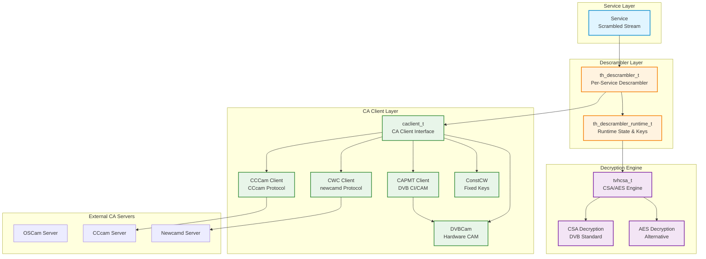
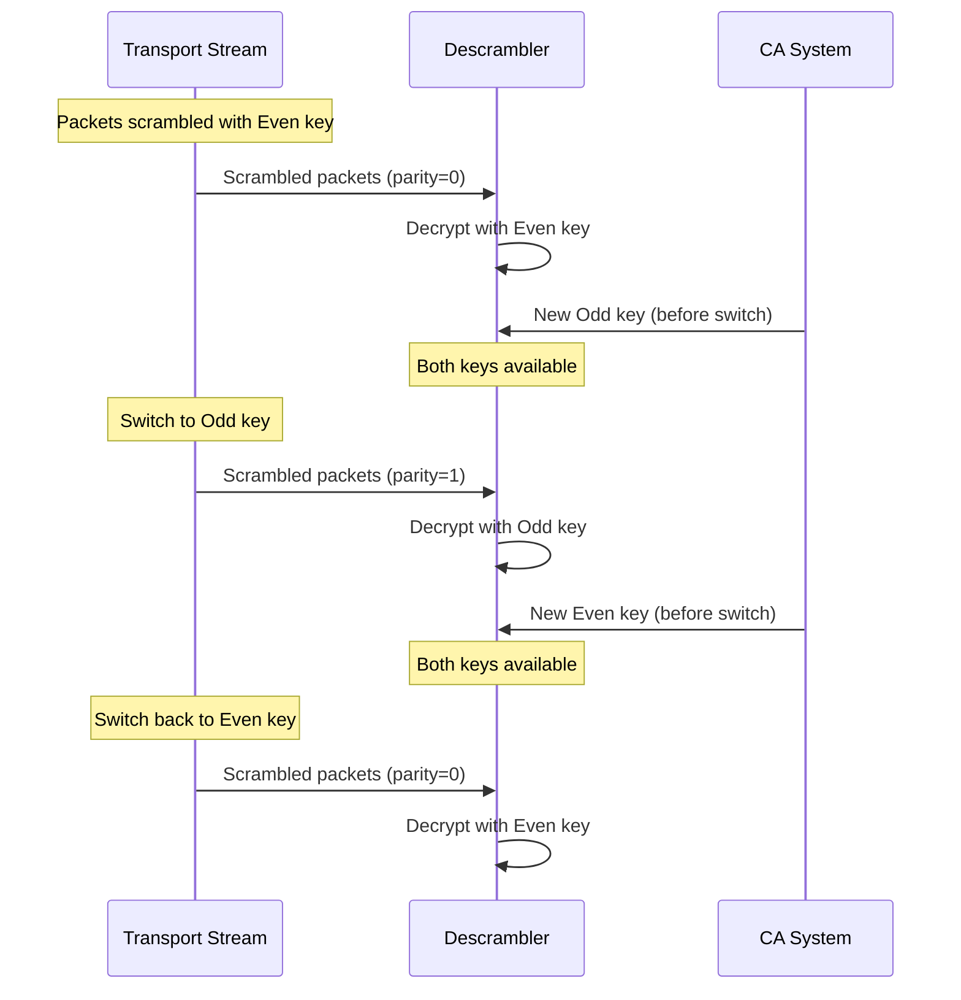
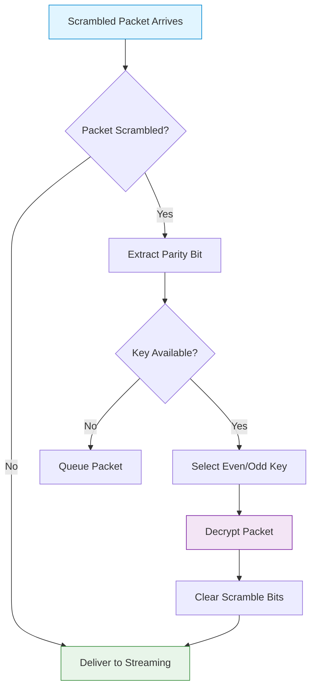
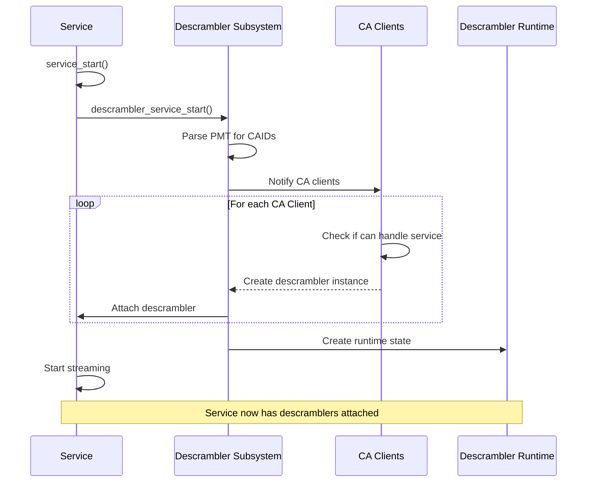
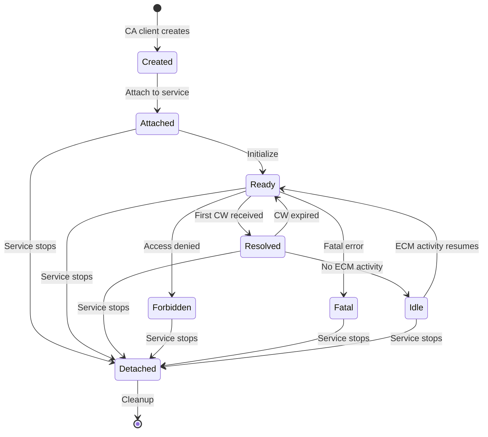

[← Back to Table of Contents](00-TOC.md)

## 14. Descrambler Subsystem

The Descrambler Subsystem is responsible for decrypting encrypted (scrambled) television streams using Conditional Access (CA) systems. It provides a flexible architecture that supports multiple CA client types, handles ECM (Entitlement Control Message) and EMM (Entitlement Management Message) processing, manages control word (CW) delivery, and performs the actual decryption of transport stream packets. This section documents the descrambler architecture, supported CA client types, ECM/EMM handling, key management, and the relationship between descramblers and services.

### 14.1 Descrambler Architecture

The descrambler subsystem uses a layered architecture that separates CA client communication from the actual decryption process. This design allows Tvheadend to support multiple CA systems and decryption algorithms while maintaining a consistent interface to the rest of the system.

#### 14.1.1 Architecture Overview

The descrambler architecture consists of four primary components that work together to provide decryption functionality:



**Component Responsibilities:**

1. **th_descrambler_t**: Per-service descrambler instance
   - Represents the descrambler attached to a service
   - Manages descrambler lifecycle (start, stop, state changes)
   - Provides callbacks for service events (CAID changes, ECM reset)
   - Tracks descrambler state (INIT, READY, RESOLVED, FORBIDDEN, FATAL, IDLE)

2. **th_descrambler_runtime_t**: Runtime state and key management
   - Maintains decryption keys (even/odd control words)
   - Manages packet queue for delayed decryption
   - Tracks ECM timing and key validity
   - Handles key rotation and parity checking
   - Performs actual packet descrambling

3. **caclient_t**: CA client interface
   - Communicates with external CA servers or hardware CAMs
   - Sends ECM/EMM data to CA system
   - Receives control words (CWs) from CA system
   - Manages connection state and error handling
   - Supports multiple CA client types (CWC, CAPMT, CCCam, etc.)

4. **tvhcsa_t**: Decryption engine
   - Implements CSA (Common Scrambling Algorithm) decryption
   - Implements AES decryption (alternative to CSA)
   - Batch processing for performance
   - Hardware acceleration support (when available)
   - Handles both 64-bit and 128-bit keys

#### 14.1.2 th_descrambler Structure

**Location**: `src/descrambler/descrambler.h`, `src/descrambler/descrambler.c`

The `th_descrambler_t` structure is the base class for all descrambler implementations. It represents a descrambler instance attached to a specific service.

**Structure Definition**:
```c
typedef struct th_descrambler {
  LIST_ENTRY(th_descrambler) td_service_link;  // Link in service's descrambler list

  char *td_nicename;                           // Display name for logging

  th_descrambler_keystate_t td_keystate;       // Current key state

  struct service *td_service;                  // Service being descrambled

  // Virtual methods
  void (*td_stop)       (struct th_descrambler *d);
  void (*td_caid_change)(struct th_descrambler *d);
  int  (*td_ecm_reset)  (struct th_descrambler *d);
  void (*td_ecm_idle)   (struct th_descrambler *d);

} th_descrambler_t;
```

**Key Fields**:

1. **`td_service_link`** - Service Linkage
   - Links this descrambler into the service's descrambler list
   - A service can have multiple descramblers (for different CA systems)
   - Managed by `descrambler_service_start()` and `descrambler_service_stop()`

2. **`td_nicename`** - Display Name
   - Human-readable name for logging and UI display
   - Typically includes CA client name and CAID
   - Example: "CWC (Viaccess 0x0500)"

3. **`td_keystate`** - Key State
   - Tracks the current state of the descrambler
   - See "Descrambler States" section below

4. **`td_service`** - Service Pointer
   - Points to the service being descrambled
   - Used to access service properties and streaming pad

**Virtual Methods**:

1. **`td_stop()`** - Stop Descrambler
   - Called when service stops or descrambler is removed
   - Should clean up resources, close connections
   - Must not free the descrambler structure itself

2. **`td_caid_change()`** - CAID Change Notification
   - Called when service's CAID list changes (PMT update)
   - Descrambler should re-evaluate if it can handle the service
   - May trigger ECM PID changes

3. **`td_ecm_reset()`** - Reset ECM Processing
   - Called to reset ECM state (e.g., after tuning failure)
   - Should clear pending ECMs and restart ECM processing
   - Returns 0 on success, negative on error

4. **`td_ecm_idle()`** - ECM Idle Notification
   - Called when no ECM data received for extended period
   - Descrambler may enter idle state or retry

**Descrambler States**:

```c
typedef enum {
    DS_INIT,        // Initializing, not yet ready
    DS_READY,       // Ready to process ECMs
    DS_RESOLVED,    // Successfully descrambling
    DS_FORBIDDEN,   // Access denied by CA system
    DS_FATAL,       // Fatal error, cannot descramble
    DS_IDLE         // Idle, no activity
} th_descrambler_keystate_t;
```

**State Transitions**:
- `DS_INIT` → `DS_READY`: Descrambler initialized and ready
- `DS_READY` → `DS_RESOLVED`: First valid CW received, descrambling active
- `DS_RESOLVED` → `DS_READY`: CW expired, waiting for new CW
- `DS_READY` → `DS_FORBIDDEN`: CA system denied access
- `DS_READY` → `DS_FATAL`: Unrecoverable error occurred
- Any state → `DS_IDLE`: No ECM activity for extended period

**State Change Function**:
```c
void descrambler_change_keystate(th_descrambler_t *t, 
                                 th_descrambler_keystate_t state, 
                                 int lock);
```

**Usage Example**:
```c
// Change to resolved state when first CW received
descrambler_change_keystate(descrambler, DS_RESOLVED, 1);

// Change to forbidden state if access denied
descrambler_change_keystate(descrambler, DS_FORBIDDEN, 1);
```

#### 14.1.3 th_descrambler_runtime Structure

**Location**: `src/descrambler/descrambler.h`, `src/descrambler/descrambler.c`

The `th_descrambler_runtime_t` structure manages the runtime state of descrambling, including key management, packet queuing, and the actual descrambling process.

**Structure Definition**:
```c
typedef struct th_descrambler_runtime {
  th_descrambler_t *dr_descrambler;            // Associated descrambler
  struct service *dr_service;                  // Service being descrambled
  
  // Descrambling function pointer
  int (*dr_descramble)(struct service *t, struct elementary_stream *st,
                       const uint8_t *tsb, int len);
  
  // CA system tracking
  int      dr_ca_count;                        // Number of CA systems
  int      dr_ca_resolved;                     // Number resolved
  int      dr_ca_failed;                       // Number failed
  int      dr_ca_fatal;                        // Number fatal errors
  
  // ECM tracking
  int      dr_ecm_parity;                      // Current ECM parity
  int64_t  dr_ecm_start[2];                    // ECM start time [even/odd]
  int64_t  dr_ecm_last_key_time;               // Last key received time
  int64_t  dr_ecm_key_margin;                  // Key validity margin
  
  // Flags
  uint32_t dr_external:1;                      // External descrambler
  uint32_t dr_skip:1;                          // Skip scrambled packets
  uint32_t dr_quick_ecm:1;                     // Quick ECM mode
  uint32_t dr_key_const:1;                     // Constant CW mode
  uint32_t dr_key_multipid:1;                  // Multi-PID keys
  
  // Error tracking
  int64_t  dr_last_err;                        // Last error time
  int64_t  dr_force_skip;                      // Force skip until time
  
  // Key management
  th_descrambler_key_t dr_keys[DESCRAMBLER_MAX_KEYS];  // Key array
  th_descrambler_key_t *dr_key_last;           // Last used key
  
  // Packet queue
  TAILQ_HEAD(, th_descrambler_data) dr_queue;  // Packet queue
  uint32_t dr_queue_total;                     // Total queued bytes
  
  // Parity checking
  uint32_t dr_paritycheck;                     // Parity check threshold
  uint32_t dr_initial_paritycheck;             // Initial parity check
  
  // Logging rate limiter
  tvhlog_limit_t dr_loglimit_key;              // Key logging rate limit
  
} th_descrambler_runtime_t;
```

**Key Fields**:

1. **`dr_descrambler`** - Descrambler Reference
   - Points to the associated `th_descrambler_t` instance
   - Used to access descrambler properties and methods

2. **`dr_descramble`** - Descrambling Function
   - Function pointer to the actual descrambling implementation
   - Called for each transport stream packet
   - Returns 0 if packet descrambled, 1 if still scrambled, negative on error

3. **`dr_ca_count`, `dr_ca_resolved`, `dr_ca_failed`, `dr_ca_fatal`** - CA System Tracking
   - Tracks the number of CA systems and their states
   - Used to determine overall descrambling status
   - Service is considered descrambled if at least one CA system is resolved

4. **`dr_ecm_parity`** - ECM Parity
   - Tracks current ECM parity (even/odd)
   - Used for key rotation
   - Values: 0 (even), 1 (odd)

5. **`dr_keys[]`** - Key Array
   - Array of descrambler keys (typically 2: even and odd)
   - Each key contains control words and CSA/AES state
   - See "th_descrambler_key Structure" section below

6. **`dr_queue`** - Packet Queue
   - Queue of packets waiting for decryption
   - Packets are queued when keys are not yet available
   - Processed when keys arrive

7. **`dr_paritycheck`** - Parity Check Threshold
   - Number of bytes to check for key parity consistency
   - Prevents premature key switching
   - Typical value: 188 * 10 (10 packets)

**Flags**:

- **`dr_external`**: External descrambler (e.g., hardware CAM)
- **`dr_skip`**: Skip scrambled packets instead of queuing
- **`dr_quick_ecm`**: Quick ECM mode (send ECM immediately without waiting)
- **`dr_key_const`**: Constant CW mode (keys don't change)
- **`dr_key_multipid`**: Multi-PID keys (different keys for different PIDs)

#### 14.1.4 th_descrambler_key Structure

**Location**: `src/descrambler/descrambler.h`

The `th_descrambler_key_t` structure represents a single decryption key (control word) with associated metadata and CSA/AES state.

**Structure Definition**:
```c
typedef struct th_descrambler_key {
  uint8_t  key_data[2][16];      // Control words [even/odd][max 16 bytes]
  tvhcsa_t key_csa;               // CSA/AES engine state
  uint16_t key_pid;               // PID for multi-PID mode
  uint64_t key_interval;          // Key validity interval
  uint64_t key_initial_interval;  // Initial key interval
  int64_t  key_start;             // Key start time
  int64_t  key_timestamp[2];      // Key timestamps [even/odd]
  uint8_t  key_index;             // Key index in array
  uint8_t  key_valid;             // Key validity flags
  uint8_t  key_type_overwritten;  // Key type overwritten flag
  tvhlog_limit_t key_loglimit;    // Logging rate limiter
} th_descrambler_key_t;
```

**Key Fields**:

1. **`key_data[2][16]`** - Control Words
   - Array of control words: [0] = even, [1] = odd
   - Maximum 16 bytes per key (supports both 64-bit and 128-bit keys)
   - Actual key size depends on encryption algorithm (CSA = 8 bytes, AES128 = 16 bytes)

2. **`key_csa`** - CSA/AES Engine
   - Embedded `tvhcsa_t` structure for decryption
   - Contains algorithm-specific state
   - See "tvhcsa_t Structure" section below

3. **`key_pid`** - PID Association
   - PID this key is associated with (for multi-PID mode)
   - 0 if not using multi-PID mode
   - Allows different keys for different PIDs in the same service

4. **`key_interval`** - Key Validity Interval
   - Time interval (in microseconds) that key is valid
   - Used to detect key expiration
   - Typical value: 10-30 seconds

5. **`key_timestamp[2]`** - Key Timestamps
   - Timestamps when even/odd keys were received
   - Used for key expiration checking
   - Index: [0] = even, [1] = odd

6. **`key_valid`** - Key Validity Flags
   - Bitmask indicating which keys are valid
   - Bit 0: even key valid
   - Bit 1: odd key valid

**Key Validity Checking**:

Keys are considered valid if:
1. Key data has been received from CA system
2. Current time is within `key_timestamp + key_interval`
3. Corresponding bit in `key_valid` is set

**Key Rotation**:

DVB streams use odd/even key rotation:
1. Stream starts with even key (parity bit 0)
2. After some time, switches to odd key (parity bit 1)
3. While odd key is active, new even key is sent
4. Stream switches back to even key
5. While even key is active, new odd key is sent
6. Cycle repeats

This allows seamless key changes without interruption.

#### 14.1.5 caclient Structure

**Location**: `src/descrambler/caclient.h`, `src/descrambler/caclient.c`

The `caclient_t` structure is the base class for all CA (Conditional Access) client implementations. It provides a common interface for communicating with various CA systems.

**Structure Definition**:
```c
typedef struct caclient {
  idnode_t cac_id;                             // Configuration node
  TAILQ_ENTRY(caclient) cac_link;              // Link in global CA client list

  int cac_save;                                // Save configuration flag
  int cac_index;                               // Client index
  int cac_enabled;                             // Client enabled flag
  char *cac_name;                              // Client name
  char *cac_comment;                           // User comment
  int cac_status;                              // Connection status

  // Virtual methods
  void (*cac_free)(struct caclient *cac);
  void (*cac_start)(struct caclient *cac, struct service *t);
  void (*cac_conf_changed)(struct caclient *cac);
  void (*cac_cat_update)(struct caclient *cac,
                         struct mpegts_mux *mux,
                         const uint8_t *data, int len);
  void (*cac_caid_update)(struct caclient *cac,
                          struct mpegts_mux *mux,
                          uint16_t caid, uint32_t prov,
                          uint16_t pid, int valid);
} caclient_t;
```

**Key Fields**:

1. **`cac_id`** - Configuration Node
   - Inherits from `idnode_t` for automatic configuration management
   - Enables save/load from disk
   - Provides property introspection for web UI

2. **`cac_enabled`** - Enabled Flag
   - Controls whether this CA client is active
   - Disabled clients don't process services
   - Can be toggled via web UI

3. **`cac_status`** - Connection Status
   - Tracks current connection state
   - Values: NONE, READY, CONNECTED, DISCONNECTED
   - Displayed in web UI

**Virtual Methods**:

1. **`cac_free()`** - Free Resources
   - Called when CA client is being destroyed
   - Should close connections, free memory
   - Must free the caclient structure itself

2. **`cac_start()`** - Start Service
   - Called when a service starts that this CA client can handle
   - Should establish connection to CA server (if not already connected)
   - Should start sending ECMs for the service

3. **`cac_conf_changed()`** - Configuration Changed
   - Called when CA client configuration changes
   - Should apply new settings (reconnect if needed)

4. **`cac_cat_update()`** - CAT Update
   - Called when Conditional Access Table (CAT) is received
   - Contains EMM PID information
   - CA client should start monitoring EMM PIDs

5. **`cac_caid_update()`** - CAID Update
   - Called when service's CAID list changes
   - CA client should evaluate if it can handle the service
   - May trigger ECM PID changes

**CA Client Status**:

```c
typedef enum caclient_status {
  CACLIENT_STATUS_NONE,          // Not initialized
  CACLIENT_STATUS_READY,         // Ready but not connected
  CACLIENT_STATUS_CONNECTED,     // Connected to CA server
  CACLIENT_STATUS_DISCONNECTED   // Disconnected from CA server
} caclient_status_t;
```

**Global CA Client List**:

All CA clients are maintained in a global list:
```c
extern struct caclient_entry_queue caclients;
```

**CA Client Operations**:

```c
// Create CA client from configuration
caclient_t *cac = caclient_create(uuid, conf, save);

// Start CA client for service
caclient_start(service);

// Set CA client status
caclient_set_status(cac, CACLIENT_STATUS_CONNECTED);

// Get CA client status string
const char *status = caclient_get_status(cac);

// Iterate all CA clients
caclient_foreach(callback_function);
```

#### 14.1.6 tvhcsa Structure

**Location**: `src/descrambler/tvhcsa.h`, `src/descrambler/tvhcsa.c`

The `tvhcsa_t` structure implements the actual decryption engine, supporting both CSA (Common Scrambling Algorithm) and AES decryption.

**Structure Definition**:
```c
typedef struct tvhcsa {
  // Algorithm configuration
  int      csa_type;                           // Decryption algorithm type
  int      csa_keylen;                         // Key length in bytes
  
  // Function pointers
  void   (*csa_descramble)(struct tvhcsa *csa, struct mpegts_service *s,
                           const uint8_t *tsb, int len);
  void   (*csa_flush)(struct tvhcsa *csa, struct mpegts_service *s);
  
  // Batch processing
  int      csa_cluster_size;                   // Cluster size for batch
  uint8_t *csa_tsbcluster;                     // Cluster buffer
  int      csa_fill;                           // Current fill level
  int      csa_fill_size;                      // Fill size threshold
  uint8_t  csa_ecm;                            // ECM flag
  
#if ENABLE_DVBCSA
  // DVB-CSA specific (batch processing)
  struct dvbcsa_bs_batch_s *csa_tsbbatch_even; // Even key batch
  struct dvbcsa_bs_batch_s *csa_tsbbatch_odd;  // Odd key batch
  int csa_fill_even;                           // Even batch fill
  int csa_fill_odd;                            // Odd batch fill
  
  struct dvbcsa_bs_key_s *csa_key_even;        // Even key state
  struct dvbcsa_bs_key_s *csa_key_odd;         // Odd key state
#endif
  
  void *csa_priv;                              // Private data
  tvhlog_limit_t tvhcsa_loglimit;              // Logging rate limiter
  
} tvhcsa_t;
```

**Decryption Algorithm Types**:

```c
#define DESCRAMBLER_NONE        0   // No descrambling
#define DESCRAMBLER_CSA_CBC     1   // CSA (DVB standard)
#define DESCRAMBLER_DES_NCB     2   // DES (no block cipher mode)
#define DESCRAMBLER_AES_ECB     3   // AES-ECB (64-bit key)
#define DESCRAMBLER_AES128_ECB  16  // AES-ECB (128-bit key)
```

**Key Operations**:

```c
// Initialize CSA engine
void tvhcsa_init(tvhcsa_t *csa);

// Set decryption algorithm type
int tvhcsa_set_type(tvhcsa_t *csa, struct mpegts_service *s, int type);

// Set even key
void tvhcsa_set_key_even(tvhcsa_t *csa, const uint8_t *even);

// Set odd key
void tvhcsa_set_key_odd(tvhcsa_t *csa, const uint8_t *odd);

// Destroy CSA engine
void tvhcsa_destroy(tvhcsa_t *csa);
```

**Batch Processing**:

For performance, tvhcsa uses batch processing:
1. Accumulate multiple packets in a batch
2. Descramble entire batch at once
3. Reduces per-packet overhead
4. Enables SIMD optimizations (SSE2, AVX2, etc.)

**Typical batch size**: 32-128 packets

**CSA vs AES**:

- **CSA (Common Scrambling Algorithm)**:
  - DVB standard encryption
  - 64-bit keys (8 bytes)
  - Block cipher with stream cipher
  - Widely supported by hardware

- **AES (Advanced Encryption Standard)**:
  - Alternative to CSA
  - 64-bit or 128-bit keys
  - ECB mode (Electronic Codebook)
  - Faster in software, less hardware support

**Hardware Acceleration**:

When available, tvhcsa can use:
- **libdvbcsa**: Optimized CSA implementation with SIMD support
- **OpenSSL**: Hardware-accelerated AES (AES-NI on x86)
- **Custom implementations**: Platform-specific optimizations

### 14.2 Supported CA Client Types

Tvheadend supports multiple CA (Conditional Access) client types, each implementing a different protocol for communicating with CA servers or hardware. This section documents the major CA client implementations, their protocols, and configuration.

#### 14.2.1 CWC (Code Word Client) - newcamd Protocol

**Location**: `src/descrambler/cwc.c`

The CWC client implements the newcamd protocol, a popular protocol for communicating with card sharing servers. It's one of the most widely used CA client types in Tvheadend.

**Protocol**: newcamd (TCP-based, encrypted)

**Key Features**:
- **Network-based**: Connects to remote newcamd servers over TCP
- **Encryption**: Uses DES encryption for protocol security
- **Multiple CAIDs**: Single connection can handle multiple CA systems
- **Efficient**: Low overhead, fast ECM response times
- **Widely supported**: Compatible with OSCam, mgcamd, and other servers

**Configuration Parameters**:
- **Hostname**: Server address (IP or hostname)
- **Port**: Server port (typically 10000-10100)
- **Username**: Authentication username
- **Password**: Authentication password (DES key)
- **DES Key**: 14-character hexadecimal DES key
- **Update Period**: How often to update EMM (0 = never)
- **Enabled**: Enable/disable this client

**Connection Process**:
1. **TCP Connect**: Establish TCP connection to server
2. **Login**: Send login message with username/password
3. **CAID Negotiation**: Exchange supported CAID list
4. **ECM Processing**: Send ECMs, receive control words
5. **Keep-Alive**: Periodic keep-alive messages
6. **Disconnect**: Clean disconnect on service stop

**ECM Flow**:
```
1. Service receives scrambled packets
2. ECM extracted from stream
3. CWC client sends ECM to newcamd server
4. Server processes ECM (queries card/emulator)
5. Server returns control words (even/odd)
6. CWC client delivers CWs to descrambler
7. Descrambler decrypts packets
```

**Advantages**:
- Mature, well-tested protocol
- Wide server compatibility
- Good performance
- Supports multiple services per connection

**Limitations**:
- Requires external newcamd server
- Network latency affects ECM response time
- DES encryption is weak by modern standards

**Typical Use Case**: Home users connecting to OSCam server running on another device

#### 14.2.2 CAPMT (CA Program Management Table)

**Location**: `src/descrambler/capmt.c`

The CAPMT client implements the DVB Common Interface (CI) protocol, allowing Tvheadend to communicate with software CA implementations like OSCam's CAPMT mode.

**Protocol**: CAPMT (Unix socket or TCP)

**Key Features**:
- **Local or network**: Unix socket for local, TCP for remote
- **DVB CI standard**: Based on DVB Common Interface specification
- **PMT-based**: Sends Program Map Table (PMT) to CA application
- **Flexible**: Supports various CA applications
- **Low latency**: Direct communication, no network overhead (Unix socket)

**Configuration Parameters**:
- **Socket File**: Path to Unix socket (e.g., `/tmp/camd.socket`)
- **TCP Mode**: Use TCP instead of Unix socket
- **Hostname**: Server address (TCP mode)
- **Port**: Server port (TCP mode)
- **CA Device**: CA device number (for multiple devices)
- **Enabled**: Enable/disable this client

**Communication Modes**:

1. **Unix Socket Mode** (default):
   - Direct IPC with local CA application
   - Lowest latency
   - Most common configuration
   - Example: OSCam with `--capmt-oscam` option

2. **TCP Mode**:
   - Network communication with remote CA application
   - Higher latency but more flexible
   - Useful for distributed setups

**CAPMT Message Format**:
```
CAPMT message contains:
- List tag (0x9F8032)
- CA PMT command (OK_DESCRAMBLING, QUERY, etc.)
- Program number
- CA system IDs
- ECM PIDs
- Elementary stream info
```

**ECM Flow**:
1. Service starts, PMT received
2. CAPMT client builds CAPMT message from PMT
3. CAPMT message sent to CA application
4. CA application processes ECMs internally
5. CA application returns control words via CAPMT
6. CAPMT client delivers CWs to descrambler

**Advantages**:
- Standard DVB protocol
- Very low latency (Unix socket)
- Efficient for multiple services
- Well-supported by OSCam

**Limitations**:
- Requires compatible CA application
- Configuration can be complex
- Limited to local or trusted network

**Typical Use Case**: OSCam running on same machine as Tvheadend

#### 14.2.3 CCCam Protocol

**Location**: `src/descrambler/cccam.c`

The CCCam client implements the CCcam protocol, another popular card sharing protocol with its own unique features.

**Protocol**: CCcam (TCP-based, proprietary)

**Key Features**:
- **Network-based**: Connects to CCcam servers
- **Proprietary protocol**: CCcam-specific protocol
- **Node sharing**: Supports CCcam's node sharing concept
- **Multiple hops**: Can traverse multiple server hops
- **ECM caching**: Servers cache ECM responses

**Configuration Parameters**:
- **Hostname**: Server address
- **Port**: Server port (typically 12000-12100)
- **Username**: Authentication username
- **Password**: Authentication password
- **Enabled**: Enable/disable this client

**Connection Process**:
1. **TCP Connect**: Establish connection
2. **Handshake**: Exchange protocol version and capabilities
3. **Authentication**: Send username/password
4. **Card Data**: Receive available card information
5. **ECM Processing**: Send ECMs, receive CWs
6. **Keep-Alive**: Periodic keep-alive

**Unique Features**:
- **Node Information**: Receives information about server's upstream nodes
- **Hop Count**: Tracks number of hops to actual card
- **Share Lists**: Receives list of available CAIDs and providers
- **ECM Statistics**: Detailed ECM timing information

**Advantages**:
- Large CCcam server network
- Good for multi-provider setups
- Detailed statistics and diagnostics
- Efficient protocol

**Limitations**:
- Proprietary protocol
- Requires CCcam server
- More complex than newcamd
- Network-dependent

**Typical Use Case**: Users with CCcam server subscriptions

#### 14.2.4 ConstCW (Constant Control Word)

**Location**: `src/descrambler/constcw.c`

The ConstCW client allows manual entry of fixed control words, useful for testing, free-to-air encrypted channels, or channels with known static keys.

**Protocol**: None (local configuration)

**Key Features**:
- **No server required**: Keys configured locally
- **Static keys**: Keys don't change
- **Testing**: Useful for development and testing
- **FTA encrypted**: Some FTA channels use fixed keys
- **Multiple algorithms**: Supports CSA, DES, AES

**Configuration Parameters**:
- **CAID**: CA system ID (for identification)
- **Provider ID**: Provider ID (optional)
- **Even CW**: Even control word (hexadecimal)
- **Odd CW**: Odd control word (hexadecimal)
- **Encryption Type**: CSA, DES, AES-ECB, or AES128-ECB
- **Enabled**: Enable/disable this client

**Control Word Format**:
- **CSA**: 16 hexadecimal characters (8 bytes)
  - Example: `0123456789ABCDEF`
- **AES-128**: 32 hexadecimal characters (16 bytes)
  - Example: `0123456789ABCDEF0123456789ABCDEF`

**Use Cases**:

1. **Testing**: Test descrambling without CA server
2. **Development**: Develop descrambler features
3. **FTA Encrypted**: Channels with published keys
4. **Educational**: Learn about DVB encryption

**Advantages**:
- No external dependencies
- Zero latency
- Simple configuration
- Useful for testing

**Limitations**:
- Only works with static keys
- Not suitable for commercial channels
- Keys must be known in advance
- No key rotation

**Example Configuration**:
```
CAID: 0x0500 (Viaccess)
Even CW: 0123456789ABCDEF
Odd CW: FEDCBA9876543210
Type: CSA-CBC
```

#### 14.2.5 DVBCam (Hardware CAM)

**Location**: `src/descrambler/dvbcam.c`, `src/descrambler/dvbcam.h`

The DVBCam client interfaces with hardware CAM (Conditional Access Module) devices via the DVB Common Interface (CI).

**Protocol**: DVB Common Interface (kernel driver)

**Key Features**:
- **Hardware-based**: Uses physical CAM modules
- **DVB CI**: Standard DVB Common Interface
- **Kernel driver**: Communicates via Linux DVB API
- **Multiple CAMs**: Supports multiple CAM slots
- **Official cards**: Works with official subscriber cards

**Configuration Parameters**:
- **Adapter**: DVB adapter number
- **CA Device**: CA device number (typically 0)
- **Enabled**: Enable/disable this client

**Hardware Requirements**:
- DVB adapter with CI slot
- Compatible CAM module
- Valid subscriber card (inserted in CAM)
- Linux DVB drivers with CI support

**Communication Flow**:
1. **CAM Detection**: Detect CAM module in CI slot
2. **CAM Initialization**: Initialize CAM via CI protocol
3. **PMT Delivery**: Send PMT to CAM
4. **ECM Processing**: CAM processes ECMs internally
5. **Descrambling**: CAM descrambles in hardware OR returns CWs
6. **Status Monitoring**: Monitor CAM status

**Descrambling Modes**:

1. **Hardware Descrambling**:
   - CAM descrambles packets in hardware
   - Tvheadend receives clear packets
   - Lowest CPU usage
   - Limited to CAM's capabilities

2. **Software Descrambling**:
   - CAM returns control words
   - Tvheadend descrambles in software
   - More flexible
   - Higher CPU usage

**Advantages**:
- Official, legal solution
- No network dependency
- Low latency
- Hardware acceleration (some CAMs)
- Supports all features of card

**Limitations**:
- Requires specific hardware
- CAM and card costs
- Limited to one service per CAM (typically)
- Hardware compatibility issues

**Typical Use Case**: Users with official subscriptions and compatible hardware

#### 14.2.6 CA Client Comparison

| Feature | CWC | CAPMT | CCCam | ConstCW | DVBCam |
|---------|-----|-------|-------|---------|--------|
| **Protocol** | newcamd | CAPMT | CCcam | None | DVB CI |
| **Connection** | Network | Socket/Network | Network | Local | Hardware |
| **Latency** | Medium | Low | Medium | Zero | Low |
| **Setup Complexity** | Medium | Medium | Medium | Low | High |
| **External Dependency** | Server | CA App | Server | None | Hardware |
| **Multi-Service** | Yes | Yes | Yes | Yes | Limited |
| **Cost** | Server sub | Free (OSCam) | Server sub | Free | Hardware |
| **Legality** | Varies | Varies | Varies | Varies | Legal |
| **Best For** | Card sharing | Local OSCam | CCcam network | Testing | Official subs |

**Selection Criteria**:

Choose based on your setup:
- **Have official subscription + hardware**: DVBCam
- **Running OSCam locally**: CAPMT
- **Have newcamd server**: CWC
- **Have CCcam server**: CCCam
- **Testing/development**: ConstCW

### 14.3 ECM/EMM Handling

ECM (Entitlement Control Message) and EMM (Entitlement Management Message) are critical components of conditional access systems. This section documents how Tvheadend extracts, processes, and forwards these messages to CA clients.

#### 14.3.1 ECM (Entitlement Control Message) Overview

**Purpose**: ECMs contain the encrypted control words needed to descramble the service.

**Characteristics**:
- **Service-specific**: Each service has its own ECM stream
- **Frequent updates**: Typically every 10-30 seconds
- **Time-critical**: Must be processed quickly to avoid interruption
- **PID-based**: Transmitted on specific PIDs in the transport stream
- **Encrypted**: Control words are encrypted with card/system keys

**ECM Structure** (simplified):
```
ECM Packet:
- Table ID: 0x80 or 0x81 (even/odd parity)
- Section length
- CA system ID (CAID)
- Encrypted control words
- Checksum
```

**ECM Parity**:
- **Even ECM** (0x80): Contains even control word
- **Odd ECM** (0x81): Contains odd control word
- Alternates to enable seamless key rotation

#### 14.3.2 ECM Extraction from Stream

**Location**: `src/descrambler/descrambler.c`, `src/input/mpegts/tsdemux.c`

ECMs are extracted from the transport stream during packet processing.

**Extraction Process**:

1. **PMT Analysis**: When PMT (Program Map Table) is received:
   - Parse CA descriptors
   - Extract ECM PIDs for the service
   - Identify CA system IDs (CAIDs)
   - Register ECM PIDs for monitoring

2. **PID Filtering**: For each ECM PID:
   - Open table filter via `descrambler_open_pid()`
   - Configure for PSI/SI table reception
   - Set callback for ECM data

3. **Table Reception**: When ECM table arrives:
   - Reassemble table from TS packets
   - Validate table structure
   - Extract ECM data
   - Invoke registered callback

4. **ECM Delivery**: Callback function:
   - Receives complete ECM data
   - Forwards to appropriate CA client(s)
   - Tracks ECM timing

**ECM PID Registration**:

```c
// Open ECM PID for monitoring
int descrambler_open_pid(struct mpegts_mux *mux, void *opaque, int pid,
                         descrambler_section_callback_t callback,
                         struct service *service);

// Callback signature
typedef void (*descrambler_section_callback_t)
  (void *opaque, int pid, const uint8_t *section, int section_len, int emm);
```

**ECM Callback Flow**:
```
1. Table filter receives ECM packet
2. Reassemble complete ECM table
3. Invoke callback with ECM data
4. Callback forwards ECM to CA client
5. CA client sends ECM to server/card
6. Server/card returns control words
7. Control words delivered to descrambler
```

**ECM Timing**:

Critical timing considerations:
- **ECM arrival**: When ECM is received from stream
- **ECM send**: When ECM is sent to CA server
- **CW arrival**: When control words are received
- **Key margin**: Time before key expires
- **ECM interval**: Time between ECM updates

**Typical timing**:
- ECM interval: 10-30 seconds
- ECM processing: 200-500ms
- Key margin: 5-10 seconds before expiration

#### 14.3.3 ECM Forwarding to CA Client

**Location**: `src/descrambler/caclient.c`, CA client implementations

Once extracted, ECMs are forwarded to CA clients for processing.

**Forwarding Process**:

1. **CA Client Selection**:
   - Match CAID from ECM with CA client capabilities
   - Check if CA client is enabled and connected
   - Select appropriate CA client (may be multiple)

2. **ECM Preparation**:
   - Extract ECM data from table
   - Determine ECM parity (even/odd)
   - Add service context information

3. **ECM Transmission**:
   - Send ECM to CA client
   - CA client forwards to server/card
   - Track ECM send time for statistics

4. **Response Handling**:
   - Wait for control word response
   - Validate control words
   - Deliver to descrambler runtime
   - Update key timestamps

**ECM Deduplication**:

To avoid redundant processing:
- Track last ECM data sent
- Compare new ECM with last ECM
- Skip if identical (no change)
- Send if different (key rotation)

**Quick ECM Mode**:

For low-latency scenarios:
- Send ECM immediately without waiting
- Don't wait for key expiration
- Reduces latency but increases server load
- Configurable per CA system

**ECM Statistics**:

Tracked metrics:
- **ECM count**: Total ECMs processed
- **ECM time**: Average ECM response time
- **ECM errors**: Failed ECM requests
- **Key changes**: Number of key rotations

#### 14.3.4 EMM (Entitlement Management Message) Overview

**Purpose**: EMMs update the subscriber card's entitlements and keys.

**Characteristics**:
- **Card-specific**: Addressed to specific cards or groups
- **Infrequent**: Updates every few hours or days
- **Not time-critical**: Can be processed with delay
- **Mux-wide**: Transmitted on mux, not service-specific
- **Various types**: Unique, shared, global EMMs

**EMM Types**:

1. **Unique EMM**: Addressed to single card (by serial number)
2. **Shared EMM**: Addressed to group of cards (by group ID)
3. **Global EMM**: Addressed to all cards in system

**EMM Structure** (simplified):
```
EMM Packet:
- Table ID: 0x82-0x8F (various EMM types)
- Section length
- CA system ID (CAID)
- Card addressing information
- Encrypted update data
- Checksum
```

#### 14.3.5 EMM Handling

**Location**: `src/descrambler/descrambler.c`, `src/descrambler/emm_reass.c`

EMM handling is more complex than ECM due to addressing and filtering requirements.

**EMM Processing Flow**:

1. **CAT Reception**: Conditional Access Table (CAT) received:
   - Parse CA descriptors
   - Extract EMM PIDs
   - Identify CA systems
   - Register EMM PIDs

2. **EMM PID Monitoring**:
   - Open EMM PIDs via `descrambler_open_emm()`
   - Filter by CAID and provider
   - Set callback for EMM data

3. **EMM Filtering**:
   - Receive EMM tables
   - Check addressing (card serial, group ID)
   - Filter out irrelevant EMMs
   - Forward relevant EMMs to CA client

4. **EMM Delivery**:
   - CA client receives EMM
   - Forward to server/card
   - Card updates entitlements
   - No immediate response expected

**EMM PID Registration**:

```c
// Open EMM PID for monitoring
int descrambler_open_emm(struct mpegts_mux *mux, void *opaque,
                         int caid, int provid,
                         descrambler_section_callback_t callback);

// Close EMM PID
int descrambler_close_emm(struct mpegts_mux *mux, void *opaque,
                          int caid, int provid);
```

**EMM Filtering Criteria**:

CA clients specify which EMMs they want:
- **CAID**: CA system ID (e.g., 0x0500 for Viaccess)
- **Provider ID**: Provider ID (e.g., 0x012345)
- **Card serial**: Specific card serial number (for unique EMMs)
- **Group ID**: Group identifier (for shared EMMs)

**EMM Reassembly**:

EMMs may span multiple sections:
- Reassemble multi-section EMMs
- Handle section numbering
- Validate complete EMM
- Deliver when complete

**EMM Update Frequency**:

Configurable per CA client:
- **Never**: Don't process EMMs (faster, but card may expire)
- **Hourly**: Process EMMs every hour
- **Daily**: Process EMMs once per day
- **Always**: Process all EMMs immediately

**EMM vs ECM Comparison**:

| Aspect | ECM | EMM |
|--------|-----|-----|
| **Purpose** | Decrypt service | Update card |
| **Frequency** | Every 10-30 sec | Hours/days |
| **Criticality** | Time-critical | Not critical |
| **Scope** | Service-specific | Mux-wide |
| **Response** | Control words | No response |
| **Size** | Small (few bytes) | Larger (varies) |
| **Processing** | Must be fast | Can be delayed |

#### 14.3.6 PID Filtering and Management

**Location**: `src/descrambler/descrambler.c`

Tvheadend manages ECM and EMM PIDs dynamically based on service and mux state.

**PID Lifecycle**:

1. **PID Opening**:
   - Service starts or PMT/CAT received
   - Extract ECM/EMM PIDs
   - Register PIDs with input subsystem
   - Set up table filters

2. **PID Monitoring**:
   - Input subsystem delivers packets for registered PIDs
   - Table reassembly
   - Callback invocation
   - Data forwarding to CA clients

3. **PID Closing**:
   - Service stops or PMT/CAT changes
   - Unregister PIDs
   - Clean up table filters
   - Stop monitoring

**PID Table Management**:

Tvheadend maintains tables for tracking:
- **descrambler_table_t**: Per-PID table state
- **descrambler_section_t**: Per-section callback
- **descrambler_ecmsec_t**: ECM section tracking

**PID Filtering Optimization**:

To reduce overhead:
- Only open PIDs for enabled CA clients
- Close unused PIDs promptly
- Share PIDs between services when possible
- Use hardware PID filtering when available

**CAT (Conditional Access Table) Processing**:

```c
// Called when CAT is received
void descrambler_cat_data(struct mpegts_mux *mux, 
                          const uint8_t *data, int len);
```

**CAT contains**:
- List of CA systems on mux
- EMM PIDs for each CA system
- Provider information
- CA system descriptors

**PMT (Program Map Table) Processing**:

PMT contains service-specific CA information:
- ECM PIDs for service
- CA system IDs (CAIDs)
- Provider IDs
- CA descriptors

**Dynamic PID Updates**:

When PMT or CAT changes:
1. Parse new table
2. Compare with previous state
3. Close removed PIDs
4. Open new PIDs
5. Notify CA clients of changes

This ensures Tvheadend adapts to:
- Service configuration changes
- CA system changes
- Provider changes
- Mux reconfiguration

### 14.4 Key Management and Decryption

Key management is the core of the descrambling process, handling control word (CW) delivery, key rotation, validity tracking, and the actual decryption of transport stream packets.

#### 14.4.1 Control Word (CW) Handling

**Location**: `src/descrambler/descrambler.c`

Control words are the cryptographic keys used to decrypt scrambled transport stream packets.

**Control Word Characteristics**:
- **Size**: 8 bytes (64 bits) for CSA, 16 bytes (128 bits) for AES-128
- **Parity**: Two keys - even and odd
- **Lifetime**: Typically 10-30 seconds
- **Rotation**: Keys alternate to enable seamless transitions
- **Delivery**: Received from CA server/card in response to ECM

**Control Word Delivery Function**:

```c
void descrambler_keys(th_descrambler_t *t, int type, uint16_t pid,
                      const uint8_t *even, const uint8_t *odd);
```

**Parameters**:
- `t`: Descrambler instance
- `type`: Encryption type (CSA, AES, etc.)
- `pid`: PID for multi-PID mode (0 for single-PID)
- `even`: Even control word (8 or 16 bytes)
- `odd`: Odd control word (8 or 16 bytes)

**CW Delivery Process**:

1. **CA Client Receives CWs**: From server/card
2. **Validation**: Check CW format and size
3. **Type Detection**: Determine encryption algorithm
4. **Key Storage**: Store in `th_descrambler_key_t` structure
5. **CSA/AES Setup**: Configure decryption engine
6. **Timestamp**: Record key arrival time
7. **State Update**: Update descrambler state to DS_RESOLVED
8. **Notification**: Notify service of successful descrambling

**CW Validation**:

Before accepting control words:
- Check key size matches algorithm
- Verify keys are not all zeros (invalid)
- Validate parity (even/odd)
- Check timing (not too early/late)

**CW Storage**:

Control words are stored in `th_descrambler_key_t`:
```c
typedef struct th_descrambler_key {
  uint8_t  key_data[2][16];      // [even/odd][max 16 bytes]
  tvhcsa_t key_csa;               // CSA/AES engine
  uint16_t key_pid;               // PID (multi-PID mode)
  int64_t  key_timestamp[2];      // Timestamps [even/odd]
  uint64_t key_interval;          // Validity interval
  uint8_t  key_valid;             // Validity flags
  // ... additional fields
} th_descrambler_key_t;
```

#### 14.4.2 Odd/Even Key Rotation

**Purpose**: Enable seamless key changes without service interruption.

**Rotation Mechanism**:

DVB uses a two-key system with alternating parity:



**Key Rotation Steps**:

1. **Initial State**: Stream uses Even key (parity bit 0)
2. **Odd Key Delivery**: CA system sends new Odd key
3. **Both Keys Available**: Descrambler has both Even and Odd
4. **Parity Switch**: Stream switches to Odd key (parity bit 1)
5. **Seamless Transition**: No interruption, Odd key already loaded
6. **Even Key Delivery**: CA system sends new Even key
7. **Cycle Repeats**: Stream switches back to Even key

**Parity Bit Detection**:

Transport stream packets indicate which key to use:
```c
// Extract parity from TS packet
uint8_t scrambling_control = tsb[3] & 0xC0;

if (scrambling_control == 0x80) {
  // Even key (parity 0)
  use_even_key();
} else if (scrambling_control == 0xC0) {
  // Odd key (parity 1)
  use_odd_key();
} else {
  // Not scrambled (0x00) or reserved (0x40)
}
```

**Parity Bits**:
- `0x00` (00): Not scrambled
- `0x40` (01): Reserved (user-defined)
- `0x80` (10): Scrambled with even key
- `0xC0` (11): Scrambled with odd key

**Parity Checking**:

To prevent premature key switching:
- Check multiple packets for consistent parity
- Configurable threshold (e.g., 10 packets)
- Prevents false switches due to errors
- Ensures stable key selection

**ECM Parity Modes**:

Different CA systems use different ECM parity conventions:
- **Standard** (default): 0x80 = even, 0x81 = odd
- **Inverted**: 0x81 = even, 0x80 = odd
- **Auto-detect**: Determine from stream behavior

#### 14.4.3 CSA Decryption

**Location**: `src/descrambler/tvhcsa.c`, `src/descrambler/algo/`

CSA (Common Scrambling Algorithm) is the standard DVB encryption algorithm.

**CSA Algorithm**:
- **Block cipher**: 64-bit block size
- **Stream cipher**: Additional stream cipher layer
- **Key size**: 64 bits (8 bytes)
- **DVB standard**: EN 300 468

**CSA Implementation**:

Tvheadend supports multiple CSA implementations:

1. **libdvbcsa** (preferred):
   - Optimized implementation
   - SIMD support (SSE2, AVX2, NEON)
   - Batch processing
   - Best performance

2. **FFdecsa**:
   - Alternative implementation
   - Various optimization levels
   - Platform-specific code

3. **Software fallback**:
   - Pure C implementation
   - Portable but slower
   - Used when optimized versions unavailable

**CSA Batch Processing**:

For performance, CSA processes multiple packets at once:

```c
// Batch structure
struct dvbcsa_bs_batch_s {
  uint8_t *data;      // Pointer to packet data
  unsigned int len;   // Packet length
};

// Process batch
dvbcsa_bs_decrypt(key, batch, num_packets);
```

**Batch Processing Flow**:

1. **Accumulate Packets**: Collect packets in batch buffer
2. **Check Batch Size**: Wait until batch is full or timeout
3. **Decrypt Batch**: Process entire batch at once
4. **Deliver Packets**: Forward decrypted packets to streaming

**Typical batch size**: 32-128 packets

**CSA Performance**:

Factors affecting performance:
- **CPU**: SIMD instructions (SSE2, AVX2) provide 4-8x speedup
- **Batch size**: Larger batches amortize overhead
- **Key changes**: Frequent key changes reduce batch efficiency
- **Packet rate**: Higher rates benefit more from batching

**CSA Key Setup**:

```c
// Set even key
void tvhcsa_set_key_even(tvhcsa_t *csa, const uint8_t *even) {
  memcpy(csa->csa_key_data[0], even, 8);
  dvbcsa_bs_key_set(even, csa->csa_key_even);
}

// Set odd key
void tvhcsa_set_key_odd(tvhcsa_t *csa, const uint8_t *odd) {
  memcpy(csa->csa_key_data[1], odd, 8);
  dvbcsa_bs_key_set(odd, csa->csa_key_odd);
}
```

#### 14.4.4 AES Decryption

**Location**: `src/descrambler/tvhcsa.c`

AES (Advanced Encryption Standard) is an alternative to CSA, used by some CA systems.

**AES Modes**:

Tvheadend supports two AES modes:

1. **AES-ECB (64-bit key)**:
   - Electronic Codebook mode
   - 8-byte keys (same as CSA)
   - Less common

2. **AES-ECB (128-bit key)**:
   - Electronic Codebook mode
   - 16-byte keys
   - More secure than 64-bit

**AES Implementation**:

Uses OpenSSL for AES:
```c
#include <openssl/aes.h>

// AES key structure
AES_KEY aes_key;

// Set key
AES_set_decrypt_key(key_data, key_bits, &aes_key);

// Decrypt block
AES_decrypt(input, output, &aes_key);
```

**AES vs CSA**:

| Aspect | CSA | AES |
|--------|-----|-----|
| **Standard** | DVB-specific | NIST standard |
| **Key size** | 64 bits | 64 or 128 bits |
| **Security** | Adequate | Higher (128-bit) |
| **Performance** | Fast (SIMD) | Fast (AES-NI) |
| **Hardware support** | DVB hardware | CPU instructions |
| **Usage** | Most DVB | Some CA systems |

**AES Hardware Acceleration**:

Modern CPUs support AES-NI instructions:
- **Intel**: AES-NI (since 2010)
- **AMD**: AES instructions (since 2010)
- **ARM**: AES extension (ARMv8)

OpenSSL automatically uses AES-NI when available, providing significant speedup.

#### 14.4.5 Key Validity Tracking

**Location**: `src/descrambler/descrambler.c`

Keys have limited validity periods and must be refreshed before expiration.

**Key Validity Factors**:

1. **Key Interval**: Time key is valid (from CA system)
2. **Key Timestamp**: When key was received
3. **Current Time**: Current monotonic time
4. **Key Margin**: Safety margin before expiration

**Validity Calculation**:

```c
// Check if key is valid
int64_t now = mclk();  // Current monotonic time
int64_t key_age = now - key->key_timestamp[parity];
int64_t key_remaining = key->key_interval - key_age;

if (key_remaining > key_margin) {
  // Key is valid
  return 1;
} else {
  // Key expired or expiring soon
  return 0;
}
```

**Key Expiration Handling**:

When key expires:
1. **Warning**: Log warning about key expiration
2. **ECM Request**: Request new ECM if not already pending
3. **Packet Queuing**: Queue packets waiting for new key
4. **Timeout**: If no key after timeout, skip packets or fail
5. **State Change**: Update descrambler state

**Key Margin**:

Safety margin before key expiration:
- **Purpose**: Ensure new key arrives before old expires
- **Typical value**: 5-10 seconds
- **Configurable**: Can be adjusted per CA system
- **Trade-off**: Larger margin = more safety but earlier ECM requests

**Key Interval Detection**:

Key interval can be:
- **Explicit**: Provided by CA system
- **Measured**: Calculated from key change timing
- **Default**: Use default value (e.g., 10 seconds)
- **Adaptive**: Adjust based on observed behavior

**Multi-PID Key Management**:

Some services use different keys for different PIDs:
- **Video PID**: One set of keys
- **Audio PIDs**: Different keys
- **Subtitle PIDs**: Yet different keys

Tvheadend supports this via `dr_key_multipid` flag and per-PID key tracking.

#### 14.4.6 Packet Descrambling Process

**Location**: `src/descrambler/descrambler.c`

The actual packet descrambling process integrates all the components.

**Descrambling Flow**:



**Descrambling Function**:

```c
int descrambler_descramble(struct service *t,
                           struct elementary_stream *st,
                           const uint8_t *tsb, int len)
{
  th_descrambler_runtime_t *dr = t->s_descrambler_runtime;
  uint8_t scrambling_control;
  int parity;
  
  // Check if packet is scrambled
  scrambling_control = tsb[3] & 0xC0;
  if (scrambling_control == 0x00 || scrambling_control == 0x40) {
    // Not scrambled, pass through
    return 0;
  }
  
  // Determine parity (even=0, odd=1)
  parity = (scrambling_control == 0xC0) ? 1 : 0;
  
  // Check if key is available and valid
  if (!key_is_valid(dr, parity)) {
    // Queue packet for later processing
    descrambler_data_append(dr, tsb, len);
    return 1;  // Still scrambled
  }
  
  // Decrypt packet
  descramble_packet(dr, tsb, len, parity);
  
  // Clear scrambling control bits
  ((uint8_t *)tsb)[3] &= 0x3F;
  
  return 0;  // Successfully descrambled
}
```

**Packet Queuing**:

When keys are not available:
1. **Queue Packet**: Store in `dr_queue`
2. **Track Size**: Monitor queue size
3. **Limit Queue**: Prevent unbounded growth
4. **Process on Key**: Decrypt queued packets when key arrives
5. **Timeout**: Discard old packets if key doesn't arrive

**Queue Management**:

```c
// Maximum queue size (bytes)
#define MAX_QUEUE_SIZE (1024 * 1024)  // 1 MB

// Add packet to queue
if (dr->dr_queue_total < MAX_QUEUE_SIZE) {
  descrambler_data_append(dr, tsb, len);
} else {
  // Queue full, skip packet
  tvhwarn(LS_DESCRAMBLER, "Queue full, skipping packet");
}
```

**Batch Decryption**:

When key arrives and queue has packets:
1. **Process Queue**: Iterate queued packets
2. **Batch Decrypt**: Decrypt in batches for efficiency
3. **Deliver Packets**: Forward to streaming
4. **Clear Queue**: Remove processed packets

**Performance Considerations**:

- **Minimize Queuing**: Keys should arrive before needed
- **Batch Processing**: Decrypt multiple packets at once
- **SIMD Optimization**: Use vectorized instructions
- **Key Caching**: Avoid redundant key setup
- **Early Validation**: Check scrambling bits early

### 14.5 Descrambler-Service Relationship

The descrambler subsystem is tightly integrated with the service management system. This section documents how descramblers attach to services, how they are selected, and how multiple descramblers can work together.

#### 14.5.1 Service-Descrambler Integration

**Location**: `src/service.h`, `src/descrambler/descrambler.c`

Each service maintains a list of attached descramblers and a runtime descrambler state.

**Service Structure** (descrambler-related fields):

```c
struct service {
  // ... other fields ...
  
  // Descrambler list
  LIST_HEAD(, th_descrambler) s_descramblers;  // List of descramblers
  
  // Runtime descrambler
  th_descrambler_runtime_t *s_descrambler_runtime;  // Active descrambler
  
  // CA information
  struct caid_list s_caids;                    // List of CAIDs from PMT
  
  // ... other fields ...
};
```

**Key Fields**:

1. **`s_descramblers`** - Descrambler List
   - List of all descramblers attached to this service
   - Multiple descramblers can be attached (for different CA systems)
   - Managed by `descrambler_service_start()` and `descrambler_service_stop()`

2. **`s_descrambler_runtime`** - Active Descrambler
   - Points to the runtime state of the active descrambler
   - Only one descrambler is active at a time
   - Contains keys, queue, and decryption state

3. **`s_caids`** - CAID List
   - List of CA system IDs from PMT
   - Used to match descramblers to service
   - Updated when PMT changes

#### 14.5.2 Descrambler Attachment Process

**Location**: `src/descrambler/descrambler.c`

Descramblers are attached to services when the service starts.

**Attachment Flow**:



**Attachment Function**:

```c
void descrambler_service_start(struct service *t)
{
  // Parse PMT for CA information
  parse_pmt_ca_descriptors(t);
  
  // Notify all CA clients
  caclient_start(t);
  
  // CA clients create descrambler instances
  // Descramblers attach to service via LIST_INSERT_HEAD
  
  // Create runtime state if descramblers attached
  if (!LIST_EMPTY(&t->s_descramblers)) {
    t->s_descrambler_runtime = create_runtime(t);
  }
}
```

**Attachment Steps**:

1. **Service Starts**: `service_start()` called
2. **PMT Analysis**: Parse PMT for CA descriptors
3. **CAID Extraction**: Extract CA system IDs
4. **CA Client Notification**: Notify all enabled CA clients
5. **Descrambler Creation**: CA clients create descrambler instances
6. **Attachment**: Descramblers attach to service's list
7. **Runtime Creation**: Create runtime state for descrambling
8. **ECM Monitoring**: Start monitoring ECM PIDs

#### 14.5.3 Descrambler Selection

**Location**: `src/descrambler/descrambler.c`

When multiple descramblers are attached, one must be selected as active.

**Selection Criteria**:

1. **CAID Match**: Descrambler must support service's CAID
2. **State**: Prefer descramblers in DS_RESOLVED state
3. **Priority**: CA client priority (if configured)
4. **Response Time**: Prefer faster descramblers
5. **Reliability**: Prefer descramblers with fewer errors

**Selection Function**:

```c
int descrambler_resolved(struct service *t, th_descrambler_t *ignore)
{
  th_descrambler_t *td;
  int resolved = 0;
  
  // Check all attached descramblers
  LIST_FOREACH(td, &t->s_descramblers, td_service_link) {
    if (td == ignore) continue;
    
    // Check if descrambler is resolved
    if (td->td_keystate == DS_RESOLVED) {
      resolved = 1;
      break;
    }
  }
  
  return resolved;
}
```

**Selection Scenarios**:

1. **Single Descrambler**: Use the only attached descrambler
2. **Multiple Resolved**: Use first resolved descrambler
3. **None Resolved**: Wait for one to resolve
4. **Failover**: Switch to backup if primary fails

**Dynamic Selection**:

Descrambler selection can change during streaming:
- **Primary Fails**: Switch to backup descrambler
- **Better Option**: Switch to faster/more reliable descrambler
- **CAID Change**: PMT update changes CA system
- **Manual Override**: User forces specific CA client

#### 14.5.4 Multiple Descrambler Support

**Location**: `src/descrambler/descrambler.c`

Services can have multiple descramblers attached simultaneously.

**Use Cases**:

1. **Redundancy**: Multiple CA clients for same CAID (failover)
2. **Multi-CAID**: Service uses multiple CA systems
3. **Testing**: Compare different CA clients
4. **Transition**: Smooth transition between CA systems

**Multi-Descrambler Behavior**:

**Parallel Processing**:
- All attached descramblers receive ECMs
- Each processes ECMs independently
- First to return valid CWs is used
- Others continue processing (for failover)

**Resource Sharing**:
- ECM PIDs shared between descramblers
- EMM PIDs shared when CAIDs match
- Packet queue shared (single runtime)
- Keys from any descrambler can be used

**Coordination**:

```c
// Notify all descramblers of CAID change
void descrambler_caid_changed(struct service *t)
{
  th_descrambler_t *td;
  
  LIST_FOREACH(td, &t->s_descramblers, td_service_link) {
    if (td->td_caid_change)
      td->td_caid_change(td);
  }
}
```

**Conflict Resolution**:

When multiple descramblers provide keys:
- **First Wins**: Use keys from first descrambler to respond
- **Validation**: Verify keys work before switching
- **Sticky**: Prefer current descrambler unless it fails
- **Metrics**: Track success rate and response time

#### 14.5.5 Descrambler Lifecycle

**Location**: `src/descrambler/descrambler.c`

Descramblers follow a specific lifecycle tied to service state.

**Lifecycle States**:



**Lifecycle Functions**:

1. **Creation**: CA client creates descrambler
   ```c
   th_descrambler_t *td = malloc(sizeof(*td));
   td->td_service = service;
   td->td_keystate = DS_INIT;
   ```

2. **Attachment**: Attach to service
   ```c
   LIST_INSERT_HEAD(&service->s_descramblers, td, td_service_link);
   ```

3. **Initialization**: Initialize descrambler
   ```c
   descrambler_change_keystate(td, DS_READY, 1);
   ```

4. **Resolution**: First CW received
   ```c
   descrambler_change_keystate(td, DS_RESOLVED, 1);
   ```

5. **Detachment**: Service stops
   ```c
   void descrambler_service_stop(struct service *t)
   {
     th_descrambler_t *td;
     
     while ((td = LIST_FIRST(&t->s_descramblers)) != NULL) {
       LIST_REMOVE(td, td_service_link);
       if (td->td_stop)
         td->td_stop(td);
     }
     
     // Free runtime state
     if (t->s_descrambler_runtime) {
       free_runtime(t->s_descrambler_runtime);
       t->s_descrambler_runtime = NULL;
     }
   }
   ```

**State Transitions**:

- **DS_INIT → DS_READY**: Descrambler initialized
- **DS_READY → DS_RESOLVED**: First valid CW received
- **DS_RESOLVED → DS_READY**: CW expired, waiting for new
- **DS_READY → DS_FORBIDDEN**: CA system denied access
- **DS_READY → DS_FATAL**: Unrecoverable error
- **Any → DS_IDLE**: No ECM activity for extended period

#### 14.5.6 Service Status Integration

**Location**: `src/service.c`, `src/descrambler/descrambler.c`

Descrambler state affects service streaming status.

**Service Status Flags** (descrambler-related):

```c
#define TSS_NO_DESCRAMBLER   0x00020000  // No descrambler available
#define TSS_CA_CHECK         0x00080000  // CA system check in progress
```

**Status Updates**:

```c
// Update service status based on descrambler state
void update_service_status(service_t *t)
{
  int status = t->s_streaming_status;
  
  if (service_is_encrypted(t)) {
    if (LIST_EMPTY(&t->s_descramblers)) {
      // No descrambler attached
      status |= TSS_NO_DESCRAMBLER;
    } else if (!descrambler_resolved(t, NULL)) {
      // Descrambler attached but not resolved
      status |= TSS_CA_CHECK;
    } else {
      // Descrambler resolved, clear flags
      status &= ~(TSS_NO_DESCRAMBLER | TSS_CA_CHECK);
    }
  }
  
  service_set_streaming_status_flags(t, status);
}
```

**Status Notifications**:

Descrambler state changes trigger status notifications:
- **DS_RESOLVED**: Clear TSS_NO_DESCRAMBLER and TSS_CA_CHECK
- **DS_FORBIDDEN**: Set TSS_NO_DESCRAMBLER
- **DS_FATAL**: Set TSS_NO_DESCRAMBLER
- **Detachment**: Set TSS_NO_DESCRAMBLER if no other descramblers

**Client Visibility**:

Clients receive status updates via streaming messages:
```c
// Send service status to clients
streaming_message_t *msg = streaming_msg_create_code(
  SMT_SERVICE_STATUS, 
  service->s_streaming_status
);
streaming_service_deliver(service, msg);
```

**Descrambler Information**:

Clients can also receive descrambler-specific information:
```c
// Send descrambler info to clients
descramble_info_t *info = malloc(sizeof(*info));
info->caid = 0x0500;
info->ecmtime = 250;  // ms
strcpy(info->cardsystem, "Viaccess");
strcpy(info->protocol, "CWC");

streaming_message_t *msg = streaming_msg_create_data(
  SMT_DESCRAMBLE_INFO,
  info
);
streaming_service_deliver(service, msg);
```

This allows clients to display:
- CA system name
- ECM response time
- Reader/server information
- Hop count
- Protocol used

#### 14.5.7 Integration Summary

The descrambler-service relationship is characterized by:

1. **Tight Integration**: Descramblers are integral to service operation
2. **Dynamic Attachment**: Descramblers attach/detach based on service state
3. **Multiple Support**: Services can have multiple descramblers
4. **Automatic Selection**: Best descrambler selected automatically
5. **Status Propagation**: Descrambler state affects service status
6. **Client Visibility**: Clients receive descrambler information

This design provides:
- **Flexibility**: Support for various CA systems
- **Reliability**: Failover between descramblers
- **Transparency**: Clients informed of descrambling status
- **Efficiency**: Shared resources between descramblers
- **Maintainability**: Clear separation of concerns

---

[← Previous](13-EPG-Subsystem.md) | [Table of Contents](00-TOC.md) | [Next →](15-HTTP-API-Server.md)
