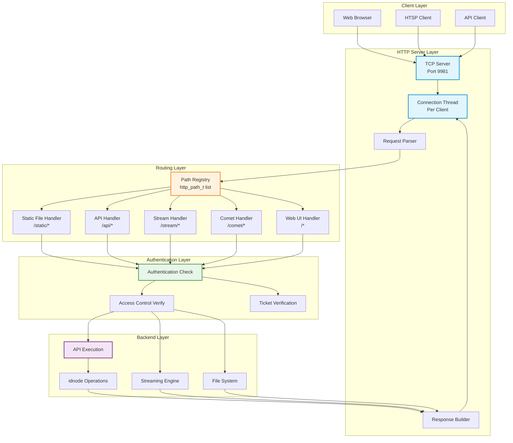
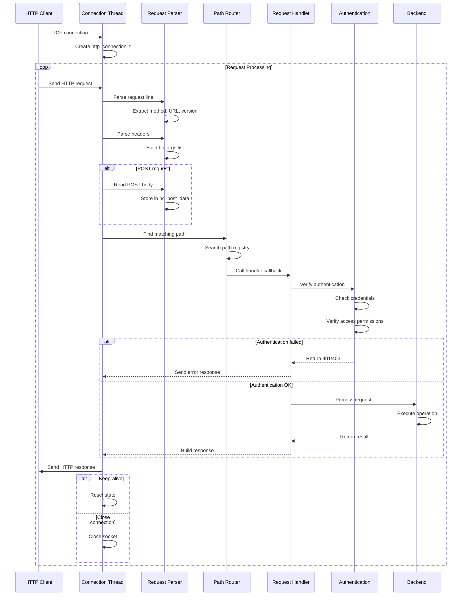
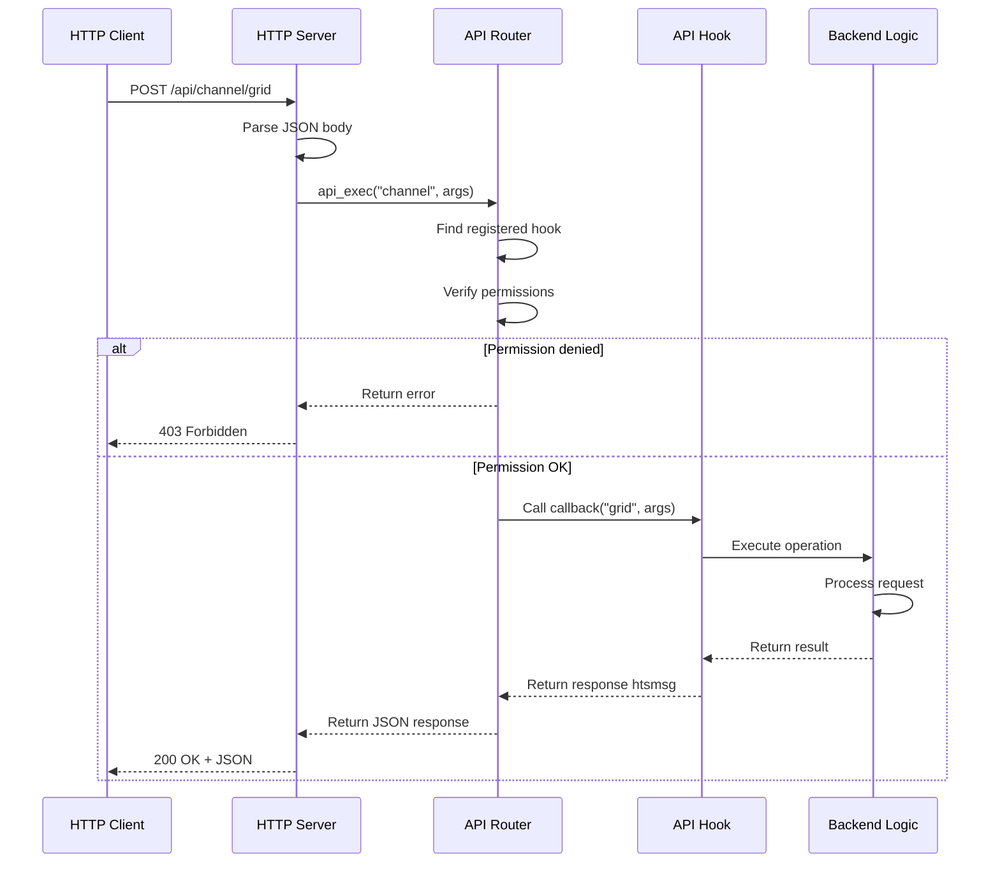
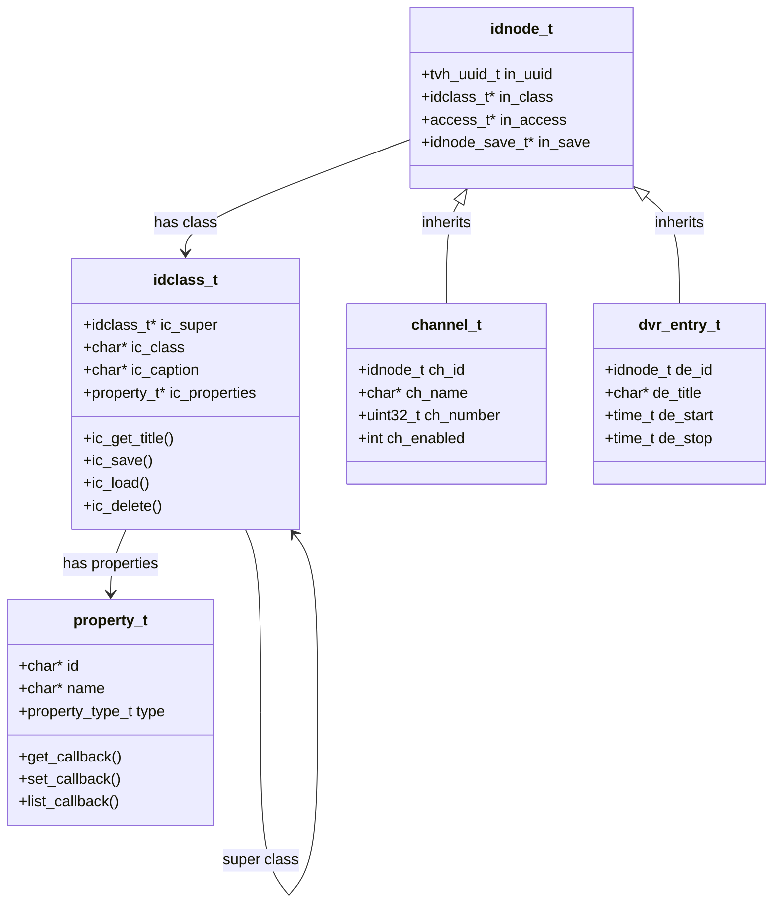
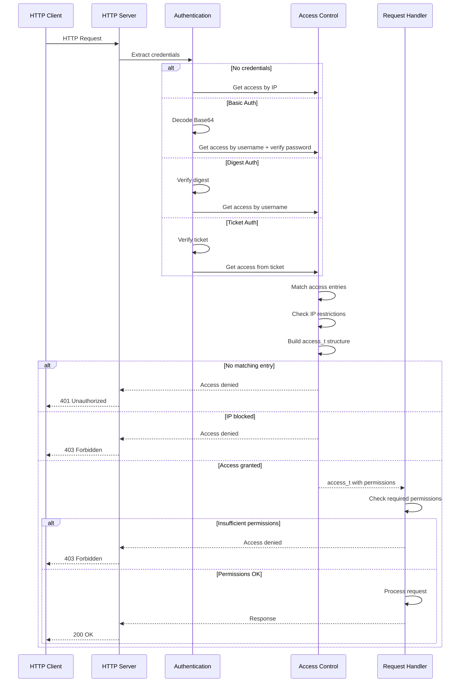
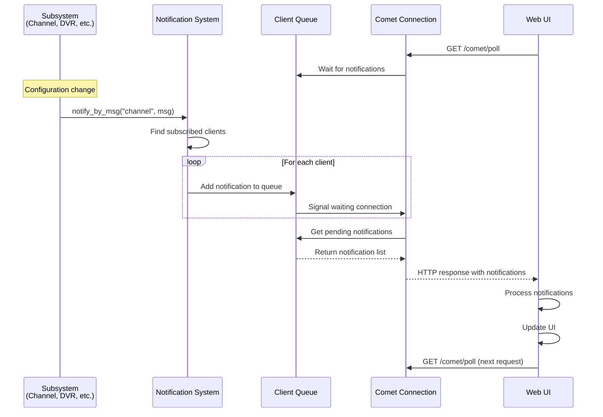

[← Back to Table of Contents](00-TOC.md)

## 15. HTTP/API Server

The HTTP/API Server subsystem provides the web interface and RESTful API for Tvheadend. It handles all HTTP requests, serves static files for the web UI, processes API calls for configuration and control, manages user authentication and access control, and provides real-time updates through Comet long-polling. This section documents the HTTP server architecture, API registration system, idnode-based automatic API generation, authentication mechanisms, and the notification system.

### 15.1 HTTP Server Architecture

The HTTP server is built on a custom TCP server implementation that handles HTTP/1.0 and HTTP/1.1 protocols, along with RTSP for SAT>IP functionality. It provides a flexible request routing system, connection management, and support for various content types.

#### 15.1.1 HTTP Server Overview

**Location**: `src/http.c`, `src/http.h`

The HTTP server is initialized early in the startup sequence (during pre-fork phase) to bind to privileged ports before dropping privileges. It creates a TCP server that listens for incoming connections and spawns a thread for each client connection.

**Key Features:**
- **Multi-threaded**: One thread per client connection for concurrent request handling
- **HTTP/1.0 and HTTP/1.1**: Full support for both protocol versions
- **Keep-alive**: Persistent connections to reduce overhead
- **Chunked transfer**: Support for chunked transfer encoding
- **WebSocket**: WebSocket protocol support for real-time communication
- **RTSP**: RTSP protocol support for SAT>IP server functionality
- **Static file serving**: Efficient serving of web UI files
- **Dynamic content**: API endpoints for configuration and control
- **Authentication**: Multiple authentication methods (plain, digest, ticket-based)
- **Access control**: Per-endpoint access control based on user permissions

**Architecture Diagram:**



#### 15.1.2 HTTP Server Initialization

The HTTP server initialization occurs in two phases:

**Phase 1: Pre-Fork Initialization** (`http_server_init()`)
- Called early in startup, before privilege dropping
- Binds to HTTP port (default 9981)
- Requires root privileges if port < 1024
- Does not start accepting connections yet

```c
void http_server_init(const char *bindaddr)
{
  // Create TCP server but don't start yet
  http_server = tcp_server_create(bindaddr, opt_http_port, 
                                   http_serve_requests, NULL);
  
  // Initialize path registry
  http_paths = calloc(1, sizeof(http_path_list_t));
  LIST_INIT(http_paths);
  
  // Initialize path registry mutex
  http_paths_mutex = calloc(1, sizeof(tvh_mutex_t));
  tvh_mutex_init(http_paths_mutex, NULL);
}
```

**Phase 2: Server Registration** (`http_server_register()`)
- Called after all subsystems are initialized
- Starts accepting connections
- Registers default paths (web UI, API, streaming)

```c
void http_server_register(void)
{
  // Start accepting connections
  tcp_server_register(http_server);
  
  // Log startup message
  tvhinfo(LS_HTTP, "HTTP server started on port %d", opt_http_port);
}
```

#### 15.1.3 HTTP Connection Structure

**Location**: `src/http.h`

The `http_connection_t` structure represents a single client connection and maintains all state for request processing.

**Structure Definition** (key fields):
```c
typedef struct http_connection {
  int hc_fd;                              // Socket file descriptor
  struct sockaddr_storage *hc_peer;       // Client address
  char *hc_peer_ipstr;                    // Client IP as string
  char *hc_representative;                // Representative string for logging
  
  // Request routing
  tvh_mutex_t *hc_paths_mutex;            // Path registry mutex
  http_path_list_t *hc_paths;             // Path registry
  int (*hc_process)(struct http_connection *hc, htsbuf_queue_t *spill);
  
  // Request data
  char *hc_url;                           // Request URL
  char *hc_url_orig;                      // Original URL (before modification)
  http_arg_list_t hc_args;                // HTTP headers
  http_arg_list_t hc_req_args;            // Query/POST parameters
  
  // Request state
  http_state_t hc_state;                  // Connection state
  http_cmd_t hc_cmd;                      // HTTP method (GET, POST, etc.)
  http_ver_t hc_version;                  // HTTP version
  
  // Authentication
  char *hc_username;                      // Authenticated username
  char *hc_password;                      // Password (for verification)
  char *hc_authhdr;                       // Authorization header
  char *hc_nonce;                         // Digest auth nonce
  access_t *hc_access;                    // Access permissions
  enum {
    HC_AUTH_NONE,
    HC_AUTH_ADDR,
    HC_AUTH_PLAIN,
    HC_AUTH_DIGEST,
    HC_AUTH_TICKET,
    HC_AUTH_PERM
  } hc_auth_type;                         // Authentication type
  
  // Response data
  htsbuf_queue_t hc_reply;                // Response buffer
  htsbuf_queue_t hc_extra;                // Extra data buffer (streaming)
  tvh_mutex_t hc_extra_lock;              // Extra buffer lock
  int hc_extra_chunks;                    // Number of chunks in extra buffer
  
  // Flags
  uint8_t hc_keep_alive;                  // Keep-alive enabled
  uint8_t hc_no_output;                   // Suppress output
  uint8_t hc_shutdown;                    // Connection shutting down
  uint8_t hc_is_local_ip;                 // Local network connection
  
  // POST data
  char *hc_post_data;                     // POST body data
  unsigned int hc_post_len;               // POST body length
  
} http_connection_t;
```

**Connection States:**
```c
typedef enum http_state {
  HTTP_CON_WAIT_REQUEST,   // Waiting for request line
  HTTP_CON_READ_HEADER,    // Reading headers
  HTTP_CON_END,            // End of headers
  HTTP_CON_POST_DATA,      // Reading POST data
  HTTP_CON_SENDING,        // Sending response
  HTTP_CON_SENT,           // Response sent
  HTTP_CON_RECEIVING,      // Receiving data
  HTTP_CON_DONE,           // Transaction complete
  HTTP_CON_IDLE,           // Idle (keep-alive)
  HTTP_CON_OK              // OK state
} http_state_t;
```

#### 15.1.4 Request Handling Flow

The request handling process follows a state machine pattern:



**Request Processing Steps:**

1. **Accept Connection**: TCP server accepts connection, creates thread
2. **Read Request Line**: Parse "METHOD /path HTTP/version"
3. **Read Headers**: Parse all HTTP headers into `hc_args` list
4. **Read Body**: If POST, read body data into `hc_post_data`
5. **Parse URL**: Extract path and query parameters
6. **Route Request**: Find matching `http_path_t` in registry
7. **Authenticate**: Verify user credentials and permissions
8. **Execute Handler**: Call registered callback function
9. **Build Response**: Construct HTTP response with headers and body
10. **Send Response**: Write response to socket
11. **Keep-Alive or Close**: Either reset for next request or close connection

#### 15.1.5 Connection Management

**Thread-Per-Connection Model:**
- Each HTTP connection runs in its own thread
- Thread created by TCP server when connection accepted
- Thread name: `tvh:http-<client-ip>`
- Thread lifetime: Duration of connection (may handle multiple requests with keep-alive)

**Connection Lifecycle:**
```c
// Simplified connection handling
void http_serve_requests(http_connection_t *hc)
{
  htsbuf_queue_t spill;
  
  // Initialize connection
  htsbuf_queue_init(&spill, 0);
  htsbuf_queue_init(&hc->hc_reply, 0);
  htsbuf_queue_init(&hc->hc_extra, 0);
  http_arg_init(&hc->hc_args);
  http_arg_init(&hc->hc_req_args);
  
  // Process requests until connection closes
  while (tvheadend_is_running()) {
    // Read and parse request
    if (http_read_request(hc, &spill) < 0)
      break;
    
    // Route and handle request
    if (http_process_request(hc) < 0)
      break;
    
    // Send response
    if (http_send_response(hc) < 0)
      break;
    
    // Check keep-alive
    if (!hc->hc_keep_alive)
      break;
    
    // Reset for next request
    http_connection_reset(hc);
  }
  
  // Cleanup
  http_connection_cleanup(hc);
}
```

**Keep-Alive Support:**
- HTTP/1.1 connections are keep-alive by default
- HTTP/1.0 requires "Connection: keep-alive" header
- Reduces overhead of TCP connection establishment
- Connection reused for multiple requests
- Timeout: 60 seconds of inactivity

**Connection Limits:**
- No hard limit on number of connections
- Limited by system resources (file descriptors, memory)
- Per-user connection limits enforced by access control
- Configurable per access entry

#### 15.1.6 Static File Serving

The HTTP server efficiently serves static files for the web UI.

**Static File Paths:**
- `/static/*` - Static web UI files (JavaScript, CSS, images)
- `/` - Root redirects to `/static/index.html`
- `/favicon.ico` - Favicon

**File Serving Implementation:**
```c
// Simplified static file handler
int http_static_file(http_connection_t *hc, const char *remain, void *opaque)
{
  char path[PATH_MAX];
  struct stat st;
  int fd;
  
  // Build file path
  snprintf(path, sizeof(path), "%s/%s", webui_static_path, remain);
  
  // Security check: prevent directory traversal
  if (strstr(remain, "..") != NULL) {
    http_error(hc, HTTP_STATUS_FORBIDDEN);
    return 0;
  }
  
  // Check if file exists
  if (stat(path, &st) < 0 || !S_ISREG(st.st_mode)) {
    http_error(hc, HTTP_STATUS_NOT_FOUND);
    return 0;
  }
  
  // Open file
  fd = open(path, O_RDONLY);
  if (fd < 0) {
    http_error(hc, HTTP_STATUS_INTERNAL);
    return 0;
  }
  
  // Determine content type from extension
  const char *content_type = http_get_content_type(path);
  
  // Send headers
  http_send_header(hc, HTTP_STATUS_OK, content_type, st.st_size,
                   NULL, NULL, 3600, NULL, NULL, NULL);
  
  // Send file content
  http_send_file(hc, fd, st.st_size);
  
  close(fd);
  return 0;
}
```

**Content Type Detection:**
- Based on file extension
- Common types: `.html` → `text/html`, `.js` → `application/javascript`, `.css` → `text/css`
- Default: `application/octet-stream`

**Caching:**
- Static files sent with `Cache-Control: max-age=3600` (1 hour)
- Reduces bandwidth and improves performance
- Web UI includes cache-busting version parameter

**Compression:**
- Gzip compression supported via `Accept-Encoding: gzip` header
- Pre-compressed `.gz` files served if available
- Reduces bandwidth for text files (HTML, JS, CSS)


#### 15.1.7 HTTP Status Codes

Tvheadend uses standard HTTP status codes to indicate request outcomes:

**Success Codes:**
- `200 OK` - Request successful
- `201 Created` - Resource created
- `204 No Content` - Success with no response body
- `206 Partial Content` - Partial content (range request)

**Redirection Codes:**
- `301 Moved Permanently` - Permanent redirect
- `302 Found` - Temporary redirect
- `304 Not Modified` - Cached content still valid

**Client Error Codes:**
- `400 Bad Request` - Malformed request
- `401 Unauthorized` - Authentication required
- `403 Forbidden` - Access denied
- `404 Not Found` - Resource not found
- `405 Method Not Allowed` - HTTP method not supported
- `408 Request Timeout` - Request timeout

**Server Error Codes:**
- `500 Internal Server Error` - Server error
- `501 Not Implemented` - Feature not implemented
- `503 Service Unavailable` - Server overloaded or maintenance

**Custom Error Handling:**
```c
void http_error(http_connection_t *hc, int error)
{
  const char *errtxt = http_rc2str(error);
  char buf[256];
  
  // Build error page
  snprintf(buf, sizeof(buf),
           "<!DOCTYPE HTML>\n"
           "<html><head><title>%d %s</title></head>\n"
           "<body><h1>%d %s</h1></body></html>\n",
           error, errtxt, error, errtxt);
  
  // Send error response
  http_send_header(hc, error, "text/html", strlen(buf),
                   NULL, NULL, 0, NULL, NULL, NULL);
  htsbuf_append_str(&hc->hc_reply, buf);
}
```

### 15.2 API Registration System

The API registration system provides a flexible mechanism for subsystems to expose functionality through HTTP endpoints. It uses a callback-based architecture that allows modules to register handlers for specific API operations.

#### 15.2.1 API Architecture Overview

**Location**: `src/api.c`, `src/api.h`

The API system is built on a simple but powerful pattern:
- **Subsystem registration**: Each subsystem registers an API hook with a callback function
- **Unified routing**: All API requests go through `/api/<subsystem>` URLs
- **JSON-based**: Requests and responses use JSON format (htsmsg)
- **Operation-based**: Each request specifies an operation (e.g., "list", "create", "update", "delete")
- **Permission-based**: Each API hook specifies required access permissions

**API Request Flow:**



#### 15.2.2 API Hook Structure

**Location**: `src/api.h`

The `api_hook_t` structure defines an API endpoint registration.

**Structure Definition:**
```c
typedef struct api_hook
{
  const char         *ah_subsystem;    // Subsystem name (e.g., "channel")
  uint32_t            ah_access;       // Required access permissions
  api_callback_t      ah_callback;     // Handler function
  void               *ah_opaque;       // Opaque data passed to callback
} api_hook_t;
```

**Callback Function Type:**
```c
typedef int (*api_callback_t)
  ( access_t *perm,        // User permissions
    void *opaque,          // Opaque data from hook
    const char *op,        // Operation name (e.g., "list", "create")
    htsmsg_t *args,        // Request arguments (JSON)
    htsmsg_t **resp );     // Response (JSON) - output parameter
```

**Callback Return Values:**
- `0` - Success, response in `*resp`
- Negative - Error code (HTTP status code)

#### 15.2.3 Registering API Hooks

**Single Hook Registration:**
```c
void api_register(const api_hook_t *hook);
```

**Multiple Hook Registration:**
```c
void api_register_all(const api_hook_t *hooks);
```

**Example - Channel API Registration:**
```c
// Define API hooks
static api_hook_t channel_api_hooks[] = {
  {
    .ah_subsystem  = "channel",
    .ah_access     = ACCESS_ADMIN,
    .ah_callback   = api_channel_handler,
    .ah_opaque     = NULL
  },
  { NULL } // Terminator
};

// Register during initialization
void api_channel_init(void)
{
  api_register_all(channel_api_hooks);
}
```

#### 15.2.4 API Handler Implementation

**Handler Function Pattern:**
```c
static int
api_channel_handler(access_t *perm, void *opaque, const char *op,
                    htsmsg_t *args, htsmsg_t **resp)
{
  // Dispatch based on operation
  if (!strcmp(op, "list"))
    return api_channel_list(perm, args, resp);
  else if (!strcmp(op, "grid"))
    return api_channel_grid(perm, args, resp);
  else if (!strcmp(op, "create"))
    return api_channel_create(perm, args, resp);
  else if (!strcmp(op, "update"))
    return api_channel_update(perm, args, resp);
  else if (!strcmp(op, "delete"))
    return api_channel_delete(perm, args, resp);
  else
    return -HTTP_STATUS_BAD_REQUEST;
}
```

**Operation Implementation Example:**
```c
static int
api_channel_list(access_t *perm, htsmsg_t *args, htsmsg_t **resp)
{
  htsmsg_t *list;
  channel_t *ch;
  
  // Create response message
  *resp = htsmsg_create_map();
  list = htsmsg_create_list();
  
  // Iterate channels
  CHANNEL_FOREACH(ch) {
    // Check access permission
    if (!channel_access(ch, perm, 0))
      continue;
    
    // Add channel to list
    htsmsg_t *e = htsmsg_create_map();
    htsmsg_add_str(e, "uuid", idnode_uuid_as_str(&ch->ch_id, buf));
    htsmsg_add_str(e, "name", channel_get_name(ch));
    htsmsg_add_u32(e, "number", channel_get_number(ch));
    htsmsg_add_msg(list, NULL, e);
  }
  
  // Add list to response
  htsmsg_add_msg(*resp, "entries", list);
  htsmsg_add_u32(*resp, "totalCount", htsmsg_get_list_count(list));
  
  return 0;
}
```

#### 15.2.5 API Request Format

**HTTP Request:**
```
POST /api/channel/grid HTTP/1.1
Content-Type: application/json

{
  "start": 0,
  "limit": 50,
  "sort": {
    "field": "name",
    "dir": "ASC"
  },
  "filter": [
    {
      "field": "enabled",
      "type": "boolean",
      "value": true
    }
  ]
}
```

**HTTP Response:**
```
HTTP/1.1 200 OK
Content-Type: application/json

{
  "entries": [
    {
      "uuid": "abc123...",
      "name": "Channel 1",
      "number": 1,
      "enabled": true
    },
    {
      "uuid": "def456...",
      "name": "Channel 2",
      "number": 2,
      "enabled": true
    }
  ],
  "totalCount": 2
}
```

#### 15.2.6 Common API Operations

**Standard Operations:**

1. **list** - Get list of items
   - Returns array of items
   - No pagination
   - Used for dropdowns, simple lists

2. **grid** - Get paginated grid data
   - Supports pagination (start, limit)
   - Supports sorting (field, direction)
   - Supports filtering (field, type, value, comparison)
   - Returns entries + totalCount

3. **create** - Create new item
   - Accepts configuration object
   - Returns UUID of created item
   - Triggers notification

4. **update** - Update existing item
   - Accepts UUID + changed fields
   - Returns success/error
   - Triggers notification

5. **delete** - Delete item
   - Accepts UUID
   - Returns success/error
   - Triggers notification

6. **load** - Load single item
   - Accepts UUID
   - Returns full item configuration

**Example Grid Request:**
```c
// Parse grid parameters
uint32_t start = htsmsg_get_u32_or_default(args, "start", 0);
uint32_t limit = htsmsg_get_u32_or_default(args, "limit", 50);
htsmsg_t *sort = htsmsg_get_map(args, "sort");
htsmsg_t *filter = htsmsg_get_list(args, "filter");

// Apply pagination
// Apply sorting
// Apply filtering
// Return results
```

#### 15.2.7 API Execution

**Location**: `src/api.c`

The `api_exec()` function is the central dispatcher for all API requests.

**Function Signature:**
```c
int api_exec(access_t *perm, const char *subsystem,
             htsmsg_t *args, htsmsg_t **resp);
```

**Execution Flow:**
```c
int api_exec(access_t *perm, const char *subsystem,
             htsmsg_t *args, htsmsg_t **resp)
{
  api_hook_t *hook;
  const char *op;
  int r;
  
  // Find registered hook for subsystem
  hook = api_find_hook(subsystem);
  if (!hook)
    return -HTTP_STATUS_NOT_FOUND;
  
  // Check access permissions
  if (!access_verify2(perm, hook->ah_access))
    return -HTTP_STATUS_FORBIDDEN;
  
  // Extract operation from args
  op = htsmsg_get_str(args, "op");
  if (!op)
    return -HTTP_STATUS_BAD_REQUEST;
  
  // Call hook callback
  r = hook->ah_callback(perm, hook->ah_opaque, op, args, resp);
  
  return r;
}
```

#### 15.2.8 Registered API Subsystems

Tvheadend registers API hooks for all major subsystems during initialization:

**Subsystem APIs:**
- **config** - System configuration (`api_config_init()`)
- **idnode** - Generic idnode operations (`api_idnode_init()`)
- **input** - Input sources (`api_input_init()`)
- **service** - Services (`api_service_init()`)
- **channel** - Channels (`api_channel_init()`)
- **bouquet** - Bouquets (`api_bouquet_init()`)
- **ratinglabel** - Rating labels (`api_ratinglabel_init()`)
- **mpegts** - MPEG-TS specific (`api_mpegts_init()`)
- **epg** - EPG data (`api_epg_init()`)
- **epggrab** - EPG grabbers (`api_epggrab_init()`)
- **status** - System status (`api_status_init()`)
- **imagecache** - Image cache (`api_imagecache_init()`)
- **esfilter** - ES filters (`api_esfilter_init()`)
- **intlconv** - Internationalization (`api_intlconv_init()`)
- **access** - Access control (`api_access_init()`)
- **dvr** - DVR/recordings (`api_dvr_init()`)
- **caclient** - CA clients (`api_caclient_init()`)
- **profile** - Streaming profiles (`api_profile_init()`)
- **language** - Languages (`api_language_init()`)
- **satip_server** - SAT>IP server (`api_satip_server_init()`)
- **timeshift** - Timeshift (`api_timeshift_init()`)
- **wizard** - Setup wizard (`api_wizard_init()`)
- **codec** - Codecs (if libav enabled) (`api_codec_init()`)

**Initialization Order:**
All API subsystems are initialized during `api_init()` which is called early in the startup sequence.

### 15.3 idnode System

The idnode (ID Node) system is a sophisticated object-oriented framework (implemented in C) that provides automatic API generation, configuration persistence, property introspection, and change notification for all configuration objects in Tvheadend. It's the foundation of the web UI's dynamic configuration interface.

#### 15.3.1 idnode Architecture Overview

**Location**: `src/idnode.c`, `src/idnode.h`

The idnode system implements a class-based object model with the following key features:
- **Base class**: All configuration objects inherit from `idnode_t`
- **Class hierarchy**: Support for single inheritance
- **Property system**: Declarative property definitions with metadata
- **Automatic serialization**: JSON serialization/deserialization
- **Automatic API**: REST API endpoints generated from class definitions
- **Change tracking**: Automatic notification of changes
- **Persistence**: Automatic save/load from disk
- **Validation**: Property-level validation rules
- **Access control**: Per-object and per-property permissions

**idnode Architecture Diagram:**



#### 15.3.2 idnode_t Base Class

**Location**: `src/idnode.h`

The `idnode_t` structure is the base class for all configuration objects.

**Structure Definition:**
```c
typedef struct idnode {
  tvh_uuid_t        in_uuid;           // Unique identifier (128-bit UUID)
  RB_ENTRY(idnode)  in_link;           // Global hash tree link
  RB_ENTRY(idnode)  in_domain_link;    // Domain (class) tree link
  idnodes_rb_t     *in_domain;         // Domain tree pointer
  const idclass_t  *in_class;          // Class definition
  struct access    *in_access;         // Access permissions (runtime)
  idnode_save_t    *in_save;           // Save queue link
} idnode_t;
```

**Key Fields:**

1. **`in_uuid`** - Unique Identifier
   - 128-bit UUID (RFC 4122)
   - Globally unique across all objects
   - Used for object references and persistence
   - Generated at object creation or loaded from configuration

2. **`in_link`** - Global Hash Tree
   - Links object into global UUID-indexed tree
   - Enables fast lookup by UUID
   - All idnodes are in this tree

3. **`in_domain_link`** - Class Domain Tree
   - Links object into class-specific tree
   - Enables iteration of all objects of a class
   - Used for "find all" operations

4. **`in_class`** - Class Definition
   - Points to `idclass_t` structure
   - Defines object type, properties, and behavior
   - Immutable after object creation

5. **`in_access`** - Runtime Permissions
   - Current user's access permissions
   - Set during API request processing
   - Used for permission checks

6. **`in_save`** - Save Queue
   - Links object into save queue when modified
   - Enables batched, delayed saves
   - Reduces disk I/O

**Object Lifecycle:**

```c
// 1. Create object
channel_t *ch = calloc(1, sizeof(channel_t));

// 2. Insert into idnode system
idnode_insert(&ch->ch_id, uuid, &channel_class, 0);

// 3. Configure object
ch->ch_name = strdup("Channel 1");
ch->ch_number = 1;

// 4. Mark for save
idnode_changed(&ch->ch_id);

// 5. Delete object (when no longer needed)
idnode_delete(&ch->ch_id);
```

#### 15.3.3 idclass_t Class Definition

**Location**: `src/idnode.h`

The `idclass_t` structure defines a class of configuration objects.

**Structure Definition:**
```c
typedef struct idclass {
  const struct idclass   *ic_super;        // Parent class (inheritance)
  const char             *ic_class;        // Class name (unique identifier)
  const char             *ic_caption;      // Human-readable name
  const char             *ic_order;        // Property display order
  const char            **ic_doc;          // Documentation strings
  const property_group_t *ic_groups;       // Property groups for UI
  const property_t       *ic_properties;   // Property definitions
  const char             *ic_event;        // Event name for notifications
  uint32_t                ic_perm_def;     // Default permissions
  uint32_t                ic_flags;        // Class flags
  idnode_t               *ic_snode;        // Simple node (singleton)

  // Virtual methods (callbacks)
  idnode_set_t   *(*ic_get_childs) (idnode_t *self);
  void            (*ic_get_title)  (idnode_t *self, const char *lang, char *dst, size_t dstsize);
  void            (*ic_changed)    (idnode_t *self);
  htsmsg_t       *(*ic_save)       (idnode_t *self, char *filename, size_t fsize);
  void            (*ic_load)       (idnode_t *self, htsmsg_t *conf);
  void            (*ic_delete)     (idnode_t *self);
  void            (*ic_moveup)     (idnode_t *self);
  void            (*ic_movedown)   (idnode_t *self);
  int             (*ic_perm)       (idnode_t *self, struct access *a, htsmsg_t *msg_to_write);
} idclass_t;
```

**Key Fields:**

1. **`ic_super`** - Parent Class
   - Enables single inheritance
   - Child class inherits parent's properties
   - NULL for root classes

2. **`ic_class`** - Class Name
   - Unique identifier (e.g., "channel", "dvr_entry")
   - Used in API URLs and configuration paths
   - Must be globally unique

3. **`ic_properties`** - Property Array
   - NULL-terminated array of `property_t` structures
   - Defines all properties of the class
   - Includes inherited properties

4. **`ic_event`** - Event Name
   - Name of event to fire on changes (e.g., "channel")
   - Used for real-time UI updates via Comet
   - NULL if no events needed

**Virtual Methods:**

1. **`ic_get_title()`** - Get Object Title
   - Returns human-readable title for object
   - Used in UI lists and dropdowns
   - Example: "Channel 1" for a channel object

2. **`ic_save()`** - Save Object
   - Serializes object to htsmsg (JSON)
   - Returns configuration message
   - Called when object changes

3. **`ic_load()`** - Load Object
   - Deserializes object from htsmsg (JSON)
   - Applies configuration to object
   - Called during startup

4. **`ic_delete()`** - Delete Object
   - Cleanup before object destruction
   - Remove from lists, close resources
   - Called by `idnode_delete()`

5. **`ic_changed()`** - Change Notification
   - Called when object properties change
   - Can trigger side effects
   - Example: Update EPG when channel changes

**Example Class Definition:**
```c
const idclass_t channel_class = {
  .ic_super      = &idnode_class,
  .ic_class      = "channel",
  .ic_caption    = N_("Channel"),
  .ic_event      = "channel",
  .ic_perm_def   = ACCESS_ADMIN,
  .ic_properties = (const property_t[]){
    {
      .type     = PT_STR,
      .id       = "name",
      .name     = N_("Name"),
      .desc     = N_("Channel name"),
      .off      = offsetof(channel_t, ch_name),
    },
    {
      .type     = PT_U32,
      .id       = "number",
      .name     = N_("Number"),
      .desc     = N_("Channel number"),
      .off      = offsetof(channel_t, ch_number),
    },
    {
      .type     = PT_BOOL,
      .id       = "enabled",
      .name     = N_("Enabled"),
      .desc     = N_("Enable channel"),
      .off      = offsetof(channel_t, ch_enabled),
    },
    {}  // Terminator
  },
  .ic_get_title  = channel_class_get_title,
  .ic_save       = channel_class_save,
  .ic_load       = channel_class_load,
  .ic_delete     = channel_class_delete,
  .ic_changed    = channel_class_changed,
};
```

#### 15.3.4 Property System

**Location**: `src/prop.h`, `src/prop.c`

The property system provides declarative property definitions with rich metadata.

**Property Types:**
```c
typedef enum {
  PT_NONE,        // No type
  PT_BOOL,        // Boolean
  PT_INT,         // Integer (signed)
  PT_U8,          // Unsigned 8-bit
  PT_U16,         // Unsigned 16-bit
  PT_U32,         // Unsigned 32-bit
  PT_S64,         // Signed 64-bit
  PT_DBL,         // Double
  PT_STR,         // String
  PT_LANGSTR,     // Localized string
  PT_TIME,        // Time (time_t)
  PT_PERM,        // Permissions
  PT_NONE,        // Separator (UI only)
} property_type_t;
```

**Property Structure:**
```c
typedef struct property {
  const char *id;                    // Property identifier
  const char *name;                  // Display name
  const char *desc;                  // Description
  property_type_t type;              // Data type
  
  // Storage
  size_t off;                        // Offset in structure (for simple properties)
  
  // Callbacks (for complex properties)
  const void *(*get) (void *obj);
  int         (*set) (void *obj, const void *v);
  htsmsg_t   *(*list)(void *obj, const char *lang);
  char       *(*rend)(void *obj, const char *lang);
  int         (*notify)(void *obj, const char *lang);
  
  // Options
  uint32_t opts;                     // Property options (PO_*)
  
  // Validation
  struct {
    union {
      int         num;               // Numeric min/max
      const char *str;               // String regex
    } u;
  } def, min, max;
  
  // UI hints
  const char *group;                 // Property group
  const void *list_data;             // List data (for enums)
  
} property_t;
```

**Property Options:**
```c
#define PO_RDONLY     (1<<0)   // Read-only
#define PO_WRONCE     (1<<1)   // Write once (immutable after creation)
#define PO_ADVANCED   (1<<2)   // Advanced property (hidden by default)
#define PO_HIDDEN     (1<<3)   // Hidden property (not in UI)
#define PO_PASSWORD   (1<<4)   // Password field (masked in UI)
#define PO_NOSAVE     (1<<5)   // Don't save to disk
#define PO_PERSIST    (1<<6)   // Persist even if default value
#define PO_LOCALE     (1<<7)   // Localized string
#define PO_SORTKEY    (1<<8)   // Use as sort key
#define PO_EXPERT     (1<<9)   // Expert property (requires expert mode)
#define PO_DOC        (1<<10)  // Include documentation
#define PO_USERAW     (1<<11)  // Use raw value (no conversion)
#define PO_MULTILINE  (1<<12)  // Multiline text
#define PO_DURATION   (1<<13)  // Duration (seconds)
#define PO_HEXA       (1<<14)  // Hexadecimal display
```

**Simple Property Example:**
```c
{
  .type     = PT_STR,
  .id       = "name",
  .name     = N_("Name"),
  .desc     = N_("Channel name"),
  .off      = offsetof(channel_t, ch_name),  // Direct field access
}
```

**Complex Property Example (with callbacks):**
```c
{
  .type     = PT_STR,
  .id       = "services",
  .name     = N_("Services"),
  .desc     = N_("Mapped services"),
  .list     = channel_class_services_list,   // Get list of options
  .get      = channel_class_services_get,    // Get current value
  .set      = channel_class_services_set,    // Set new value
  .rend     = channel_class_services_rend,   // Render for display
}
```

#### 15.3.5 Automatic API Generation

The idnode system automatically generates REST API endpoints for all classes.

**Generated API Operations:**

1. **Class Metadata** - `/api/idnode/classes`
   - Returns list of all classes
   - Includes class name, caption, properties

2. **Grid Data** - `/api/idnode/grid`
   - Returns paginated list of objects
   - Supports filtering, sorting, pagination
   - Used by web UI grids

3. **Load Object** - `/api/idnode/load`
   - Returns single object by UUID
   - Includes all property values

4. **Save Object** - `/api/idnode/save`
   - Updates object properties
   - Validates changes
   - Triggers notifications

5. **Delete Object** - `/api/idnode/delete`
   - Deletes object by UUID
   - Calls `ic_delete()` callback

**API Handler Implementation:**
```c
int api_idnode_grid(access_t *perm, void *opaque, const char *op,
                    htsmsg_t *args, htsmsg_t **resp)
{
  const idclass_t *idc;
  idnode_set_t *ins;
  api_idnode_grid_conf_t conf;
  const char *class_name;
  
  // Get class name
  class_name = htsmsg_get_str(args, "class");
  if (!class_name)
    return -HTTP_STATUS_BAD_REQUEST;
  
  // Find class
  idc = idclass_find(class_name);
  if (!idc)
    return -HTTP_STATUS_NOT_FOUND;
  
  // Parse grid configuration
  conf.start = htsmsg_get_u32_or_default(args, "start", 0);
  conf.limit = htsmsg_get_u32_or_default(args, "limit", 50);
  // ... parse sort and filter ...
  
  // Get all objects of class
  ins = idnode_find_all(idc, NULL);
  
  // Apply filter
  idnode_filter(ins, &conf.filter, perm->aa_lang);
  
  // Apply sort
  idnode_set_sort(ins, &conf.sort);
  
  // Build response
  *resp = htsmsg_create_map();
  htsmsg_t *entries = htsmsg_create_list();
  
  for (size_t i = conf.start; i < ins->is_count && i < conf.start + conf.limit; i++) {
    idnode_t *in = ins->is_array[i];
    htsmsg_t *e = idnode_serialize(in, perm->aa_lang);
    htsmsg_add_msg(entries, NULL, e);
  }
  
  htsmsg_add_msg(*resp, "entries", entries);
  htsmsg_add_u32(*resp, "totalCount", ins->is_count);
  
  idnode_set_free(ins);
  return 0;
}
```

#### 15.3.6 Serialization and Deserialization

**Serialization** (Object → JSON):
```c
htsmsg_t *idnode_serialize(idnode_t *self, const char *lang)
{
  htsmsg_t *m = htsmsg_create_map();
  const idclass_t *idc = self->in_class;
  const property_t *p;
  
  // Add UUID
  char buf[UUID_HEX_SIZE];
  htsmsg_add_str(m, "uuid", idnode_uuid_as_str(self, buf));
  
  // Iterate properties
  for (p = idc->ic_properties; p->id; p++) {
    // Skip hidden properties
    if (p->opts & PO_HIDDEN)
      continue;
    
    // Get property value
    const void *v = prop_get(self, p);
    
    // Add to message based on type
    switch (p->type) {
      case PT_BOOL:
        htsmsg_add_bool(m, p->id, *(int*)v);
        break;
      case PT_U32:
        htsmsg_add_u32(m, p->id, *(uint32_t*)v);
        break;
      case PT_STR:
        if (v)
          htsmsg_add_str(m, p->id, (const char*)v);
        break;
      // ... other types ...
    }
  }
  
  return m;
}
```

**Deserialization** (JSON → Object):
```c
int idnode_write(idnode_t *self, htsmsg_t *m, int optmask, int dosave)
{
  const idclass_t *idc = self->in_class;
  const property_t *p;
  int save = 0;
  
  // Iterate properties in message
  htsmsg_field_t *f;
  HTSMSG_FOREACH(f, m) {
    // Find property definition
    p = prop_find(idc, f->hmf_name);
    if (!p)
      continue;
    
    // Check if read-only
    if (p->opts & PO_RDONLY)
      continue;
    
    // Set property value
    if (prop_set(self, p, &f->hmf_val) == 0)
      save = 1;  // Property changed
  }
  
  // Save if changed
  if (save && dosave)
    idnode_changed(self);
  
  return save ? 1 : 0;
}
```

#### 15.3.7 Change Notification and Persistence

**Change Notification:**
```c
void idnode_changed(idnode_t *in)
{
  // Mark for save
  idnode_save_check(in, 0);
  
  // Notify UI
  idnode_notify_changed(in);
  
  // Call class callback
  if (in->in_class->ic_changed)
    in->in_class->ic_changed(in);
}
```

**Delayed Save:**
- Changes are not saved immediately
- Object added to save queue
- Save triggered after 3 seconds of inactivity
- Reduces disk I/O for rapid changes
- Batches multiple changes into single save

**Save Implementation:**
```c
htsmsg_t *idnode_savefn(idnode_t *self, char *filename, size_t fsize)
{
  const idclass_t *idc = self->in_class;
  htsmsg_t *m;
  
  // Call class save callback
  if (idc->ic_save)
    m = idc->ic_save(self, filename, fsize);
  else
    m = idnode_serialize(self, NULL);
  
  // Write to file
  if (m && filename[0]) {
    hts_settings_save(m, "%s", filename);
  }
  
  return m;
}
```

**Configuration File Structure:**
```
~/.hts/tvheadend/
├── channel/
│   └── config/
│       ├── abc123.../
│       │   └── config  (JSON file)
│       └── def456.../
│           └── config  (JSON file)
├── dvr/
│   └── log/
│       ├── 789abc.../
│       │   └── config
│       └── 012def.../
│           └── config
```

**Example Configuration File:**
```json
{
  "name": "Channel 1",
  "number": 1,
  "enabled": true,
  "icon": "http://example.com/icon.png",
  "services": [
    "service-uuid-1",
    "service-uuid-2"
  ]
}
```

### 15.4 Authentication and Access Control

Tvheadend implements a comprehensive authentication and access control system that supports multiple authentication methods, fine-grained permissions, IP-based restrictions, and per-user configuration. This system protects all HTTP endpoints, API calls, and streaming access.

#### 15.4.1 Access Control Architecture

**Location**: `src/access.c`, `src/access.h`

The access control system consists of several components:
- **Password entries**: User accounts with credentials
- **Access entries**: Permission rules with IP restrictions
- **IP block entries**: IP-based blocking rules
- **Access tickets**: Temporary access tokens
- **Runtime access structures**: Per-request permission context

**Access Control Flow:**



#### 15.4.2 User Authentication

**Password Entry Structure:**

**Location**: `src/access.h`

```c
typedef struct passwd_entry {
  idnode_t pw_id;                      // Configuration node
  
  TAILQ_ENTRY(passwd_entry) pw_link;   // Global list link
  
  char *pw_username;                   // Username
  char *pw_password;                   // Hashed password
  char *pw_password2;                  // Alternative password
  char *pw_auth;                       // Authentication method
  
  int   pw_enabled;                    // Account enabled
  int   pw_auth_enabled;               // Authentication enabled
  int   pw_wizard;                     // Wizard account flag
  
  char *pw_comment;                    // User comment
} passwd_entry_t;
```

**Password Storage:**
- Passwords stored as SHA-256 hashes
- Format: `{SHA256}<hex-encoded-hash>`
- Plain text passwords never stored
- Alternative password (`pw_password2`) for migration

**Authentication Methods:**

1. **Plain Authentication** (HTTP Basic Auth)
   - Username and password sent in Authorization header
   - Base64 encoded: `Authorization: Basic <base64(username:password)>`
   - Simple but requires HTTPS for security
   - Supported by all HTTP clients

2. **Digest Authentication** (HTTP Digest Auth)
   - Challenge-response mechanism
   - Password never sent over network
   - More secure than Basic Auth
   - Supported by most HTTP clients

3. **Ticket Authentication**
   - Temporary access tokens
   - Used for streaming URLs
   - Time-limited validity
   - No credentials in URL

**Authentication Process:**

```c
access_t *access_get(struct sockaddr_storage *src, const char *username,
                     verify_callback_t verify, void *aux)
{
  passwd_entry_t *pw;
  access_entry_t *ae;
  access_t *a;
  
  // Check IP block list
  if (ipblock_check(src))
    return NULL;  // IP blocked
  
  // Find password entry
  if (username) {
    pw = passwd_entry_find(username);
    if (!pw || !pw->pw_enabled)
      return NULL;  // User not found or disabled
    
    // Verify password
    if (verify && verify(aux, pw->pw_password) != 0)
      return NULL;  // Password incorrect
  }
  
  // Find matching access entry
  ae = access_entry_find(src, username);
  if (!ae)
    return NULL;  // No matching access entry
  
  // Build access structure
  a = access_build(ae, src, username);
  
  return a;
}
```

#### 15.4.3 Access Entries

**Access Entry Structure:**

**Location**: `src/access.h`

```c
typedef struct access_entry {
  idnode_t ae_id;                      // Configuration node
  
  TAILQ_ENTRY(access_entry) ae_link;   // Global list link
  
  char *ae_username;                   // Username (or "*" for any)
  char *ae_comment;                    // Entry comment
  char *ae_lang;                       // Language preference
  char *ae_lang_ui;                    // UI language preference
  char *ae_theme;                      // UI theme
  
  int ae_index;                        // Priority index
  int ae_wizard;                       // Wizard entry flag
  int ae_enabled;                      // Entry enabled
  int ae_uilevel;                      // UI level (basic/advanced/expert)
  
  // Permissions
  int ae_streaming;                    // Streaming permission
  int ae_adv_streaming;                // Advanced streaming
  int ae_htsp_streaming;               // HTSP streaming
  int ae_dvr;                          // DVR permission
  int ae_htsp_dvr;                     // HTSP DVR
  int ae_all_dvr;                      // All DVR entries
  int ae_all_rw_dvr;                   // Read/write all DVR
  int ae_failed_dvr;                   // Failed recordings
  int ae_htsp_anonymize;               // Anonymize HTSP
  int ae_webui;                        // Web UI access
  int ae_admin;                        // Admin access
  
  // Profiles and configs
  idnode_list_head_t ae_profiles;      // Allowed streaming profiles
  idnode_list_head_t ae_dvr_configs;   // Allowed DVR configs
  
  // Channel restrictions
  uint64_t ae_chmin;                   // Min channel number
  uint64_t ae_chmax;                   // Max channel number
  int ae_chtags_exclude;               // Exclude or include tags
  idnode_list_head_t ae_chtags;        // Channel tags
  
  // Connection limits
  int ae_conn_limit_type;              // Limit type
  uint32_t ae_conn_limit;              // Connection limit
  
  // Output formats
  int ae_xmltv_output_format;          // XMLTV format
  int ae_htsp_output_format;           // HTSP format
  
  // IP restrictions
  struct access_ipmask_queue ae_ipmasks;  // IP address masks
  
  uint32_t ae_rights;                  // Combined rights mask
} access_entry_t;
```

**Access Rights Flags:**
```c
#define ACCESS_ANONYMOUS          0
#define ACCESS_STREAMING          (1<<0)   // Basic streaming
#define ACCESS_ADVANCED_STREAMING (1<<1)   // Advanced streaming features
#define ACCESS_HTSP_STREAMING     (1<<2)   // HTSP protocol streaming
#define ACCESS_WEB_INTERFACE      (1<<3)   // Web UI access
#define ACCESS_HTSP_INTERFACE     (1<<4)   // HTSP interface access
#define ACCESS_RECORDER           (1<<5)   // DVR recording
#define ACCESS_HTSP_RECORDER      (1<<6)   // HTSP DVR
#define ACCESS_ALL_RECORDER       (1<<7)   // All DVR entries
#define ACCESS_ALL_RW_RECORDER    (1<<8)   // Read/write all DVR
#define ACCESS_FAILED_RECORDER    (1<<9)   // Failed recordings
#define ACCESS_HTSP_ANONYMIZE     (1<<10)  // Anonymize HTSP
#define ACCESS_ADMIN              (1<<11)  // Admin access

#define ACCESS_FULL \
  (ACCESS_STREAMING | ACCESS_ADVANCED_STREAMING | \
   ACCESS_HTSP_STREAMING | ACCESS_WEB_INTERFACE | \
   ACCESS_RECORDER | ACCESS_HTSP_RECORDER | \
   ACCESS_ALL_RECORDER | ACCESS_ALL_RW_RECORDER | \
   ACCESS_FAILED_RECORDER | ACCESS_ADMIN)
```

**Access Entry Matching:**

Access entries are matched in priority order (by `ae_index`):
1. Check if entry is enabled
2. Check if username matches (or "*" for any user)
3. Check if client IP matches any IP mask
4. First matching entry is used

**IP Mask Format:**
- IPv4: `192.168.1.0/24` or `192.168.1.100`
- IPv6: `2001:db8::/32` or `2001:db8::1`
- Multiple masks per entry
- CIDR notation supported

#### 15.4.4 Runtime Access Structure

**Location**: `src/access.h`

The `access_t` structure represents the runtime permissions for a request.

**Structure Definition:**
```c
typedef struct access {
  char     *aa_username;               // Username
  char     *aa_representative;         // Representative string (for logging)
  char     *aa_lang;                   // Language preference
  char     *aa_lang_ui;                // UI language
  uint32_t  aa_rights;                 // Permission flags
  htsmsg_t *aa_profiles;               // Allowed profiles (UUIDs)
  htsmsg_t *aa_dvrcfgs;                // Allowed DVR configs (UUIDs)
  uint64_t *aa_chrange;                // Channel number range
  int       aa_chrange_count;          // Number of ranges
  htsmsg_t *aa_chtags_exclude;         // Excluded channel tags
  htsmsg_t *aa_chtags;                 // Included channel tags
  int       aa_match;                  // Match count (for logging)
  uint32_t  aa_conn_limit;             // Connection limit
  uint32_t  aa_conn_limit_streaming;   // Streaming connection limit
  uint32_t  aa_conn_limit_dvr;         // DVR connection limit
  uint32_t  aa_conn_streaming;         // Current streaming connections
  uint32_t  aa_conn_dvr;               // Current DVR connections
  uint32_t  aa_xmltv_output_format;    // XMLTV format
  uint32_t  aa_htsp_output_format;     // HTSP format
  int       aa_uilevel;                // UI level
  int       aa_uilevel_nochange;       // UI level locked
  char     *aa_theme;                  // UI theme
  char     *aa_auth;                   // Authentication method
} access_t;
```

**Permission Verification:**
```c
// Verify single permission
static inline int access_verify2(const access_t *a, uint32_t mask)
{
  if (!a)
    return -1;  // No access
  
  if (mask & ACCESS_OR)
    return (a->aa_rights & mask) ? 0 : -1;  // Any permission
  else
    return ((a->aa_rights & mask) == mask) ? 0 : -1;  // All permissions
}

// Verify permission in HTTP handler
int http_access_verify(http_connection_t *hc, int mask)
{
  if (!hc->hc_access)
    return http_noaccess_code(hc);
  
  if (access_verify2(hc->hc_access, mask) != 0)
    return HTTP_STATUS_FORBIDDEN;
  
  return 0;
}
```

**Usage Example:**
```c
// In API handler
int api_channel_create(access_t *perm, htsmsg_t *args, htsmsg_t **resp)
{
  // Check admin permission
  if (access_verify2(perm, ACCESS_ADMIN) != 0)
    return -HTTP_STATUS_FORBIDDEN;
  
  // Create channel
  // ...
  
  return 0;
}
```

#### 15.4.5 IP-Based Blocking

**IP Block Entry Structure:**

**Location**: `src/access.h`

```c
typedef struct ipblock_entry {
  idnode_t ib_id;                      // Configuration node
  
  TAILQ_ENTRY(ipblock_entry) ib_link;  // Global list link
  
  int   ib_enabled;                    // Block enabled
  struct access_ipmask_queue ib_ipmasks;  // IP masks to block
  char *ib_comment;                    // Comment
} ipblock_entry_t;
```

**IP Mask Structure:**
```c
typedef struct access_ipmask {
  TAILQ_ENTRY(access_ipmask) ai_link;  // List link
  
  int ai_family;                       // AF_INET or AF_INET6
  struct in6_addr ai_ip6;              // IPv6 address (or IPv4 mapped)
  int ai_prefixlen;                    // Prefix length (CIDR)
  
  uint32_t ai_netmask;                 // IPv4 netmask
  uint32_t ai_network;                 // IPv4 network
} access_ipmask_t;
```

**IP Blocking Check:**
```c
int ipblock_check(struct sockaddr_storage *src)
{
  ipblock_entry_t *ib;
  access_ipmask_t *ai;
  
  // Iterate IP block entries
  TAILQ_FOREACH(ib, &ipblock_entries, ib_link) {
    if (!ib->ib_enabled)
      continue;
    
    // Check each IP mask
    TAILQ_FOREACH(ai, &ib->ib_ipmasks, ai_link) {
      if (ipmask_match(ai, src))
        return 1;  // IP blocked
    }
  }
  
  return 0;  // IP not blocked
}
```

#### 15.4.6 Access Tickets

**Access Ticket Structure:**

**Location**: `src/access.h`

Access tickets provide temporary, token-based access for streaming URLs without embedding credentials.

```c
typedef struct access_ticket {
  char *at_id;                         // Ticket ID (random string)
  
  TAILQ_ENTRY(access_ticket) at_link;  // Global list link
  
  mtimer_t at_timer;                   // Expiration timer
  char *at_resource;                   // Resource path
  access_t *at_access;                 // Access permissions
} access_ticket_t;
```

**Ticket Creation:**
```c
const char *access_ticket_create(const char *resource, access_t *a)
{
  access_ticket_t *at;
  char buf[64];
  
  // Generate random ticket ID
  uuid_random(buf, sizeof(buf));
  
  // Create ticket
  at = calloc(1, sizeof(access_ticket_t));
  at->at_id = strdup(buf);
  at->at_resource = strdup(resource);
  at->at_access = access_copy(a);
  
  // Add to global list
  TAILQ_INSERT_TAIL(&access_tickets, at, at_link);
  
  // Set expiration timer (default: 1 hour)
  mtimer_arm_rel(&at->at_timer, access_ticket_timeout, at, 
                 sec2mono(3600));
  
  return at->at_id;
}
```

**Ticket Verification:**
```c
access_t *access_ticket_verify2(const char *id, const char *resource)
{
  access_ticket_t *at;
  
  // Find ticket by ID
  TAILQ_FOREACH(at, &access_tickets, at_link) {
    if (strcmp(at->at_id, id) == 0)
      break;
  }
  
  if (!at)
    return NULL;  // Ticket not found
  
  // Verify resource matches
  if (strcmp(at->at_resource, resource) != 0)
    return NULL;  // Resource mismatch
  
  // Return access permissions
  return at->at_access;
}
```

**Ticket Usage Example:**
```
1. User authenticates via web UI
2. User requests stream URL
3. Server creates ticket: ticket_id = "abc123..."
4. Server returns URL: /stream/channel/uuid?ticket=abc123...
5. Client requests stream with ticket
6. Server verifies ticket and grants access
7. Ticket expires after 1 hour
```

#### 15.4.7 Per-Endpoint Access Control

**HTTP Path Registration with Access Mask:**
```c
http_path_t *http_path_add(const char *path, void *opaque,
                           http_callback_t *callback, uint32_t accessmask)
{
  http_path_t *hp = calloc(1, sizeof(http_path_t));
  
  hp->hp_path = strdup(path);
  hp->hp_opaque = opaque;
  hp->hp_callback = callback;
  hp->hp_accessmask = accessmask;  // Required permissions
  
  LIST_INSERT_HEAD(http_paths, hp, hp_link);
  
  return hp;
}
```

**Access Verification in Request Handler:**
```c
int http_process_request(http_connection_t *hc)
{
  http_path_t *hp;
  int r;
  
  // Find matching path
  hp = http_path_find(hc->hc_url);
  if (!hp)
    return HTTP_STATUS_NOT_FOUND;
  
  // Verify access permissions
  if (hp->hp_accessmask) {
    r = http_access_verify(hc, hp->hp_accessmask);
    if (r != 0)
      return r;  // Access denied
  }
  
  // Call handler
  return hp->hp_callback(hc, remain, hp->hp_opaque);
}
```

**Example Path Registrations:**
```c
// Web UI - requires web interface access
http_path_add("/", NULL, webui_handler, ACCESS_WEB_INTERFACE);

// API - requires admin access
http_path_add("/api", NULL, api_handler, ACCESS_ADMIN);

// Streaming - requires streaming access
http_path_add("/stream", NULL, stream_handler, ACCESS_STREAMING);

// Public paths - no authentication required
http_path_add("/favicon.ico", NULL, favicon_handler, 0);
```

#### 15.4.8 Connection Limits

**Connection Limit Enforcement:**
```c
int access_check_conn_limit(access_t *a, int type)
{
  uint32_t limit, current;
  
  // Determine limit and current count
  switch (type) {
    case ACCESS_CONN_LIMIT_TYPE_STREAMING:
      limit = a->aa_conn_limit_streaming;
      current = a->aa_conn_streaming;
      break;
    case ACCESS_CONN_LIMIT_TYPE_DVR:
      limit = a->aa_conn_limit_dvr;
      current = a->aa_conn_dvr;
      break;
    default:
      limit = a->aa_conn_limit;
      current = a->aa_conn_streaming + a->aa_conn_dvr;
      break;
  }
  
  // Check limit
  if (limit > 0 && current >= limit)
    return -1;  // Limit exceeded
  
  return 0;  // OK
}
```

**Connection Tracking:**
- Streaming connections tracked per user
- DVR connections tracked separately
- Total connection limit enforced
- Connections released on disconnect

### 15.5 WebSocket/Comet Implementation

Tvheadend provides real-time updates to the web UI through a notification system that uses Comet long-polling. This allows the UI to receive immediate updates when configuration changes, recordings start/stop, or other events occur, without requiring page refreshes or constant polling.

#### 15.5.1 Notification System Architecture

**Location**: `src/notify.c`, `src/notify.h`

The notification system is a publish-subscribe mechanism that delivers events to connected clients.

**Key Components:**
- **Notification queue**: Per-client queue of pending notifications
- **Comet connections**: Long-lived HTTP connections waiting for notifications
- **Event generation**: Subsystems generate events on state changes
- **Event delivery**: Events delivered to all subscribed clients

**Notification Flow:**



#### 15.5.2 Comet Long-Polling

**Comet Endpoint**: `/comet/poll`

Comet long-polling is a technique where the client makes an HTTP request that the server holds open until there are notifications to deliver. This provides near-real-time updates without the overhead of WebSocket connections.

**Comet Request Flow:**

1. **Client connects**: Web UI sends GET request to `/comet/poll`
2. **Server waits**: Server holds connection open (up to 30 seconds)
3. **Event occurs**: Subsystem generates notification
4. **Server responds**: Server sends notifications and closes connection
5. **Client reconnects**: Web UI immediately sends new `/comet/poll` request

**Comet Handler Implementation:**
```c
int comet_poll(http_connection_t *hc, const char *remain, void *opaque)
{
  htsmsg_t *msg, *m;
  notify_client_t *nc;
  int64_t timeout;
  
  // Get or create notification client
  nc = notify_client_find_or_create(hc);
  if (!nc)
    return HTTP_STATUS_INTERNAL;
  
  // Set timeout (30 seconds)
  timeout = mclk() + sec2mono(30);
  
  // Wait for notifications or timeout
  tvh_mutex_lock(&notify_lock);
  while (TAILQ_EMPTY(&nc->nc_queue) && mclk() < timeout) {
    tvh_cond_timedwait(&nc->nc_cond, &notify_lock, timeout);
    
    // Check if connection closed
    if (hc->hc_shutdown)
      break;
  }
  
  // Build response with all pending notifications
  msg = htsmsg_create_list();
  while ((m = TAILQ_FIRST(&nc->nc_queue)) != NULL) {
    TAILQ_REMOVE(&nc->nc_queue, m, link);
    htsmsg_add_msg(msg, NULL, m);
  }
  tvh_mutex_unlock(&notify_lock);
  
  // Send response
  http_output_content(hc, "application/json");
  htsmsg_json_serialize(msg, &hc->hc_reply, 0);
  htsmsg_destroy(msg);
  
  return 0;
}
```

**Comet Response Format:**
```json
[
  {
    "event": "channel",
    "action": "update",
    "uuid": "abc123...",
    "data": {
      "name": "Channel 1",
      "number": 1,
      "enabled": true
    }
  },
  {
    "event": "dvr",
    "action": "create",
    "uuid": "def456...",
    "data": {
      "title": "Recording 1",
      "start": 1234567890,
      "stop": 1234571490
    }
  }
]
```

#### 15.5.3 Notification Client Management

**Notification Client Structure:**
```c
typedef struct notify_client {
  TAILQ_ENTRY(notify_client) nc_link;  // Global list link
  
  char *nc_id;                         // Client ID (random string)
  int64_t nc_last_activity;            // Last activity timestamp
  
  tvh_cond_t nc_cond;                  // Condition variable
  TAILQ_HEAD(, htsmsg) nc_queue;       // Notification queue
  int nc_queue_size;                   // Queue size (bytes)
  
  // Subscriptions
  uint32_t nc_subscriptions;           // Subscription flags
} notify_client_t;
```

**Client Lifecycle:**

1. **Creation**: Client created on first `/comet/poll` request
2. **Identification**: Client ID stored in cookie or URL parameter
3. **Activity tracking**: Last activity timestamp updated on each request
4. **Timeout**: Client deleted after 60 seconds of inactivity
5. **Cleanup**: Queue flushed, resources freed

**Client ID Management:**
```c
notify_client_t *notify_client_find_or_create(http_connection_t *hc)
{
  notify_client_t *nc;
  const char *client_id;
  
  // Get client ID from cookie or parameter
  client_id = http_arg_get(&hc->hc_req_args, "boxid");
  if (!client_id)
    client_id = http_arg_get(&hc->hc_args, "Cookie");
  
  // Find existing client
  if (client_id) {
    nc = notify_client_find(client_id);
    if (nc) {
      nc->nc_last_activity = mclk();
      return nc;
    }
  }
  
  // Create new client
  nc = calloc(1, sizeof(notify_client_t));
  nc->nc_id = uuid_random_hex();
  nc->nc_last_activity = mclk();
  tvh_cond_init(&nc->nc_cond, 1);
  TAILQ_INIT(&nc->nc_queue);
  
  TAILQ_INSERT_TAIL(&notify_clients, nc, nc_link);
  
  // Set cookie in response
  http_arg_set(&hc->hc_args, "Set-Cookie", 
               tvh_strdupa(nc->nc_id));
  
  return nc;
}
```

#### 15.5.4 Event Generation

**Notification Functions:**

**Location**: `src/notify.c`

```c
// Notify by message
void notify_by_msg(const char *event, htsmsg_t *msg);

// Notify with action
void notify_by_msg_action(const char *event, const char *action, htsmsg_t *msg);

// Notify reload (full refresh)
void notify_reload(const char *event);

// Notify title change
void notify_title_change(const char *event, idnode_t *in);
```

**Event Generation Example:**
```c
// In channel.c - when channel changes
void channel_notify_change(channel_t *ch)
{
  htsmsg_t *msg;
  char buf[UUID_HEX_SIZE];
  
  // Build notification message
  msg = htsmsg_create_map();
  htsmsg_add_str(msg, "uuid", idnode_uuid_as_str(&ch->ch_id, buf));
  htsmsg_add_str(msg, "name", channel_get_name(ch));
  htsmsg_add_u32(msg, "number", channel_get_number(ch));
  htsmsg_add_bool(msg, "enabled", ch->ch_enabled);
  
  // Send notification
  notify_by_msg_action("channel", "update", msg);
  
  htsmsg_destroy(msg);
}
```

**idnode Integration:**

The idnode system automatically generates notifications for configuration changes:

```c
void idnode_notify_changed(void *in)
{
  idnode_t *self = in;
  const idclass_t *idc = self->in_class;
  htsmsg_t *msg;
  
  // Check if class has event name
  if (!idc->ic_event)
    return;
  
  // Serialize object
  msg = idnode_serialize(self, NULL);
  
  // Send notification
  notify_by_msg_action(idc->ic_event, "update", msg);
  
  htsmsg_destroy(msg);
}
```

#### 15.5.5 Notification Delivery

**Delivery Process:**

```c
void notify_by_msg_action(const char *event, const char *action, htsmsg_t *msg)
{
  notify_client_t *nc;
  htsmsg_t *m;
  
  tvh_mutex_lock(&notify_lock);
  
  // Iterate all clients
  TAILQ_FOREACH(nc, &notify_clients, nc_link) {
    // Check if client subscribed to this event
    if (!notify_client_subscribed(nc, event))
      continue;
    
    // Clone message for this client
    m = htsmsg_copy(msg);
    htsmsg_add_str(m, "event", event);
    if (action)
      htsmsg_add_str(m, "action", action);
    
    // Add to client queue
    TAILQ_INSERT_TAIL(&nc->nc_queue, m, link);
    nc->nc_queue_size += htsmsg_binary_size(m);
    
    // Signal waiting connection
    tvh_cond_signal(&nc->nc_cond, 0);
  }
  
  tvh_mutex_unlock(&notify_lock);
}
```

**Queue Management:**

- **Queue size limit**: 1 MB per client
- **Overflow handling**: Oldest notifications dropped if queue full
- **Batching**: Multiple notifications delivered in single response
- **Ordering**: Notifications delivered in order generated

#### 15.5.6 Event Types

**Common Event Types:**

- **channel** - Channel configuration changes
- **dvr** - DVR entry changes (recordings)
- **epg** - EPG data updates
- **service** - Service changes
- **input** - Input source changes
- **access** - Access control changes
- **config** - System configuration changes
- **status** - System status updates
- **imagecache** - Image cache updates

**Action Types:**

- **create** - New object created
- **update** - Object modified
- **delete** - Object deleted
- **reload** - Full reload required
- **move** - Object moved (reordered)

#### 15.5.7 WebSocket Support

**WebSocket Endpoint**: `/comet/ws`

While Tvheadend primarily uses Comet long-polling, it also supports WebSocket connections for real-time communication.

**WebSocket Handshake:**
```c
int http_send_header_websocket(http_connection_t *hc, const char *protocol)
{
  char accept[64];
  
  // Calculate WebSocket accept key
  websocket_calc_accept(hc->hc_websocket_key, accept, sizeof(accept));
  
  // Send upgrade response
  htsbuf_qprintf(&hc->hc_reply,
    "HTTP/1.1 101 Switching Protocols\r\n"
    "Upgrade: websocket\r\n"
    "Connection: Upgrade\r\n"
    "Sec-WebSocket-Accept: %s\r\n",
    accept);
  
  if (protocol)
    htsbuf_qprintf(&hc->hc_reply,
      "Sec-WebSocket-Protocol: %s\r\n", protocol);
  
  htsbuf_append_str(&hc->hc_reply, "\r\n");
  
  return 0;
}
```

**WebSocket Message Sending:**
```c
int http_websocket_send_json(http_connection_t *hc, htsmsg_t *msg)
{
  htsbuf_queue_t q;
  uint8_t *buf;
  size_t len;
  
  // Serialize message to JSON
  htsbuf_queue_init(&q, 0);
  htsmsg_json_serialize(msg, &q, 0);
  
  // Get buffer
  len = q.hq_size;
  buf = malloc(len);
  htsbuf_read(&q, buf, len);
  htsbuf_queue_flush(&q);
  
  // Send as WebSocket text frame
  http_websocket_send(hc, buf, len, HTTP_WSOP_TEXT);
  
  free(buf);
  return 0;
}
```

**WebSocket vs Comet:**

| Feature | Comet Long-Polling | WebSocket |
|---------|-------------------|-----------|
| **Latency** | ~1-2 seconds | <100ms |
| **Overhead** | HTTP headers per message | Minimal framing |
| **Compatibility** | Universal (HTTP/1.1) | Requires WebSocket support |
| **Firewall** | Works through most proxies | May be blocked |
| **Implementation** | Simpler | More complex |
| **Usage in Tvheadend** | Primary method | Optional alternative |

#### 15.5.8 Notification Performance

**Optimization Techniques:**

1. **Batching**: Multiple notifications sent in single response
2. **Filtering**: Only subscribed events delivered to client
3. **Throttling**: Rapid changes batched to reduce message count
4. **Queue limits**: Prevent memory exhaustion from slow clients
5. **Timeout**: Connections timeout after 30 seconds to free resources

**Performance Characteristics:**

- **Latency**: 1-2 seconds typical (limited by long-poll timeout)
- **Throughput**: Hundreds of notifications per second
- **Scalability**: Supports dozens of concurrent clients
- **Memory**: ~10 KB per connected client
- **CPU**: Minimal overhead (<1% for typical workload)

**Monitoring:**

```c
// Get notification statistics
void notify_get_stats(int *clients, int *queue_size)
{
  notify_client_t *nc;
  
  tvh_mutex_lock(&notify_lock);
  
  *clients = 0;
  *queue_size = 0;
  
  TAILQ_FOREACH(nc, &notify_clients, nc_link) {
    (*clients)++;
    *queue_size += nc->nc_queue_size;
  }
  
  tvh_mutex_unlock(&notify_lock);
}
```

---

[← Previous](14-Descrambler-Subsystem.md) | [Table of Contents](00-TOC.md) | [Next →](16-HTSP-Server.md)

