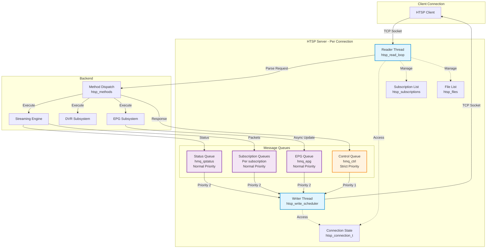
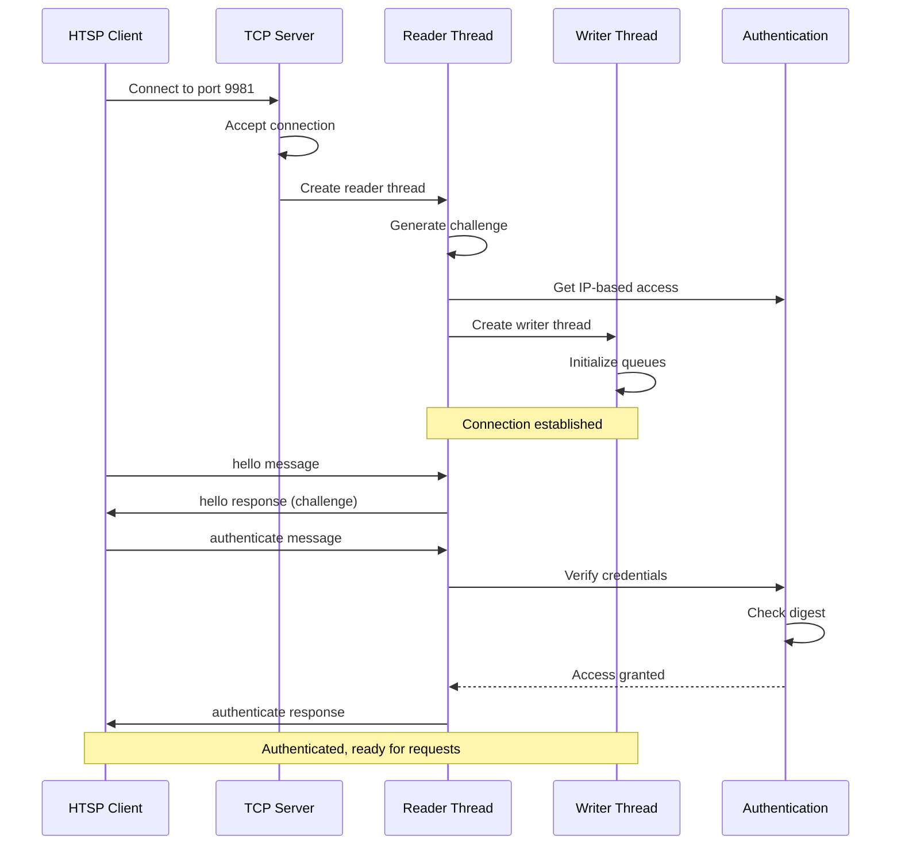
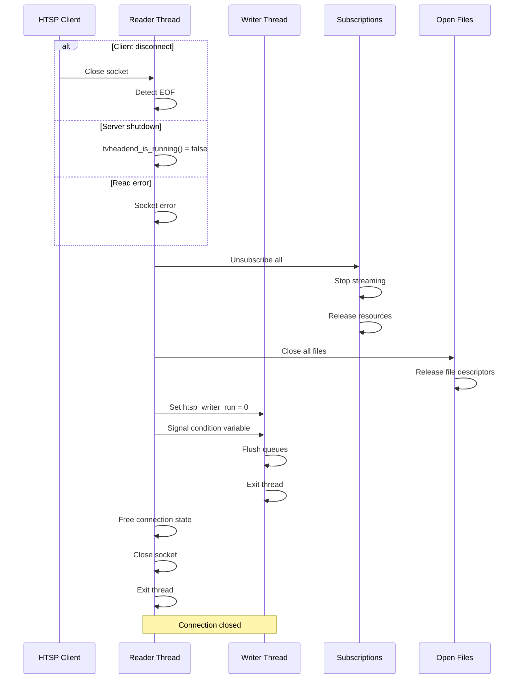
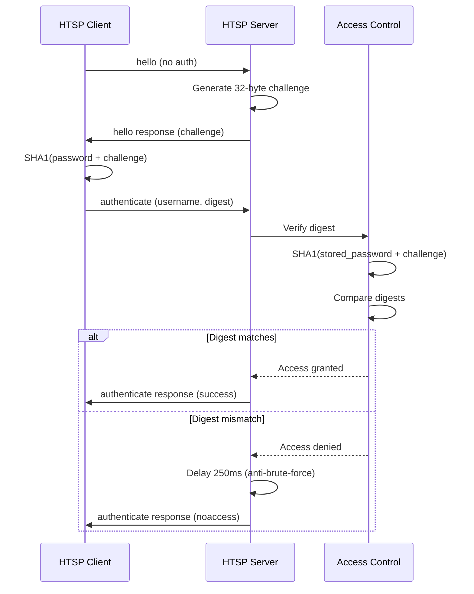

[← Back to Table of Contents](00-TOC.md)

## 16. HTSP Server

The HTSP (Home TV Streaming Protocol) Server provides Tvheadend's native binary protocol for efficient streaming and control. HTSP is designed specifically for TV streaming applications, offering low overhead, full metadata support, and real-time notifications. This section documents the HTSP protocol design, connection handling, message types, and subscription management.

### 16.1 HTSP Protocol Overview

HTSP is Tvheadend's proprietary binary protocol optimized for TV streaming clients. It provides a comprehensive interface for channel browsing, EPG access, live streaming, DVR management, and real-time notifications of system changes.

#### 16.1.1 Protocol Purpose and Design

**Location**: `src/htsp_server.c`, `src/htsp_server.h`

HTSP was designed to address the specific requirements of TV streaming applications:

**Design Goals:**
- **Efficiency**: Binary format reduces overhead compared to text-based protocols
- **Low latency**: Minimal processing for time-sensitive streaming data
- **Rich metadata**: Full support for EPG, channel, and DVR information
- **Real-time updates**: Asynchronous notifications of changes
- **Bidirectional**: Both request/response and server-initiated messages
- **Stateful**: Connection maintains subscription and file state
- **Extensible**: Protocol version negotiation allows backward compatibility

**Key Features:**
- **Binary message format**: Uses htsmsg binary serialization (similar to BSON)
- **Request/response**: Client sends requests, server sends responses with matching sequence numbers
- **Async notifications**: Server pushes updates without client request
- **Streaming integration**: Direct integration with Tvheadend's streaming engine
- **Authentication**: Challenge-response and plain authentication
- **Access control**: Per-user permissions for streaming and recording
- **Multi-subscription**: Single connection can handle multiple simultaneous streams
- **File access**: Direct file I/O for recorded content

**Protocol Version**: Current version is 43 (defined as `HTSP_PROTO_VERSION`)

**Comparison with HTTP Streaming:**

| Feature | HTSP | HTTP |
|---------|------|------|
| Format | Binary | Text/Binary |
| Overhead | Low | Higher |
| Metadata | Rich, integrated | Limited, separate requests |
| Real-time updates | Native | Requires polling or WebSocket |
| Streaming efficiency | Optimized | Standard |
| Client complexity | Requires HTSP library | Standard HTTP client |
| Use case | Dedicated TV clients | Web browsers, generic clients |

#### 16.1.2 Binary Message Format

HTSP uses the htsmsg binary serialization format for all messages. This format is similar to BSON (Binary JSON) and provides efficient encoding of structured data.

**Message Structure:**
```
[4 bytes: message length]
[N bytes: htsmsg binary data]
```

**htsmsg Binary Format:**
- **Maps**: Key-value dictionaries (like JSON objects)
- **Lists**: Ordered arrays (like JSON arrays)
- **Strings**: UTF-8 encoded text
- **Integers**: Signed 32-bit and 64-bit integers
- **Binary data**: Raw byte arrays for streaming packets

**Message Encoding:**
```c
// Example: Creating an HTSP message
htsmsg_t *m = htsmsg_create_map();
htsmsg_add_str(m, "method", "subscribe");
htsmsg_add_u32(m, "subscriptionId", 1);
htsmsg_add_u32(m, "channelId", 123);

// Serialize to binary
htsbuf_queue_t hq;
htsbuf_queue_init(&hq, 0);
htsmsg_binary_serialize(m, &hq, NULL, 0);

// Send over socket
// [4-byte length] + [binary data]
```

**Wire Format Example:**
```
Request:
  Length: 45 bytes
  Data: {
    "method": "subscribe",
    "seq": 1,
    "channelId": 123,
    "subscriptionId": 1
  }

Response:
  Length: 28 bytes
  Data: {
    "seq": 1,
    "success": 1
  }
```

**Advantages of Binary Format:**
- **Compact**: Smaller message size compared to JSON
- **Fast parsing**: No text parsing overhead
- **Type preservation**: Integers remain integers (no string conversion)
- **Binary data**: Efficient embedding of streaming packets
- **Deterministic**: Fixed encoding rules

#### 16.1.3 Message Types

HTSP messages fall into three categories:

**1. Request/Response Messages:**
- Client sends request with "method" and "seq" (sequence number)
- Server responds with matching "seq" and result
- Synchronous operation from client perspective

**2. Asynchronous Notification Messages:**
- Server sends without client request
- No "seq" field (not a response)
- Used for real-time updates (channel changes, EPG updates, etc.)

**3. Streaming Messages:**
- Special high-frequency messages for media data
- "muxpkt" method delivers streaming packets
- Optimized for low latency

**Message Categories:**

**Authentication & Session:**
- `hello` - Initial handshake and capability negotiation
- `authenticate` - User authentication
- `api` - Generic API access (wraps HTTP API)

**System Information:**
- `getDiskSpace` - Query available disk space
- `getSysTime` - Get server system time
- `getProfiles` - List available streaming profiles

**Channel & Tag Management:**
- `getChannel` - Get channel information
- Async: `channelAdd`, `channelUpdate`, `channelDelete` - Channel notifications
- Async: `tagAdd`, `tagUpdate`, `tagDelete` - Tag notifications

**EPG (Electronic Program Guide):**
- `getEvent` - Get single EPG event
- `getEvents` - Get multiple EPG events
- `epgQuery` - Search EPG database
- `getEpgObject` - Get EPG object (episode, season, brand)
- Async: `eventAdd`, `eventUpdate`, `eventDelete` - EPG notifications

**Live Streaming:**
- `subscribe` - Start streaming a channel
- `unsubscribe` - Stop streaming
- `subscriptionChangeWeight` - Change subscription priority
- `subscriptionFilterStream` - Enable/disable specific streams (audio/subtitle tracks)
- `subscriptionSeek` / `subscriptionSkip` - Seek in timeshift buffer
- `subscriptionSpeed` - Change playback speed
- `subscriptionLive` - Jump to live position
- Async: `subscriptionStart` - Subscription started successfully
- Async: `subscriptionStop` - Subscription stopped
- Async: `subscriptionStatus` - Status updates
- Async: `subscriptionGrace` - Grace period notification
- Async: `signalStatus` - Signal quality updates
- Async: `descrambleInfo` - Descrambling status
- Async: `muxpkt` - Streaming packet data
- Async: `queueStatus` - Buffer queue status
- Async: `timeshiftStatus` - Timeshift buffer status

**DVR (Recording):**
- `getDvrConfigs` - List DVR configurations
- `addDvrEntry` - Create recording
- `updateDvrEntry` - Modify recording
- `stopDvrEntry` - Stop active recording
- `cancelDvrEntry` - Cancel scheduled recording
- `deleteDvrEntry` - Delete recording
- `getDvrCutpoints` - Get commercial break markers
- Async: `dvrEntryAdd`, `dvrEntryUpdate`, `dvrEntryDelete` - Recording notifications

**Autorec (Automatic Recording):**
- `addAutorecEntry` - Create autorec rule
- `updateAutorecEntry` - Modify autorec rule
- `deleteAutorecEntry` - Delete autorec rule
- Async: `autorecEntryAdd`, `autorecEntryUpdate`, `autorecEntryDelete` - Autorec notifications

**Timerec (Time-based Recording):**
- `addTimerecEntry` - Create timerec rule
- `updateTimerecEntry` - Modify timerec rule
- `deleteTimerecEntry` - Delete timerec rule
- Async: `timerecEntryAdd`, `timerecEntryUpdate`, `timerecEntryDelete` - Timerec notifications

**File Access:**
- `getTicket` - Get temporary access ticket for HTTP streaming
- `fileOpen` - Open recorded file
- `fileRead` - Read file data
- `fileSeek` - Seek in file
- `fileStat` - Get file information
- `fileClose` - Close file

**Async Control:**
- `enableAsyncMetadata` - Enable/disable async notifications

#### 16.1.4 Protocol Documentation References

**Official HTSP Documentation:**
The complete HTSP protocol specification is maintained in the Tvheadend repository:
- **Protocol specification**: Available in `docs/` directory
- **Message format**: Documented in htsmsg binary format specification
- **Client libraries**: Reference implementations available for various languages

**External Resources:**
- **Kodi (XBMC) PVR addon**: Major HTSP client implementation
- **TVHClient (Android)**: Mobile HTSP client
- **Community documentation**: Available on Tvheadend forums and wiki

**Protocol Evolution:**
- Protocol version negotiated during `hello` handshake
- Server advertises supported version (currently 43)
- Client requests desired version
- Server operates at minimum of both versions
- Allows backward compatibility with older clients

**Version History Highlights:**
- Version 1-10: Initial protocol development
- Version 11-20: EPG enhancements, DVR support
- Version 21-30: Timeshift, descrambling info
- Version 31-40: Streaming improvements, profile support
- Version 41-43: Enhanced metadata, performance optimizations

**Implementation Notes:**
- All strings are UTF-8 encoded
- All integers are signed unless specified
- Timestamps are Unix epoch (seconds since 1970-01-01 00:00:00 UTC)
- Channel IDs, event IDs, and subscription IDs are 32-bit unsigned integers
- UUIDs are represented as strings in hexadecimal format

### 16.2 HTSP Connection Handling

The HTSP server uses a thread-per-connection model with separate reader and writer threads for each client. This architecture provides efficient handling of bidirectional communication while maintaining clean separation between request processing and asynchronous notifications.

#### 16.2.1 Connection Thread Model

**Location**: `src/htsp_server.c`

Each HTSP client connection is handled by two dedicated threads:

**Reader Thread:**
- Reads incoming messages from the socket
- Parses binary htsmsg format
- Dispatches to appropriate method handlers
- Processes requests synchronously
- Runs with `global_lock` held during method execution

**Writer Thread:**
- Sends outgoing messages to the socket
- Manages multiple priority queues
- Handles both responses and async notifications
- Runs independently of reader thread
- Provides flow control and buffering

**Thread Architecture Diagram:**



**Connection Structure:**

```c
typedef struct htsp_connection {
  // Socket and peer information
  int htsp_fd;                              // Socket file descriptor
  struct sockaddr_storage *htsp_peer;       // Client address
  
  // Protocol version
  uint32_t htsp_version;                    // Negotiated protocol version
  
  // Identity
  char *htsp_logname;                       // Log identifier
  char *htsp_peername;                      // Peer address string
  char *htsp_username;                      // Authenticated username
  char *htsp_clientname;                    // Client application name
  char *htsp_language;                      // Preferred language
  
  // EPG async control
  int64_t htsp_epg_window;                  // EPG update window (seconds)
  int64_t htsp_epg_lastupdate;              // Last EPG update time
  mtimer_t htsp_epg_timer;                  // EPG update timer
  
  // Async mode flags
  int htsp_async_mode;                      // HTSP_ASYNC_OFF/ON/EPG
  LIST_ENTRY(htsp_connection) htsp_async_link;  // Async connection list
  
  // Writer thread
  pthread_t htsp_writer_thread;             // Writer thread handle
  int htsp_writer_run;                      // Writer thread running flag
  
  // Output queues
  struct htsp_msg_q_queue htsp_active_output_queues;  // Active queue list
  tvh_mutex_t htsp_out_mutex;               // Output queue mutex
  tvh_cond_t htsp_out_cond;                 // Output queue condition
  
  htsp_msg_q_t htsp_hmq_ctrl;               // Control message queue
  htsp_msg_q_t htsp_hmq_epg;                // EPG update queue
  htsp_msg_q_t htsp_hmq_qstatus;            // Queue status queue
  
  // Subscriptions and files
  struct htsp_subscription_list htsp_subscriptions;      // Active subscriptions
  struct htsp_subscription_list htsp_dead_subscriptions; // Cleanup list
  struct htsp_file_list htsp_files;         // Open files
  int htsp_file_id;                         // Next file ID
  
  // Authentication
  access_t *htsp_granted_access;            // Access permissions
  uint8_t htsp_challenge[32];               // Authentication challenge
  
} htsp_connection_t;
```

#### 16.2.2 Connection Lifecycle

**Connection Establishment:**



**Connection Initialization Steps:**

1. **TCP Accept**: TCP server accepts connection, creates socket
2. **Thread Creation**: Main thread spawns reader thread
3. **Challenge Generation**: Reader generates 32-byte random challenge from `/dev/urandom`
4. **IP-based Access**: Initial access rights based on client IP address
5. **Writer Thread**: Reader spawns writer thread for output
6. **Queue Initialization**: Initialize control, EPG, and status queues
7. **Connection Registration**: Register with connection tracking system
8. **Ready State**: Connection ready to receive `hello` message

**Connection Termination:**



**Cleanup Steps:**

1. **Detect Termination**: Socket error, EOF, or shutdown signal
2. **Unsubscribe All**: Stop all active subscriptions
3. **Close Files**: Close all open file handles
4. **Stop Writer**: Signal writer thread to exit
5. **Flush Queues**: Discard pending messages
6. **Free Resources**: Release memory, close socket
7. **Thread Exit**: Both threads terminate

#### 16.2.3 Authentication Process

HTSP supports two authentication methods:

**1. Challenge-Response Authentication (Recommended):**



**Challenge-Response Details:**
- Server generates 32-byte random challenge
- Client computes: `digest = SHA1(password + challenge)`
- Server computes: `digest = SHA1(stored_password + challenge)`
- Digests compared for authentication
- Password never transmitted over network
- Challenge unique per connection

**2. Plain Authentication (Legacy):**
- Username sent without password verification
- Marked as "unverified" in logs
- Used for testing or trusted networks
- Not recommended for production

**Authentication Message Format:**

```c
// Client sends:
{
  "method": "authenticate",
  "seq": 1,
  "username": "user",
  "digest": [20 bytes of SHA1 digest]
}

// Server responds:
{
  "seq": 1,
  "success": 1
}

// Or on failure:
{
  "seq": 1,
  "noaccess": 1
}
```

**Access Rights:**
After authentication, the connection receives access rights:
- `ACCESS_HTSP_INTERFACE` - Basic HTSP access
- `ACCESS_HTSP_STREAMING` - Live streaming permission
- `ACCESS_HTSP_RECORDER` - DVR/recording permission
- `ACCESS_HTSP_ANONYMIZE` - Anonymize sensitive data

**Connection Limits:**
- Per-user connection limits enforced
- Checked during authentication
- Checked when starting subscriptions
- Returns `connlimit` error if exceeded

#### 16.2.4 Message Handling

**Request Processing Flow:**

```c
// Simplified request handling loop
while (tvheadend_is_running()) {
  // 1. Read message from socket
  if (htsp_read_message(htsp, &m, 0) != 0)
    break;
  
  // 2. Acquire global lock
  tvh_mutex_lock(&global_lock);
  
  // 3. Check for authentication update
  if (htsp_authenticate(htsp, m)) {
    // Update connection tracking
  }
  
  // 4. Extract method name
  method = htsmsg_get_str(m, "method");
  
  // 5. Find method handler
  for (i = 0; i < NUM_METHODS; i++) {
    if (strcmp(method, htsp_methods[i].name) == 0) {
      
      // 6. Check permissions
      if ((htsp->htsp_granted_access->aa_rights &
           htsp_methods[i].privmask) != htsp_methods[i].privmask) {
        // Access denied
        reply = htsmsg_create_map();
        htsmsg_add_u32(reply, "noaccess", 1);
        break;
      }
      
      // 7. Execute method handler
      reply = htsp_methods[i].fn(htsp, m);
      break;
    }
  }
  
  // 8. Release global lock
  tvh_mutex_unlock(&global_lock);
  
  // 9. Send reply
  if (reply != NULL)
    htsp_reply(htsp, m, reply);
  
  // 10. Cleanup
  htsmsg_destroy(m);
}
```

**Key Points:**
- All method handlers execute with `global_lock` held
- Synchronous execution (one request at a time per connection)
- Method handlers return response message or NULL
- NULL response means handler sent reply inline
- Sequence number from request copied to response

**Message Reading:**

```c
int htsp_read_message(htsp_connection_t *htsp, htsmsg_t **mp, int timeout)
{
  uint8_t data[4];
  uint32_t len;
  void *buf;
  
  // Read 4-byte length prefix
  if (tcp_read(htsp->htsp_fd, data, 4) != 0)
    return -1;
  
  len = (data[0] << 24) | (data[1] << 16) | (data[2] << 8) | data[3];
  
  // Sanity check (max 1MB)
  if (len > 1024 * 1024)
    return EMSGSIZE;
  
  // Allocate buffer
  buf = malloc(len);
  
  // Read message data
  if (tcp_read(htsp->htsp_fd, buf, len) != 0) {
    free(buf);
    return -1;
  }
  
  // Deserialize htsmsg
  *mp = htsmsg_binary_deserialize0(buf, len, buf);
  if (*mp == NULL)
    return EBADMSG;
  
  return 0;
}
```

**Message Writing:**

The writer thread handles all outgoing messages through a priority queue system:

```c
void *htsp_write_scheduler(void *aux)
{
  htsp_connection_t *htsp = aux;
  htsp_msg_q_t *hmq;
  htsp_msg_t *hm;
  
  tvh_mutex_lock(&htsp->htsp_out_mutex);
  
  while (htsp->htsp_writer_run) {
    // Wait for messages
    while (TAILQ_EMPTY(&htsp->htsp_active_output_queues)) {
      tvh_cond_wait(&htsp->htsp_out_cond, &htsp->htsp_out_mutex);
      if (!htsp->htsp_writer_run)
        goto exit;
    }
    
    // Get next queue (priority order)
    hmq = TAILQ_FIRST(&htsp->htsp_active_output_queues);
    
    // Get next message from queue
    hm = TAILQ_FIRST(&hmq->hmq_q);
    TAILQ_REMOVE(&hmq->hmq_q, hm, hm_link);
    hmq->hmq_length--;
    hmq->hmq_payload -= hm->hm_payloadsize;
    
    // Remove queue if empty
    if (TAILQ_EMPTY(&hmq->hmq_q))
      TAILQ_REMOVE(&htsp->htsp_active_output_queues, hmq, hmq_link);
    
    tvh_mutex_unlock(&htsp->htsp_out_mutex);
    
    // Serialize and send message
    htsbuf_queue_t hq;
    htsbuf_queue_init(&hq, 0);
    htsmsg_binary_serialize(hm->hm_msg, &hq, NULL, 0);
    
    // Send length prefix + data
    tcp_write_queue(htsp->htsp_fd, &hq);
    
    // Cleanup
    htsp_msg_destroy(hm);
    
    tvh_mutex_lock(&htsp->htsp_out_mutex);
  }
  
exit:
  tvh_mutex_unlock(&htsp->htsp_out_mutex);
  return NULL;
}
```

**Queue Priority:**
1. **Control Queue** (`hmq_ctrl`) - Strict priority
   - Request responses
   - Critical control messages
   - Always serviced first
2. **EPG Queue** (`hmq_epg`) - Normal priority
   - EPG updates
   - Channel/tag updates
3. **Status Queue** (`hmq_qstatus`) - Normal priority
   - Queue status messages
   - Signal status updates
4. **Subscription Queues** (per subscription) - Normal priority
   - Streaming packets
   - Subscription status

**Strict Priority:**
- Control queue has `hmq_strict_prio` flag set
- Always inserted at head of active queue list
- Ensures responses sent before async notifications
- Prevents response starvation

#### 16.2.5 Subscription Management

Each HTSP connection can have multiple active subscriptions (streaming sessions).

**Subscription Structure:**

```c
typedef struct htsp_subscription {
  htsp_connection_t *hs_htsp;               // Parent connection
  LIST_ENTRY(htsp_subscription) hs_link;    // Connection subscription list
  
  int hs_sid;                               // Subscription ID (client-assigned)
  
  th_subscription_t *hs_s;                  // Backend subscription
  streaming_target_t hs_input;              // Streaming target
  profile_chain_t hs_prch;                  // Profile chain (transcoding)
  
  htsp_msg_q_t hs_q;                        // Subscription message queue
  
  int64_t hs_last_report;                   // Last queue status report
  int hs_dropstats[PKT_NTYPES];             // Dropped packet statistics
  int hs_wait_for_video;                    // Waiting for video flag
  int hs_90khz;                             // 90kHz timestamp flag
  int hs_queue_depth;                       // Queue depth limit
  
  uint64_t hs_filtered_streams[8];          // Stream filter bitmap
  int hs_first;                             // First packet flag
  uint32_t hs_data_errors;                  // Data error count
  
} htsp_subscription_t;
```

**Subscription Lifecycle:**

1. **Create**: Client sends `subscribe` message with channel/service ID
2. **Backend Subscribe**: Create `th_subscription_t` in subscription system
3. **Streaming Target**: Register as streaming target to receive packets
4. **Profile Chain**: Setup transcoding profile if requested
5. **Start Notification**: Send `subscriptionStart` message to client
6. **Streaming**: Deliver packets via `muxpkt` messages
7. **Status Updates**: Send periodic status and signal quality updates
8. **Unsubscribe**: Client sends `unsubscribe` or connection closes
9. **Cleanup**: Stop backend subscription, release resources

**Multiple Subscriptions:**
- Single connection can have multiple simultaneous subscriptions
- Each subscription has unique ID assigned by client
- Each subscription has its own message queue
- Allows watching multiple channels simultaneously
- Useful for picture-in-picture or multi-view clients

**Subscription Control:**
- `subscriptionChangeWeight` - Change priority
- `subscriptionFilterStream` - Enable/disable audio/subtitle tracks
- `subscriptionSeek` / `subscriptionSkip` - Seek in timeshift buffer
- `subscriptionSpeed` - Change playback speed (timeshift)
- `subscriptionLive` - Jump to live position (timeshift)

### 16.3 HTSP Message Types

HTSP provides a comprehensive set of message types organized by functional area. This section documents the major message categories and their purposes.

#### 16.3.1 Authentication Messages

**hello**
- **Direction**: Client → Server (request), Server → Client (response)
- **Permission**: `ACCESS_ANONYMOUS` (no authentication required)
- **Purpose**: Initial handshake and protocol version negotiation
- **Request Fields**:
  - `method`: "hello"
  - `seq`: Sequence number
  - `htspversion`: Client's desired protocol version
  - `clientname`: Client application name (optional)
  - `clientversion`: Client version string (optional)
- **Response Fields**:
  - `seq`: Matching sequence number
  - `htspversion`: Server's protocol version (minimum of client and server)
  - `servername`: "Tvheadend"
  - `serverversion`: Server version string
  - `servercapability`: Array of server capabilities
  - `challenge`: 32-byte authentication challenge (binary)
  - `webroot`: Web UI root path (if configured)
- **Example**:
```json
Request:
{
  "method": "hello",
  "seq": 1,
  "htspversion": 43,
  "clientname": "Kodi",
  "clientversion": "20.0"
}

Response:
{
  "seq": 1,
  "htspversion": 43,
  "servername": "Tvheadend",
  "serverversion": "4.3",
  "servercapability": ["imagecache", "timeshift", "transcoding"],
  "challenge": [32 bytes],
  "webroot": ""
}
```

**authenticate**
- **Direction**: Client → Server (request), Server → Client (response)
- **Permission**: `ACCESS_ANONYMOUS` (no authentication required)
- **Purpose**: User authentication using challenge-response
- **Request Fields**:
  - `method`: "authenticate"
  - `seq`: Sequence number
  - `username`: Username
  - `digest`: SHA1(password + challenge) - 20 bytes (binary)
- **Response Fields**:
  - `seq`: Matching sequence number
  - `success`: 1 if authenticated
  - `noaccess`: 1 if authentication failed
  - `connlimit`: 1 if connection limit exceeded
- **Example**:
```json
Request:
{
  "method": "authenticate",
  "seq": 2,
  "username": "admin",
  "digest": [20 bytes of SHA1]
}

Response (success):
{
  "seq": 2,
  "success": 1
}

Response (failure):
{
  "seq": 2,
  "noaccess": 1
}
```

#### 16.3.2 Channel and Tag List Messages

**getChannel**
- **Direction**: Client → Server (request), Server → Client (response)
- **Permission**: `ACCESS_HTSP_STREAMING`
- **Purpose**: Get detailed information about a specific channel
- **Request Fields**:
  - `method`: "getChannel"
  - `seq`: Sequence number
  - `channelId`: Channel ID
- **Response Fields**:
  - `seq`: Matching sequence number
  - `channelId`: Channel ID
  - `channelNumber`: Channel number
  - `channelName`: Channel name
  - `channelIcon`: Channel icon URL
  - `eventId`: Current event ID
  - `nextEventId`: Next event ID
  - `tags`: Array of tag IDs
  - `services`: Array of service information
  - And many more fields...

**Async: channelAdd / channelUpdate**
- **Direction**: Server → Client (async notification)
- **Purpose**: Notify client of channel creation or modification
- **Fields**: Same as `getChannel` response
- **Trigger**: Channel created, modified, or enabled/disabled

**Async: channelDelete**
- **Direction**: Server → Client (async notification)
- **Purpose**: Notify client of channel deletion
- **Fields**:
  - `method`: "channelDelete"
  - `channelId`: Deleted channel ID

**Async: tagAdd / tagUpdate / tagDelete**
- **Direction**: Server → Client (async notification)
- **Purpose**: Notify client of channel tag changes
- **Fields**: Tag information (ID, name, icon, channels, etc.)

**Async: initialSyncCompleted**
- **Direction**: Server → Client (async notification)
- **Purpose**: Indicates all initial channel/tag/EPG data has been sent
- **Fields**:
  - `method`: "initialSyncCompleted"
- **Note**: Sent after `enableAsyncMetadata` completes initial sync

#### 16.3.3 EPG Query Messages

**getEvent**
- **Direction**: Client → Server (request), Server → Client (response)
- **Permission**: `ACCESS_HTSP_STREAMING`
- **Purpose**: Get detailed information about a specific EPG event
- **Request Fields**:
  - `method`: "getEvent"
  - `seq`: Sequence number
  - `eventId`: Event ID
- **Response Fields**:
  - `seq`: Matching sequence number
  - `eventId`: Event ID
  - `channelId`: Channel ID
  - `start`: Start time (Unix timestamp)
  - `stop`: Stop time (Unix timestamp)
  - `title`: Event title
  - `subtitle`: Event subtitle
  - `description`: Full description
  - `summary`: Short summary
  - `genre`: Array of genre IDs
  - `episodeNumber`: Episode number
  - `seasonNumber`: Season number
  - `seriesLink`: Series link ID
  - `contentType`: Content type
  - `ageRating`: Age rating
  - `starRating`: Star rating (1-5)
  - `image`: Event image URL
  - And more...

**getEvents**
- **Direction**: Client → Server (request), Server → Client (response)
- **Permission**: `ACCESS_HTSP_STREAMING`
- **Purpose**: Get multiple EPG events for a channel
- **Request Fields**:
  - `method`: "getEvents"
  - `seq`: Sequence number
  - `eventId`: Starting event ID (optional)
  - `channelId`: Channel ID (optional)
  - `numFollowing`: Number of following events (default: 0)
  - `maxTime`: Maximum time (Unix timestamp, optional)
- **Response Fields**:
  - `seq`: Matching sequence number
  - `events`: Array of event objects (same format as `getEvent`)

**epgQuery**
- **Direction**: Client → Server (request), Server → Client (response)
- **Permission**: `ACCESS_HTSP_STREAMING`
- **Purpose**: Search EPG database
- **Request Fields**:
  - `method`: "epgQuery"
  - `seq`: Sequence number
  - `query`: Search query string
  - `channelId`: Limit to specific channel (optional)
  - `tagId`: Limit to specific tag (optional)
  - `contentType`: Limit to content type (optional)
  - `minduration`: Minimum duration in seconds (optional)
  - `maxduration`: Maximum duration in seconds (optional)
  - `language`: Preferred language (optional)
  - `full`: Include full description (optional)
- **Response Fields**:
  - `seq`: Matching sequence number
  - `eventIds`: Array of matching event IDs
  - `entries`: Array of event objects (if `full` requested)

**getEpgObject**
- **Direction**: Client → Server (request), Server → Client (response)
- **Permission**: `ACCESS_HTSP_STREAMING`
- **Purpose**: Get EPG object (episode, season, brand) information
- **Request Fields**:
  - `method`: "getEpgObject"
  - `seq`: Sequence number
  - `id`: Object ID
  - `type`: Object type ("episode", "season", "brand")
- **Response Fields**:
  - `seq`: Matching sequence number
  - Object-specific fields (title, summary, image, etc.)

**Async: eventAdd / eventUpdate**
- **Direction**: Server → Client (async notification)
- **Purpose**: Notify client of EPG event creation or modification
- **Fields**: Same as `getEvent` response
- **Trigger**: EPG data updated from grabbers

**Async: eventDelete**
- **Direction**: Server → Client (async notification)
- **Purpose**: Notify client of EPG event deletion
- **Fields**:
  - `method`: "eventDelete"
  - `eventId`: Deleted event ID

#### 16.3.4 Subscription Control Messages

**subscribe**
- **Direction**: Client → Server (request), Server → Client (response)
- **Permission**: `ACCESS_HTSP_STREAMING`
- **Purpose**: Start streaming a channel or service
- **Request Fields**:
  - `method`: "subscribe"
  - `seq`: Sequence number
  - `subscriptionId`: Client-assigned subscription ID
  - `channelId`: Channel ID (or `serviceId`)
  - `weight`: Subscription priority (default: 150)
  - `timeshiftPeriod`: Timeshift buffer size in seconds (optional)
  - `normts`: Request normalized timestamps (optional)
  - `queueDepth`: Queue depth limit (optional)
  - `profile`: Streaming profile name (optional)
- **Response Fields**:
  - `seq`: Matching sequence number
  - `success`: 1 if subscription created
  - `error`: Error message if failed

**unsubscribe**
- **Direction**: Client → Server (request), Server → Client (response)
- **Permission**: `ACCESS_HTSP_STREAMING`
- **Purpose**: Stop streaming
- **Request Fields**:
  - `method`: "unsubscribe"
  - `seq`: Sequence number
  - `subscriptionId`: Subscription ID to stop
- **Response Fields**:
  - `seq`: Matching sequence number
  - `success`: 1

**subscriptionChangeWeight**
- **Direction**: Client → Server (request), Server → Client (response)
- **Permission**: `ACCESS_HTSP_STREAMING`
- **Purpose**: Change subscription priority
- **Request Fields**:
  - `method`: "subscriptionChangeWeight"
  - `seq`: Sequence number
  - `subscriptionId`: Subscription ID
  - `weight`: New priority value
- **Response Fields**:
  - `seq`: Matching sequence number
  - `success`: 1

**subscriptionFilterStream**
- **Direction**: Client → Server (request), Server → Client (response)
- **Permission**: `ACCESS_HTSP_STREAMING`
- **Purpose**: Enable/disable specific streams (audio/subtitle tracks)
- **Request Fields**:
  - `method`: "subscriptionFilterStream"
  - `seq`: Sequence number
  - `subscriptionId`: Subscription ID
  - `enable`: Array of stream indexes to enable
  - `disable`: Array of stream indexes to disable
- **Response Fields**:
  - `seq`: Matching sequence number
  - `success`: 1

**subscriptionSeek / subscriptionSkip**
- **Direction**: Client → Server (request), Server → Client (response)
- **Permission**: `ACCESS_HTSP_STREAMING`
- **Purpose**: Seek in timeshift buffer
- **Request Fields**:
  - `method`: "subscriptionSeek" or "subscriptionSkip"
  - `seq`: Sequence number
  - `subscriptionId`: Subscription ID
  - `time`: Absolute time (Unix timestamp) for seek
  - `offset`: Relative offset in milliseconds for skip
- **Response Fields**:
  - `seq`: Matching sequence number
  - `success`: 1

**subscriptionSpeed**
- **Direction**: Client → Server (request), Server → Client (response)
- **Permission**: `ACCESS_HTSP_STREAMING`
- **Purpose**: Change playback speed (timeshift only)
- **Request Fields**:
  - `method`: "subscriptionSpeed"
  - `seq`: Sequence number
  - `subscriptionId`: Subscription ID
  - `speed`: Speed multiplier (100 = normal, 200 = 2x, 50 = 0.5x)
- **Response Fields**:
  - `seq`: Matching sequence number
  - `success`: 1

**subscriptionLive**
- **Direction**: Client → Server (request), Server → Client (response)
- **Permission**: `ACCESS_HTSP_STREAMING`
- **Purpose**: Jump to live position in timeshift buffer
- **Request Fields**:
  - `method`: "subscriptionLive"
  - `seq`: Sequence number
  - `subscriptionId`: Subscription ID
- **Response Fields**:
  - `seq`: Matching sequence number
  - `success`: 1

**Async: subscriptionStart**
- **Direction**: Server → Client (async notification)
- **Purpose**: Indicates subscription successfully started
- **Fields**:
  - `method`: "subscriptionStart"
  - `subscriptionId`: Subscription ID
  - `streams`: Array of stream information (codec, type, language, etc.)
  - `sourceinfo`: Source information (adapter, network, mux, service)
- **Note**: Sent before first `muxpkt` message

**Async: subscriptionStop**
- **Direction**: Server → Client (async notification)
- **Purpose**: Indicates subscription stopped
- **Fields**:
  - `method`: "subscriptionStop"
  - `subscriptionId`: Subscription ID
  - `status`: Stop reason code

**Async: subscriptionStatus**
- **Direction**: Server → Client (async notification)
- **Purpose**: Subscription status update
- **Fields**:
  - `method`: "subscriptionStatus"
  - `subscriptionId`: Subscription ID
  - `status`: Status message
  - `subscriptionError`: Error message (if error)

**Async: subscriptionGrace**
- **Direction**: Server → Client (async notification)
- **Purpose**: Grace period notification (testing service quality)
- **Fields**:
  - `method`: "subscriptionGrace"
  - `subscriptionId`: Subscription ID
  - `graceTimeout`: Grace period duration in seconds

**Async: subscriptionSpeed**
- **Direction**: Server → Client (async notification)
- **Purpose**: Speed change notification
- **Fields**:
  - `method`: "subscriptionSpeed"
  - `subscriptionId`: Subscription ID
  - `speed`: Current speed

**Async: subscriptionSkip**
- **Direction**: Server → Client (async notification)
- **Purpose**: Skip operation completed
- **Fields**:
  - `method`: "subscriptionSkip"
  - `subscriptionId`: Subscription ID
  - `time`: Current time position
  - `size`: Timeshift buffer size

**Async: muxpkt**
- **Direction**: Server → Client (async notification)
- **Purpose**: Deliver streaming packet data
- **Fields**:
  - `method`: "muxpkt"
  - `subscriptionId`: Subscription ID
  - `stream`: Stream index
  - `dts`: Decode timestamp (90kHz or microseconds)
  - `pts`: Presentation timestamp (90kHz or microseconds)
  - `duration`: Packet duration
  - `frametype`: Frame type (I, P, B)
  - `payload`: Packet data (binary)
- **Note**: High-frequency message, optimized for performance

**Async: queueStatus**
- **Direction**: Server → Client (async notification)
- **Purpose**: Buffer queue status update
- **Fields**:
  - `method`: "queueStatus"
  - `subscriptionId`: Subscription ID
  - `packets`: Number of packets in queue
  - `bytes`: Number of bytes in queue
  - `delay`: Queue delay in microseconds
  - `Bdrops`: Number of B-frame drops
  - `Pdrops`: Number of P-frame drops
  - `Idrops`: Number of I-frame drops

**Async: signalStatus**
- **Direction**: Server → Client (async notification)
- **Purpose**: Signal quality update
- **Fields**:
  - `method`: "signalStatus"
  - `subscriptionId`: Subscription ID
  - `feStatus`: Frontend status string
  - `feBER`: Bit error rate
  - `feUNC`: Uncorrected blocks
  - `feSignal`: Signal strength (0-65535)
  - `feSNR`: Signal-to-noise ratio (0-65535)

**Async: descrambleInfo**
- **Direction**: Server → Client (async notification)
- **Purpose**: Descrambling status update
- **Fields**:
  - `method`: "descrambleInfo"
  - `subscriptionId`: Subscription ID
  - `pid`: PID being descrambled
  - `caid`: CA system ID
  - `provid`: Provider ID
  - `ecmtime`: ECM processing time in milliseconds
  - `hops`: Number of hops to CA server
  - `cardsystem`: Card system name

**Async: timeshiftStatus**
- **Direction**: Server → Client (async notification)
- **Purpose**: Timeshift buffer status
- **Fields**:
  - `method`: "timeshiftStatus"
  - `subscriptionId`: Subscription ID
  - `full`: 1 if buffer is full
  - `shift`: Current shift in seconds
  - `start`: Buffer start time
  - `end`: Buffer end time

#### 16.3.5 DVR Operation Messages

**getDvrConfigs**
- **Direction**: Client → Server (request), Server → Client (response)
- **Permission**: `ACCESS_HTSP_RECORDER`
- **Purpose**: List available DVR configurations
- **Request Fields**:
  - `method`: "getDvrConfigs"
  - `seq`: Sequence number
- **Response Fields**:
  - `seq`: Matching sequence number
  - `dvrconfigs`: Array of DVR configuration objects

**addDvrEntry**
- **Direction**: Client → Server (request), Server → Client (response)
- **Permission**: `ACCESS_HTSP_RECORDER`
- **Purpose**: Create a new recording
- **Request Fields**:
  - `method`: "addDvrEntry"
  - `seq`: Sequence number
  - `eventId`: EPG event ID (optional)
  - `channelId`: Channel ID (required if no eventId)
  - `start`: Start time (Unix timestamp)
  - `stop`: Stop time (Unix timestamp)
  - `title`: Recording title
  - `subtitle`: Recording subtitle (optional)
  - `description`: Description (optional)
  - `startExtra`: Pre-recording padding in minutes (optional)
  - `stopExtra`: Post-recording padding in minutes (optional)
  - `priority`: Recording priority (optional)
  - `configName`: DVR config name (optional)
  - And more...
- **Response Fields**:
  - `seq`: Matching sequence number
  - `id`: Created DVR entry ID
  - `success`: 1 if created
  - `error`: Error message if failed

**updateDvrEntry**
- **Direction**: Client → Server (request), Server → Client (response)
- **Permission**: `ACCESS_HTSP_RECORDER`
- **Purpose**: Modify existing recording
- **Request Fields**:
  - `method`: "updateDvrEntry"
  - `seq`: Sequence number
  - `id`: DVR entry ID
  - Fields to update (same as `addDvrEntry`)
- **Response Fields**:
  - `seq`: Matching sequence number
  - `success`: 1 if updated
  - `error`: Error message if failed

**stopDvrEntry**
- **Direction**: Client → Server (request), Server → Client (response)
- **Permission**: `ACCESS_HTSP_RECORDER`
- **Purpose**: Stop active recording
- **Request Fields**:
  - `method`: "stopDvrEntry"
  - `seq`: Sequence number
  - `id`: DVR entry ID
- **Response Fields**:
  - `seq`: Matching sequence number
  - `success`: 1

**cancelDvrEntry**
- **Direction**: Client → Server (request), Server → Client (response)
- **Permission**: `ACCESS_HTSP_RECORDER`
- **Purpose**: Cancel scheduled recording
- **Request Fields**:
  - `method`: "cancelDvrEntry"
  - `seq`: Sequence number
  - `id`: DVR entry ID
- **Response Fields**:
  - `seq`: Matching sequence number
  - `success`: 1

**deleteDvrEntry**
- **Direction**: Client → Server (request), Server → Client (response)
- **Permission**: `ACCESS_HTSP_RECORDER`
- **Purpose**: Delete recording (including file)
- **Request Fields**:
  - `method`: "deleteDvrEntry"
  - `seq`: Sequence number
  - `id`: DVR entry ID
- **Response Fields**:
  - `seq`: Matching sequence number
  - `success`: 1

**getDvrCutpoints**
- **Direction**: Client → Server (request), Server → Client (response)
- **Permission**: `ACCESS_HTSP_RECORDER`
- **Purpose**: Get commercial break markers
- **Request Fields**:
  - `method`: "getDvrCutpoints"
  - `seq`: Sequence number
  - `id`: DVR entry ID
- **Response Fields**:
  - `seq`: Matching sequence number
  - `cutpoints`: Array of cutpoint objects (start, end, type)

**addAutorecEntry / updateAutorecEntry / deleteAutorecEntry**
- **Direction**: Client → Server (request), Server → Client (response)
- **Permission**: `ACCESS_HTSP_RECORDER`
- **Purpose**: Manage automatic recording rules
- **Fields**: Similar to DVR entry messages but for autorec rules

**addTimerecEntry / updateTimerecEntry / deleteTimerecEntry**
- **Direction**: Client → Server (request), Server → Client (response)
- **Permission**: `ACCESS_HTSP_RECORDER`
- **Purpose**: Manage time-based recording rules
- **Fields**: Similar to DVR entry messages but for timerec rules

**Async: dvrEntryAdd / dvrEntryUpdate / dvrEntryDelete**
- **Direction**: Server → Client (async notification)
- **Purpose**: Notify client of DVR entry changes
- **Fields**: DVR entry information

**Async: autorecEntryAdd / autorecEntryUpdate / autorecEntryDelete**
- **Direction**: Server → Client (async notification)
- **Purpose**: Notify client of autorec rule changes
- **Fields**: Autorec rule information

**Async: timerecEntryAdd / timerecEntryUpdate / timerecEntryDelete**
- **Direction**: Server → Client (async notification)
- **Purpose**: Notify client of timerec rule changes
- **Fields**: Timerec rule information

#### 16.3.6 File Access Messages

**getTicket**
- **Direction**: Client → Server (request), Server → Client (response)
- **Permission**: `ACCESS_HTSP_STREAMING`
- **Purpose**: Get temporary access ticket for HTTP streaming
- **Request Fields**:
  - `method`: "getTicket"
  - `seq`: Sequence number
  - `channelId`: Channel ID (for live streaming)
  - `dvrId`: DVR entry ID (for recorded content)
- **Response Fields**:
  - `seq`: Matching sequence number
  - `ticket`: Temporary access ticket string
  - `path`: HTTP path to use with ticket

**fileOpen**
- **Direction**: Client → Server (request), Server → Client (response)
- **Permission**: `ACCESS_HTSP_RECORDER`
- **Purpose**: Open recorded file for reading
- **Request Fields**:
  - `method`: "fileOpen"
  - `seq`: Sequence number
  - `file`: File path (relative to DVR storage)
- **Response Fields**:
  - `seq`: Matching sequence number
  - `id`: File handle ID
  - `size`: File size in bytes
  - `mtime`: File modification time

**fileRead**
- **Direction**: Client → Server (request), Server → Client (response)
- **Permission**: `ACCESS_HTSP_RECORDER`
- **Purpose**: Read data from open file
- **Request Fields**:
  - `method`: "fileRead"
  - `seq`: Sequence number
  - `id`: File handle ID
  - `size`: Number of bytes to read
- **Response Fields**:
  - `seq`: Matching sequence number
  - `data`: File data (binary)

**fileSeek**
- **Direction**: Client → Server (request), Server → Client (response)
- **Permission**: `ACCESS_HTSP_RECORDER`
- **Purpose**: Seek in open file
- **Request Fields**:
  - `method`: "fileSeek"
  - `seq`: Sequence number
  - `id`: File handle ID
  - `offset`: Byte offset
  - `whence`: Seek mode (SEEK_SET=0, SEEK_CUR=1, SEEK_END=2)
- **Response Fields**:
  - `seq`: Matching sequence number
  - `offset`: New file position

**fileStat**
- **Direction**: Client → Server (request), Server → Client (response)
- **Permission**: `ACCESS_HTSP_RECORDER`
- **Purpose**: Get file information
- **Request Fields**:
  - `method`: "fileStat"
  - `seq`: Sequence number
  - `id`: File handle ID
- **Response Fields**:
  - `seq`: Matching sequence number
  - `size`: File size
  - `mtime`: Modification time

**fileClose**
- **Direction**: Client → Server (request), Server → Client (response)
- **Permission**: `ACCESS_HTSP_RECORDER`
- **Purpose**: Close open file
- **Request Fields**:
  - `method`: "fileClose"
  - `seq`: Sequence number
  - `id`: File handle ID
- **Response Fields**:
  - `seq`: Matching sequence number
  - `success`: 1

#### 16.3.7 System Information Messages

**getDiskSpace**
- **Direction**: Client → Server (request), Server → Client (response)
- **Permission**: `ACCESS_HTSP_STREAMING`
- **Purpose**: Query available disk space for recordings
- **Request Fields**:
  - `method`: "getDiskSpace"
  - `seq`: Sequence number
- **Response Fields**:
  - `seq`: Matching sequence number
  - `freediskspace`: Free space in bytes
  - `totaldiskspace`: Total space in bytes
  - `useddiskspace`: Used space in bytes

**getSysTime**
- **Direction**: Client → Server (request), Server → Client (response)
- **Permission**: `ACCESS_HTSP_STREAMING`
- **Purpose**: Get server system time
- **Request Fields**:
  - `method`: "getSysTime"
  - `seq`: Sequence number
- **Response Fields**:
  - `seq`: Matching sequence number
  - `time`: Current Unix timestamp
  - `timezone`: Timezone offset in minutes
  - `gmtoffset`: GMT offset in seconds

**getProfiles**
- **Direction**: Client → Server (request), Server → Client (response)
- **Permission**: `ACCESS_HTSP_STREAMING`
- **Purpose**: List available streaming profiles
- **Request Fields**:
  - `method`: "getProfiles"
  - `seq`: Sequence number
- **Response Fields**:
  - `seq`: Matching sequence number
  - `profiles`: Array of profile objects (name, title, comment)

**enableAsyncMetadata**
- **Direction**: Client → Server (request), Server → Client (response)
- **Permission**: `ACCESS_HTSP_STREAMING`
- **Purpose**: Enable/disable asynchronous metadata updates
- **Request Fields**:
  - `method`: "enableAsyncMetadata"
  - `seq`: Sequence number
  - `epg`: Enable EPG updates (0 or 1)
  - `epgMaxTime`: Maximum EPG time window in seconds (optional)
- **Response Fields**:
  - `seq`: Matching sequence number
  - `success`: 1
- **Note**: After enabling, server sends initial sync of all channels, tags, and EPG data, followed by `initialSyncCompleted` message

**api**
- **Direction**: Client → Server (request), Server → Client (response)
- **Permission**: `ACCESS_ANONYMOUS` (but API methods have their own permissions)
- **Purpose**: Generic API access (wraps HTTP API)
- **Request Fields**:
  - `method`: "api"
  - `seq`: Sequence number
  - `path`: API path (e.g., "/api/channel/grid")
  - `args`: API arguments (htsmsg map)
- **Response Fields**:
  - `seq`: Matching sequence number
  - `response`: API response (htsmsg map)
- **Note**: Allows HTSP clients to access full HTTP API functionality

#### 16.3.8 Message Type Summary

**Request/Response Messages (39 methods):**
- Authentication: `hello`, `authenticate`, `api`
- System: `getDiskSpace`, `getSysTime`, `getProfiles`, `enableAsyncMetadata`
- Channels: `getChannel`
- EPG: `getEvent`, `getEvents`, `epgQuery`, `getEpgObject`
- Subscriptions: `subscribe`, `unsubscribe`, `subscriptionChangeWeight`, `subscriptionFilterStream`, `subscriptionSeek`, `subscriptionSkip`, `subscriptionSpeed`, `subscriptionLive`
- DVR: `getDvrConfigs`, `addDvrEntry`, `updateDvrEntry`, `stopDvrEntry`, `cancelDvrEntry`, `deleteDvrEntry`, `getDvrCutpoints`
- Autorec: `addAutorecEntry`, `updateAutorecEntry`, `deleteAutorecEntry`
- Timerec: `addTimerecEntry`, `updateTimerecEntry`, `deleteTimerecEntry`
- Files: `getTicket`, `fileOpen`, `fileRead`, `fileSeek`, `fileStat`, `fileClose`

**Async Notification Messages (20+ types):**
- Channels: `channelAdd`, `channelUpdate`, `channelDelete`
- Tags: `tagAdd`, `tagUpdate`, `tagDelete`
- EPG: `eventAdd`, `eventUpdate`, `eventDelete`
- Subscriptions: `subscriptionStart`, `subscriptionStop`, `subscriptionStatus`, `subscriptionGrace`, `subscriptionSpeed`, `subscriptionSkip`, `muxpkt`, `queueStatus`, `signalStatus`, `descrambleInfo`, `timeshiftStatus`
- DVR: `dvrEntryAdd`, `dvrEntryUpdate`, `dvrEntryDelete`
- Autorec: `autorecEntryAdd`, `autorecEntryUpdate`, `autorecEntryDelete`
- Timerec: `timerecEntryAdd`, `timerecEntryUpdate`, `timerecEntryDelete`
- System: `initialSyncCompleted`

---

[← Previous](15-HTTP-API-Server.md) | [Table of Contents](00-TOC.md) | [Next →](17-SATIP-Server.md)
