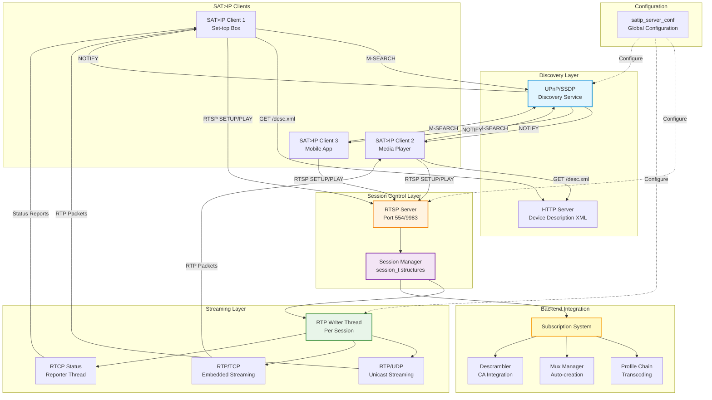
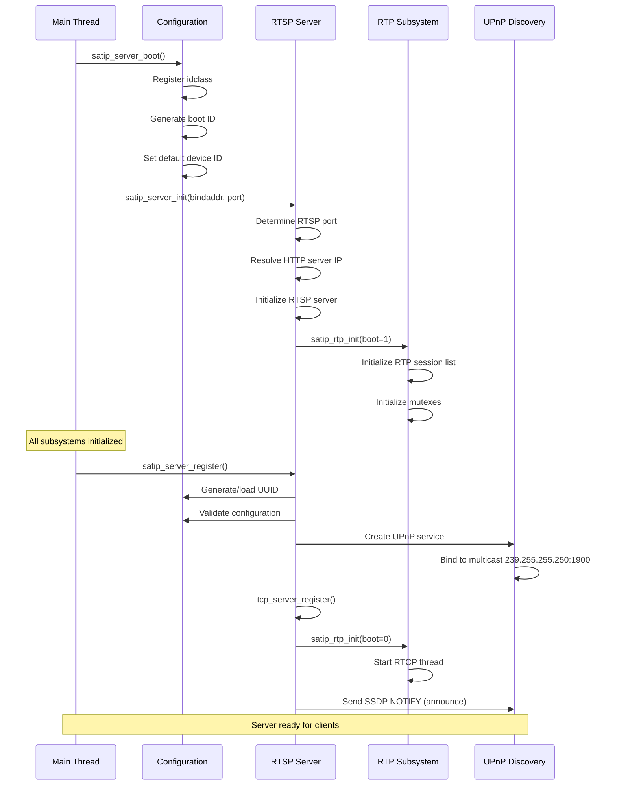
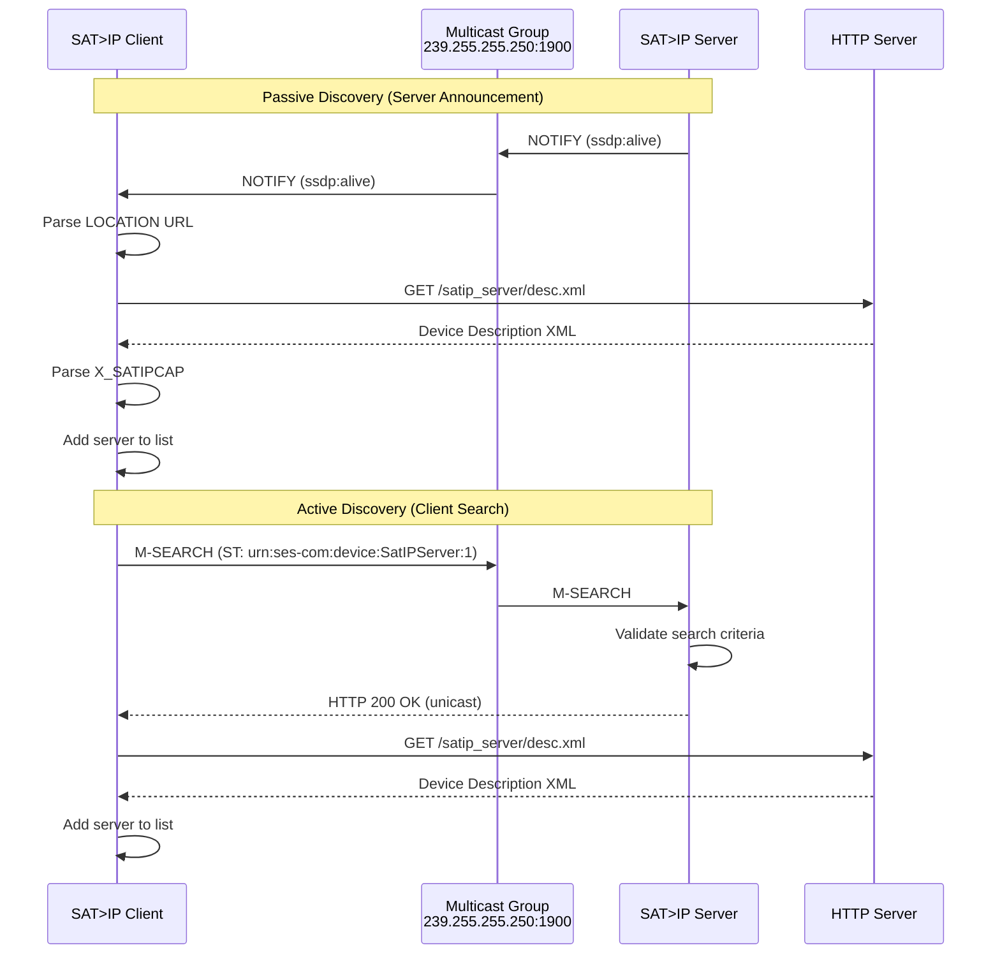

[← Back to Table of Contents](00-TOC.md)

## 17. SAT>IP Server

The SAT>IP Server subsystem enables Tvheadend to act as a SAT>IP server, allowing SAT>IP compatible clients to stream TV content over IP networks using the SAT>IP protocol. SAT>IP is a standardized protocol (developed by SES) that enables distribution of satellite, terrestrial, and cable TV signals over IP networks using RTSP for session control and RTP for media streaming. This section documents the SAT>IP server architecture, RTSP protocol implementation, RTP streaming, session management, and UPnP discovery mechanisms.

### 17.1 SAT>IP Server Architecture

The SAT>IP server implementation in Tvheadend provides a complete SAT>IP server that exposes tuners and services to SAT>IP clients on the network. It implements the full SAT>IP specification including RTSP session control, RTP/UDP and RTP/TCP streaming, RTCP status reporting, and UPnP/SSDP discovery.

#### 17.1.1 SAT>IP Protocol Overview

**Location**: `src/satip/server.h`, `src/satip/server.c`

SAT>IP is a standardized protocol for streaming broadcast TV over IP networks. It was developed by SES (Société Européenne des Satellites) and is widely supported by set-top boxes, media players, and TV applications.

**Protocol Components:**

1. **RTSP (Real Time Streaming Protocol)**: Session control protocol for SETUP, PLAY, TEARDOWN operations
2. **RTP (Real-time Transport Protocol)**: Media transport protocol for streaming MPEG-TS packets
3. **RTCP (RTP Control Protocol)**: Status and control feedback protocol
4. **UPnP/SSDP**: Service discovery protocol for automatic client detection
5. **HTTP**: Device description and playlist serving

**Key Features:**
- **Multi-tuner support**: Exposes multiple virtual tuners to clients
- **Multiple delivery systems**: DVB-S/S2, DVB-T/T2, DVB-C/C2, ATSC, ISDB-T
- **Flexible streaming**: UDP unicast or TCP embedded RTP
- **Descrambling**: Optional descrambling of encrypted services
- **PMT rewriting**: Selective service filtering in PMT tables
- **NAT support**: External IP/port configuration for NAT traversal
- **Access control**: Per-user connection limits and anonymization

**SAT>IP Architecture Diagram:**



#### 17.1.2 Server Configuration Structure

**Location**: `src/satip/server.h`

The SAT>IP server uses a global configuration structure that controls all aspects of server behavior.

**Structure Definition:**
```c
struct satip_server_conf {
  idnode_t idnode;                      // Configuration node
  
  // Server identity
  int satip_deviceid;                   // Device ID (1-254)
  char *satip_uuid;                     // Server UUID
  
  // Network settings
  int satip_rtsp;                       // RTSP port (554 or 9983, 0=disable)
  char *satip_nat_ip;                   // External IP for NAT
  int satip_nat_rtsp;                   // External RTSP port for NAT
  int satip_nat_name_force;             // Force NAT address announcement
  char *satip_rtp_src_ip;               // RTP source IP binding
  
  // Subscription settings
  int satip_weight;                     // Default subscription weight
  int satip_allow_remote_weight;        // Accept client weight parameter
  
  // Descrambling settings
  int satip_descramble;                 // Max services to descramble per mux
  int satip_rewrite_pmt;                // Rewrite PMT for filtered services
  
  // Mux handling
  int satip_muxcnf;                     // Mux configuration mode
                                        // MUXCNF_AUTO: Auto-create muxes
                                        // MUXCNF_KEEP: Keep created muxes
                                        // MUXCNF_REJECT: Reject unknown muxes
                                        // MUXCNF_REJECT_EXACT_MATCH: Strict matching
  
  // RTP settings
  int satip_rtptcpsize;                 // RTP/TCP payload size (in 188-byte units)
  int satip_notcp_mode;                 // Disable RTP/TCP support
  
  // Feature flags
  int satip_nom3u;                      // Disable M3U playlist announcement
  int satip_anonymize;                  // Show only own sessions
  int satip_noupnp;                     // Disable UPnP discovery
  int satip_drop_fe;                    // Ignore frontend parameter
  int satip_restrict_pids_all;         // Restrict "pids=all" to safe PIDs
  
  // Signal level settings
  int satip_iptv_sig_level;             // Signal level for IPTV sources (0-240)
  int satip_force_sig_level;            // Force signal level for all (0=auto)
  
  // Tuner export configuration
  int satip_dvbs;                       // Number of DVB-S tuners to export
  int satip_dvbs2;                      // Number of DVB-S2 tuners to export
  int satip_dvbt;                       // Number of DVB-T tuners to export
  int satip_dvbt2;                      // Number of DVB-T2 tuners to export
  int satip_dvbc;                       // Number of DVB-C tuners to export
  int satip_dvbc2;                      // Number of DVB-C2 tuners to export
  int satip_atsc_t;                     // Number of ATSC-T tuners to export
  int satip_atsc_c;                     // Number of ATSC-C tuners to export
  int satip_isdb_t;                     // Number of ISDB-T tuners to export
  
  // Connection limits
  int satip_max_sessions;               // Max concurrent sessions (0=unlimited)
  int satip_max_user_connections;       // Max connections per IP (0=unlimited)
};

extern struct satip_server_conf satip_server_conf;
```

**Key Configuration Options:**

1. **RTSP Port**: Default 554 (standard) or 9983 (non-privileged), 0 to disable
2. **Tuner Export**: Configure how many tuners of each type to advertise
3. **Descrambling**: Limit number of services to descramble per mux
4. **Mux Handling**: Control automatic mux creation behavior
5. **NAT Support**: Configure external IP/port for NAT environments
6. **Connection Limits**: Prevent resource exhaustion

#### 17.1.3 Server Initialization

The SAT>IP server initializes in multiple phases during Tvheadend startup.

**Initialization Sequence:**



**Boot Phase** (`satip_server_boot()`):
```c
void satip_server_boot(void)
{
  // Register configuration class
  idclass_register(&satip_server_class);
  
  // Generate boot ID (used in UPnP)
  satip_server_bootid = time(NULL);
  
  // Set default device ID
  satip_server_conf.satip_deviceid = 1;
  
  // Set default RTP/TCP payload size (7896 bytes = 42 TS packets)
  satip_server_conf.satip_rtptcpsize = 7896/188;
}
```

**Initialization Phase** (`satip_server_init()`):
```c
void satip_server_init(const char *bindaddr, int rtsp_port)
{
  // Initialize reinit mutex
  tvh_mutex_init(&satip_server_reinit, NULL);
  
  // Store bind address
  satip_server_bindaddr = bindaddr ? strdup(bindaddr) : NULL;
  
  // Determine RTSP port
  satip_server_rtsp_port_locked = rtsp_port > 0;
  satip_server_rtsp_port = rtsp_port;
  satips_rtsp_port(rtsp_port);  // Validate port (requires root for <1024)
  
  // Initialize RTSP server and RTP subsystem
  satip_server_init_common("", 0);
}
```

**Registration Phase** (`satip_server_register()`):
```c
void satip_server_register(void)
{
  // Generate UUID if not present
  if (strempty(satip_server_conf.satip_uuid)) {
    uuid_set(&u, NULL);
    // Format as UPnP UUID string
    satip_server_conf.satip_uuid = format_uuid(&u);
  }
  
  // Create UPnP discovery service (unless disabled)
  if (!satip_server_conf.satip_noupnp) {
    satips_upnp_discovery = upnp_service_create(upnp_service);
    satips_upnp_discovery->us_received = satips_upnp_discovery_received;
    satips_upnp_discovery->us_destroy  = satips_upnp_discovery_destroy;
  }
  
  // Register RTSP server
  satip_server_rtsp_register();
  
  // Start RTCP thread
  satip_rtp_init(0);
  
  // Send initial UPnP announcement
  satips_upnp_send_announce();
}
```

#### 17.1.4 Device Description XML

The SAT>IP server provides a UPnP device description XML file that clients use to discover server capabilities.

**XML Generation** (`satip_server_http_xml()`):

The device description includes:
- **Device information**: Friendly name, manufacturer, model
- **Server UUID**: Unique identifier
- **Tuner capabilities**: X_SATIPCAP field listing available tuners
- **Icons**: PNG and JPEG icons at multiple resolutions
- **Presentation URL**: Link to web interface
- **M3U playlist**: Optional channel list URL

**Example Device Description:**
```xml
<?xml version="1.0"?>
<root xmlns="urn:schemas-upnp-org:device-1-0" configId="0">
<specVersion><major>1</major><minor>1</minor></specVersion>
<device>
<deviceType>urn:ses-com:device:SatIPServer:1</deviceType>
<friendlyName>Tvheadend:9983 abc123...</friendlyName>
<manufacturer>TVHeadend Team</manufacturer>
<manufacturerURL>http://tvheadend.org</manufacturerURL>
<modelDescription>Tvheadend 4.3</modelDescription>
<modelName>TVHeadend SAT>IP</modelName>
<modelNumber>1.1</modelNumber>
<serialNumber>123456</serialNumber>
<UDN>uuid:12345678-1234-1234-1234-123456789abc</UDN>
<iconList>
  <icon>
    <mimetype>image/png</mimetype>
    <width>120</width>
    <height>120</height>
    <depth>16</depth>
    <url>http://192.168.1.100:9981/static/img/satip-icon120.png</url>
  </icon>
</iconList>
<presentationURL>http://192.168.1.100:9981</presentationURL>
<satip:X_SATIPCAP xmlns:satip="urn:ses-com:satip">DVBS2-2,DVBT-2,DVBC-1</satip:X_SATIPCAP>
<satip:X_SATIPM3U xmlns:satip="urn:ses-com:satip">playlist/satip/channels</satip:X_SATIPM3U>
</device>
</root>
```

**Tuner Capability String** (`X_SATIPCAP`):
- Format: `TYPE-COUNT,TYPE-COUNT,...`
- Examples:
  - `DVBS2-2` = 2 DVB-S2 tuners
  - `DVBT-4` = 4 DVB-T tuners
  - `DVBC-1` = 1 DVB-C tuner
- Combined: `DVBS2-2,DVBT-4,DVBC-1`

**Tuner Type Mapping:**
```c
int satip_rtsp_delsys(int fe, int *findex, const char **ftype)
{
  // Map frontend number to delivery system
  // fe=1-2: DVB-S (if satip_dvbs=2)
  // fe=3-4: DVB-S2 (if satip_dvbs2=2)
  // fe=5-8: DVB-T (if satip_dvbt=4)
  // etc.
  
  // Returns DVB_SYS_* constant and tuner type string
}
```

#### 17.1.5 Server Lifecycle

**Active Operation:**
- RTSP server listens for client connections
- UPnP sends periodic NOTIFY announcements (every ~1800 seconds)
- RTCP thread sends status updates to active clients
- Sessions managed independently per client

**Configuration Changes:**
- Server can be reconfigured without restart
- Changing RTSP port requires server restart
- Tuner configuration changes reflected in next UPnP announcement

**Shutdown:**
```c
void satip_server_done(void)
{
  // Stop RTSP server
  satip_server_rtsp_done();
  
  // Send UPnP byebye messages
  if (satip_server_rtsp_port > 0)
    satips_upnp_send_byebye();
  
  // Cleanup resources
  free(http_server_ip);
  free(satip_server_conf.satip_uuid);
  free(satip_server_bindaddr);
}
```

**Graceful Shutdown Sequence:**
1. Stop accepting new RTSP connections
2. Close all active sessions
3. Send UPnP byebye notifications
4. Stop RTCP thread
5. Free allocated resources


### 17.2 RTSP Server Implementation

The RTSP (Real Time Streaming Protocol) server handles session control for SAT>IP clients. It processes SETUP, PLAY, TEARDOWN, and other RTSP commands, manages client sessions, and coordinates with the RTP streaming layer.

#### 17.2.1 RTSP Protocol Handling

**Location**: `src/satip/rtsp.c`

The RTSP server implements a subset of RFC 2326 (RTSP 1.0) tailored for SAT>IP requirements.

**Supported RTSP Methods:**
- `OPTIONS` - Query supported methods
- `DESCRIBE` - Get session description (SDP)
- `SETUP` - Create session and configure transport
- `PLAY` - Start streaming
- `TEARDOWN` - Close session

**RTSP Request Format:**
```
SETUP rtsp://192.168.1.100:554/stream=1?freq=11.739&pol=h&msys=dvbs2&sr=27500 RTSP/1.0
CSeq: 1
Transport: RTP/AVP;unicast;client_port=5004-5005
```

**RTSP Response Format:**
```
RTSP/1.0 200 OK
CSeq: 1
Session: 12345678;timeout=30
Transport: RTP/AVP;unicast;client_port=5004-5005
com.ses.streamID: 1
```

[← Previous: HTSP Server](16-HTSP-Server.md) | [Next: Access Control System →](18-Access-Control-System.md)


OWN
```RDUP,PLAY,TEAETESCRIBE,S OPTIONS,DPublic:: 1
K
CSeqSP/1.0 200 O
```
RT**nse:ONS RespoTI*OP``

*
CSeq: 1
`* RTSP/1.0
OPTIONS `t:**
``ONS Reques

**OPTIP methods. RTSpportedes suriS method queION

The OPTon Operati.2.7 OPTIONS### 17tion)

#figuraontus and c(tuner staarameters Format p=fmtp:33` - 
- `aad type 33)/AVP paylo RTPlwaysption (ascriia de` - Medm=videoURL
- ` control ` - Streamntrol:
- `a=cor counts)nelities (tu capabi Server=` -**
- `s*SDP Fields:``

*donly
`=sen8,100,101
ads=0,16,17,1500000,34;pik,on,35,27,dvbs2,8ps39000,h1,10,11720,er=1,1src=1;tun0;33 ver=1..0
a=fmtp: 0.0.0P433
c=IN IVP /Adeo 0 RTP=vi
m/4.3Tvheadend
a=tool:ream=1ontrol:sta=c 0
 2 4 1
t=0tIPServer:1
s=Sa168.1.100P4 192.67890 IN I4567890 123123450
o=- 

v=Length: 245nt-dp
Contetion/s applicatent-Type:Seq: 1
Con 200 OK
CP/1.0**
```
RTSBE Response:**DESCRIdp
```

pplication/s: aptce 1
AcCSeq:/ RTSP/1.0
54.168.1.100:5tsp://192IBE r```
DESCRmple:**
 Request ExaRIBE

**DESCreams.ste ailabln of av descriptiol)corotoption Pssion DescriSDP (Sens an returE method CRIB
The DESOperation
 DESCRIBE ## 17.2.6
```

##->timer);
}arm(&rsr_dismer
  mtimetimeout tiDisarm 
  // x, 1);
  (rs->muete->mm_del  rs->mux))
  _services)&rs->mux->mmLIST_EMPTY(F_KEEP || = MUXCNtsp_muxcnf ! (r      &&
mux_created>mux && rs->  if (rs-)
 configuredx (if mueated-crelete auto
  
  // Ddp_rtcp);ose(rs->uudp_clrtp);
  (rs->udp_p_closes
  udsocketse UDP  // Clo
 
  (&rs->prch);lose_cchainfile_proid)
    h_h.prcrs->prcain
  if (le chse profi 
  // CloULL;
  }
 bs = Nrs->suAL);
    IBE_FINs, UNSUBSCRrs->subunsubscribe(ubscription_{
    s->subs) nd
  if (rse from backesubscrib
  // Un
  dle = NULL;_hanrs->rtp
  dle);(rs->rtp_hanloseip_rtp_c satn
  sessioTP  // Close R
{
sion_t *rs)_session(sesosesp_cl
rtc void
stati**

```cleanup:ssion C**Se``

urn 0;
}
`  
  ret
);.., .TATUS_OKP_SHTThc, ader(_send_hense
  httpespo
  // Send r);
  sion(rsree_ses  rtsp_f
ssion/ Free se 
  /);
 _session(rsosep_cl rtsession
  // Close sSION;
  
 _SESS_BADTUSTATTP_ Hreturn!rs)
      if ( stream);
on(hc,essind_s= rtsp_fis n
  rd sessio
  // Fin;
  n_t *rs
{
  sessiohc)ection_t *_conneardown(httpocess_ttsp_print
ratic `c
st
``ng:**
essirocEARDOWN P
**T
```
n: 12345678Sessio
.0
CSeq: 41 RTSP/1m=:554/strea0068.1.192.1WN rtsp://1
```
TEARDOample:**uest ExN ReqOW
**TEARDg.
reamin std stopsession an a sesthod closN meDOWTEARn

The tioOWN OperaARD17.2.5 TE

#### k.ing playbacnterruptut ihowiteam  to the str and 201s 200s adds PID
```

Thi2345678
Session: 1: 3
CSeq RTSP/1.0ds=200,201dpi=1?adstream1.100:554/8.sp://192.16rtPLAY rs:

```
aramete `delpids` pandpids`  `addyback usinging plaure PID list ddify th can mo
Clients**
pdates:PID Unamic Dy
**

```urn 0;
} ret
  
 OK, ...);TTP_STATUS_ader(hc, Hsend_he http_nse
 spod re  
  // Senle);
_hand->rtprsw_data(rtp_alloatip_ 1;
  splaying =g
  rs->yin Mark as pla
  //LAY);
  MD_Plid, RTSP_C vaeer_ipstr,c_p, rs, hc->ht(hcsp_starg
  rtart streamin// St;
  
   &delpids)->pids,rs(&l_groupgts_pid_depe    m> 0)
t ounlpids.c;
  if (de &addpids)>pids,_group(&rs-dd_a  mpegts_pid
  count > 0)s.dpid(ad  if 
 &pids);(&rs->pids,id_copympegts_p)
    | pids.allcount > 0 |s.
  if (pidifiedspeclist if D Update PI
  
  // ESSION;TUS_BAD_STP_STAreturn HT (!rs)
    );
  ifn(hc, stream_sessio= rtsp_findrs mber
   stream nuby ID andession d s/ Fin;
  
  /rsn_t *
  sessio cmd)
{_t *hc, intontihttp_conneccess_play(nt
rtsp_prostatic i

```c
rocessing:**

**PLAY P78
```: 1234562
Session: .0
CSeq1 RTSP/154/stream=8.1.100:5/192.16LAY rtsp:/*
```
Ple:*ampExAY Request 
**PLsession.
n existing aming on ats streethod star m
The PLAYn
ratio2.4 PLAY Ope
#### 17.fec;
```
fec_inner = mc_fe_qpsk..u.dmc= sr;
rs->de _ratolk.symbu.dmc_fe_qpsmc.rs->d pol;
 =larisationsk.poqpc.u.dmc_fe_;
rs->dm freq_freq =dmc_fe->dmc.s);
rs>dmc, msyULL, &rs-_conf_init(N
dvb_muxx configBuild mu4

// > DVB_FEC_3_34" - Converts "c);  //vh(h fec_to_tC
fec =FEe Pars/ 
/ 1000;
sr")) *args, ">hc_req_ove(&hc-rem_get__arg = atof(httpte
sr symbol rarse// Pa

ONTALION_HORIZB_POLARISAT" -> DVerts "h// Convtvh(hc);  o_pol_tn
pol = larizatiopo// Parse 00;

q")) * 10 "freargs,c_req_&hc->hmove(_arg_get_reatof(http
freq = equency// Parse fr``c

` Parsing:**metere Para

**Exampl listrrentfrom cuve o remo PIDs ts` -t
- `delpid lisntreuradd to c to  PIDss` -id)
- `addp101"8,100,,16,17,1., "0 (e.g"all" or ist lated PIDomma-separids` - C
- `png:**ID Filteri

**P- PLP ID` e ID
- `plp Data slice
- `ds` -ncy typg freque tunin` - C22tft
- `cn: 0/1ioal inversv` - Spectrpecin
- `skSymbols/srate in ol ymbr` - S`s, qam256
- 4, qam12832, qam6, qamm16ation: qaulod`mtype` - M2
- /dvbcstem: dvbcon syulati - Mod- `msys`dwidth
 - Banw`- `bin MHz
- Frequency 
- `freq` ameters:**ar PVB-C/C22)

**D mode (DVB-TO/MISO SIS)
- `sm` -T2D (DVB- I- T2 systemid` `t2VB-T2)
-  ID (DPiper l Layehysica- `plp` - Pode rate
 FEC cfec` -9256
- `8, 19128, 132, 112, 114, 18, 116val: d interuargi` - Gam256
- `, q64am, qqam16tion: qpsk, ` - Modulatype`m2k
- 8k, 16k, 3k, 4k, : 1k, 2desmission moe` - Tran`tmod2
- dvbtbt/n system: dvatiosys` - Modul
- `m 8, 10 MHz6, 7,, th: 1.712, 5andwidw` - B `b4)
- 47., in MHz (e.g Frequencyeq` -
- `frameters:**2 ParT/TB-
**DVN)
umber (1-e nellite sourc- Saty)
- `src` S2 onlf/auto (DVB-of Pilot: on/ts` -nly)
- `pl-S2 oDVB ( 35off: 20, 25,`ro` - Roll0, etc.
- , 78, 89, 91, 56342, 23, rection: 1rror cororward e
- `fec` - F 27500)g.,ols/s (e.ate in kSymb` - Symbol rbs2
- `sr dvbs/dvstem:ion syodulat M `msys` -
-r)ht circularigical/left/rt/veorizontal (hv/l/rn: h/Polarizatio`pol` - 
- , 11.739)Hz (e.g.ncy in Gequefreq` - Fr**
- `meters:S/S2 Para**DVB-ture.

rucx_conf_t` sto a `dvb_muese inter parses th. The serversmetg parafy tuniners to specietaramery pes URL quSAT>IP us
rsing:**
eter PaamPar
**
sport)
```ID, Transion  200 OK (Sest:ClienTSP-->>timer
    Rtimeout ession SP: Arm sSP->>RT
    RTe
    P: RTP handl-->>RTSRTPread
    iter thze wrTP: InitialiP->>R  RT
  P sessioneate RT Cr->>RTP:
    RTSP   end
    TCP mode
 rk for RTP/>>RTSP: Ma      RTSP-
  nsportCP tra   else T
 ts client por: Connect toTSP  RTSP->>R   ets
   DP sockCP UTP/RTTSP: Bind R->>R     RTSPsport
   ranalt UDP t    
handle
    ubscription b-->>RTSP: S   Suux()
 eate_from_miption_crb: subscr  Sub->>Sution
  cripe subsub: Creat>>STSP-   R   
   end
 ound)
   (mux not fSP: Error-->>RTMuxd
        eate disablee Auto-crmux
    elsurn new P: Ret Mux-->>RTS    new mux
   eate x->>Mux: Cr
        Muledate enabto-cre else Auux
   ting misurn exSP: Ret   Mux-->>RT  s
   x exist alt Mute mux
   d or crea>Mux: FinRTSP->    
    nd number
frontessign SP->>RTSP: A ID
    RTssign streamTSP: A  RTSP->>Rsion
  nd sesate/fiTSP: Cre>>RSP-    
    RT ports
ig + client confSP: Mux->>RT    Parser-er
adnsport hee Trarser: Parsr->>Pa   Parsef_t
 mux_conild dvb_>Parser: Bu   Parser->etc.
 fec, sys, sr, ol, m pq,re: Extract fer>Pars   Parser->meters
  URL paraser: Parse  RTSP->>Parc.)
  sr, etl, msys, freq, poSETUP (P: ient->>RTSCl
    yer
    s RTP Laant RTP a particip
   cription Subs asant Sub   participager
  Manx as Muxcipant Mu    partir Parser
meteParar as ipant Parse
    particrverP SeP as RTSticipant RTS
    parent SAT>IP Client asant Clirticippa  
  iagramd
sequenceDermai``m
` Flow:**
ingUP ProcessET

**S4-5005
```00ent_port=5st;cliAVP;unicat: RTP/1
Transpor/1.0
CSeq:  RTSP7500&fe=1=22&srsys=dvbsl=h&m&poeq=11739/?fr100:554.1.192.168://
SETUP rtsple:**
```st ExampETUP Requeng.

**Sreamifor stpares rt, and pretranspogures fission, contes a se creaETUP method
The Sn
UP Operatio3 SET## 17.2.``

##;
}
`o(30)) rs, sec2mon_cb,timerion_rtsp_sess, timer(&rs->_arm_relt
  mtimercond timeou Rearm 30-se//s)
{
  ion_t *rimer(sessssion_t_rearm_seid
rtspvone 
static inli);
}
ssion(rsree_se
  rtsp_f(rs);essionlose_sp_crtsession
  ree sd f/ Close an /m);
  
 rs->streaion, ->sess         rst)",
 timeouon closed ( sessi "-/%s/%i:TIPS,warn(LS_SA  tvhaux;
  
 = ession_t *rs
  soid *aux)
{_timer_cb(von
rtsp_sessitic voidta`c
st.

``requesTSP ry R eveed on is rearm The timerity timeout. inactiv-second 30ons have a sessi

Allut:** Timeo*Session

*```;
}
return rs  link);
  
ns, rs, tsp_sessioTAIL(&rINSERT_
  TAILQ_stliion ssAdd to se/  
  /
 s->pids);it(&regts_pid_in
  mp PID listizeal Initi
  
  //xt sessiont for neremen// Inc;  r += 9876on_numbessiseber);
  n_num, sessio "%08X">session),, sizeof(rs-sionintf(rs->sesber;
  snprn_num ?: sessio= nsessions->nsession str);
  r(iptrdupipstr = speer_ rs->(*rs));
 oc(1, sizeofll
  rs = ca sessionllocate// A
  
  ached
  } rennectionsr cox per-useULL;  // Maturn Nreons)
      ectier_connp_max_us.sativer_conftip_ser >= saif (count
    his IPsions from tnt ses    // Cou 0) {
s >nectionser_conip_max_uconf.satp_server_sati if ( 
  }
 reached
  sessions Max// rn NULL;  retuns)
      ax_sessiop_msati_conf._servernt >= satip    if (cousions
estotal s// Count    {
   0)ssions >p_max_seer_conf.satiip_servsat  if (
mitsn liconnectioheck  C  //n *rs;
  
uct sessio
  str)
{ sessionn, int nsessio uint32_t int delsys,ar *ipstr,t chsession(consnew_rtsp_session *
c struct `c
stati**

``eation:n Cr*Sessio`

*``end note
   reports
 s  RTCP statu       -
 gckets flowin RTP pa      -aming
  ctively stre- A  LAY
      t of STATE_Pnote righ
    
      end noteeaming
  t yet str - Noted
       ription creaubsc- S    ound
     sockets b       - RTPured
 sport configan      - TrE_SETUP
  t of STATote righ 
    n
     end noteaming
    - No streed
      onfigurport cansNo tr
        - createdssion         - SeE
TE_DESCRIBTAof S note right     
   t (30s)
: Timeou> [*] PLAY --
    STATE_imeout (30s)-> [*] : TTE_SETUP -)
    STAimeout (30s TE --> [*] :RIBATE_DESC ST   N
    
] : TEARDOW[*> LAY --STATE_P
    WN*] : TEARDO> [P --SETUTE_  STAN
  OW] : TEARD--> [*CRIBE TATE_DES   S  
 
  re)econfiguUP (rP : SETTE_SETULAY --> STAATE_Ped)
    STrtng staeami : PLAY (strLAY STATE_P_SETUP -->  STATEfigured)
  sport conanP (trTUP : SETUTATE_SE> SDESCRIBE -- STATE_
    
   ion)sess (new ETUPRIBE : SSC STATE_DE -->
    [*]v2agram-
stateDiaid
```mermStates:**
Session 

**
```} session_t;er (30s)
t timn timeouessio    // S                 _t timer;   mtimergement
 t mana Timeou
  
  //nnections HTTP co/ Previou      /      ld_hc;ction_t *oneon  http_cmode
TCP  RTP/ection for TCP conn        //p_data;  n_t *tcp_connectio
  httction closes conneion when sessseose; // Cloutdown_on_cl_t *shnection  http_conagement
ction manne// Condle
  
  session hanRTP //                ;      tp_handlet
  void *rkeP soc // RTCP UD   tcp;       ion_t *udp_ronnectp_cket
  udoc RTP UDP s    //rtp;        p_t *ud_connection_dp bound
  u socketsDP        // U            ound;nt rtp_udp_bTA)
  i RTSP_TCP_DA (orTP port/ Client R    /     ;           peer_port
  int rtp_P transport/ RT
  / list
       // PID          s_t pids;   pid
  mpegts_atering PID fil  //reated
  
 was auto-c// Mux                   ed;   mux_creat int 
 uxed mAssociat  //          ux;         *mx_t mpegts_mu
  uned config Actual t   //d;           dmc_tunemux_conf_tdvb_config
   mux sted   // Reque                 dmc;b_mux_conf_ttion
  dvconfigura // Mux 
  
 rambling)(desctions scripave sub// Sl) slaves; ubscriptionAD(, slave_sn
  LIST_HEe chaiProfil         //         t prch;n_profile_chaion
  iptisubscrBackend         // bs;      ion_t *suubscript  th_s
 usedghtwei/ Actual           /          weight;  sed_
  int uested weightRequ         //            ight;       t we inagement
 n mantioubscrip// S
  
  ved flagta receiNo da    //                        no_data;es)
  intTV sourct lock (IPenrman// Pe                      perm_lock;    int aming flag
tly strerren/ Cu /                      ing;   playt  inTUP/PLAY
 SEE/E_DESCRIBSTAT      //                     te;  
  int statate/ Session s 
  / DVB-S)
 forite source (llte Sa  //                          c;    int srn type
dex withiontend in       // Fr                  x;   int findeer (1-N)
 nd numbFronte      //                 end;   ront int f
 ession)r se peuniqu Stream ID (       //                     int stream;gnment
 er assi// TunD
  
  sion Imeric sesNu         //   ;         ssionse2_t n  uint3ex digits)
 (8 h IDion  // Sess              ;      ession[9]ss
  char saddrent IP   // Clie                ;   r_ipstrr *peeon
  chaatiicdentif// Client ink
  
  on list li Sessi         //ink;   (session) lNTRYLQ_EAI {
  T sessionstruct
typedef 

```ce:**on Structur*Sessiment

*ion Manage.2 Sess### 17.2
```

#pxroke-width:2stke:#388e3c,f5e9,stroe8fill:#CRIPTION UBSe S styl:2px
   troke-widthb1fa2,ske:#7#f3e5f5,stro fill:SION_LIST SESyle2px
    stke-width:#f57c00,stroroke:l:#fff3e0,stilyle ROUTER f  stpx
  th:2oke-wid1,str288df,stroke:#01f5fTCP fill:#e style T
    
   STAR> RTP_RIPTION -- SUBSC   ON
RIPTISCSUBND --> MUX_FID
    MUX_FIN-->    SETUP 
  
   PID_PARSEE --> RAM_PARS PA
   _BUILDARSE --> DMCPARAM_P  PARSE
  ARAM_PARSER --> PSE
    > URL_PAR--   PARSER 
    
 ION_TIMER --> SESSSESSION_FIND   MER
 ESSION_TI> S_NEW --    SESSIONIST
    
N_LESSIOLOSE --> S_C
    SESSIONIST SESSION_L_FIND -->IONT
    SESSON_LISW --> SESSI_NE
    SESSION
    DSESSION_FINARDOWN -->     TESION_FIND
AY --> SES
    PLESSION_NEW SETUP --> S
     
  -> TEARDOWNR -    ROUTEPLAY
--> TER    ROU SETUP
 -->ER E
    ROUT --> DESCRIBUTERIONS
    RO-> OPTOUTER - R
    
   OUTERR --> R    PARSE--> PARSER
 CONN    --> CONN
CP  T    
 end
      eue Start]
[RTP QuART   RTP_STe]
      CreatSubscriptionUBSCRIPTION[    S   Creator]
 x Finder/FIND[Mu    MUX_  
  gration"nd Intecke "Babgraph  
    sud
      en]
e_pids/>parsbr Parser<[PID ListSE_PAR
        PIDf_t]x_conr<br/>dvb_muuildeg BLD[DVB ConfiC_BUI    DM
     pol, etc.], freq,sysser<br/>mter Par[ParameAM_PARSE      PAR
  ck_urlbase]che<br/>rtsp_RL ParserL_PARSE[U     UR"
   ter Parsingaph "Parame   subgrend
    
    out]
 mer/>30s tiion Timer<bR[SessMEON_TI   SESSIion]
     p_close_session<br/>rtsSesse OSE[ClosCLON_   SESSI]
     ssionrtsp_find_ser/>Session<bd FIND[FinN_SIO
        SES_session]>rtsp_newn<br/ssio SeCreateSION_NEW[        SESessions]
>rtsp_sn List<br/essio_LIST[S     SESSION
   "ent ManagemSessionsubgraph "
     
   er]
    endandlWN HRDORDOWN[TEA TEA   
    ndler] HaLAY[PLAY       Pler]
 andUP H SETUP[SET
       IBE Handler]SCRRIBE[DESC    DE    ]
S HandlerNS[OPTIONOPTIOt]
        ss_requescep_proter<br/>rtsR[Method Rou    ROUTE_cmd]
    rser/>rtsp_pa<bParserest [RequER       PARS
 ocessing"TSP Prh "Rsubgrap 
      end
   ent]
  CliPer r/>n Thread<bnectio[Con   CONN983]
      554/9<br/>Port ServerTCP    TCP[
    ayer"P Server Laph "TC   subgrB
  Taid
grapherm:**

```mhitecturercP Server A
**RTS: 1
```
reamIDcom.ses.st5005
04-t_port=50liennicast;cVP;u/Aort: RTPt=30
Transpeouim12345678;tssion: Seq: 1
Se0 200 OK
CRTSP/1.at:**
```
onse Form*RTSP Resp
*
```
0550ort=5004-;client_pcastuniP/AVP;rt: RT
TranspoCSeq: 1RTSP/1.0
27500 ys=dvbs2&sr=9&pol=h&ms.73am=1?freq=110:554/stre8.1.10sp://192.16UP rt```
SETFormat:**
Request 

**RTSP ionClose sessDOWN` -  `TEARaming
-- Start stre` PLAY- `
rtanspoe trnfigurion and coe sess - CreatETUP` `S(SDP)
-ription session desct  - GeDESCRIBE`hods
- `orted met supp QueryPTIONS` -`Ohods:**
- Metrted RTSP Suppo
**ing.
t processc requesTSP-specifi with R server butas the HTTPure tructasr infrrveseame TCP he s uses tItirements. qur SAT>IP re tailored foP 1.0)C 2326 (RTSt of RFts a subseenmplem server ihe RTSPrtsp.c`

T`src/satip/cation**: 

**Lo Handlingtocol RTSP Pro## 17.2.1

##layer.P streaming ith the RTnates wcoordind  sessions, ages clientands, manaSP comm other RTDOWN, andARLAY, TETUP, Pocesses SEts. It prclienSAT>IP control for n ssiohandles se server ol)ming Protoc Time StreaP (RealRTSion

The lementater ImpervSP S2 RT### 17.


#### 17.2.2 Session Management

Each RTSP session is represented by a `session_t` structure that tracks the client connection, tuner assignment, mux configuration, subscription, and RTP transport details.

**Key Session Fields:**
- **Identification**: Session ID (8 hex digits), client IP address, stream ID
- **Tuner Assignment**: Frontend number, delivery system type, satellite source
- **State**: DESCRIBE/SETUP/PLAY states
- **Mux Configuration**: Requested and actual tuning parameters (`dvb_mux_conf_t`)
- **PID Filtering**: List of PIDs to stream (`mpegts_apids_t`)
- **RTP Transport**: UDP sockets or TCP connection for RTP/RTCP
- **Subscription**: Backend subscription handle (`th_subscription_t`)
- **Timeout**: 30-second inactivity timer

**Session Lifecycle:**
1. **SETUP**: Create session, assign stream ID, configure transport, bind sockets
2. **PLAY**: Start streaming, enable RTP data flow, send RTCP status
3. **Active**: Stream data continuously, rearm timeout on each RTSP request
4. **TEARDOWN**: Stop streaming, close subscription, free all resources

**Session Timeout:**

All sessions have a 30-second inactivity timeout that is rearmed on every RTSP request. If no requests are received within 30 seconds, the session is automatically closed and resources are freed.


#### 17.2.3 SETUP/PLAY/TEARDOWN Operations

**SETUP Operation:**

The SETUP method creates a session and configures transport parameters. The server:
1. Parses tuning parameters from URL query string
2. Finds or auto-creates a matching mux
3. Creates a backend subscription
4. Binds RTP/RTCP UDP sockets (or prepares for RTP/TCP)
5. Returns session ID and transport configuration

**PLAY Operation:**

The PLAY method starts streaming on an existing session. The server:
1. Finds the session by session ID and stream number
2. Updates PID list if `pids`, `addpids`, or `delpids` parameters are provided
3. Enables RTP data flow
4. Starts sending RTCP status reports
5. Returns success response with RTP-Info header

**TEARDOWN Operation:**

The TEARDOWN method closes a session. The server:
1. Finds the session by session ID
2. Stops RTP streaming
3. Unsubscribes from backend
4. Closes RTP/RTCP sockets
5. Deletes auto-created mux (if configured)
6. Frees session structure
7. Returns success response


#### 17.2.4 URL Parsing and Parameters

The RTSP server parses SAT>IP URLs in the format:
```
rtsp://host:port/[stream=N][?param1=value1&param2=value2...]
```

**URL Components:**
- **Host/Port**: Server address (e.g., 192.168.1.100:554)
- **Stream ID**: Optional stream identifier (e.g., stream=1)
- **Parameters**: Tuning and filtering parameters as query string

**SAT>IP Parameter Sets:**

**DVB-S/S2 Parameters:**
- `freq` - Frequency in GHz (e.g., 11.739)
- `pol` - Polarization: h (horizontal), v (vertical), l (left circular), r (right circular)
- `msys` - Modulation system: dvbs, dvbs2
- `sr` - Symbol rate in kSymbols/s (e.g., 27500)
- `fec` - Forward error correction: 12, 23, 34, 56, 78, 89, 910, etc.
- `ro` - Rolloff: 20, 25, 35 (DVB-S2 only)
- `plts` - Pilot: on, off, auto (DVB-S2 only)
- `src` - Satellite source number (1-N)
- `fe` - Frontend number (1-N)

**DVB-T/T2 Parameters:**
- `freq` - Frequency in MHz (e.g., 474)
- `bw` - Bandwidth: 1.712, 5, 6, 7, 8, 10 MHz
- `msys` - Modulation system: dvbt, dvbt2
- `tmode` - Transmission mode: 1k, 2k, 4k, 8k, 16k, 32k
- `mtype` - Modulation: qpsk, qam16, qam64, qam128, qam256
- `gi` - Guard interval: 14, 18, 116, 132, 1128, 19128, 19256
- `fec` - FEC code rate
- `plp` - Physical Layer Pipe ID (DVB-T2)
- `t2id` - T2 system ID (DVB-T2)
- `sm` - SISO/MISO mode (DVB-T2)

**DVB-C/C2 Parameters:**
- `freq` - Frequency in MHz
- `bw` - Bandwidth in MHz
- `msys` - Modulation system: dvbc, dvbc2
- `mtype` - Modulation: qam16, qam32, qam64, qam128, qam256
- `sr` - Symbol rate in kSymbols/s
- `specinv` - Spectral inversion: 0 (off), 1 (on)
- `c2tft` - C2 tuning frequency type
- `ds` - Data slice ID
- `plp` - PLP ID

**PID Filtering Parameters:**
- `pids` - Comma-separated PID list: "0,16,17,18,100,101" or "all" for full transport stream
- `addpids` - PIDs to add to current list (PLAY only)
- `delpids` - PIDs to remove from current list (PLAY only)

**Parameter Conversion:**

The server converts SAT>IP parameter values to Tvheadend's internal DVB configuration format:

- Frequency: GHz/MHz → Hz (multiply by 1,000,000 or 1,000)
- Symbol rate: kSymbols/s → Symbols/s (multiply by 1,000)
- FEC: "34" → DVB_FEC_3_4 constant
- Modulation: "qpsk" → DVB_MOD_QPSK constant
- Polarization: "h" → DVB_POLARISATION_HORIZONTAL constant

**Example URL:**
```
rtsp://192.168.1.100:554/?freq=11.739&pol=h&msys=dvbs2&sr=27500&fec=34&ro=35&plts=on&src=1&pids=0,16,17,18,100,101,102
```

This requests DVB-S2 tuning to 11.739 GHz, horizontal polarization, 27.5 MSymbols/s, FEC 3/4, rolloff 0.35, pilot on, source 1, with specific PIDs.


### 17.3 RTP Streaming

The RTP (Real-time Transport Protocol) layer handles the actual media streaming to SAT>IP clients. It receives MPEG-TS packets from the subscription system, packetizes them into RTP packets, and transmits them via UDP or TCP.

#### 17.3.1 RTP Packet Format

**Location**: `src/satip/rtp.c`

SAT>IP uses RTP payload type 33 for MPEG-TS streaming. Each RTP packet contains multiple 188-byte MPEG-TS packets.

**RTP Header Format (12 bytes):**
```
 0                   1                   2                   3
 0 1 2 3 4 5 6 7 8 9 0 1 2 3 4 5 6 7 8 9 0 1 2 3 4 5 6 7 8 9 0 1
+-+-+-+-+-+-+-+-+-+-+-+-+-+-+-+-+-+-+-+-+-+-+-+-+-+-+-+-+-+-+-+-+
|V=2|P|X|  CC   |M|     PT=33    |       Sequence Number         |
+-+-+-+-+-+-+-+-+-+-+-+-+-+-+-+-+-+-+-+-+-+-+-+-+-+-+-+-+-+-+-+-+
|                           Timestamp                           |
+-+-+-+-+-+-+-+-+-+-+-+-+-+-+-+-+-+-+-+-+-+-+-+-+-+-+-+-+-+-+-+-+
|                             SSRC                              |
+-+-+-+-+-+-+-+-+-+-+-+-+-+-+-+-+-+-+-+-+-+-+-+-+-+-+-+-+-+-+-+-+
|                    MPEG-TS Packets (N * 188 bytes)            |
|                              ...                              |
+-+-+-+-+-+-+-+-+-+-+-+-+-+-+-+-+-+-+-+-+-+-+-+-+-+-+-+-+-+-+-+-+
```

**Header Fields:**
- **V (Version)**: Always 2
- **P (Padding)**: Always 0
- **X (Extension)**: Always 0
- **CC (CSRC Count)**: Always 0
- **M (Marker)**: Always 0
- **PT (Payload Type)**: Always 33 (MPEG-TS)
- **Sequence Number**: Increments for each packet (16-bit, wraps at 65535)
- **Timestamp**: Monotonic timestamp based on system clock
- **SSRC**: Synchronization source identifier (fixed value 0xa5a5a5a5)

**Payload:**
- Multiple 188-byte MPEG-TS packets
- Typical payload: 7 TS packets = 1316 bytes (fits in single Ethernet frame)
- Maximum payload: Configurable via `satip_rtptcpsize` parameter

#### 17.3.2 RTP Transmission

**RTP Session Structure:**

Each active streaming session has an associated RTP session that manages packet transmission.

**Key Components:**
- **Writer Thread**: Reads from subscription queue, packetizes, and sends RTP packets
- **Streaming Queue**: Buffer between subscription and RTP writer
- **UDP Sockets**: Separate sockets for RTP (data) and RTCP (control)
- **TCP Connection**: Alternative transport for RTP/TCP mode
- **PID Filter**: Filters MPEG-TS packets based on configured PID list

**RTP/UDP Transmission:**

In UDP mode, RTP packets are sent via UDP unicast to the client's specified port.

**Characteristics:**
- **Low latency**: Minimal buffering
- **No flow control**: Packets sent as fast as they arrive
- **Packet loss possible**: UDP is unreliable
- **Firewall friendly**: Uses client-specified ports
- **Typical ports**: Client chooses (e.g., 5004 for RTP, 5005 for RTCP)

**RTP/TCP Transmission:**

In TCP mode, RTP packets are embedded in the RTSP TCP connection using interleaved binary data.

**Format:**
```
 0                   1                   2                   3
 0 1 2 3 4 5 6 7 8 9 0 1 2 3 4 5 6 7 8 9 0 1 2 3 4 5 6 7 8 9 0 1
+-+-+-+-+-+-+-+-+-+-+-+-+-+-+-+-+-+-+-+-+-+-+-+-+-+-+-+-+-+-+-+-+
|      '$'      |   Channel     |            Length             |
+-+-+-+-+-+-+-+-+-+-+-+-+-+-+-+-+-+-+-+-+-+-+-+-+-+-+-+-+-+-+-+-+
|                         RTP Packet                            |
|                            ...                                |
+-+-+-+-+-+-+-+-+-+-+-+-+-+-+-+-+-+-+-+-+-+-+-+-+-+-+-+-+-+-+-+-+
```

**Fields:**
- **Magic**: Always '$' (0x24)
- **Channel**: 0 for RTP, 1 for RTCP
- **Length**: RTP packet length (16-bit, big-endian)
- **RTP Packet**: Complete RTP packet including header

**Characteristics:**
- **Reliable**: TCP guarantees delivery
- **Higher latency**: TCP buffering and retransmission
- **Flow control**: TCP congestion control applies
- **NAT friendly**: Uses existing RTSP connection
- **Larger payload**: Configurable up to 64KB

#### 17.3.3 UDP Port Management

**Port Allocation:**

For RTP/UDP mode, the server binds two consecutive UDP ports for each session:
- **RTP port**: Even-numbered port for media data
- **RTCP port**: RTP port + 1 for control messages

**Binding Strategy:**
```c
// Bind RTP and RTCP sockets
udp_bind_double(&rs->udp_rtp, &rs->udp_rtcp,
                LS_SATIPS, "rtsp", "rtcp",
                rtp_src_ip, 0, NULL,  // Bind to specific IP or any
                4*1024, 4*1024,        // Socket buffer sizes
                RTP_BUFSIZE, RTCP_BUFSIZE, 0);

// Connect to client ports
udp_connect(rs->udp_rtp,  "RTP",  client_ip, client_rtp_port);
udp_connect(rs->udp_rtcp, "RTCP", client_ip, client_rtp_port + 1);
```

**Source IP Configuration:**

The `satip_rtp_src_ip` configuration option controls the source IP address for RTP packets:
- **Empty**: Use same IP as RTSP server
- **"0.0.0.0"**: Use IP of default gateway's network interface
- **Specific IP**: Bind to specified local IP address

This is useful for multi-homed servers or specific routing requirements.

#### 17.3.4 Timing and Synchronization

**Timestamp Generation:**

RTP timestamps are generated based on the system monotonic clock:

```c
uint32_t tstamp = mono2sec(mclk()) + rtp->seq;
```

**Characteristics:**
- **Monotonic**: Never goes backward (immune to clock adjustments)
- **Sequence-based**: Increments with sequence number
- **Not synchronized to PCR**: Independent of MPEG-TS timing

**Sequence Number:**

The RTP sequence number increments for each packet:
- **Initial value**: Random (for security)
- **Increment**: +1 per packet
- **Wrap**: At 65535, wraps to 0
- **Purpose**: Detect packet loss and reordering

**Packet Pacing:**

The RTP writer sends packets as fast as they arrive from the subscription queue. There is no artificial pacing or rate limiting. The subscription system's queue provides natural buffering and flow control.


### 17.4 Client Session Management

The SAT>IP server manages multiple concurrent client sessions, each with independent tuning, PID filtering, and streaming state. Session management includes lifecycle tracking, timeout handling, connection limits, and resource cleanup.

#### 17.4.1 Session Lifecycle

**Session Creation:**

Sessions are created during RTSP SETUP processing:

```c
static struct session *
rtsp_new_session(const char *ipstr, int delsys, uint32_t nsession, int session)
{
  // Check connection limits
  if (satip_server_conf.satip_max_sessions > 0) {
    // Enforce global session limit
  }
  
  if (satip_server_conf.satip_max_user_connections > 0) {
    // Enforce per-IP connection limit
  }
  
  // Allocate and initialize session
  rs = calloc(1, sizeof(*rs));
  rs->peer_ipstr = strdup(ipstr);
  rs->nsession = nsession ?: session_number;
  snprintf(rs->session, sizeof(rs->session), "%08X", session_number);
  session_number += 9876;  // Increment for uniqueness
  
  // Initialize PID list
  mpegts_pid_init(&rs->pids);
  
  // Add to global session list
  TAILQ_INSERT_TAIL(&rtsp_sessions, rs, link);
  
  return rs;
}
```

**Session Identification:**
- **Session ID**: 8-character hexadecimal string (e.g., "12345678")
- **Stream ID**: Numeric identifier (1-32767)
- **Client IP**: Used for access control and anonymization

**Session States:**

```
STATE_DESCRIBE → STATE_SETUP → STATE_PLAY
     ↓               ↓              ↓
  TEARDOWN        TEARDOWN      TEARDOWN
     ↓               ↓              ↓
  [Cleanup]       [Cleanup]     [Cleanup]
```

- **STATE_DESCRIBE**: Session created, no transport configured
- **STATE_SETUP**: Transport configured, subscription created, not streaming
- **STATE_PLAY**: Actively streaming data to client

**Session Termination:**

Sessions can be terminated by:
1. **Client TEARDOWN**: Explicit close request
2. **Timeout**: 30 seconds of inactivity
3. **Connection close**: TCP connection dropped
4. **Server shutdown**: Tvheadend stopping

#### 17.4.2 Keep-Alive Mechanism

**Timeout Timer:**

Each session has a 30-second inactivity timeout implemented using Tvheadend's monotonic timer system:

```c
static void
rtsp_session_timer_cb(void *aux)
{
  session_t *rs = aux;
  
  tvhwarn(LS_SATIPS, "-/%s/%i: session closed (timeout)",
          rs->session, rs->stream);
  
  // Close and free session
  rtsp_close_session(rs);
  rtsp_free_session(rs);
}

static inline void
rtsp_rearm_session_timer(session_t *rs)
{
  // Rearm 30-second timeout
  mtimer_arm_rel(&rs->timer, rtsp_session_timer_cb, rs, sec2mono(30));
}
```

**Timer Rearming:**

The timeout timer is rearmed on every RTSP request:
- OPTIONS
- DESCRIBE
- SETUP
- PLAY
- TEARDOWN

**Exception:**

Sessions with `shutdown_on_close` set (DESCRIBE-only sessions or RTP/TCP sessions) do not use the timeout timer. They are closed when the TCP connection closes.

**Client Keep-Alive:**

SAT>IP clients typically send periodic OPTIONS requests (every 15-20 seconds) to keep sessions alive. This is more efficient than maintaining persistent TCP connections.

#### 17.4.3 Session Timeout Handling

**Timeout Detection:**

When the 30-second timer expires without being rearmed, the timer callback is invoked:

1. **Log Warning**: Record session timeout in logs
2. **Close Session**: Stop streaming, close subscription
3. **Free Resources**: Release memory, close sockets
4. **Remove from List**: Remove from global session list

**Timeout Prevention:**

Clients must send at least one RTSP request every 30 seconds. Common strategies:
- **Periodic OPTIONS**: Send OPTIONS every 15-20 seconds
- **Periodic DESCRIBE**: Query session status
- **Dynamic PID updates**: Use PLAY with addpids/delpids

**Timeout Configuration:**

The 30-second timeout is hardcoded in `RTSP_TIMEOUT` constant. It cannot be configured per-session or globally.

#### 17.4.4 Multi-Client Support

**Concurrent Sessions:**

The SAT>IP server supports multiple simultaneous client sessions, each with independent:
- Tuning configuration
- PID filtering
- Streaming state
- RTP transport

**Session Isolation:**

Sessions are completely isolated from each other:
- Different clients can tune to different muxes
- Different clients can request different PIDs from the same mux
- One client's actions do not affect other clients

**Resource Sharing:**

Multiple sessions can share backend resources:
- **Mux**: Multiple sessions can subscribe to the same mux
- **Service**: Multiple sessions can receive the same service
- **Descrambler**: Descrambling is shared when possible

**Connection Limits:**

Two types of connection limits prevent resource exhaustion:

**Global Session Limit** (`satip_max_sessions`):
```c
if (satip_server_conf.satip_max_sessions > 0) {
  int count = 0;
  TAILQ_FOREACH(rs, &rtsp_sessions, link)
    count++;
  if (count >= satip_server_conf.satip_max_sessions) {
    tvhnotice(LS_SATIPS, "Max number (%i) of active RTSP sessions reached.",
              satip_server_conf.satip_max_sessions);
    return NULL;
  }
}
```

**Per-User Connection Limit** (`satip_max_user_connections`):
```c
if (satip_server_conf.satip_max_user_connections > 0) {
  int count = 0;
  TAILQ_FOREACH(rs, &rtsp_sessions, link)
    if (strcmp(rs->peer_ipstr, ipstr) == 0)
      count++;
  if (count >= satip_server_conf.satip_max_user_connections) {
    tvhnotice(LS_SATIPS, "Max number (%i) of active RTSP sessions per user (IP: %s).",
              satip_server_conf.satip_max_user_connections, ipstr);
    return NULL;
  }
}
```

**Limit Enforcement:**

Limits are checked during session creation (SETUP). If limits are exceeded:
- New session creation fails
- Client receives error response
- Existing sessions are unaffected

**Recommended Limits:**
- **Global**: 10-50 sessions (depends on server capacity)
- **Per-User**: 2-5 sessions (prevents single client monopolizing resources)
- **Unlimited**: Set to 0 (not recommended for production)

#### 17.4.5 Session Cleanup

**Cleanup Triggers:**

Session cleanup occurs when:
1. Client sends TEARDOWN
2. Session timeout expires
3. TCP connection closes (for RTP/TCP or DESCRIBE-only sessions)
4. Server shutdown

**Cleanup Process:**

```c
static void
rtsp_close_session(session_t *rs)
{
  // 1. Close RTP session
  satip_rtp_close(rs->rtp_handle);
  rs->rtp_handle = NULL;
  
  // 2. Unsubscribe from backend
  if (rs->subs) {
    // Close slave subscriptions (descrambling)
    while ((sub = LIST_FIRST(&rs->slaves)) != NULL)
      rtsp_slave_remove(rs, master, sub->service);
    
    // Close main subscription
    subscription_unsubscribe(rs->subs, UNSUBSCRIBE_FINAL);
    rs->subs = NULL;
  }
  
  // 3. Close profile chain
  if (rs->prch.prch_id)
    profile_chain_close(&rs->prch);
  
  // 4. Close UDP sockets
  udp_close(rs->udp_rtp);
  udp_close(rs->udp_rtcp);
  rs->udp_rtp = NULL;
  rs->udp_rtcp = NULL;
  
  // 5. Delete auto-created mux (if configured)
  if (rs->mux && rs->mux_created) {
    if (rtsp_muxcnf != MUXCNF_KEEP || LIST_EMPTY(&rs->mux->mm_services))
      rs->mux->mm_delete(rs->mux, 1);
  }
  rs->mux = NULL;
  
  // 6. Reset PID list
  mpegts_pid_reset(&rs->pids);
  
  // 7. Disarm timeout timer
  mtimer_disarm(&rs->timer);
  
  // 8. Reset state
  rs->playing = 0;
  rs->state = STATE_DESCRIBE;
}

static void
rtsp_free_session(session_t *rs)
{
  // Remove from session list
  TAILQ_REMOVE(&rtsp_sessions, rs, link);
  
  // Disarm timer (if still armed)
  mtimer_disarm(&rs->timer);
  
  // Free PID list
  mpegts_pid_done(&rs->pids);
  
  // Free strings
  free(rs->peer_ipstr);
  
  // Free session structure
  free(rs);
}
```

**Cleanup Order:**

The cleanup order is important to prevent resource leaks and crashes:
1. Stop RTP streaming (prevents new data)
2. Close subscriptions (stops backend data flow)
3. Close sockets (releases network resources)
4. Delete muxes (if auto-created)
5. Free memory (last step)

**Graceful Shutdown:**

During server shutdown, all sessions are closed gracefully:
```c
static void
rtsp_close_sessions(void)
{
  session_t *rs;
  do {
    tvh_mutex_lock(&rtsp_lock);
    rs = TAILQ_FIRST(&rtsp_sessions);
    if (rs) {
      rtsp_close_session(rs);
      rtsp_free_session(rs);
    }
    tvh_mutex_unlock(&rtsp_lock);
  } while (rs != NULL);
}
```

This ensures all resources are properly released before the server exits.


### 17.5 SAT>IP Discovery

SAT>IP uses UPnP (Universal Plug and Play) with SSDP (Simple Service Discovery Protocol) for automatic server discovery. This allows clients to find SAT>IP servers on the network without manual configuration.

#### 17.5.1 UPnP/SSDP Advertisement

**Protocol Overview:**

SSDP is a UDP-based protocol that uses multicast for service discovery:
- **Multicast Address**: 239.255.255.250:1900 (IPv4)
- **Protocol**: HTTP-like messages over UDP
- **Message Types**: NOTIFY (server→clients), M-SEARCH (clients→server)

**SSDP NOTIFY Message:**

The server periodically sends NOTIFY messages to announce its presence:

```
NOTIFY * HTTP/1.1
HOST: 239.255.255.250:1900
CACHE-CONTROL: max-age=1800
LOCATION: http://192.168.1.100:9981/satip_server/desc.xml
NT: urn:ses-com:device:SatIPServer:1
NTS: ssdp:alive
SERVER: unix/1.0 UPnP/1.1 TVHeadend/4.3
USN: uuid:12345678-1234-1234-1234-123456789abc::urn:ses-com:device:SatIPServer:1
BOOTID.UPNP.ORG: 1234567890
CONFIGID.UPNP.ORG: 0
DEVICEID.SES.COM: 1
```

**Key Fields:**
- **CACHE-CONTROL**: How long clients should cache this announcement (1800 seconds = 30 minutes)
- **LOCATION**: URL to device description XML
- **NT (Notification Type)**: Device type being announced
- **NTS (Notification Sub-type)**: "ssdp:alive" for announcements, "ssdp:byebye" for shutdown
- **USN (Unique Service Name)**: Combination of UUID and device type
- **BOOTID**: Server boot timestamp (changes on restart)
- **DEVICEID**: SAT>IP device ID (1-254)

**Announcement Frequency:**

The server sends three NOTIFY messages at startup:
1. **upnp:rootdevice**: Root device announcement
2. **uuid:...**: UUID-specific announcement
3. **urn:ses-com:device:SatIPServer:1**: SAT>IP device type announcement

These are sent at intervals: 0s, 11s, 22s after startup.

**Periodic Announcements:**

After initial announcements, the server sends periodic NOTIFY messages every ~1800 seconds (30 minutes) to refresh client caches.

#### 17.5.2 Device Description XML

**XML Document Structure:**

The device description XML provides detailed information about the SAT>IP server:

```xml
<?xml version="1.0"?>
<root xmlns="urn:schemas-upnp-org:device-1-0" configId="0">
  <specVersion>
    <major>1</major>
    <minor>1</minor>
  </specVersion>
  <device>
    <deviceType>urn:ses-com:device:SatIPServer:1</deviceType>
    <friendlyName>Tvheadend:9983 abc123...</friendlyName>
    <manufacturer>TVHeadend Team</manufacturer>
    <manufacturerURL>http://tvheadend.org</manufacturerURL>
    <modelDescription>Tvheadend 4.3</modelDescription>
    <modelName>TVHeadend SAT>IP</modelName>
    <modelNumber>1.1</modelNumber>
    <serialNumber>123456</serialNumber>
    <UDN>uuid:12345678-1234-1234-1234-123456789abc</UDN>
    
    <iconList>
      <icon>
        <mimetype>image/png</mimetype>
        <width>120</width>
        <height>120</height>
        <depth>16</depth>
        <url>http://192.168.1.100:9981/static/img/satip-icon120.png</url>
      </icon>
    </iconList>
    
    <presentationURL>http://192.168.1.100:9981</presentationURL>
    
    <satip:X_SATIPCAP xmlns:satip="urn:ses-com:satip">
      DVBS2-2,DVBT-4,DVBC-1
    </satip:X_SATIPCAP>
    
    <satip:X_SATIPM3U xmlns:satip="urn:ses-com:satip">
      playlist/satip/channels
    </satip:X_SATIPM3U>
  </device>
</root>
```

**Key Elements:**

**Device Information:**
- **friendlyName**: Human-readable name (includes RTSP port and UUID suffix)
- **manufacturer**: "TVHeadend Team"
- **modelName**: "TVHeadend SAT>IP"
- **UDN**: Unique Device Name (UUID)

**Tuner Capabilities** (`X_SATIPCAP`):
- Format: `TYPE-COUNT,TYPE-COUNT,...`
- Example: `DVBS2-2,DVBT-4,DVBC-1`
- Indicates: 2 DVB-S2 tuners, 4 DVB-T tuners, 1 DVB-C tuner

**Channel List** (`X_SATIPM3U`):
- Optional M3U playlist URL
- Can be disabled via `satip_nom3u` configuration
- Provides channel list to clients

**Icons:**
- Multiple resolutions: 40x40, 120x120
- Multiple formats: PNG, JPEG
- Served from `/static/img/` directory

**Presentation URL:**
- Link to web interface
- Allows users to configure server from SAT>IP client

#### 17.5.3 Service Discovery

**Client Discovery Process:**



**M-SEARCH Request:**

Clients can actively search for SAT>IP servers by sending M-SEARCH requests:

```
M-SEARCH * HTTP/1.1
HOST: 239.255.255.250:1900
MAN: "ssdp:discover"
ST: urn:ses-com:device:SatIPServer:1
```

**M-SEARCH Response:**

The server responds with a unicast HTTP 200 OK message:

```
HTTP/1.1 200 OK
CACHE-CONTROL: max-age=1800
EXT:
LOCATION: http://192.168.1.100:9981/satip_server/desc.xml
SERVER: unix/1.0 UPnP/1.1 TVHeadend/4.3
ST: urn:ses-com:device:SatIPServer:1
USN: uuid:12345678-1234-1234-1234-123456789abc::urn:ses-com:device:SatIPServer:1
BOOTID.UPNP.ORG: 1234567890
CONFIGID.UPNP.ORG: 0
```

**Discovery Validation:**

The server validates M-SEARCH requests before responding:
- **ST field**: Must be "urn:ses-com:device:SatIPServer:1"
- **MAN field**: Must be "ssdp:discover"
- **HOST field**: Must be "239.255.255.250:1900"
- **DEVICEID.SES.COM**: Optional device ID filter

**Device ID Collision Detection:**

If the server receives a unicast M-SEARCH with a matching DEVICEID, it detects a collision:
1. Increment device ID (1-254, wraps to 1)
2. Send byebye notification with old ID
3. Send alive notification with new ID
4. Log warning about collision

This prevents multiple servers from using the same device ID.

#### 17.5.4 Shutdown Notification

**SSDP Byebye Message:**

When the server shuts down, it sends byebye notifications to inform clients:

```
NOTIFY * HTTP/1.1
HOST: 239.255.255.250:1900
NT: urn:ses-com:device:SatIPServer:1
NTS: ssdp:byebye
USN: uuid:12345678-1234-1234-1234-123456789abc::urn:ses-com:device:SatIPServer:1
BOOTID.UPNP.ORG: 1234567890
CONFIGID.UPNP.ORG: 0
```

**Byebye Sequence:**

Three byebye messages are sent (same as announcements):
1. **upnp:rootdevice**
2. **uuid:...**
3. **urn:ses-com:device:SatIPServer:1**

These are sent at intervals: 0s, 11s, 22s during shutdown.

**Client Behavior:**

Upon receiving byebye:
- Remove server from available server list
- Close any active sessions
- Stop attempting to connect

#### 17.5.5 Discovery Configuration

**UPnP Disable:**

Discovery can be disabled via `satip_noupnp` configuration:
```c
if (!satip_server_conf.satip_noupnp) {
  satips_upnp_discovery = upnp_service_create(upnp_service);
  // ... setup discovery service
}
```

When disabled:
- No NOTIFY announcements sent
- No M-SEARCH responses sent
- Clients must manually configure server address
- RTSP server still functional

**NAT Configuration:**

For servers behind NAT, configure external IP/port:
- **satip_nat_ip**: External IP address (or "*" for any)
- **satip_nat_rtsp**: External RTSP port
- **satip_nat_name_force**: Force NAT address in all announcements

**Example NAT Configuration:**
```
satip_nat_ip = "203.0.113.10"
satip_nat_rtsp = 554
satip_nat_name_force = 1
```

This announces the external address in LOCATION URLs and device description, allowing clients outside the NAT to connect.

**Discovery Troubleshooting:**

Common discovery issues:
1. **Firewall blocking multicast**: Open UDP port 1900
2. **Multiple network interfaces**: Specify bind address
3. **NAT without configuration**: Configure external IP/port
4. **Device ID collision**: Check logs for collision warnings
5. **UPnP disabled**: Enable UPnP or configure clients manually

[← Previous: HTSP Server](16-HTSP-Server.md) | [Table of Contents](00-TOC.md) | [Next: Access Control System →](18-Access-Control-System.md)
