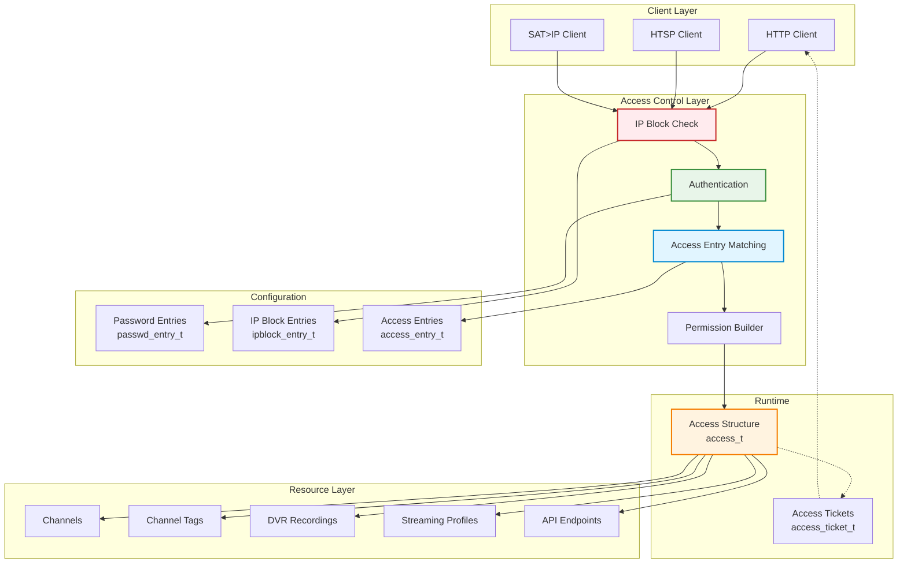
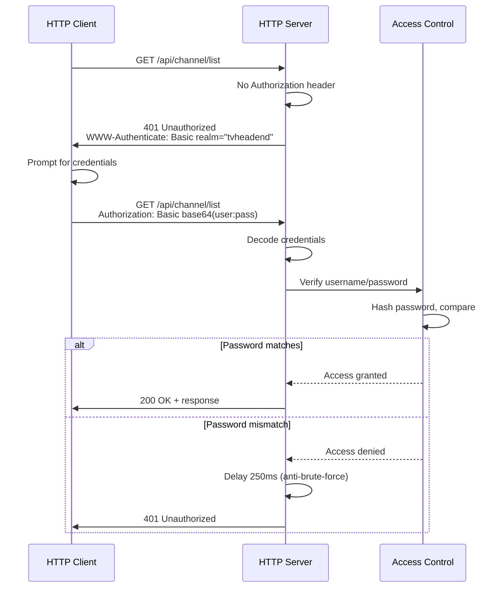
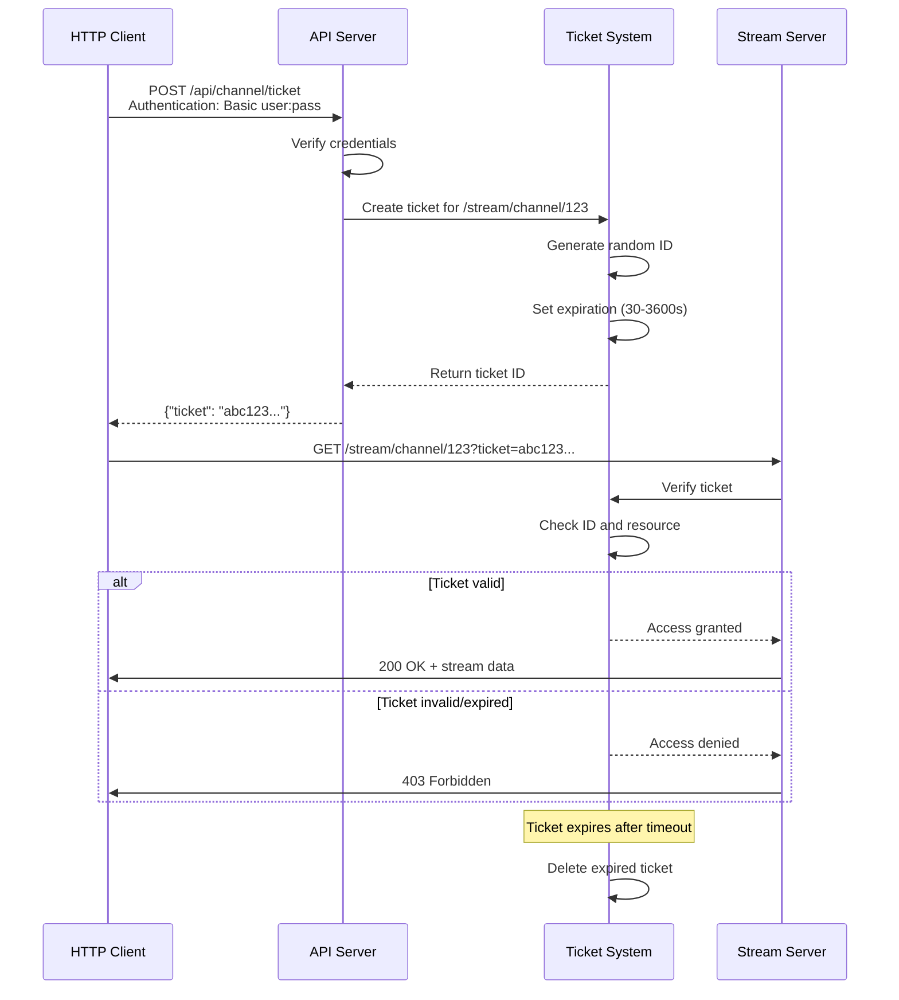
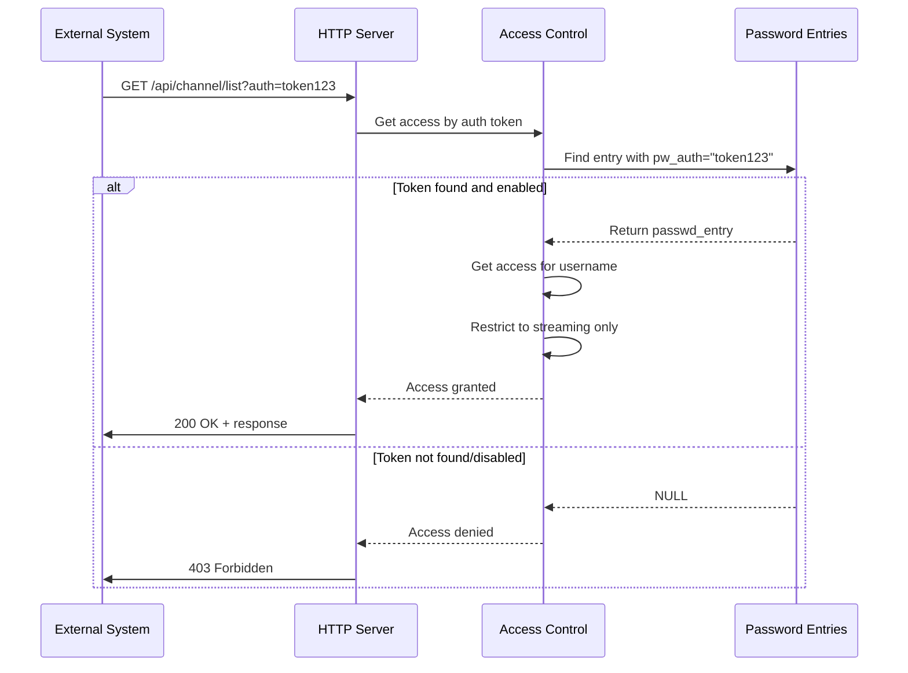
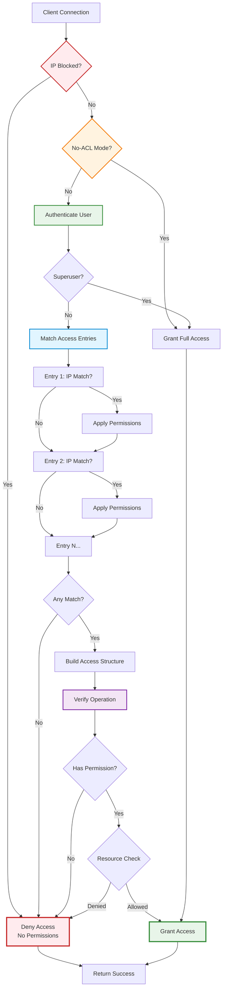

[← Back to Table of Contents](00-TOC.md)

## 18. Access Control System

The Access Control System provides comprehensive authentication and authorization mechanisms for Tvheadend. It manages user accounts, IP-based access restrictions, permission models, and resource-level access control. This section documents the access control architecture, permission model, authentication methods, IP-based restrictions, and resource access control.

### 18.1 Access Control Architecture

The access control system is built on a flexible, multi-layered architecture that combines user authentication, IP-based restrictions, and fine-grained permissions. It provides both authentication (verifying identity) and authorization (verifying permissions) for all access to Tvheadend resources.

#### 18.1.1 Architecture Overview

**Location**: `src/access.c`, `src/access.h`

The access control system consists of several key components that work together to provide comprehensive security:

**Core Components:**
- **Access Entries** (`access_entry_t`) - Configuration rules defining who can access what
- **Password Entries** (`passwd_entry_t`) - User account credentials
- **IP Block Entries** (`ipblock_entry_t`) - IP address blacklist
- **Access Tickets** (`access_ticket_t`) - Temporary access tokens for HTTP streaming
- **Access Structure** (`access_t`) - Runtime representation of granted permissions

**Architecture Diagram:**



#### 18.1.2 Access Entry Structure

**Location**: `src/access.h`

The `access_entry_t` structure defines a configuration rule that specifies access permissions for users matching certain criteria.

**Structure Definition** (key fields):
```c
typedef struct access_entry {
  idnode_t ae_id;                           // Configuration node (inherits from idnode)
  
  TAILQ_ENTRY(access_entry) ae_link;        // Global access entry list
  
  // Identity matching
  char *ae_username;                        // Username to match ("*" = any)
  struct access_ipmask_queue ae_ipmasks;    // IP address/network masks
  
  // Metadata
  char *ae_comment;                         // Description
  int ae_index;                             // Display order
  int ae_wizard;                            // Created by wizard
  int ae_enabled;                           // Entry enabled
  
  // UI preferences
  int ae_uilevel;                           // UI complexity level
  int ae_change_uilevel;                    // Override UI level
  int ae_uilevel_nochange;                  // Prevent UI level changes
  char *ae_lang;                            // Preferred language
  int ae_change_lang;                       // Override language
  char *ae_lang_ui;                         // UI language
  int ae_change_lang_ui;                    // Override UI language
  char *ae_theme;                           // UI theme
  int ae_change_theme;                      // Override theme
  
  // Streaming permissions
  int ae_streaming;                         // Basic streaming
  int ae_adv_streaming;                     // Advanced streaming
  int ae_htsp_streaming;                    // HTSP streaming
  
  // Streaming profiles
  idnode_list_head_t ae_profiles;           // Allowed profiles
  int ae_change_profiles;                   // Override profiles
  
  // Connection limits
  int ae_conn_limit_type;                   // Limit type (all/streaming/dvr)
  uint32_t ae_conn_limit;                   // Connection limit
  int ae_change_conn_limit;                 // Override connection limit
  
  // Output format restrictions
  int ae_xmltv_output_format;               // XMLTV format restriction
  int ae_change_xmltv_output_format;        // Override XMLTV format
  int ae_htsp_output_format;                // HTSP format restriction
  int ae_change_htsp_output_format;         // Override HTSP format
  
  // DVR permissions
  int ae_dvr;                               // Basic DVR access
  int ae_htsp_dvr;                          // HTSP DVR access
  int ae_all_dvr;                           // Access all recordings
  int ae_all_rw_dvr;                        // Read/write all recordings
  int ae_failed_dvr;                        // Access failed recordings
  int ae_htsp_anonymize;                    // Anonymize HTSP data
  
  // DVR configurations
  idnode_list_head_t ae_dvr_configs;        // Allowed DVR configs
  int ae_change_dvr_configs;                // Override DVR configs
  
  // Administrative permissions
  int ae_webui;                             // Web UI access
  int ae_admin;                             // Administrator access
  
  // Channel restrictions
  uint64_t ae_chmin;                        // Minimum channel number
  uint64_t ae_chmax;                        // Maximum channel number
  int ae_change_chrange;                    // Override channel range
  
  // Channel tag restrictions
  int ae_chtags_exclude;                    // Exclude mode (vs include)
  idnode_list_head_t ae_chtags;             // Channel tags
  int ae_change_chtags;                     // Override channel tags
  
  // Permission flags
  int ae_change_rights;                     // Override rights
  uint32_t ae_rights;                       // Permission bitmap
  
} access_entry_t;
```

**Key Concepts:**

1. **Username Matching**:
   - Specific username: Entry applies only to that user
   - Wildcard (`*`): Entry applies to any user (IP-based only)
   - Empty: No username restriction

2. **IP Mask Matching**:
   - List of IP addresses or network ranges
   - Supports both IPv4 and IPv6
   - CIDR notation for network masks
   - Empty list matches any IP

3. **Change Flags**:
   - Each setting has a corresponding `ae_change_*` flag
   - When set, this entry overrides previous entries
   - Allows building permissions incrementally

4. **Priority Order**:
   - Entries processed in order (by `ae_index`)
   - Later entries can override earlier ones
   - First matching entry establishes base permissions

#### 18.1.3 Password Entry Structure

**Location**: `src/access.h`

The `passwd_entry_t` structure stores user account credentials.

**Structure Definition**:
```c
typedef struct passwd_entry {
  idnode_t pw_id;                           // Configuration node
  
  TAILQ_ENTRY(passwd_entry) pw_link;        // Global password entry list
  
  char *pw_username;                        // Username
  char *pw_password;                        // Hashed password
  char *pw_password2;                       // Secondary password (legacy)
  
  char *pw_auth;                            // Authentication token ID
  
  int pw_enabled;                           // Account enabled
  int pw_auth_enabled;                      // Token authentication enabled
  int pw_wizard;                            // Created by wizard
  
  char *pw_comment;                         // Description
} passwd_entry_t;
```

**Password Storage**:
- Passwords stored as SHA-256 hashes (not plaintext)
- Format: `{SHA256}base64(sha256(password))`
- Legacy format: `{SHA1}base64(sha1(password))`
- Plain passwords automatically hashed on save

**Authentication Tokens**:
- `pw_auth`: Unique token ID for token-based authentication
- Used for external authentication systems
- Allows authentication without password

#### 18.1.4 IP Block Entry Structure

**Location**: `src/access.h`

The `ipblock_entry_t` structure defines IP addresses or networks to block.

**Structure Definition**:
```c
typedef struct ipblock_entry {
  idnode_t ib_id;                           // Configuration node
  
  TAILQ_ENTRY(ipblock_entry) ib_link;       // Global IP block list
  
  int ib_enabled;                           // Block entry enabled
  struct access_ipmask_queue ib_ipmasks;    // IP addresses/networks to block
  char *ib_comment;                         // Description
} ipblock_entry_t;
```

**IP Block Behavior**:
- Checked before any authentication
- Blocked IPs receive no access (all permissions denied)
- Useful for blocking malicious clients
- Supports both IPv4 and IPv6

#### 18.1.5 Access Structure (Runtime)

**Location**: `src/access.h`

The `access_t` structure represents the runtime permissions granted to a client.

**Structure Definition**:
```c
typedef struct access {
  // Identity
  char *aa_username;                        // Authenticated username
  char *aa_representative;                  // Display name (username or IP)
  char *aa_auth;                            // Authentication token ID
  
  // UI preferences
  char *aa_lang;                            // Content language
  char *aa_lang_ui;                         // UI language
  int aa_uilevel;                           // UI complexity level
  int aa_uilevel_nochange;                  // Prevent UI level changes
  char *aa_theme;                           // UI theme
  
  // Permission flags
  uint32_t aa_rights;                       // Permission bitmap
  int aa_match;                             // Matched an access entry
  
  // Streaming profiles
  htsmsg_t *aa_profiles;                    // Allowed profile UUIDs
  
  // DVR configurations
  htsmsg_t *aa_dvrcfgs;                     // Allowed DVR config UUIDs
  
  // Channel restrictions
  uint64_t *aa_chrange;                     // Channel number ranges
  int aa_chrange_count;                     // Number of ranges
  
  // Channel tag restrictions
  htsmsg_t *aa_chtags;                      // Allowed channel tag UUIDs
  htsmsg_t *aa_chtags_exclude;              // Excluded channel tag UUIDs
  
  // Connection limits
  uint32_t aa_conn_limit;                   // Total connection limit
  uint32_t aa_conn_limit_streaming;         // Streaming connection limit
  uint32_t aa_conn_limit_dvr;               // DVR connection limit
  uint32_t aa_conn_streaming;               // Current streaming connections
  uint32_t aa_conn_dvr;                     // Current DVR connections
  
  // Output format restrictions
  uint32_t aa_xmltv_output_format;          // XMLTV format
  uint32_t aa_htsp_output_format;           // HTSP format
  
} access_t;
```

**Lifecycle**:
1. **Creation**: `access_get()` creates structure based on IP and username
2. **Matching**: System iterates through access entries, applying matching rules
3. **Usage**: Passed to all subsystems for permission checks
4. **Destruction**: `access_destroy()` frees structure when connection closes

#### 18.1.6 Access Control Initialization

**Location**: `src/access.c`

The access control system initializes during Tvheadend startup.

**Initialization Sequence**:

```c
void access_init(int createdefault, int noacl)
{
  // 1. Initialize global lists
  TAILQ_INIT(&access_entries);
  TAILQ_INIT(&passwd_entries);
  TAILQ_INIT(&ipblock_entries);
  TAILQ_INIT(&access_tickets);
  
  // 2. Set no-ACL mode (bypass all access control)
  access_noacl = noacl;
  
  // 3. Register idnode classes
  idclass_register(&access_entry_class);
  idclass_register(&passwd_entry_class);
  idclass_register(&ipblock_entry_class);
  
  // 4. Load configuration from disk
  // Loads access entries from config/accesscontrol/
  // Loads password entries from config/passwd/
  // Loads IP blocks from config/ipblock/
  
  // 5. Create default entries if requested
  if (createdefault && TAILQ_EMPTY(&access_entries)) {
    // Create default "allow all from local network" entry
    access_entry_t *ae = access_entry_create(NULL, NULL);
    ae->ae_enabled = 1;
    ae->ae_username = strdup("*");
    ae->ae_comment = strdup(ACCESS_DEFAULT_COMMENT);
    // Set default IP masks (192.168.0.0/16, 10.0.0.0/8, etc.)
    access_set_prefix_default(&ae->ae_ipmasks);
    // Grant full access
    ae->ae_rights = ACCESS_FULL;
    ae->ae_change_rights = 1;
    idnode_changed(&ae->ae_id);
  }
  
  // 6. Set superuser credentials from command line
  superuser_username = config.superuser_username;
  superuser_password = config.superuser_password;
}
```

**No-ACL Mode**:
- Enabled with `--noacl` command-line option
- Bypasses all access control checks
- Grants full access to all clients
- Used for initial setup or recovery
- **Security Warning**: Should only be used temporarily

**Default Access Entry**:
- Created on first run if no entries exist
- Allows access from local networks (192.168.x.x, 10.x.x.x, etc.)
- Grants full permissions
- Can be modified or deleted through web UI

**Superuser Account**:
- Configured via `--satip_user` and `--satip_pass` command-line options
- Bypasses access entry matching
- Always grants full access
- Used for emergency access


### 18.2 Permission Model

The permission model uses a bitmap-based system where each permission is represented by a bit flag. Permissions can be combined using bitwise OR operations, and permission checks use bitwise AND operations. This provides efficient permission checking and flexible permission combinations.

#### 18.2.1 Permission Flags

**Location**: `src/access.h`

All permissions are defined as bit flags in the `aa_rights` field of the `access_t` structure.

**Permission Flag Definitions**:
```c
#define ACCESS_ANONYMOUS          0              // No permissions
#define ACCESS_STREAMING          (1<<0)         // Basic HTTP streaming
#define ACCESS_ADVANCED_STREAMING (1<<1)         // Advanced streaming features
#define ACCESS_HTSP_STREAMING     (1<<2)         // HTSP protocol streaming
#define ACCESS_WEB_INTERFACE      (1<<3)         // Web UI access
#define ACCESS_HTSP_INTERFACE     (1<<4)         // HTSP protocol access
#define ACCESS_RECORDER           (1<<5)         // Basic DVR/recording
#define ACCESS_HTSP_RECORDER      (1<<6)         // HTSP DVR operations
#define ACCESS_ALL_RECORDER       (1<<7)         // View all recordings
#define ACCESS_ALL_RW_RECORDER    (1<<8)         // Modify all recordings
#define ACCESS_FAILED_RECORDER    (1<<9)         // View failed recordings
#define ACCESS_HTSP_ANONYMIZE     (1<<10)        // Anonymize HTSP data
#define ACCESS_ADMIN              (1<<11)        // Administrator access

// Special flags for internal use
#define ACCESS_NO_EMPTY_ARGS      (1<<29)        // Require non-empty arguments
#define ACCESS_OR                 (1<<30)        // OR mode for verification

// Convenience macro for full access
#define ACCESS_FULL \
  (ACCESS_STREAMING | ACCESS_ADVANCED_STREAMING | \
   ACCESS_HTSP_STREAMING | ACCESS_WEB_INTERFACE | \
   ACCESS_RECORDER | ACCESS_HTSP_RECORDER | \
   ACCESS_ALL_RECORDER | ACCESS_ALL_RW_RECORDER | \
   ACCESS_FAILED_RECORDER | ACCESS_ADMIN)
```

**Permission Descriptions**:

1. **ACCESS_STREAMING** (Bit 0)
   - Basic HTTP streaming access
   - Allows streaming channels via HTTP
   - Required for `/stream/` endpoints
   - Does not include transcoding or advanced features

2. **ACCESS_ADVANCED_STREAMING** (Bit 1)
   - Advanced streaming features
   - Includes transcoding support
   - Allows profile selection
   - Enables timeshift functionality

3. **ACCESS_HTSP_STREAMING** (Bit 2)
   - HTSP protocol streaming
   - Required for HTSP `subscribe` operations
   - Allows live TV streaming via HTSP clients
   - Separate from HTTP streaming permission

4. **ACCESS_WEB_INTERFACE** (Bit 3)
   - Web UI access
   - Allows login to web interface
   - Required for configuration viewing
   - Does not grant modification rights

5. **ACCESS_HTSP_INTERFACE** (Bit 4)
   - HTSP protocol access
   - Required for HTSP connection
   - Allows HTSP authentication
   - Separate from HTSP streaming permission

6. **ACCESS_RECORDER** (Bit 5)
   - Basic DVR/recording access
   - Allows creating recordings
   - Allows viewing own recordings
   - Does not allow viewing others' recordings

7. **ACCESS_HTSP_RECORDER** (Bit 6)
   - HTSP DVR operations
   - Allows DVR control via HTSP
   - Required for HTSP `addDvrEntry`, etc.
   - Separate from HTTP DVR access

8. **ACCESS_ALL_RECORDER** (Bit 7)
   - View all recordings
   - Allows viewing recordings created by other users
   - Read-only access to all recordings
   - Does not allow modification

9. **ACCESS_ALL_RW_RECORDER** (Bit 8)
   - Modify all recordings
   - Allows modifying recordings created by other users
   - Includes delete permission
   - Requires ACCESS_ALL_RECORDER

10. **ACCESS_FAILED_RECORDER** (Bit 9)
    - View failed recordings
    - Allows viewing recordings that failed
    - Useful for troubleshooting
    - Separate from successful recordings

11. **ACCESS_HTSP_ANONYMIZE** (Bit 10)
    - Anonymize HTSP data
    - Removes sensitive information from HTSP responses
    - Hides usernames, IP addresses, etc.
    - Used for privacy-conscious clients

12. **ACCESS_ADMIN** (Bit 11)
    - Administrator access
    - Full configuration access
    - Can modify all settings
    - Can manage users and access control
    - Highest privilege level

#### 18.2.2 Permission Hierarchy

Permissions have implicit dependencies and hierarchies:

**Streaming Hierarchy**:
```
ACCESS_STREAMING
  └─ ACCESS_ADVANCED_STREAMING (requires STREAMING)
      └─ Transcoding, timeshift, advanced features

ACCESS_HTSP_INTERFACE
  └─ ACCESS_HTSP_STREAMING (requires INTERFACE)
      └─ Live TV via HTSP
```

**Recording Hierarchy**:
```
ACCESS_RECORDER (own recordings)
  └─ ACCESS_ALL_RECORDER (all recordings, read-only)
      └─ ACCESS_ALL_RW_RECORDER (all recordings, read-write)

ACCESS_FAILED_RECORDER (independent, view failed recordings)
```

**Administrative Hierarchy**:
```
ACCESS_WEB_INTERFACE (view configuration)
  └─ ACCESS_ADMIN (modify configuration)
```

**Typical Permission Combinations**:

1. **Basic Viewer**:
   ```c
   ACCESS_STREAMING | ACCESS_WEB_INTERFACE
   ```
   - Can watch live TV via HTTP
   - Can browse web UI
   - Cannot record or configure

2. **HTSP Client**:
   ```c
   ACCESS_HTSP_INTERFACE | ACCESS_HTSP_STREAMING
   ```
   - Can connect via HTSP
   - Can stream live TV
   - Cannot access web UI

3. **DVR User**:
   ```c
   ACCESS_STREAMING | ACCESS_WEB_INTERFACE | 
   ACCESS_RECORDER | ACCESS_HTSP_RECORDER
   ```
   - Can watch and record
   - Can manage own recordings
   - Cannot view others' recordings

4. **Power User**:
   ```c
   ACCESS_STREAMING | ACCESS_ADVANCED_STREAMING |
   ACCESS_HTSP_INTERFACE | ACCESS_HTSP_STREAMING |
   ACCESS_WEB_INTERFACE | ACCESS_RECORDER |
   ACCESS_HTSP_RECORDER | ACCESS_ALL_RECORDER
   ```
   - Full streaming capabilities
   - Can record and view all recordings
   - Cannot modify configuration

5. **Administrator**:
   ```c
   ACCESS_FULL
   ```
   - All permissions
   - Full system access

#### 18.2.3 Permission Inheritance

Access entries are processed in order, and permissions accumulate:

**Processing Order**:
1. Start with `ACCESS_ANONYMOUS` (no permissions)
2. Check IP block list (if blocked, stop with no permissions)
3. Authenticate user (if credentials provided)
4. Iterate through access entries in order (by `ae_index`)
5. For each matching entry:
   - If `ae_change_rights` is set, OR the rights into `aa_rights`
   - If other `ae_change_*` flags are set, override those settings
6. Result is accumulated permissions

**Example - Multiple Matching Entries**:

```
Entry 1: username="*", IP=192.168.1.0/24
  - ae_rights = ACCESS_STREAMING | ACCESS_WEB_INTERFACE
  - ae_change_rights = 1

Entry 2: username="john", IP=any
  - ae_rights = ACCESS_RECORDER
  - ae_change_rights = 1

Entry 3: username="john", IP=192.168.1.100
  - ae_rights = ACCESS_ADMIN
  - ae_change_rights = 1
```

**Result for user "john" from 192.168.1.100**:
- Entry 1 matches (IP matches, username="*")
  - Rights = `ACCESS_STREAMING | ACCESS_WEB_INTERFACE`
- Entry 2 matches (username matches)
  - Rights = `ACCESS_STREAMING | ACCESS_WEB_INTERFACE | ACCESS_RECORDER`
- Entry 3 matches (username and IP match)
  - Rights = `ACCESS_STREAMING | ACCESS_WEB_INTERFACE | ACCESS_RECORDER | ACCESS_ADMIN`

**Final permissions**: All four permission flags are set.

**Override Behavior**:

Some settings use override flags instead of accumulation:

```c
// Example: UI level override
if (ae->ae_change_uilevel) {
  a->aa_uilevel = ae->ae_uilevel;  // Replace, don't accumulate
}

// Example: Profile override
if (ae->ae_change_profiles) {
  // Replace profile list, don't merge
  htsmsg_destroy(a->aa_profiles);
  a->aa_profiles = build_profile_list(ae);
}
```

**Settings that override**:
- UI level (`ae_uilevel`)
- Language (`ae_lang`, `ae_lang_ui`)
- Theme (`ae_theme`)
- Connection limits (`ae_conn_limit`)
- Streaming profiles (`ae_profiles`)
- DVR configurations (`ae_dvr_configs`)
- Channel range (`ae_chmin`, `ae_chmax`)
- Channel tags (`ae_chtags`)

**Settings that accumulate**:
- Permission flags (`ae_rights`)

#### 18.2.4 Permission Checking

**Location**: `src/access.h`

Permission checking is performed using the `access_verify2()` inline function.

**Function Definition**:
```c
static inline int access_verify2(const access_t *a, uint32_t mask)
{
  if (a == NULL)
    return -1;  // No access structure = denied
  
  if (mask & ACCESS_OR) {
    // OR mode: any permission in mask is sufficient
    return (a->aa_rights & mask) ? 0 : -1;
  } else {
    // AND mode: all permissions in mask are required
    return ((a->aa_rights & mask) == mask) ? 0 : -1;
  }
}
```

**Return Values**:
- `0` - Access granted
- `-1` - Access denied

**Usage Examples**:

```c
// Check for single permission
if (access_verify2(perm, ACCESS_STREAMING) == 0) {
  // User has streaming permission
}

// Check for multiple permissions (AND mode)
if (access_verify2(perm, ACCESS_STREAMING | ACCESS_RECORDER) == 0) {
  // User has BOTH streaming AND recording permissions
}

// Check for any permission (OR mode)
if (access_verify2(perm, ACCESS_STREAMING | ACCESS_HTSP_STREAMING | ACCESS_OR) == 0) {
  // User has EITHER streaming OR HTSP streaming permission
}

// Check for admin access
if (access_verify2(perm, ACCESS_ADMIN) == 0) {
  // User is administrator
}
```

**Common Permission Checks**:

1. **HTTP Streaming Endpoint**:
   ```c
   if (access_verify2(hc->hc_access, ACCESS_STREAMING))
     return http_error(hc, HTTP_STATUS_FORBIDDEN);
   ```

2. **HTSP Subscribe**:
   ```c
   if (access_verify2(htsp->htsp_granted_access, ACCESS_HTSP_STREAMING))
     return htsmsg_create_error("noaccess");
   ```

3. **DVR Create**:
   ```c
   if (access_verify2(perm, ACCESS_RECORDER))
     return -EPERM;
   ```

4. **Configuration Modify**:
   ```c
   if (access_verify2(perm, ACCESS_ADMIN))
     return -EACCES;
   ```

5. **API Endpoint**:
   ```c
   // API hook defines required permissions
   api_hook_t hook = {
     .ah_subsystem = "channel",
     .ah_access = ACCESS_ADMIN,  // Requires admin
     .ah_callback = api_channel_handler
   };
   ```

#### 18.2.5 Permission Debugging

**Location**: `src/access.c`

The access control system provides detailed logging for debugging permission issues.

**Debug Logging**:
```c
// Enable with: tvheadend --trace access

// Example log output:
// [access] 192.168.1.100:john [S A T W R E L D F H *], conn=10:s5:r2:l3, matched
//   profile='Default','HD', dvr='Default', [chmin=1, chmax=999],
//   exclude tags='Adult', tags='News','Sports'
```

**Log Format Explanation**:
- `192.168.1.100` - Client IP address
- `john` - Authenticated username
- `[S A T W R E L D F H *]` - Permission flags:
  - `S` = ACCESS_STREAMING
  - `A` = ACCESS_ADVANCED_STREAMING
  - `T` = ACCESS_HTSP_STREAMING
  - `W` = ACCESS_WEB_INTERFACE
  - `R` = ACCESS_RECORDER
  - `E` = ACCESS_HTSP_RECORDER
  - `L` = ACCESS_ALL_RECORDER
  - `D` = ACCESS_ALL_RW_RECORDER
  - `F` = ACCESS_FAILED_RECORDER
  - `H` = ACCESS_HTSP_ANONYMIZE
  - `*` = ACCESS_ADMIN
- `conn=10:s5:r2:l3` - Connection limits (total:streaming:dvr:uilevel)
- `matched` - Matched at least one access entry
- `profile='Default','HD'` - Allowed streaming profiles
- `dvr='Default'` - Allowed DVR configurations
- `[chmin=1, chmax=999]` - Channel number range
- `exclude tags='Adult'` - Excluded channel tags
- `tags='News','Sports'` - Allowed channel tags

**Troubleshooting Permission Issues**:

1. **Enable trace logging**:
   ```bash
   tvheadend --trace access
   ```

2. **Check access entry matching**:
   - Look for "matched" in log output
   - If not matched, check username and IP mask configuration

3. **Verify permission flags**:
   - Check which flags are set in log output
   - Compare with required permissions for operation

4. **Check resource restrictions**:
   - Verify profile, DVR config, channel range, and tag restrictions
   - Ensure requested resource is within allowed set

5. **Test with superuser**:
   - Use `--satip_user` and `--satip_pass` to bypass access control
   - If works with superuser, issue is in access entry configuration


### 18.3 User Authentication

Tvheadend supports multiple authentication methods to verify user identity. The authentication system is flexible, supporting both password-based and token-based authentication, with secure password storage and challenge-response protocols.

#### 18.3.1 User Account Structure

**Location**: `src/access.h`

User accounts are stored in `passwd_entry_t` structures and persisted to disk.

**Password Entry Structure**:
```c
typedef struct passwd_entry {
  idnode_t pw_id;                           // Configuration node
  
  TAILQ_ENTRY(passwd_entry) pw_link;        // Global password entry list
  
  char *pw_username;                        // Username (unique identifier)
  char *pw_password;                        // Hashed password
  char *pw_password2;                       // Secondary password (legacy)
  
  char *pw_auth;                            // Authentication token ID
  
  int pw_enabled;                           // Account enabled flag
  int pw_auth_enabled;                      // Token authentication enabled
  int pw_wizard;                            // Created by setup wizard
  
  char *pw_comment;                         // Description/notes
} passwd_entry_t;
```

**Account Management**:
- Accounts created through web UI or API
- Stored in `config/passwd/` directory
- Each account is a separate JSON file
- Username must be unique
- Accounts can be enabled/disabled without deletion

**Account Lifecycle**:
```c
// Create account
passwd_entry_t *pw = passwd_entry_create(NULL, NULL);
pw->pw_username = strdup("john");
pw->pw_password = strdup("secret");  // Will be hashed on save
pw->pw_enabled = 1;
idnode_changed(&pw->pw_id);  // Triggers save

// Disable account
pw->pw_enabled = 0;
idnode_changed(&pw->pw_id);

// Delete account
passwd_entry_destroy(pw, 1);  // 1 = delete config file
```

#### 18.3.2 Password Hashing

**Location**: `src/access.c`

Passwords are never stored in plaintext. Tvheadend uses cryptographic hashing to protect passwords.

**Supported Hash Formats**:

1. **SHA-256 (Current)**:
   ```
   Format: {SHA256}base64(sha256(password))
   Example: {SHA256}XohImNooBHFR0OVvjcYpJ3NgPQ1qq73WKhHvch0VQtg=
   ```

2. **SHA-1 (Legacy)**:
   ```
   Format: {SHA1}base64(sha1(password))
   Example: {SHA1}5baa61e4c9b93f3f0682250b6cf8331b7ee68fd8
   ```

3. **Plain (Automatic Upgrade)**:
   ```
   Format: password
   Note: Automatically hashed to SHA-256 on next save
   ```

**Password Hashing Process**:

```c
// Simplified password hashing
void passwd_hash_password(passwd_entry_t *pw)
{
  uint8_t digest[32];
  char buf[256];
  
  // Check if already hashed
  if (strncmp(pw->pw_password, "{SHA256}", 8) == 0)
    return;  // Already hashed
  
  if (strncmp(pw->pw_password, "{SHA1}", 6) == 0)
    return;  // Legacy hash, keep as-is
  
  // Hash plaintext password
  sha256_buffer(pw->pw_password, strlen(pw->pw_password), digest);
  
  // Encode as base64
  base64_encode(buf, sizeof(buf), digest, sizeof(digest));
  
  // Store with prefix
  snprintf(pw->pw_password, sizeof(pw->pw_password), "{SHA256}%s", buf);
}
```

**Password Verification**:

```c
// Simplified password verification
int passwd_verify_password(const char *stored, const char *provided)
{
  uint8_t digest[32];
  char buf[256];
  
  if (strncmp(stored, "{SHA256}", 8) == 0) {
    // SHA-256 verification
    sha256_buffer(provided, strlen(provided), digest);
    base64_encode(buf, sizeof(buf), digest, sizeof(digest));
    return strcmp(stored + 8, buf);
  }
  
  if (strncmp(stored, "{SHA1}", 6) == 0) {
    // SHA-1 verification (legacy)
    sha1_buffer(provided, strlen(provided), digest);
    base64_encode(buf, sizeof(buf), digest, 20);
    return strcmp(stored + 6, buf);
  }
  
  // Plain comparison (should not happen)
  return strcmp(stored, provided);
}
```

**Security Considerations**:
- Passwords hashed with SHA-256 (256-bit security)
- Legacy SHA-1 support for backward compatibility
- No salt (passwords are user-chosen, not random)
- Hashes stored in configuration files (protected by file permissions)
- Challenge-response prevents password transmission over network

#### 18.3.3 Authentication Methods

Tvheadend supports three authentication methods:

**1. Plain Authentication**:
- Username sent without password verification
- Used for IP-based access (username="*")
- Marked as "unverified" in logs
- Not recommended for remote access

**2. Password Authentication (HTTP)**:
- HTTP Basic Authentication
- Username and password sent in Authorization header
- Base64 encoded (not encrypted)
- Should use HTTPS for security

**3. Challenge-Response Authentication (HTSP)**:
- Secure authentication without transmitting password
- Uses SHA-1 digest of password + challenge
- Challenge is random 32-byte value
- See Section 16.2.3 for HTSP authentication details

#### 18.3.4 HTTP Authentication

**Location**: `src/http.c`

HTTP requests use standard HTTP authentication mechanisms.

**HTTP Basic Authentication**:



**Authentication Header Format**:
```
Authorization: Basic base64(username:password)

Example:
Authorization: Basic am9objpzZWNyZXQ=
(decodes to: john:secret)
```

**HTTP Authentication Process**:

```c
// Simplified HTTP authentication
int http_authenticate(http_connection_t *hc)
{
  const char *auth_header;
  char *username, *password;
  access_t *access;
  
  // 1. Extract Authorization header
  auth_header = http_arg_get(&hc->hc_args, "Authorization");
  if (auth_header == NULL)
    return HTTP_STATUS_UNAUTHORIZED;
  
  // 2. Check for Basic authentication
  if (strncmp(auth_header, "Basic ", 6) != 0)
    return HTTP_STATUS_UNAUTHORIZED;
  
  // 3. Decode base64 credentials
  base64_decode(auth_header + 6, &username, &password);
  
  // 4. Get access structure (verifies password)
  access = access_get(hc->hc_peer, username, http_verify_callback, password);
  
  // 5. Check if authentication succeeded
  if (access->aa_username == NULL) {
    access_destroy(access);
    usleep(250000);  // 250ms delay (anti-brute-force)
    return HTTP_STATUS_UNAUTHORIZED;
  }
  
  // 6. Store access structure in connection
  hc->hc_access = access;
  hc->hc_username = strdup(username);
  
  return 0;
}
```

**HTTP Digest Authentication**:
- Not currently implemented
- Would provide better security than Basic
- Challenge-response mechanism like HTSP
- Future enhancement

#### 18.3.5 Ticket-Based Authentication

**Location**: `src/access.c`

Access tickets provide temporary authentication tokens for HTTP streaming.

**Ticket Structure**:
```c
typedef struct access_ticket {
  char *at_id;                              // Ticket ID (40-char hex)
  
  TAILQ_ENTRY(access_ticket) at_link;       // Global ticket list
  
  mtimer_t at_timer;                        // Expiration timer
  char *at_resource;                        // Resource path
  access_t *at_access;                      // Access permissions
} access_ticket_t;
```

**Ticket Lifecycle**:



**Ticket Creation**:

```c
// Create ticket for resource
const char *ticket_id = access_ticket_create("/stream/channel/123", access);

// Ticket ID is 40-character hex string
// Example: "a1b2c3d4e5f6789012345678901234567890abcd"
```

**Ticket Verification**:

```c
// Verify ticket for resource
access_t *access = access_ticket_verify2(ticket_id, "/stream/channel/123");

if (access == NULL) {
  // Ticket invalid or expired
  return HTTP_STATUS_FORBIDDEN;
}

// Use access structure for permission checks
if (access_verify2(access, ACCESS_STREAMING)) {
  access_destroy(access);
  return HTTP_STATUS_FORBIDDEN;
}

// Stream data...
access_destroy(access);
```

**Ticket Expiration**:
- Configurable timeout (30-3600 seconds)
- Default: 300 seconds (5 minutes)
- Set via `config.ticket_expires`
- Tickets automatically deleted on expiration
- Timer-based cleanup

**Ticket Reuse**:
- System checks for existing tickets before creating new ones
- If ticket exists for same resource and user within 60 seconds, reuse it
- Reduces ticket proliferation
- Extends ticket lifetime

**Use Cases**:
1. **Web UI Streaming**:
   - Web UI requests ticket via API
   - Embeds ticket in `<video>` tag URL
   - Allows streaming without exposing credentials

2. **External Players**:
   - Client authenticates once
   - Receives ticket for stream
   - Passes ticket to external player
   - Player streams without credentials

3. **Temporary Access**:
   - Share stream URL with ticket
   - Ticket expires after timeout
   - No permanent credential sharing

#### 18.3.6 Token-Based Authentication

**Location**: `src/access.c`

Token-based authentication allows external systems to authenticate without passwords.

**Authentication Token Structure**:
- Stored in `pw_auth` field of `passwd_entry_t`
- Unique identifier (UUID or custom string)
- Enabled via `pw_auth_enabled` flag
- Used for API authentication

**Token Authentication Flow**:



**Token Configuration**:

```c
// Create user with authentication token
passwd_entry_t *pw = passwd_entry_create(NULL, NULL);
pw->pw_username = strdup("api_user");
pw->pw_auth = strdup("my-secret-token-12345");
pw->pw_auth_enabled = 1;
pw->pw_enabled = 1;
idnode_changed(&pw->pw_id);
```

**Token Usage**:

```bash
# HTTP request with token
curl "http://server:9981/api/channel/list?auth=my-secret-token-12345"

# Token in query parameter
GET /stream/channel/123?auth=my-secret-token-12345
```

**Token Restrictions**:
- Token authentication grants limited permissions
- Only `ACCESS_STREAMING` and `ACCESS_ADVANCED_STREAMING`
- Cannot access admin functions
- Cannot modify configuration
- Intended for read-only streaming access

**Security Considerations**:
- Tokens are secrets (like passwords)
- Should be long and random
- Should be transmitted over HTTPS
- Can be revoked by disabling account
- No expiration (unlike tickets)


### 18.4 IP-Based Access Control

IP-based access control allows restricting access based on the client's IP address or network. This provides network-level security and enables different permissions for local vs. remote access.

#### 18.4.1 IP Mask Structure

**Location**: `src/access.h`

IP addresses and networks are represented by `access_ipmask_t` structures.

**IP Mask Structure**:
```c
typedef struct access_ipmask {
  TAILQ_ENTRY(access_ipmask) ai_link;       // List link
  
  int ai_family;                            // AF_INET or AF_INET6
  
  // IPv6 address
  struct in6_addr ai_ip6;                   // IPv6 address
  int ai_prefixlen;                         // Prefix length (0-128)
  
  // IPv4 address (also used for IPv4-mapped IPv6)
  uint32_t ai_netmask;                      // Network mask
  uint32_t ai_network;                      // Network address
} access_ipmask_t;
```

**IP Mask Types**:

1. **IPv4 Address**:
   ```
   Example: 192.168.1.100
   ai_family = AF_INET
   ai_network = 0xC0A80164 (192.168.1.100)
   ai_netmask = 0xFFFFFFFF (255.255.255.255)
   ```

2. **IPv4 Network (CIDR)**:
   ```
   Example: 192.168.1.0/24
   ai_family = AF_INET
   ai_network = 0xC0A80100 (192.168.1.0)
   ai_netmask = 0xFFFFFF00 (255.255.255.0)
   ```

3. **IPv6 Address**:
   ```
   Example: 2001:db8::1
   ai_family = AF_INET6
   ai_ip6 = 2001:db8::1
   ai_prefixlen = 128
   ```

4. **IPv6 Network (CIDR)**:
   ```
   Example: 2001:db8::/32
   ai_family = AF_INET6
   ai_ip6 = 2001:db8::
   ai_prefixlen = 32
   ```

5. **Wildcard (Any IP)**:
   ```
   Example: 0.0.0.0/0 or ::/0
   Matches any IP address
   ```

#### 18.4.2 IP Address Matching

**Location**: `src/access.c`

IP address matching uses bitwise operations for efficient network comparison.

**Matching Algorithm**:

```c
// Simplified IP matching
int netmask_verify(struct access_ipmask_queue *ais, struct sockaddr_storage *src)
{
  access_ipmask_t *ai;
  
  // Iterate through all IP masks in list
  TAILQ_FOREACH(ai, ais, ai_link) {
    
    if (ai->ai_family == AF_INET && src->ss_family == AF_INET) {
      // IPv4 matching
      struct sockaddr_in *in4 = (struct sockaddr_in *)src;
      uint32_t client_ip = ntohl(in4->sin_addr.s_addr);
      
      // Apply netmask and compare with network address
      if ((client_ip & ai->ai_netmask) == ai->ai_network)
        return 1;  // Match
    }
    
    else if (ai->ai_family == AF_INET6 && src->ss_family == AF_INET6) {
      // IPv6 matching
      struct in6_addr *in6 = &(((struct sockaddr_in6 *)src)->sin6_addr);
      uint8_t *client_bytes = (uint8_t*)in6->s6_addr;
      uint8_t *mask_bytes = (uint8_t*)ai->ai_ip6.s6_addr;
      
      int bits_remaining = ai->ai_prefixlen;
      int byte_pos = 0;
      
      // Compare full bytes
      while (bits_remaining >= 8) {
        if (client_bytes[byte_pos] != mask_bytes[byte_pos])
          break;
        byte_pos++;
        bits_remaining -= 8;
      }
      
      if (bits_remaining >= 8)
        continue;  // No match
      
      // Compare partial byte
      if (bits_remaining == 0)
        return 1;  // Match
      
      uint8_t last_mask = (0xFF << (8 - bits_remaining));
      if ((client_bytes[byte_pos] & last_mask) == (mask_bytes[byte_pos] & last_mask))
        return 1;  // Match
    }
  }
  
  return 0;  // No match
}
```

**IPv4-Mapped IPv6 Addresses**:

Tvheadend handles IPv4 clients connecting to IPv6 sockets:

```c
// IPv4-mapped IPv6 address: ::ffff:192.168.1.100
// Represented as: 0000:0000:0000:0000:0000:ffff:c0a8:0164

// Check if IPv6 address is IPv4-mapped
struct in6_addr *in6 = &(((struct sockaddr_in6 *)src)->sin6_addr);
uint32_t *a32 = (uint32_t*)in6->s6_addr;

if (a32[0] == 0 && a32[1] == 0 && ntohl(a32[2]) == 0x0000FFFF) {
  // Extract IPv4 address from last 32 bits
  uint32_t ipv4 = ntohl(a32[3]);
  
  // Match against IPv4 masks
  if ((ipv4 & ai->ai_netmask) == ai->ai_network)
    return 1;  // Match
}
```

**Matching Examples**:

1. **Exact IP Match**:
   ```
   Mask: 192.168.1.100/32
   Client: 192.168.1.100 → Match
   Client: 192.168.1.101 → No match
   ```

2. **Network Match**:
   ```
   Mask: 192.168.1.0/24
   Client: 192.168.1.1 → Match
   Client: 192.168.1.254 → Match
   Client: 192.168.2.1 → No match
   ```

3. **Large Network**:
   ```
   Mask: 10.0.0.0/8
   Client: 10.1.2.3 → Match
   Client: 10.255.255.255 → Match
   Client: 11.0.0.1 → No match
   ```

4. **IPv6 Network**:
   ```
   Mask: 2001:db8::/32
   Client: 2001:db8::1 → Match
   Client: 2001:db8:1::1 → Match
   Client: 2001:db9::1 → No match
   ```

#### 18.4.3 IP Whitelist (Access Entries)

**Location**: `src/access.c`

Access entries use IP masks to define which clients can access the system.

**IP Mask Configuration**:

Each access entry has a list of IP masks (`ae_ipmasks`):

```c
access_entry_t *ae = access_entry_create(NULL, NULL);
ae->ae_username = strdup("*");  // Any user
ae->ae_enabled = 1;

// Add IP masks
access_ipmask_t *ai;

// Local network: 192.168.0.0/16
ai = calloc(1, sizeof(access_ipmask_t));
ai->ai_family = AF_INET;
ai->ai_network = 0xC0A80000;  // 192.168.0.0
ai->ai_netmask = 0xFFFF0000;  // 255.255.0.0
TAILQ_INSERT_TAIL(&ae->ae_ipmasks, ai, ai_link);

// Local network: 10.0.0.0/8
ai = calloc(1, sizeof(access_ipmask_t));
ai->ai_family = AF_INET;
ai->ai_network = 0x0A000000;  // 10.0.0.0
ai->ai_netmask = 0xFF000000;  // 255.0.0.0
TAILQ_INSERT_TAIL(&ae->ae_ipmasks, ai, ai_link);
```

**String Format Parsing**:

IP masks can be specified as comma-separated strings:

```c
// Parse IP mask string
access_set_prefix(&ae->ae_ipmasks, "192.168.0.0/16,10.0.0.0/8,172.16.0.0/12");

// Supported formats:
// - Single IP: "192.168.1.100"
// - CIDR notation: "192.168.1.0/24"
// - Multiple entries: "192.168.1.0/24,10.0.0.0/8"
// - Delimiters: comma, semicolon, pipe, space
// - IPv6: "2001:db8::/32"
// - Wildcard: "0.0.0.0/0" or "::/0"
```

**Default Local Networks**:

Tvheadend provides a default set of local network ranges:

```c
// Default local networks (RFC 1918 private addresses)
access_set_prefix_default(&ae->ae_ipmasks);

// Adds:
// - 192.168.0.0/16 (192.168.x.x)
// - 10.0.0.0/8 (10.x.x.x)
// - 172.16.0.0/12 (172.16.x.x - 172.31.x.x)
// - 127.0.0.0/8 (localhost)
// - ::1/128 (IPv6 localhost)
// - fe80::/10 (IPv6 link-local)
```

**Access Entry Matching**:

When a client connects, the system checks all access entries:

```c
access_t *access_get(struct sockaddr_storage *src, const char *username, ...)
{
  access_t *a = access_alloc();
  access_entry_t *ae;
  
  // Check IP block list first
  if (access_ip_blocked(src))
    return a;  // Blocked, return empty access
  
  // Iterate through access entries
  TAILQ_FOREACH(ae, &access_entries, ae_link) {
    if (!ae->ae_enabled)
      continue;
    
    // Check username match
    if (ae->ae_username[0] != '*') {
      if (username == NULL || strcmp(username, ae->ae_username))
        continue;
    }
    
    // Check IP match
    if (!netmask_verify(&ae->ae_ipmasks, src))
      continue;
    
    // Entry matches, apply permissions
    access_update(a, ae);
  }
  
  return a;
}
```

#### 18.4.4 IP Blacklist (IP Block Entries)

**Location**: `src/access.c`

IP block entries provide a blacklist of IP addresses to deny access.

**IP Block Structure**:
```c
typedef struct ipblock_entry {
  idnode_t ib_id;                           // Configuration node
  
  TAILQ_ENTRY(ipblock_entry) ib_link;       // Global IP block list
  
  int ib_enabled;                           // Block entry enabled
  struct access_ipmask_queue ib_ipmasks;    // IP addresses/networks to block
  char *ib_comment;                         // Description
} ipblock_entry_t;
```

**IP Block Checking**:

IP blocks are checked before any authentication or access entry matching:

```c
static inline int access_ip_blocked(struct sockaddr_storage *src)
{
  ipblock_entry_t *ib;
  
  TAILQ_FOREACH(ib, &ipblock_entries, ib_link) {
    if (!ib->ib_enabled)
      continue;
    
    if (netmask_verify(&ib->ib_ipmasks, src))
      return 1;  // Blocked
  }
  
  return 0;  // Not blocked
}
```

**Block Behavior**:
- Checked before authentication
- Blocked clients receive no access (all permissions denied)
- No log entry for blocked clients (silent drop)
- Useful for blocking malicious clients or networks
- Takes precedence over access entries

**Use Cases**:

1. **Block Specific IP**:
   ```
   Block: 203.0.113.42
   Reason: Brute-force attack source
   ```

2. **Block Network**:
   ```
   Block: 198.51.100.0/24
   Reason: Known malicious network
   ```

3. **Block Country**:
   ```
   Block: Multiple networks
   Reason: Geo-blocking (requires external IP list)
   ```

#### 18.4.5 Network Prefix Notation

**CIDR Notation**:

Classless Inter-Domain Routing (CIDR) notation specifies network ranges:

```
Format: address/prefix_length

IPv4 Examples:
- 192.168.1.0/24 = 192.168.1.0 - 192.168.1.255 (256 addresses)
- 10.0.0.0/8 = 10.0.0.0 - 10.255.255.255 (16,777,216 addresses)
- 172.16.0.0/12 = 172.16.0.0 - 172.31.255.255 (1,048,576 addresses)

IPv6 Examples:
- 2001:db8::/32 = 2001:db8:0:0:0:0:0:0 - 2001:db8:ffff:ffff:ffff:ffff:ffff:ffff
- fe80::/10 = fe80:: - febf:ffff:ffff:ffff:ffff:ffff:ffff:ffff
- ::1/128 = ::1 (single address)
```

**Prefix Length to Netmask Conversion**:

```c
// IPv4: /24 → 255.255.255.0
uint32_t prefix_to_netmask(int prefix)
{
  if (prefix == 0)
    return 0x00000000;
  if (prefix >= 32)
    return 0xFFFFFFFF;
  
  return 0xFFFFFFFF << (32 - prefix);
}

// Examples:
// /32 → 0xFFFFFFFF (255.255.255.255) - single host
// /24 → 0xFFFFFF00 (255.255.255.0) - 256 hosts
// /16 → 0xFFFF0000 (255.255.0.0) - 65,536 hosts
// /8  → 0xFF000000 (255.0.0.0) - 16,777,216 hosts
// /0  → 0x00000000 (0.0.0.0) - all hosts
```

**Common Network Ranges**:

| CIDR | Netmask | Hosts | Description |
|------|---------|-------|-------------|
| /32 | 255.255.255.255 | 1 | Single host |
| /31 | 255.255.255.254 | 2 | Point-to-point link |
| /30 | 255.255.255.252 | 4 | Small subnet |
| /29 | 255.255.255.248 | 8 | Small subnet |
| /28 | 255.255.255.240 | 16 | Small subnet |
| /27 | 255.255.255.224 | 32 | Small subnet |
| /26 | 255.255.255.192 | 64 | Small subnet |
| /25 | 255.255.255.128 | 128 | Small subnet |
| /24 | 255.255.255.0 | 256 | Class C network |
| /16 | 255.255.0.0 | 65,536 | Class B network |
| /8 | 255.0.0.0 | 16,777,216 | Class A network |
| /0 | 0.0.0.0 | 4,294,967,296 | All addresses |

**Private Network Ranges (RFC 1918)**:

```
10.0.0.0/8        (10.0.0.0 - 10.255.255.255)
172.16.0.0/12     (172.16.0.0 - 172.31.255.255)
192.168.0.0/16    (192.168.0.0 - 192.168.255.255)
```

**Special IPv4 Addresses**:

```
127.0.0.0/8       Loopback (localhost)
169.254.0.0/16    Link-local (APIPA)
224.0.0.0/4       Multicast
0.0.0.0/8         "This network"
```

**Special IPv6 Addresses**:

```
::1/128           Loopback (localhost)
fe80::/10         Link-local
fc00::/7          Unique local addresses (ULA)
ff00::/8          Multicast
::/128            Unspecified address
```

#### 18.4.6 IP-Based Access Examples

**Example 1: Local Network Only**:
```
Access Entry:
  Username: *
  IP Masks: 192.168.1.0/24
  Rights: ACCESS_FULL

Result:
  - Clients from 192.168.1.x have full access
  - All other clients have no access
```

**Example 2: Different Permissions by Network**:
```
Access Entry 1:
  Username: *
  IP Masks: 192.168.1.0/24
  Rights: ACCESS_STREAMING | ACCESS_WEB_INTERFACE

Access Entry 2:
  Username: *
  IP Masks: 10.0.0.0/8
  Rights: ACCESS_ADMIN

Result:
  - Clients from 192.168.1.x can stream and use web UI
  - Clients from 10.x.x.x have admin access
  - All other clients have no access
```

**Example 3: User-Specific Remote Access**:
```
Access Entry 1:
  Username: *
  IP Masks: 192.168.1.0/24
  Rights: ACCESS_FULL

Access Entry 2:
  Username: john
  IP Masks: 0.0.0.0/0
  Rights: ACCESS_STREAMING | ACCESS_HTSP_STREAMING

Result:
  - Local clients (192.168.1.x) have full access
  - User "john" from any IP can stream
  - Other users from remote IPs have no access
```

**Example 4: Block Specific IP**:
```
IP Block Entry:
  IP Masks: 203.0.113.42
  Enabled: Yes

Access Entry:
  Username: *
  IP Masks: 0.0.0.0/0
  Rights: ACCESS_FULL

Result:
  - 203.0.113.42 is blocked (no access)
  - All other IPs have full access
```


### 18.5 Resource Restrictions

Beyond basic permission flags, the access control system provides fine-grained restrictions on specific resources. This allows limiting access to specific channels, recordings, streaming profiles, and other resources.

#### 18.5.1 Channel Restrictions

**Location**: `src/access.c`, `src/channels.c`

Channel restrictions limit which channels a user can access.

**Channel Number Range**:

Access entries can specify a range of channel numbers:

```c
access_entry_t *ae = access_entry_create(NULL, NULL);
ae->ae_chmin = 1;      // Minimum channel number
ae->ae_chmax = 100;    // Maximum channel number
ae->ae_change_chrange = 1;  // Override channel range
```

**Runtime Representation**:

The `access_t` structure stores channel ranges as an array:

```c
typedef struct access {
  uint64_t *aa_chrange;                     // Channel number ranges
  int aa_chrange_count;                     // Number of ranges (pairs)
  // ...
} access_t;

// Example: aa_chrange = [1, 100, 200, 299]
// Allows channels 1-100 and 200-299
```

**Channel Access Verification**:

```c
// Check if user can access channel
int channel_access(channel_t *ch, access_t *perm, int readonly)
{
  uint64_t chnum;
  int i;
  
  // Check basic streaming permission
  if (access_verify2(perm, ACCESS_STREAMING))
    return 0;  // No streaming permission
  
  // Check channel number range
  if (perm->aa_chrange) {
    chnum = channel_get_number(ch);
    
    // Check each range pair
    for (i = 0; i < perm->aa_chrange_count; i += 2) {
      if (chnum >= perm->aa_chrange[i] && chnum <= perm->aa_chrange[i+1])
        break;  // Within range
    }
    
    if (i >= perm->aa_chrange_count)
      return 0;  // Not in any range
  }
  
  // Check channel tags (see next section)
  if (perm->aa_chtags || perm->aa_chtags_exclude) {
    if (!channel_tag_access(ch, perm))
      return 0;  // Tag restriction
  }
  
  return 1;  // Access granted
}
```

**Use Cases**:

1. **Kids Profile**:
   ```
   Channel Range: 1-50
   Allows: Kids channels (1-50)
   Blocks: Adult channels (51+)
   ```

2. **Basic Package**:
   ```
   Channel Range: 1-100
   Allows: Basic cable channels
   Blocks: Premium channels (101+)
   ```

3. **Multiple Ranges**:
   ```
   Channel Ranges: 1-50, 100-150
   Allows: Basic channels and sports channels
   Blocks: Everything else
   ```

#### 18.5.2 Channel Tag Restrictions

**Location**: `src/access.c`, `src/channels.c`

Channel tags provide flexible grouping of channels for access control.

**Tag-Based Access Control**:

Access entries can specify allowed or excluded channel tags:

```c
access_entry_t *ae = access_entry_create(NULL, NULL);
ae->ae_chtags_exclude = 0;  // 0 = include mode, 1 = exclude mode
ae->ae_change_chtags = 1;   // Override channel tags

// Add allowed tags
idnode_list_mapping_t *ilm;
channel_tag_t *ct;

ct = channel_tag_find_by_name("News");
ilm = idnode_list_link(&ae->ae_chtags, &ae->ae_id, &ct->ct_id, NULL);

ct = channel_tag_find_by_name("Sports");
ilm = idnode_list_link(&ae->ae_chtags, &ae->ae_id, &ct->ct_id, NULL);
```

**Runtime Representation**:

```c
typedef struct access {
  htsmsg_t *aa_chtags;                      // Allowed channel tag UUIDs
  htsmsg_t *aa_chtags_exclude;              // Excluded channel tag UUIDs
  // ...
} access_t;

// aa_chtags = ["uuid1", "uuid2", ...]
// aa_chtags_exclude = ["uuid3", "uuid4", ...]
```

**Tag Access Modes**:

1. **Include Mode** (`ae_chtags_exclude = 0`):
   - Only channels with specified tags are allowed
   - Channels without any tags are blocked
   - Whitelist approach

2. **Exclude Mode** (`ae_chtags_exclude = 1`):
   - Channels with specified tags are blocked
   - All other channels are allowed
   - Blacklist approach

**Tag Access Verification**:

```c
// Check if user can access channel based on tags
int channel_tag_access(channel_t *ch, access_t *perm)
{
  idnode_list_mapping_t *ilm;
  channel_tag_t *ct;
  int has_tag = 0;
  
  // Check if channel has any tags
  LIST_FOREACH(ilm, &ch->ch_ctms, ilm_in1_link) {
    ct = (channel_tag_t *)ilm->ilm_in2;
    
    // Check exclude list
    if (perm->aa_chtags_exclude) {
      if (access_verify_list(perm->aa_chtags_exclude, 
                             idnode_uuid_as_str(&ct->ct_id)))
        return 0;  // Tag is excluded
    }
    
    // Check include list
    if (perm->aa_chtags) {
      if (!access_verify_list(perm->aa_chtags, 
                              idnode_uuid_as_str(&ct->ct_id)))
        has_tag = 1;  // Tag is included
    }
  }
  
  // If include list specified, channel must have at least one included tag
  if (perm->aa_chtags && !has_tag)
    return 0;
  
  return 1;  // Access granted
}
```

**Tag Restriction Examples**:

1. **Include Mode - News Only**:
   ```
   Include Tags: News
   Result:
     - Channels tagged "News" → Allowed
     - Channels tagged "Sports" → Blocked
     - Channels with no tags → Blocked
   ```

2. **Exclude Mode - No Adult Content**:
   ```
   Exclude Tags: Adult
   Result:
     - Channels tagged "Adult" → Blocked
     - All other channels → Allowed
   ```

3. **Multiple Include Tags**:
   ```
   Include Tags: News, Sports, Entertainment
   Result:
     - Channels with any of these tags → Allowed
     - Channels with other tags → Blocked
   ```

4. **Combined with Exclude**:
   ```
   Include Tags: Sports
   Exclude Tags: PPV
   Result:
     - Sports channels → Allowed
     - Sports PPV channels → Blocked (exclude takes precedence)
   ```

#### 18.5.3 DVR Access Control

**Location**: `src/dvr/dvr.c`

DVR access control determines which recordings a user can view and modify.

**DVR Permission Levels**:

1. **ACCESS_RECORDER**:
   - Create recordings
   - View own recordings
   - Modify own recordings
   - Delete own recordings

2. **ACCESS_ALL_RECORDER**:
   - View all recordings (created by any user)
   - Read-only access to others' recordings
   - Requires ACCESS_RECORDER

3. **ACCESS_ALL_RW_RECORDER**:
   - Modify all recordings
   - Delete any recording
   - Requires ACCESS_ALL_RECORDER

4. **ACCESS_FAILED_RECORDER**:
   - View failed recordings
   - Independent of other DVR permissions
   - Useful for troubleshooting

**DVR Configuration Restrictions**:

Access entries can limit which DVR configurations a user can use:

```c
access_entry_t *ae = access_entry_create(NULL, NULL);
ae->ae_change_dvr_configs = 1;  // Override DVR configs

// Add allowed DVR configurations
dvr_config_t *cfg = dvr_config_find_by_name("Default");
idnode_list_link(&ae->ae_dvr_configs, &ae->ae_id, &cfg->dvr_id, NULL);
```

**Runtime Representation**:

```c
typedef struct access {
  htsmsg_t *aa_dvrcfgs;                     // Allowed DVR config UUIDs
  // ...
} access_t;
```

**DVR Access Verification**:

```c
// Check if user can access DVR entry
int dvr_entry_access(dvr_entry_t *de, access_t *perm, int readonly)
{
  // Check basic DVR permission
  if (access_verify2(perm, ACCESS_RECORDER))
    return 0;  // No DVR permission
  
  // Check if entry is failed
  if (de->de_sched_state == DVR_MISSED || 
      de->de_sched_state == DVR_NOSTATE) {
    // Requires failed recorder permission
    if (access_verify2(perm, ACCESS_FAILED_RECORDER))
      return 0;
  }
  
  // Check ownership
  if (strcmp(de->de_owner ?: "", perm->aa_username ?: "")) {
    // Not owner, check all-recorder permission
    if (access_verify2(perm, ACCESS_ALL_RECORDER))
      return 0;
    
    // Check read-write permission for modifications
    if (!readonly && access_verify2(perm, ACCESS_ALL_RW_RECORDER))
      return 0;
  }
  
  // Check DVR configuration restriction
  if (perm->aa_dvrcfgs) {
    if (access_verify_list(perm->aa_dvrcfgs, 
                           idnode_uuid_as_str(&de->de_config->dvr_id)))
      return 0;  // DVR config not allowed
  }
  
  return 1;  // Access granted
}
```

**DVR Ownership**:

Recordings are associated with the user who created them:

```c
dvr_entry_t *de = dvr_entry_create(...);
de->de_owner = strdup(perm->aa_username);  // Set owner
```

**DVR Access Examples**:

1. **Basic User**:
   ```
   Permissions: ACCESS_RECORDER
   Can:
     - Create recordings
     - View own recordings
     - Modify own recordings
   Cannot:
     - View others' recordings
     - Modify others' recordings
   ```

2. **Family Member**:
   ```
   Permissions: ACCESS_RECORDER | ACCESS_ALL_RECORDER
   Can:
     - Create recordings
     - View all recordings
   Cannot:
     - Modify others' recordings
   ```

3. **Administrator**:
   ```
   Permissions: ACCESS_RECORDER | ACCESS_ALL_RECORDER | ACCESS_ALL_RW_RECORDER
   Can:
     - Create recordings
     - View all recordings
     - Modify all recordings
     - Delete any recording
   ```

#### 18.5.4 Streaming Profile Restrictions

**Location**: `src/profile.c`

Streaming profiles define transcoding and muxing settings. Access control can limit which profiles a user can use.

**Profile Restrictions**:

Access entries can specify allowed streaming profiles:

```c
access_entry_t *ae = access_entry_create(NULL, NULL);
ae->ae_change_profiles = 1;  // Override profiles

// Add allowed profiles
profile_t *pro = profile_find_by_name("Default");
idnode_list_link(&ae->ae_profiles, &ae->ae_id, &pro->pro_id, NULL);

pro = profile_find_by_name("Mobile");
idnode_list_link(&ae->ae_profiles, &ae->ae_id, &pro->pro_id, NULL);
```

**Runtime Representation**:

```c
typedef struct access {
  htsmsg_t *aa_profiles;                    // Allowed profile UUIDs
  // ...
} access_t;
```

**Profile Access Verification**:

```c
// Check if user can use profile
int profile_access(profile_t *pro, access_t *perm)
{
  // Check advanced streaming permission (required for profiles)
  if (access_verify2(perm, ACCESS_ADVANCED_STREAMING))
    return 0;  // No advanced streaming permission
  
  // Check profile restriction
  if (perm->aa_profiles) {
    if (access_verify_list(perm->aa_profiles, 
                           idnode_uuid_as_str(&pro->pro_id)))
      return 0;  // Profile not allowed
  }
  
  return 1;  // Access granted
}
```

**Profile Restriction Use Cases**:

1. **Bandwidth Limiting**:
   ```
   Allowed Profiles: Mobile (low bitrate)
   Blocks: HD, Full HD profiles
   Use: Limit bandwidth for remote users
   ```

2. **Transcoding Control**:
   ```
   Allowed Profiles: Pass-through only
   Blocks: Transcoding profiles
   Use: Prevent CPU-intensive transcoding
   ```

3. **Quality Tiers**:
   ```
   Basic Users: SD profile only
   Premium Users: SD, HD, Full HD profiles
   Use: Tiered service offerings
   ```

#### 18.5.5 Connection Limits

**Location**: `src/access.c`

Connection limits restrict the number of simultaneous connections per user.

**Connection Limit Types**:

```c
enum {
  ACCESS_CONN_LIMIT_TYPE_ALL = 0,          // Total connections
  ACCESS_CONN_LIMIT_TYPE_STREAMING,        // Streaming connections
  ACCESS_CONN_LIMIT_TYPE_DVR,              // DVR connections
};
```

**Connection Limit Configuration**:

```c
access_entry_t *ae = access_entry_create(NULL, NULL);
ae->ae_conn_limit_type = ACCESS_CONN_LIMIT_TYPE_STREAMING;
ae->ae_conn_limit = 2;  // Maximum 2 streaming connections
ae->ae_change_conn_limit = 1;  // Override connection limit
```

**Runtime Representation**:

```c
typedef struct access {
  uint32_t aa_conn_limit;                   // Total connection limit
  uint32_t aa_conn_limit_streaming;         // Streaming connection limit
  uint32_t aa_conn_limit_dvr;               // DVR connection limit
  uint32_t aa_conn_streaming;               // Current streaming connections
  uint32_t aa_conn_dvr;                     // Current DVR connections
  // ...
} access_t;
```

**Connection Tracking**:

Connections are tracked per user:

```c
// When starting streaming subscription
if (perm->aa_conn_limit_streaming > 0 &&
    perm->aa_conn_streaming >= perm->aa_conn_limit_streaming) {
  return -ECONNLIMIT;  // Connection limit exceeded
}
perm->aa_conn_streaming++;

// When stopping subscription
perm->aa_conn_streaming--;
```

**Connection Limit Examples**:

1. **Single Stream**:
   ```
   Streaming Limit: 1
   Result: User can watch one channel at a time
   ```

2. **Family Plan**:
   ```
   Streaming Limit: 4
   Result: Up to 4 simultaneous streams
   ```

3. **Recording Limit**:
   ```
   DVR Limit: 2
   Result: Up to 2 simultaneous recordings
   ```

4. **Total Limit**:
   ```
   Total Limit: 5
   Streaming Limit: 3
   DVR Limit: 2
   Result: Max 5 connections total, with sub-limits
   ```

#### 18.5.6 Output Format Restrictions

**Location**: `src/access.h`

Output format restrictions limit the metadata and data provided to clients.

**XMLTV Output Format**:

```c
enum {
  ACCESS_XMLTV_OUTPUT_FORMAT_ALL = 0,       // Full XMLTV data
  ACCESS_XMLTV_OUTPUT_FORMAT_BASIC,         // Basic XMLTV data
  ACCESS_XMLTV_OUTPUT_FORMAT_BASIC_NO_HASH, // Basic without hash
};
```

**HTSP Output Format**:

```c
enum {
  ACCESS_HTSP_OUTPUT_FORMAT_ALL = 0,        // Full HTSP data
  ACCESS_HTSP_OUTPUT_FORMAT_BASIC,          // Basic HTSP data
};
```

**Format Configuration**:

```c
access_entry_t *ae = access_entry_create(NULL, NULL);
ae->ae_xmltv_output_format = ACCESS_XMLTV_OUTPUT_FORMAT_BASIC;
ae->ae_change_xmltv_output_format = 1;

ae->ae_htsp_output_format = ACCESS_HTSP_OUTPUT_FORMAT_BASIC;
ae->ae_change_htsp_output_format = 1;
```

**Format Restrictions**:

1. **Full Format**:
   - All metadata included
   - Full EPG data
   - All channel information
   - All recording details

2. **Basic Format**:
   - Limited metadata
   - Essential EPG data only
   - Basic channel information
   - Reduced recording details

3. **Basic No Hash**:
   - Basic format without content hashes
   - Prevents content identification
   - Privacy-focused

**Use Cases**:

1. **Privacy Protection**:
   ```
   Format: Basic No Hash
   Use: Prevent tracking of viewing habits
   ```

2. **Bandwidth Reduction**:
   ```
   Format: Basic
   Use: Reduce metadata size for mobile clients
   ```

3. **Content Protection**:
   ```
   Format: Basic
   Use: Limit metadata exposure for content providers
   ```

#### 18.5.7 Resource Restriction Summary

**Restriction Matrix**:

| Resource | Restriction Type | Configuration | Verification |
|----------|------------------|---------------|--------------|
| Channels | Number range | `ae_chmin`, `ae_chmax` | `channel_access()` |
| Channels | Tags | `ae_chtags`, `ae_chtags_exclude` | `channel_tag_access()` |
| DVR | Ownership | Automatic | `dvr_entry_access()` |
| DVR | Configuration | `ae_dvr_configs` | `dvr_entry_access()` |
| Profiles | Profile list | `ae_profiles` | `profile_access()` |
| Connections | Count limits | `ae_conn_limit` | Connection tracking |
| Output | Format | `ae_xmltv_output_format` | Format selection |

**Restriction Precedence**:

1. IP block list (highest priority)
2. Permission flags
3. Resource restrictions (evaluated together)
4. Connection limits (runtime check)

**Combined Restrictions Example**:

```
Access Entry:
  Username: john
  IP Masks: 0.0.0.0/0
  Rights: ACCESS_STREAMING | ACCESS_RECORDER
  Channel Range: 1-100
  Channel Tags: News, Sports (include mode)
  DVR Configs: Default
  Profiles: Mobile, SD
  Streaming Limit: 2

Result:
  - Can stream and record
  - Only channels 1-100 with News or Sports tags
  - Can only use Default DVR configuration
  - Can only use Mobile or SD profiles
  - Maximum 2 simultaneous streams
```


### 18.6 Access Verification Flow

The access verification flow describes how the system determines whether a client has permission to perform an operation. This section documents the complete flow from connection to resource access.

#### 18.6.1 Access Verification Overview

**Location**: `src/access.c`

Access verification is a multi-stage process that builds an `access_t` structure representing the client's permissions.

**Verification Stages**:



#### 18.6.2 Access Structure Creation

**Location**: `src/access.c`

The `access_get()` function creates an `access_t` structure for a client.

**Function Signature**:
```c
access_t *access_get(struct sockaddr_storage *src, 
                     const char *username,
                     verify_callback_t verify, 
                     void *aux);
```

**Parameters**:
- `src` - Client IP address
- `username` - Username (NULL for anonymous)
- `verify` - Password verification callback
- `aux` - Auxiliary data for verification

**Return Value**:
- `access_t*` - Access structure (never NULL)
- Empty structure if access denied

**Implementation Flow**:

```c
access_t *access_get(struct sockaddr_storage *src, const char *username,
                     verify_callback_t verify, void *aux)
{
  access_t *a = access_alloc();  // Allocate empty structure
  access_entry_t *ae;
  int nouser = (username == NULL);
  char *ip_str;
  
  // Stage 1: Check IP block list
  if (!access_noacl && access_ip_blocked(src)) {
    // IP is blocked, return empty access
    return a;
  }
  
  // Stage 2: Authenticate user
  if (!passwd_verify(a, username, verify, aux)) {
    // Password verified
    a->aa_username = strdup(username);
    a->aa_representative = strdup(username);
    
    // Check for superuser
    if (!passwd_verify2(username, verify, aux,
                        superuser_username, superuser_password)) {
      return access_full(a);  // Superuser, grant full access
    }
  } else {
    // No username or password verification failed
    ip_str = tcp_get_str_from_ip(src);
    a->aa_representative = strdup(ip_str);
    
    // Check for superuser (IP-based)
    if (!passwd_verify2(username, verify, aux,
                        superuser_username, superuser_password)) {
      return access_full(a);  // Superuser, grant full access
    }
    
    username = NULL;  // Clear username for matching
  }
  
  // Stage 3: Check no-ACL mode
  if (access_noacl) {
    return access_full(a);  // No ACL, grant full access
  }
  
  // Stage 4: Match access entries
  TAILQ_FOREACH(ae, &access_entries, ae_link) {
    // Skip disabled entries
    if (!ae->ae_enabled)
      continue;
    
    // Check username match
    if (ae->ae_username[0] != '*') {
      // Entry requires specific username
      if (username == NULL || strcmp(username, ae->ae_username))
        continue;  // Username doesn't match
    }
    
    // Check IP match
    if (!netmask_verify(&ae->ae_ipmasks, src))
      continue;  // IP doesn't match
    
    // Entry matches, mark as matched
    if (ae->ae_username[0] != '*')
      a->aa_match = 1;  // Matched specific username
    
    // Apply entry permissions
    access_update(a, ae);
  }
  
  // Stage 5: Check if any entry matched
  if (!a->aa_match) {
    // No entry matched username
    free(a->aa_username);
    a->aa_username = NULL;
    if (!nouser)
      a->aa_rights = 0;  // Clear any permissions
  }
  
  // Stage 6: Set default UI preferences
  access_set_lang_ui(a);
  
  // Stage 7: Debug logging
  if (tvhtrace_enabled())
    access_dump_a(a);
  
  return a;
}
```

**Key Points**:

1. **Always Returns Structure**: Never returns NULL, even on denial
2. **IP Block First**: Checked before authentication
3. **Superuser Bypass**: Superuser bypasses all access entries
4. **No-ACL Mode**: Grants full access to everyone
5. **Entry Accumulation**: Permissions accumulate from matching entries
6. **Username Matching**: Requires at least one username-specific match

#### 18.6.3 Password Verification

**Location**: `src/access.c`

Password verification is performed through a callback mechanism.

**Verification Callback Type**:
```c
typedef int (*verify_callback_t)(void *aux, const char *passwd);
```

**Return Values**:
- `0` - Password matches
- Non-zero - Password doesn't match

**Password Verification Flow**:

```c
static int passwd_verify(access_t *a, const char *username,
                         verify_callback_t verify, void *aux)
{
  passwd_entry_t *pw;
  
  // No username provided
  if (username == NULL)
    return -1;
  
  // Find password entry
  TAILQ_FOREACH(pw, &passwd_entries, pw_link) {
    if (!pw->pw_enabled)
      continue;
    
    if (strcmp(pw->pw_username, username))
      continue;
    
    // Found entry, verify password
    if (verify && pw->pw_password) {
      if (verify(aux, pw->pw_password) == 0)
        return 0;  // Password matches
    }
    
    return -1;  // Password doesn't match
  }
  
  return -1;  // User not found
}
```

**HTTP Verification Callback**:

```c
int http_verify_callback(void *aux, const char *stored_passwd)
{
  const char *provided_passwd = (const char *)aux;
  
  // Verify password hash
  return passwd_verify_password(stored_passwd, provided_passwd);
}
```

**HTSP Verification Callback**:

```c
int htsp_verify_callback(void *aux, const char *stored_passwd)
{
  htsp_connection_t *htsp = (htsp_connection_t *)aux;
  uint8_t *provided_digest = htsp->htsp_digest;
  uint8_t computed_digest[20];
  
  // Compute SHA1(password + challenge)
  sha1_buffer_with_challenge(stored_passwd, htsp->htsp_challenge,
                              computed_digest);
  
  // Compare digests
  return memcmp(provided_digest, computed_digest, 20);
}
```

#### 18.6.4 Permission Verification

**Location**: `src/access.h`

Permission verification checks if an access structure has required permissions.

**Verification Function**:
```c
static inline int access_verify2(const access_t *a, uint32_t mask)
{
  if (a == NULL)
    return -1;  // No access structure
  
  if (mask & ACCESS_OR) {
    // OR mode: any permission in mask is sufficient
    return (a->aa_rights & mask) ? 0 : -1;
  } else {
    // AND mode: all permissions in mask are required
    return ((a->aa_rights & mask) == mask) ? 0 : -1;
  }
}
```

**Usage Patterns**:

1. **Single Permission Check**:
   ```c
   if (access_verify2(perm, ACCESS_STREAMING)) {
     return HTTP_STATUS_FORBIDDEN;
   }
   ```

2. **Multiple Permissions (AND)**:
   ```c
   if (access_verify2(perm, ACCESS_STREAMING | ACCESS_RECORDER)) {
     return HTTP_STATUS_FORBIDDEN;
   }
   ```

3. **Multiple Permissions (OR)**:
   ```c
   if (access_verify2(perm, ACCESS_STREAMING | ACCESS_HTSP_STREAMING | ACCESS_OR)) {
     return HTTP_STATUS_FORBIDDEN;
   }
   ```

4. **Admin Check**:
   ```c
   if (access_verify2(perm, ACCESS_ADMIN)) {
     return HTTP_STATUS_FORBIDDEN;
   }
   ```

#### 18.6.5 Resource Verification

**Location**: Various subsystems

Resource verification checks if an access structure allows access to a specific resource.

**Channel Verification**:

```c
int channel_access(channel_t *ch, access_t *perm, int readonly)
{
  // 1. Check streaming permission
  if (access_verify2(perm, ACCESS_STREAMING))
    return 0;
  
  // 2. Check channel number range
  if (perm->aa_chrange) {
    uint64_t chnum = channel_get_number(ch);
    int in_range = 0;
    
    for (int i = 0; i < perm->aa_chrange_count; i += 2) {
      if (chnum >= perm->aa_chrange[i] && chnum <= perm->aa_chrange[i+1]) {
        in_range = 1;
        break;
      }
    }
    
    if (!in_range)
      return 0;
  }
  
  // 3. Check channel tags
  if (perm->aa_chtags || perm->aa_chtags_exclude) {
    if (!channel_tag_access(ch, perm))
      return 0;
  }
  
  return 1;  // Access granted
}
```

**DVR Verification**:

```c
int dvr_entry_access(dvr_entry_t *de, access_t *perm, int readonly)
{
  // 1. Check DVR permission
  if (access_verify2(perm, ACCESS_RECORDER))
    return 0;
  
  // 2. Check ownership
  if (strcmp(de->de_owner ?: "", perm->aa_username ?: "")) {
    // Not owner, check all-recorder permission
    if (access_verify2(perm, ACCESS_ALL_RECORDER))
      return 0;
    
    // Check read-write permission for modifications
    if (!readonly && access_verify2(perm, ACCESS_ALL_RW_RECORDER))
      return 0;
  }
  
  // 3. Check DVR configuration
  if (perm->aa_dvrcfgs) {
    if (access_verify_list(perm->aa_dvrcfgs,
                           idnode_uuid_as_str(&de->de_config->dvr_id)))
      return 0;
  }
  
  // 4. Check failed recording permission
  if (de->de_sched_state == DVR_MISSED || de->de_sched_state == DVR_NOSTATE) {
    if (access_verify2(perm, ACCESS_FAILED_RECORDER))
      return 0;
  }
  
  return 1;  // Access granted
}
```

**Profile Verification**:

```c
int profile_access(profile_t *pro, access_t *perm)
{
  // 1. Check advanced streaming permission
  if (access_verify2(perm, ACCESS_ADVANCED_STREAMING))
    return 0;
  
  // 2. Check profile restriction
  if (perm->aa_profiles) {
    if (access_verify_list(perm->aa_profiles,
                           idnode_uuid_as_str(&pro->pro_id)))
      return 0;
  }
  
  return 1;  // Access granted
}
```

#### 18.6.6 Error Handling

**Location**: Various subsystems

Access denial results in appropriate error codes.

**HTTP Error Codes**:

```c
// No authentication provided
if (hc->hc_access == NULL)
  return http_error(hc, HTTP_STATUS_UNAUTHORIZED);  // 401

// Authentication failed
if (hc->hc_access->aa_username == NULL)
  return http_error(hc, HTTP_STATUS_UNAUTHORIZED);  // 401

// Permission denied
if (access_verify2(hc->hc_access, required_permission))
  return http_error(hc, HTTP_STATUS_FORBIDDEN);  // 403

// Resource not allowed
if (!resource_access(resource, hc->hc_access))
  return http_error(hc, HTTP_STATUS_FORBIDDEN);  // 403
```

**HTSP Error Codes**:

```c
// Authentication failed
htsmsg_t *reply = htsmsg_create_map();
htsmsg_add_u32(reply, "noaccess", 1);
return reply;

// Permission denied
htsmsg_t *reply = htsmsg_create_map();
htsmsg_add_u32(reply, "noaccess", 1);
return reply;

// Connection limit exceeded
htsmsg_t *reply = htsmsg_create_map();
htsmsg_add_u32(reply, "connlimit", 1);
return reply;
```

**API Error Codes**:

```c
// Permission denied
return -HTTP_STATUS_FORBIDDEN;  // -403

// Resource not found
return -HTTP_STATUS_NOT_FOUND;  // -404

// Invalid request
return -HTTP_STATUS_BAD_REQUEST;  // -400
```

#### 18.6.7 Complete Verification Example

**HTTP Streaming Request**:

```c
// HTTP handler for /stream/channel/123
int http_stream_channel(http_connection_t *hc, const char *remain)
{
  channel_t *ch;
  uint32_t channel_id;
  
  // 1. Parse channel ID from URL
  channel_id = atoi(remain);
  
  // 2. Find channel
  ch = channel_find_by_id(channel_id);
  if (ch == NULL)
    return http_error(hc, HTTP_STATUS_NOT_FOUND);
  
  // 3. Check streaming permission
  if (access_verify2(hc->hc_access, ACCESS_STREAMING))
    return http_error(hc, HTTP_STATUS_FORBIDDEN);
  
  // 4. Check channel access (number range, tags)
  if (!channel_access(ch, hc->hc_access, 0))
    return http_error(hc, HTTP_STATUS_FORBIDDEN);
  
  // 5. Check connection limit
  if (hc->hc_access->aa_conn_limit_streaming > 0 &&
      hc->hc_access->aa_conn_streaming >= hc->hc_access->aa_conn_limit_streaming)
    return http_error(hc, HTTP_STATUS_SERVICE_UNAVAILABLE);
  
  // 6. Create subscription
  th_subscription_t *sub = subscription_create_from_channel(...);
  if (sub == NULL)
    return http_error(hc, HTTP_STATUS_INTERNAL);
  
  // 7. Increment connection count
  hc->hc_access->aa_conn_streaming++;
  
  // 8. Stream data
  http_stream_data(hc, sub);
  
  // 9. Cleanup
  hc->hc_access->aa_conn_streaming--;
  subscription_unsubscribe(sub);
  
  return 0;
}
```

**HTSP Subscribe Request**:

```c
// HTSP handler for "subscribe" method
htsmsg_t *htsp_method_subscribe(htsp_connection_t *htsp, htsmsg_t *in)
{
  channel_t *ch;
  uint32_t channel_id;
  htsmsg_t *reply;
  
  // 1. Extract channel ID
  if (htsmsg_get_u32(in, "channelId", &channel_id))
    return htsmsg_create_error("badrequest");
  
  // 2. Find channel
  ch = channel_find_by_id(channel_id);
  if (ch == NULL)
    return htsmsg_create_error("channelNotFound");
  
  // 3. Check HTSP streaming permission
  if (access_verify2(htsp->htsp_granted_access, ACCESS_HTSP_STREAMING)) {
    reply = htsmsg_create_map();
    htsmsg_add_u32(reply, "noaccess", 1);
    return reply;
  }
  
  // 4. Check channel access
  if (!channel_access(ch, htsp->htsp_granted_access, 0)) {
    reply = htsmsg_create_map();
    htsmsg_add_u32(reply, "noaccess", 1);
    return reply;
  }
  
  // 5. Check connection limit
  if (htsp->htsp_granted_access->aa_conn_limit_streaming > 0 &&
      htsp->htsp_granted_access->aa_conn_streaming >= 
      htsp->htsp_granted_access->aa_conn_limit_streaming) {
    reply = htsmsg_create_map();
    htsmsg_add_u32(reply, "connlimit", 1);
    return reply;
  }
  
  // 6. Create subscription
  htsp_subscription_t *hs = htsp_subscription_create(htsp, ch, ...);
  if (hs == NULL)
    return htsmsg_create_error("subscriptionError");
  
  // 7. Increment connection count
  htsp->htsp_granted_access->aa_conn_streaming++;
  
  // 8. Return success
  reply = htsmsg_create_map();
  htsmsg_add_u32(reply, "success", 1);
  return reply;
}
```

#### 18.6.8 Access Verification Best Practices

**For Subsystem Developers**:

1. **Always Check Permissions**:
   ```c
   // Bad: No permission check
   channel_t *ch = channel_find_by_id(id);
   return ch;
   
   // Good: Check permission
   channel_t *ch = channel_find_by_id(id);
   if (!channel_access(ch, perm, 0))
     return NULL;
   return ch;
   ```

2. **Check Early**:
   ```c
   // Bad: Do work before checking
   data = expensive_operation();
   if (access_verify2(perm, ACCESS_ADMIN))
     return -EPERM;
   
   // Good: Check first
   if (access_verify2(perm, ACCESS_ADMIN))
     return -EPERM;
   data = expensive_operation();
   ```

3. **Use Appropriate Error Codes**:
   ```c
   // HTTP: 401 for authentication, 403 for authorization
   if (hc->hc_access == NULL)
     return HTTP_STATUS_UNAUTHORIZED;  // 401
   if (access_verify2(hc->hc_access, perm))
     return HTTP_STATUS_FORBIDDEN;  // 403
   ```

4. **Log Access Denials**:
   ```c
   if (access_verify2(perm, ACCESS_ADMIN)) {
     tvhwarn(LS_ACCESS, "User %s denied admin access",
             perm->aa_username ?: "anonymous");
     return -EPERM;
   }
   ```

5. **Handle NULL Access**:
   ```c
   // Always check for NULL
   if (perm == NULL || access_verify2(perm, required))
     return -EPERM;
   ```

---

[← Previous: SATIP Server](17-SATIP-Server.md) | [Table of Contents](00-TOC.md) | [Next: Configuration Persistence →](19-Configuration-Persistence.md)
