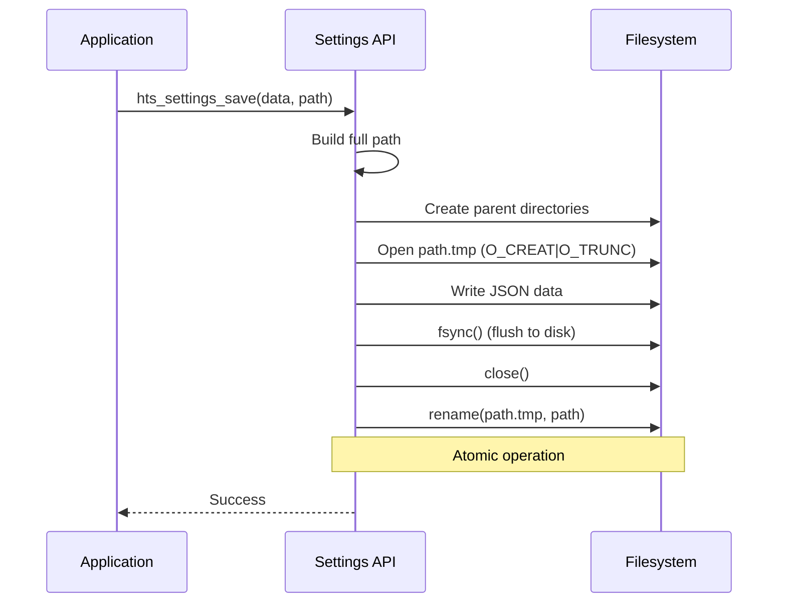
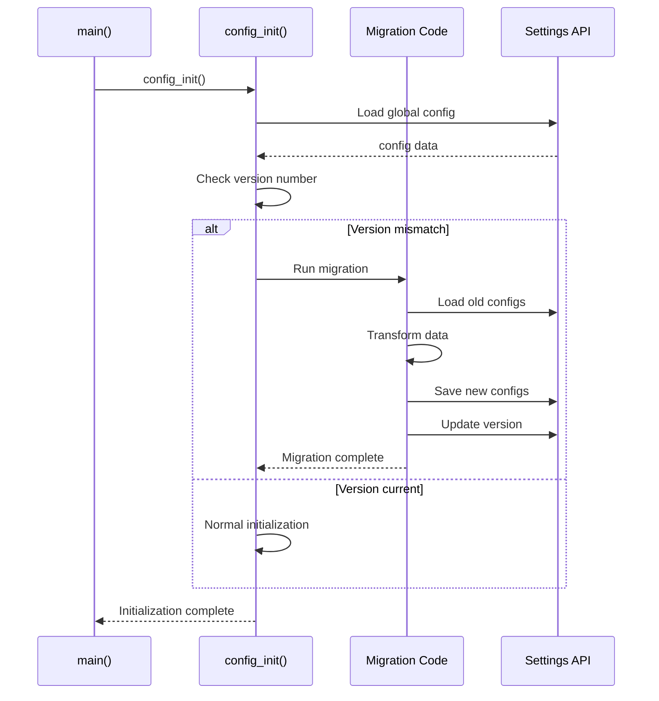
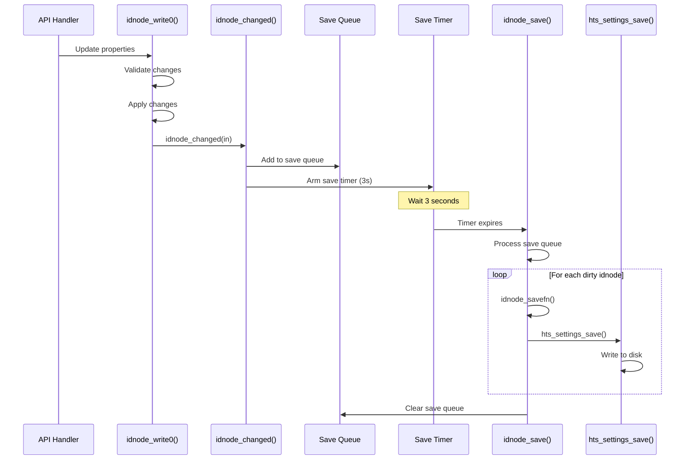

[← Back to Table of Contents](00-TOC.md)

## 19. Configuration and Persistence

The Configuration and Persistence subsystem manages all persistent storage of Tvheadend's configuration data. It provides a hierarchical file-based storage system using JSON format, automatic save/load mechanisms through the idnode system, and configuration migration support for version upgrades. This section documents the configuration directory structure, the settings API, and the idnode persistence mechanisms that enable automatic serialization and change tracking.

### 19.1 Configuration Storage

Tvheadend stores all configuration data in a hierarchical directory structure using JSON files. This approach provides human-readable configuration, easy backup and restore, version control compatibility, and platform independence.

#### 19.1.1 Configuration Directory Structure

**Location**: `src/settings.c`, `src/settings.h`

The configuration directory (typically `~/.hts/tvheadend/` or `/home/hts/.hts/tvheadend/`) contains all persistent configuration data organized in a hierarchical structure that mirrors the logical organization of configuration objects.

**Default Configuration Paths:**
- **Linux**: `~/.hts/tvheadend/`
- **Custom**: Specified via `-c` or `--config` command-line option
- **Fallback**: `data/conf/` (bundled default configurations)

**Directory Structure:**

```
~/.hts/tvheadend/
├── accesscontrol/
│   └── <uuid>                    # Access control entries
├── bouquet/
│   └── <uuid>                    # Bouquet definitions
├── channel/
│   ├── config/
│   │   └── <uuid>                # Channel configurations
│   └── tag/
│       └── <uuid>                # Channel tags
├── dvr/
│   ├── config/
│   │   └── <uuid>                # DVR configuration profiles
│   ├── log/
│   │   └── <uuid>                # DVR recording entries
│   ├── autorec/
│   │   └── <uuid>                # Automatic recording rules
│   └── timerec/
│       └── <uuid>                # Time-based recording rules
├── epggrab/
│   ├── config
│   └── <module>/
│       └── channels/
│           └── <uuid>            # EPG grabber channel mappings
├── input/
│   ├── linuxdvb/
│   │   ├── adapters/
│   │   │   └── <uuid>/
│   │   │       ├── config        # Adapter configuration
│   │   │       └── frontends/
│   │   │           └── <uuid>/
│   │   │               └── config # Frontend configuration
│   │   └── networks/
│   │       └── <uuid>/
│   │           ├── config        # Network configuration
│   │           └── muxes/
│   │               └── <uuid>    # Mux configurations
│   ├── iptv/
│   │   ├── networks/
│   │   │   └── <uuid>/
│   │   │       ├── config
│   │   │       └── muxes/
│   │   │           └── <uuid>
│   │   └── channels/
│   │       └── <uuid>
│   ├── satip/
│   │   └── ...                   # Similar structure
│   └── tvhdhomerun/
│       └── ...                   # Similar structure
├── profile/
│   └── <uuid>                    # Streaming profiles
├── esfilter/
│   └── <uuid>                    # Elementary stream filters
├── caclient/
│   └── <uuid>                    # CA client configurations
├── timeshift/
│   └── config                    # Timeshift configuration
├── epgdb.v3                      # EPG database (binary/compressed)
├── config                        # Global configuration
├── backup/
│   └── config.<timestamp>        # Configuration backups
└── imagecache/
    └── ...                       # Cached images
```

**Key Characteristics:**

1. **UUID-based naming**: Most configuration files are named using UUIDs, ensuring uniqueness and enabling references between objects
2. **Hierarchical organization**: Related configurations are grouped in subdirectories (e.g., all muxes under their network)
3. **JSON format**: Human-readable text format for easy inspection and editing
4. **Atomic writes**: Configuration files are written atomically using temporary files and rename operations
5. **Backup support**: Old configurations can be backed up before being overwritten

#### 19.1.2 JSON-Based Storage Format

**File Format:**

Configuration files use standard JSON format with pretty-printing for readability. Each file represents a single configuration object (idnode) with its properties serialized as JSON key-value pairs.

**Example - Channel Configuration** (`channel/config/<uuid>`):
```json
{
  "name": "BBC One HD",
  "number": 101,
  "icon": "https://example.com/icons/bbc-one.png",
  "epgauto": true,
  "enabled": true,
  "autoname": false,
  "services": [
    "abc123-def456-789012"
  ],
  "tags": [
    "tag-uuid-1",
    "tag-uuid-2"
  ],
  "bouquet": ""
}
```

**Example - DVR Entry** (`dvr/log/<uuid>`):
```json
{
  "enabled": true,
  "start": 1699200000,
  "start_extra": 120,
  "stop": 1699206000,
  "stop_extra": 300,
  "channel": "channel-uuid",
  "title": {
    "eng": "Documentary Title"
  },
  "subtitle": {
    "eng": "Episode 5"
  },
  "description": {
    "eng": "Episode description..."
  },
  "pri": 2,
  "retention": 31,
  "removal": 0,
  "playposition": 0,
  "playcount": 0,
  "config_name": "Default Profile",
  "creator": "admin",
  "filename": "/recordings/Documentary_Title.mkv",
  "errorcode": 0,
  "errors": 0,
  "data_errors": 0
}
```

**Example - Input Network** (`input/linuxdvb/networks/<uuid>/config`):
```json
{
  "networkname": "DVB-T Network",
  "skipinitscan": false,
  "idlescan": true,
  "sid_chnum": false,
  "ignore_chnum": false,
  "satip_source": 0,
  "max_streams": 0,
  "max_bandwidth": 0,
  "max_timeout": 15,
  "priority": 1,
  "spriority": 1,
  "charset": "UTF-8"
}
```

**Data Type Serialization:**

| C Type | JSON Type | Example |
|--------|-----------|---------|
| `int`, `uint32_t` | Number | `"number": 101` |
| `int64_t`, `time_t` | Number | `"start": 1699200000` |
| `char *` | String | `"name": "Channel"` |
| `int` (boolean) | Boolean | `"enabled": true` |
| `double` | Number | `"ratio": 1.777` |
| UUID reference | String | `"channel": "uuid-string"` |
| UUID list | Array of strings | `"tags": ["uuid1", "uuid2"]` |
| Language strings | Object | `"title": {"eng": "Title"}` |

**Special Handling:**

1. **NULL values**: Omitted from JSON (not serialized)
2. **Default values**: May be omitted to reduce file size
3. **Read-only properties**: Not serialized (computed at runtime)
4. **Password fields**: May be encrypted or hashed
5. **Binary data**: Base64-encoded if necessary

#### 19.1.3 Compressed Storage

For large configuration datasets (particularly mux configurations), Tvheadend supports compressed storage using gzip compression with a custom binary format.

**Compression Criteria:**
- Applied to mux configurations in network directories
- Reduces disk space for networks with many muxes
- Transparent to application code (handled by settings layer)

**Compressed File Format:**
```
Header: "\xff\xffGZIP0" (7 bytes)
Version: '0' or '1' (1 byte)
Original Size: 4 bytes (big-endian)
Compressed Data: gzip-compressed htsmsg binary format
```

**Version Differences:**
- **Version '0'**: Uses `htsmsg_binary` format (legacy)
- **Version '1'**: Uses `htsmsg_binary2` format (current)

**Implementation** (`src/settings.c`):
```c
// Saving with compression
#if ENABLE_ZLIB
pack = strstr(path, "/muxes/") != NULL &&
       strstr(path, "/networks/") != NULL &&
       strstr(path, "/input/") != NULL;

if (pack) {
  void *msgdata = NULL;
  size_t msglen;
  
  // Serialize to binary format
  htsmsg_binary2_serialize0(record, &msgdata, &msglen, 2*1024*1024);
  
  // Compress and write with custom header
  tvh_gzip_deflate_fd_header(fd, msgdata, msglen, NULL, 3, "01");
  
  free(msgdata);
}
#endif

// Loading compressed data
if (size > 12 && memcmp(mem, "\xff\xffGZIP0", 7) == 0) {
  uint32_t orig = (mem[8] << 24) | (mem[9] << 16) | 
                  (mem[10] << 8) | mem[11];
  
  // Decompress
  uint8_t *unpacked = tvh_gzip_inflate((uint8_t *)mem + 12, 
                                       size - 12, orig);
  
  // Deserialize based on version
  if (mem[7] == '1') {
    r = htsmsg_binary2_deserialize0(unpacked, orig, NULL);
  } else {
    r = htsmsg_binary_deserialize0(unpacked, orig, NULL);
  }
  
  free(unpacked);
}
```

**Benefits:**
- Significant space savings for large mux lists (10x-20x compression)
- Faster loading due to reduced I/O
- Backward compatible with uncompressed JSON

#### 19.1.4 Configuration File Operations

**Location**: `src/settings.c`

The settings API provides functions for saving, loading, and managing configuration files.

**Core Functions:**

**1. Save Configuration**
```c
void hts_settings_save(htsmsg_t *record, const char *pathfmt, ...);
```

**Behavior:**
- Creates parent directories if needed
- Writes to temporary file first (`.tmp` suffix)
- Atomically renames temporary file to final name
- Handles compression for eligible paths
- Logs errors if save fails

**Example Usage:**
```c
htsmsg_t *m = htsmsg_create_map();
htsmsg_add_str(m, "name", "My Channel");
htsmsg_add_u32(m, "number", 101);
hts_settings_save(m, "channel/config/%s", uuid);
htsmsg_destroy(m);
```

**2. Load Configuration**
```c
htsmsg_t *hts_settings_load(const char *pathfmt, ...);
```

**Behavior:**
- Builds full path from format string
- Tries user configuration directory first
- Falls back to bundled defaults (`data/conf/`)
- Automatically detects and decompresses gzip files
- Returns NULL if file doesn't exist

**Example Usage:**
```c
htsmsg_t *m = hts_settings_load("channel/config/%s", uuid);
if (m) {
  const char *name = htsmsg_get_str(m, "name");
  uint32_t number = htsmsg_get_u32_or_default(m, "number", 0);
  // ... process configuration
  htsmsg_destroy(m);
}
```

**3. Load Recursive**
```c
htsmsg_t *hts_settings_load_r(int depth, const char *pathfmt, ...);
```

**Behavior:**
- Loads directory hierarchies recursively
- Returns nested htsmsg structure
- Depth parameter limits recursion level
- Used for loading entire configuration trees

**Example Usage:**
```c
// Load all channels
htsmsg_t *channels = hts_settings_load_r(1, "channel/config");
htsmsg_field_t *f;
HTSMSG_FOREACH(f, channels) {
  htsmsg_t *ch = htsmsg_field_get_map(f);
  // Process each channel
}
htsmsg_destroy(channels);
```

**4. Remove Configuration**
```c
void hts_settings_remove(const char *pathfmt, ...);
```

**Behavior:**
- Removes file or directory
- Recursively removes directories
- Cleans up empty parent directories
- Safe to call on non-existent paths

**Example Usage:**
```c
hts_settings_remove("channel/config/%s", uuid);
```

**5. Check Existence**
```c
int hts_settings_exists(const char *pathfmt, ...);
```

**Behavior:**
- Returns 1 if path exists, 0 otherwise
- Works for both files and directories

**Example Usage:**
```c
if (hts_settings_exists("channel/config/%s", uuid)) {
  // Configuration exists
}
```

#### 19.1.5 Path Building and Sanitization

**Path Construction:**

The settings system builds paths from format strings and sanitizes them to prevent security issues and filesystem incompatibilities.

**Implementation** (`src/settings.c`):
```c
static void
_hts_settings_buildpath(char *dst, size_t dstsize, 
                        const char *fmt, va_list ap, 
                        const char *prefix)
{
  char tmp[PATH_MAX];
  char *n = dst;

  // Format the path
  vsnprintf(tmp, sizeof(tmp), fmt, ap);
  
  // Add prefix if relative path
  if (*tmp != '/' && prefix)
    snprintf(dst, dstsize, "%s/%s", prefix, tmp);
  else
    strlcpy(dst, tmp, dstsize);

  // Sanitize: replace invalid characters with underscore
  while(*n) {
    if(*n == ':' || *n == '?' || *n == '*' || 
       *n > 127 || *n < 32)
      *n = '_';
    n++;
  }
}
```

**Sanitization Rules:**
- `:` → `_` (colon not allowed in filenames on some systems)
- `?` → `_` (wildcard character)
- `*` → `_` (wildcard character)
- Characters > 127 → `_` (non-ASCII)
- Characters < 32 → `_` (control characters)

**Security Considerations:**
- Prevents directory traversal attacks (`..` in paths)
- Ensures filesystem compatibility across platforms
- Avoids shell metacharacters in filenames

#### 19.1.6 Atomic Write Operations

To prevent configuration corruption from crashes or power failures, Tvheadend uses atomic write operations.

**Atomic Write Process:**



**Implementation Details:**

1. **Temporary File**: Write to `<path>.tmp` first
2. **Full Write**: Complete entire write before rename
3. **Atomic Rename**: `rename()` is atomic on POSIX systems
4. **Error Handling**: If write fails, temporary file is deleted
5. **Overwrite Protection**: Rename handles existing files atomically

**Benefits:**
- **Crash safety**: Incomplete writes don't corrupt configuration
- **Consistency**: Configuration is always in a valid state
- **Rollback**: Old configuration remains until new one is complete

**Code Example** (`src/settings.c`):
```c
void hts_settings_save(htsmsg_t *record, const char *pathfmt, ...)
{
  char path[PATH_MAX];
  char tmppath[PATH_MAX + 4];
  int fd, ok;
  
  // Build paths
  snprintf(tmppath, sizeof(tmppath), "%s.tmp", path);
  
  // Open temporary file
  fd = tvh_open(tmppath, O_CREAT | O_TRUNC | O_RDWR, 
                S_IRUSR | S_IWUSR);
  
  // Write data
  ok = write_json_data(fd, record);
  close(fd);
  
  // Atomic rename if successful
  if (ok) {
    if (rename(tmppath, path) < 0) {
      tvhalert(LS_SETTINGS, "Unable to rename \"%s\" to \"%s\"",
               tmppath, path);
    }
  } else {
    unlink(tmppath);  // Delete failed write
  }
}
```


#### 19.1.7 Configuration Migration

Tvheadend includes a sophisticated configuration migration system that handles upgrades between versions, ensuring backward compatibility and smooth transitions.

**Migration Triggers:**
- Version number changes in global configuration
- Missing or outdated configuration structures
- Schema changes in idnode classes
- Deprecated configuration formats

**Migration Process:**



**Version Tracking:**

The global configuration file (`config`) contains a version number that tracks the configuration schema version:

```json
{
  "version": 3,
  "language": "en_US",
  "uilevel": 2,
  ...
}
```

**Migration Implementation** (`src/config.c`):

```c
void config_init(int backup)
{
  htsmsg_t *m;
  uint32_t current_version = CONFIG_VERSION;
  uint32_t stored_version;
  
  // Load configuration
  m = hts_settings_load("config");
  
  // Get stored version
  stored_version = htsmsg_get_u32_or_default(m, "version", 0);
  
  // Check if migration needed
  if (stored_version < current_version) {
    tvhinfo(LS_CONFIG, "Migrating configuration from v%d to v%d",
            stored_version, current_version);
    
    // Backup if requested
    if (backup) {
      config_backup();
    }
    
    // Run migrations
    for (uint32_t v = stored_version + 1; v <= current_version; v++) {
      config_migrate_version(v);
    }
    
    // Update version
    config.version = current_version;
    idnode_changed(&config.idnode);
  }
  
  htsmsg_destroy(m);
}
```

**Common Migration Tasks:**
1. **Rename properties**: Old property names to new names
2. **Split/merge objects**: Reorganize configuration structure
3. **Convert formats**: Change data representation
4. **Add defaults**: Populate new required fields
5. **Remove obsolete**: Clean up deprecated configurations

**Example Migration:**
```c
static void config_migrate_v2_to_v3(void)
{
  htsmsg_t *channels, *m;
  htsmsg_field_t *f;
  
  // Load all channels
  channels = hts_settings_load_r(1, "channel/config");
  
  HTSMSG_FOREACH(f, channels) {
    m = htsmsg_field_get_map(f);
    
    // Migrate: rename "channelname" to "name"
    const char *old_name = htsmsg_get_str(m, "channelname");
    if (old_name) {
      htsmsg_add_str(m, "name", old_name);
      htsmsg_delete_field(m, "channelname");
      
      // Save migrated configuration
      hts_settings_save(m, "channel/config/%s", f->hmf_name);
    }
  }
  
  htsmsg_destroy(channels);
}
```

**Backup Mechanism:**

Before performing migrations, Tvheadend can create a backup of the configuration directory:

```c
void config_backup(void)
{
  char src[PATH_MAX], dst[PATH_MAX];
  time_t now = time(NULL);
  
  snprintf(src, sizeof(src), "%s", hts_settings_get_root());
  snprintf(dst, sizeof(dst), "%s/backup/config.%ld", 
           hts_settings_get_root(), (long)now);
  
  // Create backup directory
  hts_settings_makedirs(dst);
  
  // Copy configuration files
  copy_directory_recursive(src, dst);
  
  tvhinfo(LS_CONFIG, "Configuration backed up to %s", dst);
}
```

### 19.2 Settings System

The settings system provides the low-level API for reading and writing configuration files. It abstracts the filesystem operations and provides a consistent interface for all configuration persistence.

#### 19.2.1 Settings API Overview

**Location**: `src/settings.c`, `src/settings.h`

The settings API (`hts_settings_*` functions) provides the foundation for all configuration persistence in Tvheadend. It handles:
- Path management and sanitization
- Directory creation
- File I/O with error handling
- JSON serialization/deserialization
- Compression support
- Fallback to bundled defaults

**API Design Principles:**
1. **Format string paths**: Flexible path construction using printf-style format strings
2. **Automatic directory creation**: Parent directories created as needed
3. **Atomic operations**: Safe writes using temporary files
4. **Error tolerance**: Graceful handling of missing or corrupt files
5. **Fallback support**: Bundled defaults when user config missing

#### 19.2.2 Settings Initialization

**Initialization Function:**
```c
void hts_settings_init(const char *confpath);
```

**Behavior:**
- Called early in startup (before most subsystems)
- Resolves and stores configuration directory path
- Creates configuration directory if it doesn't exist
- Sets up global `settingspath` variable

**Example** (`src/main.c`):
```c
int main(int argc, char **argv)
{
  const char *confpath = NULL;
  
  // Parse command-line options
  parse_options(argc, argv, &confpath);
  
  // Initialize settings system
  if (!confpath)
    confpath = "~/.hts/tvheadend";
  
  hts_settings_init(confpath);
  
  // Continue initialization...
}
```

**Path Resolution:**
```c
void hts_settings_init(const char *confpath)
{
  if (confpath)
    settingspath = realpath(confpath, NULL);
}
```

**Cleanup:**
```c
void hts_settings_done(void)
{
  free(settingspath);
}
```

#### 19.2.3 Configuration Save/Load

**Save Operation:**

The `hts_settings_save()` function is the primary method for persisting configuration data.

**Function Signature:**
```c
void hts_settings_save(htsmsg_t *record, const char *pathfmt, ...);
```

**Parameters:**
- `record`: htsmsg structure containing configuration data
- `pathfmt`: printf-style format string for file path
- `...`: Variable arguments for path formatting

**Save Process:**

1. **Build Path**: Construct full path from format string
2. **Create Directories**: Ensure parent directories exist
3. **Open Temporary File**: Create `.tmp` file for writing
4. **Serialize Data**: Convert htsmsg to JSON (or compressed binary)
5. **Write Data**: Write serialized data to temporary file
6. **Atomic Rename**: Rename temporary file to final name
7. **Error Handling**: Delete temporary file on failure

**Example Usage:**
```c
// Save channel configuration
htsmsg_t *m = htsmsg_create_map();
htsmsg_add_str(m, "name", "BBC One");
htsmsg_add_u32(m, "number", 1);
htsmsg_add_bool(m, "enabled", 1);

hts_settings_save(m, "channel/config/%s", channel_uuid);

htsmsg_destroy(m);
```

**Load Operation:**

The `hts_settings_load()` function loads configuration data from disk.

**Function Signature:**
```c
htsmsg_t *hts_settings_load(const char *pathfmt, ...);
```

**Parameters:**
- `pathfmt`: printf-style format string for file path
- `...`: Variable arguments for path formatting

**Returns:**
- htsmsg structure containing loaded data, or NULL if file doesn't exist

**Load Process:**

1. **Build Path**: Construct full path from format string
2. **Try User Config**: Attempt to load from user configuration directory
3. **Try Bundled Defaults**: If not found, try `data/conf/` directory
4. **Open File**: Open file for reading
5. **Read Data**: Read entire file into memory
6. **Detect Format**: Check for compression header or JSON
7. **Deserialize**: Parse JSON or decompress and deserialize binary
8. **Return Data**: Return htsmsg structure or NULL

**Example Usage:**
```c
// Load channel configuration
htsmsg_t *m = hts_settings_load("channel/config/%s", channel_uuid);
if (m) {
  const char *name = htsmsg_get_str(m, "name");
  uint32_t number = htsmsg_get_u32_or_default(m, "number", 0);
  int enabled = htsmsg_get_bool_or_default(m, "enabled", 1);
  
  // Use configuration data...
  
  htsmsg_destroy(m);
} else {
  // Configuration not found, use defaults
}
```

**Recursive Load:**

For loading entire directory trees, use `hts_settings_load_r()`:

```c
htsmsg_t *hts_settings_load_r(int depth, const char *pathfmt, ...);
```

**Parameters:**
- `depth`: Maximum recursion depth (0 = files only, 1 = one level of subdirs, etc.)
- `pathfmt`: Path format string
- `...`: Variable arguments

**Returns:**
- Nested htsmsg structure representing directory hierarchy

**Example Usage:**
```c
// Load all channels (one level deep)
htsmsg_t *channels = hts_settings_load_r(1, "channel/config");

htsmsg_field_t *f;
HTSMSG_FOREACH(f, channels) {
  const char *uuid = f->hmf_name;
  htsmsg_t *ch = htsmsg_field_get_map(f);
  
  // Process each channel...
}

htsmsg_destroy(channels);
```

#### 19.2.4 Backup Mechanism

Tvheadend provides a backup mechanism to protect against configuration loss during upgrades or migrations.

**Backup Creation:**

Backups are created in the `backup/` subdirectory with timestamps:

```
~/.hts/tvheadend/backup/
├── config.1699200000      # Backup from timestamp 1699200000
├── config.1699300000      # Backup from timestamp 1699300000
└── config.1699400000      # Backup from timestamp 1699400000
```

**Backup Triggers:**
1. **Manual backup**: Via web UI or command-line option
2. **Pre-migration backup**: Before configuration migration
3. **Pre-upgrade backup**: Before version upgrade
4. **Scheduled backup**: Optional periodic backups

**Backup Implementation:**

```c
int config_backup(const char *reason)
{
  char src[PATH_MAX], dst[PATH_MAX];
  time_t now = time(NULL);
  
  // Build source and destination paths
  snprintf(src, sizeof(src), "%s", hts_settings_get_root());
  snprintf(dst, sizeof(dst), "%s/backup/config.%ld", 
           hts_settings_get_root(), (long)now);
  
  // Create backup directory
  if (makedirs(LS_SETTINGS, dst, 0700, 1, -1, -1) < 0) {
    tvherror(LS_SETTINGS, "Failed to create backup directory");
    return -1;
  }
  
  // Copy configuration files recursively
  if (copy_directory_recursive(src, dst, 
                                /* exclude */ "backup,imagecache,epgdb") < 0) {
    tvherror(LS_SETTINGS, "Failed to backup configuration");
    return -1;
  }
  
  tvhinfo(LS_SETTINGS, "Configuration backed up to %s (%s)", 
          dst, reason);
  
  return 0;
}
```

**Backup Exclusions:**
- `backup/` - Don't backup backups
- `imagecache/` - Cached images (can be regenerated)
- `epgdb.v3` - EPG database (large, can be regenerated)
- `*.tmp` - Temporary files

**Backup Restoration:**

Backups can be restored manually by copying files back:

```bash
# Stop Tvheadend
systemctl stop tvheadend

# Restore from backup
cp -r ~/.hts/tvheadend/backup/config.1699200000/* ~/.hts/tvheadend/

# Start Tvheadend
systemctl start tvheadend
```

**Automatic Cleanup:**

Old backups can be automatically cleaned up to save disk space:

```c
void config_backup_cleanup(int keep_count)
{
  char path[PATH_MAX];
  struct dirent **namelist;
  int n, i;
  
  snprintf(path, sizeof(path), "%s/backup", hts_settings_get_root());
  
  // Scan backup directory
  n = scandir(path, &namelist, NULL, alphasort);
  if (n < 0) return;
  
  // Keep only the most recent 'keep_count' backups
  for (i = 0; i < n - keep_count; i++) {
    if (strncmp(namelist[i]->d_name, "config.", 7) == 0) {
      char backup_path[PATH_MAX];
      snprintf(backup_path, sizeof(backup_path), "%s/%s", 
               path, namelist[i]->d_name);
      rmtree(backup_path);
      tvhdebug(LS_SETTINGS, "Removed old backup: %s", backup_path);
    }
  }
  
  // Free namelist
  for (i = 0; i < n; i++)
    free(namelist[i]);
  free(namelist);
}
```

#### 19.2.5 Settings File Operations

**Open File for Direct Access:**

For cases where direct file access is needed (e.g., streaming large files):

```c
int hts_settings_open_file(int flags, const char *pathfmt, ...);
```

**Flags:**
- `HTS_SETTINGS_OPEN_WRITE`: Open for writing (creates file)
- `HTS_SETTINGS_OPEN_DIRECT`: Use direct I/O (bypass buffering)

**Returns:**
- File descriptor on success, -1 on error

**Example Usage:**
```c
// Open file for writing
int fd = hts_settings_open_file(HTS_SETTINGS_OPEN_WRITE, 
                                 "recordings/%s.ts", filename);
if (fd >= 0) {
  write(fd, data, size);
  close(fd);
}
```

**Build Path Without I/O:**

To construct a path without performing I/O:

```c
int hts_settings_buildpath(char *dst, size_t dstsize, 
                           const char *pathfmt, ...);
```

**Example Usage:**
```c
char path[PATH_MAX];
hts_settings_buildpath(path, sizeof(path), "channel/config/%s", uuid);
// path now contains full path to channel config file
```

**Check Path Existence:**

```c
int hts_settings_exists(const char *pathfmt, ...);
```

**Returns:**
- 1 if path exists (file or directory)
- 0 if path doesn't exist

**Example Usage:**
```c
if (hts_settings_exists("channel/config/%s", uuid)) {
  // Channel configuration exists
} else {
  // Channel configuration missing, use defaults
}
```

**Remove Configuration:**

```c
void hts_settings_remove(const char *pathfmt, ...);
```

**Behavior:**
- Removes file or directory
- Recursively removes directories and contents
- Cleans up empty parent directories
- Safe to call on non-existent paths (no error)

**Example Usage:**
```c
// Remove channel configuration
hts_settings_remove("channel/config/%s", uuid);

// Remove entire network (including all muxes)
hts_settings_remove("input/linuxdvb/networks/%s", network_uuid);
```

#### 19.2.6 XDG Directory Support

Tvheadend supports XDG Base Directory Specification for locating user directories (e.g., for recordings).

**XDG Functions:**

```c
char *hts_settings_get_xdg_dir_lookup(const char *name);
char *hts_settings_get_xdg_dir_with_fallback(const char *name, 
                                              const char *fallback);
```

**Supported Directories:**
- `VIDEOS` - User's videos directory
- `MUSIC` - User's music directory
- `PICTURES` - User's pictures directory
- `DOCUMENTS` - User's documents directory
- `DOWNLOAD` - User's download directory

**Example Usage:**
```c
// Get user's videos directory for recordings
char *videos_dir = hts_settings_get_xdg_dir_with_fallback("VIDEOS", 
                                                           "/home/user/Videos");
if (videos_dir) {
  // Use videos_dir for default recording path
  free(videos_dir);
}
```

**Implementation:**

The XDG directory lookup reads from `~/.config/user-dirs.dirs`:

```bash
# ~/.config/user-dirs.dirs
XDG_VIDEOS_DIR="$HOME/Videos"
XDG_MUSIC_DIR="$HOME/Music"
XDG_PICTURES_DIR="$HOME/Pictures"
```


### 19.3 idnode Persistence

The idnode system provides automatic persistence for all configuration objects through a sophisticated save/load mechanism. This section documents how idnodes are serialized to disk, how changes trigger saves, and how the system ensures data consistency.

#### 19.3.1 idnode Save/Load Mechanism

**Location**: `src/idnode.c`, `src/idnode.h`

Every idnode-based configuration object automatically supports persistence through the idnode framework. The framework handles:
- Property serialization to JSON
- Automatic save triggering on changes
- Delayed/batched saves to reduce I/O
- Load-time property validation
- Change notification

**Key Functions:**

```c
// Trigger save (delayed)
void idnode_changed(idnode_t *in);

// Save immediately
htsmsg_t *idnode_savefn(idnode_t *self, char *filename, size_t fsize);

// Load from htsmsg
void idnode_loadfn(idnode_t *self, htsmsg_t *conf);

// Serialize to htsmsg
htsmsg_t *idnode_serialize0(idnode_t *self, htsmsg_t *list, 
                            int optmask, const char *lang);

// Deserialize from htsmsg
int idnode_write0(idnode_t *self, htsmsg_t *m, int optmask, int dosave);
```

#### 19.3.2 Automatic Save Triggering

When an idnode's properties are modified, the system automatically schedules a save operation.

**Change Notification Flow:**



**Implementation:**

**1. Mark Object as Changed:**
```c
void idnode_changed(idnode_t *in)
{
  idnode_save_t *ise;
  
  tvh_mutex_lock(&global_lock);
  
  // Check if already in save queue
  if (in->in_save) {
    tvh_mutex_unlock(&global_lock);
    return;
  }
  
  // Allocate save queue entry
  ise = calloc(1, sizeof(idnode_save_t));
  ise->ise_node = in;
  ise->ise_reqtime = mclk();  // Record request time
  
  // Add to save queue
  TAILQ_INSERT_TAIL(&idnode_save_queue, ise, ise_link);
  in->in_save = ise;
  
  // Arm save timer (3 seconds delay)
  mtimer_arm_rel(&idnode_save_timer, idnode_save_cb, NULL,
                 IDNODE_SAVE_DELAY);
  
  tvh_mutex_unlock(&global_lock);
}
```

**2. Save Timer Callback:**
```c
static void idnode_save_cb(void *aux)
{
  idnode_save_t *ise;
  idnode_t *in;
  char filename[PATH_MAX];
  htsmsg_t *m;
  
  tvh_mutex_lock(&global_lock);
  
  // Process all items in save queue
  while ((ise = TAILQ_FIRST(&idnode_save_queue)) != NULL) {
    in = ise->ise_node;
    
    // Remove from queue
    TAILQ_REMOVE(&idnode_save_queue, ise, ise_link);
    in->in_save = NULL;
    free(ise);
    
    // Skip if marked as out of service
    if (in->in_save == SAVEPTR_OUTOFSERVICE)
      continue;
    
    // Call class-specific save function
    if (in->in_class->ic_save) {
      m = in->in_class->ic_save(in, filename, sizeof(filename));
      if (m && filename[0]) {
        hts_settings_save(m, "%s", filename);
        htsmsg_destroy(m);
      }
    }
  }
  
  tvh_mutex_unlock(&global_lock);
}
```

**Save Delay:**

The 3-second delay (`IDNODE_SAVE_DELAY`) serves several purposes:
1. **Batching**: Multiple rapid changes result in a single save
2. **Performance**: Reduces disk I/O during bulk operations
3. **Consistency**: Ensures related changes are saved together
4. **User experience**: Doesn't block UI during configuration changes

**Example:**
```c
// User changes multiple channel properties
channel_set_name(ch, "New Name");      // Triggers idnode_changed()
channel_set_number(ch, 101);           // Triggers idnode_changed()
channel_set_enabled(ch, 1);            // Triggers idnode_changed()

// All three changes batched into single save after 3 seconds
```

#### 19.3.3 Property Serialization

The idnode system automatically serializes object properties to JSON based on property metadata.

**Serialization Process:**

```c
htsmsg_t *idnode_serialize0(idnode_t *self, htsmsg_t *list, 
                            int optmask, const char *lang)
{
  const idclass_t *ic = self->in_class;
  const property_t *p;
  htsmsg_t *m;
  
  // Create message if not provided
  if (!list)
    m = htsmsg_create_map();
  else
    m = list;
  
  // Serialize all properties
  for (p = ic->ic_properties; p && p->id; p++) {
    // Skip properties based on optmask
    if (optmask & PO_NOSAVE && p->opts & PO_NOSAVE)
      continue;
    if (optmask & PO_RDONLY && p->opts & PO_RDONLY)
      continue;
    
    // Serialize property based on type
    switch (p->type) {
      case PT_BOOL:
        {
          int val;
          if (p->get_int) {
            val = p->get_int(self);
            htsmsg_add_bool(m, p->id, val);
          }
        }
        break;
        
      case PT_INT:
      case PT_U32:
        {
          uint32_t val;
          if (p->get_u32) {
            val = p->get_u32(self);
            htsmsg_add_u32(m, p->id, val);
          }
        }
        break;
        
      case PT_STR:
        {
          const char *val;
          if (p->get_str) {
            val = p->get_str(self);
            if (val)
              htsmsg_add_str(m, p->id, val);
          }
        }
        break;
        
      // ... other types
    }
  }
  
  // Serialize parent class properties
  if (ic->ic_super)
    idnode_serialize0(self, m, optmask, lang);
  
  return m;
}
```

**Property Types and Serialization:**

| Property Type | JSON Type | Serialization Method |
|--------------|-----------|---------------------|
| `PT_BOOL` | Boolean | `htsmsg_add_bool()` |
| `PT_INT`, `PT_U32` | Number | `htsmsg_add_u32()` |
| `PT_S64`, `PT_TIME` | Number | `htsmsg_add_s64()` |
| `PT_DBL` | Number | `htsmsg_add_dbl()` |
| `PT_STR` | String | `htsmsg_add_str()` |
| `PT_LANGSTR` | Object | `htsmsg_add_msg()` (nested) |
| `PT_UUID` | String | UUID as string |
| `PT_UUID_LIST` | Array | Array of UUID strings |

**Property Options Affecting Serialization:**

- `PO_NOSAVE`: Property not saved to disk (computed at runtime)
- `PO_RDONLY`: Read-only property (not saved)
- `PO_WRONCE`: Write-once property (saved only on creation)
- `PO_ADVANCED`: Advanced property (saved normally)
- `PO_HIDDEN`: Hidden property (saved normally)
- `PO_PASSWORD`: Password field (may be encrypted)

**Example Serialization:**

Given a channel object:
```c
typedef struct channel {
  idnode_t ch_id;
  char *ch_name;
  uint32_t ch_number;
  int ch_enabled;
  idnode_list_head_t ch_services;  // List of service UUIDs
} channel_t;
```

With properties:
```c
static const property_t channel_properties[] = {
  {
    .id    = "name",
    .type  = PT_STR,
    .get_str = channel_get_name,
    .set_str = channel_set_name,
  },
  {
    .id    = "number",
    .type  = PT_U32,
    .get_u32 = channel_get_number,
    .set_u32 = channel_set_number,
  },
  {
    .id    = "enabled",
    .type  = PT_BOOL,
    .get_int = channel_get_enabled,
    .set_int = channel_set_enabled,
  },
  {
    .id    = "services",
    .type  = PT_UUID_LIST,
    .get_list = channel_get_services,
    .set_list = channel_set_services,
  },
  { }
};
```

Serializes to:
```json
{
  "name": "BBC One HD",
  "number": 101,
  "enabled": true,
  "services": [
    "service-uuid-1",
    "service-uuid-2"
  ]
}
```

#### 19.3.4 Property Deserialization

When loading configuration from disk, the idnode system deserializes JSON back into object properties.

**Deserialization Process:**

```c
int idnode_write0(idnode_t *self, htsmsg_t *m, int optmask, int dosave)
{
  const idclass_t *ic = self->in_class;
  const property_t *p;
  htsmsg_field_t *f;
  int save = 0;
  
  // Iterate over all fields in message
  HTSMSG_FOREACH(f, m) {
    // Find matching property
    p = idclass_find_property(ic, f->hmf_name);
    if (!p) continue;
    
    // Check if property is writable
    if (optmask & PO_RDONLY && p->opts & PO_RDONLY)
      continue;
    if (optmask & PO_WRONCE && p->opts & PO_WRONCE)
      continue;
    
    // Deserialize based on type
    switch (p->type) {
      case PT_BOOL:
        if (p->set_int) {
          int val = htsmsg_field_get_bool(f);
          if (p->set_int(self, val) > 0)
            save = 1;
        }
        break;
        
      case PT_U32:
        if (p->set_u32) {
          uint32_t val = htsmsg_field_get_u32(f);
          if (p->set_u32(self, val) > 0)
            save = 1;
        }
        break;
        
      case PT_STR:
        if (p->set_str) {
          const char *val = htsmsg_field_get_str(f);
          if (val && p->set_str(self, val) > 0)
            save = 1;
        }
        break;
        
      // ... other types
    }
  }
  
  // Trigger save if requested and changes were made
  if (dosave && save)
    idnode_changed(self);
  
  return save;
}
```

**Validation During Deserialization:**

Property setter functions can validate values and reject invalid data:

```c
static int channel_set_number(void *o, uint32_t v)
{
  channel_t *ch = o;
  
  // Validate range
  if (v < 1 || v > 9999) {
    tvherror(LS_CHANNEL, "Invalid channel number: %u", v);
    return 0;  // Reject change
  }
  
  // Check if changed
  if (ch->ch_number == v)
    return 0;  // No change
  
  // Apply change
  ch->ch_number = v;
  return 1;  // Changed
}
```

**Return Values from Setters:**
- `0`: No change (value same or rejected)
- `1`: Changed (triggers save if `dosave` is set)
- `-1`: Error (logged but not fatal)

#### 19.3.5 Change Tracking

The idnode system tracks which objects have been modified and need to be saved.

**Save Queue Structure:**

```c
typedef struct idnode_save {
  TAILQ_ENTRY(idnode_save) ise_link;  // Queue link
  idnode_t *ise_node;                 // Node to save
  int64_t ise_reqtime;                // Time change requested
} idnode_save_t;

// Global save queue
static TAILQ_HEAD(, idnode_save) idnode_save_queue;

// Save timer
static mtimer_t idnode_save_timer;
```

**Save Queue Operations:**

**1. Add to Queue:**
```c
void idnode_changed(idnode_t *in)
{
  idnode_save_t *ise;
  
  // Skip if already queued
  if (in->in_save)
    return;
  
  // Create queue entry
  ise = calloc(1, sizeof(idnode_save_t));
  ise->ise_node = in;
  ise->ise_reqtime = mclk();
  
  // Add to queue
  TAILQ_INSERT_TAIL(&idnode_save_queue, ise, ise_link);
  in->in_save = ise;
  
  // Arm timer
  mtimer_arm_rel(&idnode_save_timer, idnode_save_cb, NULL,
                 IDNODE_SAVE_DELAY);
}
```

**2. Remove from Queue:**
```c
void idnode_save_check(idnode_t *self, int weak)
{
  idnode_save_t *ise = self->in_save;
  
  if (!ise || ise == SAVEPTR_OUTOFSERVICE)
    return;
  
  // Remove from queue
  TAILQ_REMOVE(&idnode_save_queue, ise, ise_link);
  self->in_save = NULL;
  free(ise);
  
  // If not weak, save immediately
  if (!weak) {
    char filename[PATH_MAX];
    htsmsg_t *m = idnode_savefn(self, filename, sizeof(filename));
    if (m && filename[0]) {
      hts_settings_save(m, "%s", filename);
      htsmsg_destroy(m);
    }
  }
}
```

**3. Mark Out of Service:**

When an object is being deleted, mark it to prevent saves:

```c
void idnode_delete(idnode_t *in)
{
  // Mark as out of service
  if (in->in_save && in->in_save != SAVEPTR_OUTOFSERVICE) {
    idnode_save_t *ise = in->in_save;
    TAILQ_REMOVE(&idnode_save_queue, ise, ise_link);
    free(ise);
  }
  in->in_save = SAVEPTR_OUTOFSERVICE;
  
  // Call class-specific delete
  if (in->in_class->ic_delete)
    in->in_class->ic_delete(in);
  
  // Remove from trees
  idnode_unlink(in);
}
```

#### 19.3.6 Class-Specific Save/Load

Each idnode class can provide custom save/load functions for special handling.

**Save Callback:**

```c
typedef htsmsg_t *(*ic_save_t)(idnode_t *self, char *filename, size_t fsize);
```

**Purpose:**
- Determine save filename
- Customize serialization
- Add extra data not in properties
- Handle complex relationships

**Example - Channel Save:**
```c
static htsmsg_t *
channel_class_save(idnode_t *self, char *filename, size_t fsize)
{
  channel_t *ch = (channel_t *)self;
  htsmsg_t *m;
  
  // Build filename
  snprintf(filename, fsize, "channel/config/%s",
           idnode_uuid_as_str(self, ubuf));
  
  // Serialize properties
  m = idnode_serialize(self, NULL);
  
  // Add custom data
  htsmsg_add_str(m, "class", "channel");
  
  return m;
}
```

**Load Callback:**

```c
typedef void (*ic_load_t)(idnode_t *self, htsmsg_t *conf);
```

**Purpose:**
- Custom deserialization
- Post-load initialization
- Relationship restoration
- Validation

**Example - Channel Load:**
```c
static void
channel_class_load(idnode_t *self, htsmsg_t *conf)
{
  channel_t *ch = (channel_t *)self;
  
  // Load properties
  idnode_load(self, conf);
  
  // Post-load initialization
  channel_update_icon(ch);
  channel_link_services(ch);
  
  // Notify
  idnode_notify_changed(self);
}
```

#### 19.3.7 Persistence Best Practices

**1. Use idnode_changed() for All Modifications:**
```c
// Good
void channel_set_name(channel_t *ch, const char *name)
{
  if (tvh_str_update(&ch->ch_name, name))
    idnode_changed(&ch->ch_id);
}

// Bad - doesn't trigger save
void channel_set_name_bad(channel_t *ch, const char *name)
{
  free(ch->ch_name);
  ch->ch_name = strdup(name);
  // Missing: idnode_changed(&ch->ch_id);
}
```

**2. Batch Related Changes:**
```c
// Good - single save for multiple changes
void channel_configure(channel_t *ch, const char *name, uint32_t number)
{
  int changed = 0;
  
  changed |= tvh_str_update(&ch->ch_name, name);
  if (ch->ch_number != number) {
    ch->ch_number = number;
    changed = 1;
  }
  
  if (changed)
    idnode_changed(&ch->ch_id);
}

// Bad - multiple saves
void channel_configure_bad(channel_t *ch, const char *name, uint32_t number)
{
  channel_set_name(ch, name);    // Triggers save
  channel_set_number(ch, number); // Triggers save again
}
```

**3. Handle Load Errors Gracefully:**
```c
void channel_load(const char *uuid)
{
  htsmsg_t *m = hts_settings_load("channel/config/%s", uuid);
  if (!m) {
    tvhwarn(LS_CHANNEL, "Failed to load channel %s", uuid);
    return;
  }
  
  channel_t *ch = channel_create(uuid);
  if (ch) {
    idnode_load(&ch->ch_id, m);
  }
  
  htsmsg_destroy(m);
}
```

**4. Validate Before Saving:**
```c
static int channel_set_number(void *o, uint32_t v)
{
  channel_t *ch = o;
  
  // Validate
  if (v < 1 || v > 9999)
    return 0;  // Reject
  
  // Check for duplicates
  if (channel_find_by_number(v) != NULL)
    return 0;  // Reject
  
  // Apply
  ch->ch_number = v;
  return 1;  // Accept
}
```

---

[← Previous](18-Access-Control-System.md) | [Table of Contents](00-TOC.md) | [Next →](20-Known-Issues-Pitfalls.md)
