[← Back to Table of Contents](00-TOC.md)

## 20. Known Issues and Pitfalls

This section documents common problems, pitfalls, and areas of complexity in the Tvheadend codebase. Understanding these issues is critical for developers working on the system, as they represent the most frequent sources of bugs and the areas requiring the most careful attention. This knowledge helps prevent introducing similar issues and guides debugging efforts when problems arise.

### 20.1 Threading Concerns

Tvheadend's multi-threaded architecture requires careful attention to synchronization and lock ordering. Threading issues are among the most difficult bugs to diagnose and fix, as they often manifest as intermittent crashes, deadlocks, or data corruption that only occurs under specific timing conditions.

#### 20.1.1 Lock Ordering Requirements

**Critical Rule: global_lock MUST be acquired before s_stream_mutex**

The most important locking rule in Tvheadend is the hierarchy between `global_lock` and per-service `s_stream_mutex`. Violating this ordering causes deadlocks.

**Correct Pattern:**
```c
// ✅ CORRECT: Acquire global_lock first
tvh_mutex_lock(&global_lock);
service_t *s = find_service_by_uuid(uuid);
if (s) {
  service_ref(s);  // Prevent destruction
}
tvh_mutex_unlock(&global_lock);

if (s) {
  // Now safe to acquire s_stream_mutex
  tvh_mutex_lock(&s->s_stream_mutex);
  // ... perform streaming operations ...
  tvh_mutex_unlock(&s->s_stream_mutex);
  
  // Release reference
  tvh_mutex_lock(&global_lock);
  service_unref(s);
  tvh_mutex_unlock(&global_lock);
}
```

**Incorrect Pattern (Causes Deadlock):**
```c
// ❌ WRONG: Acquiring global_lock while holding s_stream_mutex
tvh_mutex_lock(&s->s_stream_mutex);
// ... streaming operations ...

// DEADLOCK RISK: Reversing lock order
tvh_mutex_lock(&global_lock);
// ... access global data ...
tvh_mutex_unlock(&global_lock);

tvh_mutex_unlock(&s->s_stream_mutex);
```

**Why This Causes Deadlock:**

Consider two threads executing simultaneously:

**Thread A:**
1. Acquires `global_lock`
2. Attempts to acquire `s->s_stream_mutex` (blocks if Thread B holds it)

**Thread B:**
1. Acquires `s->s_stream_mutex`
2. Attempts to acquire `global_lock` (blocks if Thread A holds it)

Result: Classic deadlock - each thread holds a lock the other needs.

**Solution: Use Tasklets to Avoid Lock Inversion**

When you're holding `s_stream_mutex` and need to access global data, use a tasklet to defer the work:

```c
// ✅ CORRECT: Use tasklet to defer work requiring global_lock
tvh_mutex_lock(&s->s_stream_mutex);
// ... streaming operations ...

// Need to update global state - defer to tasklet
tasklet_arm(&update_tasklet, update_global_state, context);

tvh_mutex_unlock(&s->s_stream_mutex);

// Tasklet callback executes later without any locks held
void update_global_state(void *opaque, int disarmed)
{
  if (disarmed) return;
  
  tvh_mutex_lock(&global_lock);
  // ... safely update global state ...
  tvh_mutex_unlock(&global_lock);
}
```

#### 20.1.2 Deadlock Scenarios

**Scenario 1: Multiple Service Locks**

Never acquire `s_stream_mutex` for multiple services simultaneously:

```c
// ❌ WRONG: Holding multiple service stream mutexes
tvh_mutex_lock(&service1->s_stream_mutex);
tvh_mutex_lock(&service2->s_stream_mutex);  // DEADLOCK RISK!
// ... operations on both services ...
tvh_mutex_unlock(&service2->s_stream_mutex);
tvh_mutex_unlock(&service1->s_stream_mutex);
```

**Why:** If another thread acquires these locks in the opposite order, deadlock occurs.

**Solution:** Process services sequentially:

```c
// ✅ CORRECT: Process services one at a time
tvh_mutex_lock(&service1->s_stream_mutex);
// ... operations on service1 ...
tvh_mutex_unlock(&service1->s_stream_mutex);

tvh_mutex_lock(&service2->s_stream_mutex);
// ... operations on service2 ...
tvh_mutex_unlock(&service2->s_stream_mutex);
```

**Scenario 2: Callback Lock Inversion**

Be careful when calling functions that might acquire locks:

```c
// ❌ WRONG: Calling function that acquires global_lock
tvh_mutex_lock(&s->s_stream_mutex);
// ... streaming operations ...

// This function internally acquires global_lock - DEADLOCK!
some_function_that_needs_global_lock();

tvh_mutex_unlock(&s->s_stream_mutex);
```

**Solution:** Release locks before calling potentially lock-acquiring functions:

```c
// ✅ CORRECT: Release lock before calling function
tvh_mutex_lock(&s->s_stream_mutex);
// ... streaming operations ...
tvh_mutex_unlock(&s->s_stream_mutex);

// Now safe to call function that acquires global_lock
some_function_that_needs_global_lock();
```

**Scenario 3: Timer Callback Deadlock**

Timer callbacks execute with `global_lock` already held. Don't try to acquire it again:

```c
// ❌ WRONG: Timer callback trying to acquire global_lock
void timer_callback(void *opaque)
{
  // global_lock is ALREADY HELD by timer thread
  
  tvh_mutex_lock(&global_lock);  // DEADLOCK! (recursive lock)
  // ... operations ...
  tvh_mutex_unlock(&global_lock);
}
```

**Solution:** Remember that timer callbacks already have `global_lock`:

```c
// ✅ CORRECT: Timer callback uses global_lock without acquiring
void timer_callback(void *opaque)
{
  // global_lock is already held - just use it
  lock_assert(&global_lock);  // Verify assumption
  
  // ... operations on global data ...
  
  // Can acquire s_stream_mutex (correct lock order)
  service_t *s = opaque;
  tvh_mutex_lock(&s->s_stream_mutex);
  // ... streaming operations ...
  tvh_mutex_unlock(&s->s_stream_mutex);
}
```

#### 20.1.3 Timer Callback Constraints

Timer callbacks have special constraints because they execute in timer thread context with `global_lock` held.

**Constraints:**

1. **Already Hold global_lock**: Don't try to acquire it again
2. **Keep Callbacks Short**: Long-running callbacks block all timer processing
3. **No Blocking Operations**: Don't call sleep(), blocking I/O, or wait on condition variables
4. **Can Acquire s_stream_mutex**: This follows correct lock ordering
5. **Can Arm/Disarm Timers**: Including self (for periodic timers)
6. **Can Arm Tasklets**: For deferred work

**Example of Correct Timer Callback:**

```c
static mtimer_t periodic_timer;

void periodic_timer_callback(void *opaque)
{
  // Called with global_lock held
  lock_assert(&global_lock);
  
  // Quick check and update
  if (need_periodic_work()) {
    // Defer actual work to tasklet (doesn't block timer thread)
    tasklet_arm(&work_tasklet, do_periodic_work, NULL);
  }
  
  // Re-arm for next period (5 seconds)
  mtimer_arm_rel(&periodic_timer, periodic_timer_callback, 
                 opaque, sec2mono(5));
}

void do_periodic_work(void *opaque, int disarmed)
{
  if (disarmed) return;
  
  // Tasklet executes without locks - can do expensive work
  // Acquire locks as needed
  tvh_mutex_lock(&global_lock);
  // ... perform work ...
  tvh_mutex_unlock(&global_lock);
}
```

**Example of Incorrect Timer Callback:**

```c
// ❌ WRONG: Blocking operation in timer callback
void bad_timer_callback(void *opaque)
{
  // Called with global_lock held
  
  // WRONG: Blocks timer thread for 5 seconds!
  sleep(5);
  
  // WRONG: Blocking I/O while holding global_lock!
  int fd = open("/some/file", O_RDONLY);
  char buf[1024];
  read(fd, buf, sizeof(buf));  // Blocks!
  close(fd);
  
  // WRONG: Waiting on condition variable with global_lock!
  tvh_cond_wait(&some_cond, &global_lock);  // Deadlock risk!
}
```

#### 20.1.4 Examples of Correct Locking Patterns

**Pattern 1: Service Lookup and Use**

```c
// ✅ CORRECT: Safe service access with reference counting
void process_service(const char *uuid)
{
  service_t *s;
  
  // Acquire global_lock to search and reference
  tvh_mutex_lock(&global_lock);
  s = service_find_by_uuid(uuid);
  if (s == NULL) {
    tvh_mutex_unlock(&global_lock);
    return;
  }
  
  // Check service status
  if (s->s_status == SERVICE_ZOMBIE) {
    tvh_mutex_unlock(&global_lock);
    return;  // Service being destroyed
  }
  
  // Increment reference count to prevent destruction
  service_ref(s);
  tvh_mutex_unlock(&global_lock);
  
  // Now safe to use service without global_lock
  // Can acquire s_stream_mutex for streaming operations
  tvh_mutex_lock(&s->s_stream_mutex);
  
  // Access streaming state
  if (s->s_streaming_status & TSS_PACKETS) {
    // Service is delivering packets
    // ... perform streaming operations ...
  }
  
  tvh_mutex_unlock(&s->s_stream_mutex);
  
  // Release reference when done
  tvh_mutex_lock(&global_lock);
  service_unref(s);  // May destroy service if last reference
  tvh_mutex_unlock(&global_lock);
}
```

**Pattern 2: Arming Timers from Any Context**

```c
// ✅ CORRECT: Arming timers (can be done with or without global_lock)
void schedule_timeout(void)
{
  // Timer locks are independent - can arm without global_lock
  mtimer_arm_rel(&timeout_timer, timeout_callback, NULL, sec2mono(30));
  
  // Or with global_lock held (also correct)
  tvh_mutex_lock(&global_lock);
  // ... access global data ...
  mtimer_arm_rel(&retry_timer, retry_callback, NULL, sec2mono(60));
  tvh_mutex_unlock(&global_lock);
}
```

**Pattern 3: Disarming Timers**

```c
// ✅ CORRECT: Disarming timers requires global_lock
void cancel_operation(void)
{
  tvh_mutex_lock(&global_lock);
  
  // Disarm timers (internally acquires timer locks)
  mtimer_disarm(&timeout_timer);
  gtimer_disarm(&scheduled_timer);
  
  // Disarm tasklets
  tasklet_disarm(&work_tasklet);
  
  tvh_mutex_unlock(&global_lock);
}
```

**Pattern 4: Streaming Data Delivery**

```c
// ✅ CORRECT: Delivering packets to streaming targets
void deliver_packet_to_service(service_t *s, th_pkt_t *pkt)
{
  // Must hold s_stream_mutex for streaming operations
  tvh_mutex_lock(&s->s_stream_mutex);
  
  // Check if service is running
  if (s->s_status != SERVICE_RUNNING) {
    tvh_mutex_unlock(&s->s_stream_mutex);
    pkt_ref_dec(pkt);
    return;
  }
  
  // Deliver to all streaming targets
  streaming_target_t *st;
  LIST_FOREACH(st, &s->s_streaming_pad.sp_targets, st_link) {
    pkt_ref_inc(pkt);  // Increment for each target
    streaming_target_deliver(st, streaming_msg_create_pkt(pkt));
  }
  
  tvh_mutex_unlock(&s->s_stream_mutex);
  
  pkt_ref_dec(pkt);  // Release our reference
}
```

**Pattern 5: Configuration Changes**

```c
// ✅ CORRECT: Updating configuration with change notification
void update_channel_name(channel_t *ch, const char *new_name)
{
  tvh_mutex_lock(&global_lock);
  
  // Update configuration
  free(ch->ch_name);
  ch->ch_name = strdup(new_name);
  
  // Trigger save and notification
  idnode_changed(&ch->ch_id);
  
  tvh_mutex_unlock(&global_lock);
}
```

#### 20.1.5 Debugging Threading Issues

**Enable Thread Debugging:**

Build with `ENABLE_TRACE` to enable comprehensive lock tracking:

```bash
# Configure with trace support
./configure --enable-trace

# Build
make clean
make
```

**Runtime Debugging:**

```bash
# Enable thread debugging output
tvheadend --thrdebug 1

# Set deadlock detection timeout (seconds)
export TVHEADEND_THREAD_WATCH_LIMIT=15

# Run with debug logging
tvheadend --debug threading,locks
```

**Interpreting Deadlock Reports:**

When a deadlock is detected, Tvheadend writes a report to `mutex-deadlock.txt`:

```
REASON: deadlock (src/service.c:456)
mutex 0x7f8a4c001234 locked in: src/service.c:123 (thread 12345)
mutex 0x7f8a4c001234   waiting in: src/streaming.c:789 (thread 12346)
mutex 0x7f8a4c005678 other in: src/streaming.c:750 (thread 12346)
mutex 0x7f8a4c005678   waiting in: src/service.c:130 (thread 12345)
```

**Analysis:**
- Thread 12345 holds mutex at 0x...1234 (acquired at service.c:123)
- Thread 12345 is waiting for mutex at 0x...5678 (waiting at service.c:130)
- Thread 12346 holds mutex at 0x...5678 (acquired at streaming.c:750)
- Thread 12346 is waiting for mutex at 0x...1234 (waiting at streaming.c:789)
- **Result:** Classic circular wait deadlock

**Using lock_assert():**

Add lock assertions to document and verify locking requirements:

```c
void function_requiring_global_lock(service_t *s)
{
  // Document that global_lock must be held
  lock_assert(&global_lock);
  
  // ... operations on global data ...
}

void function_requiring_stream_mutex(service_t *s)
{
  // Document that s_stream_mutex must be held
  lock_assert(&s->s_stream_mutex);
  
  // ... streaming operations ...
}
```

**Common Debugging Techniques:**

1. **Add logging around lock acquisition:**
   ```c
   tvhtrace(LS_LOCK, "Acquiring global_lock at %s:%d", __FILE__, __LINE__);
   tvh_mutex_lock(&global_lock);
   tvhtrace(LS_LOCK, "Acquired global_lock");
   ```

2. **Check for long lock hold times:**
   - Thread watchdog reports locks held > 15 seconds
   - Indicates blocking operations under lock

3. **Use GDB to inspect deadlocked threads:**
   ```bash
   gdb -p <tvheadend_pid>
   (gdb) info threads
   (gdb) thread <thread_id>
   (gdb) bt  # Backtrace
   ```

4. **Enable core dumps for post-mortem analysis:**
   ```bash
   ulimit -c unlimited
   # After crash:
   gdb tvheadend core
   ```


### 20.2 Memory Management Pitfalls

Memory management in Tvheadend relies heavily on reference counting for shared objects and careful lifetime management. Memory bugs (use-after-free, double-free, memory leaks) are difficult to debug and can cause crashes, data corruption, or security vulnerabilities.

#### 20.2.1 Service Reference Counting

Services use reference counting to manage their lifetime. A service transitions to `SERVICE_ZOMBIE` state when destroyed but remains in memory while references exist.

**Critical Rules:**

1. **Always hold global_lock when manipulating service references**
2. **Call service_ref() before storing a service pointer**
3. **Call service_unref() when done with a service pointer**
4. **Check for SERVICE_ZOMBIE before using a service**
5. **Never access a service without holding global_lock or a reference**

**Correct Pattern:**

```c
// ✅ CORRECT: Proper service reference management
void store_service_reference(const char *uuid)
{
  service_t *s;
  
  tvh_mutex_lock(&global_lock);
  s = service_find_by_uuid(uuid);
  if (s && s->s_status != SERVICE_ZOMBIE) {
    service_ref(s);  // Increment reference count
    my_stored_service = s;  // Safe to store pointer
  }
  tvh_mutex_unlock(&global_lock);
}

void use_stored_service(void)
{
  service_t *s = my_stored_service;
  if (!s) return;
  
  // Service pointer is valid because we hold a reference
  tvh_mutex_lock(&s->s_stream_mutex);
  // ... use service ...
  tvh_mutex_unlock(&s->s_stream_mutex);
}

void release_service_reference(void)
{
  service_t *s = my_stored_service;
  if (!s) return;
  
  my_stored_service = NULL;
  
  tvh_mutex_lock(&global_lock);
  service_unref(s);  // Decrement reference count, may destroy
  tvh_mutex_unlock(&global_lock);
}
```

**Incorrect Patterns:**

```c
// ❌ WRONG: Storing service pointer without reference
void bad_store_service(const char *uuid)
{
  tvh_mutex_lock(&global_lock);
  service_t *s = service_find_by_uuid(uuid);
  my_stored_service = s;  // WRONG: No reference held!
  tvh_mutex_unlock(&global_lock);
  
  // Service might be destroyed by another thread
  // my_stored_service is now a dangling pointer!
}

// ❌ WRONG: Manipulating refcount without global_lock
void bad_ref_service(service_t *s)
{
  service_ref(s);  // WRONG: No lock held - RACE CONDITION!
}

// ❌ WRONG: Not checking SERVICE_ZOMBIE
void bad_use_service(service_t *s)
{
  tvh_mutex_lock(&global_lock);
  service_ref(s);  // WRONG: Might be ZOMBIE!
  tvh_mutex_unlock(&global_lock);
  
  // Service is being destroyed, shouldn't use it
}
```

**Service Lifecycle and Reference Counting:**

```mermaid
stateDiagram-v2
    [*] --> IDLE: service_create()
    IDLE --> RUNNING: service_start()
    RUNNING --> IDLE: service_stop()
    RUNNING --> ZOMBIE: service_destroy() with refcount > 0
    IDLE --> ZOMBIE: service_destroy() with refcount > 0
    ZOMBIE --> [*]: service_unref() when refcount reaches 0
    IDLE --> [*]: service_destroy() with refcount == 0
    RUNNING --> [*]: service_destroy() with refcount == 0
    
    note right of ZOMBIE
        Service marked for destruction
        but references still exist.
        Remains in memory until
        all references released.
    end note
```



**Reference Count Operations:**

```c
// Increment reference count
void service_ref(service_t *s)
{
  lock_assert(&global_lock);  // Must hold global_lock
  s->s_refcount++;
}

// Decrement reference count, destroy if zero
void service_unref(service_t *s)
{
  lock_assert(&global_lock);  // Must hold global_lock
  
  if (--s->s_refcount == 0) {
    if (s->s_status == SERVICE_ZOMBIE) {
      // Last reference released, actually destroy service
      service_destroy_final(s);
    }
  }
}
```

#### 20.2.2 Use-After-Free Scenarios

Use-after-free bugs occur when code accesses memory after it has been freed. These are particularly dangerous as they can cause crashes, data corruption, or security vulnerabilities.

**Scenario 1: Service Destroyed While In Use**

```c
// ❌ WRONG: Service might be destroyed between lookup and use
void bad_service_access(const char *uuid)
{
  service_t *s;
  
  tvh_mutex_lock(&global_lock);
  s = service_find_by_uuid(uuid);
  tvh_mutex_unlock(&global_lock);
  
  // DANGER: Another thread might destroy service here!
  
  if (s) {
    // USE-AFTER-FREE: Service might be freed!
    tvh_mutex_lock(&s->s_stream_mutex);  // Crash!
    // ...
  }
}
```

**Solution: Use Reference Counting**

```c
// ✅ CORRECT: Hold reference to prevent destruction
void safe_service_access(const char *uuid)
{
  service_t *s;
  
  tvh_mutex_lock(&global_lock);
  s = service_find_by_uuid(uuid);
  if (s && s->s_status != SERVICE_ZOMBIE) {
    service_ref(s);  // Prevent destruction
  } else {
    s = NULL;
  }
  tvh_mutex_unlock(&global_lock);
  
  if (s) {
    // Safe: Service can't be destroyed while we hold reference
    tvh_mutex_lock(&s->s_stream_mutex);
    // ... use service ...
    tvh_mutex_unlock(&s->s_stream_mutex);
    
    // Release reference
    tvh_mutex_lock(&global_lock);
    service_unref(s);
    tvh_mutex_unlock(&global_lock);
  }
}
```

**Scenario 2: Packet Use-After-Free**

Packets also use reference counting. Each consumer must hold a reference.

```c
// ❌ WRONG: Using packet after releasing reference
void bad_packet_handling(th_pkt_t *pkt)
{
  // Process packet
  process_packet(pkt);
  
  // Release reference
  pkt_ref_dec(pkt);  // Might free packet!
  
  // USE-AFTER-FREE: Packet might be freed!
  if (pkt->pkt_err) {  // Crash!
    // ...
  }
}
```

**Solution: Don't Access After Releasing Reference**

```c
// ✅ CORRECT: Check before releasing reference
void safe_packet_handling(th_pkt_t *pkt)
{
  // Check error before releasing reference
  int has_error = pkt->pkt_err;
  
  // Process packet
  process_packet(pkt);
  
  // Release reference
  pkt_ref_dec(pkt);  // Might free packet
  
  // Safe: Using local copy, not packet pointer
  if (has_error) {
    // ...
  }
}
```

**Scenario 3: Callback Use-After-Free**

Be careful with callbacks that might free the object containing the callback:

```c
// ❌ WRONG: Accessing object after callback that might free it
typedef struct my_object {
  void (*callback)(struct my_object *);
  int some_field;
} my_object_t;

void bad_callback_handling(my_object_t *obj)
{
  // Call callback
  if (obj->callback) {
    obj->callback(obj);  // Might free obj!
  }
  
  // USE-AFTER-FREE: obj might be freed by callback!
  obj->some_field = 0;  // Crash!
}
```

**Solution: Don't Access After Callback**

```c
// ✅ CORRECT: Don't access object after callback
void safe_callback_handling(my_object_t *obj)
{
  void (*callback)(my_object_t *) = obj->callback;
  
  // Call callback
  if (callback) {
    callback(obj);  // Might free obj
    // Don't access obj after this point!
  }
}
```

#### 20.2.3 Packet Handling Rules

Packets (`th_pkt_t`) use reference counting and have specific handling rules.

**Packet Reference Counting:**

```c
// Increment packet reference count
pkt_ref_inc(th_pkt_t *pkt);

// Decrement packet reference count, free if zero
pkt_ref_dec(th_pkt_t *pkt);
```

**Rules:**

1. **Each consumer must hold a reference**
2. **Increment reference before passing to another component**
3. **Decrement reference when done with packet**
4. **Don't access packet after decrementing reference**
5. **Don't modify packet data (packets are immutable)**

**Correct Packet Delivery Pattern:**

```c
// ✅ CORRECT: Delivering packet to multiple targets
void deliver_packet_to_targets(th_pkt_t *pkt, target_list_t *targets)
{
  target_t *target;
  
  // Increment reference for each target
  LIST_FOREACH(target, targets, link) {
    pkt_ref_inc(pkt);  // One reference per target
    target_deliver(target, pkt);
  }
  
  // Release our reference
  pkt_ref_dec(pkt);  // Might free packet
  
  // Don't access pkt after this point!
}
```

**Incorrect Packet Handling:**

```c
// ❌ WRONG: Not incrementing reference for each target
void bad_packet_delivery(th_pkt_t *pkt, target_list_t *targets)
{
  target_t *target;
  
  // WRONG: Only one reference for multiple targets!
  LIST_FOREACH(target, targets, link) {
    target_deliver(target, pkt);  // Each target will decrement!
  }
  
  // First target to finish will free packet
  // Other targets will use-after-free!
}

// ❌ WRONG: Modifying packet data
void bad_packet_modification(th_pkt_t *pkt)
{
  // WRONG: Packets are immutable!
  pkt->pkt_payload[0] = 0x47;  // Might affect other consumers!
  
  // If you need to modify, create a copy:
  // th_pkt_t *new_pkt = pkt_copy_shallow(pkt);
  // new_pkt->pkt_payload[0] = 0x47;
}
```

**Packet Lifecycle:**


#### 20.2.4 String Management

Tvheadend uses helper functions for safe string management.

**String Helper Functions:**

```c
// Set string (frees old, duplicates new)
void tvh_str_set(char **strp, const char *src);

// Update string only if different (returns 1 if changed)
int tvh_str_update(char **strp, const char *src);

// Safe string copy with size limit
size_t strlcpy(char *dst, const char *src, size_t size);
```

**Correct String Management:**

```c
// ✅ CORRECT: Using tvh_str_set
typedef struct {
  char *name;
  char *description;
} my_object_t;

void update_object_name(my_object_t *obj, const char *new_name)
{
  tvh_mutex_lock(&global_lock);
  
  // Safe: Frees old string, duplicates new string
  tvh_str_set(&obj->name, new_name);
  
  tvh_mutex_unlock(&global_lock);
}

void free_object(my_object_t *obj)
{
  free(obj->name);
  free(obj->description);
  free(obj);
}
```

**Incorrect String Management:**

```c
// ❌ WRONG: Memory leak
void bad_string_update(my_object_t *obj, const char *new_name)
{
  // WRONG: Leaks old string!
  obj->name = strdup(new_name);
}

// ❌ WRONG: Use-after-free
void bad_string_assignment(my_object_t *obj, const char *new_name)
{
  // WRONG: new_name might be pointing to obj->name!
  free(obj->name);
  obj->name = strdup(new_name);  // Use-after-free if new_name == obj->name!
}

// ✅ CORRECT: tvh_str_set handles this case
void safe_string_assignment(my_object_t *obj, const char *new_name)
{
  tvh_str_set(&obj->name, new_name);  // Safe even if new_name == obj->name
}
```

#### 20.2.5 Memory Leak Prevention

**Common Leak Sources:**

1. **Forgetting to release references**
2. **Not freeing allocated memory on error paths**
3. **Circular references preventing cleanup**
4. **Timer/tasklet not disarmed before object destruction**

**Example: Proper Cleanup on Error Path**

```c
// ✅ CORRECT: Cleanup on all paths
int create_and_configure_object(const char *name)
{
  my_object_t *obj = NULL;
  char *config_data = NULL;
  int fd = -1;
  int ret = -1;
  
  // Allocate object
  obj = calloc(1, sizeof(my_object_t));
  if (!obj) goto error;
  
  // Allocate string
  obj->name = strdup(name);
  if (!obj->name) goto error;
  
  // Open file
  fd = open("/some/file", O_RDONLY);
  if (fd < 0) goto error;
  
  // Allocate buffer
  config_data = malloc(1024);
  if (!config_data) goto error;
  
  // Read configuration
  if (read(fd, config_data, 1024) < 0) goto error;
  
  // Success
  ret = 0;
  
error:
  // Cleanup (safe to call on NULL/invalid values)
  if (fd >= 0) close(fd);
  free(config_data);
  
  if (ret < 0 && obj) {
    // Error path: free object
    free(obj->name);
    free(obj);
  }
  
  return ret;
}
```

**Example: Disarming Timers Before Destruction**

```c
// ✅ CORRECT: Disarm timers before freeing object
typedef struct {
  mtimer_t timer;
  char *data;
} my_object_t;

void destroy_object(my_object_t *obj)
{
  tvh_mutex_lock(&global_lock);
  
  // Disarm timer before freeing object
  mtimer_disarm(&obj->timer);
  
  // Now safe to free
  free(obj->data);
  free(obj);
  
  tvh_mutex_unlock(&global_lock);
}

// ❌ WRONG: Timer might fire after object freed
void bad_destroy_object(my_object_t *obj)
{
  tvh_mutex_lock(&global_lock);
  
  // WRONG: Freeing without disarming timer!
  free(obj->data);
  free(obj);
  
  tvh_mutex_unlock(&global_lock);
  
  // Timer might fire and access freed memory!
}
```

#### 20.2.6 Debugging Memory Issues

**Valgrind:**

Use Valgrind to detect memory errors:

```bash
# Run with Valgrind
valgrind --leak-check=full \
         --show-leak-kinds=all \
         --track-origins=yes \
         --suppressions=support/valgrind.supp \
         ./build.linux/tvheadend -C -c /tmp/tvh-test

# Common Valgrind errors:
# - Invalid read/write: Use-after-free or buffer overflow
# - Conditional jump depends on uninitialized value: Using uninitialized memory
# - Definitely lost: Memory leak (no pointers to allocated memory)
# - Possibly lost: Memory leak (only interior pointers remain)
```

**AddressSanitizer (ASan):**

Build with AddressSanitizer for runtime detection:

```bash
# Configure with ASan
./configure --cc=clang --enable-libav --disable-ffmpeg_static \
            CFLAGS="-fsanitize=address -fno-omit-frame-pointer -g"

# Build and run
make
./build.linux/tvheadend -C -c /tmp/tvh-test

# ASan detects:
# - Heap buffer overflow
# - Stack buffer overflow
# - Use-after-free
# - Use-after-return
# - Double-free
# - Memory leaks
```

**Reference Count Debugging:**

Add debug logging to track reference count changes:

```c
void service_ref(service_t *s)
{
  lock_assert(&global_lock);
  s->s_refcount++;
  
  tvhtrace(LS_SERVICE, "service_ref(%s): refcount=%d at %s:%d",
           s->s_nicename, s->s_refcount, __FILE__, __LINE__);
}

void service_unref(service_t *s)
{
  lock_assert(&global_lock);
  
  tvhtrace(LS_SERVICE, "service_unref(%s): refcount=%d->%d at %s:%d",
           s->s_nicename, s->s_refcount, s->s_refcount - 1,
           __FILE__, __LINE__);
  
  if (--s->s_refcount == 0) {
    if (s->s_status == SERVICE_ZOMBIE) {
      tvhinfo(LS_SERVICE, "service_unref(%s): destroying (last reference)",
              s->s_nicename);
      service_destroy_final(s);
    }
  }
}
```


### 20.3 Legacy Code Areas

Certain areas of the Tvheadend codebase have accumulated complexity over time, contain platform-specific workarounds, or handle timing-sensitive operations. These areas require extra care when making modifications and thorough testing to avoid introducing regressions.

#### 20.3.1 Configuration Migration Complexity

The configuration migration system (`src/config.c`) handles upgrades between different Tvheadend versions. This code has accumulated many version-specific migrations over the years, making it complex and fragile.

**Challenges:**

1. **Multiple Migration Paths**: Code must handle upgrades from any previous version
2. **Data Format Changes**: Property names, types, and structures have changed over time
3. **Backward Compatibility**: Must not break existing configurations
4. **Testing Difficulty**: Hard to test all possible upgrade paths
5. **Accumulated Technical Debt**: Many special cases and workarounds

**Example Migration Complexity:**

```c
// Simplified example from config.c
static void config_migrate_v2_to_v3(void)
{
  htsmsg_t *m, *channels;
  htsmsg_field_t *f;
  
  // Migrate channel configurations
  channels = hts_settings_load_r(1, "channel/config");
  if (!channels) return;
  
  HTSMSG_FOREACH(f, channels) {
    m = htsmsg_field_get_map(f);
    if (!m) continue;
    
    // Rename "channelname" to "name"
    const char *old_name = htsmsg_get_str(m, "channelname");
    if (old_name) {
      htsmsg_add_str(m, "name", old_name);
      htsmsg_delete_field(m, "channelname");
    }
    
    // Convert "channelnumber" from string to integer
    const char *old_num = htsmsg_get_str(m, "channelnumber");
    if (old_num) {
      uint32_t num = atoi(old_num);
      htsmsg_add_u32(m, "number", num);
      htsmsg_delete_field(m, "channelnumber");
    }
    
    // Add new required fields with defaults
    if (!htsmsg_get_u32(m, "epgauto", NULL))
      htsmsg_add_u32(m, "epgauto", 1);
    
    // Save migrated configuration
    hts_settings_save(m, "channel/config/%s", f->hmf_name);
  }
  
  htsmsg_destroy(channels);
  
  // Similar migrations for other configuration types...
  // (services, networks, DVR entries, etc.)
}
```

**Pitfalls:**

1. **Missing Edge Cases**: Unusual configurations might not be handled
2. **Data Loss Risk**: Incorrect migration can lose user data
3. **Performance Issues**: Migrating large configurations can be slow
4. **Incomplete Migrations**: Forgetting to migrate all affected configuration types
5. **Rollback Difficulty**: Hard to undo a migration if it goes wrong

**Best Practices When Modifying Migration Code:**

```c
// ✅ CORRECT: Safe migration pattern
static void config_migrate_vX_to_vY(void)
{
  // 1. Create backup before migration
  config_backup("pre-migration-vX-to-vY");
  
  // 2. Load configuration
  htsmsg_t *configs = hts_settings_load_r(2, "some/config/path");
  if (!configs) {
    tvhwarn(LS_CONFIG, "No configurations found for migration");
    return;
  }
  
  // 3. Iterate and migrate
  htsmsg_field_t *f;
  int migrated = 0, errors = 0;
  
  HTSMSG_FOREACH(f, configs) {
    htsmsg_t *m = htsmsg_field_get_map(f);
    if (!m) continue;
    
    // 4. Check if already migrated (idempotent)
    if (htsmsg_get_u32(m, "migration_version", 0) >= Y) {
      continue;  // Already migrated
    }
    
    // 5. Perform migration with error handling
    if (migrate_single_config(m, f->hmf_name) == 0) {
      // Mark as migrated
      htsmsg_add_u32(m, "migration_version", Y);
      hts_settings_save(m, "some/config/path/%s", f->hmf_name);
      migrated++;
    } else {
      tvherror(LS_CONFIG, "Failed to migrate config: %s", f->hmf_name);
      errors++;
    }
  }
  
  htsmsg_destroy(configs);
  
  // 6. Log results
  tvhinfo(LS_CONFIG, "Migration vX->vY: %d migrated, %d errors",
          migrated, errors);
  
  // 7. If errors, warn user
  if (errors > 0) {
    tvhwarn(LS_CONFIG, "Migration completed with errors. "
            "Check logs and backup in ~/.hts/tvheadend/backup/");
  }
}
```

**Testing Migration Code:**

1. **Test with real configurations**: Use actual user configurations (anonymized)
2. **Test upgrade paths**: Test upgrading from multiple previous versions
3. **Test rollback**: Ensure backups can be restored
4. **Test idempotency**: Running migration twice should be safe
5. **Test edge cases**: Empty configs, missing fields, invalid values

**Recommendations:**

- **Always create backups before migration**
- **Make migrations idempotent** (safe to run multiple times)
- **Log migration progress and errors**
- **Provide rollback instructions in release notes**
- **Test thoroughly with real-world configurations**
- **Consider deprecation periods** instead of immediate breaking changes

#### 20.3.2 DVB Platform-Specific Code

The LinuxDVB input code (`src/input/mpegts/linuxdvb/`) contains extensive platform-specific code and hardware workarounds. This code interacts directly with kernel drivers and hardware, making it sensitive to platform differences and hardware quirks.

**Challenges:**

1. **Hardware Variations**: Different DVB adapters have different capabilities and bugs
2. **Kernel API Changes**: Linux DVB API has evolved over time
3. **Driver Quirks**: Workarounds for specific driver bugs
4. **Platform Differences**: Behavior varies across Linux distributions and kernel versions
5. **Limited Testing**: Difficult to test all hardware combinations

**Example Hardware Workarounds:**

```c
// Simplified example from linuxdvb frontend code
static int linuxdvb_frontend_tune(linuxdvb_frontend_t *lfe, mpegts_mux_t *mm)
{
  struct dvb_frontend_parameters params;
  int ret;
  
  // Build tuning parameters
  build_tuning_params(&params, mm);
  
  // Workaround for specific hardware
  if (lfe->lfe_adapter->la_quirks & LA_QUIRK_NO_STREAM_ID) {
    // Some adapters don't support stream ID - clear it
    params.stream_id = NO_STREAM_ID_FILTER;
  }
  
  if (lfe->lfe_adapter->la_quirks & LA_QUIRK_SLOW_TUNE) {
    // Some adapters need extra time to tune
    usleep(100000);  // 100ms delay
  }
  
  // Attempt tuning
  ret = ioctl(lfe->lfe_fe_fd, FE_SET_FRONTEND, &params);
  
  if (ret < 0 && errno == EINVAL) {
    // Retry with legacy API for old drivers
    struct dvb_frontend_parameters_legacy legacy_params;
    convert_to_legacy_params(&legacy_params, &params);
    ret = ioctl(lfe->lfe_fe_fd, FE_SET_FRONTEND_LEGACY, &legacy_params);
  }
  
  return ret;
}
```

**Platform-Specific Issues:**

1. **ioctl() Variations**: Different kernel versions support different ioctls
2. **Capability Detection**: Must probe hardware capabilities at runtime
3. **Signal Quality Metrics**: Different adapters report signal quality differently
4. **Diseqc Support**: Satellite dish control varies by hardware
5. **Multi-Frontend Support**: Handling multiple tuners on one adapter

**Pitfalls:**

1. **Breaking Existing Hardware**: Changes might work on your hardware but break others
2. **Kernel Version Dependencies**: Code might work on one kernel but not another
3. **Race Conditions**: Hardware timing issues can cause intermittent failures
4. **Resource Leaks**: File descriptors and memory must be carefully managed
5. **Error Handling**: Hardware errors must be handled gracefully

**Best Practices for DVB Code:**

```c
// ✅ CORRECT: Defensive DVB programming
static int safe_dvb_operation(linuxdvb_frontend_t *lfe)
{
  int ret;
  
  // 1. Check hardware state
  if (lfe->lfe_fe_fd < 0) {
    tvherror(LS_LINUXDVB, "Frontend not open");
    return -1;
  }
  
  // 2. Probe capabilities before using features
  if (lfe->lfe_caps & FE_CAN_MULTISTREAM) {
    // Use multistream features
  } else {
    // Fallback for older hardware
  }
  
  // 3. Handle ioctl errors gracefully
  ret = ioctl(lfe->lfe_fe_fd, SOME_IOCTL, &params);
  if (ret < 0) {
    if (errno == EINVAL) {
      tvhwarn(LS_LINUXDVB, "ioctl not supported, trying fallback");
      // Try alternative approach
    } else if (errno == EBUSY) {
      tvhwarn(LS_LINUXDVB, "Hardware busy, will retry");
      return -EAGAIN;
    } else {
      tvherror(LS_LINUXDVB, "ioctl failed: %s", strerror(errno));
      return -1;
    }
  }
  
  // 4. Add delays for hardware that needs them
  if (lfe->lfe_adapter->la_quirks & LA_QUIRK_NEEDS_DELAY) {
    usleep(50000);  // 50ms
  }
  
  return 0;
}
```

**Testing Recommendations:**

- **Test on multiple hardware types**: DVB-S, DVB-T, DVB-C, ATSC
- **Test on different kernel versions**: Old and new kernels
- **Test with different drivers**: Kernel drivers, out-of-tree drivers
- **Test error conditions**: Unplugging hardware, signal loss, etc.
- **Monitor for resource leaks**: File descriptors, memory, threads

**Recommendations:**

- **Avoid breaking changes** unless absolutely necessary
- **Add quirk flags** for hardware-specific workarounds
- **Probe capabilities** at runtime rather than assuming
- **Handle errors gracefully** with fallbacks
- **Document hardware requirements** in commit messages
- **Test on real hardware** before committing changes

#### 20.3.3 Descrambler Timing Sensitivity

The descrambler subsystem (`src/descrambler/`) handles decryption of scrambled TV streams. This code is timing-sensitive because control words (decryption keys) must be obtained and applied quickly to avoid disrupting playback.

**Challenges:**

1. **Timing Constraints**: Control words must be obtained within ~1-2 seconds
2. **Key Rotation**: Odd/even keys rotate every few seconds
3. **Network Latency**: Communication with CA servers over network
4. **Multiple CA Systems**: Different CA systems have different protocols and timing
5. **Error Recovery**: Must handle CA server failures gracefully

**Timing-Sensitive Operations:**

```c
// Simplified example from descrambler code
static void descrambler_ecm_callback(void *opaque, uint8_t *cw, int cw_len)
{
  th_descrambler_runtime_t *dr = opaque;
  service_t *s = dr->dr_service;
  int64_t now = mclk();
  int64_t delay = now - dr->dr_ecm_sent_time;
  
  // Check if control word arrived in time
  if (delay > sec2mono(2)) {
    tvhwarn(LS_DESCRAMBLER, 
            "Control word arrived late: %"PRId64"ms (service: %s)",
            mono2ms(delay), s->s_nicename);
    // Might cause playback disruption
  }
  
  // Apply control word immediately
  tvh_mutex_lock(&s->s_stream_mutex);
  
  if (s->s_status == SERVICE_RUNNING) {
    // Set odd or even key based on current key index
    if (dr->dr_key_index & 1) {
      tvhcsa_set_key_odd(dr->dr_csa, cw);
    } else {
      tvhcsa_set_key_even(dr->dr_csa, cw);
    }
    
    dr->dr_key_valid = 1;
    dr->dr_key_timestamp = now;
  }
  
  tvh_mutex_unlock(&s->s_stream_mutex);
}
```

**Pitfalls:**

1. **Blocking Operations**: Blocking in descrambler code delays key application
2. **Lock Contention**: Holding locks too long delays other operations
3. **Network Timeouts**: CA server timeouts must be tuned carefully
4. **Key Expiration**: Old keys must be invalidated promptly
5. **Error Cascades**: One failure can cause subsequent failures

**Best Practices for Descrambler Code:**

```c
// ✅ CORRECT: Non-blocking descrambler operations
static void request_control_word(th_descrambler_runtime_t *dr, uint8_t *ecm, int ecm_len)
{
  // 1. Record request time for latency tracking
  dr->dr_ecm_sent_time = mclk();
  
  // 2. Send ECM to CA client asynchronously
  caclient_send_ecm_async(dr->dr_caclient, ecm, ecm_len,
                          descrambler_ecm_callback, dr);
  
  // 3. Set timeout for control word arrival
  mtimer_arm_rel(&dr->dr_ecm_timeout, ecm_timeout_callback, dr,
                 sec2mono(3));  // 3 second timeout
  
  // Don't block waiting for response!
}

static void ecm_timeout_callback(void *opaque)
{
  th_descrambler_runtime_t *dr = opaque;
  service_t *s = dr->dr_service;
  
  // Called with global_lock held
  lock_assert(&global_lock);
  
  tvhwarn(LS_DESCRAMBLER, "ECM timeout for service: %s", s->s_nicename);
  
  // Mark keys as invalid
  tvh_mutex_lock(&s->s_stream_mutex);
  dr->dr_key_valid = 0;
  tvh_mutex_unlock(&s->s_stream_mutex);
  
  // Update service status
  service_set_streaming_status_flags(s, TSS_NO_DESCRAMBLER);
  
  // Retry with backoff
  if (dr->dr_retry_count < 3) {
    dr->dr_retry_count++;
    mtimer_arm_rel(&dr->dr_retry_timer, retry_ecm_callback, dr,
                   sec2mono(1 << dr->dr_retry_count));  // Exponential backoff
  }
}
```

**Performance Considerations:**

1. **Minimize Lock Hold Times**: Release locks quickly in descrambler code
2. **Use Asynchronous Operations**: Don't block waiting for CA server responses
3. **Batch Operations**: Process multiple ECMs together when possible
4. **Cache Control Words**: Reuse keys when possible (same channel, same time)
5. **Monitor Latency**: Track and log CA server response times

**Testing Recommendations:**

- **Test with real CA systems**: OSCam, CCcam, hardware CAMs
- **Test network latency**: Simulate slow CA servers
- **Test key rotation**: Verify smooth transitions between odd/even keys
- **Test error conditions**: CA server failures, invalid keys, timeouts
- **Monitor playback quality**: Check for glitches during key changes

**Recommendations:**

- **Keep operations non-blocking**: Use callbacks and timers
- **Handle timeouts gracefully**: Don't let one failure cascade
- **Log timing information**: Track CA server response times
- **Test with real streams**: Timing issues only appear with real data
- **Monitor in production**: Watch for descrambler-related errors

#### 20.3.4 Careful Testing Approaches

When working in these legacy code areas, thorough testing is essential to avoid regressions.

**Testing Strategy:**

1. **Unit Testing**: Test individual functions in isolation
2. **Integration Testing**: Test subsystem interactions
3. **Regression Testing**: Verify existing functionality still works
4. **Hardware Testing**: Test on real hardware (especially DVB)
5. **Long-Running Tests**: Run for hours/days to catch timing issues
6. **User Testing**: Beta test with real users before release

**Regression Test Checklist:**

```markdown
## Configuration Migration Testing
- [ ] Upgrade from previous version works
- [ ] Upgrade from version N-2 works
- [ ] All configuration types migrated correctly
- [ ] Backup created before migration
- [ ] Rollback to backup works
- [ ] No data loss during migration
- [ ] Performance acceptable for large configs

## DVB Testing
- [ ] Tuning works on DVB-S/S2
- [ ] Tuning works on DVB-T/T2
- [ ] Tuning works on DVB-C/C2
- [ ] Signal quality reported correctly
- [ ] Multiple adapters work simultaneously
- [ ] Diseqc control works (satellite)
- [ ] No file descriptor leaks
- [ ] No memory leaks
- [ ] Error handling works (unplug adapter)

## Descrambler Testing
- [ ] Descrambling works with OSCam
- [ ] Descrambling works with CCcam
- [ ] Descrambling works with hardware CAM
- [ ] Key rotation smooth (no glitches)
- [ ] CA server timeout handled gracefully
- [ ] Multiple services descrambled simultaneously
- [ ] No playback disruption during key changes
- [ ] Error recovery works (CA server restart)
```

**Debugging Legacy Code:**

1. **Add Extensive Logging**: Log all operations and timing
2. **Use Assertions**: Verify assumptions with assertions
3. **Enable Debug Builds**: Use ENABLE_TRACE for detailed tracking
4. **Monitor Resource Usage**: Watch for leaks and excessive usage
5. **Compare with Previous Versions**: Diff behavior against known-good version

**Documentation:**

When modifying legacy code, document:
- **Why the change was needed**: Explain the problem being solved
- **What was changed**: Describe the modifications
- **Testing performed**: List all testing done
- **Known limitations**: Document any remaining issues
- **Rollback procedure**: How to undo the change if needed

---

[Table of Contents](00-TOC.md) | [Next →](21-Development-Guidelines.md)
