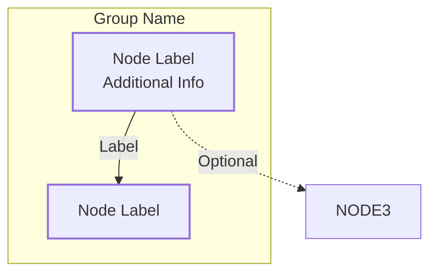

# 23. Documentation Maintenance

[← Back to Table of Contents](00-TOC.md)

This guide explains how to maintain and update the Tvheadend architecture documentation to ensure it remains accurate, useful, and synchronized with the codebase.

---

## 23.1 When to Update Documentation

### 23.1.1 Mandatory Updates

Documentation MUST be updated when:

**Architectural Changes:**
- New subsystems are added to Tvheadend
- Existing subsystems undergo significant redesign
- Threading model changes (new threads, different locking strategy)
- Data flow patterns change
- Major refactoring that affects system structure

**API Changes:**
- New public APIs are added
- Existing APIs change signatures or behavior
- Configuration object structures change
- Protocol changes (HTSP, SAT>IP, etc.)

**Breaking Changes:**
- Locking hierarchy changes
- Synchronization primitive usage changes
- Service lifecycle changes
- Streaming message format changes

**New Features:**
- New input types (e.g., new hardware support)
- New output protocols
- New streaming features (e.g., new profile types)
- New DVR capabilities
- New EPG sources

### 23.1.2 Recommended Updates

Documentation SHOULD be updated when:

**Clarifications Needed:**
- Developers report confusion about existing documentation
- Common mistakes indicate unclear documentation
- New pitfalls are discovered
- Better examples are available

**Minor Changes:**
- Bug fixes that reveal architectural misunderstandings
- Performance optimizations that change behavior
- Configuration options added or changed
- Error handling improvements

**Improvements:**
- Better diagrams become available
- More accurate descriptions are possible
- Additional examples would be helpful
- Cross-references can be improved

### 23.1.3 Optional Updates

Documentation MAY be updated when:

**Enhancements:**
- Additional details would be helpful
- Alternative explanations could aid understanding
- More code examples would be useful
- Additional diagrams would clarify concepts

**Maintenance:**
- Formatting improvements
- Typo corrections
- Link updates
- Consistency improvements

---

## 23.2 Update Process

### 23.2.1 Planning the Update

**Step 1: Identify Scope**
- Determine which sections are affected
- List specific changes needed
- Identify new sections required
- Note sections that may need removal

**Step 2: Review Current Documentation**
- Read affected sections thoroughly
- Check for related content in other sections
- Identify cross-references that need updating
- Note any existing issues or gaps

**Step 3: Gather Information**
- Review source code changes
- Examine commit messages and pull requests
- Test new features if applicable
- Consult with developers who made changes

**Step 4: Plan Diagrams**
- Identify diagrams that need updating
- Determine if new diagrams are needed
- Sketch diagram changes
- Ensure diagram consistency with existing style

### 23.2.2 Making Changes

**Step 1: Update Affected Sections**
- Make changes to section content
- Update code examples
- Revise structure definitions
- Update source file references

**Step 2: Update or Create Diagrams**
- Modify existing Mermaid diagrams
- Create new diagrams as needed
- Ensure consistent styling
- Validate diagram syntax

**Step 3: Update Cross-References**
- Update links between sections
- Add new cross-references as needed
- Verify all links work correctly
- Update "See also" references

**Step 4: Update Navigation**
- Update Table of Contents (00-TOC.md)
- Update section numbers if needed
- Update Previous/Next links
- Update ARCHITECTURE.md quick links

**Step 5: Update Version History**
- Add entry to Section 22 (Version History)
- Document what changed and why
- List affected sections
- Note any breaking changes

### 23.2.3 Review Process

**Self-Review Checklist:**
- [ ] All affected sections updated
- [ ] Diagrams accurate and consistent
- [ ] Code examples correct and tested
- [ ] Cross-references valid
- [ ] Navigation links work
- [ ] Table of Contents synchronized
- [ ] Version history updated
- [ ] No broken links
- [ ] Consistent formatting
- [ ] Clear and accurate language

**Peer Review:**
- Have another developer review changes
- Verify technical accuracy
- Check for clarity and completeness
- Validate examples and diagrams
- Ensure consistency with existing documentation

**Testing:**
- Render documentation in Markdown viewer
- Verify all Mermaid diagrams render correctly
- Click through all links
- Check formatting on different viewers
- Validate code examples compile/run

### 23.2.4 Committing Changes

**Commit Message Format:**
```
docs(architecture): Brief description of changes

- Detailed change 1
- Detailed change 2
- Detailed change 3

Affects sections: X, Y, Z
Closes: #issue-number (if applicable)
```

**Example:**
```
docs(architecture): Update threading model for new worker pool

- Add documentation for worker pool threads
- Update thread inventory table
- Add new synchronization primitives
- Update threading diagram

Affects sections: 4 (Threading Model), 20 (Known Issues)
Closes: #1234
```

---

## 23.3 Documentation Standards

### 23.3.1 Writing Style

**Clarity:**
- Use clear, concise language
- Avoid jargon unless necessary
- Define technical terms when first used
- Use active voice
- Be specific and precise

**Structure:**
- Use consistent heading hierarchy
- Break long sections into subsections
- Use lists for multiple items
- Use tables for structured data
- Use code blocks for code examples

**Tone:**
- Professional but approachable
- Assume reader has C programming knowledge
- Explain "why" not just "what"
- Provide context and rationale
- Acknowledge complexity when present

### 23.3.2 Formatting Conventions

**Headings:**
```markdown
## X. Major Section Title

### X.Y Subsection Title

#### X.Y.Z Sub-subsection Title
```

**Code Blocks:**
```markdown
**Location**: `src/file.c`, `src/file.h`

```c
// Code example with comments
struct example {
  int field;  // Field description
};
```
```

**Lists:**
```markdown
**Unordered:**
- Item 1
- Item 2
  - Sub-item 2.1
  - Sub-item 2.2

**Ordered:**
1. Step 1
2. Step 2
3. Step 3
```

**Emphasis:**
```markdown
- **Bold** for important terms and structure names
- *Italic* for emphasis
- `Code` for function names, variables, file paths
- MUST, SHOULD, MAY for requirement levels (RFC 2119)
```

**Links:**
```markdown
- [Section Title](XX-Section-File.md) for internal links
- [External Resource](https://example.com) for external links
- See Section X.Y for cross-references
```

### 23.3.3 Diagram Standards

**Mermaid Diagram Types:**
- **graph TB/LR**: Architecture and component diagrams
- **sequenceDiagram**: Interaction and data flow
- **stateDiagram-v2**: State machines and lifecycles
- **classDiagram**: Class hierarchies (rarely used)

**Diagram Style:**
```markdown

```

**Diagram Guidelines:**
- Use consistent colors for similar components
- Keep diagrams focused and not too complex
- Add legends when needed
- Use subgraphs for logical grouping
- Label all connections
- Use appropriate arrow types (solid, dashed, etc.)

### 23.3.4 Code Example Standards

**Structure Definitions:**
```c
/**
 * Brief description of structure
 *
 * Detailed explanation of purpose and usage
 */
struct example_t {
  int field1;              // Field description
  char *field2;            // Field description
  struct other *field3;    // Field description
};
```

**Function Examples:**
```c
/**
 * Brief description of function
 *
 * @param param1  Description of parameter
 * @param param2  Description of parameter
 * @return Description of return value
 */
int example_function(int param1, char *param2)
{
  // Implementation details
  return 0;
}
```

**Usage Examples:**
```c
// Example: How to use the API
tvh_mutex_lock(&global_lock);
service_t *s = service_find_by_uuid(uuid);
if (s) {
  // Do something with service
}
tvh_mutex_unlock(&global_lock);
```

---

## 23.4 Section-Specific Guidelines

### 23.4.1 Core Architecture Sections (1-7)

**Update Frequency:** Rarely (only for major architectural changes)

**Key Considerations:**
- These sections define fundamental concepts
- Changes here may require updates throughout documentation
- Ensure consistency with actual implementation
- Update diagrams to reflect current architecture

**Common Updates:**
- New subsystems added to architecture diagram
- Threading model changes
- New synchronization primitives
- Initialization sequence changes

### 23.4.2 Subsystem Sections (8-19)

**Update Frequency:** Occasionally (when subsystems change)

**Key Considerations:**
- Focus on subsystem-specific details
- Maintain consistency with core architecture
- Update when APIs or data structures change
- Keep examples current

**Common Updates:**
- New features in subsystem
- API changes
- Configuration changes
- Performance improvements

### 23.4.3 Development Sections (20-23)

**Update Frequency:** Regularly (as issues are discovered)

**Key Considerations:**
- Section 20 (Known Issues): Add new pitfalls as discovered
- Section 21 (Development Guidelines): Update as practices evolve
- Section 22 (Version History): Update with every documentation change
- Section 23 (Maintenance): Update as process improves

**Common Updates:**
- New pitfalls discovered
- Better debugging techniques
- Process improvements
- Tool updates

---

## 23.5 Quality Assurance

### 23.5.1 Accuracy Verification

**Source Code Validation:**
- Compare documentation against actual source code
- Verify structure definitions match headers
- Confirm function signatures are correct
- Validate file paths and locations

**Behavioral Validation:**
- Test code examples if possible
- Verify state machines match implementation
- Confirm data flow diagrams are accurate
- Validate locking rules against code

**Cross-Reference Validation:**
- Verify all internal links work
- Check external links are still valid
- Ensure section references are correct
- Validate diagram references

### 23.5.2 Completeness Check

**Coverage:**
- All major subsystems documented
- All public APIs covered
- All configuration objects explained
- All protocols described

**Depth:**
- Sufficient detail for understanding
- Examples provided where helpful
- Diagrams illustrate complex concepts
- Edge cases and pitfalls noted

**Consistency:**
- Terminology used consistently
- Formatting consistent throughout
- Diagram styles consistent
- Navigation consistent

### 23.5.3 Readability Review

**Clarity:**
- Concepts explained clearly
- Technical terms defined
- Examples aid understanding
- Diagrams enhance comprehension

**Organization:**
- Logical flow between sections
- Appropriate section granularity
- Good use of headings and lists
- Easy to navigate

**Accessibility:**
- Appropriate for target audience
- Not too basic, not too advanced
- Assumes reasonable prerequisites
- Provides paths for different readers

---

## 23.6 Tools and Resources

### 23.6.1 Markdown Editors

**Recommended Tools:**
- **Visual Studio Code** with Markdown extensions
- **Typora** for WYSIWYG editing
- **Obsidian** for linked note-taking
- **GitHub** web editor for quick changes

**Useful Extensions:**
- Markdown Preview Enhanced
- Mermaid Preview
- Markdown Lint
- Spell Checker

### 23.6.2 Diagram Tools

**Mermaid:**
- **Live Editor**: https://mermaid.live
- **Documentation**: https://mermaid-js.github.io/mermaid/
- **Examples**: https://mermaid-js.github.io/mermaid/#/examples

**Tips:**
- Use live editor to test diagrams
- Export diagrams for backup
- Keep diagram source in documentation
- Test rendering in target environment

### 23.6.3 Validation Tools

**Link Checking:**
- `markdown-link-check` npm package
- GitHub Actions for automated checking
- Manual verification in rendered view

**Spell Checking:**
- Built-in editor spell checkers
- `aspell` or `hunspell` for command-line
- Custom dictionary for technical terms

**Markdown Linting:**
- `markdownlint` for style consistency
- Configure rules for project standards
- Integrate with CI/CD pipeline

---

## 23.7 Common Maintenance Tasks

### 23.7.1 Adding a New Section

**When Needed:**
- New major subsystem added
- Existing section becomes too large
- New topic requires dedicated coverage

**Process:**
1. Determine section number and placement
2. Create new file: `XX-Section-Name.md`
3. Add section header and navigation links
4. Write section content
5. Update Table of Contents (00-TOC.md)
6. Update ARCHITECTURE.md
7. Update adjacent sections' navigation
8. Update Version History (22-Version-History.md)

**Template:**
```markdown
# XX. Section Title

[← Back to Table of Contents](00-TOC.md)

Brief introduction to this section...

---

## XX.1 First Subsection

Content...

## XX.2 Second Subsection

Content...

---

[← Previous](YY-Previous-Section.md) | [Table of Contents](00-TOC.md) | [Next →](ZZ-Next-Section.md)
```

### 23.7.2 Updating a Diagram

**When Needed:**
- Architecture changes
- New components added
- Relationships change
- Clarity improvements needed

**Process:**
1. Locate diagram in source
2. Copy to Mermaid live editor
3. Make changes
4. Test rendering
5. Update diagram in documentation
6. Verify rendering in target environment
7. Update diagram description if needed

### 23.7.3 Adding Code Examples

**When Needed:**
- New APIs introduced
- Complex concepts need illustration
- Common patterns should be documented
- Pitfalls need demonstration

**Process:**
1. Write example code
2. Test code compiles (if possible)
3. Add comments explaining key points
4. Format consistently
5. Add context before example
6. Explain what example demonstrates

### 23.7.4 Fixing Broken Links

**When Needed:**
- Files renamed or moved
- Sections renumbered
- External resources moved
- Regular maintenance

**Process:**
1. Identify broken links (manual or automated)
2. Determine correct target
3. Update link
4. Verify link works
5. Check for similar links elsewhere
6. Document in commit message

---

## 23.8 Versioning Strategy

### 23.8.1 Version Numbering

**Semantic Versioning:**
- **MAJOR.MINOR.PATCH** (e.g., 1.2.3)

**MAJOR version** increments when:
- Complete documentation restructure
- Major architectural changes documented
- Breaking changes in understanding
- Incompatible with previous version

**MINOR version** increments when:
- New sections added
- Significant content additions
- New subsystems documented
- Backward-compatible additions

**PATCH version** increments when:
- Bug fixes in documentation
- Clarifications and improvements
- Diagram updates
- Link fixes

### 23.8.2 Version History Format

**Entry Template:**
```markdown
## Version X.Y.Z - Brief Description

**Date:** YYYY-MM-DD  
**Status:** Draft | In Review | Complete

### Changes

**Added:**
- List of additions

**Modified:**
- List of modifications

**Removed:**
- List of removals

### Rationale

Explanation of why changes were made...

### Impact

Description of impact...

### Contributors

- Contributor names

### Notes

- Additional information
```

---

## 23.9 Collaboration Guidelines

### 23.9.1 Contributing Documentation

**For Contributors:**
1. Read this maintenance guide
2. Follow documentation standards
3. Test changes before submitting
4. Provide clear commit messages
5. Update version history
6. Request review from maintainers

**For Reviewers:**
1. Verify technical accuracy
2. Check formatting consistency
3. Test all links and diagrams
4. Ensure clarity and completeness
5. Validate against source code
6. Provide constructive feedback

### 23.9.2 Issue Reporting

**Documentation Issues:**
- Report inaccuracies in issue tracker
- Provide specific section references
- Include source code references if applicable
- Suggest corrections if possible

**Issue Template:**
```markdown
**Section:** XX. Section Name
**Issue Type:** Inaccuracy | Unclear | Missing | Broken Link
**Description:** Detailed description of issue
**Source Reference:** src/file.c:line (if applicable)
**Suggested Fix:** Proposed correction (optional)
```

---

## 23.10 Future Improvements

### 23.10.1 Planned Enhancements

**Short Term:**
- Automated link checking in CI/CD
- Spell checking automation
- Diagram validation
- Cross-reference validation

**Medium Term:**
- Interactive diagrams
- Code example testing
- Documentation coverage metrics
- Automated synchronization with source

**Long Term:**
- Generated API documentation integration
- Interactive tutorials
- Video walkthroughs
- Searchable documentation portal

### 23.10.2 Feedback and Suggestions

**How to Provide Feedback:**
- Open issues in GitHub repository
- Discuss in developer forums
- Submit pull requests with improvements
- Contact documentation maintainers

**What to Report:**
- Inaccuracies or errors
- Unclear explanations
- Missing information
- Suggestions for improvement
- New topics to cover

---

## 23.11 Maintenance Checklist

### 23.11.1 Regular Maintenance (Monthly)

- [ ] Check for broken external links
- [ ] Review recent code changes for documentation impact
- [ ] Update examples if APIs changed
- [ ] Fix reported issues
- [ ] Improve clarity based on feedback

### 23.11.2 Major Release Maintenance

- [ ] Review all sections for accuracy
- [ ] Update version numbers
- [ ] Regenerate all diagrams if needed
- [ ] Validate all cross-references
- [ ] Update version history
- [ ] Comprehensive review by team

### 23.11.3 Annual Review

- [ ] Complete documentation audit
- [ ] Identify gaps and missing topics
- [ ] Plan major improvements
- [ ] Update maintenance guidelines
- [ ] Review and update standards
- [ ] Assess documentation effectiveness

---

## 23.12 Contact and Support

### 23.12.1 Documentation Maintainers

For questions about documentation maintenance:
- Check GitHub repository for current maintainers
- Open issues for documentation problems
- Submit pull requests for improvements
- Join developer discussions

### 23.12.2 Resources

**Tvheadend Resources:**
- GitHub: https://github.com/tvheadend/tvheadend
- Forums: https://tvheadend.org/projects/tvheadend/boards
- Wiki: https://tvheadend.org/projects/tvheadend/wiki

**Documentation Resources:**
- Markdown Guide: https://www.markdownguide.org/
- Mermaid Documentation: https://mermaid-js.github.io/mermaid/
- RFC 2119 (Requirement Levels): https://www.ietf.org/rfc/rfc2119.txt

---

**Remember:** Good documentation is a living resource that evolves with the codebase. Regular maintenance ensures it remains valuable for developers and contributors.

---

[← Previous](22-Version-History.md) | [Table of Contents](00-TOC.md)
